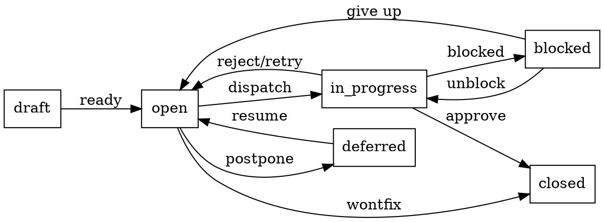

<!-- SPUR-MANAGED v=1 skill=spurpower-beads-lifecycle sha256=092a3a58809e39c40e4600487f1df63fb44854b2aea1fba77aaca5e259fa263d -->

# beads Lifecycle

## Overview

beads issues have a status state machine and a rich label vocabulary. Misusing either creates confusion: a worker sees `open` and starts work that another worker already began; a brain sees no `signal:*` labels and misses a scope drift.

**Core principle:** Status and labels are communication. Use them precisely.

## Status State Machine



### Status Semantics

| Status | Meaning | Who sets it |
|---|---|---|
| `draft` | Plan task not yet ready for dispatch | Brain or plan engine |
| `open` | Available for delegation, no worker active | Default / brain revert |
| `in_progress` | Worker dispatched, worktree exists | Orchestrator on delegation start |
| `blocked` | Waiting on dependency or signal resolution | Worker (via signal) or brain |
| `deferred` | Intentionally postponed, not abandoned | Brain |
| `closed` | Work complete and brain approved | Brain via `review_task` or explicit close |

**Critical rule:** Only the brain (or orchestrator acting on brain authority) transitions to `closed`. Workers MUST NOT close their own issues.

## Label Vocabulary

All labels use `[A-Za-z0-9_:-]+`. Max 50 chars at create time.

### Plan Scope Labels

| Label | Purpose | Set by |
|---|---|---|
| `spur:plan-id:<id>` | Plan ID scope | brain at submit |
| `spur:plan-task-id:<id>` | Task ID scope | brain at submit |
| `spur:plan-complete` | Epic fully persisted | server on epic creation |

### Delegation Labels

| Label | Purpose | Set by |
|---|---|---|
| `spur:agent:<name>` | Worker agent name | brain at submit |
| `spur:source-issue:<id>` | Source issue reference | server at submit |
| `delegation-id:<id>` | ACP delegation | reconciler on dispatch |

### Signal Labels

| Label | Purpose | Set by |
|---|---|---|
| `signal:<kind>` | Signal present | worker via MCP tool |
| `signal:<kind>:<bucket>` | Signal severity bucket | worker via MCP tool |
| `signal:late-arrival` | Signal after terminal | brain signal handler |

### Mutation Labels

| Label | Purpose | Set by |
|---|---|---|
| `spur:mutation-id:<compact-uuid>` | Mutation batch children | brain mutation executor |
| `spur:superseded-by:<child-id>` | Parent task split marker | brain mutation executor |
| `spur:signal-processed:<compact-uuid>` | Signal consumed marker | brain mutation executor |

### Review Labels

| Label | Purpose | Set by |
|---|---|---|
| `ready-for-review` | Explicit review-ready | reconciler on completion (**not yet wired**) |

## Transition Rules

### Orchestrator Auto-Transitions

The orchestrator performs these transitions automatically. Errors are logged at `warn` and never block delegation.

| Event | Transition | On failure |
|---|---|---|
| Delegation starts | `open` → `in_progress` + `assignee: <worker>` | Warn, continue |
| Delegation succeeds + approved | comment: "Completed by delegation {id}" | Warn, continue |
| Delegation rejected | `in_progress` → `open` + comment: "Rejected" | Warn, continue |
| Delegation failed | `in_progress` → `open` + comment: "Failed: {error}" | Warn, continue |
| Delegation cancelled | `in_progress` → `open` + comment: "Cancelled" | Warn, continue |

**Brain responsibility:** The orchestrator does NOT auto-close. The brain MUST explicitly call `update_issue(status: "closed")` when satisfied.

### Worker-Initiated Transitions

Workers SHOULD NOT directly change status except via signal emission. The orchestrator translates signals into transitions:

- `signal:blocked` → orchestrator MAY set `blocked` (if brain hasn't responded)
- `signal:scope_drift` → no auto-transition; brain decides

### Brain-Initiated Transitions

| Brain action | Required transition | Required label/comment |
|---|---|---|
| Approve task | None (orchestrator already commented) | Ensure `spur-audit` approval exists |
| Reject task | `in_progress` → `open` | `spur-audit` rejection comment with feedback |
| Close completed epic | `open`/`in_progress` → `closed` | Explicit close comment |
| Split task | Add `spur:superseded-by:<child>` to parent | Create child issues with `spur:plan-task-id` |

## Common Mistakes

| Mistake | Fix |
|---|---|
| Worker closes own issue | Revert. Only brain closes. |
| `in_progress` set before worktree exists | Race condition. Orchestrator sets this on dispatch. |
| `signal:*` label without `spur-signal` comment | Label alone is not enough. Comment carries structured data. |
| `spur-audit` comment without matching status | Audit says "Completed" but status is `open`. Fix status. |
| Multiple `spur:plan-id` labels on one issue | One plan per issue. Split if multi-plan. |

## Quick Reference

```
Creating issue:        status = open, labels = [spur:plan-id:X, spur:agent:Y]
Dispatching:           status = in_progress, assignee = worker_name
Blocked:               emit signal:blocked, orchestrator may set blocked
Completed:             orchestrator adds spur-audit completion comment
Approved:              brain reviews, no status change (brain closes later)
Rejected:              status = open, add spur-audit rejection comment
Closed:                status = closed, brain adds close comment
```
