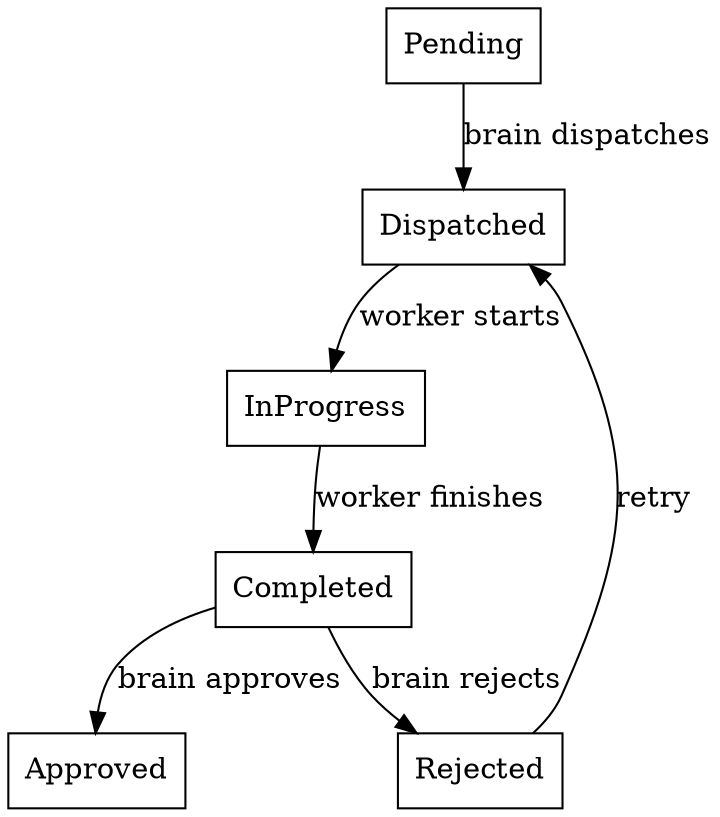

<!-- SPUR-MANAGED v=1 skill=spurpower-plan-task-discipline sha256=137018faa1bd304d701b582aa97b605cb464cc864af98f4b1a616536e7c5a20b -->

# Plan Task Discipline

## Overview

A plan is a DAG of tasks backed by beads issues. Violating DAG order causes parallel workers to collide. Modifying files outside your task poisons other workers' context. Ignoring dependency status wastes compute on tasks that cannot complete.

**Core principle:** Stay in your lane. Respect the DAG. Update beads at boundaries.

## Plan Task Lifecycle

### Status Semantics

| Status | Meaning | Who controls |
|---|---|---|
| `Pending` | Task exists but not yet dispatched | Orchestrator (deps not satisfied) |
| `Dispatched` | Delegation request sent to orchestrator | Orchestrator |
| `InProgress` | Worker active in worktree | Orchestrator / worker |
| `Completed` | Worker finished, awaiting review | Worker / orchestrator |
| `Approved` | Brain approved, task done | Brain |
| `Rejected` | Brain rejected, task reverted | Brain |

**Critical:** The orchestrator advances `Pending → Dispatched → InProgress → Completed`. The brain advances `Completed → Approved/Rejected`.

## For Brain Agents: Dispatch Rules

### Before Dispatching a Plan Task

1. Verify all `depends_on` tasks are `Approved`.
2. If a dependency is `Rejected`, do NOT dispatch downstream tasks. Re-plan first.
3. Verify the task's beads issue has `spur:plan-id:<id>` and `spur:plan-task-id:<task_id>`.

### During Plan Execution

1. Poll `get_plan_status` OR listen for `PlanCompleted` / `PlanReadyToMerge` events (when INV-7 is fixed).
2. Do not manually dispatch plan tasks that the orchestrator should auto-dispatch.
3. If a worker signals `scope_drift`, STOP the plan. Re-evaluate the DAG. The original task decomposition may be invalid.

## For Worker Agents: Task Boundaries

### Before Starting

1. Confirm your task status is `Dispatched` or `InProgress`.
2. If status is `Pending`, do NOT start. The orchestrator will dispatch when ready.
3. Check `depends_on` issues. If any are not `Approved`, signal `blocked` and stop.
4. Check for `spur:superseded-by:<child-id>` label. If present, this task is cancelled. Stop.

### During Work

1. Modify ONLY files within your task scope.
2. If you need to touch a file assigned to another task, signal `scope_drift` immediately.
3. Do NOT refactor "while you're here" in unrelated modules.
4. Do NOT change interfaces that other plan tasks depend on without explicit brain approval.

### After Completing

1. Ensure your work is committed in the worktree.
2. Do NOT merge to main or close the issue. The brain reviews and the orchestrator records.
3. If the orchestrator hasn't marked the task `Completed`, verify your output was captured.

## Dependency Rewriting

When a plan is submitted, `depends_on` references are rewritten from task IDs to beads issue IDs via `build_epic_subgraph`.

**Brain responsibility:** Use task IDs in the plan spec. The system maps them.
**Worker responsibility:** Verify dependencies by beads issue ID, not task ID.

## Parallel Execution Safety

| Hazard | Prevention |
|---|---|
| Two workers edit same file | Each worker's scope is defined by their task. Signal scope_drift if collision unavoidable. |
| Worker B depends on Worker A's output | Enforced by DAG. Orchestrator dispatches B only after A is Approved. |
| Worker changes interface Worker C uses | Forbidden without brain approval. Signal risk if discovered. |
| Brain dispatches task before deps ready | Brain should verify, but orchestrator also enforces. |

## Terminal Plan States

A plan reaches terminal state when:
- All tasks are `Approved` → success, emit `PlanReadyToMerge`
- Any task is `Rejected` and `max_review_retries` exhausted → failure
- All reachable tasks are terminal and unreachable tasks remain `Pending` → partial success

**Brain action on terminal state:**
1. Review all `Approved` tasks.
2. Merge approved work.
3. Explicitly close beads epic with `update_issue(status: "closed")`.
4. Re-plan rejected tasks as new epics if needed.

## Red Flags — STOP

- Worker starts before status is `Dispatched` → STOP. Wait for orchestrator.
- About to modify a file in another task's scope → STOP. Signal scope_drift.
- Dependency is not `Approved` but you're starting anyway → STOP. Signal blocked.
- Task has `spur:superseded-by` label but you're working on it → STOP. Task is cancelled.
- Plan has circular dependencies → STOP. Re-plan before submission.

## Cross-References

- **spur-way** — beads-first invariant
- **beads-lifecycle** — Issue status semantics and transitions
- **worker-signals** — How to communicate blockers and scope drift
- **brain-delegation** — Dispatch decisions and delegation_plan structure
