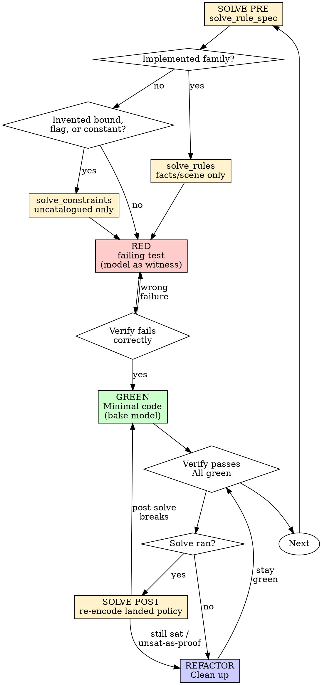

<!-- SPUR-MANAGED v=1 skill=test-driven-development sha256=6b58ad9036cdc3c0853b138a6eec1e3c99865c9959bb67e5ecbfc3248cd42b1e -->

# Test-Driven Development (TDD)

## Overview

Write the test first. Watch it fail. Write minimal code to pass.

**Core principle:** If you didn't watch the test fail, you don't know if it tests the right thing.

**Violating the letter of the rules is violating the spirit of the rules.**

Every new development is a constraint problem until proven otherwise.
Runtime tests prove *this path*. `solve` proves *the rules hold for the
encoded domain* (or returns a concrete counterexample). Tests and solve
are complements — never substitutes.

The sat model is the TDD witness. GREEN bakes that model. Do not invent
the number, then test it.

**REQUIRED SUB-SKILL:** Use `solve`. Navigate with `solve_rule_spec` before
hand-encoding. If an implemented family rule applies, execute it with
`solve_rules` — the family already owns the formula; supply facts or scene
only. Use `solve_constraints` only when the catalog has no suitable rule.
Do not invent constants or collapse `unknown` / `timeout` into `unsat`.

## When to Use

**Always TDD:**
- New features
- Bug fixes
- Refactoring
- Behavior changes

**Always catalog-first on new development:**
Call `solve_rule_spec` before RED. Execute Z3 when a family matches **or**
the change chooses a bound, quota, flag, size, interval, or other value
you would otherwise invent.

**TDD-only** (no Z3) only when *both* are true:
- Catalog has no implemented hard rule for this behavior
- The test invents no bounded choice (pure path / error-string / wiring)

**Exceptions (ask your human partner):**
- Throwaway prototypes
- Generated code

Thinking "skip TDD just this once"? Stop. That's rationalization.
Thinking "this isn't constraint-shaped, skip solve"? Navigate the catalog
anyway. No match and no invented number is the only TDD-only path.

## The Iron Law

```
NO PRODUCTION CODE WITHOUT A FAILING TEST FIRST
NO INVENTED BOUNDED CHOICE WITHOUT A SAT MODEL FIRST
```

Family rules are already defined. Do not re-encode uniqueness, capacity,
RBAC, layout, or other catalog predicates as generic constraints.

Write code before the test? Delete it. Start over.

**No exceptions:**
- Don't keep it as "reference"
- Don't "adapt" it while writing tests
- Don't look at it
- Delete means delete

Implement fresh from tests. Period.

## Red-Green-Refactor (catalog → sat model → TDD)



### SOLVE PRE - Before RED

Do this before the failing test and before any production code.

1. Hard constraints only. Soft prefs wait for a feasible model.
2. `solve_rule_spec` first. Never hard-code a family or rule list; discover
   the current catalog. Execute only implemented hard rules. Advisory /
   `capability_unavailable` entries are guidance, not proof.
3. Catalog match: `solve_rules` with the family's facts or scene. Do **not**
   copy the formula into `solve_constraints`. The compiler already lowers it.
4. No catalog match, but a bounded choice exists: `solve_constraints`.
   Use `solve_smt` only when B′ cannot express the theory.
   **REQUIRED:** follow `solve` for routing, status semantics, and generic
   authoring. Do not duplicate that catalog here.
5. Act on status:

| status / outcome | TDD action |
|---|---|
| `sat` + model (`pass` / `solution`) | RED asserts the **predicate** and uses the model as the concrete witness. GREEN bakes model values — not a guessed optimum. |
| `unsat` on feasibility (`fail` / `infeasible`) | Stop. Report impossibility. Do **not** invent a constant or write a hopeful test. |
| `unsat` on assert-¬P (generic only) | Soundness proof for P. RED/GREEN still cover the runtime path. Do not apply assert-negation to `solve_rules` verify; the family owns that semantics. |
| `unknown` / `timeout` | Not a proof. Tighten encoding or raise timeout (≤60s). Never treat as `unsat`. |

Optional: `persist: true` when brain→worker handoff needs a `solve_id`
(worker reloads via `get_solve_result`; treat the model as authoritative).

**Do not** implement from the model alone. The model feeds the **test
contract**; RED still comes first for production code.

### RED - Write Failing Test

Write one minimal test showing what should happen.

When a sat model exists, assert the **solved predicate**, not a lucky input:

```rust
// After solve sat { workers: 4, batch: 40 } under budget 512:
#[test]
fn worker_pool_fits_memory_budget() {
    const WORKERS: u32 = 4;   // from sat model — RED fails until GREEN defines them
    const BATCH: usize = 40;
    assert!(WORKERS as usize * (48 + 2 * BATCH) <= 512);
}
```

When prove-none / overflow: if pre-solve returned `sat` on the unsafe
condition, use that model as the RED counterexample. If pre-solve returned
`unsat`, RED still covers the API path; the proof is the solve artifact.

<Good>
```typescript
test('retries failed operations 3 times', async () => {
  let attempts = 0;
  const operation = () => {
    attempts++;
    if (attempts < 3) throw new Error('fail');
    return 'success';
  };

  const result = await retryOperation(operation);

  expect(result).toBe('success');
  expect(attempts).toBe(3);
});
```
Clear name, tests real behavior, one thing. The `3` must come from a sat
model (or an explicit unsat-safe bound) — do not invent retry counts.
</Good>

<Bad>
```typescript
test('retry works', async () => {
  const mock = jest.fn()
    .mockRejectedValueOnce(new Error())
    .mockRejectedValueOnce(new Error())
    .mockResolvedValueOnce('success');
  await retryOperation(mock);
  expect(mock).toHaveBeenCalledTimes(3);
});
```
Vague name, tests mock not code, invented `3`
</Bad>

**Requirements:**
- One behavior
- Clear name
- Real code (no mocks unless unavoidable)
- Bounded choices taken from a sat model

### Verify RED - Watch It Fail

**MANDATORY. Never skip.**

```bash
npm test path/to/test.test.ts
```

Confirm:
- Test fails (not errors)
- Failure message is expected
- Fails because feature missing (not typos)

**Test passes?** You're testing existing behavior. Fix test.

**Test errors?** Fix error, re-run until it fails correctly.

### GREEN - Minimal Code

Write simplest code to pass the test.

Bake **only** values justified by the pre-solve model (or an explicit unsat
proof that a bound is safe). Do not invent a second constant "while you're
there."

<Good>
```typescript
async function retryOperation<T>(fn: () => Promise<T>): Promise<T> {
  for (let i = 0; i < 3; i++) {
    try {
      return await fn();
    } catch (e) {
      if (i === 2) throw e;
    }
  }
  throw new Error('unreachable');
}
```
Just enough to pass; `3` is the sat-model value
</Good>

<Bad>
```typescript
async function retryOperation<T>(
  fn: () => Promise<T>,
  options?: {
    maxRetries?: number;
    backoff?: 'linear' | 'exponential';
    onRetry?: (attempt: number) => void;
  }
): Promise<T> {
  // YAGNI
}
```
Over-engineered
</Bad>

Don't add features, refactor other code, or "improve" beyond the test.

### Verify GREEN - Watch It Pass

**MANDATORY.**

```bash
npm test path/to/test.test.ts
```

Confirm:
- Test passes
- Other tests still pass
- Output pristine (no errors, warnings)

**Test fails?** Fix code, not test.

**Other tests fail?** Fix now.

### SOLVE POST - After GREEN, when SOLVE PRE ran

Re-encode the **implemented** policy (same family rules or generic hard
constraints; numbers as they landed in code):

1. **Feasibility still sat** under the shipped constants and residual bounds.
2. **Safety still unsat** on assert-¬P when that was the generic proof.
3. Catalog verify still `pass`; a now-invalid snapshot still `fail` with the
   family diagnostic.
4. If post-solve **breaks**: treat as RED. Do **not** ship anyway or collapse
   `unknown` / `timeout` into success.

| Pre-solve | Post-solve | Meaning |
|---|---|---|
| sat model | still sat with baked consts | Implementation matches feasible region |
| unsat on ¬P / family fail | still unsat / fail | Invariant holds after the change |
| sat model | unsat on feasibility | You over-constrained GREEN — fix or re-solve |
| family fail / unsat on ¬P | sat counterexample | Bug or incomplete clamp — new failing test from the model |

Post-solve does **not** replace the green suite. It covers the symbolic
domain the suite cannot enumerate.

### REFACTOR - Clean Up

After green (and after post-solve when a solve ran):
- Remove duplication
- Improve names
- Extract helpers

Keep tests green. Don't add behavior. If refactor changes a bound, re-run
post-solve.

### Repeat

Next failing test for next behavior. Back through SOLVE PRE (catalog first).

## Good Tests

| Quality | Good | Bad |
|---------|------|-----|
| **Minimal** | One thing. "and" in name? Split it. | `test('validates email and domain and whitespace')` |
| **Clear** | Name describes behavior | `test('test1')` |
| **Shows intent** | Demonstrates desired API | Obscures what code should do |
| **Grounded** | Bounded values from a sat model | Invented 512 / 3 / 320 because they "feel right" |

## Why Order Matters

**"I'll write tests after to verify it works"**

Tests written after code pass immediately. Passing immediately proves nothing:
- Might test wrong thing
- Might test implementation, not behavior
- Might miss edge cases you forgot
- You never saw it catch the bug

Test-first forces you to see the test fail, proving it actually tests something.

**"I already manually tested all the edge cases"**

Manual testing is ad-hoc. You think you tested everything but:
- No record of what you tested
- Can't re-run when code changes
- Easy to forget cases under pressure
- "It worked when I tried it" ≠ comprehensive

Automated tests are systematic. They run the same way every time.

**"Deleting X hours of work is wasteful"**

Sunk cost fallacy. The time is already gone. Your choice now:
- Delete and rewrite with TDD (X more hours, high confidence)
- Keep it and add tests after (30 min, low confidence, likely bugs)

The "waste" is keeping code you can't trust. Working code without real tests is technical debt.

**"TDD is dogmatic, being pragmatic means adapting"**

TDD IS pragmatic:
- Finds bugs before commit (faster than debugging after)
- Prevents regressions (tests catch breaks immediately)
- Documents behavior (tests show how to use code)
- Enables refactoring (change freely, tests catch breaks)

"Pragmatic" shortcuts = debugging in production = slower.

**"Tests after achieve the same goals - it's spirit not ritual"**

No. Tests-after answer "What does this do?" Tests-first answer "What should this do?"

Tests-after are biased by your implementation. You test what you built, not what's required. You verify remembered edge cases, not discovered ones.

Tests-first force edge case discovery before implementing. Tests-after verify you remembered everything (you didn't).

30 minutes of tests after ≠ TDD. You get coverage, lose proof tests work.

## Common Rationalizations

| Excuse | Reality |
|--------|---------|
| "Too simple to test" | Simple code breaks. Test takes 30 seconds. |
| "I'll test after" | Tests passing immediately prove nothing. |
| "Tests after achieve same goals" | Tests-after = "what does this do?" Tests-first = "what should this do?" |
| "Already manually tested" | Ad-hoc ≠ systematic. No record, can't re-run. |
| "Deleting X hours is wasteful" | Sunk cost fallacy. Keeping unverified code is technical debt. |
| "Keep as reference, write tests first" | You'll adapt it. That's testing after. Delete means delete. |
| "Need to explore first" | Fine. Throw away exploration, start with TDD. |
| "Test hard = design unclear" | Listen to test. Hard to test = hard to use. |
| "TDD will slow me down" | TDD faster than debugging. Pragmatic = test-first. |
| "Manual test faster" | Manual doesn't prove edge cases. You'll re-test every change. |
| "Existing code has no tests" | You're improving it. Add tests for existing code. |
| "This isn't constraint-shaped, skip solve" | Catalog-first on every new development. TDD-only only if no family and no invented number. |
| "I'll re-encode the family rule in solve_constraints" | Family already owns the formula. Use `solve_rules`. |
| "I know the constant, skip Z3" | The sat model is the witness. Knowing is inventing. |
| "Solve is enough, skip the failing test" | Solve is symbolic. Runtime path still needs RED→GREEN. |
| "Tests are green, skip post-solve" | Suite samples points; post-solve re-proves the domain claim. |
| "I'll pick 512, it feels right" | Bounded choice → pre-solve. No voodoo constants. |
| "unsat means the solver failed" | `unsat` is a result (impossibility or soundness proof). Not an error. |
| "unknown/timeout ≈ unsat" | Never. Unknown means you do not know. |

## Red Flags - STOP and Start Over

- Code before test
- Test after implementation
- Test passes immediately
- Can't explain why test failed
- Tests added "later"
- Rationalizing "just this once"
- "I already manually tested it"
- "Tests after achieve the same purpose"
- "It's about spirit not ritual"
- "Keep as reference" or "adapt existing code"
- "Already spent X hours, deleting is wasteful"
- "TDD is dogmatic, I'm being pragmatic"
- "This is different because..."
- Skipped `solve_rule_spec` on a new development
- Re-encoded a catalog rule as generic constraints
- Invented a bounded choice without SOLVE PRE
- Claimed "safe for all inputs" without post-solve (or with only happy-path tests)
- Treated `unknown`/`timeout` as proof of safety
- Skipped RED because "solve already said sat"

**All of these mean: Delete code. Start over with TDD.** Re-run solve when
a bounded choice or family rule is in play.

## Example: Path-only bug (TDD-only)

**Bug:** Empty email accepted. Catalog has no rule; the test invents no bound.

**RED**
```typescript
test('rejects empty email', async () => {
  const result = await submitForm({ email: '' });
  expect(result.error).toBe('Email required');
});
```

**Verify RED**
```bash
$ npm test
FAIL: expected 'Email required', got undefined
```

**GREEN**
```typescript
function submitForm(data: FormData) {
  if (!data.email?.trim()) {
    return { error: 'Email required' };
  }
  // ...
}
```

**Verify GREEN** — `PASS`. No post-solve; no invented constant.

## Example: Catalog family (solve_rules → TDD)

**Change:** Reject duplicate active keys (NULLS DISTINCT).

**SOLVE PRE**
- `solve_rule_spec` → implemented hard rule `data_integrity.unique`
- Distinct keys + absent key: `solve_rules` verify → `sat` + `pass`
- Duplicate complete keys: `unsat` + `fail`, diagnostic
  `data_integrity.unique.violation`
- Do **not** re-encode uniqueness as generic constraints

**RED**
```rust
#[test]
fn unique_key_rejects_second_active_row_with_same_complete_key() {
    // insert key=1, insert key=1 again → rejected; NULLS DISTINCT still allows absent keys
}
```
Watch fail under current accept-duplicates behavior.

**GREEN**
Enforce the family predicate in the write path. Bake no extra constants.

**Verify GREEN** — suite green.

**SOLVE POST**
Re-run the same two family requests against the implemented snapshot:
distinct → `pass`; duplicate → `fail` with the same diagnostic.

## Example: Uncatalogued bound (solve_constraints → TDD)

**Change:** Raise persist cache cap 256→512 and ring-evict oldest when full
(count **and** byte budgets). No family encodes this dual quota.

**SOLVE PRE**
- Feasibility: `cap=512`, `total≤64MiB`, `count_after≤cap` after 1-evict+1-insert → **sat**
- Safety (assert-negation): `count_after≤cap ∧ count_after>cap` → **unsat**

**RED**
```rust
#[test]
fn persist_evicts_oldest_when_artifact_count_is_full() {
    // fill MAX_ARTIFACTS, persist one more → oldest gone, count still == MAX_ARTIFACTS
}
```
Watch fail under old reject-on-quota behavior.

**GREEN**
Bake `MAX_ARTIFACTS = 512` from the sat model and oldest-first eviction.

**Verify GREEN** — suite green.

**SOLVE POST**
- Re-encode shipped constants + ring policy → feasibility still **sat**
- Overflow assert-negation still **unsat**
- Single artifact `> 64MiB` still **reject** (sat with `reject=true`)

**REFACTOR** only if needed; stay green; re-post-solve if bounds move.

## Tests vs Solve (division of labor)

| Proof kind | Owner | Strength |
|---|---|---|
| This API path / this fixture | Unit/integration test (RED→GREEN) | Concrete, regression-safe |
| Catalog domain rule | `solve_rules` on an implemented family | Family-owned formula; sat/unsat + diagnostic |
| Uncatalogued bounded choice | `solve_constraints` sat model → test asserts predicate | Avoids voodoo numbers |
| "Impossible / safe for all" | `unsat` on ¬P or family `fail` | Complements, does not replace, path tests |

**Never:** skip RED because solve was sat. **Never:** skip post-solve because
tests were green when the claim is universal. **Never:** re-encode a family
rule by hand.

## Verification Checklist

Before marking work complete:

- [ ] Every new function/method has a test
- [ ] Watched each test fail before implementing
- [ ] Each test failed for expected reason (feature missing, not typo)
- [ ] Wrote minimal code to pass each test
- [ ] All tests pass
- [ ] Output pristine (no errors, warnings)
- [ ] Tests use real code (mocks only if unavoidable)
- [ ] Edge cases and errors covered
- [ ] `solve_rule_spec` ran for this development
- [ ] Family match → `solve_rules` (no hand-encoded duplicate formula)
- [ ] Uncatalogued bounded choice → `solve_constraints` sat model before RED
- [ ] GREEN baked model values or explicit unsat-safe bounds
- [ ] When a solve ran: SOLVE POST re-checked landed policy; status matches the claim (never treated `unknown`/`timeout` as proof)

Can't check all boxes? You skipped TDD or skipped solve. Start over.

## When Stuck

| Problem | Solution |
|---------|----------|
| Don't know how to test | Write wished-for API. Write assertion first. Ask your human partner. |
| Test too complicated | Design too complicated. Simplify interface. |
| Must mock everything | Code too coupled. Use dependency injection. |
| Test setup huge | Extract helpers. Still complex? Simplify design. |
| Don't know if a family applies | `solve_rule_spec` with summary, then one selector. Load `solve` for routing. |

## Debugging Integration

Bug found? Write failing test reproducing it. Follow TDD cycle. Test proves fix and prevents regression.

Never fix bugs without a test.

## Testing Anti-Patterns

When adding mocks or test utilities, read @testing-anti-patterns.md to avoid common pitfalls:
- Testing mock behavior instead of real behavior
- Adding test-only methods to production classes
- Mocking without understanding dependencies

## Related Skills

| Skill | Role relative to TDD |
|---|---|
| **`solve`** | Catalog routing, family execution, generic B-prime, status semantics. **REQUIRED** for SOLVE PRE / SOLVE POST. |
| **`verification-before-completion`** | Evidence before "done"; includes that suites actually ran. |
| **`systematic-debugging`** | Root-cause before fix; Phase 4 uses this TDD skill for the failing repro. |

## Final Rule

```
Production code → test exists and failed first
New development → catalog-first
Family match → solve_rules, then RED from the result
Bounded choice with no family → sat model, then RED from that model
Sat model / family outcome → GREEN bakes it; post-solve checks what landed
Otherwise → not TDD (and not symbolically grounded)
```

No exceptions without your human partner's permission.
