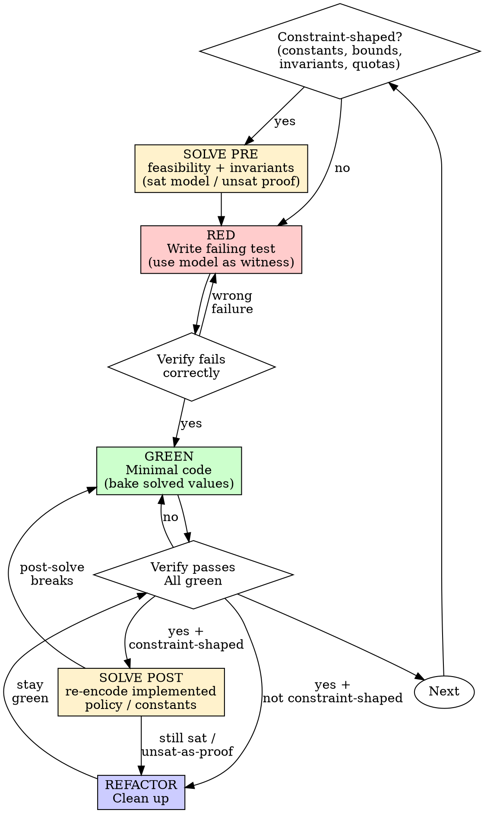

<!-- SPUR-MANAGED v=1 skill=test-driven-development sha256=f3d6e6364bef3356e981c666fddf7aa1453e8a3017257e10e6f99225c3c74d95 -->

# Test-Driven Development (TDD)

## Overview

Write the test first. Watch it fail. Write minimal code to pass.

**Core principle:** If you didn't watch the test fail, you don't know if it tests the right thing.

**Violating the letter of the rules is violating the spirit of the rules.**

**Constraint-shaped work adds a second proof:** runtime tests prove *this path*;
`solve` proves *the rules hold for the whole domain* (or returns a concrete
counterexample). Tests and solve are complements — never substitutes.

**REQUIRED SUB-SKILL (when constraint-shaped):** Use `solve` for pre-implement
feasibility / invariant discharge, then post-implement re-check. Navigate
catalog rules with `solve_rule_spec`, execute matches with `solve_rules`, and
fall back to `solve_constraints` for uncatalogued invariants. Do not invent
constants or collapse `unknown`/`timeout` into `unsat`.

## When to Use

**Always:**
- New features
- Bug fixes
- Refactoring
- Behavior changes

**Also pull in `solve` (pre → implement → post) when any of these apply:**
- Magic numbers, pool/buffer/retry sizes, layout dimensions, config caps
- Clamps, floors, budgets, quotas, ring/FIFO capacity, dual limits (count **and** bytes)
- "Prove no overflow / no conflict / no illegal state for all inputs in range"
- Feature-flag / RBAC / policy matrices that must stay consistent
- Need a concrete witness input for a RED test (sat model) or a proof none exists (unsat)

**Exceptions (ask your human partner):**
- Throwaway prototypes
- Generated code
- Configuration files (unless they encode multi-rule budgets — then solve)

Thinking "skip TDD just this once"? Stop. That's rationalization.
Thinking "skip solve, the tests cover it"? Only true if the test space is the whole domain. For universal bounds, solve first.

## The Iron Law

```
NO PRODUCTION CODE WITHOUT A FAILING TEST FIRST
```

**Constraint-shaped corollary:**

```
NO MAGIC CONSTANT / INVARIANT CLAIM WITHOUT A SOLVE ARTIFACT FIRST
(pre-solve before RED asserts the number; post-solve after GREEN bakes it)
```

Write code before the test? Delete it. Start over.

**No exceptions:**
- Don't keep it as "reference"
- Don't "adapt" it while writing tests
- Don't look at it
- Delete means delete

Implement fresh from tests. Period.

## Red-Green-Refactor (+ Solve when constraint-shaped)



### SOLVE PRE - Symbolic evaluate before RED (constraint-shaped only)

**When:** ≥2 simultaneous rules, a domain-wide invariant, or a constant you would otherwise invent.

**Do this before writing the failing test** (and before any production code):

1. Strip to **hard** constraints only (budgets, safety bounds, identity equations). Soft prefs wait for ratchet.
2. Call `solve_rule_spec` first when the facts may match a catalog family; execute an implemented match with `solve_rules`.
3. When no catalog rule applies, call `solve_constraints`; use `solve_smt` only when B′ cannot express the theory.
4. Interpret catalog requests by their mode outcome. For generic queries, act on status:

| status | TDD action |
|---|---|
| `sat` + model | RED asserts **feasibility predicates** (and optionally one concrete witness from the model). GREEN will bake model values — not a guessed golden optimum. |
| `unsat` on feasibility | Stop. Report impossibility. Do **not** invent a constant or write a hopeful test. |
| `unsat` on assert-¬P | Soundness proof for invariant P. RED/GREEN still cover the runtime path; post-solve will re-discharge. |
| `unknown` / `timeout` | Not a proof. Tighten encoding or raise timeout (≤60s). Never treat as `unsat`. |

Optional: `persist: true` when brain→worker handoff needs a `solve_id` (worker reloads via `get_solve_result`; treat model as authoritative).

**Do not** implement from the model alone. The model feeds the **test contract**; RED still comes first for production code.

### RED - Write Failing Test

Write one minimal test showing what should happen.

For constraint-shaped work, prefer tests that encode the **solved predicate**, not a one-off lucky input:

```rust
// After solve sat { workers: 4, batch: 40 } under budget 512:
#[test]
fn worker_pool_fits_memory_budget() {
    const WORKERS: u32 = 4;   // from solve model — RED fails until GREEN defines them
    const BATCH: usize = 40;
    assert!(WORKERS as usize * (48 + 2 * BATCH) <= 512);
}
```

When prove-none / overflow: if pre-solve returned `sat` on the unsafe condition, use that model as the RED counterexample. If pre-solve returned `unsat`, RED still covers the API path; the proof is the solve artifact.

<Good>
```typescript
test('retries failed operations 3 times', async () => {
  let attempts = 0;
  const operation = () => {
    attempts++;
    if (attempts < 3) throw new Error('fail');
    return 'success';
  };

  const result = await retryOperation(operation);

  expect(result).toBe('success');
  expect(attempts).toBe(3);
});
```
Clear name, tests real behavior, one thing
</Good>

<Bad>
```typescript
test('retry works', async () => {
  const mock = jest.fn()
    .mockRejectedValueOnce(new Error())
    .mockRejectedValueOnce(new Error())
    .mockResolvedValueOnce('success');
  await retryOperation(mock);
  expect(mock).toHaveBeenCalledTimes(3);
});
```
Vague name, tests mock not code
</Bad>

**Requirements:**
- One behavior
- Clear name
- Real code (no mocks unless unavoidable)

### Verify RED - Watch It Fail

**MANDATORY. Never skip.**

```bash
npm test path/to/test.test.ts
```

Confirm:
- Test fails (not errors)
- Failure message is expected
- Fails because feature missing (not typos)

**Test passes?** You're testing existing behavior. Fix test.

**Test errors?** Fix error, re-run until it fails correctly.

### GREEN - Minimal Code

Write simplest code to pass the test.

For constraint-shaped work: bake **only** values justified by the pre-solve model (or an explicit unsat proof that a bound is safe). Do not invent a second constant "while you're there."

<Good>
```typescript
async function retryOperation<T>(fn: () => Promise<T>): Promise<T> {
  for (let i = 0; i < 3; i++) {
    try {
      return await fn();
    } catch (e) {
      if (i === 2) throw e;
    }
  }
  throw new Error('unreachable');
}
```
Just enough to pass
</Good>

<Bad>
```typescript
async function retryOperation<T>(
  fn: () => Promise<T>,
  options?: {
    maxRetries?: number;
    backoff?: 'linear' | 'exponential';
    onRetry?: (attempt: number) => void;
  }
): Promise<T> {
  // YAGNI
}
```
Over-engineered
</Bad>

Don't add features, refactor other code, or "improve" beyond the test.

### Verify GREEN - Watch It Pass

**MANDATORY.**

```bash
npm test path/to/test.test.ts
```

Confirm:
- Test passes
- Other tests still pass
- Output pristine (no errors, warnings)

**Test fails?** Fix code, not test.

**Other tests fail?** Fix now.

### SOLVE POST - Symbolic re-check after GREEN (constraint-shaped only)

**When:** You baked constants, clamps, eviction policy, dual quotas, or any invariant claimed for all inputs.

Re-encode the **implemented** policy (same hard rules, numbers as they landed in code):

1. **Feasibility still sat** under the shipped constants and residual bounds.
2. **Safety still unsat** on assert-¬P (overflow, count > cap after ring write, flag conflict, …).
3. If post-solve **breaks** (unexpected `sat` on a safety query, or `unsat` on feasibility you claimed): treat as RED — fix code (or the encoding if it no longer matches the product rules). Do **not** "ship anyway" or collapse `unknown`/`timeout` into success.

| Pre-solve | Post-solve | Meaning |
|---|---|---|
| sat model | still sat with baked consts | Implementation matches feasible region |
| unsat on ¬P | still unsat on ¬P | Invariant holds after the change |
| sat model | unsat on feasibility | You over-constrained GREEN — fix or re-solve |
| unsat on ¬P | sat counterexample | Bug or incomplete clamp — new failing test from the model |

Post-solve does **not** replace the green suite. It covers the symbolic domain the suite cannot enumerate.

### REFACTOR - Clean Up

After green (and after post-solve when constraint-shaped):
- Remove duplication
- Improve names
- Extract helpers

Keep tests green. Don't add behavior. If refactor changes a bound, re-run post-solve.

### Repeat

Next failing test for next feature. Constraint-shaped next step? Back through SOLVE PRE.

## Good Tests

| Quality | Good | Bad |
|---------|------|-----|
| **Minimal** | One thing. "and" in name? Split it. | `test('validates email and domain and whitespace')` |
| **Clear** | Name describes behavior | `test('test1')` |
| **Shows intent** | Demonstrates desired API | Obscures what code should do |

## Why Order Matters

**"I'll write tests after to verify it works"**

Tests written after code pass immediately. Passing immediately proves nothing:
- Might test wrong thing
- Might test implementation, not behavior
- Might miss edge cases you forgot
- You never saw it catch the bug

Test-first forces you to see the test fail, proving it actually tests something.

**"I already manually tested all the edge cases"**

Manual testing is ad-hoc. You think you tested everything but:
- No record of what you tested
- Can't re-run when code changes
- Easy to forget cases under pressure
- "It worked when I tried it" ≠ comprehensive

Automated tests are systematic. They run the same way every time.

**"Deleting X hours of work is wasteful"**

Sunk cost fallacy. The time is already gone. Your choice now:
- Delete and rewrite with TDD (X more hours, high confidence)
- Keep it and add tests after (30 min, low confidence, likely bugs)

The "waste" is keeping code you can't trust. Working code without real tests is technical debt.

**"TDD is dogmatic, being pragmatic means adapting"**

TDD IS pragmatic:
- Finds bugs before commit (faster than debugging after)
- Prevents regressions (tests catch breaks immediately)
- Documents behavior (tests show how to use code)
- Enables refactoring (change freely, tests catch breaks)

"Pragmatic" shortcuts = debugging in production = slower.

**"Tests after achieve the same goals - it's spirit not ritual"**

No. Tests-after answer "What does this do?" Tests-first answer "What should this do?"

Tests-after are biased by your implementation. You test what you built, not what's required. You verify remembered edge cases, not discovered ones.

Tests-first force edge case discovery before implementing. Tests-after verify you remembered everything (you didn't).

30 minutes of tests after ≠ TDD. You get coverage, lose proof tests work.

## Common Rationalizations

| Excuse | Reality |
|--------|---------|
| "Too simple to test" | Simple code breaks. Test takes 30 seconds. |
| "I'll test after" | Tests passing immediately prove nothing. |
| "Tests after achieve same goals" | Tests-after = "what does this do?" Tests-first = "what should this do?" |
| "Already manually tested" | Ad-hoc ≠ systematic. No record, can't re-run. |
| "Deleting X hours is wasteful" | Sunk cost fallacy. Keeping unverified code is technical debt. |
| "Keep as reference, write tests first" | You'll adapt it. That's testing after. Delete means delete. |
| "Need to explore first" | Fine. Throw away exploration, start with TDD. |
| "Test hard = design unclear" | Listen to test. Hard to test = hard to use. |
| "TDD will slow me down" | TDD faster than debugging. Pragmatic = test-first. |
| "Manual test faster" | Manual doesn't prove edge cases. You'll re-test every change. |
| "Existing code has no tests" | You're improving it. Add tests for existing code. |
| "Solve is enough, skip the failing test" | Solve is symbolic. Runtime path still needs RED→GREEN. |
| "Tests are green, skip post-solve" | Suite samples points; post-solve re-proves the domain claim. |
| "I'll pick 512, it feels right" | ≥2 rules on that number → pre-solve. No voodoo constants. |
| "unsat means the solver failed" | `unsat` is a result (impossibility or soundness proof). Not an error. |
| "unknown/timeout ≈ unsat" | Never. Unknown means you do not know. |

## Red Flags - STOP and Start Over

- Code before test
- Test after implementation
- Test passes immediately
- Can't explain why test failed
- Tests added "later"
- Rationalizing "just this once"
- "I already manually tested it"
- "Tests after achieve the same purpose"
- "It's about spirit not ritual"
- "Keep as reference" or "adapt existing code"
- "Already spent X hours, deleting is wasteful"
- "TDD is dogmatic, I'm being pragmatic"
- "This is different because..."
- Invented a multi-rule constant without SOLVE PRE
- Claimed "safe for all inputs" without post-solve (or with only happy-path tests)
- Treated `unknown`/`timeout` as proof of safety
- Skipped RED because "solve already said sat"

**All of these mean: Delete code. Start over with TDD.** (And re-run solve if constraint-shaped.)

## Example: Bug Fix

**Bug:** Empty email accepted

**RED**
```typescript
test('rejects empty email', async () => {
  const result = await submitForm({ email: '' });
  expect(result.error).toBe('Email required');
});
```

**Verify RED**
```bash
$ npm test
FAIL: expected 'Email required', got undefined
```

**GREEN**
```typescript
function submitForm(data: FormData) {
  if (!data.email?.trim()) {
    return { error: 'Email required' };
  }
  // ...
}
```

**Verify GREEN**
```bash
$ npm test
PASS
```

**REFACTOR**
Extract validation for multiple fields if needed.

## Example: Constraint-Shaped Change (solve + TDD)

**Change:** Raise persist cache cap 256→512 and ring-evict oldest when full (count **and** byte budgets).

**SOLVE PRE**
- Feasibility: `cap=512`, `total≤64MiB`, `count_after≤cap` after 1-evict+1-insert → **sat**
- Safety (assert-negation): `count_after≤cap ∧ count_after>cap` → **unsat** (overflow impossible under policy)

**RED**
```rust
#[test]
fn persist_evicts_oldest_when_artifact_count_is_full() {
    // fill MAX_ARTIFACTS, persist one more → oldest gone, count still == MAX_ARTIFACTS
}
```
Watch fail under old reject-on-quota behavior.

**GREEN**
Bake `MAX_ARTIFACTS = 512` and oldest-first eviction under the existing lock.

**Verify GREEN** — suite green.

**SOLVE POST**
- Re-encode shipped constants + ring policy → feasibility still **sat**
- Overflow assert-negation still **unsat**
- Single artifact `> 64MiB` still **reject** (sat with `reject=true`)

**REFACTOR** only if needed; stay green; re-post-solve if bounds move.

## Tests vs Solve (division of labor)

| Proof kind | Owner | Strength |
|---|---|---|
| This API path / this fixture | Unit/integration test (RED→GREEN) | Concrete, regression-safe |
| All inputs in a bounded domain | `solve` (pre + post) | Symbolic; sat witness or unsat proof |
| Feasible constant choice | `solve` sat model → test asserts predicate | Avoids voodoo numbers |
| "Impossible / safe for all" | `solve` unsat on ¬P | Complements, does not replace, path tests |

**Never:** skip RED because solve was sat. **Never:** skip post-solve because tests were green when the claim is universal.

## Verification Checklist

Before marking work complete:

- [ ] Every new function/method has a test
- [ ] Watched each test fail before implementing
- [ ] Each test failed for expected reason (feature missing, not typo)
- [ ] Wrote minimal code to pass each test
- [ ] All tests pass
- [ ] Output pristine (no errors, warnings)
- [ ] Tests use real code (mocks only if unavoidable)
- [ ] Edge cases and errors covered
- [ ] **If constraint-shaped:** SOLVE PRE ran before inventing constants / before RED asserted them
- [ ] **If constraint-shaped:** GREEN baked model values or explicit unsat-safe bounds (no freehand magic numbers)
- [ ] **If constraint-shaped:** SOLVE POST re-checked implemented policy; status matches claim (`sat` / `unsat` as expected; never treated `unknown`/`timeout` as proof)

Can't check all boxes? You skipped TDD (or skipped solve on constraint-shaped work). Start over.

## When Stuck

| Problem | Solution |
|---------|----------|
| Don't know how to test | Write wished-for API. Write assertion first. Ask your human partner. |
| Test too complicated | Design too complicated. Simplify interface. |
| Must mock everything | Code too coupled. Use dependency injection. |
| Test setup huge | Extract helpers. Still complex? Simplify design. |

## Debugging Integration

Bug found? Write failing test reproducing it. Follow TDD cycle. Test proves fix and prevents regression.

Never fix bugs without a test.

## Testing Anti-Patterns

When adding mocks or test utilities, read @testing-anti-patterns.md to avoid common pitfalls:
- Testing mock behavior instead of real behavior
- Adding test-only methods to production classes
- Mocking without understanding dependencies

## Related Skills

| Skill | Role relative to TDD |
|---|---|
| **`solve`** | Symbolic pre/post for constants & invariants (this skill's SOLVE PRE / SOLVE POST). Load when constraint-shaped. |
| **`verification-before-completion`** | Evidence before "done"; includes that suites actually ran. |
| **`systematic-debugging`** | Root-cause before fix; Phase 4 uses this TDD skill for the failing repro. |

## Final Rule

```
Production code → test exists and failed first
Constraint-shaped constant/invariant → solve pre + post around that TDD cycle
Otherwise → not TDD (and not symbolically grounded)
```

No exceptions without your human partner's permission.
