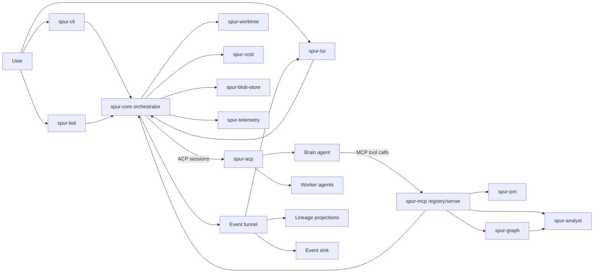

# SPUR Architecture

SPUR is a Rust workspace for running agentic software work under explicit process
control. A long-lived brain session reasons about a task, calls MCP tools to
inspect or delegate work, workers execute in isolated git worktrees, and the
orchestrator routes results through review, merge, retry, or rejection paths.

The current workspace contains 20 member crates under `crates/`, plus `xtask`.
`crates/spur-context-service` also lives in the repository but is excluded from
the main workspace because it tracks a newer DuckDB stack than the graph/analyst
path used by the core workspace.

## System overview

At a high level, the workspace is split into five concerns:

1. Control plane: session lifecycle, delegation, review, and plan scheduling.
2. Frontends: CLI, TUI, Telegram, and non-TUI bridges.
3. Execution infrastructure: worktree isolation, artifact storage, telemetry,
   licensing, and cost tracking.
4. Project intelligence: PM adapters, graph indexing, analyst queries, and
   local session analytics.
5. Supporting services: external package indexing and test/tooling crates.

## Core execution loop

The load-bearing path is:

1. A frontend submits a task into `spur-core`.
2. `spur-core` creates or resumes a brain session through `spur-acp`.
3. The brain reasons in ACP, but causes side effects by calling MCP tools
   exposed through `spur-mcp`.
4. Delegations become isolated worker runs: `spur-core` provisions a worktree
   through `spur-worktree`, starts a worker session through `spur-acp`, and
   collects notifications, diffs, and artifacts.
5. Worker outcomes enter a single event funnel inside `spur-core`, which stamps
   sequence numbers and timestamps before broadcasting to subscribers.
6. Read models such as executor lineage, TUI state, and durable event sinks are
   derived from that ordered event stream.
7. Review decisions feed back into the running delegation: approve/merge,
   modify/merge, reject/preserve worktree, retry, or timeout fallback.

Two protocol planes stay deliberately separate:

- ACP (`spur-acp`) is the outbound control channel from SPUR to agent sessions.
  It owns transports, session/config types, notifications, and compatibility
  adapters such as `stdio`, `cli_wrap`, `stream_json`, and native ACP.
- MCP is the inbound tool channel from the brain back into SPUR. `spur-mcp`
  provides the JSON-RPC server, tool registry, and module interface used by
  domain crates such as `spur-core`, `spur-pm`, `spur-graph`, and
  `spur-analyst`.

Within `spur-core`, the most important subsystems are:

- `orchestrator`, `scheduler`, `plan`, and `handlers` for session and plan flow
- `event_funnel`, `event_sink`, and `event_replay` for ordered event handling
- `lineage`, `plan_projection`, and `review_sink` for read models and review
- `notification_pump`, `notification_drain`, and `worker_server` for runtime
  coordination with agents and worker tools
- `skills`, `session_synopsis`, `outcome_materializer`, and `server` for
  higher-level orchestration support

## Workspace map

| Area | Crates | Responsibility |
|---|---|---|
| Entry points and UX | `spur-cli`, `spur-tui`, `spur-interactive`, `spur-bot` | User-facing command entrypoint, ratatui dashboard, non-TUI bridge, and Telegram runtime |
| Control plane | `spur-core`, `spur-acp`, `spur-mcp` | Orchestration, agent session transport, MCP registry/server, plans, review, and event flow |
| Execution infrastructure | `spur-worktree`, `spur-blob-store`, `spur-telemetry`, `spur-cost` | Worktree isolation, delegation artifacts, tracing/logging, pricing and cost tracking |
| PM and governance | `spur-pm`, `spur-license`, `spur-license-admin` | Issue/PR adapters, beads and GitHub backends, graph triage/planning tools, license policy and admin surface |
| Code and session intelligence | `spur-graph`, `spur-analyst`, `spur-context` | Worktree code graph, DuckDB-backed semantic/indexed queries, and local agent-session analytics |
| External package indexing support | `spur-context-source`, `spur-context-fetcher` | Source URL validation/rate limiting and archive fetch/normalization for external package indexing |
| Testing and tooling | `spur-test-madsim`, `xtask` | Simulation-heavy tests and repository automation |

Additional repository-local crate:

- `crates/spur-context-service`: AWS-backed external package indexing and
  serving service. It is intentionally excluded from the main workspace because
  it builds against a newer DuckDB/DuckLake stack than the main graph/analyst
  workspace.

## Key crate internals

The workspace is broad, but a few crates define most of the architectural
surface area.

### `spur-acp`

`spur-acp` is the agent communication substrate. Its top-level modules are
organized around adapters and domain types:

- `adapter`, `connection`, and `protocol` handle transport/runtime behavior
- `config`, `agents`, and `registry` load and select configured agents
- `domain`, `types`, `ext`, and `spur_agent_caps` define shared event and
  capability types
- `session_*`, `orphan_*`, `process_inspector`, and `profile_strategy` support
  lifecycle, liveness, and compatibility behavior around agent sessions

This crate is the common type boundary used by the CLI, TUI, orchestrator, and
MCP modules.

### `spur-mcp`

`spur-mcp` is intentionally small and generic. It provides:

- the JSON-RPC server/runtime in `server`
- tool registry and module composition in `registry`
- wire-level response/error types in `response`
- tool metadata/schema definitions in `tools` and `tool_schemas`

Domain crates plug into it by implementing `ToolModule`; `spur-mcp` itself does
not own plan logic, PM logic, or graph logic.

### `spur-pm`

`spur-pm` is the project-management facade used by the brain and orchestrator.
Its current structure includes:

- `service`, `adapter`, and `advanced` trait layers
- `beads_crate/` for the in-process beads backend
- `github` for GitHub-backed operations
- `graph`, `graph_engine`, and `mcp` for PM-adjacent planning/triage tools
- `sync`, `ingest`, `poll_cursor`, and locking utilities for reconciler-style
  flows

The beads path is no longer just a CLI shellout abstraction; the crate now owns
an in-process adapter with explicit WAL plus flock concurrency behavior.

### `spur-graph`

`spur-graph` is the worktree code-intelligence substrate. Its main modules are:

- `extract/` for tree-sitter extraction across supported languages
- `identity` and `content_hash` for stable symbol IDs and freshness hashes
- `schema` for the typed graph artifact model
- `store/` for Parquet artifacts and pointer files
- `query_client`, `selector`, `search`, `traversal`, and `validation` for
  navigation and verification
- `temporal` for rename/history tracking
- `mcp` for the `code_*` tool surface

This crate is where "what code exists, what calls what, and is the answer
fresh?" becomes a first-class workspace capability.

### `spur-analyst`

`spur-analyst` is a DuckDB-backed secondary index over graph and documentation
artifacts. Its module layout reflects that:

- `db`, `search`, and `embedding` for indexed query building
- `doc_nav` for documentation section search/navigation
- `pack` and `paths` for evidence packs, graph paths, and ranked context
- `mcp` for the semantic retrieval surface

In practice, this crate backs `knowledge_context_pack_2`, `doc_navigate`, and
read-only SQL over `.spur/analyst.duckdb`.

### `spur-context`

`spur-context` is separate from the code graph. It builds a local DuckDB
analytics database over agent session data and enriches it with cost data. Its
main modules are:

- `engine` for the blocking DuckDB engine and schema/view lifecycle
- `async_engine` for async access
- `reporter` for higher-level reports and aggregates
- `live` for polling-based session snapshots
- `extractors` for source-specific normalization

It currently normalizes multiple local agent data sources into a single query
surface and is consumed primarily by `spur-cli` and `spur-tui`.

## Code and session intelligence

SPUR has two distinct intelligence stacks:

### 1. Worktree code intelligence

This path is optimized for understanding the repository itself.

- `spur-graph` builds and incrementally refreshes a multi-language fact graph
  over the current worktree.
- `spur-analyst` loads graph and documentation artifacts into DuckDB for
  semantic evidence packs, doc search, path analysis, and risk/community
  queries.
- MCP tool surfaces expose both precise graph navigation (`code_*`) and
  semantic retrieval (`knowledge_context_pack_2`, `doc_navigate`, SQL queries).

The repository's own retrieval guidance is graph-first: orient with a knowledge
pack, follow with exact `code_*` reads/callers/callees, and use analyst SQL when
the question is set-shaped or ranked.

### 2. Local session analytics

This path is optimized for understanding agent usage and cost over time.

- `spur-context` normalizes heterogeneous agent logs into DuckDB views and
  caches
- `spur-cost` provides pricing data and cost bookkeeping
- `spur-tui` and `spur-cli` consume the resulting reports for insights and cost
  views

These two stacks are related, but they solve different problems: one answers
questions about code structure, the other answers questions about agent work and
spend.

## External package indexing

The repository also contains a second code-intelligence plane for code outside
the current worktree.

- `spur-context-source` validates agent-supplied source URLs, infers whether a
  fetch should use git or an archive flow, rejects unsafe/private targets, and
  applies lightweight caller rate limiting.
- `spur-context-fetcher` is the fetch/archive normalization runtime used by the
  external indexing flow; it validates sources, fetches git or tarball content,
  normalizes it into an archive, and persists it to object storage.
- `spur-context-service` layers an AWS service over that substrate. Its
  architecture separates an ingest plane (workers, Aurora/DynamoDB, bronze /
  silver / gold promotion) from a serving plane that answers external package
  queries from immutable DuckLake snapshots.

This service crate is intentionally adjacent to the main workspace rather than
fully inside it.

## Frontends and external repos

SPUR currently presents itself through several frontends:

- `spur-cli` is the main binary entry point
- `spur-tui` is the ratatui dashboard and interactive session UI
- `spur-interactive` is the bridge layer for non-TUI clients
- `spur-bot` is the Telegram runtime and command surface

The notebook frontend is no longer developed in this repository. `jute-notebook`
and the notebook-oriented UI source now live in the standalone
`getspur/spur-notebook` repository. This workspace consumes that work as an
external artifact and keeps `scripts/spur-pnpm` only as a compatibility wrapper
that forwards to a standalone notebook checkout when `SPUR_NOTEBOOK_REPO` is
set.

## Build, test, and development model

The project-standard cargo entry point is `scripts/spur-cargo`, not bare
`cargo`.

Architecturally, that script is part of the workspace contract:

- heavy compile commands (`build`, `check`, `test`, `doc`, `clean`, and cross
  builds) prefer a remote cloud-build path by default
- `clippy` is local-first unless `SPUR_REMOTE=1` forces remote execution
- `fmt` stays local
- `run` is remote by default and syncs worktree-relative output files back after
  execution
- `SPUR_REMOTE=0` or `SPUR_REMOTE=1` override routing per invocation

That wrapper lets the workspace keep large Rust, DuckDB, and cross-build
workloads out of fragile local `target/` directories while preserving a normal
developer-facing cargo interface.

## Where to drill down

This file is the top-level map. The deeper subsystem docs are:

- `docs/spur-core-architecture.md`
- `docs/architecture-spur-mcp.md`
- `docs/tui-architecture.md`
- `docs/spur-pm-beads-crate-architecture.md`
- `docs/spur-brain-worker-collaboration.md`
- `crates/spur-context/ARCHITECTURE.md`
- `crates/spur-graph/ARCHITECTURE.md`
- `crates/spur-context-service/docs/ARCHITECTURE.md`

Read those when you need subsystem-level invariants, state machines, concurrency
contracts, or service deployment detail.
