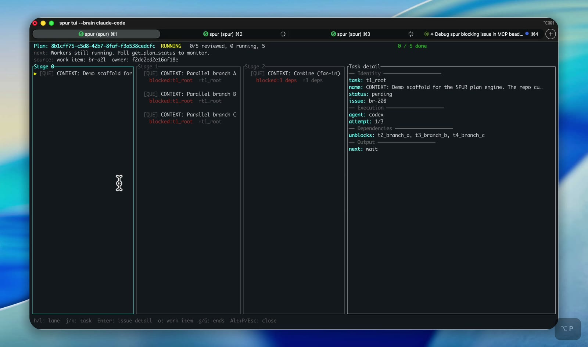
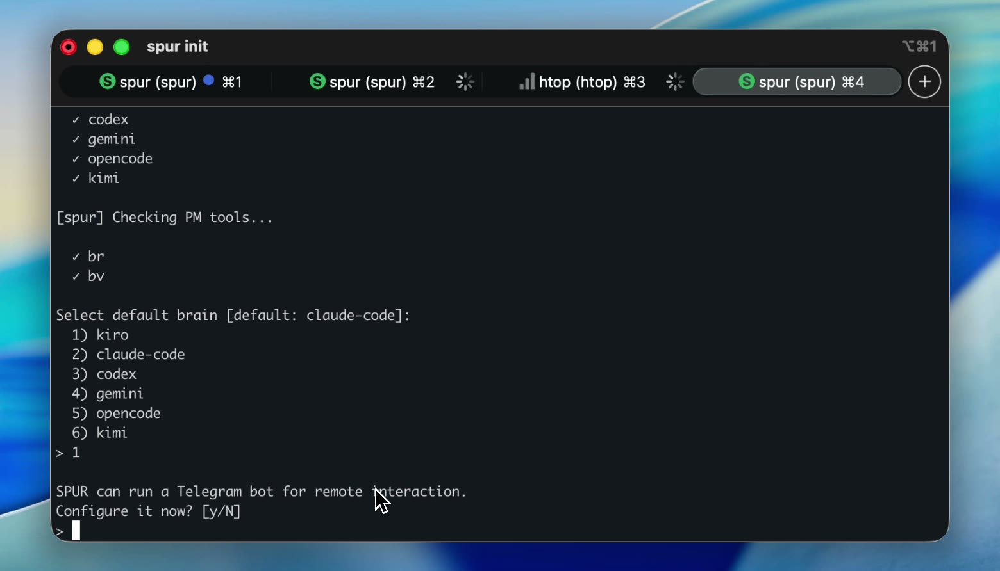
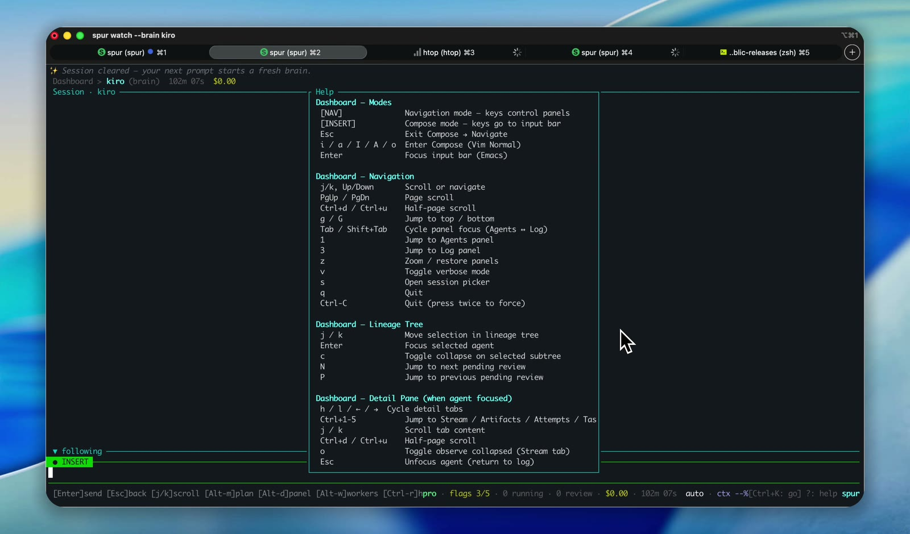
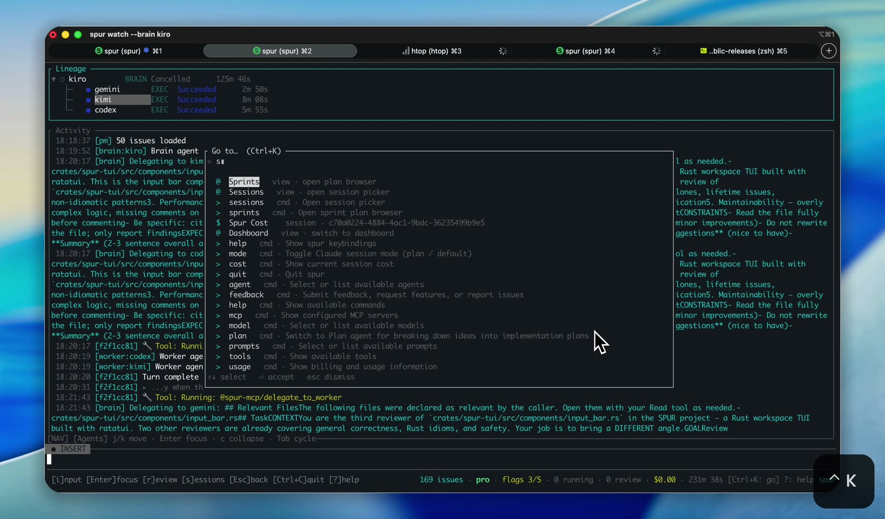
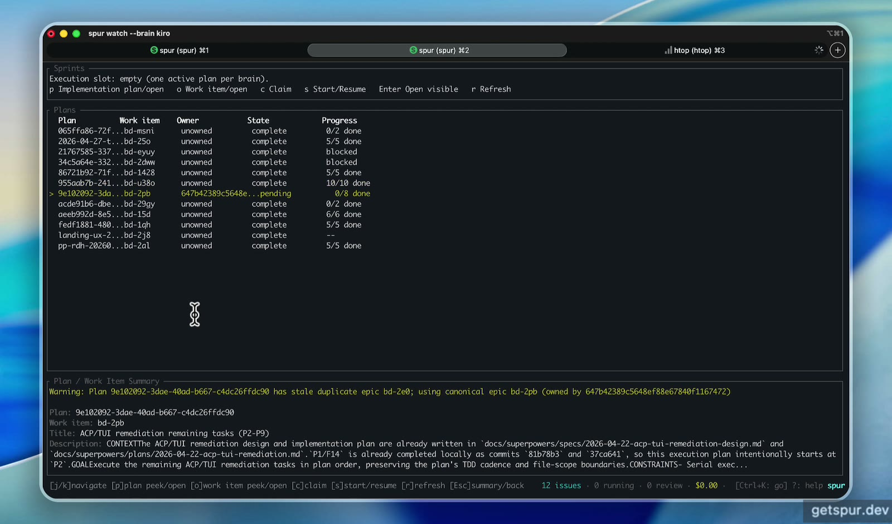
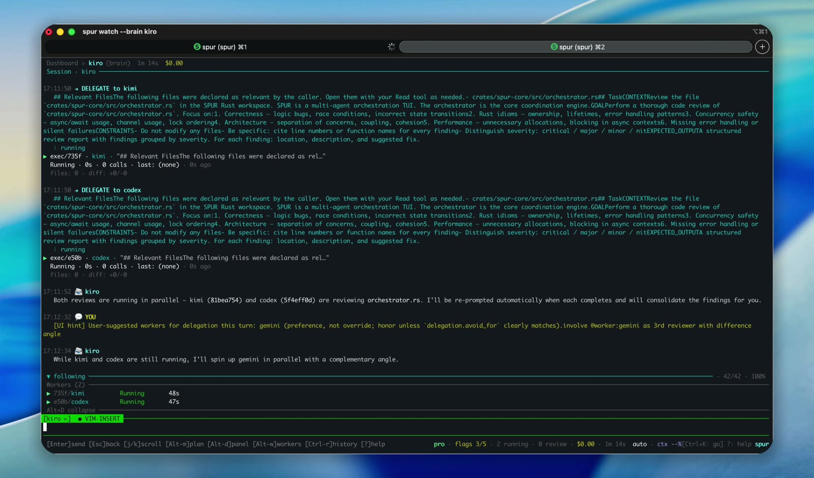
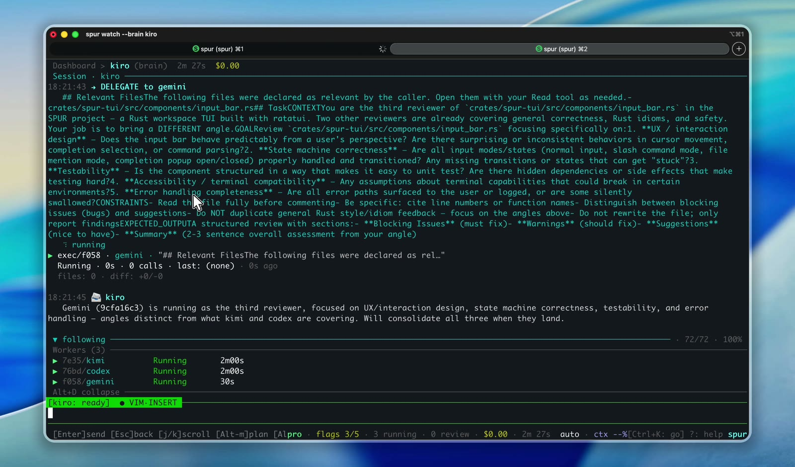
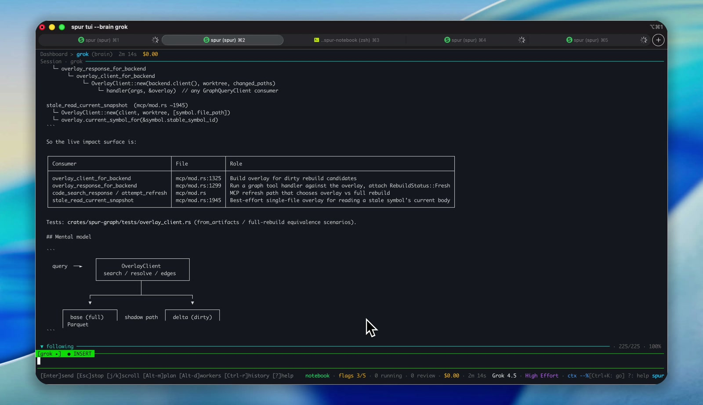
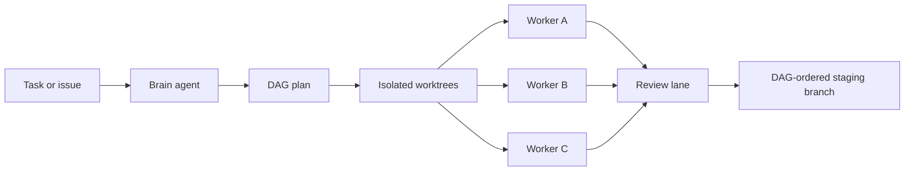

<h1 align="center">SPUR</h1>

<p align="center">
  <strong>The control tower for your CLI coding agents.</strong>
  <br />
  Plan with one agent. Delegate to many. Review every change in one terminal.
</p>

<p align="center">
  <a href="https://github.com/getspur/spur/actions/workflows/ci.yml"></a>
  <a href="https://www.npmjs.com/package/@getspur/spur-cli"></a>
  <a href="./Cargo.toml"></a>
  <a href="./LICENSE"></a>
</p>

<p align="center">
  <a href="https://getspur.dev">Website</a>
  ·
  <a href="./docs/user-docs">Documentation</a>
  ·
  <a href="#capability-demos">Demos</a>
  ·
  <a href="#quick-start">Quick start</a>
  ·
  <a href="./CONTRIBUTING.md">Contributing</a>
</p>

> [!WARNING]
> SPUR is early-stage software. APIs, configuration, and workflows may change while the project stabilizes.

## Featured demo

[](docs/demos/spur-dag-aware-multi-agent.webm)

<p align="center">
  <sub>
    <a href="./docs/demos/spur-dag-aware-multi-agent.webm">Watch the 85-second WebM demo</a>
    — a brain plans the work, parallel agents execute it, and SPUR brings every result back to one review lane.
  </sub>
</p>

## Why SPUR

Running one coding agent is simple. Running several across vendors, repositories, and worktrees quickly becomes an operations problem.

SPUR is a Rust-native terminal application that sits above the agents you already use. It turns a task or issue into a durable plan, delegates work into isolated git worktrees, streams progress into one TUI, and keeps a human in control of every change that reaches the staging branch.

| You need | SPUR gives you |
|---|---|
| One place to operate a mixed agent fleet | Claude Code, Codex, Gemini, Kimi, OpenCode, Kiro (partial), and generic ACP agents behind one interface |
| Safe parallel execution | One isolated git worktree per worker, with liveness checks and orphan cleanup |
| Review before integration | Approve, reject, modify, or retry every worker result from a shared review lane |
| Predictable merge order | DAG-aware plans and topological cherry-pick onto a staging branch |
| Durable sessions | Event replay, persisted plans, and content-addressed outcomes that survive restarts |
| Cross-vendor visibility | A unified cost ledger and analytics across supported agent CLIs |
| Code-aware delegation | A tree-sitter code graph with stable symbol identities and incremental rebuilds |
| Review away from the terminal | An optional Telegram frontend backed by the same orchestration state machine |

## Capability demos

Eight focused demos cover the full SPUR workflow in under eight minutes. Follow them in order for a guided tour, or jump directly to the capability you need.

### 1. Get productive

<table>
<tr>
<td width="50%" valign="top">
<a href="./docs/demos/spur-install-and-init.webm"></a>
<h4>Install, detect, initialize</h4>
<p>Install the npm package, let <code>spur init</code> discover agent and PM tools, choose a brain, review permission settings, and launch the TUI.</p>
<p><a href="./docs/demos/spur-install-and-init.webm">Watch the 1:10 demo →</a></p>
</td>
<td width="50%" valign="top">
<a href="./docs/demos/spur-help-and-shortcuts.webm"></a>
<h4>Learn the keyboard model</h4>
<p>Open the built-in help, understand navigation and compose modes, and learn the shortcuts for panels, lineage, review, and session control.</p>
<p><a href="./docs/demos/spur-help-and-shortcuts.webm">Watch the 8-second demo →</a></p>
</td>
</tr>
</table>

### 2. Control the workspace

<table>
<tr>
<td width="50%" valign="top">
<a href="./docs/demos/spur-session-navigation.webm"></a>
<h4>Navigate sessions and commands</h4>
<p>Open the session picker, return to prior work, inspect lineage, and use the universal command palette without leaving the keyboard.</p>
<p><a href="./docs/demos/spur-session-navigation.webm">Watch the 13-second demo →</a></p>
</td>
<td width="50%" valign="top">
<a href="./docs/demos/spur-tui-tour.webm"></a>
<h4>Tour the operating surfaces</h4>
<p>Move through the command palette, lineage and worker views, sprint browser, plan inspector, and the task detail surfaces used during real work.</p>
<p><a href="./docs/demos/spur-tui-tour.webm">Watch the 36-second demo →</a></p>
</td>
</tr>
</table>

### 3. Orchestrate real work

<table>
<tr>
<td width="50%" valign="top">
<a href="./docs/demos/spur-live-delegation.webm"></a>
<h4>Follow live delegation</h4>
<p>Watch a brain dispatch complementary reviews to multiple vendors, follow each worker in real time, and keep the active fleet visible in one terminal.</p>
<p><a href="./docs/demos/spur-live-delegation.webm">Watch the 1:26 demo →</a></p>
</td>
<td width="50%" valign="top">
<a href="./docs/demos/spur-kiro-brain-multi-agent.webm"></a>
<h4>Use Kiro as a cross-vendor brain</h4>
<p>Run Kiro as the orchestrator while Gemini, Kimi, and Codex inspect the same code from distinct angles, then bring their outcomes back for consolidation.</p>
<p><a href="./docs/demos/spur-kiro-brain-multi-agent.webm">Watch the 1:59 demo →</a></p>
</td>
</tr>
</table>

### 4. Explore code with `spur-graph`

[](./crates/spur-graph/assets/spur-graph-explore-code.webm)

<p align="center">
  <sub>
    <a href="./crates/spur-graph/assets/spur-graph-explore-code.webm">Watch the 33-second WebM demo</a>
    — resolve current source, follow consumers, and assemble a concrete impact model from graph-backed evidence. The <a href="./crates/spur-graph/README.md"><code>spur-graph</code> guide</a> covers the underlying pipeline and query surface.
  </sub>
</p>

> **DAG-aware planning and integration · 1:25.** The [featured demo above](./docs/demos/spur-dag-aware-multi-agent.webm) shows staged dependencies, parallel branches, plan inspection, and convergence into one review flow.

## Quick start

You need Git and at least one supported coding-agent CLI installed and authenticated.

```sh
npm install -g @getspur/spur-cli

cd your-project
spur init
spur
```

`spur init` discovers available agents and creates the project configuration under `.spur/`. Once the TUI opens, enter a task directly or select one from your project-management integration.

Validate the generated configuration at any time:

```sh
spur config check
```

Prefer not to install globally? Run SPUR through npm:

```sh
npx @getspur/spur-cli tui
```

## How it works



- The **brain** reasons about the task, chooses workers, and submits a plan.
- **Workers** execute bounded subtasks concurrently in isolated worktrees.
- SPUR records lineage, events, outcomes, and cost while work is running.
- The **review lane** keeps integration human-controlled; rejected work can retry with your feedback.
- Approved commits land on a staging branch in dependency order.

SPUR speaks [Agent Client Protocol](https://github.com/agentclientprotocol/agent-client-protocol) to agents and exposes delegation tools over MCP. It coordinates agents; it does not replace their in-session experience.

## Core capabilities

- **Cross-vendor brain switching.** Move orchestration between vendors when a model rate-limits or a different agent is a better fit.
- **Parallel and DAG-aware delegation.** Dispatch independent work concurrently while preserving dependency order.
- **Structured review and retry.** Every completion becomes a reviewable result with bounded Reflexion-style retries.
- **Local-first durability.** Plans, events, and outcomes remain inspectable on disk and recover after interruptions.
- **Unified analytics.** Read supported vendors' local session data into one DuckDB-backed cost and usage view.
- **Plan mutation.** Split, replace, or amend work while a plan is in flight.
- **Multi-brain safety.** Ownership and session checks prevent two orchestrators from mutating the same plan accidentally.
- **Code-graph context.** Stable symbol IDs, call edges, documentation sections, and incremental indexing support code-aware retrieval.

## Scope

SPUR is an orchestration and review layer for a fleet of coding agents.

It is not an IDE, chat client, CI/CD system, or fully autonomous “set and forget” engineer. The review gate is intentional. SPUR works alongside your editor, project-management tool, and agent subscriptions rather than replacing them.

Native project-management support currently covers [beads](https://github.com/steveyegge/beads) and GitHub Issues through `gh`.

## Configuration

Configuration lives in `.spur/config.toml`. Agent entries describe the executable, transport, role, permissions, cost tier, and delegation hints used by the brain when routing work.

- Start with [`spur init`](./docs/user-docs/00-getting-started.md).
- Browse the [example configuration](./.spur/config.toml.example).
- Read the [configuration guide](./docs/user-docs/05-configuration.md).

## Documentation

| Guide | What it covers |
|---|---|
| [Getting started](./docs/user-docs/00-getting-started.md) | Installation, initialization, and the first task |
| [Configuration](./docs/user-docs/05-configuration.md) | Per-repository agent and runtime settings |
| [Privacy](./docs/PRIVACY.md) | Telemetry tiers, retention, and opt-out controls |
| [OSS boundary](./docs/OSS_BOUNDARY.md) | What belongs in the public product repository |
| [Changelog](./CHANGELOG.md) | Unreleased and shipped changes |

## Development

Clone the repository, then use the workspace wrapper for Rust commands:

```sh
git clone https://github.com/getspur/spur.git
cd spur

scripts/spur-cargo build --workspace
scripts/spur-cargo test --workspace
scripts/spur-cargo clippy --workspace -- -D warnings
scripts/spur-cargo fmt --all
```

See [CONTRIBUTING.md](./CONTRIBUTING.md) for test tiers and contribution conventions.

<details>
<summary><strong>Workspace map</strong></summary>

| Crate | Responsibility |
|---|---|
| `spur-cli` | Binary entry point and CLI commands |
| `spur-core` | Orchestration, review, lineage, and the event pipeline |
| `spur-acp` | ACP clients, transports, capabilities, and event types |
| `spur-tui` | The `ratatui` terminal interface |
| `spur-mcp` | Delegation tools exposed to brain agents |
| `spur-context` | DuckDB analytics and agent-log extractors |
| `spur-cost` | Pricing registry and session ledger |
| `spur-graph` | Tree-sitter code graph and stable symbol identities |
| `spur-analyst` | DuckDB-backed graph and documentation analysis |
| `spur-worktree` | Worktree isolation, liveness, and cleanup |
| `spur-pm` | Project-management adapters |
| `spur-interactive` | Frontend bridge for non-TUI clients |
| `spur-bot` | Telegram frontend |
| `spur-blob-store` | Content-addressed delegation outcomes |
| `spur-license` / `spur-license-admin` | License and feature-key registry |

</details>

## Telemetry and privacy

Tier 1 crash diagnostics and performance telemetry are on by default; Tier 2 usage telemetry is opt-in.

Disable telemetry for one run:

```sh
SPUR_TELEMETRY=0 spur
```

Or disable it persistently:

```sh
spur telemetry disable all
```

See the [privacy documentation](./docs/PRIVACY.md) for collected fields, retention, and deletion steps.

## Community and license

Issues, feature requests, and pull requests are welcome. Start with [CONTRIBUTING.md](./CONTRIBUTING.md), open a [GitHub issue](https://github.com/getspur/spur/issues), or send product feedback through [getspur.dev/feedback](https://getspur.dev/feedback).

SPUR is licensed under the [GNU General Public License v3.0 only](./LICENSE) (`GPL-3.0-only`). The Community tier requires no license key; paid feature entitlements are separate from the source license.
