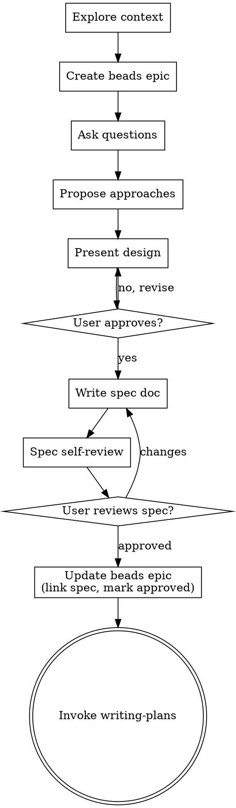

# SPUR Brainstorming — Ideas Into Beads-Tracked Designs

## Overview

In SPUR, design work is not ephemeral chat. It is work product that must be discoverable, reviewable, and retryable. Every design decision lives in beads or it does not exist.

**Core principle:** INTENT → DESIGN → RECORD. The design process itself is a beads epic.

Help turn ideas into fully formed designs and specs through natural collaborative dialogue. The output is an approved spec document **and** a beads epic that captures the design rationale, decisions, and approval state.

## The Iron Law

```
NO IMPLEMENTATION WITHOUT AN APPROVED SPEC AND A BEADS EPIC
```

Do NOT invoke any implementation skill, write any code, scaffold any project, or dispatch any worker until:
1. A design has been presented and the user has approved it
2. A beads epic exists tracking the design
3. The approved spec is written to `docs/superpowers/specs/`

This applies to EVERY project regardless of perceived simplicity.

## Anti-Pattern: "This Is Too Simple To Need A Design"

Every project goes through this process. A todo list, a single-function utility, a config change — all of them. "Simple" projects are where unexamined assumptions cause the most wasted work. The design can be short (a few sentences for truly simple projects), but you MUST present it, get approval, and record it in beads.

## SPUR Design Checklist

Complete these in order. Each step updates beads.

1. **Explore project context** — check files, docs, recent commits, existing beads issues
2. **Create beads epic** — `create_issue(title: "Design: <feature>", type: "epic", labels: ["spur:plan-id:<id>"])`. Status: `open`. This is the design's source of truth.
3. **Ask clarifying questions** — one at a time; record key constraints as beads comments with `spur-audit v1` kind: `plan-submit`
4. **Propose 2-3 approaches** — with trade-offs and your recommendation; record the chosen approach in a beads comment
5. **Present design** — in sections scaled to complexity; get user approval after each section
6. **Write design doc** — save to `docs/superpowers/specs/YYYY-MM-DD-<topic>-design.md` and link it in the beads epic comment
7. **Spec self-review** — placeholder scan, internal consistency, scope check, ambiguity check
8. **User reviews written spec** — ask user to review the spec file before proceeding
9. **Transition to writing-plans** — invoke the `writing-plans` skill to create a beads-backed implementation plan

## Process Flow



**The terminal state is invoking writing-plans.** Do NOT dispatch workers, invoke test-driven-development, or take any implementation action. The ONLY next step is writing-plans.

## The Process

### Understanding the Idea

- Check out the current project state first (files, docs, recent commits, existing beads issues)
- Before asking detailed questions, assess scope: if the request describes multiple independent subsystems (e.g., "build a platform with chat, file storage, billing, and analytics"), flag this immediately. Don't spend questions refining details of a project that needs decomposition first.
- If the project is too large for a single spec, help the user decompose into sub-epics: what are the independent pieces, how do they relate, what order should they be built? Each sub-epic gets its own design epic → spec → plan → implementation cycle.
- For appropriately-scoped projects, ask questions one at a time to refine the idea
- Prefer multiple choice questions when possible
- Focus on understanding: purpose, constraints, success criteria

### beads-First Design Tracking

**At step 2 (Create beads epic):**

```
create_issue(
  title: "Design: <feature name>",
  body: "Design epic for <feature>. Tracks design decisions, approach selection, and spec approval.",
  type: "epic",
  labels: ["spur:plan-id:<generate-uuid>"]
)
```

**During steps 3-5 (Questions, approaches, design):**

Record significant decisions as comments on the epic:

```
[[spur-audit v1]]
{
  "kind": "plan-submit",
  "plan_id": "<id>",
  "decision": "Chosen approach: <name>",
  "rationale": "<why>"
}
```

**At step 8 (Spec approved):**

Update the epic to mark design complete:

```
update_issue(
  status: "closed",
  comment: "Design approved. Spec: docs/superpowers/specs/<filename>.md. Ready for implementation plan."
)
```

### Exploring Approaches

- Propose 2-3 different approaches with trade-offs
- Present options conversationally with your recommendation and reasoning
- Lead with your recommended option and explain why
- Consider SPUR-specific constraints: which approach minimizes cross-task coupling? Which produces the clearest task boundaries for parallel workers?

### Presenting the Design

- Once you believe you understand what you're building, present the design
- Scale each section to its complexity
- Ask after each section whether it looks right so far
- Cover: architecture, components, data flow, error handling, testing
- **SPUR-specific:** Explicitly call out task decomposition boundaries. Which components can be built in parallel? Which have strict ordering dependencies? This informs the plan DAG later.
- Be ready to go back and clarify if something doesn't make sense

### Design for Isolation and Worker Context

- Break the system into smaller units that each have one clear purpose
- For each unit, you should be able to answer: what does it do, how do you use it, and what does it depend on?
- **SPUR-specific:** Each unit should map to a plausible plan task. If a unit is too large for a single worker session, split it further.
- Can someone understand what a unit does without reading its internals? Can you change the internals without breaking consumers? If not, the boundaries need work.
- Prefer smaller, well-bounded units — they are easier to reason about and produce more reliable worker outputs.

### Working in Existing Codebases

- Explore the current structure before proposing changes. Follow existing patterns.
- Where existing code has problems that affect the work, include targeted improvements as part of the design
- Don't propose unrelated refactoring. Stay focused on what serves the current goal.

## After the Design

### Documentation

- Write the validated design (spec) to `docs/superpowers/specs/YYYY-MM-DD-<topic>-design.md`
- Use clear, concise language
- Commit the design document to git

### Spec Self-Review

After writing the spec document, look at it with fresh eyes:

1. **Placeholder scan:** Any "TBD", "TODO", incomplete sections, or vague requirements? Fix them.
2. **Internal consistency:** Do any sections contradict each other? Does the architecture match the feature descriptions?
3. **Scope check:** Is this focused enough for a single implementation plan, or does it need decomposition into multiple epics?
4. **Ambiguity check:** Could any requirement be interpreted two different ways? If so, pick one and make it explicit.
5. ** beads-check:** Is every major decision recorded in the beads epic comments? If not, add them.

Fix any issues inline. No need to re-review — just fix and move on.

### User Review Gate

After the spec review loop passes, ask the user to review the written spec before proceeding:

> "Spec written and committed to `<path>`. The design epic `<issue_id>` tracks all decisions. Please review the spec and let me know if you want changes before we write the implementation plan."

Wait for the user's response. If they request changes, make them and re-run the spec review loop. Only proceed once the user approves.

### Transition to Implementation Planning

- Invoke the `writing-plans` skill to create a detailed, beads-backed implementation plan
- Pass the spec path and the closed design epic issue_id to writing-plans
- Do NOT invoke any other skill. writing-plans is the next step.

## Key Principles

- **One question at a time** — Don't overwhelm with multiple questions
- **Multiple choice preferred** — Easier to answer than open-ended when possible
- **YAGNI ruthlessly** — Remove unnecessary features from all designs
- **Explore alternatives** — Always propose 2-3 approaches before settling
- **Incremental validation** — Present design, get approval before moving on
- **Beads-first** — Every design decision is recorded in beads before implementation begins
- **Be flexible** — Go back and clarify when something doesn't make sense

## Cross-References

- **spur-way** — beads-first invariant and the three primitives
- **beads-lifecycle** — Status state machine and label semantics for the design epic
- **writing-plans** — Next skill in the chain; converts approved spec to beads-backed plan
- **brain-delegation** — How the brain dispatches workers after the plan is approved
- **plan-task-discipline** — DAG rules and task boundaries that the design must respect
