# Beads Export

*Generated: Fri, 17 Apr 2026 16:19:33 +07*

## Summary

| Metric | Count |
|--------|-------|
| **Total** | 28 |
| Open | 28 |
| In Progress | 0 |
| Blocked | 0 |
| Closed | 0 |

## Quick Actions

Ready-to-run commands for bulk operations:

```bash
# Close open items (28 total, showing first 10)
br close bd-2ta bd-ser bd-33r.1 bd-33r bd-2ta.2 bd-2ta.1 bd-ser.3 bd-ser.1 bd-eb7 bd-1uk

# View high-priority items (P0/P1)
br show bd-2ta bd-ser bd-33r.1 bd-33r bd-2ta.2 bd-2ta.1 bd-ser.3 bd-ser.1 bd-eb7 bd-1uk

```

## Table of Contents

- [🟢 bd-2ta Epic: GitHub Graph Intelligence](#bd-2ta-epic-github-graph-intelligence)
- [🟢 bd-ser Epic: Onboarding Experience](#bd-ser-epic-onboarding-experience)
- [🟢 bd-33r.1 UX-17: Graph-unavailable note in brain prompt](#bd-33r-1-ux-17-graph-unavailable-note-in-brain-prompt)
- [🟢 bd-33r Epic: Brain-Worker Collaboration UX](#bd-33r-epic-brain-worker-collaboration-ux)
- [🟢 bd-2ta.2 Implement GitHub issue dependency extraction](#bd-2ta-2-implement-github-issue-dependency-extraction)
- [🟢 bd-2ta.1 Research: Evaluate GitHub graph intelligence approaches](#bd-2ta-1-research-evaluate-github-graph-intelligence-approaches)
- [🟢 bd-ser.3 UX-1: Add context explanation to PM tools in init](#bd-ser-3-ux-1-add-context-explanation-to-pm-tools-in-init)
- [🟢 bd-ser.1 UX-3: Add example tasks to TUI splash screen](#bd-ser-1-ux-3-add-example-tasks-to-tui-splash-screen)
- [🟢 bd-eb7 Automatic issue_id injection for brain delegations](#bd-eb7-automatic-issue-id-injection-for-brain-delegations)
- [🟢 bd-1uk F13: Split-pane layout for issue detail overlay](#bd-1uk-f13-split-pane-layout-for-issue-detail-overlay)
- [🟢 bd-1mh.2 UX-14: retry_plan_task tool for plan amendment](#bd-1mh-2-ux-14-retry-plan-task-tool-for-plan-amendment)
- [🟢 bd-1mh.1 UX-13: Plan progress indicator in TUI status bar](#bd-1mh-1-ux-13-plan-progress-indicator-in-tui-status-bar)
- [🟢 bd-1mh Epic: Plan Execution UX](#bd-1mh-epic-plan-execution-ux)
- [🟢 bd-33r.4 UX-11: Surface PR URL in spur run output](#bd-33r-4-ux-11-surface-pr-url-in-spur-run-output)
- [🟢 bd-33r.3 UX-7: Per-executor cost display in lineage tree](#bd-33r-3-ux-7-per-executor-cost-display-in-lineage-tree)
- [🟢 bd-33r.2 UX-6: Single-agent delegation nudge in TUI](#bd-33r-2-ux-6-single-agent-delegation-nudge-in-tui)
- [🟢 bd-2ta.3 Label-based pseudo-tracks for GitHub plan ordering](#bd-2ta-3-label-based-pseudo-tracks-for-github-plan-ordering)
- [🟢 bd-ser.4 UX-5: First-run task suggestion that showcases delegation](#bd-ser-4-ux-5-first-run-task-suggestion-that-showcases-delegation)
- [🟢 bd-ser.2 UX-2: Add SPUR tagline to init output](#bd-ser-2-ux-2-add-spur-tagline-to-init-output)
- [🟢 bd-3tq GitHub Issues adapter for multi-PM support](#bd-3tq-github-issues-adapter-for-multi-pm-support)
- [🟢 bd-1op Polling-based issue refresh for live sync](#bd-1op-polling-based-issue-refresh-for-live-sync)
- [🟢 bd-3vd UX-18: Structured diff view in TUI](#bd-3vd-ux-18-structured-diff-view-in-tui)
- [🟢 bd-2wb UX-12: Batch get_issue tool for large plans](#bd-2wb-ux-12-batch-get-issue-tool-for-large-plans)
- [🟢 bd-2qu UX-10: Review UX in spur run mode](#bd-2qu-ux-10-review-ux-in-spur-run-mode)
- [🟢 bd-gi4 UX-4: Status bar metrics explanation](#bd-gi4-ux-4-status-bar-metrics-explanation)
- [🟢 bd-1mh.3 UX-15: Campaign summary report after plan completion](#bd-1mh-3-ux-15-campaign-summary-report-after-plan-completion)
- [🟢 bd-cdm Help overlay scrolling for small terminals](#bd-cdm-help-overlay-scrolling-for-small-terminals)
- [🟢 bd-1kn Issue sub-task tree view in TUI](#bd-1kn-issue-sub-task-tree-view-in-tui)

---

## Dependency Graph

```mermaid
graph TD
    classDef open fill:#50FA7B,stroke:#333,color:#000
    classDef inprogress fill:#8BE9FD,stroke:#333,color:#000
    classDef blocked fill:#FF5555,stroke:#333,color:#000
    classDef closed fill:#6272A4,stroke:#333,color:#fff

    bd-1kn["bd-1kn<br/>Issue sub-task tree view in TUI"]
    class bd-1kn open
    bd-1mh["bd-1mh<br/>Epic: Plan Execution UX"]
    class bd-1mh open
    bd-1mh1["bd-1mh.1<br/>UX-13: Plan progress indicator in TUI..."]
    class bd-1mh1 open
    bd-1mh2["bd-1mh.2<br/>UX-14: retry_plan_task tool for plan ..."]
    class bd-1mh2 open
    bd-1mh3["bd-1mh.3<br/>UX-15: Campaign summary report after ..."]
    class bd-1mh3 open
    bd-1op["bd-1op<br/>Polling-based issue refresh for live ..."]
    class bd-1op open
    bd-1uk["bd-1uk<br/>F13: Split-pane layout for issue deta..."]
    class bd-1uk open
    bd-2qu["bd-2qu<br/>UX-10: Review UX in spur run mode"]
    class bd-2qu open
    bd-2ta["bd-2ta<br/>Epic: GitHub Graph Intelligence"]
    class bd-2ta open
    bd-2ta1["bd-2ta.1<br/>Research: Evaluate GitHub graph intel..."]
    class bd-2ta1 open
    bd-2ta2["bd-2ta.2<br/>Implement GitHub issue dependency ext..."]
    class bd-2ta2 open
    bd-2ta3["bd-2ta.3<br/>Label-based pseudo-tracks for GitHub ..."]
    class bd-2ta3 open
    bd-2wb["bd-2wb<br/>UX-12: Batch get_issue tool for large..."]
    class bd-2wb open
    bd-33r["bd-33r<br/>Epic: Brain-Worker Collaboration UX"]
    class bd-33r open
    bd-33r1["bd-33r.1<br/>UX-17: Graph-unavailable note in brai..."]
    class bd-33r1 open
    bd-33r2["bd-33r.2<br/>UX-6: Single-agent delegation nudge i..."]
    class bd-33r2 open
    bd-33r3["bd-33r.3<br/>UX-7: Per-executor cost display in li..."]
    class bd-33r3 open
    bd-33r4["bd-33r.4<br/>UX-11: Surface PR URL in spur run output"]
    class bd-33r4 open
    bd-3tq["bd-3tq<br/>GitHub Issues adapter for multi-PM su..."]
    class bd-3tq open
    bd-3vd["bd-3vd<br/>UX-18: Structured diff view in TUI"]
    class bd-3vd open
    bd-cdm["bd-cdm<br/>Help overlay scrolling for small term..."]
    class bd-cdm open
    bd-eb7["bd-eb7<br/>Automatic issue_id injection for brai..."]
    class bd-eb7 open
    bd-gi4["bd-gi4<br/>UX-4: Status bar metrics explanation"]
    class bd-gi4 open
    bd-ser["bd-ser<br/>Epic: Onboarding Experience"]
    class bd-ser open
    bd-ser1["bd-ser.1<br/>UX-3: Add example tasks to TUI splash..."]
    class bd-ser1 open
    bd-ser2["bd-ser.2<br/>UX-2: Add SPUR tagline to init output"]
    class bd-ser2 open
    bd-ser3["bd-ser.3<br/>UX-1: Add context explanation to PM t..."]
    class bd-ser3 open
    bd-ser4["bd-ser.4<br/>UX-5: First-run task suggestion that ..."]
    class bd-ser4 open

    bd-1mh1 -.-> bd-1mh
    bd-1mh2 -.-> bd-1mh
    bd-1mh3 -.-> bd-1mh
    bd-2ta ==> bd-3tq
    bd-2ta1 -.-> bd-2ta
    bd-2ta2 -.-> bd-2ta
    bd-2ta2 ==> bd-2ta1
    bd-2ta3 -.-> bd-2ta
    bd-2ta3 ==> bd-2ta1
    bd-33r1 -.-> bd-33r
    bd-33r2 -.-> bd-33r
    bd-33r3 -.-> bd-33r
    bd-33r4 -.-> bd-33r
    bd-ser1 -.-> bd-ser
    bd-ser2 -.-> bd-ser
    bd-ser3 -.-> bd-ser
    bd-ser4 -.-> bd-ser
```



---

<a id="bd-2ta-epic-github-graph-intelligence"></a>

## 🚀 bd-2ta Epic: GitHub Graph Intelligence

| Property | Value |
|----------|-------|
| **Type** | 🚀 epic |
| **Priority** | 🔥 Critical (P0) |
| **Status** | 🟢 open |
| **Created** | 2026-04-17 09:03 |
| **Updated** | 2026-04-17 09:05 |
| **Labels** | github, graph, strategic |

### Description

CRITICAL STRATEGIC GAP: Graph intelligence (triage, plan, insights, alerts, subgraph) is the single most differentiating feature of SPUR vs Claude Code — but it's completely unavailable to GitHub-only users (~70% of the market). These users get 'Claude Code with delegation' — valuable but not differentiated enough to justify the learning curve. This epic explores and implements graph analysis for GitHub issues. Three approaches ranked by feasibility: (1) Parse 'blocked by #X' from issue bodies for lightweight dep graph, (2) GitHub→beads sync to reuse bv analysis, (3) Native graph engine in Rust (highest value, highest effort). Depends on bd-3tq (GitHub adapter).

### Dependencies

- ⛔ **blocks**: `bd-3tq`

<details>
<summary>📋 Commands</summary>

```bash
# Start working on this issue
br update bd-2ta -s in_progress

# Add a comment
br comment bd-2ta 'Your comment here'

# Change priority (0=Critical, 1=High, 2=Medium, 3=Low)
br update bd-2ta -p 1

# View full details
br show bd-2ta
```

</details>

---

<a id="bd-ser-epic-onboarding-experience"></a>

## 🚀 bd-ser Epic: Onboarding Experience

| Property | Value |
|----------|-------|
| **Type** | 🚀 epic |
| **Priority** | 🔥 Critical (P0) |
| **Status** | 🟢 open |
| **Created** | 2026-04-17 09:02 |
| **Updated** | 2026-04-17 09:02 |
| **Labels** | onboarding, ux |

### Description

New user onboarding is the most critical journey — every persona starts here. The current experience has no task examples on the splash screen, no explanation of PM tools during init, and no demonstration of delegation value. This epic addresses all P5 (new user) findings from the persona journey review (UX-1, UX-2, UX-3, UX-5). Target: first 10 minutes feel guided and showcase SPUR's value.

<details>
<summary>📋 Commands</summary>

```bash
# Start working on this issue
br update bd-ser -s in_progress

# Add a comment
br comment bd-ser 'Your comment here'

# Change priority (0=Critical, 1=High, 2=Medium, 3=Low)
br update bd-ser -p 1

# View full details
br show bd-ser
```

</details>

---

<a id="bd-33r-1-ux-17-graph-unavailable-note-in-brain-prompt"></a>

## 📋 bd-33r.1 UX-17: Graph-unavailable note in brain prompt

| Property | Value |
|----------|-------|
| **Type** | 📋 task |
| **Priority** | ⚡ High (P1) |
| **Status** | 🟢 open |
| **Created** | 2026-04-17 09:04 |
| **Updated** | 2026-04-17 09:04 |
| **Labels** | orchestrator, ux |

### Description

When bv is unavailable, the brain still calls graph_triage/graph_plan and gets hard MCP errors. The brain should know upfront that graph tools are unavailable. Add a note to the brain prompt in build_brain_prompt_v1: 'Note: Graph analysis tools (graph_triage, graph_plan, graph_insights, graph_alerts, graph_subgraph) are not available in this session.' Only inject when pm.analyzer() is None. File: crates/spur-core/src/orchestrator.rs build_brain_prompt_v1 or append_issue_and_task.

### Dependencies

- 🔗 **parent-child**: `bd-33r`

<details>
<summary>📋 Commands</summary>

```bash
# Start working on this issue
br update bd-33r.1 -s in_progress

# Add a comment
br comment bd-33r.1 'Your comment here'

# Change priority (0=Critical, 1=High, 2=Medium, 3=Low)
br update bd-33r.1 -p 1

# View full details
br show bd-33r.1
```

</details>

---

<a id="bd-33r-epic-brain-worker-collaboration-ux"></a>

## 🚀 bd-33r Epic: Brain-Worker Collaboration UX

| Property | Value |
|----------|-------|
| **Type** | 🚀 epic |
| **Priority** | ⚡ High (P1) |
| **Status** | 🟢 open |
| **Created** | 2026-04-17 09:03 |
| **Updated** | 2026-04-17 09:03 |
| **Labels** | orchestrator, ux |

### Description

Improve the brain-worker collaboration experience across personas. Covers: (1) Brain prompt should note when graph tools are unavailable (prevents confusing errors for GitHub users), (2) Single-agent users should be nudged to add a second agent (delegation is invisible otherwise), (3) Per-executor cost should be visible in the TUI lineage tree, (4) PR URLs from spur run should be surfaced in output. From persona journey review findings UX-6, UX-7, UX-11, UX-17.

<details>
<summary>📋 Commands</summary>

```bash
# Start working on this issue
br update bd-33r -s in_progress

# Add a comment
br comment bd-33r 'Your comment here'

# Change priority (0=Critical, 1=High, 2=Medium, 3=Low)
br update bd-33r -p 1

# View full details
br show bd-33r
```

</details>

---

<a id="bd-2ta-2-implement-github-issue-dependency-extraction"></a>

## 📋 bd-2ta.2 Implement GitHub issue dependency extraction

| Property | Value |
|----------|-------|
| **Type** | 📋 task |
| **Priority** | ⚡ High (P1) |
| **Status** | 🟢 open |
| **Created** | 2026-04-17 09:03 |
| **Updated** | 2026-04-17 09:05 |
| **Labels** | github, graph, pm |

### Description

Implement a dependency extractor for GitHub issues. Parse issue bodies and comments for patterns like 'blocked by #X', 'depends on #X', 'fixes #X', 'part of #X'. Build an in-memory dependency graph in spur-pm. Expose through the existing graph tool interface so that graph_triage, graph_plan, graph_subgraph return useful results for GitHub repos. This is the minimum viable approach to close the 70% market gap. File: crates/spur-pm/src/github.rs or new crates/spur-pm/src/github_graph.rs.

### Dependencies

- 🔗 **parent-child**: `bd-2ta`
- ⛔ **blocks**: `bd-2ta.1`

<details>
<summary>📋 Commands</summary>

```bash
# Start working on this issue
br update bd-2ta.2 -s in_progress

# Add a comment
br comment bd-2ta.2 'Your comment here'

# Change priority (0=Critical, 1=High, 2=Medium, 3=Low)
br update bd-2ta.2 -p 1

# View full details
br show bd-2ta.2
```

</details>

---

<a id="bd-2ta-1-research-evaluate-github-graph-intelligence-approaches"></a>

## 📋 bd-2ta.1 Research: Evaluate GitHub graph intelligence approaches

| Property | Value |
|----------|-------|
| **Type** | 📋 task |
| **Priority** | ⚡ High (P1) |
| **Status** | 🟢 open |
| **Created** | 2026-04-17 09:03 |
| **Updated** | 2026-04-17 09:03 |
| **Labels** | graph, research |

### Description

Evaluate three approaches for bringing graph intelligence to GitHub users: (A) Parse 'blocked by #X' / 'depends on #Y' from issue bodies and PR descriptions to build a lightweight dependency graph in spur-pm. (B) Auto-sync GitHub issues to .beads/ so bv can analyze them. (C) Implement PageRank/betweenness/HITS natively in Rust within spur-pm, eliminating bv dependency entirely. Produce a decision document with: feasibility, effort estimate, coverage (which of the 5 graph tools each approach enables), and recommendation.

### Dependencies

- 🔗 **parent-child**: `bd-2ta`

<details>
<summary>📋 Commands</summary>

```bash
# Start working on this issue
br update bd-2ta.1 -s in_progress

# Add a comment
br comment bd-2ta.1 'Your comment here'

# Change priority (0=Critical, 1=High, 2=Medium, 3=Low)
br update bd-2ta.1 -p 1

# View full details
br show bd-2ta.1
```

</details>

---

<a id="bd-ser-3-ux-1-add-context-explanation-to-pm-tools-in-init"></a>

## 📋 bd-ser.3 UX-1: Add context explanation to PM tools in init

| Property | Value |
|----------|-------|
| **Type** | 📋 task |
| **Priority** | ⚡ High (P1) |
| **Status** | 🟢 open |
| **Created** | 2026-04-17 09:03 |
| **Updated** | 2026-04-17 09:03 |
| **Labels** | cli, onboarding |

### Description

spur init shows 'br' and 'bv' as missing tools but doesn't explain what they are or whether they're needed. New users (P5 Jordan) are confused. Add context: header 'Checking PM tools (optional — SPUR works without these)...' and per-tool descriptions: 'br (beads) — Local issue tracker' and 'bv (beads_viewer) — Graph analysis for issues'. File: crates/spur-cli/src/main.rs cmd_init() PM tools section.

### Dependencies

- 🔗 **parent-child**: `bd-ser`

<details>
<summary>📋 Commands</summary>

```bash
# Start working on this issue
br update bd-ser.3 -s in_progress

# Add a comment
br comment bd-ser.3 'Your comment here'

# Change priority (0=Critical, 1=High, 2=Medium, 3=Low)
br update bd-ser.3 -p 1

# View full details
br show bd-ser.3
```

</details>

---

<a id="bd-ser-1-ux-3-add-example-tasks-to-tui-splash-screen"></a>

## 📋 bd-ser.1 UX-3: Add example tasks to TUI splash screen

| Property | Value |
|----------|-------|
| **Type** | 📋 task |
| **Priority** | ⚡ High (P1) |
| **Status** | 🟢 open |
| **Created** | 2026-04-17 09:03 |
| **Updated** | 2026-04-17 09:03 |
| **Labels** | onboarding, tui |

### Description

The TUI splash screen says 'Type a task below to start' with no examples. New users (P5 Jordan) have no idea what to type. Add 3 contextual example prompts: (1) 'add a health check endpoint with tests' (triggers delegation), (2) 'fix the auth bug in issue #42' (demonstrates issue integration), (3) 'triage open issues and fix the quick wins' (demonstrates graph intelligence). Change tagline to 'Issue in, pull request out.' File: crates/spur-tui/src/views/dashboard.rs splash text.

### Dependencies

- 🔗 **parent-child**: `bd-ser`

<details>
<summary>📋 Commands</summary>

```bash
# Start working on this issue
br update bd-ser.1 -s in_progress

# Add a comment
br comment bd-ser.1 'Your comment here'

# Change priority (0=Critical, 1=High, 2=Medium, 3=Low)
br update bd-ser.1 -p 1

# View full details
br show bd-ser.1
```

</details>

---

<a id="bd-eb7-automatic-issue-id-injection-for-brain-delegations"></a>

## ✨ bd-eb7 Automatic issue_id injection for brain delegations

| Property | Value |
|----------|-------|
| **Type** | ✨ feature |
| **Priority** | ⚡ High (P1) |
| **Status** | 🟢 open |
| **Created** | 2026-04-17 05:52 |
| **Updated** | 2026-04-17 05:52 |
| **Labels** | core, orchestrator, reliability |

### Description

Currently, the WorkOn action constructs a natural-language prompt instructing the brain to use delegate_to_worker with issue_id. This relies on the LLM parsing and following the instruction. Instead, automatically inject issue_id into all delegations from a brain session that was started via WorkOn, making the linkage programmatic rather than convention-based.

<details>
<summary>📋 Commands</summary>

```bash
# Start working on this issue
br update bd-eb7 -s in_progress

# Add a comment
br comment bd-eb7 'Your comment here'

# Change priority (0=Critical, 1=High, 2=Medium, 3=Low)
br update bd-eb7 -p 1

# View full details
br show bd-eb7
```

</details>

---

<a id="bd-1uk-f13-split-pane-layout-for-issue-detail-overlay"></a>

## ✨ bd-1uk F13: Split-pane layout for issue detail overlay

| Property | Value |
|----------|-------|
| **Type** | ✨ feature |
| **Priority** | ⚡ High (P1) |
| **Status** | 🟢 open |
| **Created** | 2026-04-17 05:52 |
| **Updated** | 2026-04-17 05:52 |
| **Labels** | tui, ux, v2 |

### Description

When IssueFocus::Loaded, the issue detail replaces the activity log entirely. The user cannot see brain/worker progress while viewing an issue. Implement a horizontal split-pane: 60% issue detail, 40% mini activity log. This is the core architectural improvement for the collaboration UX.

<details>
<summary>📋 Commands</summary>

```bash
# Start working on this issue
br update bd-1uk -s in_progress

# Add a comment
br comment bd-1uk 'Your comment here'

# Change priority (0=Critical, 1=High, 2=Medium, 3=Low)
br update bd-1uk -p 1

# View full details
br show bd-1uk
```

</details>

---

<a id="bd-1mh-2-ux-14-retry-plan-task-tool-for-plan-amendment"></a>

## 📋 bd-1mh.2 UX-14: retry_plan_task tool for plan amendment

| Property | Value |
|----------|-------|
| **Type** | 📋 task |
| **Priority** | 🔹 Medium (P2) |
| **Status** | 🟢 open |
| **Created** | 2026-04-17 09:04 |
| **Updated** | 2026-04-17 09:04 |
| **Labels** | mcp, plan |

### Description

When a plan task fails, downstream tasks are permanently blocked. The brain must create an entirely new plan for remaining work. Add a retry_plan_task(plan_id, task_id) MCP tool that: (1) resets the task status to Pending, (2) clears the 'Blocked by failed dependency' status on downstream tasks, (3) re-enters the executor's dispatch loop. Also consider amend_plan(plan_id, {add_tasks, remove_tasks}) for more complex modifications. Files: crates/spur-mcp/src/plan.rs (executor state management), crates/spur-mcp/src/tools.rs (tool def), crates/spur-mcp/src/server.rs (handler).

### Dependencies

- 🔗 **parent-child**: `bd-1mh`

<details>
<summary>📋 Commands</summary>

```bash
# Start working on this issue
br update bd-1mh.2 -s in_progress

# Add a comment
br comment bd-1mh.2 'Your comment here'

# Change priority (0=Critical, 1=High, 2=Medium, 3=Low)
br update bd-1mh.2 -p 1

# View full details
br show bd-1mh.2
```

</details>

---

<a id="bd-1mh-1-ux-13-plan-progress-indicator-in-tui-status-bar"></a>

## 📋 bd-1mh.1 UX-13: Plan progress indicator in TUI status bar

| Property | Value |
|----------|-------|
| **Type** | 📋 task |
| **Priority** | 🔹 Medium (P2) |
| **Status** | 🟢 open |
| **Created** | 2026-04-17 09:04 |
| **Updated** | 2026-04-17 09:04 |
| **Labels** | plan, tui |

### Description

During plan execution, the TUI shows individual DelegationRequested/Completed events but no plan-level progress. Add 'Plan: 12/30' to the status bar when a plan is active. Requires: (1) new SpurEventBody::PlanProgress { plan_id, completed, total, failed } event emitted by the plan executor, (2) status_bar.rs to render plan progress badge, (3) dashboard.rs to track plan state from events. Files: crates/spur-mcp/src/plan.rs (emit events), crates/spur-acp/src/domain/events.rs (new variant), crates/spur-tui/src/components/status_bar.rs, crates/spur-tui/src/views/dashboard.rs.

### Dependencies

- 🔗 **parent-child**: `bd-1mh`

<details>
<summary>📋 Commands</summary>

```bash
# Start working on this issue
br update bd-1mh.1 -s in_progress

# Add a comment
br comment bd-1mh.1 'Your comment here'

# Change priority (0=Critical, 1=High, 2=Medium, 3=Low)
br update bd-1mh.1 -p 1

# View full details
br show bd-1mh.1
```

</details>

---

<a id="bd-1mh-epic-plan-execution-ux"></a>

## 🚀 bd-1mh Epic: Plan Execution UX

| Property | Value |
|----------|-------|
| **Type** | 🚀 epic |
| **Priority** | 🔹 Medium (P2) |
| **Status** | 🟢 open |
| **Created** | 2026-04-17 09:04 |
| **Updated** | 2026-04-17 09:04 |
| **Labels** | plan, ux |

### Description

Improve the plan execution experience for power users (P3 Priya). The plan executor works correctly but the UX has three gaps: (1) TUI shows individual delegation events but no plan-level progress indicator, (2) when a task fails and cascades to downstream blockers, the brain can't amend the existing plan (must create a new one), (3) no aggregated campaign summary after plan completion. From persona journey review findings UX-13, UX-14, UX-15.

<details>
<summary>📋 Commands</summary>

```bash
# Start working on this issue
br update bd-1mh -s in_progress

# Add a comment
br comment bd-1mh 'Your comment here'

# Change priority (0=Critical, 1=High, 2=Medium, 3=Low)
br update bd-1mh -p 1

# View full details
br show bd-1mh
```

</details>

---

<a id="bd-33r-4-ux-11-surface-pr-url-in-spur-run-output"></a>

## 📋 bd-33r.4 UX-11: Surface PR URL in spur run output

| Property | Value |
|----------|-------|
| **Type** | 📋 task |
| **Priority** | 🔹 Medium (P2) |
| **Status** | 🟢 open |
| **Created** | 2026-04-17 09:04 |
| **Updated** | 2026-04-17 09:04 |
| **Labels** | cli, ux |

### Description

spur run output shows session_id, duration, cost but NOT the PR URL when the brain creates one. The RunResult struct has pr_url: Option<String> but it's never populated. The brain creates PRs via the create_pr MCP tool, and the result isn't captured in RunResult. Options: (1) intercept create_pr in MCP server and forward URL to orchestrator, (2) parse brain output for PR URLs, (3) emit a PrCreated event that run_adhoc captures. File: crates/spur-core/src/orchestrator.rs run_adhoc, crates/spur-mcp/src/server.rs handle_create_pr.

### Dependencies

- 🔗 **parent-child**: `bd-33r`

<details>
<summary>📋 Commands</summary>

```bash
# Start working on this issue
br update bd-33r.4 -s in_progress

# Add a comment
br comment bd-33r.4 'Your comment here'

# Change priority (0=Critical, 1=High, 2=Medium, 3=Low)
br update bd-33r.4 -p 1

# View full details
br show bd-33r.4
```

</details>

---

<a id="bd-33r-3-ux-7-per-executor-cost-display-in-lineage-tree"></a>

## 📋 bd-33r.3 UX-7: Per-executor cost display in lineage tree

| Property | Value |
|----------|-------|
| **Type** | 📋 task |
| **Priority** | 🔹 Medium (P2) |
| **Status** | 🟢 open |
| **Created** | 2026-04-17 09:04 |
| **Updated** | 2026-04-17 09:04 |
| **Labels** | tui, ux |

### Description

The TUI status bar shows total session cost but not per-executor breakdown. Cost-conscious users (P1 Aya, P4 Chen) want to see: brain $0.12, worker-1 $0.18, worker-2 $0.15. The lineage tree already shows individual executor nodes — render per-executor cost next to the status. Data source: ExecutorNode.current_attempt().cost_usd. File: crates/spur-tui/src/components/agents_tree.rs render_subtree.

### Dependencies

- 🔗 **parent-child**: `bd-33r`

<details>
<summary>📋 Commands</summary>

```bash
# Start working on this issue
br update bd-33r.3 -s in_progress

# Add a comment
br comment bd-33r.3 'Your comment here'

# Change priority (0=Critical, 1=High, 2=Medium, 3=Low)
br update bd-33r.3 -p 1

# View full details
br show bd-33r.3
```

</details>

---

<a id="bd-33r-2-ux-6-single-agent-delegation-nudge-in-tui"></a>

## 📋 bd-33r.2 UX-6: Single-agent delegation nudge in TUI

| Property | Value |
|----------|-------|
| **Type** | 📋 task |
| **Priority** | 🔹 Medium (P2) |
| **Status** | 🟢 open |
| **Created** | 2026-04-17 09:04 |
| **Updated** | 2026-04-17 09:04 |
| **Labels** | tui, ux |

### Description

When only one agent is registered, the user never sees delegation — SPUR's core differentiator. After the brain completes a task that took >2 minutes, show a one-time activity log entry: 'Tip: Add a second agent to run tasks in parallel. Install codex: npx @zed-industries/codex-acp. Then re-run: spur init --force.' Check registry.worker_capable().len() <= 1 (only brain, no separate worker). Show once per session. File: crates/spur-core/src/orchestrator.rs run_interactive, or emit a new event.

### Dependencies

- 🔗 **parent-child**: `bd-33r`

<details>
<summary>📋 Commands</summary>

```bash
# Start working on this issue
br update bd-33r.2 -s in_progress

# Add a comment
br comment bd-33r.2 'Your comment here'

# Change priority (0=Critical, 1=High, 2=Medium, 3=Low)
br update bd-33r.2 -p 1

# View full details
br show bd-33r.2
```

</details>

---

<a id="bd-2ta-3-label-based-pseudo-tracks-for-github-plan-ordering"></a>

## 📋 bd-2ta.3 Label-based pseudo-tracks for GitHub plan ordering

| Property | Value |
|----------|-------|
| **Type** | 📋 task |
| **Priority** | 🔹 Medium (P2) |
| **Status** | 🟢 open |
| **Created** | 2026-04-17 09:03 |
| **Updated** | 2026-04-17 09:05 |
| **Labels** | github, graph |

### Description

As a lightweight alternative or complement to full dependency extraction, implement label-based grouping for GitHub issues. Issues with the same label are grouped into a track. Tracks are ordered by average priority. This gives submit_plan users a basic execution ordering even without explicit dependency data. File: crates/spur-pm/src/github.rs or graph adapter layer.

### Dependencies

- 🔗 **parent-child**: `bd-2ta`
- ⛔ **blocks**: `bd-2ta.1`

<details>
<summary>📋 Commands</summary>

```bash
# Start working on this issue
br update bd-2ta.3 -s in_progress

# Add a comment
br comment bd-2ta.3 'Your comment here'

# Change priority (0=Critical, 1=High, 2=Medium, 3=Low)
br update bd-2ta.3 -p 1

# View full details
br show bd-2ta.3
```

</details>

---

<a id="bd-ser-4-ux-5-first-run-task-suggestion-that-showcases-delegation"></a>

## 📋 bd-ser.4 UX-5: First-run task suggestion that showcases delegation

| Property | Value |
|----------|-------|
| **Type** | 📋 task |
| **Priority** | 🔹 Medium (P2) |
| **Status** | 🟢 open |
| **Created** | 2026-04-17 09:03 |
| **Updated** | 2026-04-17 09:03 |
| **Labels** | cli, onboarding |

### Description

The 'Next step' block in spur init suggests 'spur run "describe the repo in 3 bullets"' — a task that never triggers delegation. The first-run experience should showcase SPUR's value (brain-worker collaboration). Replace with a task that naturally triggers delegation, e.g., 'spur run "implement a hello world HTTP server with tests"'. Also consider detecting repo type (Rust/JS/Python) and suggesting contextual examples. File: crates/spur-cli/src/main.rs cmd_init() next-steps block.

### Dependencies

- 🔗 **parent-child**: `bd-ser`

<details>
<summary>📋 Commands</summary>

```bash
# Start working on this issue
br update bd-ser.4 -s in_progress

# Add a comment
br comment bd-ser.4 'Your comment here'

# Change priority (0=Critical, 1=High, 2=Medium, 3=Low)
br update bd-ser.4 -p 1

# View full details
br show bd-ser.4
```

</details>

---

<a id="bd-ser-2-ux-2-add-spur-tagline-to-init-output"></a>

## 📋 bd-ser.2 UX-2: Add SPUR tagline to init output

| Property | Value |
|----------|-------|
| **Type** | 📋 task |
| **Priority** | 🔹 Medium (P2) |
| **Status** | 🟢 open |
| **Created** | 2026-04-17 09:03 |
| **Updated** | 2026-04-17 09:03 |
| **Labels** | cli, onboarding |

### Description

spur init outputs technical details but no product pitch. Add a 1-line tagline before the agent scan: 'SPUR orchestrates AI agents to turn issues into pull requests.' Helps P5 (Jordan) understand what they installed. File: crates/spur-cli/src/main.rs cmd_init().

### Dependencies

- 🔗 **parent-child**: `bd-ser`

<details>
<summary>📋 Commands</summary>

```bash
# Start working on this issue
br update bd-ser.2 -s in_progress

# Add a comment
br comment bd-ser.2 'Your comment here'

# Change priority (0=Critical, 1=High, 2=Medium, 3=Low)
br update bd-ser.2 -p 1

# View full details
br show bd-ser.2
```

</details>

---

<a id="bd-3tq-github-issues-adapter-for-multi-pm-support"></a>

## ✨ bd-3tq GitHub Issues adapter for multi-PM support

| Property | Value |
|----------|-------|
| **Type** | ✨ feature |
| **Priority** | 🔹 Medium (P2) |
| **Status** | 🟢 open |
| **Created** | 2026-04-17 05:52 |
| **Updated** | 2026-04-17 05:52 |
| **Labels** | github, integration, pm |

### Description

The TUI-beads collaboration currently only works with the Beads adapter. Wire the existing GitHubAdapter into the same IssuesLoaded/IssueUpdated pipeline so users with GitHub-only repos get the same interactive panel. Requires testing the source string mapping (github vs beads) in dashboard.rs.

<details>
<summary>📋 Commands</summary>

```bash
# Start working on this issue
br update bd-3tq -s in_progress

# Add a comment
br comment bd-3tq 'Your comment here'

# Change priority (0=Critical, 1=High, 2=Medium, 3=Low)
br update bd-3tq -p 1

# View full details
br show bd-3tq
```

</details>

---

<a id="bd-1op-polling-based-issue-refresh-for-live-sync"></a>

## ✨ bd-1op Polling-based issue refresh for live sync

| Property | Value |
|----------|-------|
| **Type** | ✨ feature |
| **Priority** | 🔹 Medium (P2) |
| **Status** | 🟢 open |
| **Created** | 2026-04-17 05:52 |
| **Updated** | 2026-04-17 05:52 |
| **Labels** | pm, sync, tui |

### Description

Currently the TUI only refreshes issues on explicit user action or delegation completion. Add a periodic poll (e.g., every 60s) via PmService::poll() to detect external changes (issues created/updated in Beads by other users or tools) and emit IssuesLoaded events.

<details>
<summary>📋 Commands</summary>

```bash
# Start working on this issue
br update bd-1op -s in_progress

# Add a comment
br comment bd-1op 'Your comment here'

# Change priority (0=Critical, 1=High, 2=Medium, 3=Low)
br update bd-1op -p 1

# View full details
br show bd-1op
```

</details>

---

<a id="bd-3vd-ux-18-structured-diff-view-in-tui"></a>

## 📋 bd-3vd UX-18: Structured diff view in TUI

| Property | Value |
|----------|-------|
| **Type** | 📋 task |
| **Priority** | ☕ Low (P3) |
| **Status** | 🟢 open |
| **Created** | 2026-04-17 09:05 |
| **Updated** | 2026-04-17 09:05 |
| **Labels** | tui, ux |

### Description

After delegation completes, the brain summarizes results in text. There's no structured diff view in the TUI. High-trust personas (P4 Chen, OSS maintainer) need to verify diffs before creating public PRs. Significant UI investment: requires a new TUI component for syntax-highlighted diff rendering, navigable per-file. Consider using a pager library. From persona journey review UX-18.

<details>
<summary>📋 Commands</summary>

```bash
# Start working on this issue
br update bd-3vd -s in_progress

# Add a comment
br comment bd-3vd 'Your comment here'

# Change priority (0=Critical, 1=High, 2=Medium, 3=Low)
br update bd-3vd -p 1

# View full details
br show bd-3vd
```

</details>

---

<a id="bd-2wb-ux-12-batch-get-issue-tool-for-large-plans"></a>

## 📋 bd-2wb UX-12: Batch get_issue tool for large plans

| Property | Value |
|----------|-------|
| **Type** | 📋 task |
| **Priority** | ☕ Low (P3) |
| **Status** | 🟢 open |
| **Created** | 2026-04-17 09:05 |
| **Updated** | 2026-04-17 09:05 |
| **Labels** | mcp, pm |

### Description

For large plans (P3 Priya, 30+ tasks), the brain calls get_issue individually for each issue — 30+ MCP round-trips. Add a get_issues_batch(ids: []) tool that returns full details for multiple issues in one call. Implementation: loop in the MCP handler, not in the brain. From persona journey review UX-12.

<details>
<summary>📋 Commands</summary>

```bash
# Start working on this issue
br update bd-2wb -s in_progress

# Add a comment
br comment bd-2wb 'Your comment here'

# Change priority (0=Critical, 1=High, 2=Medium, 3=Low)
br update bd-2wb -p 1

# View full details
br show bd-2wb
```

</details>

---

<a id="bd-2qu-ux-10-review-ux-in-spur-run-mode"></a>

## 📋 bd-2qu UX-10: Review UX in spur run mode

| Property | Value |
|----------|-------|
| **Type** | 📋 task |
| **Priority** | ☕ Low (P3) |
| **Status** | 🟢 open |
| **Created** | 2026-04-17 09:05 |
| **Updated** | 2026-04-17 09:05 |
| **Labels** | cli, ux |

### Description

In spur run mode, the review gate has no interactive UX. If a worker needs review, the brain's MCP tool call blocks for 90s then times out. Users (P2 Marcus) expect interactive review in CLI mode. Options: (1) prompt stdin for Y/N, (2) emit review data to stderr and accept signal, (3) document that review is spur-watch-only. From persona journey review UX-10.

<details>
<summary>📋 Commands</summary>

```bash
# Start working on this issue
br update bd-2qu -s in_progress

# Add a comment
br comment bd-2qu 'Your comment here'

# Change priority (0=Critical, 1=High, 2=Medium, 3=Low)
br update bd-2qu -p 1

# View full details
br show bd-2qu
```

</details>

---

<a id="bd-gi4-ux-4-status-bar-metrics-explanation"></a>

## 📋 bd-gi4 UX-4: Status bar metrics explanation

| Property | Value |
|----------|-------|
| **Type** | 📋 task |
| **Priority** | ☕ Low (P3) |
| **Status** | 🟢 open |
| **Created** | 2026-04-17 09:05 |
| **Updated** | 2026-04-17 09:05 |
| **Labels** | tui, ux |

### Description

New users (P5 Jordan) don't understand status bar metrics: 'running', 'review', cost. Add a help section for status bar in the help overlay, or tooltips on hover (if terminal supports). Low priority — self-explanatory for experienced users. From persona journey review UX-4.

<details>
<summary>📋 Commands</summary>

```bash
# Start working on this issue
br update bd-gi4 -s in_progress

# Add a comment
br comment bd-gi4 'Your comment here'

# Change priority (0=Critical, 1=High, 2=Medium, 3=Low)
br update bd-gi4 -p 1

# View full details
br show bd-gi4
```

</details>

---

<a id="bd-1mh-3-ux-15-campaign-summary-report-after-plan-completion"></a>

## 📋 bd-1mh.3 UX-15: Campaign summary report after plan completion

| Property | Value |
|----------|-------|
| **Type** | 📋 task |
| **Priority** | ☕ Low (P3) |
| **Status** | 🟢 open |
| **Created** | 2026-04-17 09:04 |
| **Updated** | 2026-04-17 09:04 |
| **Labels** | plan, ux |

### Description

After a large plan completes, there's no aggregated summary. Power users (P3 Priya) want: total tasks, succeeded/failed counts, total cost, total duration, files changed across all workers. Add a campaign_summary field to the get_plan_status response when the plan is finished. Aggregate data from stored DelegationResult entries on each PlanTaskEntry. File: crates/spur-mcp/src/plan.rs build_plan_status.

### Dependencies

- 🔗 **parent-child**: `bd-1mh`

<details>
<summary>📋 Commands</summary>

```bash
# Start working on this issue
br update bd-1mh.3 -s in_progress

# Add a comment
br comment bd-1mh.3 'Your comment here'

# Change priority (0=Critical, 1=High, 2=Medium, 3=Low)
br update bd-1mh.3 -p 1

# View full details
br show bd-1mh.3
```

</details>

---

<a id="bd-cdm-help-overlay-scrolling-for-small-terminals"></a>

## 🐛 bd-cdm Help overlay scrolling for small terminals

| Property | Value |
|----------|-------|
| **Type** | 🐛 bug |
| **Priority** | ☕ Low (P3) |
| **Status** | 🟢 open |
| **Created** | 2026-04-17 05:52 |
| **Updated** | 2026-04-17 06:09 |
| **Labels** | tui, ux |

### Description

With issues_enabled=true, the help overlay is ~51 lines. On terminals shorter than 55 rows, content is clipped with no scroll mechanism. Add j/k scrolling to the help overlay popup, or implement a two-column layout to reduce vertical height.

### Comments

> **Truong Cong Hoan Vu** (2026-04-17)
>
> smoke test comment

<details>
<summary>📋 Commands</summary>

```bash
# Start working on this issue
br update bd-cdm -s in_progress

# Add a comment
br comment bd-cdm 'Your comment here'

# Change priority (0=Critical, 1=High, 2=Medium, 3=Low)
br update bd-cdm -p 1

# View full details
br show bd-cdm
```

</details>

---

<a id="bd-1kn-issue-sub-task-tree-view-in-tui"></a>

## ✨ bd-1kn Issue sub-task tree view in TUI

| Property | Value |
|----------|-------|
| **Type** | ✨ feature |
| **Priority** | ☕ Low (P3) |
| **Status** | 🟢 open |
| **Created** | 2026-04-17 05:52 |
| **Updated** | 2026-04-17 05:52 |
| **Labels** | beads, tui, ux |

### Description

Add support for rendering parent-child issue relationships in the IssuesPanel. Show sub-tasks indented under their parent issue. Leverage beads blocked_by/parent-child dependency types. This is a prerequisite for the deferred Phase 4 Issues Tab from the TUI-beads spec.

<details>
<summary>📋 Commands</summary>

```bash
# Start working on this issue
br update bd-1kn -s in_progress

# Add a comment
br comment bd-1kn 'Your comment here'

# Change priority (0=Critical, 1=High, 2=Medium, 3=Low)
br update bd-1kn -p 1

# View full details
br show bd-1kn
```

</details>

---

