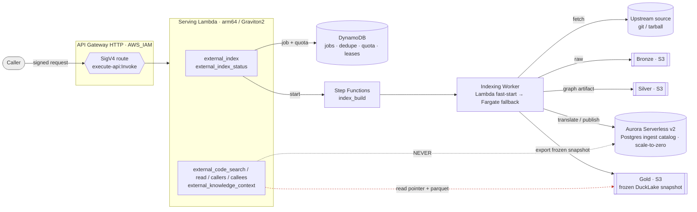
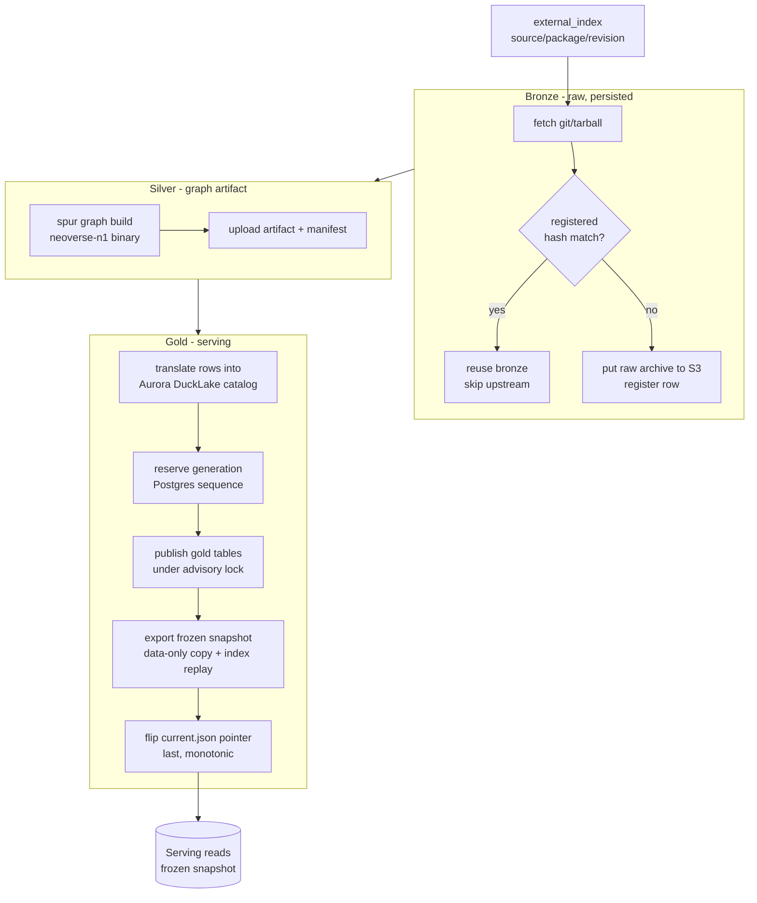
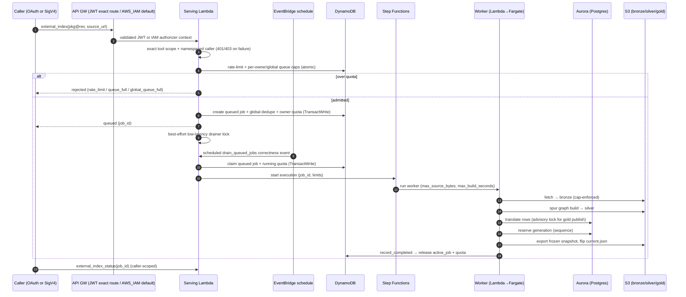
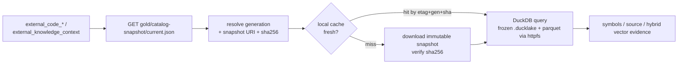
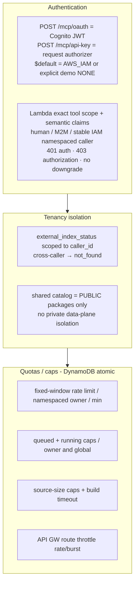
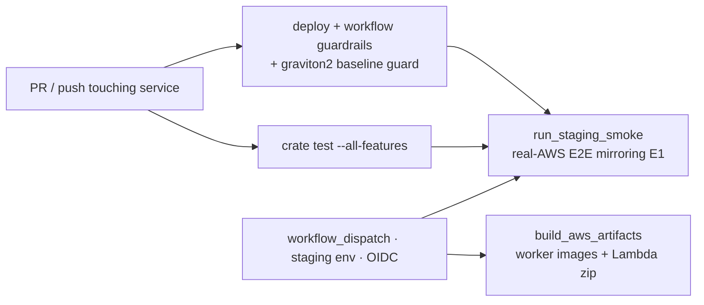

# SPUR Context Service — Architecture

The context service indexes **external (third-party) packages** into a code-context
lakehouse and serves graph + knowledge queries over them. It is a public,
on-demand indexer: a caller asks for `pkg@rev`, a worker fetches and builds it,
and the results become queryable with low-latency, zero-database serving.

The design is a **medallion lakehouse** (bronze → silver → gold) with a strict
split between an **ingest plane** (write path, Postgres-backed) and a
**serving plane** (read path, S3-only). This document describes the architecture
as implemented across `crates/spur-context-service` and
`infra/spur-context-service`.

> Companion docs:
> - Product & usage (business value, login, `external_*` tools): [PRODUCT_AND_USAGE.md](./PRODUCT_AND_USAGE.md)
> - Design: `docs/superpowers/specs/2026-06-28-spur-context-medallion-design.md`
> - Infra/runtime details: `infra/spur-context-service/README.md`

---

## 1. The two planes at a glance

Key invariant (**"B1"**): **the serving plane never touches Postgres.** Reads are
served from an immutable, frozen DuckLake snapshot on S3. Aurora exists only so
concurrent ingest workers can share a transactional catalog while they build.

---

## 2. Medallion data layers

| Layer | Produced by | Lives in | Contents | Identity |
|---|---|---|---|---|
| **Bronze** | worker fetch | S3 (`bronze/…`) + registry row | Raw source exactly as fetched (tarball / git bundle) + content hash | `source / package / revision` |
| **Silver** | worker `spur graph build` | S3 (`silver/…`) + manifest row | Graph artifact (symbols, edges, sections) | same coordinate + artifact manifest |
| **Gold** | worker `translate` | Aurora (ingest) → frozen snapshot on S3 (serving) | Serving rows: symbols, refs, `symbol_embeddings`, knowledge sections, catalog metadata | coordinate + **generation** |

Each layer has **bronze dedup** (skip the upstream fetch when the registered
content hash matches) and source/build caps applied before promotion, so a job
that re-requests a cached package short-circuits cheaply.

---

## 3. Ingest plane (write path)

### Aurora Serverless v2 — ingest-only catalog
- `aurora-postgresql`, min **0 ACU** (scale-to-zero) — pay only while ingesting.
- RDS-managed master password in **Secrets Manager**; the worker injects it via
  `SPUR_CATALOG_PASSWORD_SECRET_ARN`.
- **Concurrency model:** unique generations come from a Postgres **sequence**;
  ordering of the publish critical section is enforced by a catalog-wide
  **advisory session lock** (`pg_advisory_lock`) around schema setup → generation
  reserve → gold writes → publish → snapshot export. Throughput ceiling is one
  gold-publish lane per catalog (fetch/build stay parallel).

### Worker runtime
- **Lambda fast-start** first; **Fargate** fallback for long/large builds
  (`runTask.waitForTaskToken`, timeout = `context_max_build_seconds + 900`).
- Resource caps: source-tree size (git 2 GB / tarball 500 MB) enforced after
  fetch; `spur graph build` killed after `context_max_build_seconds`.
- Spot-interruption handler writes a checkpoint so work can resume.

---

## 4. Serving plane (read path) — frozen DuckLake snapshot

The **frozen snapshot** is a self-contained, data-only copy of the 29
`ducklake_*` metadata tables plus a **replay of the 5 UNIQUE primary-key
indexes** (a plain `COPY FROM DATABASE` fails on DuckLake metadata indexes).

- Each generation writes an **immutable** snapshot object + manifest; a mutable
  `current.json` pointer is flipped **last**.
- Publication is **monotonic**: the pointer never moves to an older generation;
  combined with a transaction-consistent metadata copy, a concurrent or failed
  publish can never produce a torn/rolled-back serving view.
- **Rollback** = repoint `current.json` to a previous generation's manifest.
- Serving cache invalidates on `pointer-etag + generation + snapshot-uri + sha256`.

---

## 5. Security, tenancy & abuse controls

- **Auth is defense-in-depth:** API Gateway verifies JWT/SigV4 at the edge;
  Lambda requires the exact body-selected OAuth scope, derives collision-safe
  human/M2M/IAM identities, and never downgrades malformed JWT context to IAM,
  principal ID, source IP, or anonymous. The explicit demo compatibility path
  alone retains the literal `anonymous-internal` mutation owner.
- **Personal keys are one human identity:** Cognito human OAuth manages keys;
  routine MCP calls use the exact API-key route and typed authorizer context.
  Both resolve to `cognito:user:`, so multiple keys share rate, queue,
  dedupe, and status ownership. Cached decisions are bounded to 30 seconds;
  EventBridge drainer and expiry-cleanup discriminators bypass HTTP auth.
- **Quotas are atomic** DynamoDB conditional writes (rate counter per
  epoch-minute window; queued owner/global counters transacted with admission;
  running owner/global counters and release tokens claimed by the drainer and
  released exactly once on terminal state).

---

## 6. CPU baseline (Graviton2-safe)

Deployable arm64 artifacts target **Graviton2 / neoverse-n1**. Lambda and
Fargate arm64 run on Graviton2; the build VM is Graviton4 (neoverse-v2), and a
neoverse-v2 binary **SIGILLs** on Graviton2. `deploy.sh` builds through a
`run_graviton2_safe_cargo` wrapper, and `test-graviton2-baseline.sh` guards it in
CI.

---

## 7. CI/CD

- PR/push runs tests + guardrails only — **no AWS, no Terraform**.
- Real-AWS jobs are `workflow_dispatch` + `context-service-staging` environment +
  OIDC, and never run `terraform apply`.
- **Staging smoke** (`smoke-staging-e2e.py`) codifies the manual E1 run: publish a
  tiny fixture → `external_index` (IAM identity) → poll complete → assert
  non-zero `symbol_embeddings`, bronze/silver/gold objects, and serve
  search/read/knowledge with **vector-backed** evidence, asserting **zero-Postgres**
  serving.

---

## 8. AWS resource map

| Resource | Role |
|---|---|
| `aws_apigatewayv2_api/route/stage` | HTTP front door, `AWS_IAM` auth, route throttling |
| `aws_iam_policy.context_service_invoke` | SigV4 `execute-api:Invoke` for allowed callers |
| `aws_lambda_function.service` | arm64 serving Lambda (ingest control plane + serving) |
| `aws_rds_cluster` (Aurora Serverless v2) | Postgres **ingest-only** catalog, scale-to-zero |
| Secrets Manager | Aurora master password |
| `aws_dynamodb_table.index_jobs` | jobs, dedupe, active-job + caller quota records |
| `aws_dynamodb_table.api_keys` | digest-only personal keys, owner counters, owner/expiry GSIs, cleanup cursor |
| `aws_lambda_function.api_key_authorizer` | strongly consistent synthetic/production key lookup and typed owner/scope context |
| `aws_lambda_function.api_key_cleanup` | lease-fenced, page/bucket/record-bounded expiry cleanup |
| `aws_dynamodb_table.catalog_leases` | DuckLake catalog write leases |
| `aws_sfn_state_machine.index_build` | on-demand indexing orchestration |
| `aws_lambda_function.worker` / ECS Fargate | indexing worker (fast-start → fallback) |
| S3 data bucket | `bronze/` · `silver/` · `gold/catalog-snapshot/` (frozen snapshot + `current.json`) |

---

## 9. Known follow-ups

1. **Quota-counter drift** under hard worker kill — make the active-job counter
   TTL-safe (count `ACTIVE_JOB#` items or reconciler sweep) so a job that dies
   without a terminal status cannot permanently consume a slot.
2. **Concurrency test in CI** — `concurrent_translates_…` is gated on
   `SPUR_CONTEXT_AURORA_TEST_DSN`; wire it into the staging job to validate the
   advisory lock against real Aurora.
3. **API-GW-level auth test** — the smoke uses `aws lambda invoke` (Lambda-side
   auth); add a check of the SigV4 edge gate (signed 2xx vs unsigned 401/403).
4. **VPC endpoints / NAT** for the now-in-VPC worker Lambda (S3 + Step Functions
   egress).
5. **Smoke string assumptions** (bronze/silver/gold S3 key layouts, `hybrid`
   grounding label) — validate on first real staging run.
