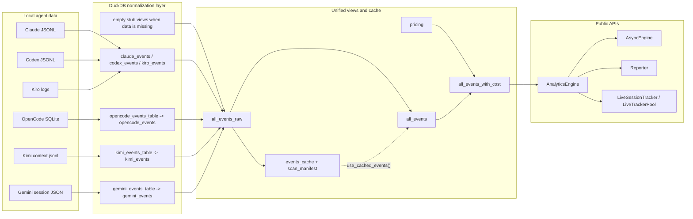

# spur-context — Architecture

`spur-context` is SPUR's local session-analytics crate. It discovers agent-native
session data on disk, normalizes each source into a common event shape inside
DuckDB, enriches those events with pricing from `spur-cost`, and exposes typed
reporting APIs for the CLI and TUI (`src/lib.rs:22-88`, `src/engine.rs:148-1826`,
`src/reporter.rs:331-562`).

This crate directory also contains `analyst/`, but that is a separate concern:
per `analyst/README.md:3-7`, those SQL assets are compiled into `spur-cli` and
`spur-mcp` for the code-graph analyst database. The library described here is
the `src/` crate exported by `src/lib.rs`.

---

## 1. Purpose

The crate has three jobs:

1. Discover supported agent data sources on the local machine.
2. Convert heterogeneous session formats into one logical event stream.
3. Serve typed cost and usage reports over that stream.

Today the engine knows about six sources:

- Claude JSONL logs
- Codex JSONL logs
- Kiro logs, currently stubbed
- OpenCode SQLite history
- Kimi JSONL session folders
- Gemini JSON session documents

The top-level crate docs still show only Claude, Codex, and Kiro
(`src/lib.rs:30-49`), but `create_agent_views()` now wires all six
(`src/engine.rs:449-563`).

---

## 2. Topology



Two view names matter:

- `all_events_raw` is the stable UNION over agent-specific views.
- `all_events` is the mutable front door for queries; it initially aliases
  `all_events_raw`, then `use_cached_events()` can rebind it to `events_cache`
  (`src/engine.rs:1371-1409`, `src/engine.rs:368-390`).

That split exists to avoid a previous self-wipe bug during cache refresh
(`src/engine.rs:325-340`, `src/engine.rs:1381-1383`).

---

## 3. Runtime lifecycle

### 3.1 Cold start

The normal caller sequence is:

1. `AnalyticsEngine::open()` or `open_in_memory()`
2. `initialize()`
3. `create_agent_views()`
4. `load_pricing()`
5. Optional: `refresh_cache()` then `use_cached_events()`
6. Run report queries

That exact sequence is used by:

- `spur-cli` cost reporting (`crates/spur-cli/src/main.rs:2594-2615`)
- the TUI analytics cold-init pipeline (`crates/spur-tui/src/app/analytics.rs:76-103`)

### 3.2 Warm path

Once `events_cache` has been materialized and `all_events` has been rebound to
it, report queries hit the local DuckDB cache instead of re-scanning every raw
session file (`src/engine.rs:375-390`).

### 3.3 Live path

Live views do not maintain incremental state in Rust. `LiveSessionTracker`
simply polls DuckDB again (`src/live.rs:1-7`, `src/live.rs:46-82`). For
JSONL-backed sources such as Claude and Codex, re-querying DuckDB re-reads the
source files. For OpenCode, Kimi, and Gemini, the crate first materializes
intermediate DuckDB tables, so new source data is not visible until the
corresponding view/table build step runs again.

---

## 4. Module map

### 4.1 Library modules

| Path | Responsibility | Key items |
|---|---|---|
| `src/lib.rs` | Crate root and public re-export surface | Re-exports `AnalyticsEngine`, `AsyncEngine`, `Reporter`, `LiveSessionTracker`, row/report types (`src/lib.rs:71-88`) |
| `src/engine.rs` | Core DuckDB engine | connection management, WAL recovery, source discovery, per-agent view creation, cache refresh, pricing load, all typed query methods, no-`duckdb` stub, row structs |
| `src/async_engine.rs` | Async facade over the blocking engine | `AsyncEngine`, `run()`, async wrappers for engine methods (`src/async_engine.rs:31-164`) |
| `src/live.rs` | Polling helpers for active sessions | `LiveSessionTracker`, `LiveTrackerPool` (`src/live.rs:15-149`) |
| `src/reporter.rs` | Higher-level report assembly | `ReportRange`, totals/breakdowns, grouped `DailyReport`/`WeeklyReport`/`MonthlyReport`, `LiveReport`, `Reporter` (`src/reporter.rs:16-562`) |
| `src/extractors/mod.rs` | Shared extractor contract | `ExtractedRow`, `gemini` submodule (`src/extractors/mod.rs:10-27`) |
| `src/extractors/gemini.rs` | Gemini session-document extractor | `extract()`, `extract_file()`, JSON schema structs (`src/extractors/gemini.rs:10-135`) |

### 4.2 Embedded SQL

| Path | Responsibility |
|---|---|
| `src/sql/schema.sql` | Base tables/views: `pricing`, placeholder `all_events`, initial `all_events_with_cost`, `events_cache`, `scan_manifest` |
| `src/sql/daily_report.sql` | Range-bounded daily aggregation |
| `src/sql/weekly_report.sql` | Range-bounded weekly aggregation |
| `src/sql/monthly_report.sql` | Range-bounded monthly aggregation |
| `src/sql/model_breakdown.sql` | Per-model breakdown |
| `src/sql/project_breakdown.sql` | Per-project breakdown |
| `src/sql/session_detail.sql` | One-session aggregate with distinct model list |
| `src/sql/live_session_snapshot.sql` | One-session live aggregate without duration |
| `src/sql/reports.sql` | Index/comment file pointing at the real query files |

### 4.3 Tests and adjacent assets

| Path | Responsibility |
|---|---|
| `tests/real_fixtures.rs` | Integration tests over real-format Claude/Codex fixtures, including dedup and multi-model session aggregation |
| `analyst/README.md` and `analyst/init*.sql` | Separate code-graph analyst build assets; not loaded by `src/lib.rs` |

---

## 5. Public API surface

The crate root is intentionally flat: `lib.rs` re-exports almost everything a
consumer needs (`src/lib.rs:78-88`).

### 5.1 Core engine

- `AnalyticsEngine`
- `AgentViewStatus`
- `DailyRow`, `WeeklyRow`, `MonthlyRow`
- `ModelRow`, `ProjectRow`, `SessionRow`
- `LiveBlockRow`, `LiveSnapshot`

### 5.2 Async wrapper

- `AsyncEngine`

### 5.3 Higher-level reporting

- `Reporter`
- `ReportRange`
- `Totals`, `AgentBreakdown`
- `DailyReport`, `WeeklyReport`, `MonthlyReport`
- `ModelTotals`, `ModelReport`
- `ProjectTotals`, `ProjectReport`
- `SessionReport`
- `BurnRate`, `LiveBlock`, `LiveReport`

### 5.4 Live polling helpers

- `LiveSessionTracker`
- `LiveTrackerPool`

### 5.5 Actual workspace consumers

- `spur-cli` builds a persistent local analytics DB and wraps it in `Reporter`
  (`crates/spur-cli/src/main.rs:2584-2615`).
- `spur-tui` depends mostly on `AsyncEngine` and the row structs for the
  Insights view (`crates/spur-tui/src/app/analytics.rs:76-103`,
  `crates/spur-tui/src/views/insights/builder.rs:9-74`).

The extractor submodule is private to the crate (`src/lib.rs:76`); consumers do
not call Gemini/Kimi/OpenCode extraction directly.

---

## 6. Key data structures

### 6.1 Engine-side data

| Type | Role |
|---|---|
| `AnalyticsEngine` | Owns the DuckDB connection and all SQL/data-source lifecycle work (`src/engine.rs:143-1826`) |
| `AgentViewStatus` | Booleans indicating which source views were created successfully (`src/engine.rs:2088-2097`) |
| `OpenCodeRow` | Internal row copied out of SQLite before appending into DuckDB (`src/engine.rs:2099-2113`) |
| `KimiRow` | Internal row synthesized from `_usage` deltas (`src/engine.rs:2115-2125`) |
| `ExtractedRow` | Shared materialization shape for extractor modules (`src/extractors/mod.rs:13-27`) |

### 6.2 Query rows

These are the direct outputs of engine methods and SQL queries:

- `DailyRow`, `WeeklyRow`, `MonthlyRow`
- `ModelRow`
- `ProjectRow`
- `SessionRow`
- `LiveBlockRow`
- `LiveSnapshot`

All are `serde` serializable and are plain data carriers (`src/engine.rs:1995-2159`).

### 6.3 Reporter-side aggregates

`Reporter` builds richer, grouped objects on top of raw engine rows:

- `Totals`
- `AgentBreakdown`
- `DailyReport` / `WeeklyReport` / `MonthlyReport`
- `ModelTotals` / `ModelReport`
- `ProjectTotals` / `ProjectReport`
- `SessionReport`
- `BurnRate`, `LiveBlock`, `LiveReport`

### 6.4 Relationships

```text
source files / SQLite
    -> per-agent views or materialized tables
    -> all_events_raw
    -> all_events
    -> all_events_with_cost
    -> engine row structs
    -> reporter aggregate structs

AnalyticsEngine
    -> wrapped by AsyncEngine (Arc<Mutex<...>>)
    -> borrowed by LiveSessionTracker / LiveTrackerPool
    -> owned by Reporter
```

---

## 7. Persistence and schema

### 7.1 Base schema objects

`initialize()` runs `schema.sql` and then `ensure_events_cache_schema()`
(`src/engine.rs:215-280`).

The base persisted objects are:

| Object | Kind | Purpose |
|---|---|---|
| `pricing` | table | pricing rows loaded from `spur_cost::PricingRegistry` |
| `events_cache` | table | materialized copy of unified events for warm queries |
| `scan_manifest` | table | refresh watermark and per-agent row counts |
| `all_events` | view | placeholder at init, replaced later |
| `all_events_with_cost` | view | cost-enriched projection over `all_events` |

`schema.sql` drops and recreates `pricing` and `scan_manifest` on every
initialize, explicitly preferring idempotency and crash recovery over retaining
old derived state (`src/sql/schema.sql:9-24`, `src/sql/schema.sql:93-102`).

### 7.2 Runtime-created agent objects

`create_agent_views()` always leaves behind one object per agent, even if the
source is missing:

| Agent | Runtime objects |
|---|---|
| Claude | `claude_raw`, `claude_events` |
| Codex | `codex_raw`, `codex_token_events`, `codex_events` |
| Kiro | `kiro_events` stub only |
| OpenCode | `opencode_events_table`, `opencode_events` |
| Kimi | `kimi_events_table`, `kimi_events` |
| Gemini | `gemini_events_table`, `gemini_events` |

Missing or failed sources fall back to `create_empty_stub(view_name)` so the
final UNION is always well-typed (`src/engine.rs:1347-1368`).

### 7.3 Unified views

`rebuild_unified_views()` constructs:

- `all_events_raw` as `UNION ALL` of the six agent views
- `all_events` as `SELECT * FROM all_events_raw`
- a runtime `all_events_with_cost`

(`src/engine.rs:1384-1409`)

### 7.4 Cost enrichment

There are two definitions of `all_events_with_cost`:

1. `schema.sql` installs a simple exact-model join so the DB is queryable
   immediately after `initialize()` (`src/sql/schema.sql:46-66`).
2. The runtime `ALL_EVENTS_WITH_COST_VIEW` constant replaces that with a
   longest-prefix match using a lateral join, so model variants like
   `gpt-5.4` can reuse `gpt-5` pricing (`src/engine.rs:37-78`).

That runtime view also tags every row as:

- `native` when `cost_usd` was already present in the source
- `priced` when pricing was derived from the registry
- `unpriced` when no match exists

### 7.5 Cache refresh contract

`refresh_cache()` is intentionally coarse:

- it computes the newest source-file mtime across all supported agents
  (`src/engine.rs:393-442`)
- compares that to the minimum `loaded_at` in `scan_manifest`
  (`src/engine.rs:294-315`)
- if stale, it fully rebuilds `events_cache` from `all_events_raw`
  (`src/engine.rs:325-357`)

This is not per-file incremental refresh. A single newer file causes a full
cache rematerialization.

---

## 8. Per-agent ingestion strategies

### 8.1 Claude

`create_claude_view()` reads raw JSONL as one string column via `read_csv_auto`,
filters assistant rows, extracts token usage fields, derives project from the
file path, and deduplicates by `(sessionId, requestId, message.id)` with
`ROW_NUMBER()` keeping the earliest timestamp (`src/engine.rs:670-725`).

### 8.2 Codex

`create_codex_view()` reads raw JSONL, carries forward the most recent model,
and converts cumulative token totals into per-event deltas when needed
(`src/engine.rs:727-828`).

Notable behavior:

- prefers `last_token_usage` when present
- otherwise computes deltas from `total_token_usage`
- filters zero-delta events
- subtracts cached input from `input_tokens`, so billable input and cache read
  are tracked separately (`src/engine.rs:810-821`)

### 8.3 Kiro

`create_kiro_view()` is currently just a stub because the format is not yet
documented (`src/engine.rs:830-833`).

### 8.4 OpenCode

OpenCode is the outlier source: it is stored in SQLite, not JSONL.

`create_opencode_view()`:

1. drops and recreates `opencode_events_table`
2. uses `rusqlite` in read-only immutable mode to read the source DB
3. parses assistant-message JSON payloads
4. appends normalized rows into DuckDB
5. exposes `opencode_events` as a casting view over the materialized table

(`src/engine.rs:915-995`, `src/engine.rs:1265-1345`)

Notable behavior:

- skips all-zero token rows
- strips provider prefixes from `modelID` (for example `anthropic/...`)
- folds reasoning tokens into output tokens
- passes source `cost` through unchanged instead of repricing

### 8.5 Kimi

Kimi sessions are reconstructed from `<project>/<session>/context.jsonl`
folders (`src/engine.rs:997-1078`, `src/engine.rs:1153-1263`).

The extractor tries to pair `_usage` rows around assistant turns:

- `pre` usage becomes input
- `post - pre` becomes output
- the previous `post` anchors the next turn's input

If the `_usage`/assistant counts do not line up, it falls back to cumulative
input-only deltas and logs a warning (`src/engine.rs:1234-1258`).

Timestamps are synthetic: the file mtime becomes the base, and each earlier turn
is backdated by 1 second to preserve ordering (`src/engine.rs:1178-1183`,
`src/engine.rs:1225-1228`, `src/engine.rs:1250-1253`).

### 8.6 Gemini

Gemini extraction is the only agent-specific logic factored into its own module.

`extractors::gemini::extract()` walks:

`<tmp_root>/<session_uuid>/chats/session-*.json`

It loads each session document, keeps only `type == "gemini"` messages, parses
RFC3339 timestamps, and maps token fields into the shared `ExtractedRow`
contract (`src/extractors/gemini.rs:46-135`).

Important mapping choices:

- `input_tokens = input + tool`
- `output_tokens = output + thoughts`
- `cache_creation_tokens = 0`
- `cost_usd = None`

---

## 9. Query and reporting layers

### 9.1 `AnalyticsEngine`

`AnalyticsEngine` is the only layer that talks directly to DuckDB.

Its method groups are:

- lifecycle: `open`, `open_in_memory`, `initialize`
- cache management: `refresh_cache`, `checkpoint`, `use_cached_events`
- source discovery/materialization: `create_agent_views`
- pricing: `load_pricing`
- raw query methods: daily/weekly/monthly reports, model/project breakdowns,
  `session_detail`, `live_session_snapshot`, `live_recent_sessions`
- escape hatches: `query_json`, `conn`

Range-bounded queries use embedded SQL files (`src/engine.rs:1592-1662`).
Relative "last N days/weeks/months" queries are written inline in Rust
(`src/engine.rs:1477-1589`).

### 9.2 `Reporter`

`Reporter` is a thin but useful aggregation layer over the engine
(`src/reporter.rs:327-562`).

It adds:

- grouping rows by day/week/month
- total computation
- per-agent breakdown arrays
- live-session burn-rate projections
- convenience ranges like `today()`, `last_week()`, `last_month()`

`Reporter::live_report()` computes burn rate only after both thresholds are met:

- `MIN_BURN_OBS_SECONDS = 60`
- `MIN_BURN_OBS_EVENTS = 2`

(`src/reporter.rs:318-322`, `src/reporter.rs:492-506`)

### 9.3 `AsyncEngine`

`AsyncEngine` is a concurrency adapter, not a second engine. It wraps
`AnalyticsEngine` in `Arc<Mutex<_>>` and runs closures inside
`tokio::task::spawn_blocking`, because `duckdb::Connection` is `Send` but not
`Sync` (`src/async_engine.rs:31-71`).

### 9.4 Live trackers

`LiveSessionTracker` and `LiveTrackerPool` are small polling helpers built on
`AnalyticsEngine::live_session_snapshot()` (`src/live.rs:15-149`).

---

## 10. Control and data flow

### 10.1 Cold init used by CLI and TUI

```text
open() -> initialize() -> create_agent_views() -> load_pricing()
      -> refresh_cache() -> use_cached_events()
      -> query methods / Reporter / AsyncEngine
```

This flow is visible in both `spur-cli` and `spur-tui`
(`crates/spur-cli/src/main.rs:2594-2599`,
`crates/spur-tui/src/app/analytics.rs:90-103`).

### 10.2 Cache rematerialization

```text
source mtimes -> newest_agent_mtime()
             -> compare with scan_manifest.MIN(loaded_at)
             -> DELETE events_cache
             -> INSERT FROM all_events_raw
             -> rebuild scan_manifest
             -> CHECKPOINT
```

### 10.3 Live polling

```text
LiveSessionTracker::poll()
    -> AnalyticsEngine::live_session_snapshot(session_id)
    -> DuckDB aggregate over all_events_with_cost
    -> fallback synthetic zeroed snapshot if no rows exist
```

### 10.4 Report assembly

```text
DuckDB rows (DailyRow / WeeklyRow / ...)
    -> Reporter grouping by date bucket
    -> Totals / AgentBreakdown
    -> DailyReport / WeeklyReport / MonthlyReport
```

---

## 11. Compile-time behavior and important design choices

### 11.1 `duckdb` feature is default-off

`Cargo.toml` declares:

- `default = []`
- `duckdb = ["dep:duckdb"]`

(`Cargo.toml:9-16`)

Without that feature, `AnalyticsEngine` becomes a no-op stub whose methods
return empty vectors or `None` (`src/engine.rs:1874-1991`). This lets crates
compile without linking bundled DuckDB, but it also means the API shape stays
the same while behavior changes dramatically.

### 11.2 WAL corruption recovery is built into `open()`

If opening the persistent DuckDB file fails with a `"Corrupt WAL"` message, the
engine renames the WAL aside, tries again, and garbage-collects older broken WAL
files (`src/engine.rs:150-209`, `src/engine.rs:1829-1871`).

### 11.3 Cache schema migration is conservative

`ensure_events_cache_schema()`:

- adds missing columns with `ALTER TABLE`
- fully rebuilds the table if an existing column type does not match

(`src/engine.rs:224-280`)

### 11.4 `all_events_with_cost` is rebuilt after cache rebinding

`use_cached_events()` does not just point `all_events` at `events_cache`; it
also recreates `all_events_with_cost` so that view resolves against the cached
source instead of the raw UNION (`src/engine.rs:375-390`).

### 11.5 `query_json()` returns stringified values

`query_json()` does not preserve DuckDB types in JSON. It reads each column as a
`String` and inserts JSON string values (`src/engine.rs:1801-1818`).

### 11.6 `LiveSessionTracker`'s `agent` is mostly metadata today

The tracker stores an `agent` hint, but the query path uses only `session_id`;
the `agent` field is mainly used for the synthetic empty snapshot fallback
(`src/live.rs:19-25`, `src/live.rs:53-68`).

### 11.7 "Live" means "re-query", not "tail every source type"

The crate's live helpers are most accurate for sources that are queried
directly from files on every read. Sources that are first copied into DuckDB
tables (OpenCode, Kimi, Gemini) only advance when their table-building methods
run again (`src/engine.rs:915-1151`).

---

## 12. Dependencies

| Dependency | Why it is here |
|---|---|
| `duckdb` (optional, `bundled`) | embedded analytics database and appender API (`Cargo.toml:15`) |
| `spur-cost` | pricing registry used to populate `pricing` (`src/engine.rs:1413-1473`) |
| `rusqlite` | OpenCode source extraction from SQLite (`src/engine.rs:1265-1345`) |
| `serde`, `serde_json` | parsing heterogeneous session payloads and serializing row/report structs |
| `chrono` | timestamps, date ranges, live burn-rate calculations |
| `directories` | home-directory discovery for agent data roots and cache locations |
| `tokio` | `spawn_blocking` wrapper in `AsyncEngine` |
| `tracing` | lifecycle, warning, and poll diagnostics |
| `anyhow` | error propagation with context |
| `tempfile`, `filetime` (dev) | filesystem-based tests and mtime manipulation |

---

## 13. Testing

Testing is spread across inline module tests plus one integration test file.

### 13.1 Inline tests

- `src/engine.rs`:
  - schema/idempotency and WAL recovery
  - cache refresh and cache-schema migration
  - Claude dedup, Codex delta logic, OpenCode extraction, Kimi extraction,
    Gemini view population
  - pricing provenance and null-token cost handling
  - live-session UTC windowing and model-switch aggregation
- `src/async_engine.rs`:
  - wrapper behavior, generic `run()`, clone/into-inner semantics
- `src/live.rs`:
  - empty-session polling fallback
- `src/reporter.rs`:
  - grouping, totals, live burn-rate thresholds, accessor behavior
- `src/extractors/gemini.rs`:
  - synthetic fixture extraction plus ignored smoke coverage

### 13.2 Integration tests

`tests/real_fixtures.rs` uses real-format Claude and Codex fixtures to verify:

- heterogeneous raw inputs still build the expected views
- Claude dedup collapses duplicate assistant rows
- Codex zero-delta rows are filtered
- `session_detail()` aggregates across model switches

It serializes env-var manipulation with a static `Mutex` so parallel tests do
not race on `CLAUDE_CONFIG_DIR`, `CODEX_HOME`, or `KIRO_HOME`
(`tests/real_fixtures.rs:14-20`).

### 13.3 Real-machine smoke tests

Ignored smoke tests exist for Gemini, Kimi, and OpenCode and only run on
developer machines with real local histories present
(`src/extractors/gemini.rs:197-220`, `src/engine.rs:3074-3117`,
`src/engine.rs:3226-3249`).

---

## 14. Extension points and likely change surfaces

If you need to extend the crate, these are the natural seams:

- add a new agent source:
  - discovery helper in `engine.rs`
  - source-specific extractor/view builder
  - union it into `rebuild_unified_views()`
  - extend `AgentViewStatus`
  - cover it with engine tests
- refactor extraction logic:
  - `extractors::ExtractedRow` is the existing shared contract
  - Gemini already uses that path; Kimi/OpenCode are still inline and are the
    obvious future candidates (`src/extractors/mod.rs:1-5`)
- change report semantics:
  - keep SQL in `src/sql/*.sql` aligned with the row structs
  - `report_sql_files_include_cache_columns()` exists specifically to catch
    schema/query drift (`src/engine.rs:3374-3400`)

For debugging, start with `AnalyticsEngine::create_agent_views()` and
`AnalyticsEngine::rebuild_unified_views()`; most downstream issues reduce to
"did we normalize the source correctly?" or "what exactly is in `all_events`?"
