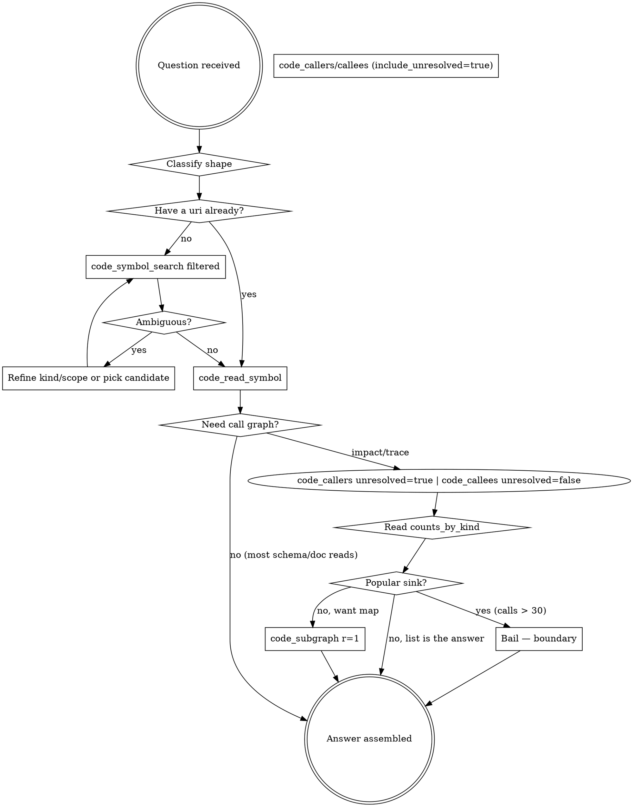

# Code Explore — Graph-First Navigation

The SPUR graph artifact already knows every symbol, definition site, call edge, and reference in the worktree. Query it through three layers — orientation, precision, aggregation — instead of text search. Grep/Glob/Read-walking is a fallback, not a starting point.

<HARD-GATE>
Before opening more than one file with Read, or running more than one Grep/Glob to locate code, you MUST attempt the relevant layer of the stack below. Grepping for a function name when filtered `code_symbol_search` would return its definition is the anti-pattern this skill exists to prevent.
</HARD-GATE>

## The three-layer retrieval stack

| Layer | Tool surface | Reach for it when |
|---|---|---|
| **1 — Orient** | `knowledge_context_pack` | Any new "where does X live / what's around this concept / get me oriented" question. One call returns a bounded evidence pack: BM25 code+doc hits, scorecard signals (pagerank, churn, posture), exact-graph caller/callee context with popular-sink boundaries pre-applied, staleness metadata, and `recommended_next_tools` with pre-filled selectors. |
| **2 — Precise** | `code_*` tools (rest of this skill) | Exact symbol work: read a body, list callers/callees, map a neighborhood. Seed selectors from layer 1's `recommended_next_tools` instead of re-resolving by name. Drop straight into layer 2 when you already know the exact symbol or file. |
| **3 — Aggregate** | spur-analyst (DuckDB SQL) | The answer is a *set*, not a symbol: ranking, hotspots, time-series, multi-table JOINs, co-change rings, reachability paths, PageRank/SCC. **REQUIRED SUB-SKILL:** use spur-analyst for SQL idioms and the schema-discovery hard gate. |

**Descend 1 → 2 by carrying selectors.** A pack hit gives you `graph://symbol/<id>`; pass it to `code_read_symbol`/`code_callers` directly. Re-resolving by name is slower and may collide.

**Escalate 2 → 3 when you start iterating.** Hand-chaining many `code_callers` calls to build a ranking or closure is the signal that the question is SQL-shaped.

### Layer-1 trust rules (from multi-round evaluation, 2026-06-10)

- **Code retrieval is BM25-only (temporary).** A concept query whose words don't appear in identifiers can return off-domain code hits while doc hits stay on-target. When `primary_evidence` looks unrelated to `supporting_docs`, the code recall failed — fall back to filtered `code_symbol_search` or `rg`.
- **Do not trust `confidence` alone.** It tracks retrieval-score shape, not relevance: observed `high` on irrelevant code hits and `low` on perfect doc-only results. Judge by reading the hit titles and files.
- **`recommended_next_tools` inherits top-hit quality.** Sanity-check the suggested selector's file path before following it.
- **The docs side is reliably strong.** For concept-shaped questions, read `supporting_docs` first, harvest the identifier vocabulary from them, then re-query the pack or layer 2 with that vocabulary.
- **Verified-good behaviors you can lean on:** identifier-rich queries hit precisely (impact counts in the pack matched exact `code_callers` output); popular sinks are counted but not expanded; `scope=docs`/`scope=code` and `intent` (`explain|change|review|debug|plan`) meaningfully shape the pack.

## Why graph-first

- **Precise:** edges are extracted by the language parser, not by string match. No false positives from comments, docstrings, or unrelated identifiers.
- **Cheap:** one filtered call returns structured rows. Grep for a common name returns hundreds of lines you must then re-read.
- **Complete:** captures resolved callees AND unresolved call labels, so macro-bodied or HOF call sites are visible.
- **Cache-friendly:** every response carries `graph_content_hash` + `indexed_head_oid` so you can detect staleness instead of re-reading.

## Classify the question FIRST (Step 0)

Most code questions are not call-graph questions. Pick the right shape before reaching for tools.

| Question shape | Right tool sequence |
|---|---|
| **"Get me oriented / where does <concept> live / what's the impact area?"** (new investigation, no symbol in hand) | `knowledge_context_pack` (layer 1) — then follow its `recommended_next_tools` selectors into the rows below. |
| **"How does <concept> work / where is it documented?"** (you know the *topic*, not the symbol name) | `knowledge_context_pack` or `code_semantic_search` — BM25 over doc + code content. Then `code_read_symbol` / `doc_navigate` on a hit. |
| **"What does X mean / contain / advertise?"** (schema audit, doc read, single-symbol body) | filtered `code_symbol_search` → `code_read_symbol`. **No call graph.** |
| **"What breaks if I change X?"** (refactor, rename) | `code_callers` with `include_unresolved=true`. Counts-first; bail on popular sinks. |
| **"What does X end up doing?"** (trace one branch) | Iterated `code_callees`. Pick one non-sink child per hop. Never `code_subgraph r=2`. |
| **"What's around X?"** (neighborhood map for a reviewer) | `code_subgraph radius=1` first. Escalate to `r=2` only if no direct callee is a popular sink. |
| **"What's in this file?"** (outline) | Filtered `code_symbol_search file=<path> symbol_kind=<kind>`. `code_file_symbols` only on small files (< ~1k lines). |
| **"Where is X declared?"** (find by name) | `code_symbol_search substring + symbol_kind + file_glob`. `code_resolve` only when the name is exact and canonical. |
| **"Top N by … / what co-changes with … / path from A to B?"** (ranked, aggregated, or path-shaped answer) | spur-analyst SQL (layer 3) — see the spur-analyst skill. Not a `code_*` question. |

For schema audits, doc reads, and "what does this field mean?" questions, skip the call graph entirely — the schema↔handler link is by string name, not call edge.

## The tools (primary → fast-path → specialised)

> **Naming:** `code_search` was renamed to **`code_symbol_search`** (the old name still works as a deprecated alias). It pairs with **`code_semantic_search`** — symbol-*name* lookup vs content-*relevance*. Pick by what you know: a name → `code_symbol_search`; a concept/topic → `code_semantic_search`.

| Tool | Tier | Use when |
|---|---|---|
| `code_symbol_search` | **PRIMARY (by name)** | Default name-lookup. Filter with `mode=exact|prefix|substring`, `symbol_kind`, `file`/`file_glob`. Cannot overflow (returns ranked candidates). Legacy alias: `code_search`. |
| `code_semantic_search` | **PRIMARY (by concept)** | BM25 retrieval over doc/skill/plan section *bodies* + symbol *token text*; code hits carry centrality/churn/posture. For "how does X work / where is X documented" when you don't know the symbol name. Served by the **notebook MCP** (reads `.spur/analyst.duckdb`), not spur-mcp. NOT a call-graph tool. |
| `code_read_symbol` | **TERMINAL** | Best tool in the set. Narrow source by stable_symbol_id with optional `context_lines`. Use as the last step of every flow. |
| `code_callers` | After counts-probe | Impact analysis. **Default `include_unresolved=true`** — a silently-missed caller is the worst failure for refactor/rename scope. Read `counts_by_kind` BEFORE the list. Bail on `counts.calls > ~30`. |
| `code_callees` | After counts-probe | Behavior analysis. **Default `include_unresolved=false`** — unresolved callee rows are usually std / `Option` / `Result` / iterator mechanics, not domain calls. Inspect `counts_by_kind.unresolved` + `unresolved_sample`; only re-run with `include_unresolved=true` when sample labels look behavior-relevant or the code is macro/dynamic/trait-heavy. |
| `code_subgraph` | Sparingly | `radius=1 edge_kinds=["calls"]` by default. Never seed at a popular sink. `format=mermaid` for humans. |
| `code_resolve` | Fast path | Only when you have an exact canonical bare name. Errors hard on near-misses (the error message implies the artifact is broken — it isn't, the name is wrong). Fall through to filtered `code_symbol_search` on miss. |
| `code_file_symbols` | Small files only | Overflows on files > ~2k lines. For anything larger, use filtered `code_symbol_search`. |
| `code_symbol_info` | Rarely needed | `code_read_symbol` returns the same metadata plus the body. |

## Selector grammar

All edge tools accept a single `selector` string. In order of specificity:

1. `graph://symbol/<hex-id>` — canonical, unambiguous (from any prior tool response's `uri`).
2. Bare `<hex-id>` — same effect.
3. File-qualified: `crates/foo/src/bar.rs::my_fn` — disambiguates same-named symbols.
4. Qualified name: `module::path::name`.
5. Bare name: `my_fn` — may be ambiguous; tools return candidates by default (`on_ambiguous=candidates`).

Prefer (1) once you have it. Carry the `uri` from response to response instead of re-resolving by name.

**Format gotcha:** methods are stored as `impl Type::method`, NOT `Type::method`. `code_symbol_search exact "JsonRpcResponse::success"` returns zero hits; `code_symbol_search exact "success" file=<types.rs>` returns the same symbol with qualified_name `impl JsonRpcResponse::success`. Use scoped search when the bare-method name might collide.

## Counts-first rule (mandatory for callers/callees)

Before reading the `callers` or `callees` list in a response, read `counts_by_kind`. The defaults can lie by omission — but the direction matters.

**Asymmetric defaults — these are not the same tool:**

- **`code_callers` → default `include_unresolved=true`.** For impact / refactor / rename, a silently-omitted caller is the worst outcome. Pay the noise cost; missing a row is worse than reading one.
- **`code_callees` → default `include_unresolved=false`.** For behavior analysis, unresolved callee rows are overwhelmingly std / `Option` / `Result` / iterator / serde method calls — pure noise that drowns the 5-10 real domain edges. Read `counts_by_kind.unresolved` and `unresolved_sample` to *meta-detect* missed domain calls without enumerating the rows.

**Decision flow:**

```
1. Call code_callers with include_unresolved=true.
   Call code_callees with include_unresolved=false.
2. Read counts_by_kind in the response.
3. For callees specifically: scan unresolved_sample.
   → If sample labels look domain-y (project types, custom traits, async fns)
     or the code is macro/dynamic/trait-heavy: re-run with include_unresolved=true.
   → If sample is `get / map / clone / unwrap_or / as_str / iter / ...`:
     skip. Those are std mechanics. The counts_by_kind value is enough signal.
   → DO NOT use `unresolved > resolved` as the re-run trigger. In Rust handlers
     std/iterator calls routinely outnumber domain calls; this fires constantly.
4. For both directions: if counts.calls > ~30 → POPULAR SINK. Stop. Treat as
   a boundary; reframe the question.
5. If counts.calls == 0 and counts.unresolved == 0: done.
```

## Resolved rows can lie too

The graph resolves edges by parsing the call expression — when a bare method name (`take`, `filter`, `lock`, `new`, `send`, `format`) has multiple definitions across the workspace and the receiver type is generic / inferred / not in scope, the resolver can pick the **wrong one** and emit a `resolved: true` row pointing at an unrelated symbol.

**Empirically reproduced.** `code_callees` on `handle_submit_plan` produced two resolved rows that were false positives:
- `take` → `impl SpawnGuard::take` in `crates/spur-acp/tests/orphan_sweep_e2e.rs` (actually `Option::take`).
- `filter` → `impl SessionPickerView::filter` in `crates/spur-tui/src/views/session_picker.rs` (actually `Iterator::filter` on a `chars()` chain).

**Sanity-check resolved rows:**

- Does the resolved symbol's `file_path` make sense for the caller's crate / module? Cross-crate jumps for a generic-named method are suspect.
- Does the symbol's `enclosing_scope` make domain sense? A handler in `spur-mcp` calling into `spur-tui::SessionPickerView::filter` is almost certainly a misresolution.
- When in doubt, `code_read_symbol` the resolved target — false positives become obvious in one read.

**Why this matters:** any future "hide-noisy-rows" feature that only suppresses `resolved=false` would leave these wrong-resolved rows behind — *and* hide them under a "principled-looking" filter. Today, suspicious resolved rows are visible; treat them as a feature.

## Process flow



## Red flags — stop and switch to code_*

| Thought | Reality |
|---|---|
| "Let me grep for the function name." | Filtered `code_symbol_search` returns ranked definitions, no false positives. |
| "I'll read the file to find callers." | `code_callers` returns every caller's file+line in one call. |
| "Let me Read the whole file to see structure." | `code_symbol_search file=<path> symbol_kind=function` outlines without overflow. |
| "Grep returned 80 matches — let me filter." | `code_symbol_search` with `symbol_kind` + `file_glob` filters in-tool. |
| "I'll trace this by reading each callsite." | Iterate `code_callees` depth-first by hand. `code_subgraph r=2` is for maps, not traces. |
| "The macro hides the call so the graph won't help." | `code_symbol_search` is the documented fallback for opaque macro bodies. Bodies of `#[derive]`/attribute macros ARE parsed; only `use`-imported call resolution is sometimes incomplete. |
| "`code_resolve` says 'not found in graph artifact', the graph must be broken." | The name is wrong, not the artifact. Re-run as `code_symbol_search substring` with `symbol_kind` + `file_glob` filters. |
| "Callers returned empty — there are no callers." | For `code_callers` the default *should be* `include_unresolved=true`. If you got an empty list with `counts.unresolved > 0`, you ran with the wrong flag. Re-run. |
| "Callees include 29 unresolved rows like `get`, `map`, `clone` — I need to read them all." | No. Those are std/iterator mechanics. With `code_callees include_unresolved=false` (the recommended default), they disappear; `counts_by_kind.unresolved` still tells you how many were hidden. |
| "A resolved row points at a symbol in a totally unrelated crate — must be a real edge." | Bare-method-name collision. Cross-crate resolution for `take` / `filter` / `lock` / `new` is suspect. Verify with `code_read_symbol` before trusting. |

## When `code_subgraph` is the wrong shape

`code_subgraph` is **breadth-first**. Tracing a handler's behavior is **depth-first along the interesting branch**. Mismatched shapes — and the mismatch costs you a lot of tokens before you notice.

**The failure mode: popular sinks.** A "popular sink" is a node called by many other symbols in the crate — response/error builders (`JsonRpcResponse::success`, `invalid_params`), pervasive utilities (`run_git`, `Option::take`), std-lib methods. If any of your target's direct callees is a popular sink, `radius=2` will expand *outward* from that sink, grafting in every other handler/utility that happens to call it. The node/edge budget gets burned on noise before BFS reaches the actually-interesting next hop, which then ends up in `truncated_frontier`.

**Empirically reproduced.** `code_subgraph radius=2` seeded at `JsonRpcResponse::success` returned 40 unrelated nodes (every random test function across crates) + a 172-node `truncated_frontier`. The same target's direct `code_callers` overflowed at 2177 lines and was saved to file. Treat any symbol called by more than ~30 others as a hard boundary.

**Decision table.**

| You want… | Use |
|---|---|
| "What does X end up doing?" (trace) | iterated `code_callees`, expand only nodes you decide are interesting |
| "What's around X?" (map, often for a reviewer) | `code_subgraph radius=1 format=mermaid` |
| Map, but X has popular-sink callees | start with `code_callees`, then `code_subgraph radius=1` on each non-sink child |
| Renaming/refactoring impact | `code_callers` with counts-first probe, NOT `code_subgraph` |
| Outline a 2k+ line file | `code_symbol_search file=<path> symbol_kind=<kind>`, NOT `code_file_symbols` |

**Tactical rules for `code_subgraph` when you do use it.**

- Always start at `radius=1`. Only escalate to 2 after confirming the radius-1 children are not popular sinks.
- Pin `edge_kinds=["calls"]` unless you have a specific reason for references.
- Treat a large `truncated_frontier` as a signal that the shape was wrong, not that you need to continue with `start_nodes`. Continuation just pays more tokens to keep walking the same noise.
- The Mermaid output is for humans (reviewers, docs). If you're the only consumer, the JSON nodes/edges list is cheaper.
- Never seed at an `impl` block — impls are containers, not callables. Seed at the specific method.

## Overflow handling

Two tools can exceed the inline response budget and save to an out-of-band file:

- **`code_file_symbols`** on files > ~2k lines (e.g. `crates/spur-mcp/src/server/handlers/code_graph.rs` at 2404 lines returns 84KB).
- **`code_callers`/`code_callees`** on popular sinks (200+ callers / 2k+ lines).

When this happens, do NOT chunk-read the saved file. Switch strategy:

- For file outline: `code_symbol_search file=<path> symbol_kind=function limit=30` (then again for `struct`, `enum`, `method`). This returns the same information in filtered slices.
- For popular-sink impact: bail. The question needs reframing — the symbol is a boundary, not an investigation target.

## Anti-patterns

- **Re-resolving by name across turns.** Once you have a `uri`, pass it. Names are slower and may collide.
- **`radius=3` as the default.** Start at 1, go to 2 only when 1-hop is insufficient. Bigger radii return more nodes than you can usefully read.
- **`code_subgraph radius=2` on a node with popular-sink callees.** BFS expands the sink outward and floods the budget with unrelated callers. Iterate `code_callees` instead.
- **Using `code_subgraph` to trace.** Subgraph gives a *map* (breadth-first neighborhood). For *trace* (depth-first along one path), `code_callees` is the right tool.
- **Trusting empty `callers` without reading `counts_by_kind`.** For `code_callers`, the noise/signal asymmetry inverts: the default *should* be `include_unresolved=true` because a hidden caller breaks refactor scope. Empty `callers` with `counts.unresolved > 0` = you ran with the wrong flag.
- **Using `unresolved > resolved` as a re-run trigger for `code_callees`.** In Rust handlers, std/iterator/serde calls routinely outnumber domain calls. This heuristic fires constantly and re-introduces the noise the asymmetric default is meant to suppress. Use *sample inspection* (semantic) instead of *row counts* (statistical).
- **Trusting resolved rows blindly when the bare name is common.** `take`, `filter`, `lock`, `new`, `send`, `format` collide across crates; the resolver can pick a wrong cross-crate symbol. Sanity-check that the resolved file_path and enclosing_scope make domain sense.
- **Treating `code_resolve` as the primary discovery tool.** It errors on imperfect names with a misleading message. Filtered `code_symbol_search` is the primary; `code_resolve` is a fast path for canonical names.
- **`code_file_symbols` on any file you haven't sized first.** If the file is > ~1k lines, go straight to filtered `code_symbol_search`.
- **Trusting stale graph data silently.** Every response includes `indexed_head_oid`, `worktree_dirty`, and `response_file_oids_match`.
  - `worktree_dirty: true` means **either** there are uncommitted edits to *tracked* files **or** HEAD has advanced past `indexed_head_oid`. Untracked files do NOT flip the flag.
  - `response_file_oids_match: Some(true)` certifies every file referenced in *this* response is byte-for-byte identical to what the graph indexed. `Some(false)` means at least one such file changed. `None` means undetermined (no worktree, no graph pointer, or read race).
  - **Use `response_file_oids_match` over `worktree_dirty` when judging trust in *this answer*.** Use `worktree_dirty` for broad "should I rebuild the graph?" decisions.
  - **Caveat:** `response_file_oids_match` certifies only the files returned — it cannot detect new symbols in brand-new files that have no indexed `file_oid`. For "what new files exist?" questions, run `git status` yourself.

## Key principles

- **Stack before tools.** Orient with `knowledge_context_pack`, work precisely with `code_*`, aggregate with spur-analyst SQL. Pick the layer before picking a tool.
- **Graph before text.** Every code question gets a stack attempt before Grep/Glob/Read-walking.
- **Classify the question first.** Most are "read one symbol," not "trace the call graph."
- **`code_symbol_search` is primary, filtered.** Always pair with `symbol_kind` and `file`/`file_glob` to avoid noise (markdown sections, test duplicates) and overflow.
- **Carry the uri.** Resolve once, use the `graph://symbol/<id>` across the rest of the investigation.
- **Counts before list.** For `code_callers`/`code_callees`, read `counts_by_kind` first; bail on popular sinks.
- **Asymmetric unresolved defaults.** `code_callers` → on (missed-row is the worst failure). `code_callees` → off (std mechanics dominate). For callees, re-enable only when `unresolved_sample` looks domain-relevant.
- **Suspect cross-crate bare-name resolutions.** `take` / `filter` / `lock` / `new` / `send` / `format` are common-name collision risks. Verify with `code_read_symbol` before treating as a real edge.
- **Bound, don't enumerate.** Use `radius` and `edge_kinds` to shape the answer instead of trimming a huge result by hand.
- **Read narrowly.** `code_read_symbol` with `context_lines` is almost always better than `Read` on the file.
- **Surface staleness.** If `worktree_dirty` or `indexed_head_oid` lags `worktree_head_oid` and matters, flag it.

## TL;DR

```
0. Classify the question. New investigation → knowledge_context_pack first;
   carry its graph://symbol selectors forward. Ranked/aggregated/path answer
   → spur-analyst SQL. Most of the rest are "read one symbol" — skip the
   call graph.
1. Filtered code_symbol_search (substring + symbol_kind + file_glob) — DEFAULT
   name discovery when layer 1 is unnecessary or its code recall came back thin.
2. code_read_symbol on the chosen URI — narrow body.
3. If the question is about impact or behavior:
     code_callers with include_unresolved=true   (missed-row is worst failure)
     code_callees with include_unresolved=false  (std mechanics are noise)
     → READ counts_by_kind FIRST
     → For callees: scan unresolved_sample; re-run with unresolved=true only
       if labels look domain-relevant. Never use unresolved>resolved as the rule.
     → Bail if counts.calls > ~30 (popular sink boundary).
     → Spot-check suspect cross-crate resolutions on common bare names.
4. code_subgraph r=1 only for genuine "map this neighborhood" questions.
5. code_resolve / code_file_symbols are fast paths for the happy case, not defaults.
```
