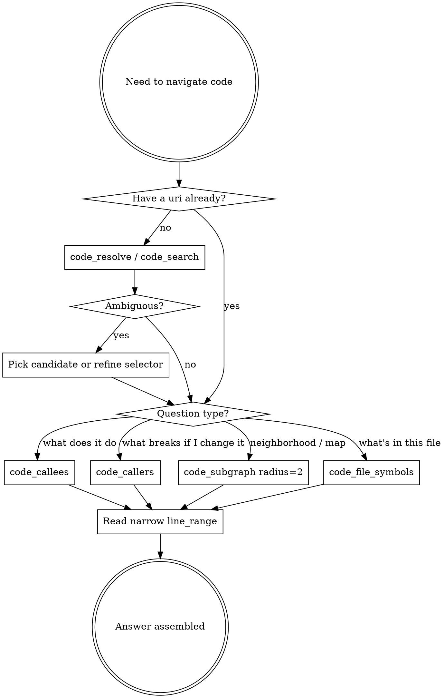

# Code Explore — Graph-First Navigation

The SPUR graph artifact already knows every symbol, definition site, call edge, and reference in the worktree. Use the `code_*` MCP tools to query it. Text search is a fallback, not a starting point.

<HARD-GATE>
Before opening more than one file with Read, or running more than one Grep/Glob to locate code, you MUST attempt the relevant `code_*` tool. Grepping for a function name when `code_resolve` would return its definition is the anti-pattern this skill exists to prevent.
</HARD-GATE>

## Why graph-first

- **Precise:** edges are extracted by the language parser, not by string match. No false positives from comments, docstrings, or unrelated identifiers.
- **Cheap:** one call returns structured rows. Grep for a common name returns hundreds of lines you must then re-read.
- **Complete:** captures resolved callees AND unresolved call labels, so macro-bodied or HOF call sites are visible.
- **Cache-friendly:** every response carries `graph_content_hash` + `indexed_head_oid` so you can detect staleness instead of re-reading.

## The seven tools

| Tool | Use when |
|---|---|
| `code_resolve` | You have a name/qualified-name and want candidate definitions (no edges). Cheapest disambiguation step. |
| `code_symbol_info` | You already know the selector and just need file/line/kind metadata. |
| `code_file_symbols` | You want the symbol outline of one worktree-relative file. Replaces "Read the whole file to see what's in it." |
| `code_search` | Lexical fallback. Reach for it when `code_resolve`/`code_callees` returns empty (e.g. macro bodies), or when you only know a fragment. Supports `mode=exact|prefix|substring`, `symbol_kind` filter, `file`/`file_glob` scoping. |
| `code_callers` | Impact analysis: "what will break if I change X?" |
| `code_callees` | Behavior analysis: "what does X actually do?" Returns both resolved edges and unresolved labels. |
| `code_subgraph` | Bounded N-hop **neighborhood map** (not a trace). Use `format=mermaid` for human-readable maps, `edge_kinds=["calls"]` or `["references"]` to scope. `radius` is clamped to 3. **For tracing a code path, prefer iterated `code_callees` calls — see "When `code_subgraph` is the wrong shape" below.** |

## Selector grammar

All edge tools accept a single `selector` string. In order of specificity:

1. `graph://symbol/<hex-id>` — canonical, unambiguous (from any prior tool response's `uri`).
2. Bare `<hex-id>` — same effect.
3. File-qualified: `crates/foo/src/bar.rs::my_fn` — disambiguates same-named symbols.
4. Qualified name: `module::path::name`.
5. Bare name: `my_fn` — may be ambiguous; tools return candidates by default (`on_ambiguous=candidates`).

Prefer (1) once you have it. Carry the `uri` from response to response instead of re-resolving by name.

## Checklist — Standard exploration loop

You MUST complete these in order. Skip steps only when their output is already in context.

1. **Locate** — `code_resolve` (or `code_search` if name is partial) to get candidate `uri`s. Disambiguate before continuing.
2. **Outline** — if the target's file is unfamiliar, `code_file_symbols` to see the file's surface area.
3. **Inwards** — `code_callees` on the target to understand what it does.
4. **Outwards** — `code_callers` on the target to scope the blast radius of changes.
5. **Bound** — when the 1-hop view doesn't answer the question:
   - For **tracing a code path** ("what does X end up doing"): iterate `code_callees` on the one or two interesting children. Do NOT use `code_subgraph radius=2` here — it expands every child, including popular sinks.
   - For a **neighborhood map** ("show me everything around X"): `code_subgraph radius=2 format=mermaid` with `edge_kinds=["calls"]` and only when the target's direct callees do not include popular sinks (see next section). Stop at radius 3; if you need more, the question is too broad — decompose it.
6. **Read** — only now reach for `Read` on specific `file_path` + `line_range` returned by the graph. Never read whole files when the graph already gave you the range.

## Process Flow

## Red Flags — Stop and switch to code_*

| Thought | Reality |
|---|---|
| "Let me grep for the function name." | `code_resolve` returns the definition directly — no false positives. |
| "I'll read the file to find callers." | `code_callers` returns every caller's file+line in one call. |
| "Let me Read the whole file to see structure." | `code_file_symbols` gives the outline in one call. |
| "Grep returned 80 matches — let me filter." | `code_search` with `symbol_kind` + `file_glob` filters in-tool. |
| "I'll trace this by reading each callsite." | Iterate `code_callees` on each interesting child — depth-first by hand. `code_subgraph radius=2` is for maps, not traces (see "When `code_subgraph` is the wrong shape"). |
| "The macro hides the call so the graph won't help." | `code_search` is the documented fallback for opaque macro bodies. |

## When `code_subgraph` is the wrong shape

`code_subgraph` is **breadth-first**. Tracing a handler's behavior is **depth-first along the interesting branch**. Mismatched shapes — and the mismatch costs you a lot of tokens before you notice.

**The failure mode: popular sinks.** A "popular sink" is a node called by many other symbols in the crate — response/error builders (`JsonRpcResponse::success`, `invalid_params`), pervasive utilities (`run_git`, `Option::take`), std-lib methods. If any of your target's direct callees is a popular sink, `radius=2` will expand *outward* from that sink, grafting in every other handler/utility that happens to call it. The node/edge budget gets burned on noise before BFS reaches the actually-interesting next hop, which then ends up in `truncated_frontier`.

**Concrete example.** Running `code_subgraph radius=2` on an MCP handler whose direct callees include `JsonRpcResponse::success` and `invalid_params` pulls in ~50 unrelated nodes (other handlers, git utilities, init tests) and pushes the real downstream (`build_epic_subgraph_…`, `resolve_plan_base`, `emit_plan_snapshot`) into a 500-node truncated frontier. Two iterated `code_callees` calls — one on the handler, one on the first real internal helper — answered the same question with ~10× less context.

**Decision table.**

| You want… | Use |
|---|---|
| "What does X end up doing?" (trace) | iterated `code_callees`, expand only nodes you decide are interesting |
| "What's around X?" (map, often for a reviewer) | `code_subgraph radius=2 format=mermaid` |
| Map, but X has popular-sink callees | start with `code_callees`, then `code_subgraph radius=1` on each non-sink child |
| Renaming/refactoring impact | `code_callers`, not `code_subgraph` |

**Tactical rules for `code_subgraph` when you do use it.**

- Always start at `radius=1`. Only escalate to 2 after confirming the radius-1 children are not popular sinks.
- Pin `edge_kinds=["calls"]` unless you have a specific reason for references.
- Treat a large `truncated_frontier` as a signal that the shape was wrong, not that you need to continue with `start_nodes`. Continuation just pays more tokens to keep walking the same noise.
- The Mermaid output is for humans (reviewers, docs). If you're the only consumer, the JSON nodes/edges list is cheaper.

## Anti-patterns

- **Re-resolving by name across turns.** Once you have a `uri`, pass it. Names are slower and may collide.
- **`radius=3` as the default.** Start at 1, go to 2 only when 1-hop is insufficient. Bigger radii return more nodes than you can usefully read.
- **`code_subgraph radius=2` on a node with popular-sink callees.** BFS expands the sink outward and floods the budget with unrelated callers. Iterate `code_callees` instead.
- **Using `code_subgraph` to trace.** Subgraph gives a *map* (breadth-first neighborhood). For *trace* (depth-first along one path), `code_callees` is the right tool.
- **Ignoring `resolved: false` callees.** Unresolved labels are signal: dynamic dispatch, macro expansion, or HOF arg. Surface them in your analysis, don't drop them.
- **Trusting stale graph data silently.** Every response includes `indexed_head_oid` and `worktree_dirty`. If `worktree_dirty: true` and your question touches uncommitted code, say so before relying on the answer.
- **Treating `code_search` as primary.** It's a lexical fallback. If `code_resolve` would have worked, use it — search returns ranked guesses, resolve returns the definition.

## Key Principles

- **Graph before text.** Every code question gets a `code_*` attempt before Grep/Glob/Read-walking.
- **Carry the uri.** Resolve once, use the `graph://symbol/<id>` across the rest of the investigation.
- **Bound, don't enumerate.** Use `radius` and `edge_kinds` to shape the answer instead of trimming a huge result by hand.
- **Read narrowly.** When you finally Read, pass `offset`/`limit` matching the graph's `line_range`.
- **Surface staleness.** If `worktree_dirty` or `indexed_head_oid` lags `worktree_head_oid` and matters, flag it.
