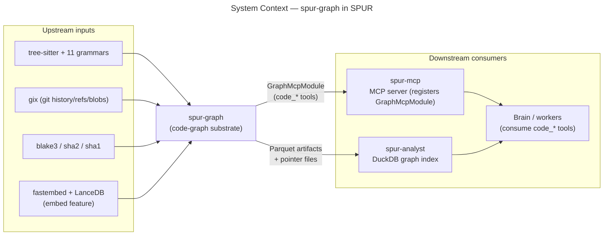
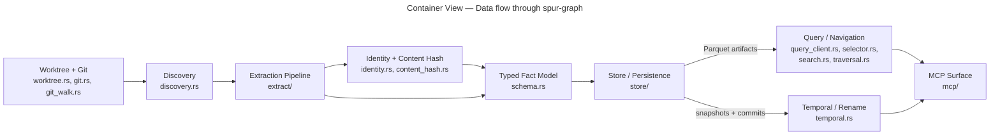

# spur-graph — C4 Architecture

A four-level C4 view of `spur-graph`, SPUR's multi-language tree-sitter code-graph
substrate and typed fact model. It extracts symbols/edges/references from source,
assigns content-addressed stable IDs, supports incremental rebuild, and powers the
`code_*` MCP tool surface consumed by the brain.

All anchors below are `file:symbol` or `file:line` references grounded against the
current worktree via the code graph. Versions and field lists are quoted from source.

---

## Level 1 — System Context

`spur-graph` is the **code intelligence foundation** of SPUR. It turns a git worktree
into a queryable, typed fact graph (`GraphIndexArtifact`) that downstream layers read
to answer "where is X", "what calls X", "what changed", and "is this answer fresh".

It owns three responsibilities that nothing else in the workspace does:
1. **Multi-language extraction** — parse 15 languages with tree-sitter into a uniform
   node/edge/span model.
2. **Stable identity** — content-addressed IDs that survive re-extraction so symbols
   can be compared across builds and commits.
3. **Freshness/staleness contract** — every answer it serves carries the hashes and
   OIDs that let a caller detect whether the graph lags the working tree.



**Upstream dependencies** (`crates/spur-graph/Cargo.toml:22-63`):

| Dependency | Role |
|---|---|
| `tree-sitter` 0.25 + 11 grammars (`tree-sitter-{rust,python,typescript,c,cpp,go,hcl,lua,md,bash,sequel}`) | Parse source into syntax trees; per-language queries live in `queries/` |
| `gix` 0.77 (`max-performance-safe`, `revision`, `blob-diff`) | Git history walking, refs, blob OIDs, worktree introspection |
| `blake3`, `sha2`, `sha1` | Content addressing: graph content hash, stable IDs, git blob OIDs |
| `fastembed` 5.8.0 + `lancedb`/`lance-index` + `parquet` | Embeddings sidecar (EmbeddingGemma300M) and columnar persistence |
| `petgraph` | In-memory subgraph traversal |
| `ignore` | `.gitignore`-aware file discovery |
| `spur-mcp` | `ToolModule` trait the MCP surface implements |

**Downstream consumers**:
- **`spur-analyst`** loads the Parquet artifacts into a DuckDB graph index for SQL
  aggregation and graph algorithms. It even re-derives stable IDs internally
  (`crates/spur-analyst/src/pack/impact.rs::raw_stable_symbol_id`).
- **`spur-mcp`** registers `GraphMcpModule` into a `ToolRegistry`, exposing the
  `code_*` tools to any MCP client (the bundled `spur mcp` server, the standalone
  `spur graph mcp` server, the brain).
- **Brain / workers** are the end consumers of the `code_*` tool surface — they never
  read artifacts directly.

---

## Level 2 — Containers (Internal Subsystems)

`spur-graph` is one library crate, but internally it has seven distinct subsystems
arranged as a pipeline. The crate root (`src/lib.rs:1-36`) is a flat re-export layer —
every module is `pub` and glob-re-exported, so the public API surface is the union of
all module roots.



**Data flow — extraction → identity → graph → store → query:**

1. **Worktree + Git** resolves the worktree root (`worktree.rs::resolve_worktree_root_from`,
   walks up to `.git`) and provides git context (`git.rs::GitCtx`) + history walking
   (`git_walk.rs::snapshot_from`, `snapshot_refs`).
2. **Discovery** walks the tree with `.gitignore` semantics
   (`discovery.rs::discover_files`) and groups files by language.
3. **Extraction** parses each file with the right tree-sitter grammar and query set
   (`extract/tree_sitter.rs::build_facts`), producing `GraphFacts { nodes, edges, spans }`.
4. **Identity** stamps content-addressed stable IDs on every symbol/file
   (`identity.rs::stable_symbol_id_for`).
5. **Typed Fact Model** (`schema.rs`) is the canonical in-memory + on-disk shape:
   `GraphIndexArtifact` holds files, symbols, edges, tombstones, commits, snapshots,
   temporal edges, and the `graph_content_hash`.
6. **Store** converts facts into the persisted artifact
   (`store/build.rs::artifact_from_facts`, `artifact_from_facts_incremental`) and writes
   Parquet + pointer files (`store/parquet.rs`, `store/pointer.rs`).
7. **Query / Navigation** reads artifacts back through a client trait
   (`query_client.rs::GraphQueryClient`) with three backends, and resolves selectors
   (`selector.rs`) for the MCP layer.
8. **MCP Surface** (`mcp/`) dispatches the `code_*` tools, coordinates rebuilds, and
   stamps every response with staleness metadata.

---

## Level 3 — Components (Per-Subsystem Breakdown)

### 3.1 Identity & Content Hashing

The stable-ID scheme is the load-bearing wall of the crate — it's what makes symbols
comparable across builds, commits, and consumers (spur-analyst re-derives the same IDs).

- **`identity.rs::stable_symbol_id_for(relative_path, fqn, kind, byte_range_start) -> String`**
  (`src/identity.rs:37-44`) — public entrypoint. Hashes `(path, fqn, kind.discriminator(),
  byte_range_start)` and emits a 16-hex `u64` prefix.
- **`identity.rs::stable_symbol_id_for_discriminator`** (`src/identity.rs:54-73`) — the
  SHA256 implementation. NUL bytes separate the four fields; `byte_range_start` is
  little-endian. This is the canonical scheme; everything else delegates here.
- **`identity.rs::stable_symbol_id_for_external_path(full_path)`** (`src/identity.rs:50-52`)
  — synthetic external/dependency nodes hash as `("external://", full_path, External, 0)`
  so every import site deduplicates naturally.
- **`store/build.rs::stable_file_id_from_path(path)`** (`src/store/build.rs:2587-2596`) —
  file-level ID: SHA256 of the path bytes, 16-hex `u64`.
- **Newtype IDs** (`src/identity.rs:28-33`): `NodeId`, `EdgeId`, `FileId`, `SpanId`,
  `RunId`, `EvidenceId` — all `pub struct(pub u64)`, generated by the `id_newtype!` macro.
- **`content_hash.rs::git_blob_oid(bytes)`** (`src/content_hash.rs:3-10`) — git-compatible
  SHA1 blob OID (`"blob <len>\0<bytes>"`), verified against `git hash-object` in tests.
- **`content_hash.rs::compute_graph_content_hash(entries)`** (`src/content_hash.rs:12-31`)
  — **the staleness anchor**: blake3 over the sorted `(path, oid)` set of every indexed
  file. This is the `graph_content_hash` that appears in pointer files and MCP responses.
- **`content_hash.rs::blake3_hex(bytes)`** (`src/content_hash.rs:33-35`) — raw blake3.

### 3.2 Typed Fact Model (`schema.rs`)

`schema.rs` (1262 lines) is the single source of truth for the graph's shape. The
top-level type is **`GraphIndexArtifact`** (`src/schema.rs:76-104`):

```
GraphIndexArtifact {
    header: GraphIndexHeader,            // graph_index_version + content_hash_blake3
    manifest_version: String,            // bumps invalidate incremental builds
    graph_content_hash: String,          // the staleness anchor (blake3)
    file_manifests: Vec<GraphFileManifestEntry>,  // path -> content_oid + node_ids
    files: Vec<GraphFileArtifact>,       // stable_file_id + file_path
    symbols: Vec<GraphSymbolArtifact>,   // the symbol table
    edges: Vec<GraphEdgeArtifact>,       // call/reference/import edges
    tombstones: Vec<GraphTombstoneEntry>, // deleted files
    commits: Vec<CommitArtifact>,        // git history slice
    symbol_snapshots: Vec<SymbolSnapshotArtifact>,  // point-in-time symbol state
    temporal_edges: Vec<TemporalEdgeArtifact>,      // rename/move history
}
```

Core enums:

- **`NodeKind`** (`src/schema.rs:258-283`) — 21 variants (Module, Function, Class,
  Struct, Impl, Trait, Method, McpTool, Cell, Port, Resource, …). Each carries a
  `discriminator()` string that feeds the stable-ID hash.
- **`RelationKind`** (`src/schema.rs:320-337`) — 14 predicates (Imports, Calls,
  Constructs, Contains, Implements, Defines, References, Extends, Links, Touches,
  Produces, Consumes, Binds, Emits). `metadata()` (`src/schema.rs:357-434`) declares
  each predicate's inverse label, cardinality, and transitivity.
- **`GraphEdgeKind`** (`src/schema.rs:436-444`) — fine-grained call/ref classification:
  `Calls`, `CallsDyn`, `ReferencesHof`, `ReferencesOther`, `ReferencesAddress`.
- **`Confidence`** (`src/schema.rs:457-463`) — `SyntaxExact | Heuristic | Unknown`,
  with a `confidence_score: f32`.
- **`ChangeKind`** (`src/schema.rs:776-783`) — `Added | Modified | Deleted | RenamedFrom(RenamePrev)`,
  where `RenamePrev` is `File(GitPath) | Symbol(SnapshotKey)`.

Versioning constants (in `store/build.rs:32-35`): `SCHEMA_VERSION = "spur-graph-schema-v10"`,
`EXTRACTOR_VERSION`, `RESOLVER_VERSION`, plus `GRAPH_INDEX_VERSION_TEMPORAL = "4"`
(`schema.rs:14`). Any `manifest_version` mismatch forces a full rebuild.

### 3.3 Extraction Pipeline (`extract/`)

- **`extract/mod.rs::GraphFacts { nodes, edges, spans }`** (`src/extract/mod.rs:15-20`) —
  the in-memory extraction output.
- **`extract/tree_sitter.rs::build_facts(root, progress)`** (`src/extract/tree_sitter.rs:3199`)
  — **full extraction entrypoint**: discovers language groups, dispatches per-language
  extractors, returns `(GraphFacts, file_counts)`.
- **`extract/tree_sitter.rs::build_facts_for_paths(root, files)`** — **partial extraction**
  used by incremental rebuild and the dirty-overlay.
- **`BytesExtractor::extract_graph_facts(builder, path, bytes)`** (`src/extract/tree_sitter.rs:286-322`)
  — per-file method: parses bytes, dispatches to notebook/markdown/standard extractors.
- **`FactBuilder`** (`src/extract/tree_sitter.rs`) — accumulates `GraphNode`/`GraphEdge`/
  `SourceSpan`, then `resolve_pending_edges()` + `into_facts()`.
- **`extract/languages.rs::Language`** (`src/extract/languages.rs:21-37`) — 15 supported
  languages. **`LanguageConfig`** (`src/extract/languages.rs:10-18`) bundles the
  tree-sitter `Language`, inline-language parser, `queries`, `definition_kind_map`,
  `relation_kind_map`, and `is_method` predicate.
- **Per-language queries** live in `queries/{c,cpp,go,hcl,lua,markdown,python,rust,shell,sql,typescript}/`
  — tree-sitter query patterns compiled into `LanguageConfig`. One `tree-sitter-hcl`
  grammar covers both `.tf` and `.hcl` (`Cargo.toml:55-56`).
- Specialized extractors: **`extract/markdown.rs`** (sections + inline code blocks),
  **`extract/notebook.rs`** (Jupyter cells/ports, `pub(crate)`), **`extract/mcp_tools.rs`**
  (discovers MCP tool definitions as `NodeKind::McpTool` nodes).

### 3.4 Store / Persistence (`store/`)

- **`store/build.rs::artifact_from_facts(facts, root)`** (`src/store/build.rs:255`) —
  **full build**: facts → `GraphIndexArtifact` (stamps IDs, anchor hashes, content hash,
  manifest version).
- **`store/build.rs::artifact_from_facts_incremental(prev, root)`** (`src/store/build.rs:334`)
  — **incremental build** (the core rebuild mechanism, see §Cross-cutting). Returns
  `(GraphIndexArtifact, BuildMode, BuildStats)`.
- **`store/build.rs::BuildMode { Full, Incremental }`** (`src/store/build.rs:183-186`).
- **`store/parquet.rs`** — writes/reads the on-disk columnar format
  (`write_artifact_parquet`, `read_artifact_parquet`, `write_worktree_delta`,
  `stamp_sidecar_status`). `schema.rs::load_artifact` (`src/schema.rs:868`) dispatches
  to `read_artifact_parquet`.
- **`store/pointer.rs`** — the pointer/cursor layer: `.spur/graph/CURRENT` and
  `.spur/graph-index.pointer.json`. `resolve_artifact_location(worktree_root, override)`
  (`src/store/pointer.rs:28`) resolves the active artifact; `ArtifactCacheKey` carries
  the `graph_content_hash`.
- **`store/canonical_hash.rs::artifact_content_hash_blake3_hex`** — canonical artifact hash.
- **`store/commit_index.rs`**, **`store/snapshot.rs`**, **`store/temporal_shards.rs`** —
  temporal/history persistence. **`store/lance_sections.rs`** — the embeddings sidecar
  (`write_sections_dataset`, `EmbeddingModelSelection`, `CODE_SYMBOLS_TABLE`,
  `SECTIONS_TABLE`; gated behind the `embed` feature).
- **`store/cache.rs`** — `BaseArtifactSeed` for deterministic base-seeded incremental builds.

### 3.5 Graph Algorithms (`graph/`)

- **`graph/petgraph_builder.rs`** — builds a `petgraph` from a `GraphIndexArtifact`.
- **`graph/algorithms.rs`** — `bounded_subgraph_with_budget` (BFS with node/edge budget
  caps), used by the `code_subgraph` MCP tool.

### 3.6 Query / Navigation (`query_client.rs`, `selector.rs`, `search.rs`, `traversal.rs`, `validation.rs`)

- **`query_client.rs::GraphQueryClient`** (`src/query_client.rs:45-84`) — **the central
  query trait**. Methods: `search_symbols`, `find_caller_edges`, `find_callee_edges`,
  `resolve_selector`, `symbol_by_id`, `symbols_by_file(s)`, `symbols_by_path_name`,
  `file_manifest_by_path`, `file_exists`, `temporal_index`, `symbol_history`. Three
  backends:
  - **`ParquetClient`** (`src/query_client.rs:843`) — reads persisted Parquet artifacts.
  - **`InMemoryClient`** — wraps an in-memory `GraphIndexArtifact`.
  - **`OverlayClient<B>`** (`src/query_client.rs:291-296`) — **the dirty-worktree
    overlay**: composes a `base` backend with a re-extracted `delta`
    (`InMemoryClient`) over changed files. Shadows base symbols on changed paths,
    remaps stable IDs that shifted on edit (`current_symbol_for`, `remapped_id_for`),
    and merges caller/callee edges across the base/delta boundary.
- **`selector.rs`** — selector grammar (`graph://symbol/<id>`, file-qualified names,
  bare names) and `resolve_selector` / `SelectorResolution` (candidates on ambiguity).
- **`search.rs`** — `SearchOptions`, `SearchMode`, `SearchFilters`, `SearchResult`,
  `SearchSymbol`, `CandidateRow`.
- **`traversal.rs`** — `bounded_subgraph_with_budget`, `SubgraphBudget`.
- **`validation.rs`** — `compute_anchor_hash` (content-addressed span anchor), plus the
  `CodeMention*` validation specs (`schema.rs::CodeMentionValidationSpec`) used to
  verify brain-generated code references against the graph.

### 3.7 Temporal / Rename Tracking (`temporal.rs`)

- **`temporal.rs::TemporalIndex`** (`src/temporal.rs:79-91`) — built from a
  `GraphIndexArtifact`, indexes `temporal_edges` and `symbol_snapshots` by
  `stable_symbol_id` and `commit_sha`. Tracks rename edges, deleted snapshot keys,
  commit positions/parents, and an LRU `AncestorCache` (256 entries).
- **`temporal.rs::Resolution<T>`** (`src/temporal.rs:10-15`) — `Found { value, chain } |
  Deleted { last_seen } | Ambiguous { candidates } | Unknown { reason }`.
- **`resolve_symbol_at_indexed`**, **`symbol_history`** — point-in-time symbol
  resolution: "which symbol did this ID refer to at commit X?" and "what is this
  symbol's change history?" Backs the `code_symbol_history` MCP tool.

### 3.8 MCP Surface (`mcp/`)

- **`mcp/mod.rs::GraphMcpModule`** (`src/mcp/mod.rs:54-107`) — implements
  `spur_mcp::ToolModule`. **`dispatch(name, args)`** (`src/mcp/mod.rs:71-106`) is the
  tool router. Tools served:
  `code_resolve`, `code_symbol_search`/`code_search`, `code_file_symbols`,
  `code_symbol_info`, `code_read_symbol`, `code_callers`, `code_callees`,
  `code_subgraph`, `code_symbol_history`.
- **`mcp/rebuild_singleflight.rs::RebuildCoordinator`** (`src/mcp/rebuild_singleflight.rs:66-73`)
  — **singleflight rebuild cache** keyed by `RebuildKey { head_oid, dirty_oid_set_hash }`
  (`src/mcp/rebuild_singleflight.rs:13-29`). Concurrent callers share one `OnceCell`
  build; the coordinator retains a 1-bundle LRU and tracks incremental-build failures
  per key. `get_or_build(worktree, key, build)` (`src/mcp/rebuild_singleflight.rs:92`)
  is the entrypoint.
- **`mcp/mod.rs::GraphResponseMetadata`** (`src/mcp/mod.rs:2600-2609`) — **the staleness
  contract** stamped on every response: `graph_content_hash`, `indexed_head_oid`,
  `worktree_head_oid`, `worktree_dirty`, `response_file_oids_match`, `rebuild_status`.
- **`RebuildStatus`** (`src/mcp/mod.rs:2611-2619`) — `NotNeeded | Fresh |
  StaleBudgetExceeded | StaleRebuildFailed`.

### 3.9 Worktree, Git, and Locking

- **`worktree.rs::resolve_worktree_root_from(start)`** (`src/worktree.rs:13-32`) — walks
  up from `start` until a `.git` marker is found.
- **`git.rs::GitCtx`** (`src/git.rs:8-12`) — gix-backed git context; `DirtyEntry` carries
  uncommitted file state.
- **`git_walk.rs::snapshot_from`** (`src/git_walk.rs:1878`), **`snapshot_refs`**
  (`src/git_walk.rs:60`) — walk git history to build `CommitIndexArtifact` and refs.
- **`locking.rs::try_lock_exclusive_with_timeout(file, timeout)`** (`src/locking.rs:24-40`)
  — `fs2` flock retry discipline (25ms interval) shared across the workspace.
  `is_lock_contended` normalizes macOS/Linux errno differences.

---

## Level 4 — Code (Selected Key Signatures)

The curated set of load-bearing functions a new contributor should read first. Each is
the single point that defines a core behavior.

```rust
// === Stable identity (identity.rs) ===
pub fn stable_symbol_id_for(
    relative_path: &str,
    fqn: &str,
    kind: NodeKind,
    byte_range_start: u64,
) -> String                                    // src/identity.rs:37  — symbol ID = SHA256(path║fqn║kind║start)[:16hex]

pub(crate) fn stable_symbol_id_for_discriminator(
    relative_path: &str,
    fqn: &str,
    kind_discriminator: &str,
    byte_range_start: u64,
) -> String                                    // src/identity.rs:54  — the actual hasher; everything delegates here

pub fn stable_symbol_id_for_external_path(full_path: &str) -> String
                                               // src/identity.rs:50  — external/dependency node IDs (dedup by import path)

// === Content hash / staleness anchor (content_hash.rs) ===
pub fn compute_graph_content_hash<I, P, O>(entries: I) -> String
where I: IntoIterator<Item = (P, O)>, P: AsRef<str>, O: AsRef<str>
                                               // src/content_hash.rs:12 — blake3 over sorted (path, oid); THE graph_content_hash

pub fn git_blob_oid(bytes: &[u8]) -> String    // src/content_hash.rs:3  — git-compatible SHA1 blob OID

// === Extraction entrypoints (extract/tree_sitter.rs) ===
pub fn build_facts(
    root: &Path,
    progress: Option<ProgressBar>,
) -> anyhow::Result<(GraphFacts, BTreeMap<&'static str, usize>)>
                                               // src/extract/tree_sitter.rs:3199 — full extraction: discover → dispatch per-language → GraphFacts

pub fn build_facts_for_paths(root: &Path, files: &[PathBuf]) -> anyhow::Result<GraphFacts>
                                               // partial extraction (incremental rebuild + dirty overlay)

impl BytesExtractor {
    pub(crate) fn extract_graph_facts(
        &mut self, builder: &mut FactBuilder<'_>, path: &Path, bytes: &[u8],
    ) -> Result<(), ExtractError>              // src/extract/tree_sitter.rs:286 — per-file parse + query capture
}

// === Graph build / incremental rebuild (store/build.rs) ===
pub fn artifact_from_facts(facts: &GraphFacts, root: &Path) -> anyhow::Result<GraphIndexArtifact>
                                               // src/store/build.rs:255 — facts → persisted artifact (full build)

pub fn artifact_from_facts_incremental(
    prev: &GraphIndexArtifact,
    root: &Path,
) -> anyhow::Result<(GraphIndexArtifact, BuildMode, BuildStats)>
                                               // src/store/build.rs:334 — incremental rebuild: manifest bump → full; else changed-paths re-extract + compose

// === Query abstraction (query_client.rs) ===
pub trait GraphQueryClient {                   // src/query_client.rs:45 — the central query trait
    fn search_symbols(&self, opts: &SearchOptions) -> anyhow::Result<SearchResult>;
    fn find_caller_edges(&self, sid: &str) -> Vec<OwnedCallerRecord>;
    fn find_callee_edges(&self, sid: &str) -> Vec<OwnedCalleeRecord>;
    fn resolve_selector(&self, selector: &str) -> anyhow::Result<SelectorResolution>;
    fn symbol_by_id(&self, sid: &str) -> anyhow::Result<Option<GraphSymbolArtifact>>;
    fn symbols_by_file(&self, path: &str) -> anyhow::Result<Vec<GraphSymbolArtifact>>;
    fn temporal_index(&self) -> Arc<TemporalIndex>;
    /* …plus symbols_by_files, symbols_by_path_name, file_manifest_by_path, file_exists, symbol_history */
}
// Backends: ParquetClient (persisted), InMemoryClient, OverlayClient<B> (dirty-overlay compose)

// === MCP dispatch (mcp/mod.rs) ===
impl GraphMcpModule {
    pub async fn dispatch(&self, name: &str, args: Value) -> CodeGraphResult
                                               // src/mcp/mod.rs:71 — routes code_resolve / code_symbol_search / code_callers / …
}

// === Rebuild singleflight (mcp/rebuild_singleflight.rs) ===
impl RebuildCoordinator {
    pub(crate) async fn get_or_build<F, Fut>(
        &self, worktree: PathBuf, key: RebuildKey, build: F,
    ) -> anyhow::Result<Arc<GraphIndexArtifact>>
    where F: FnOnce() -> Fut, Fut: Future<Output = anyhow::Result<Arc<GraphIndexArtifact>>>
                                               // src/mcp/rebuild_singleflight.rs:92 — singleflight: concurrent callers share one OnceCell build
}
```

---

## Cross-Cutting Concerns

### Feature Flags (`Cargo.toml:13-17`)

| Feature | Default | Effect |
|---|---|---|
| `embed` | yes | Pulls `fastembed` (EmbeddingGemma300M) + LanceDB; enables the sections/symbols embedding datasets (`store/lance_sections.rs`). Disabled builds skip the embedding sidecar. |
| `perf-gates` | no | Compile-time performance gates (assertions/budgets in hot paths). |
| `test-support` | no | Test instrumentation: build-invocation counters in `RebuildCoordinator` (`mcp/rebuild_singleflight.rs:69-72`), test-only hooks. |

`unsafe_code = "deny"` and a strict clippy profile (`Cargo.toml:91-135`) are enforced;
async-lock holding is denied (`await_holding_lock = "warn"`, `await_holding_refcell_ref = "deny"`).

### Multi-Language Query Strategy

One crate, 15 languages, one dispatch path. **`LanguageConfig`**
(`src/extract/languages.rs:10-18`) bundles per-language: the tree-sitter `Language`, an
optional inline-language parser (e.g. for markdown code fences), the compiled `queries`
(`&'static [(&'static str, &'static str)]` — pattern name → query source, loaded from
`queries/<lang>/`), a `definition_kind_map` (capture name → `NodeKind`), an optional
`relation_kind_map`, and an `is_method` predicate.

`build_facts` groups files by language (`discover_language_groups`), then
`extract_files` runs each group through its `BytesExtractor`. Markdown, Jupyter notebooks,
and MCP tool definitions have dedicated extractors (`extract/markdown.rs`,
`extract/notebook.rs`, `extract/mcp_tools.rs`). Per-language builtin-method precision
lists (e.g. `C_BUILTIN_METHODS`, `CPP_BUILTIN_METHODS`, `GO_BUILTIN_METHODS`) suppress
false-positive edge resolution against stdlib calls.

### Incremental Rebuild Mechanism

`artifact_from_facts_incremental` (`src/store/build.rs:334`) is the change-detection
engine:

1. **Manifest gate** — if `prev.manifest_version != current_manifest_version()`, do a
   full rebuild (extraction is invalid under the old schema). Returns `BuildMode::Full`.
2. **Discover current entries** — `discover_current_entries(root)` lists the live tree.
3. **Rebucket previous** — `buckets_from_artifact(prev)` partitions the prior artifact
   into per-file buckets (nodes/edges/manifests keyed by path).
4. **Compute changed paths** — `changed_paths_from_previous` diffs current file OIDs
   against `prev.file_manifests[*].content_oid`. Reuses unchanged buckets; collects
   `changed_paths`, `changed_or_added_paths`, `removed_paths`.
5. **Re-extract only changed files** — `build_facts_for_paths(root, &changed_paths)`,
   then `buckets_from_facts` + extend.
6. **Compose** — `compose_artifact` merges buckets, stamps tombstones, produces the new
   `GraphIndexArtifact` with a fresh `graph_content_hash`.

`BuildStats { reused_buckets, changed_paths, changed_or_added_paths, removed_paths }`
quantifies the delta; `BuildMode::Incremental` distinguishes it from `Full`.

### Staleness Contract

Every `code_*` MCP response carries **`GraphResponseMetadata`** (`src/mcp/mod.rs:2600-2609`):

| Field | Meaning |
|---|---|
| `graph_content_hash` | blake3 over the indexed `(path, oid)` set (`compute_graph_content_hash`) |
| `indexed_head_oid` | git HEAD the artifact was built at |
| `worktree_head_oid` | git HEAD at query time |
| `worktree_dirty` | true if tracked files changed **or** HEAD advanced past `indexed_head_oid` (untracked files don't flip it) |
| `response_file_oids_match` | `Some(true)` iff every file referenced in *this* response is byte-identical to what the graph indexed — the tightest per-answer freshness signal |
| `rebuild_status` | `NotNeeded \| Fresh \| StaleBudgetExceeded \| StaleRebuildFailed` |

The **`RebuildCoordinator`** (`src/mcp/rebuild_singleflight.rs`) reconciles this on demand.
`RebuildKey { head_oid, dirty_oid_set_hash }` (`src/mcp/rebuild_singleflight.rs:13`) keys
the singleflight cache: concurrent tool calls requesting the same worktree state share one
`OnceCell` build, and a 1-bundle LRU retains the most recent result. The dirty-overlay is
served by `OverlayClient` re-extracting only the changed files over the persisted base
artifact, so queries can answer against an edited-but-unrebuilt worktree without a full
rebuild.

### Pointers and On-Disk Layout

Artifacts are Parquet directories resolved via `store/pointer.rs`:
- `.spur/graph/CURRENT` — symlink/path to the active artifact dir.
- `.spur/graph-index.pointer.json` — `GraphIndexPointer { schema, graph_content_hash,
  manifest_version, source_kind, indexed_commit_oid, canonical_artifact_path }`
  (`src/schema.rs:137-146`).

`resolve_artifact_location(worktree_root, override)` (`src/store/pointer.rs:28`) resolves
in priority order: explicit override → `CURRENT` → pointer JSON.

---

## How to Explore This Crate

This crate is best navigated with the graph tools it itself powers — the crate is
self-hosting. Start with the retrieval stack documented in
`.opencode/skills/spurpower-code-explore/`.

1. **Orient**: `knowledge_context_pack_2({ query: "stable symbol id", scope: "code" })`
   returns the identity functions with caller/callee impact pre-computed.
2. **Read a symbol**: carry the returned `graph://symbol/<id>` into `code_read_symbol`
   with `context_lines` — narrower than reading whole files (many modules here are
   1k–7k lines).
3. **Trace the build path**: `code_callees` on `artifact_from_facts_incremental`
   (`src/store/build.rs:334`) shows the incremental stages; `code_callers` on
   `stable_symbol_id_for` shows every site that mints identity.
4. **Map the MCP surface**: `code_subgraph radius=1` seeded at `GraphMcpModule::dispatch`
   (`src/mcp/mod.rs:71`) renders the tool router neighborhood.
5. **SQL aggregation** (spur-analyst): for ranked/churn/path questions over the graph,
   query the DuckDB index in `.spur/analyst.duckdb` rather than hand-chaining `code_*`.

Entry points to read first: `src/lib.rs` (re-export map), `src/schema.rs` (the fact
model), `src/identity.rs` + `src/content_hash.rs` (the ID/hash scheme),
`src/store/build.rs` (build + incremental), `src/query_client.rs` (the query trait +
overlay), `src/mcp/mod.rs::dispatch` (the tool router).
