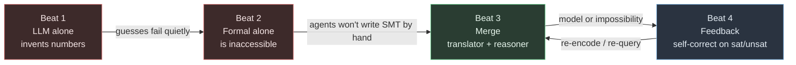
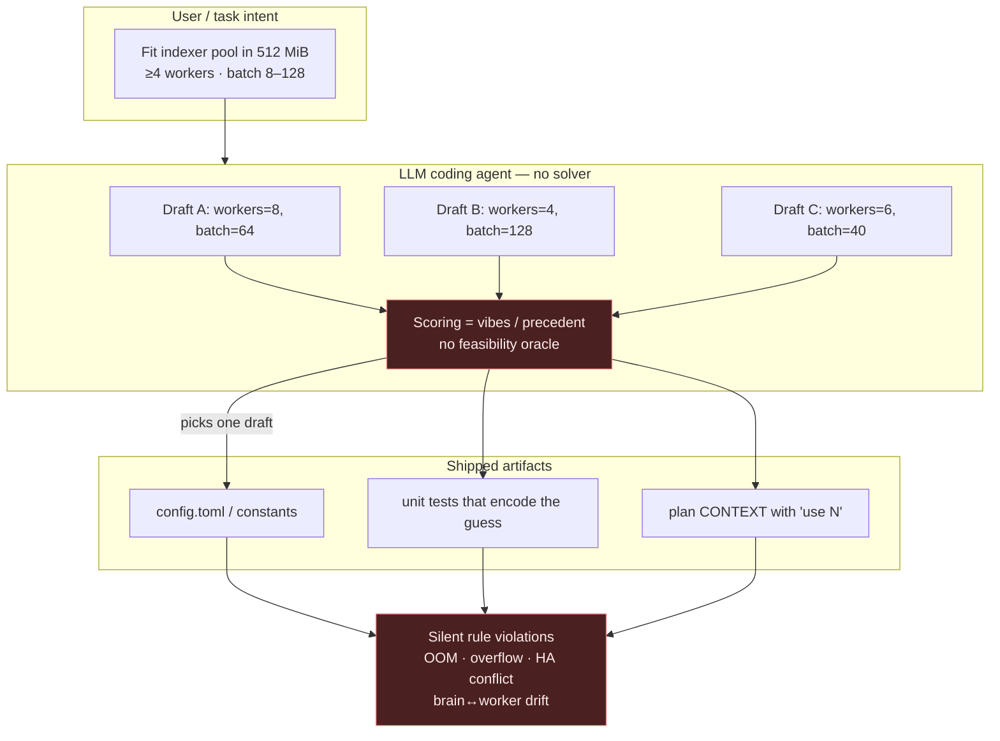
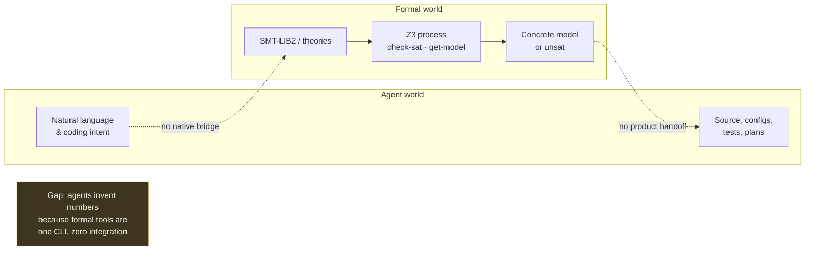
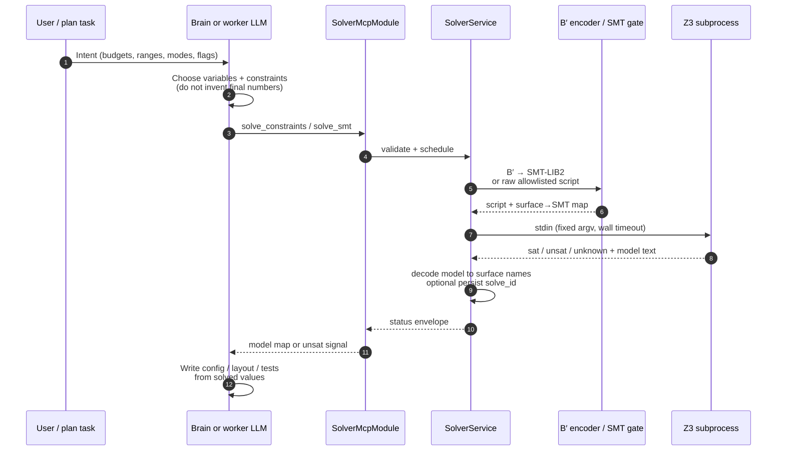
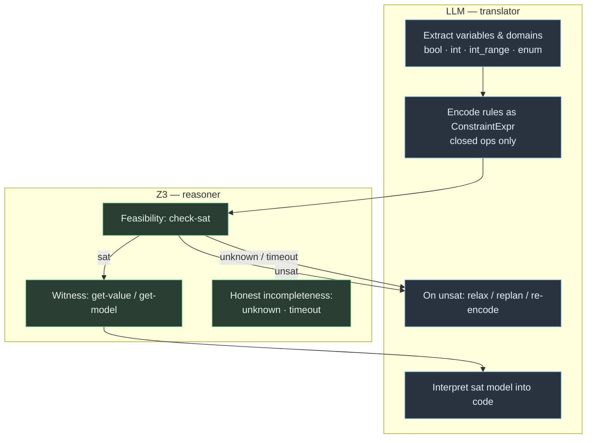
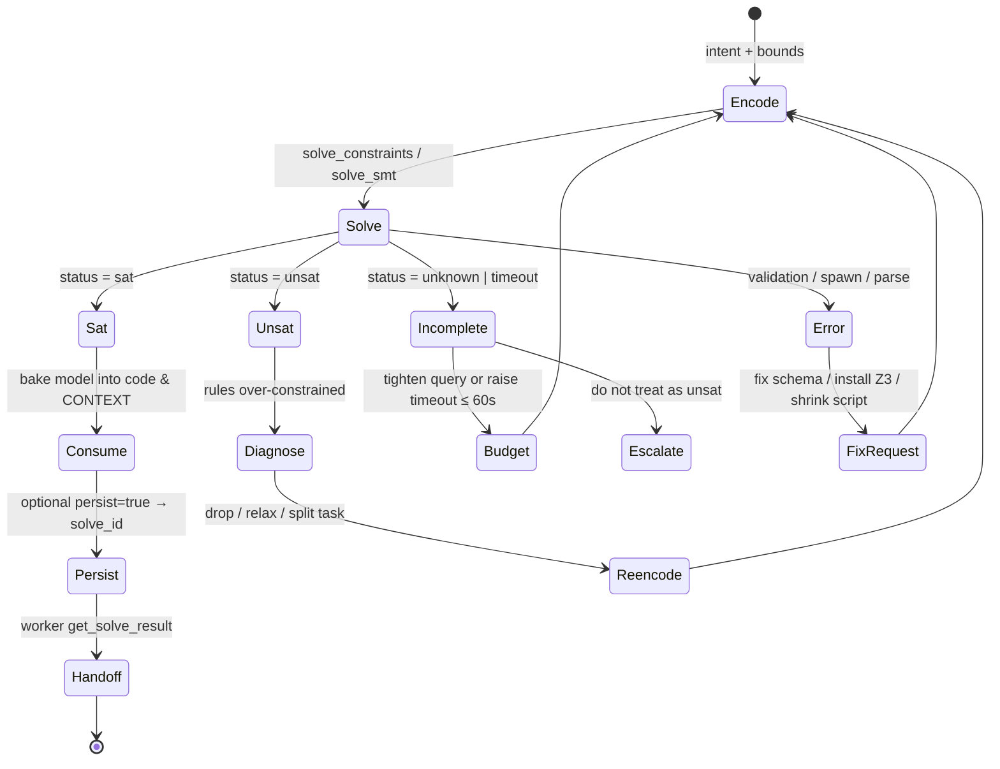
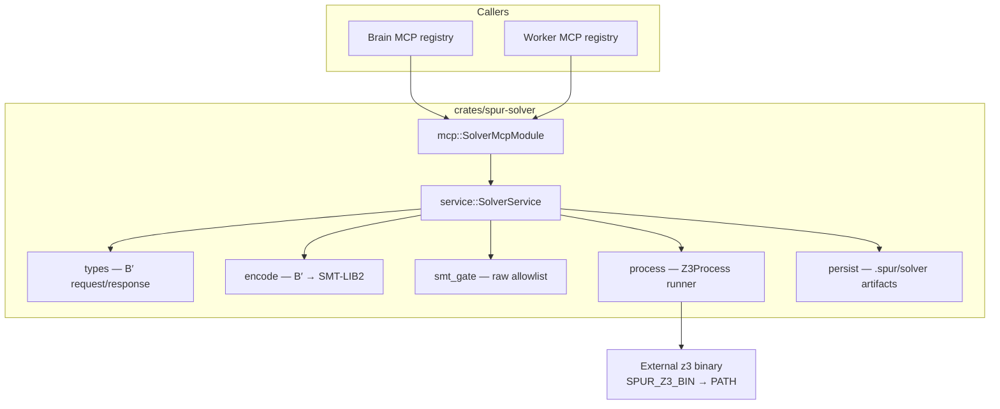

# spur-solver

Constraint **model-finding** for SPUR coding agents.

`spur-solver` gives brain and worker agents a Z3-backed model-finder so coding work starts from **solved values** instead of invented parameters. Agents propose constraints; the solver returns `sat` plus a concrete model (or `unsat` / `unknown` / `timeout`). Agents then bake those values into config, layout, infra, tests, and constants.

| Without a solver | With `spur-solver` |
|---|---|
| Agents invent buffer sizes, grid px, replica counts | One **checkable** feasible assignment |
| Silent rule violations ship | **`unsat`** surfaces impossibility before code |
| Brain→worker drift on “reasonable” numbers | Shared `solve_id` / model map |

**v1.x scope:** model-finding plus named hard unsat cores, weighted soft (`assert-soft`) preferences, typed Int/Real/BitVec νZ objectives, and lex, bounded Pareto, or box result collection.

Design: [`docs/superpowers/specs/2026-07-25-z3-constraint-solver-design.md`](../../docs/superpowers/specs/2026-07-25-z3-constraint-solver-design.md)

## Demo

[spur-tui-solver.webm](https://github.com/user-attachments/assets/60e745cf-bd86-4345-809c-80d9f1da28f3)

<p align="center">
  <sub>
    <a href="./assets/spur-tui-solver.webm">Watch the 67-second WebM demo</a>
    — encode real overlay limits as constraints, check satisfiability, and turn each concrete model into an engineering verdict.
  </sub>
</p>

---

## Why coding agents need a solver 

Modern coding agents are excellent at *proposing* structure and terrible at *guaranteeing* multi-variable feasibility. The product thesis is a four-beat loop:



### Problem: LLM alone invents constants

Without a model-finder, agents fill in numbers by feel. The drafts look confident; nothing returns `sat` or `unsat`.

**Typical failure modes for coding agents:**

| Scenario | Invented claim | What actually breaks |
|---|---|---|
| Worker pool under a memory budget | “4 workers × 128 MiB batch is fine” | OOM under real `workers * (base + k·batch)` |
| “Safe” clamp / invariant | “Always clamp width to 320” | Violates min-main or max-viewport elsewhere |
| UI grid layout | “Sidebar + rail + gutters fit 1440” | Overflow / negative main column |
| Feature + HA flags | “Need 3 replicas, cap at 2” | Conflicting policy ships |
| Brain → worker handoff | Each side picks “reasonable” values | Silent drift; tests assert different constants |



**The gap is not fluency.** The gap is that multi-variable inequalities, discrete modes, and exclusive flags form a **constraint system**. Sampling text is not solving that system.

---

### Formal solvers alone stay inaccessible

Z3 (and other SMT solvers) *can* decide these systems rigorously. Coding agents do not natively speak SMT-LIB2, manage process budgets, or hand models across brain and worker sessions.



Left alone, Z3 is:

- **Rigorous** — `sat` / `unsat` / `unknown` are honest statuses
- **Hostile to agent loops** — raw scripts, argv, timeouts, parsing, kill-on-cancel
- **Invisible to SPUR orchestration** — no `solve_id`, no MCP surface for brain and workers

So the state of the art is not “replace the LLM with Z3.” It is **give the LLM a solver tool** and let each side do what it is good at.

---

### Beat 3 — Merge: LLM as translator, solver as reasoner with MCP 

**Product thesis:** the LLM translates intent into a closed constraint language; Z3 (subprocess) runs the strict reasoning step; agents consume the model.



**Division of labor**



Worked sketch — **indexer pool under 512 MiB**:

```text
vars:
  workers ∈ [1, 16]
  batch   ∈ [8, 128]
constraints:
  workers ≥ 4
  workers * (48 + 2 * batch) ≤ 512
```

One feasible model (Z3 may return any sat assignment): `{ "workers": 4, "batch": 40 }`. The agent ships *that* assignment and tests the inequality — not a vibes draft.

---

### Feedback Loop: self-correct on sat / unsat

A single solve is not the whole story. The durable advantage is the **feedback loop**: statuses flow back so the agent can re-encode instead of double-down on a guess.



**Status discipline (normative):**

| Status | Meaning | Agent should |
|---|---|---|
| `sat` | Feasible model present | Consume `model`; optionally persist |
| `unsat` | No assignment exists | Replan / relax constraints — do **not** invent values |
| `unknown` | Solver incomplete | Retry or simplify — **never** collapse to `unsat` |
| `timeout` | Wall clock exceeded | Retry with smaller problem or higher budget ≤ 60s |
| `error` / MCP error | Invalid params, missing Z3, parse failure | Fix request or operator install |

Brain → worker handoff:

```mermaid
sequenceDiagram
  participant Brain as Brain agent
  participant Svc as SolverService
  participant Disk as .spur/solver/
  participant Worker as Worker agent

  Brain->>Svc: solve_constraints(persist=true)
  Svc->>Disk: atomic write sol_&lt;16hex&gt;.json
  Svc-->>Brain: sat + model + solve_id
  Brain->>Worker: task CONTEXT embeds solve_id + key fields
  Worker->>Svc: get_solve_result(solve_id)
  Svc->>Disk: load artifact
  Svc-->>Worker: authoritative result envelope
  Note over Worker: Workers use the tool,<br/>not ad-hoc file IO
```

---

## What this crate provides

| Surface | Role |
|---|---|
| **`solve_constraints`** | Preferred path: typed B′ variables + `ConstraintExpr` AST → model-finding |
| **`solve_smt`** | Escape hatch: raw SMT-LIB2 with size + command allowlist |
| **`get_solve_result`** | Reload a persisted `solve_id` for brain→worker handoff |
| **`SolverService`** | Process-wide owner: discovery, semaphore, spawn/kill, decode, persist |
| **`SolverMcpModule`** | Thin MCP `ToolModule` adapter (live or `catalog_only`) |

### Architecture



**Why subprocess (not FFI):**

- Avoid `!Send` / `!Sync` Z3 contexts in async MCP handlers
- Crash isolation from the main `spur` process
- Packaging already heavy (DuckDB); another linked C++ lib hurts zigbuild / xwin / CI
- Runner is mockable with a fake script (see tests)

### Module layout

```
src/
├── lib.rs        # Crate root
├── types.rs      # Variables, ConstraintExpr, requests, statuses, validation
├── encode.rs     # B′ → SMT-LIB2 + identifier mangling
├── smt_gate.rs   # Raw SMT-LIB2 size + command allowlist
├── process.rs    # ProcessRunner trait + Z3Process (kill-on-drop / group)
├── service.rs    # SolverService: semaphore, decode, orchestrate
├── persist.rs    # Atomic .spur/solver/<solve_id>.json store
└── mcp.rs        # SolverMcpModule + tool schemas
```

### B′ domains and ops (JSON path)

| Variable `type` | Fields | SMT sort |
|---|---|---|
| `bool` | `name` | Bool |
| `int` | `name` | Int (prefer `int_range` when bounds known) |
| `int_range` | `name`, `min`, `max` | Int + bound asserts |
| `enum` | `name`, `values[]` | Int indices; model maps back to labels |
| `real` | `name` | Real; model values preserve decimal/fraction text |
| `bit_vec` | `name`, `width` | `(_ BitVec width)`; `width` is in `1..=64` |

| Op class | Ops | Notes |
|---|---|---|
| Compare | `eq`, `ne`, `lt`, `le`, `gt`, `ge` | Numeric expressions; enums use `eq` / `ne` vs labels |
| Arith | `add`, `sub`, `mul` | Int/Real arithmetic; no `div` in v1 |
| Bool | `and`, `or`, `not` | Top-level constraints must be Bool |
| Bit-vector | `bv_and`, `bv_or`, `bv_xor`, `bv_not`, `bv_add`, `bv_sub`, `bv_mul` | Operands must have the same width |
| Bit-vector compare | `bv_ult`, `bv_ule`, `bv_ugt`, `bv_uge` | Unsigned comparisons |

Every expression node is tagged (`kind`: `var` | `int` | `bool` | `enum_label` | `real` | `bv` | `op`). Bare strings/numbers are rejected.

**Top-level constraint entries** may be:

| Form | Example | SMT |
|---|---|---|
| Bare (compat) | `{kind:"op",…}` | `(assert …)` |
| Named hard | `{id:"budget", expr:{…}}` | `(assert (! … :named budget))` + cores on unsat |
| Soft | `{id:"prefer", soft:true, weight:5, expr:{…}}` | `(assert-soft … :weight 5)`; only `group` emits `:id` |

Request flags: `persist`, `include_smt` (echo generated SMT).

For soft constraints, `id` and `group` have deliberately different meanings:

- `id` is a unique diagnostic identity returned in `soft_constraints`; it never creates a Z3 objective group.
- `group` is an optional, repeatable soft-only name encoded as Z3 `assert-soft :id`. Constraints with the same `group` share one weighted objective.
- Soft constraints without `group` all belong to one anonymous aggregate weighted objective. Their diagnostic IDs do not split that objective.

For example, these uniquely identified preferences are still optimized together. If a hard rule forbids `a && b`, the weight-100 preference wins:

```json
{
  "vars": [
    { "type": "bool", "name": "a" },
    { "type": "bool", "name": "b" }
  ],
  "constraints": [
    {
      "kind": "op",
      "op": "not",
      "args": [{
        "kind": "op",
        "op": "and",
        "args": [
          { "kind": "var", "name": "a" },
          { "kind": "var", "name": "b" }
        ]
      }]
    },
    {
      "id": "prefer_a",
      "soft": true,
      "weight": 1,
      "expr": { "kind": "var", "name": "a" }
    },
    {
      "id": "prefer_b",
      "soft": true,
      "weight": 100,
      "expr": { "kind": "var", "name": "b" }
    }
  ]
}
```

Use a repeated `group` only when the preferences intentionally share a named Z3 objective:

```json
{
  "constraints": [
    {
      "id": "prefer_compact",
      "group": "preferences",
      "soft": true,
      "weight": 2,
      "expr": { "kind": "var", "name": "compact" }
    },
    {
      "id": "prefer_cached",
      "group": "preferences",
      "soft": true,
      "weight": 5,
      "expr": { "kind": "var", "name": "cached" }
    }
  ]
}
```

**Objectives** (optional, max 4):

```json
"objectives": [
  { "op": "maximize", "expr": { "kind": "var", "name": "batch" } }
]
```

Soft constraints, νZ objectives, and unsat cores are mutually exclusive in one call (optimize path vs cores).

`objective_priority` defaults to `lex`. Pareto collection is bounded by `max_solutions`, which defaults to 16 and must be in `1..=64`; box collection is bounded by the request's finite generated-objective count. `use_cache` defaults to true (only sat/unsat results are cached); incremental solves use `session_op`/`session_id`.

### Optimize results

Every satisfiable optimization request adds an `optimization` envelope. The top-level `model` remains the first solution's model for backward compatibility. Each solution contains:

- `model`
- explicit `objectives` in request order, each with its model `value` and exact `bound`
- `soft_constraints` in declaration order, including diagnostic `id`, optional `group`, effective `weight`, and `satisfied`
- `groups` in first-declaration order, with aggregate `satisfied_weight` and `violated_weight`; `group` is omitted for the anonymous aggregate

Objective bounds preserve Z3's arithmetic text in `exact` and use this total classification, in priority order:

| Bound `kind` | Classification |
|---|---|
| `infinite` | `exact` contains positive or negative `oo` |
| `strict` | no `oo`, and `exact` contains `epsilon` |
| `finite` | neither `oo` nor `epsilon` |

For lex priority, one solution is collected. Pareto collects at most `max_solutions` frontier points. Box collects one model per generated independent objective; explicit objectives are capped at four. Collection order is solver-defined; consumers should compare solution sets when order is not part of their domain.

`optimization.termination` explains why collection stopped:

| Termination | Meaning |
|---|---|
| `complete` | Lex completed its single successful cycle, or the Pareto/box terminal probe was `unsat` after all available points were collected |
| `solution_limit` | Pareto reached `max_solutions` and its terminal probe was still `sat` |
| `unknown` | Z3 returned `unknown` after at least one point; the response remains partial `sat` |

An initial `unknown` stays a top-level `unknown`. A terminal `unsat` after Pareto/box solutions completes enumeration and does not replace the top-level `sat` status.

This bounded Pareto request asks for at most two points from the frontier `x + y <= 3`:

```json
{
  "vars": [
    { "type": "int_range", "name": "x", "min": 0, "max": 3 },
    { "type": "int_range", "name": "y", "min": 0, "max": 3 }
  ],
  "constraints": [{
    "kind": "op",
    "op": "le",
    "args": [
      {
        "kind": "op",
        "op": "add",
        "args": [
          { "kind": "var", "name": "x" },
          { "kind": "var", "name": "y" }
        ]
      },
      { "kind": "int", "value": 3 }
    ]
  }],
  "objectives": [
    { "op": "maximize", "expr": { "kind": "var", "name": "x" } },
    { "op": "maximize", "expr": { "kind": "var", "name": "y" } }
  ],
  "objective_priority": "pareto",
  "max_solutions": 2,
  "use_cache": false
}
```

An illustrative response shape is below. The actual two-point prefix and order are solver-defined:

```json
{
  "status": "sat",
  "model": { "x": 0, "y": 3 },
  "duration_ms": 7,
  "reason": null,
  "optimization": {
    "priority": "pareto",
    "solutions": [
      {
        "model": { "x": 0, "y": 3 },
        "objectives": [
          { "op": "maximize", "value": 0, "bound": { "kind": "finite", "exact": "0" } },
          { "op": "maximize", "value": 3, "bound": { "kind": "finite", "exact": "3" } }
        ],
        "soft_constraints": [],
        "groups": []
      },
      {
        "model": { "x": 1, "y": 2 },
        "objectives": [
          { "op": "maximize", "value": 1, "bound": { "kind": "finite", "exact": "1" } },
          { "op": "maximize", "value": 2, "bound": { "kind": "finite", "exact": "2" } }
        ],
        "soft_constraints": [],
        "groups": []
      }
    ],
    "termination": "solution_limit"
  },
  "solver_version": "Z3 version 4.16.0 - 64 bit"
}
```

**Status `ended`:** returned for `session_op: end` only. No model. Agents must not treat it as a feasible assignment.

### Resource defaults

| Parameter | Default |
|---|---|
| `timeout_ms` | 30_000 (hard cap 60_000) |
| Max concurrent Z3 children | 4 (process-wide semaphore) |
| Max variables / constraints | 64 / 256 |
| Max expression depth | 32 |
| Z3 memory soft cap | 1024 MiB |
| Persist root | `<repo_root>/.spur/solver/` |
| `solve_id` | `^sol_[0-9a-f]{16}$` |

### Operator setup

Z3 is **operator-installed**, not agent-supplied:

1. Install Z3 so `z3` is on `PATH`, **or** set `SPUR_Z3_BIN` to the binary. Optimization requires Z3 4.8.12 or newer; the final compatibility matrix uses Z3 4.16.0.
2. Agents never pass executable paths or custom Z3 argv.
3. Missing binary → structured `solver_unavailable` (no silent download in v1).

### Tests

```bash
# Unit / fake-runner tests (no Z3 required)
scripts/spur-cargo test -p spur-solver

# Real Z3 path (binary required; ignored tests must be selected explicitly)
SPUR_REMOTE=0 SPUR_TEST_Z3=1 scripts/spur-cargo test -p spur-solver --test real_z3 -- --ignored
```

---

## Example: typed solve

```json
{
  "vars": [
    { "type": "int_range", "name": "workers", "min": 1, "max": 16 },
    { "type": "int_range", "name": "batch", "min": 8, "max": 128 }
  ],
  "constraints": [
    {
      "kind": "op",
      "op": "ge",
      "args": [
        { "kind": "var", "name": "workers" },
        { "kind": "int", "value": 4 }
      ]
    },
    {
      "kind": "op",
      "op": "le",
      "args": [
        {
          "kind": "op",
          "op": "mul",
          "args": [
            { "kind": "var", "name": "workers" },
            {
              "kind": "op",
              "op": "add",
              "args": [
                { "kind": "int", "value": 48 },
                {
                  "kind": "op",
                  "op": "mul",
                  "args": [
                    { "kind": "int", "value": 2 },
                    { "kind": "var", "name": "batch" }
                  ]
                }
              ]
            }
          ]
        },
        { "kind": "int", "value": 512 }
      ]
    }
  ],
  "timeout_ms": 30000,
  "persist": true
}
```

Illustrative success envelope:

```json
{
  "status": "sat",
  "model": { "workers": 4, "batch": 40 },
  "duration_ms": 12,
  "solve_id": "sol_a1b2c3d4e5f67890",
  "reason": null
}
```

---

## Non-goals (still deferred)

- Full program verification / typechecking replacement
- Proof certificates / interpolants (named unsat cores ship; full proofs do not)
- Typed String, Array, Float, and quantified expressions (use `solve_smt` if needed)
- Unbounded Pareto result streams (`max_solutions` is capped at 64)
- Bundling Z3 into dist artifacts / auto-download
- TUI surface for solves

---

## Related

| Doc / artifact | Role |
|---|---|
| [Design spec](../../docs/superpowers/specs/2026-07-25-z3-constraint-solver-design.md) | Normative product + architecture decisions |
| [Implementation plan](../../docs/superpowers/plans/2026-07-25-z3-constraint-solver.md) | Phased build tasks |
| [Explainer storyboard](../../docs/product_launch/media_pack/explainers/spur-solver/hyperframes/STORYBOARD.md) | Four-beat narrative for media |
| Prior art [alejandroqh/z39](https://github.com/alejandroqh/z39) | Agent MCP over subprocess Z3 |
