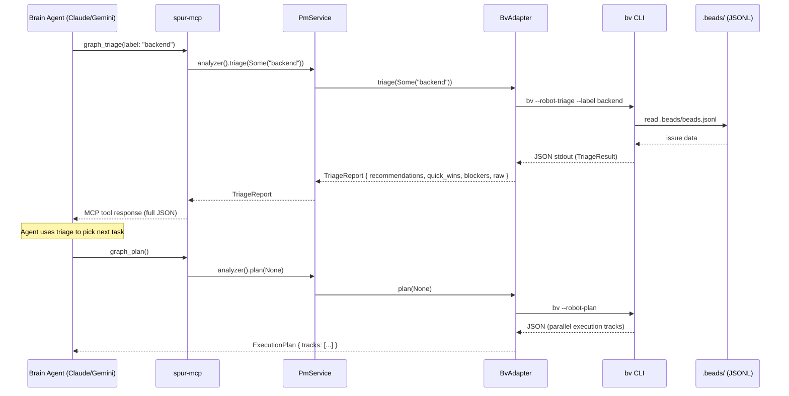

# spur-pm x beads_viewer (bv) Collaboration Architecture

> **HISTORICAL DOCUMENT (as of 2026-05).** This describes the previous architecture where SPUR shelled out to the `bv` binary for graph analysis. As of the graph-engine landing (commits 6f9378df..2027c302), graph analysis is in-process via `crates/spur-pm/src/graph_engine`. This document is retained for historical context only.

**Date:** 2026-04-17
**Author:** L9 Staff Engineer Review
**Status:** Proposal (Phase 1 ready for implementation)

---

## Executive Summary

`beads_viewer` (`bv`) is a graph-aware analysis TUI for the Beads issue tracker by the same author as `beads_rust` (`br`). It provides 15+ robot-protocol commands returning structured JSON: PageRank, critical path, betweenness centrality, parallel execution planning, sprint burndown, and health alerts.

spur-pm currently wraps `br` for CRUD operations. This proposal adds a `GraphAnalyzer` trait + `BvAdapter` that wraps `bv --robot-*` commands, giving spur's orchestrator, MCP server, and TUI access to graph intelligence — with zero degradation when `bv` is not installed.

---

## Architecture Diagram

```
┌─────────────────────────────────────────────────────────────────────┐
│                         spur ecosystem                              │
│                                                                     │
│  ┌──────────────────────── spur-pm ───────────────────────────────┐ │
│  │                                                                 │ │
│  │  IssueTracker trait              GraphAnalyzer trait (NEW)      │ │
│  │  ┌──────────────┐              ┌──────────────┐                │ │
│  │  │ BeadsAdapter │              │  BvAdapter   │                │ │
│  │  │   (br CLI)   │              │  (bv CLI)    │                │ │
│  │  │              │              │              │                │ │
│  │  │  get_issue   │              │  triage()    │                │ │
│  │  │  list_issues │              │  plan()      │                │ │
│  │  │  update_issue│              │  insights()  │                │ │
│  │  │  poll()      │              │  alerts()    │                │ │
│  │  └──────┬───────┘              │  subgraph()  │                │ │
│  │         │                      └──────┬───────┘                │ │
│  │         │                             │                         │ │
│  │         │       PmService             │                         │ │
│  │         │    ┌────────────────────────┘                         │ │
│  │         │    │  analyzer: Option<BvAdapter>                     │ │
│  │         └────┴──────────┐                                       │ │
│  └─────────────────────────┤                                       │ │
│                            │                                        │ │
│  ┌─────────────────────────┼──────────────────────────────────────┐ │
│  │                         │  Consumers                            │ │
│  │                         │                                       │ │
│  │  ┌─────────────┐  ┌────┴───────┐  ┌────────────┐              │ │
│  │  │ Orchestrator│  │ MCP Server │  │    TUI     │              │ │
│  │  │ (spur-core) │  │ (spur-mcp) │  │ (spur-tui) │              │ │
│  │  │             │  │            │  │            │              │ │
│  │  │ Phase 2:    │  │ Phase 1:   │  │ Phase 1:   │              │ │
│  │  │ dep-aware   │  │ graph_*    │  │ alert      │              │ │
│  │  │ delegation  │  │ MCP tools  │  │ badge      │              │ │
│  │  └─────────────┘  └────────────┘  └────────────┘              │ │
│  └────────────────────────────────────────────────────────────────┘ │
│                                                                     │
│                      ┌───────────────┐                              │
│                      │  .beads/ dir  │  ← shared data contract     │
│                      │  (SQLite +    │                              │
│                      │   JSONL)      │                              │
│                      └───────┬───────┘                              │
│                       ↑      │      ↑                               │
│                     br CLI   │    bv CLI                            │
│                    (write)   │   (read + analyze)                   │
│                              │                                      │
└──────────────────────────────┘──────────────────────────────────────┘
```

---

## Data Flow: Robot Protocol Integration



---

## MCTS Evaluation Summary

| Option | Description | Value | Effort | Risk | Score |
|--------|-------------|-------|--------|------|-------|
| A | Inline bv in BeadsAdapter | 6 | 3 | 5 | 4/10 |
| B | Separate GraphAnalyzer trait | 8 | 4 | 2 | 8/10 |
| C | MCP-only (bypass spur-pm) | 5 | 3 | 3 | 5/10 |
| **D** | **Hybrid: B + C + TUI badge** | **9** | **5** | **2** | **9/10** |

**Winner: Option D** — GraphAnalyzer trait in spur-pm, MCP tools for brain agents, alert badge in TUI. Each layer is independently useful and degrades gracefully.

---

## Phase Plan

### Phase 1: Foundation + MCP (this sprint)

| # | Deliverable | File | Effort |
|---|-------------|------|--------|
| 1 | `GraphAnalyzer` trait + output types | `spur-pm/src/graph.rs` | M |
| 2 | `BvAdapter` (bv CLI wrapper) | `spur-pm/src/bv.rs` | M |
| 3 | PmService gains `analyzer()` | `spur-pm/src/service.rs` | S |
| 4 | lib.rs exports | `spur-pm/src/lib.rs` | XS |
| 5 | 5 MCP tools (graph_*) | `spur-mcp/src/server.rs` | M |
| 6 | spur-acp event variants | `spur-acp/src/domain/events.rs` | S |

### Phase 2: Orchestrator Intelligence (next sprint)

| # | Deliverable | File | Effort |
|---|-------------|------|--------|
| 7 | Dep-aware delegation via `plan()` | `spur-core/src/orchestrator.rs` | L |
| 8 | Alert badges in TUI status bar | `spur-tui/src/views/dashboard.rs` | S |
| 9 | Graph insights overlay (modal) | `spur-tui/src/components/graph_overlay.rs` | M |

### Phase 3: Advanced (future)

| # | Deliverable | Notes |
|---|-------------|-------|
| 10 | TUI dependency graph (ASCII DAG) | Render subgraph in issue detail |
| 11 | Multi-repo workspace support | Leverage `.bv/workspace.yaml` |
| 12 | Sprint burndown + forecast | `--robot-burndown`, `--robot-forecast` |
| 13 | Time-travel diff integration | `--robot-diff --diff-since` |

---

## GraphAnalyzer Trait Design

```rust
// crates/spur-pm/src/graph.rs

#[async_trait]
pub trait GraphAnalyzer: Send + Sync {
    /// Full project triage — recommendations, quick wins, blockers
    async fn triage(&self, label: Option<&str>) -> anyhow::Result<TriageReport>;

    /// Parallel execution plan with dependency-aware tracks
    async fn plan(&self, label: Option<&str>) -> anyhow::Result<ExecutionPlan>;

    /// Graph metrics: PageRank, betweenness, critical path, cycles
    async fn insights(&self, label: Option<&str>) -> anyhow::Result<GraphInsights>;

    /// Active alerts: stale issues, cascading blocks, cycles, priority mismatches
    async fn alerts(&self) -> anyhow::Result<AlertReport>;

    /// Dependency subgraph for a specific issue
    async fn subgraph(
        &self,
        root_id: &str,
        depth: Option<u32>,
        format: GraphFormat,
    ) -> anyhow::Result<DependencyGraph>;
}

pub enum GraphFormat { Json, Dot, Mermaid }
```

---

## Type Mapping: bv JSON → Rust Structs

### TriageReport (from `--robot-triage`)

```rust
#[derive(Debug, Clone, Deserialize)]
pub struct TriageReport {
    #[serde(default)]
    pub generated_at: Option<String>,
    #[serde(default)]
    pub data_hash: Option<String>,
    pub triage: TriageResult,
    /// Full bv output for MCP passthrough
    #[serde(skip)]
    pub raw: serde_json::Value,
}

#[derive(Debug, Clone, Deserialize)]
pub struct TriageResult {
    pub quick_ref: QuickRef,
    #[serde(default)]
    pub recommendations: Vec<Recommendation>,
    #[serde(default)]
    pub quick_wins: Vec<QuickWin>,
    #[serde(default)]
    pub blockers_to_clear: Vec<BlockerInfo>,
    pub project_health: ProjectHealth,
    #[serde(default)]
    pub alerts: Vec<TriageAlert>,
    #[serde(default)]
    pub commands: serde_json::Value,
}

#[derive(Debug, Clone, Deserialize)]
pub struct QuickRef {
    #[serde(default)]
    pub open_count: usize,
    #[serde(default)]
    pub actionable_count: usize,
    #[serde(default)]
    pub blocked_count: usize,
    #[serde(default)]
    pub in_progress_count: usize,
    #[serde(default)]
    pub top_picks: Vec<TopPick>,
}

#[derive(Debug, Clone, Deserialize)]
pub struct TopPick {
    pub id: String,
    pub title: String,
    #[serde(default)]
    pub score: f64,
    #[serde(default)]
    pub reasons: Vec<String>,
    #[serde(default)]
    pub unblocks: usize,
}

#[derive(Debug, Clone, Deserialize)]
pub struct Recommendation {
    pub id: String,
    pub title: String,
    #[serde(default)]
    pub r#type: Option<String>,
    #[serde(default)]
    pub status: Option<String>,
    #[serde(default)]
    pub priority: Option<i32>,
    #[serde(default)]
    pub score: f64,
    #[serde(default)]
    pub action: Option<String>,
    #[serde(default)]
    pub reasons: Vec<String>,
    #[serde(default)]
    pub unblocks_ids: Vec<String>,
    #[serde(default)]
    pub blocked_by: Vec<String>,
}

#[derive(Debug, Clone, Deserialize)]
pub struct QuickWin {
    pub id: String,
    pub title: String,
    #[serde(default)]
    pub score: f64,
    #[serde(default)]
    pub reason: Option<String>,
    #[serde(default)]
    pub unblocks_ids: Vec<String>,
}

#[derive(Debug, Clone, Deserialize)]
pub struct BlockerInfo {
    pub id: String,
    pub title: String,
    #[serde(default)]
    pub unblocks_count: usize,
    #[serde(default)]
    pub unblocks_ids: Vec<String>,
    #[serde(default)]
    pub actionable: bool,
    #[serde(default)]
    pub blocked_by: Vec<String>,
}

#[derive(Debug, Clone, Deserialize)]
pub struct ProjectHealth {
    #[serde(default)]
    pub counts: HealthCounts,
    #[serde(default)]
    pub graph: GraphHealth,
    #[serde(default)]
    pub velocity: Option<VelocitySnapshot>,
    #[serde(default)]
    pub staleness: Option<StalenessInfo>,
}

#[derive(Debug, Clone, Default, Deserialize)]
pub struct HealthCounts {
    #[serde(default)]
    pub total: usize,
    #[serde(default)]
    pub open: usize,
    #[serde(default)]
    pub closed: usize,
    #[serde(default)]
    pub blocked: usize,
    #[serde(default)]
    pub actionable: usize,
}

#[derive(Debug, Clone, Default, Deserialize)]
pub struct GraphHealth {
    #[serde(default)]
    pub node_count: usize,
    #[serde(default)]
    pub edge_count: usize,
    #[serde(default)]
    pub density: f64,
    #[serde(default)]
    pub has_cycles: bool,
    #[serde(default)]
    pub cycle_count: usize,
}

#[derive(Debug, Clone, Deserialize)]
pub struct VelocitySnapshot {
    #[serde(default)]
    pub closed_last_7_days: usize,
    #[serde(default)]
    pub closed_last_30_days: usize,
    #[serde(default)]
    pub avg_days_to_close: f64,
}

#[derive(Debug, Clone, Deserialize)]
pub struct StalenessInfo {
    #[serde(default)]
    pub stale_count: usize,
    #[serde(default)]
    pub stalest_issue_id: Option<String>,
    #[serde(default)]
    pub stalest_issue_days: usize,
    #[serde(default)]
    pub threshold_days: usize,
}
```

### ExecutionPlan (from `--robot-plan`)

```rust
#[derive(Debug, Clone, Deserialize)]
pub struct ExecutionPlan {
    #[serde(default)]
    pub generated_at: Option<String>,
    #[serde(default)]
    pub data_hash: Option<String>,
    pub plan: PlanBody,
    #[serde(skip)]
    pub raw: serde_json::Value,
}

#[derive(Debug, Clone, Deserialize)]
pub struct PlanBody {
    #[serde(default)]
    pub tracks: Vec<ExecutionTrack>,
    #[serde(default)]
    pub total_actionable: usize,
    #[serde(default)]
    pub total_blocked: usize,
    #[serde(default)]
    pub summary: Option<PlanSummary>,
}

#[derive(Debug, Clone, Deserialize)]
pub struct ExecutionTrack {
    pub track_id: String,
    #[serde(default)]
    pub items: Vec<TrackItem>,
    #[serde(default)]
    pub reason: Option<String>,
}

#[derive(Debug, Clone, Deserialize)]
pub struct TrackItem {
    pub id: String,
    pub title: String,
    #[serde(default)]
    pub priority: Option<i32>,
    #[serde(default)]
    pub status: Option<String>,
    #[serde(default)]
    pub unblocks: Vec<String>,
}

#[derive(Debug, Clone, Deserialize)]
pub struct PlanSummary {
    #[serde(default)]
    pub highest_impact: Option<String>,
    #[serde(default)]
    pub impact_reason: Option<String>,
    #[serde(default)]
    pub unblocks_count: usize,
}
```

### GraphInsights (from `--robot-insights`)

```rust
/// Note: bv's Insights struct uses Go field names (capitalized, no JSON tags)
#[derive(Debug, Clone, Deserialize)]
pub struct GraphInsights {
    #[serde(default)]
    pub generated_at: Option<String>,
    #[serde(default)]
    pub data_hash: Option<String>,

    // Go-capitalized field names (no json tags in bv source)
    #[serde(rename = "Bottlenecks", default)]
    pub bottlenecks: Vec<InsightItem>,
    #[serde(rename = "Keystones", default)]
    pub keystones: Vec<InsightItem>,
    #[serde(rename = "Influencers", default)]
    pub influencers: Vec<InsightItem>,
    #[serde(rename = "Hubs", default)]
    pub hubs: Vec<InsightItem>,
    #[serde(rename = "Authorities", default)]
    pub authorities: Vec<InsightItem>,
    #[serde(rename = "Cores", default)]
    pub cores: Vec<InsightItem>,
    #[serde(rename = "Articulation", default)]
    pub articulation: Vec<String>,
    #[serde(rename = "Orphans", default)]
    pub orphans: Vec<String>,
    #[serde(rename = "Cycles", default)]
    pub cycles: Vec<Vec<String>>,
    #[serde(rename = "ClusterDensity", default)]
    pub cluster_density: f64,

    #[serde(default)]
    pub full_stats: Option<FullStats>,
    #[serde(default)]
    pub top_what_ifs: Vec<WhatIfEntry>,

    #[serde(skip)]
    pub raw: serde_json::Value,
}

/// bv InsightItem: {"ID": "...", "Value": 0.0}
#[derive(Debug, Clone, Deserialize)]
pub struct InsightItem {
    #[serde(rename = "ID")]
    pub id: String,
    #[serde(rename = "Value", default)]
    pub value: f64,
}

#[derive(Debug, Clone, Deserialize)]
pub struct FullStats {
    #[serde(default)]
    pub pagerank: std::collections::HashMap<String, f64>,
    #[serde(default)]
    pub betweenness: std::collections::HashMap<String, f64>,
    #[serde(default)]
    pub critical_path_score: std::collections::HashMap<String, f64>,
    #[serde(default)]
    pub articulation_points: Vec<String>,
}

#[derive(Debug, Clone, Deserialize)]
pub struct WhatIfEntry {
    pub issue_id: String,
    #[serde(default)]
    pub title: Option<String>,
    #[serde(default)]
    pub delta: Option<WhatIfDelta>,
}

#[derive(Debug, Clone, Deserialize)]
pub struct WhatIfDelta {
    #[serde(default)]
    pub direct_unblocks: usize,
    #[serde(default)]
    pub transitive_unblocks: usize,
    #[serde(default)]
    pub blocked_reduction: usize,
    #[serde(default)]
    pub depth_reduction: f64,
    #[serde(default)]
    pub estimated_days_saved: Option<f64>,
    #[serde(default)]
    pub explanation: Option<String>,
}
```

### AlertReport (from `--robot-alerts`)

```rust
#[derive(Debug, Clone, Deserialize)]
pub struct AlertReport {
    #[serde(default)]
    pub generated_at: Option<String>,
    #[serde(default)]
    pub data_hash: Option<String>,
    #[serde(default)]
    pub alerts: Vec<Alert>,
    #[serde(default)]
    pub summary: Option<AlertSummary>,
    #[serde(skip)]
    pub raw: serde_json::Value,
}

#[derive(Debug, Clone, Deserialize)]
pub struct Alert {
    #[serde(rename = "type")]
    pub alert_type: String,
    pub severity: String,
    pub message: String,
    #[serde(default)]
    pub issue_id: Option<String>,
    #[serde(default)]
    pub issue_ids: Vec<String>,
    #[serde(default)]
    pub label: Option<String>,
    #[serde(default)]
    pub details: Vec<String>,
    #[serde(default)]
    pub baseline_value: Option<f64>,
    #[serde(default)]
    pub current_value: Option<f64>,
    #[serde(default)]
    pub delta: Option<f64>,
}

#[derive(Debug, Clone, Deserialize)]
pub struct AlertSummary {
    #[serde(default)]
    pub total: usize,
    #[serde(default)]
    pub critical: usize,
    #[serde(default)]
    pub warning: usize,
    #[serde(default)]
    pub info: usize,
}
```

### DependencyGraph (from `--robot-graph --graph-format=json`)

```rust
#[derive(Debug, Clone, Deserialize)]
pub struct DependencyGraph {
    #[serde(default)]
    pub format: Option<String>,
    /// Populated for dot/mermaid formats
    #[serde(default)]
    pub graph: Option<String>,
    #[serde(default)]
    pub nodes: usize,
    #[serde(default)]
    pub edges: usize,
    #[serde(default)]
    pub adjacency: Option<AdjacencyData>,
    #[serde(skip)]
    pub raw: serde_json::Value,
}

#[derive(Debug, Clone, Deserialize)]
pub struct AdjacencyData {
    #[serde(default)]
    pub nodes: Vec<GraphNode>,
    #[serde(default)]
    pub edges: Vec<GraphEdge>,
}

#[derive(Debug, Clone, Deserialize)]
pub struct GraphNode {
    pub id: String,
    #[serde(default)]
    pub title: Option<String>,
    #[serde(default)]
    pub status: Option<String>,
    #[serde(default)]
    pub priority: Option<i32>,
    #[serde(default)]
    pub labels: Vec<String>,
    #[serde(default)]
    pub pagerank: Option<f64>,
}

#[derive(Debug, Clone, Deserialize)]
pub struct GraphEdge {
    pub from: String,
    pub to: String,
    #[serde(rename = "type", default)]
    pub edge_type: Option<String>,
}
```

---

## BvAdapter Implementation

```rust
// crates/spur-pm/src/bv.rs

pub struct BvAdapter {
    cwd: PathBuf,
}

impl BvAdapter {
    pub async fn connect(repo_root: &Path) -> anyhow::Result<Self> {
        let adapter = Self { cwd: repo_root.to_path_buf() };
        // Probe bv binary
        let output = adapter.run_bv(&["--version"]).await?;
        tracing::info!(output = %output.trim(), "connected to beads_viewer (bv)");
        Ok(adapter)
    }

    async fn run_bv(&self, args: &[&str]) -> anyhow::Result<String> {
        let mut cmd = Command::new("bv");
        cmd.args(args)
            .current_dir(&self.cwd)
            .env("BV_OUTPUT_FORMAT", "json")
            .env("NO_COLOR", "1");
        
        let output = tokio::time::timeout(
            std::time::Duration::from_secs(10),
            cmd.output()
        ).await
            .map_err(|_| anyhow::anyhow!("bv timed out after 10s"))?
            .map_err(|e| {
                if e.kind() == std::io::ErrorKind::NotFound {
                    anyhow::anyhow!(
                        "bv binary not found. Install: brew install dicklesworthstone/tap/bv"
                    )
                } else {
                    anyhow::anyhow!("Failed to execute bv: {e}")
                }
            })?;
        
        if output.status.success() {
            Ok(String::from_utf8_lossy(&output.stdout).to_string())
        } else {
            let stderr = String::from_utf8_lossy(&output.stderr);
            anyhow::bail!("bv failed: {}", stderr.trim())
        }
    }

    /// Parse bv output, keeping raw Value for MCP passthrough
    fn parse_with_raw<T: serde::de::DeserializeOwned + HasRaw>(
        &self,
        output: &str,
        cmd: &str,
    ) -> anyhow::Result<T> {
        let raw: serde_json::Value = serde_json::from_str(output)
            .map_err(|e| anyhow::anyhow!("Failed to parse bv {cmd}: {e}"))?;
        let mut result: T = serde_json::from_value(raw.clone())
            .map_err(|e| anyhow::anyhow!("Failed to deserialize bv {cmd}: {e}"))?;
        result.set_raw(raw);
        Ok(result)
    }
}
```

---

## PmService Changes

```rust
// crates/spur-pm/src/service.rs — additions

pub struct PmService {
    inner: PmBackendInner,
    bv: Option<BvAdapter>,  // NEW
}

impl PmService {
    pub async fn try_new(...) -> anyhow::Result<Option<Self>> {
        // ... existing logic ...
        // After creating beads adapter, try bv:
        let bv = if beads_dir.is_dir() {
            match BvAdapter::connect(repo_root).await {
                Ok(bv) => Some(bv),
                Err(e) => {
                    tracing::info!("bv unavailable (graph analysis disabled): {e}");
                    None
                }
            }
        } else {
            None
        };
        // ... store bv in Self ...
    }

    /// Returns the graph analyzer if bv is available
    pub fn analyzer(&self) -> Option<&BvAdapter> {
        self.bv.as_ref()
    }
}
```

---

## MCP Tool Surface (5 new tools)

| Tool Name | bv Command | Input | Output |
|-----------|------------|-------|--------|
| `graph_triage` | `--robot-triage [--label L]` | `{ label?: string }` | Full triage JSON |
| `graph_plan` | `--robot-plan [--label L]` | `{ label?: string }` | Parallel tracks |
| `graph_insights` | `--robot-insights [--label L]` | `{ label?: string }` | 9 graph metrics |
| `graph_alerts` | `--robot-alerts` | `{}` | Health alerts |
| `graph_subgraph` | `--robot-graph --graph-root=ID` | `{ root_id: string, depth?: int, format?: "json"\|"dot"\|"mermaid" }` | Dependency graph |

### Tool descriptions for brain agents

```json
{
  "name": "graph_triage",
  "description": "Get PageRank-weighted project triage: top recommendations, quick wins, blockers to clear, and project health. Start here for orientation. Optionally scope to a label.",
  "inputSchema": {
    "type": "object",
    "properties": {
      "label": { "type": "string", "description": "Scope to issues with this label" }
    }
  }
}
```

---

## Key Design Invariants

1. **bv is ALWAYS optional** — `PmService.bv: Option<BvAdapter>`. MCP tools return helpful error when unavailable.
2. **br is the ONLY write path** — bv is read-only analysis. All mutations go through BeadsAdapter.
3. **`.beads/` is the ONLY shared contract** — both br and bv read from it. No IPC between them.
4. **`raw: Value` passthrough** — every typed report carries the full bv JSON for MCP forwarding.
5. **10-second timeout** — all bv subprocess calls are time-bounded.
6. **Go-capitalized field names** — bv's `Insights` struct uses `"ID"`, `"Value"`, `"Bottlenecks"` etc. (no json tags). Rust types use `#[serde(rename = "...")]`.

---

## Graceful Degradation Matrix

| Condition | Behavior |
|-----------|----------|
| bv not installed | `PmService.analyzer()` → `None`. All graph features disabled. MCP tools return install hint. |
| bv installed, no `.beads/` | Won't happen — BvAdapter only created when BeadsAdapter succeeds |
| bv timeout (>10s) | Error propagated to caller. MCP tool returns error message. |
| bv output schema changes | `#[serde(default)]` absorbs missing fields. `raw` Value always available. |
| bv not installed, br installed | Standard spur-pm behavior. Zero regression. |

---

## File Change Summary

### New Files
| File | Purpose |
|------|---------|
| `crates/spur-pm/src/graph.rs` | `GraphAnalyzer` trait + all output types |
| `crates/spur-pm/src/bv.rs` | `BvAdapter` implementing GraphAnalyzer |

### Modified Files
| File | Change |
|------|--------|
| `crates/spur-pm/src/lib.rs` | Add `pub mod graph; pub mod bv;` exports |
| `crates/spur-pm/src/service.rs` | Add `bv: Option<BvAdapter>` field, `analyzer()` method, connect logic |
| `crates/spur-mcp/src/server.rs` | Add 5 graph_* MCP tool handlers |
| `crates/spur-acp/src/domain/events.rs` | Add `GraphTriageLoaded`, `GraphAlertsLoaded` event variants |

### No Changes Required
| File | Reason |
|------|--------|
| `crates/spur-pm/Cargo.toml` | No new deps — already has tokio, serde_json, anyhow |
| `crates/spur-pm/src/beads.rs` | br adapter unchanged — bv is a separate adapter |
| `crates/spur-pm/src/adapter.rs` | IssueTracker trait unchanged |
| `crates/spur-pm/src/types.rs` | Core PM types unchanged |
