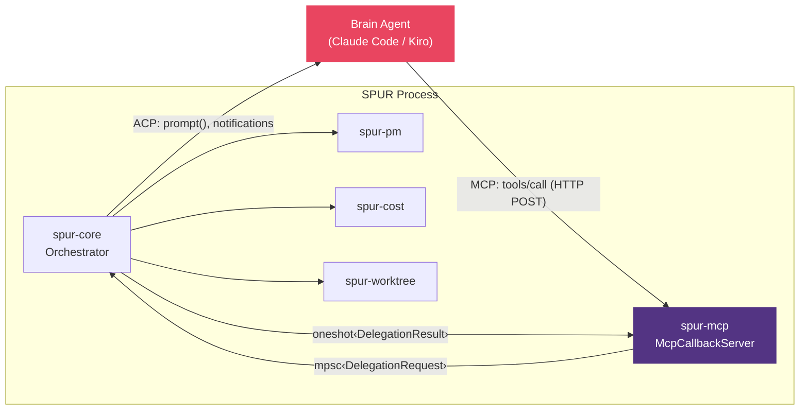
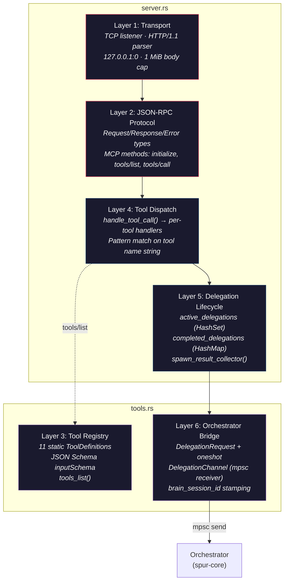
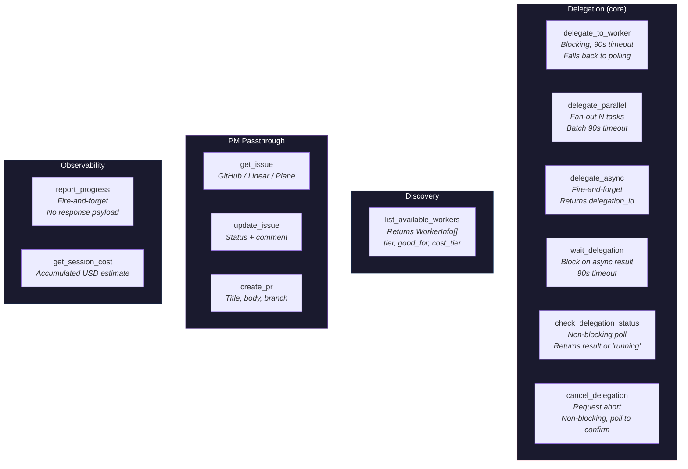
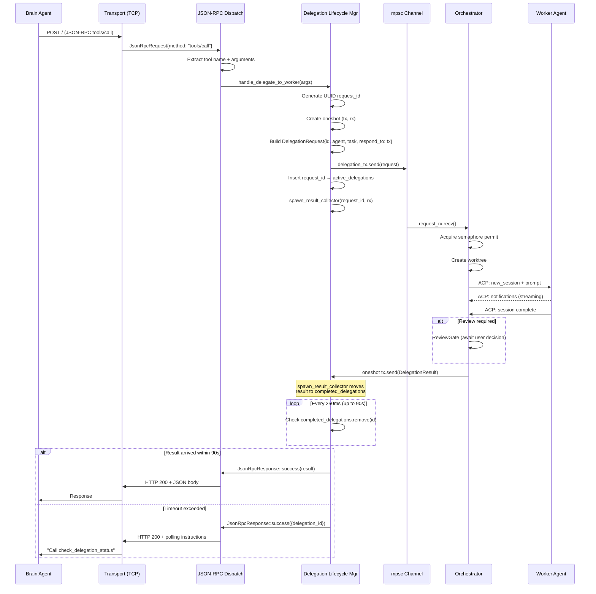
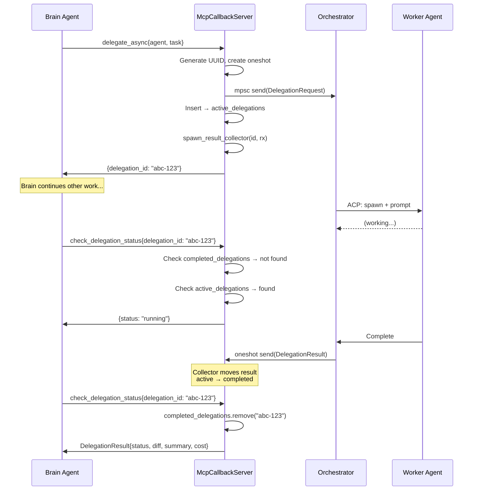
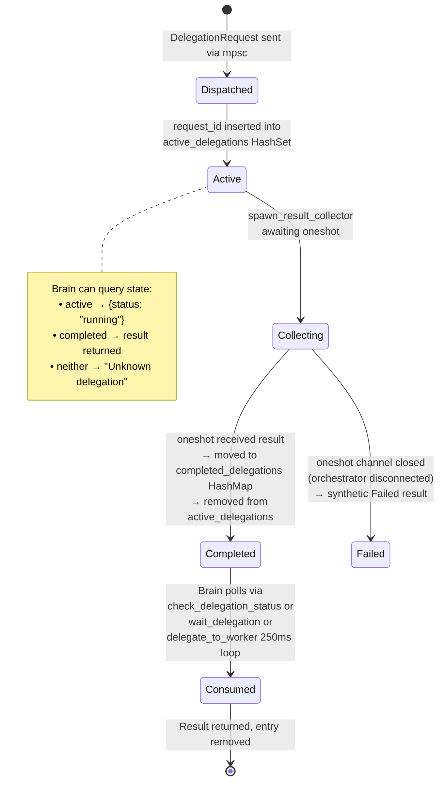
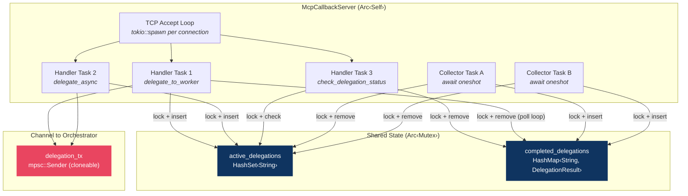
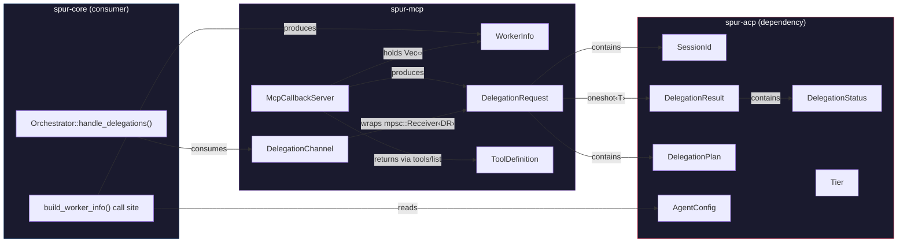

# spur-mcp — Detailed Architecture

> Reviewed 2026-04-16. Covers `crates/spur-mcp/src/` (~3k lines, 3 files).

## 1. Role in SPUR

SPUR uses a **dual-channel architecture** to communicate with the brain agent:

| Channel | Direction | Protocol | Purpose |
|---|---|---|---|
| ACP | SPUR → Brain | JSON-RPC / stdio | Session management, prompts, notifications |
| MCP | Brain → SPUR | JSON-RPC / HTTP | Tool calls: delegation, PM ops, observability |

`spur-mcp` implements the **inbound** MCP channel. It is the brain's only mechanism to cause side effects in SPUR — every delegation, every PR creation, every progress report flows through this crate.



**First-principles justification**: An LLM brain can only act through tool calls. ACP gives SPUR control over the brain's session. MCP gives the brain control over SPUR's capabilities. The two channels form a bidirectional control plane where neither side is fully passive.

---

## 2. Internal Layer Architecture

`spur-mcp` is 3 files with 6 logical layers:



### Layer Details

| Layer | File | Responsibility | Key Design Decision |
|---|---|---|---|
| **Transport** | `server.rs` | TCP accept loop, HTTP parsing | Hand-rolled HTTP — avoids axum/hyper dependency for a localhost-only, single-client server |
| **JSON-RPC** | `server.rs` | MCP protocol framing | Standard error codes (-32700, -32601, -32602, -32603) |
| **Tool Registry** | `tools.rs` | Static tool definitions | Compile-time fixed; no dynamic registration |
| **Tool Dispatch** | `server.rs` | Route tool name → handler | String match; each handler validates its own params |
| **Delegation Lifecycle** | `server.rs` | Async state for in-flight delegations | Background collector pattern decouples delegation lifetime from HTTP request lifetime |
| **Orchestrator Bridge** | `tools.rs` | Channel types + request construction | Oneshot-per-request eliminates response routing bugs |

---

## 3. Tool Taxonomy

11 tools in 4 categories, all exposed via `tools/list`:



### Delegation Patterns

The brain has three strategies for dispatching work:

| Pattern | Tool(s) | Blocking? | Use Case |
|---|---|---|---|
| **Synchronous** | `delegate_to_worker` | Yes (90s cap) | Single task, brain waits for result |
| **Async + Poll** | `delegate_async` → `check_delegation_status` / `wait_delegation` | No (initial), then optional block | Long-running tasks, brain does other work meanwhile |
| **Parallel** | `delegate_parallel` | Yes (90s cap) | Independent subtasks, brain waits for all |

### Plan-level base (br-osl)

`submit_plan` accepts an optional `base: BaseTarget` parameter. When omitted (or set to `{"kind":"repo_main"}`), the plan engine snapshots the brain working tree HEAD into `spur/brain-snapshot-*` (legacy default — convenient for "extend my desk" workflows).

To dispatch a plan against an explicit ref instead, pass:

```json
{ "tasks": [...], "base": { "kind": "branch", "name": "<branch>" } }
```

or

```json
{ "tasks": [...], "base": { "kind": "commit", "oid": "<oid>" } }
```

In these explicit cases:
- The brain working tree is **not** touched (no stash, no `index.lock` contention).
- A `spur/brain-snapshot-*` ref is created pointing at the resolved OID, decoupling the plan's base from any later movement of the source branch.
- `merge_plan` cherry-picks worker branches onto this snapshot ref exactly as before.
- The reconciler still emits `WithOverlay { base: Branch{<snapshot ref>}, overlays: [<approved deps>] }` for every dispatch.
- The `PlanSubmit` audit sentinel records the operator-supplied `BaseTarget` in `explicit_base` for forensics.

Use case: stacking phased plans. Phase N+1 specifies `base: { kind: "branch", name: "spur/plan-merge-<phase-N-id>" }` so its workers see Phase N's approved-but-unmerged work as their foundation.

Out of scope (not in this implementation): plan-level `WithOverlay`, per-task `base` overrides. File a follow-up issue if either becomes necessary.

### Sentinel Agent Convention

PM and internal operations reuse the `DelegationRequest` channel with magic agent name prefixes:

| Sentinel Agent | Routed To | Blocking? |
|---|---|---|
| `__pm_get_issue` | `spur-pm` adapter | Yes (oneshot) |
| `__pm_update_issue` | `spur-pm` adapter | Yes (oneshot) |
| `__pm_create_pr` | `spur-pm` adapter | Yes (oneshot) |
| `__progress` | Orchestrator event emit | Fire-and-forget |
| `__session_cost` | `spur-cost` tracker | Yes (oneshot) |

**Design rationale**: One channel, one message type. The orchestrator pattern-matches on the `__` prefix in `execute_delegation`. Avoids N separate channel types at the cost of slightly magical strings.

---

## 4. Request Lifecycle — Blocking Delegation

The most common path: brain calls `delegate_to_worker`, blocks up to 90s, gets result or falls back to polling.



---

## 5. Request Lifecycle — Async Delegation + Polling

Brain fires `delegate_async`, immediately gets a `delegation_id`, then polls later.



---

## 6. Delegation State Machine (within MCP Server)

Each delegation tracked by the MCP server transitions through these states:



### State Storage

| State | Storage | Lookup |
|---|---|---|
| Active | `Arc<Mutex<HashSet<String>>>` | O(1) contains check |
| Completed | `Arc<Mutex<HashMap<String, DelegationResult>>>` | O(1) remove (returns value) |
| Consumed | Removed from both maps | N/A |

---

## 7. Concurrency Model



**Key properties**:
- `McpCallbackServer` is wrapped in `Arc<Self>` — shared across all connection tasks
- `delegation_tx` is `mpsc::Sender` (cheaply cloneable) — no contention on sends
- `active_delegations` and `completed_delegations` use `tokio::sync::Mutex` — async-aware, no deadlock risk from `.await` inside critical section
- Each `spawn_result_collector` is a fire-and-forget tokio task — no JoinHandle tracked (known gap)
- The 250ms polling loop in `delegate_to_worker` acquires the mutex briefly each iteration

---

## 8. Cross-Crate Interface Map



### Type Ownership

| Type | Defined In | Used By |
|---|---|---|
| `McpCallbackServer` | `spur-mcp/server.rs` | `spur-core` (creates + starts) |
| `DelegationRequest` | `spur-mcp/tools.rs` | `spur-core` (receives via channel) |
| `DelegationChannel` | `spur-mcp/tools.rs` | `spur-core` (owns receiver end) |
| `WorkerInfo` | `spur-mcp/server.rs` | `spur-mcp` (returned by list_available_workers) |
| `ToolDefinition` | `spur-mcp/tools.rs` | `spur-mcp` (returned by tools/list) |
| `build_worker_info()` | `spur-mcp/server.rs` | `spur-core` (called at startup) |
| `DelegationResult` | `spur-acp` | `spur-mcp` (received via oneshot) |
| `DelegationStatus` | `spur-acp` | `spur-mcp` (in result payloads) |
| `DelegationPlan` | `spur-acp` | `spur-mcp` (passed through from brain) |
| `SessionId` | `spur-acp` | `spur-mcp` (stamped on every request) |

---

## 9. File Map

| File | Lines | Responsibility |
|---|---|---|
| `lib.rs` | ~10 | Module declarations, public re-exports |
| `tools.rs` | ~300 | `ToolDefinition` struct, 11 tool schema definitions, `DelegationRequest`/`DelegationChannel` types |
| `server.rs` | ~700 | `McpCallbackServer`, JSON-RPC types, HTTP transport, tool dispatch, delegation lifecycle, `WorkerInfo`, `build_worker_info()` |

---

## 10. Known Gaps & Future Work

| Issue | Severity | Status | Description |
|---|---|---|---|
| `delegate_async` missing `delegation_plan` in schema | Low | **Fixed** | Schema now matches `delegate_to_worker` — full `delegation_plan` property with candidates, decomposition, chosen, rationale |
| No `cancel_delegation` tool | Low | **Fixed** | New tool sends `__cancel_delegation` sentinel via mpsc and awaits orchestrator response; orchestrator-side handler pending (forward-compatible — returns "not yet wired" until implemented) |
| No TTL on `completed_delegations` | Low | **Fixed** | Values stored as `(DelegationResult, Instant)` tuples; lazy eviction (10-min TTL) in `check_delegation_status` (combined lock) and `wait_delegation` |
| `spawn_result_collector` JoinHandles untracked | Low | **Fixed** | `tokio_util::task::TaskTracker` replaces fire-and-forget `tokio::spawn`; `shutdown()` method closes tracker and awaits all collectors |
| `shutdown()` not called by orchestrator | Low | **Open** | `BrainSession` stores `mcp_handle: JoinHandle` but not `Arc<McpCallbackServer>` — orchestrator aborts the accept loop but never drains the TaskTracker. Collectors still complete via oneshot resolution. Not a regression; graceful drain requires storing the Arc in BrainSession (spur-core change). |
| `__cancel_delegation` blocked by semaphore | Low | **Open** | Cancel sentinel goes through `handle_delegations` → semaphore.acquire(). If all permits are held, cancel blocks until a delegation completes. Fix: skip semaphore for `__` sentinels in orchestrator (spur-core change). |
| Hand-rolled HTTP has no keep-alive | Low | **Open** — intentional | Each tool call opens a new TCP connection; acceptable for localhost single-client |
| No authentication on HTTP listener | Low | **Open** — intentional | Localhost binding is the only security boundary; any local process can call tools |

### Remaining Work (prioritized)

1. **Orchestrator-side `__cancel_delegation` handler** — `spur-core` needs to track delegation `JoinHandle`s by request ID and abort on cancel sentinel. The MCP tool is wired and forward-compatible.
2. **Skip semaphore for `__` sentinels** — In `handle_delegations`, check `agent.starts_with("__")` before `semaphore.acquire()` and bypass the permit. Prevents cancel/PM/cost requests from blocking behind running delegations.
3. **Store `Arc<McpCallbackServer>` in `BrainSession`** — Call `mcp_server.shutdown().await` before aborting `mcp_handle` for graceful TaskTracker drain.
