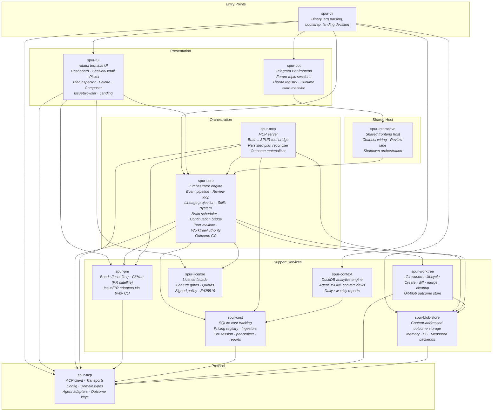
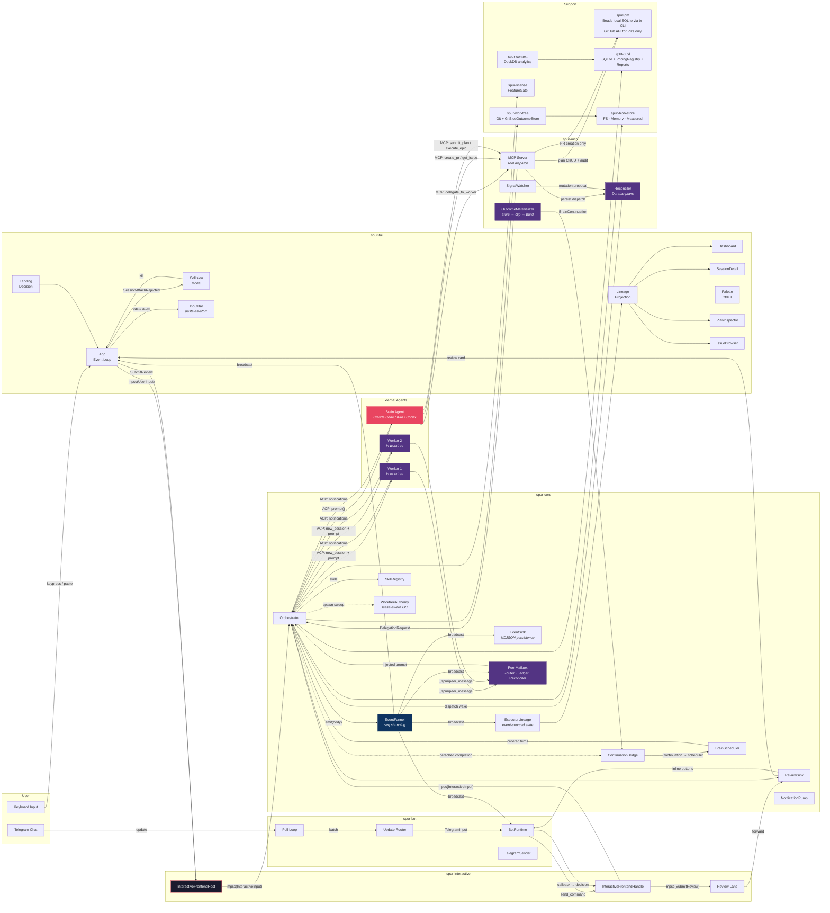
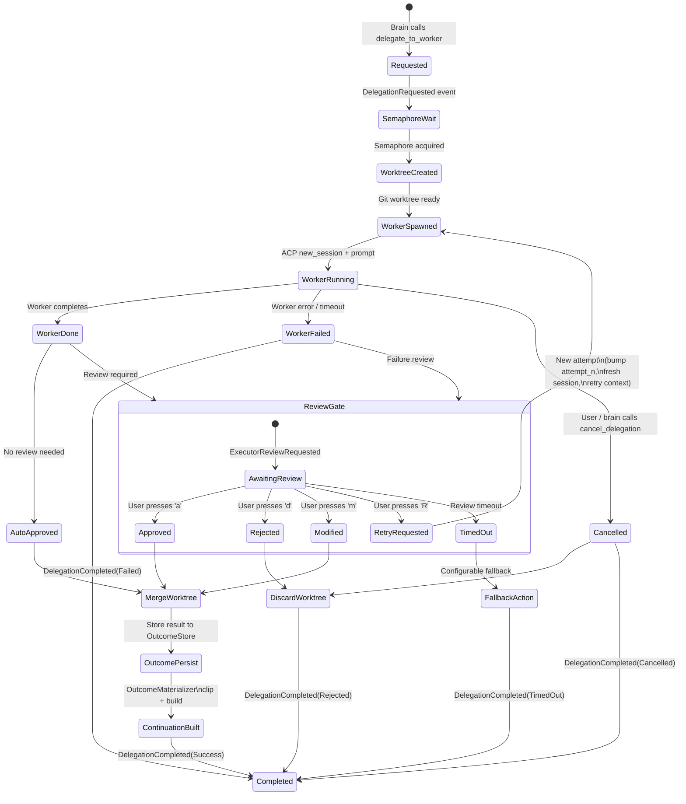
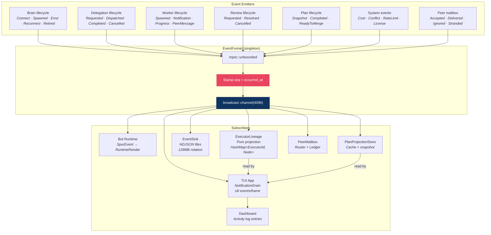
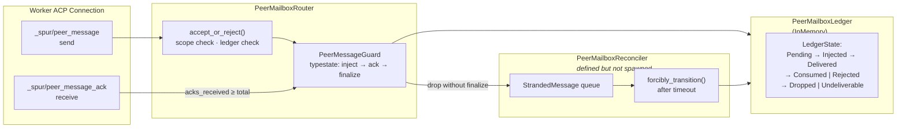
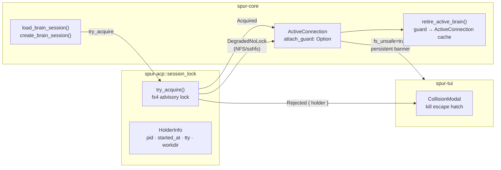
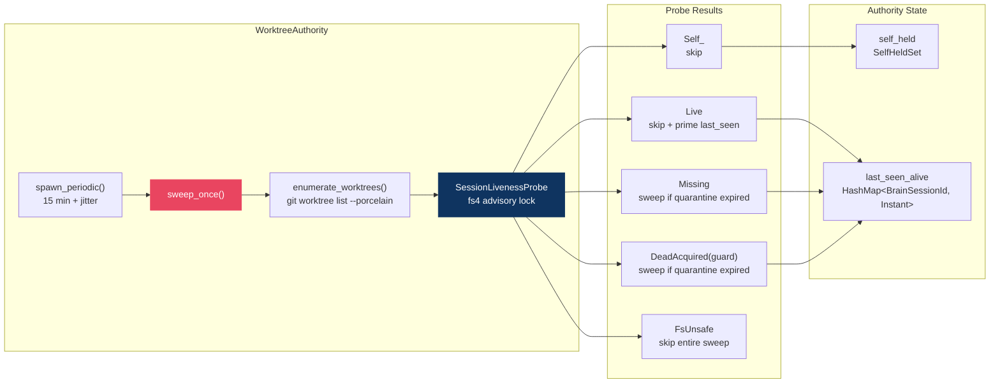
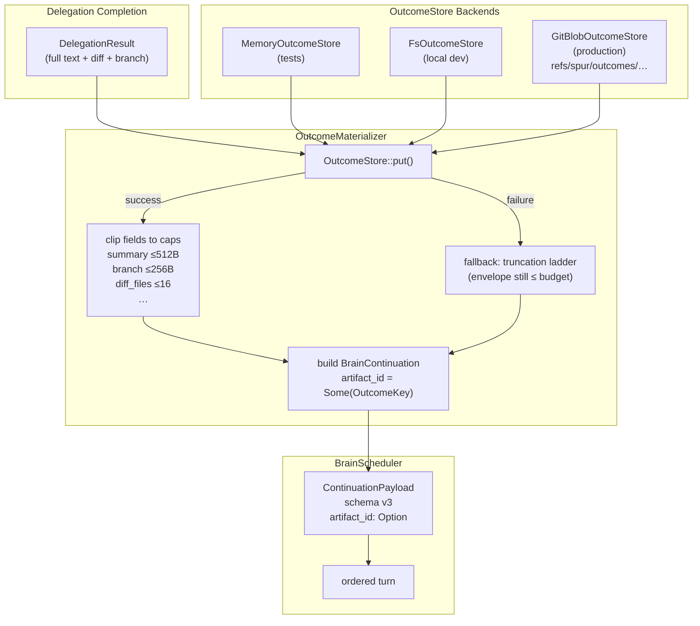

# SPUR Architecture

> Grounded 2026-04-28. Covers all 13 workspace crates, ~110k lines of Rust.
>
> **Map–territory note:** This document was re-evaluated against actual code paths (not commit messages). Where the map diverged from the territory, the territory wins. Updated 2026-04-28 to reflect bd-arch.21 (peer mailbox production wire-up; closes Risk #21), bd-arch.23 (cancellable permit acquire + heartbeat watchdog; closes Risk #23), bd-arch.26 (WorktreeAuthority with `SessionLivenessProbe` + startup/periodic sweep; partially addresses Risk #4), the M9 capability-aware Initialize bundle, M10.1 status surface (caps with `agent_kind` / `usage_emit_quirk` / status labels; `AgentSessionReady` carries caps), Plan C Tier 2 capability-tease (`required_tier_for`, `UpgradeModal`), the session-picker recall revamp (`SessionSynopsisProjection`, synopsis-aware filter haystack), event-log GC (`enforce_event_cap`, 8 MB per-file default), and post-arch commits through `ec5a706c`.

## 1. Component Architecture

Thirteen crates with strict layering. No dependency cycles.



### Crate Responsibilities

| Crate | Lines | Role | Key Types |
|---|---|---|---|
| `spur-acp` | ~12.7k | Protocol foundation | `AgentConnection`, `SpurEvent`, `SpurEventBody`, `DelegationStatus`, `SpurConfig`, `OutcomeKey`, `OutcomeRef`, `SessionAttachGuard`, `AgentCaps` (carries `AgentKind`, `UsageEmitQuirk`, status-label accessors), `SessionLivenessProbe` |
| `spur-core` | ~21.8k | Orchestration engine | `Orchestrator`, `BrainScheduler`, `ContinuationBridge`, `EventFunnel`, `ReviewSink`, `ExecutorLineage`, `SkillRegistry`, `PeerMailboxRouter`, `PeerMailboxLedger`, `WorktreeAuthority`, `SessionSynopsisProjection`, `enforce_event_cap` |
| `spur-mcp` | ~18.6k | Brain→SPUR bridge + durable plans | MCP `Server`, `Reconciler`, `PlanProjectionStore`, `MutationExecutor`, `OutcomeMaterializer` (rmcp transport: 4h keep-alive) |
| `spur-tui` | ~40.2k | Terminal interface | `App`, `DashboardView`, `SessionDetailView`, `PlanInspectorView`, `PaletteOverlay`, `IssueBrowserView`, `LandingDecision`, `CollisionModal`, `UpgradeModal`, `PreviewRow`, synopsis-aware picker filter, status-bar model+effort+usage |
| `spur-cli` | ~2.9k | Binary entry point | CLI args, `tui` command, `bot telegram`, `profile`, `--new`, `--session`, landing dispatch, `SPUR_FORCE_TTY` test hook |
| `spur-pm` | ~2.9k | PM integration — **beads-primary, GitHub-satellite** | `PmService`, `BeadsAdapter` (shells to `br`), `GitHubAdapter` (shells to `gh`), `BeadsAdvanced`, `BvAdapter` |
| `spur-cost` | ~4.6k | Cost tracking + pricing + reports | `CostTracker`, `PricingRegistry`, `IngestionPipeline`, `TokenEvent`, SQLite schema |
| `spur-worktree` | ~1.8k | Git isolation + blob backend | `WorktreeManager`, `MergeResult`, `ArtifactResolver`, `GitBlobOutcomeStore` |
| `spur-license` | ~3.9k | Licensing & feature gates | `SpurLicense`, `FeatureGate`, `FeatureGateError` (`Clone`), `PolicyResolver`, `LicenseProvider`, `required_tier_for`, `UpgradeCta` |
| `spur-bot` | ~1.9k | Telegram frontend | `BotRuntime`, `ThreadRegistry`, `TelegramClient`, `RuntimeRender` |
| `spur-interactive` | ~0.1k | Shared host glue | `InteractiveFrontendHost`, `InteractiveFrontendHandle`, `ReviewSubmission` |
| `spur-blob-store` | ~1.5k | Outcome blob storage trait + impls | `OutcomeStore`, `FsOutcomeStore`, `MemoryOutcomeStore`, `MeasuredOutcomeStore`, `DeleteNamespaceReport` |
| `spur-context` | ~3.1k | DuckDB analytics | `AnalyticsEngine`, `AsyncAnalyticsEngine`, `DailyReport`, `WeeklyReport`, `LiveMode` |

---

## 2. Data Flow

The system uses a **dual-channel architecture**: ACP (SPUR→Agent) and MCP (Agent→SPUR). Events flow outward via broadcast; commands flow inward via mpsc. A new **interactive host layer** lets both TUI and Telegram share one correctness path. A **peer mailbox** enables worker-to-worker message passing with at-least-once delivery guarantees.



### Channel Summary

| Channel | Type | Direction | Purpose |
|---|---|---|---|
| `mpsc(UserInput)` | Tokio mpsc | TUI → Host | User commands, palette dispatch |
| `mpsc(InteractiveInput)` | Tokio mpsc | Host → Orchestrator | Unified command vocabulary (message, resume, cancel) |
| `mpsc(SubmitReview)` | Tokio mpsc | Host → ReviewSink | Dedicated review lane (no head-of-line blocking) |
| Session lockfile | `fs4` advisory | Orchestrator ↔ filesystem | Cross-process single-attach exclusion per ACP session id |
| `broadcast(SpurEvent)` | Tokio broadcast | Orchestrator → All | Event fan-out (TUI, bot, sink, lineage, peer mailbox) |
| `mpsc(PermissionRequest)` | Tokio mpsc | Orchestrator → Frontend | One-shot permission prompts |
| ACP (JSON-RPC/stdio) | Agent Client Protocol | SPUR ↔ Agents | Session management, prompts, notifications |
| MCP (JSON-RPC/stdio) | Model Context Protocol | Brain → SPUR | Delegation, PM ops, plan submission, outcome fetch |
| `mpsc(DelegationRequest)` | Tokio mpsc | MCP Server → Orchestrator | Delegation dispatch |
| `oneshot(DelegationResult)` | Tokio oneshot | Orchestrator → MCP Server | Delegation response |
| `broadcast(LicenseEvent)` | Tokio broadcast | License runtime → All | License state changes |
| `mpsc(StrandedMessage)` | Tokio mpsc | PeerMailboxRouter → PeerMailboxReconciler | Orphaned peer-message recovery |

### Landing Decision Flow

`spur-cli` resolves the TUI landing via `LandingDecision`:

| Flag | Decision | Behavior |
|---|---|---|
| `--new` | `ShowDashboard` | Empty dashboard; no session resume |
| `--session <id>` | `AttachExplicit { acp_id, brain }` | Opens picker preselected on `<id>`, auto-dispatches `ResumeSession` on launch (the flag IS explicit consent) |
| `--sessions` | `ShowPicker { preselect: None }` | Opens picker; user must press Enter to attach (no implicit attach) |
| (none, has history) | `ShowPicker { preselect: last_acp_id }` | Picker preselects last session; user must press Enter |
| (none, no history) | `ShowDashboard` | Empty dashboard |

The axiom is **no implicit attach** — even when auto-resuming history, the picker is shown and the user must confirm with Enter. Only `--session <id>` bypasses confirmation because the flag is an explicit operator intent.

---

## 3. Delegation Lifecycle

A delegation is the core unit of work. It flows through a state machine with review gates, retry loops, and cancellation. Completed delegations are persisted to the **OutcomeStore**, then clipped into a lean `BrainContinuation` for the scheduler.



### Key Invariants

- Every delegation emits exactly one `DelegationCompleted` event (via `finalize`)
- Retry loops produce new `Attempt` entries under the same `ExecutorId`
- Stream buffer is cleared on retry start
- Worktree is cleaned up on every terminal path (merge, preserve, or discard)
- Semaphore is released on every exit path (RAII via `SemaphorePermit`)
- Cancellation token is registered before spawn and races with worker execution (`INV-6`)
- ReviewHandle typestate enforces register-before-emit (`INV-4`)
- OutcomeStore persists full `DelegationResult` per `(brain_session, delegation, attempt)`; `OutcomeMaterializer` clips to `MERGE_BUDGET` before building `BrainContinuation` (`INV-D8`)

---

## 4. Event Bus Topology

All state changes flow through the EventFunnel — a singleton that guarantees monotonic sequence numbers.



### SpurEventBody Variants (~85+)

| Category | Variants |
|---|---|
| Brain lifecycle | `BrainConnectStarted`, `BrainConnected`, `BrainConnectFailed`, `BrainSpawned`, `AgentSessionReady`, `BrainError`, `BrainFailover`, `BrainReconnecting`, `BrainReconnected`, `BrainReconnectFailed`, `BrainRetired`, `SessionRetireStart`, `SessionRetireComplete` |
| Session lifecycle | `SessionCompleted`, `TurnComplete`, `AgentNotification`, `AgentExtNotification` |
| Attach lifecycle | `AgentSessionReady` (carries `fs_unsafe`, `cancel_mode`, `caps`), `SessionAttachRejected` (carries `HolderInfo`, `fs_unsafe`) |
| Delegation | `DelegationRequested`, `DelegationDispatched`, `DelegationCompleted` |
| Worker | `WorkerSpawned`, `WorkerNotification`, `WorkerProgress`, `WorkerFileTouched`, `WorkerHeartbeat` |
| Peer mailbox | `WorkerPeerMessageAccepted`, `WorkerPeerMessageRejected`, `WorkerPeerMessageQueued`, `WorkerPeerMessageDelivered`, `WorkerPeerMessageConsumed`, `WorkerPeerMessageIgnored`, `WorkerPeerMessageDrainStarted`, `WorkerPeerMessageDrainCappedOut`, `WorkerPeerMessageDrainTimedOut`, `WorkerPeerMessageMalformed`, `WorkerPeerMessageExpired`, `WorkerPeerMessageDropped`, `WorkerPeerMessageUndeliverable`, `WorkerPeerMessageAuditFailed`, `WorkerPeerMessageReconciledStranded`, `WorkerPeerMailboxReconciled` |
| Executor state | `ExecutorPhaseChanged`, `ExecutorRetryStarted`, `ExecutorArtifact` |
| Review | `ExecutorReviewRequested`, `ExecutorReviewResolved`, `ExecutorReviewCancelled` |
| Plan | `PlanSnapshotUpdated`, `PlanCompleted`, `PlanReadyToMerge` |
| System | `CostUpdate`, `ConflictDetected`, `RateLimitDetected`, `LicenseUpdated`, `CommandRegistryDirty`, `OrphanReaped`, `GraphAlertsSummary` |
| PM | `IssueReceived`, `PrCreated`, `IssueUpdated`, `IssuesLoaded`, `IssueDetailFetched`, `IssueCommandError` |

---

## 5. Peer Mailbox Architecture

Workers communicate via `_spur/peer_message` ext notifications. The **PeerMailbox** provides at-least-once delivery with explicit acknowledgment and a stranded-message reconciler.

> **Production gating (Stage-1, opt-in):** The peer mailbox subsystem is gated behind `SpurConfig::peer_mailbox_enabled` (default `false`). When `true`, `Orchestrator::new` constructs the bundle, spawns `run_reconciler_loop` as a long-lived task, tracks the `JoinHandle` in `background_tasks` (aborted on `Drop`), and stores an `AbortHandle` on the orchestrator for introspection. When `false`, no bundle is attached and `_spur/peer_message` notifications are silently dropped at the boundary — by design. (bd-arch.21)



### Peer Mailbox Invariants

- **At most one guard per message** — replays return `AlreadyAccepted`, not a new guard
- **Capped reason cardinality** — worker-supplied ignore reasons collapse to a 7-item allowlist + two fallback buckets (`worker:other`, `worker:other_oversized`)
- **Drain absolute cap** — `drain_max_total_ms` wins over `drain_quiet_window_ms`; exceeded drains emit `WorkerPeerMessageDrainCappedOut`
- **Stranded recovery** — when `peer_mailbox_enabled = true`, dropped guards enqueue `StrandedMessage`; the long-lived reconciler task drains the queue and forcibly transitions entries to `Undeliverable`, emitting `WorkerPeerMessageUndeliverable` audit events with the active brain session id (resolved from a per-orchestrator session slot). With `peer_mailbox_enabled = false` (default), no guards are created, so stranded recovery is a no-op. (bd-arch.21)

---

## 6. Session Attach Lock

SPUR enforces a **single-attach invariant**: at most one orchestrator process may hold an active ACP attachment to a given session id. This prevents split-brain scenarios where two TUI windows send prompts to the same brain session.



### Attach Outcomes

| Outcome | Meaning | TUI Behavior |
|---|---|---|
| `Acquired` | Exclusive lock obtained; safe to attach | Normal session startup |
| `Rejected` | Another process holds the lock | `CollisionModal` with `kill <pid>` command |
| `DegradedNoLock` | Filesystem does not support advisory locks (NFS/sshfs/SMB) | Attach succeeds with `fs_unsafe=true`; persistent banner warns multi-instance unsafe |
| `Io` | Unrecoverable IO error | Error surfaced to user |

### Key Invariants

- **Lock lifetime tracks transport** — `SessionAttachGuard` lives on `BrainSession` while active, moves to `ActiveConnection` on retire, and drops (releasing the kernel lock) only when the cached connection is truly discarded.
- **No `--force-attach`** — SPUR never kills another process. The only escape hatch is a shell command surfaced in the collision modal.
- **NFS/sshfs degradation** — `fs_unsafe=true` is stored on `AgentSessionReady` and `ActiveConnection`, propagating to the TUI as a persistent banner. The attach succeeds but multi-instance protection is OFF.
- **Same-process replacement** — `try_acquire_or_replace` allows the same orchestrator to re-attach to a session it already holds (e.g., after failover) without releasing and re-acquiring.

---

## 7. Worktree Authority

`WorktreeAuthority` provides lease-aware garbage collection for orphaned git worktrees. It replaces the unsafe per-delegation `cleanup_orphans` with cross-process liveness detection via `SessionLivenessProbe` (bd-arch.26).



### Authority Algorithm

1. **Enumerate** all worktrees via `git worktree list --porcelain`, skipping the main repo root.
2. **Filter** to v2 worker namespace only (`refs/heads/spur/worker/v2/...`). Legacy and user branches are never touched.
3. **Parse** the branch to extract the `BrainSessionId` owner triple.
4. **Probe** liveness by attempting an exclusive `fs4` lock on `.spur/sessions/<brain_session_id>.lock`:
   - `Self_` — the local orchestrator owns this session; skip.
   - `Live` — another process holds the lock; skip and prime `last_seen_alive`.
   - `Missing` — no lockfile exists; sweep if quarantine grace (default 30 s) has expired since last `Live` observation.
   - `DeadAcquired(guard)` — lock acquired successfully, meaning the session is dead; sweep if quarantine expired, then `drop(guard)` to release the lock.
   - `FsUnsafe` — filesystem does not support advisory locks; skip the **entire** sweep to avoid destroying live worktrees from other processes.
5. **Prune** via `git worktree prune` after all sweeps.
6. **Emit** telemetry via `tracing` (future: `SpurEventBody::WorktreeAuthoritySweep`).

### Key Invariants

- **Quarantine grace prevents restart races** — a fast orchestrator restart re-creates the lockfile before the authority's next sweep, but the 30-second quarantine ensures the old worktree isn't deleted mid-restart.
- **Self-held set prevents self-harm** — even if the local orchestrator momentarily unlinks its lockfile during `retire_active_brain`, `self_held` keeps the authority from sweeping its own active worktrees.
- **Namespace isolation** — only `spur/worker/v2/...` branches are ever removed. User branches, snapshot branches, and legacy pre-v2 namespaces are explicitly skipped.
- **fs_unsafe fail-closed** — when advisory locks are unavailable (NFS/sshfs), the authority skips entirely rather than risk deleting live worktrees from other hosts. This is a safety trade-off that leaves orphan accumulation unaddressed on network filesystems (see Risk #41).
- **Periodic + startup sweep** — `Orchestrator::new` spawns an immediate startup sweep (`tokio::spawn`) plus a periodic background task (`spawn_periodic`, 15 min interval + address-space jitter). Both handles are tracked in `background_tasks` and aborted on `Drop`.

---

## 8. Outcome Storage & Brain Continuations

Delegation results are persisted before being handed back to the brain scheduler. This separates the **full result** (potentially large) from the **lean continuation envelope** (bounded by `MERGE_BUDGET`).



---

## 9. Architectural Assessment

### Strengths

- **Event sourcing** — lineage projection is a pure function of the event stream; session resume is replay
- **Dual-channel (ACP+MCP)** — brain has autonomy (calls tools) while SPUR controls execution
- **Clean crate layering** — no dependency cycles, `spur-acp` is the foundation, `spur-worktree` is a leaf
- **Review gate as first-class state machine** — human-in-the-loop with timeout, retry, fallback, cancellation
- **Worktree isolation** — true filesystem isolation for parallel workers
- **Shared interactive host** — `spur-interactive` eliminates bootstrap duplication between TUI and Telegram bot
- **Skills system** — 17 bundled skills render per-agent (Claude Code, Codex, Gemini, Kiro, Cursor, OpenCode, Kimi) with role gating and atomic SPUR-MANAGED installation
- **Durable plan reconciler** — persisted plans survive process restarts in local beads (SQLite via `br` CLI); beads comments serve as the audit log. GitHub is used only for PR creation.
- **`br` CLI boundary** — `spur-pm` shells to the external `br` binary for all database operations, creating an anti-corruption layer between SPUR's orchestration semantics and the beads schema evolution
- **License feature gates** — wait-free `arc_swap` entitlement checks with signed policy documents and Ed25519 verification
- **Peer mailbox** — structured worker-to-worker messaging with scope checking, ledgered state machine, and stranded-message reconciliation. Production wire-up landed in bd-arch.21 (gated on `peer_mailbox_enabled`, default off; reconciler spawn + `JoinHandle` tracking + per-emit / resolver session-id correctness).
- **Session single-attach lock** — `fs4` advisory lockfile prevents split-brain multi-window attachment to the same ACP session. Kernel-auto-released on process exit; no stale-lock recovery needed. NFS/sshfs degrades gracefully to `fs_unsafe` with persistent banner.
- **Paste-as-atom** — multi-line pastes in the TUI input bar become atomic placeholder tokens (`[Paste #N · M lines]`) stored in a side table (LRU-capped at 50). Placeholders expand back to full text on submit via the existing `ProtectedRange` mechanism, preserving interrupt prefixes (`!`) and draft history.
- **Outcome materializer** — store-then-clip pattern guarantees `MERGE_BUDGET` is never exceeded, even when the full delegation result is megabytes
- **WorktreeAuthority lease-aware GC** — `SessionLivenessProbe` via `fs4` advisory locks provides cross-process safety for orphan reclamation. Startup sweep + periodic background sweep (15 min + jitter) with quarantine grace. Replaces the unsafe per-delegation `cleanup_orphans` (bd-arch.26).
- **Content-addressed blob storage** — `OutcomeStore` trait with pluggable backends (memory, FS, git) and measured instrumentation
- **DuckDB analytics** — `spur-context` reads agent JSONL in place via SQL convert views, producing daily/weekly cost reports without ETL pipelines
- **Capability-aware status surface (M10.1)** — `AgentCaps` carries `agent_kind`, a `UsageEmitQuirk` table, and status-label accessors (effort/usage); the TUI caches caps from `AgentSessionReady` and renders live model + effort + usage in the status bar with utf8-safe label truncation and width-aware compaction
- **Capability-tease upgrade modal (Plan C Tier 2)** — `spur-license::required_tier_for` resolves the minimum tier for a gated feature; `FeatureGate` denials clone into the TUI `UpgradeModal`, which dispatches a CTA-aware upgrade flow at MVP gate sites instead of failing silently
- **Synopsis-aware session-picker recall** — `SessionSynopsisProjection` lives on `App` and absorbs live event chunks plus `SessionHistory` fallbacks (skipping leading slash-commands for `first_user_msg`); the picker filter haystack matches synopsis first/last user messages and is precomputed on `set_sessions` for cheap incremental filtering
- **Bounded event-log storage** — `enforce_event_cap` GC sweeps `.spur/events/` with an 8 MB per-file default, protecting the active file from rotation; complements NDJSON rotation and bounds disk growth across long-running sessions
- **Graceful TUI shutdown** — Ctrl-Q runs the same teardown path as SIGTERM/SIGHUP/SIGQUIT; no `process::exit` shortcut means terminal restoration and orchestrator drain always run
- **Per-agent stderr file-rotate bridge** — child agent stderr is piped through a rotating file sink so noisy agents do not interleave with the TUI or fill memory

### First-Principles & MCTS Risk Framework

Risks are grounded using first-principles axioms and evaluated with Monte Carlo Tree Search (MCTS) feedback loops. Each risk is tagged by the axiom it violates and scored by `impact × probability`. The full analysis with UCT-based prioritization lives in `docs/rca/2026-04-27-full-architecture-mcts-first-principles-evaluation.md`.

| Axiom | Statement |
|---|---|
| **R1** | **Resource Finiteness.** Every buffer, queue, ledger, registry, and cache has a finite bound. Any unbounded structure is a memory leak by another name. |
| **R2** | **Failure Inevitability.** Disks fill, networks partition, processes crash, and filesystems lie. Any design assuming reliable infrastructure is unsound. |
| **R3** | **Observability Requires Explicitness.** A system cannot be correct about state it does not explicitly track. Silent catch-alls, dropped errors, and `_ => {}` are deliberate blindness. |
| **R4** | **Synchronization Requires Consensus.** Two processes cannot agree on exclusive access without a coordination primitive visible to both. Filesystem absence (NFS/sshfs) does not grant exemption. |
| **R5** | **Backpressure Propagates or Drops.** When a producer outpaces a consumer, either pressure flows backward (backpressure) or data flows forward and is lost. There is no third option. |
| **R6** | **State Machines Must Be Closed.** Every state must have defined transitions for every possible input. Missing arms produce undefined behavior, not safety. |
| **R7** | **Time is a Resource.** Every `await`, `block_on`, `acquire`, and `recv` consumes an unbounded resource (thread / task time) unless bounded by timeout or cancellation. |

**Systemic Health Score:** **0.20 / 1.0** — under stress or long runtimes, the probability of a non-graceful outcome (OOM, disk full, silent divergence, or unbounded spend) is high. The highest-UCT improvement moves are **observability bridge fixes (R3)**, which reduce the interaction multiplier on all other risk categories.

---

### Known Risks (Grounded)

| # | Risk | Severity | Status | Axiom | Score | Location | Evidence |
|---|------|----------|--------|-------|-------|----------|----------|
| 1 | Stranded executors — early-exit paths bypass `finalize()` | ~~Critical~~ | **Fixed** | R2/R6 | 0.00 | `orchestrator.rs:4385` | `DelegationGuard` Drop emits `DelegationCompleted(Failed)`. Only spawn site at `:3456` is guarded. |
| 2 | `broadcast::channel` drops events when subscribers are slow | High | **Open** | R5 | 0.45 | `app.rs:2437` | Capacity is 4096, but TUI drain cap is **still 8** (not 64 as previously claimed). Bot has **no drain cap**. On `Lagged`, all subscribers log a warning and **permanently drop** events. No replay-from-NDJSON exists. |
| 3 | Silent `_ => {}` catch-alls on `SpurEventBody` matches | ~~High~~ **Medium** | **Partially addressed** | R3/R6 | 0.30 | `app.rs:1333,1557` | Two catch-all arms remain. `SpurEventBody` now has 79 variants; the session-list pre-routing match handles 4 explicitly, so 75 flow through the first catch-all. Both catch-alls now log at `tracing::debug!` (`:1333` was previously silent — fixed; `:1557` was already logged). Events still reach the brain-status match and view fan-out (`app.rs:1583–1595`), so no event is dropped. Residual gap: no compile-time enforcement — a new variant intended for the session-list path can still be added without an explicit arm. Mitigation: add `#[non_exhaustive]` or a coverage test that asserts every variant has at least one explicit arm across the dispatch chain. |
| 4 | Worktree orphaning on unclean shutdown | ~~High~~ **Medium** | **Partially addressed** | R1/R2/R4 | 0.25 | `worktree_authority.rs:99`, `orchestrator.rs:1106` | `WorktreeAuthority` deployed with `SessionLivenessProbe` + startup/periodic sweep. Original `cleanup_orphans` dead-code issue superseded. Residual: snapshot branches leak (R4b, no sweep), `fs_unsafe` skips all cleanup (R4a, see Risk #41), legacy pre-v2 namespaces skipped (R4c). See `docs/rca/2026-04-26-risk4-mcts-first-principles-evaluation.md` and `docs/rca/2026-04-27-full-architecture-mcts-first-principles-evaluation.md` §2.1/2.2. |
| 5 | No backoff on delegation retry loops | ~~High~~ | **Fixed** | R7 | 0.00 | `orchestrator.rs:4202` | Exponential backoff `2^n` with 30 s cap. First retry delay is **2 s** (not 1 s). **No jitter.** |
| 6 | Worker JoinHandles not tracked for shutdown abort | Medium | **Open** | R7 | 0.35 | `orchestrator.rs:3456` | `TaskTracker` is used in `spur-mcp` but **not in `spur-core`**. The per-delegation worker task (`:3456`) and three ext-notification pumps (`:2566,2830,4789`) are fire-and-forget `tokio::spawn` with stored `JoinHandle`. |
| 7 | Orchestrator is a God Object | High | **Worsening** | R3 | 0.50 | `orchestrator.rs` | File is **9,456 lines** (was ~4,400; +810 since 2026-04-26 grounding). Delegation dispatch (`handle_delegations` 243 lines + `execute_delegation` 595 lines = **838 lines inline**) and review coordination remain inside `orchestrator.rs`. `run_interactive` is 892 lines. Session attach logic added ~140 lines. |
| 8 | Single-process — no fault isolation between brain and workers | **Medium** | **Open** | R4 | 0.35 | Architecture-level | Workers are child OS processes, so a worker crash does not segfault the orchestrator. **However:** no outer worker timeout exists (hang = indefinite), no memory limits / cgroups, no sandbox. A rogue worker can exhaust host memory or damage the filesystem. Brain failover exists but is best-effort; no auto-respawn if brain dies idle. |
| 9 | Broadcast `Lagged` recovery not implemented | ~~Low~~ **High** | **Open** | R3/R5 | 0.60 | `app.rs`, `event_sink.rs`, `notification_pump.rs` | Every subscriber logs `warn!` and continues. EventSink writes NDJSON but **no code reads it back** for replay. MCTS: this is a backpressure amplifier — under load, lineage projection diverges from ground truth. Severity raised from Low per `docs/rca/2026-04-27-full-architecture-mcts-first-principles-evaluation.md` §2.3. |
| 10 | `delegate_async` MCP tool drops `delegation_plan` from schema | ~~Low~~ | **Fixed** | — | 0.00 | `tools.rs`, `server.rs` | Tool fully removed. Comments at `server.rs:41,312,1683` confirm retirement. |
| 11 | No MCP tool to cancel a running delegation | ~~Low~~ | **Fixed** | R7 | 0.00 | `server.rs:2772`, `tools.rs:293` | `cancel_delegation` is live in catalog. `CancellationControl` registers token before spawn; orchestrator races `cancel_token.cancelled()` against execution in `tokio::select!`. |
| 12 | Telegram bot callback expiry after rebind | ~~Medium~~ | **Fixed** | R6 | 0.00 | `runtime.rs:863` | Every prompt captures `live_session` at creation. `handle_callback` validates `prompt.live_session == current_live` and rejects stale callbacks with *"expired after restart."* |
| 13 | Persisted plan halt on startup (orphan recovery gap) | ~~High~~ | **Partially addressed** | R2/R6 | 0.45 | `server.rs:4216` | `recover_persisted_plans()` exists and compensates orphans, but is **only called when `legacy_reclaim_needed` is true** (`server.rs:4243`). In the common case where all epics already have rev1 metadata, recovery is **skipped**. A task with a stale dispatch label projects to `Dispatched` and is ignored by the reconciler forever. |
| 14 | Reconciler wake path lost on restart | ~~High~~ | **Fixed** | R2 | 0.00 | `server.rs:2000`, `reconciler.rs:257` | `fast_forward` notify + `journal_notify` both wired into reconciler `select!`. Startup reclaimed plans trigger immediate fast-forward tick. |
| 15 | Lazy history loading causes stale session metadata | ~~Medium~~ | **Misattributed** | R3 | 0.20 | `runtime.rs:739` | The claimed fix (exact pending target + superseded resume eviction) exists in `runtime.rs:739–756`, but it solves **session-resume binding races**, not "lazy history loading." The actual lazy-history feature (`SessionHistoryChunk`, `LoadOlderHistory`) is **not implemented** in the codebase. |
| 16 | Skill installer overwrites user-edited files | ~~Medium~~ | **Mitigated** | R2 | 0.15 | `skills/installer.rs:230` | `SPUR-MANAGED` marker + SHA-256 hash detect edits → `Skip(UserEdited)`. Residual paths: (a) legacy-generated files in `.spur/skills/` bypass the hash check, and (b) check-then-write TOCTOU race allows overwrite if user edits between `decide()` and `atomic_write()`. |
| 17 | Cost tracking has no budget enforcement | **High** | **Open** | R5 | 0.70 | `spur-cost/src/`, `orchestrator.rs:1087` | `spur-cost` is purely observational. `CostTracker` only records start/end. `PricingRegistry` computes cost but **never compares to a limit**. Orchestrator spawns sessions **without any cost check**. Zero spawn-time or runtime budget enforcement. |
| 18 | beads-advanced features tied to beads backend | **Medium** | **Open** | R5 | 0.55 | `spur-pm/src/service.rs:200` | `advanced()` returns `None` for GitHub-only. Plan persistence, projection, mutation execution, signal watching, and auto-merge all return hard errors when `advanced()` is `None`. Degradation is failure, not graceful fallback. |
| 19 | Reconciler journal wake file not yet active | ~~Low~~ | **Mitigated** | R5 | 0.15 | `reconciler.rs:36` | `monitor_journal_appends` polls `.beads/journal` every 250 ms. If file missing, poller exits gracefully. Reconciler falls back to adaptive interval (3 s → 30 s). |
| 20 | Context-window budget overflow | ~~High~~ | **Fixed** | R1 | 0.00 | `merge_budget.rs:12`, `outcome_materializer.rs:275` | `MERGE_BUDGET_DEFAULT_BYTES = 8192`. Materializer has `debug_assert!` + runtime `if` gate with fallback truncation ladder. `continuation_bridge.rs:207` provides second-line defense by dropping oversized individual items. Minor gap: last-resort branch does not re-verify envelope size after setting minimal payload. |

### New Risks Discovered During Grounding

| # | Risk | Severity | Status | Axiom | Score | Location | First-Principles Analysis |
|---|------|----------|--------|-------|-------|----------|---------------------------|
| 21 | **Peer mailbox reconciler never spawned** — `run_reconciler_loop` was defined but the receiver was dropped immediately after construction. The bigger latent gap was that the entire subsystem (62 unit tests + bd-cpf.1–7 hardening) was inert in production: `attach_peer_mailbox()` had zero call sites and `peer_mailbox_enabled` was read by nothing. | ~~High~~ | **Fixed** | R2 | 0.00 | `orchestrator.rs:861` (boot wire-up), `guard.rs:104` (resolver), `peer_mailbox/mod.rs:18` (bundle slot) | bd-arch.21: `Orchestrator::new` now constructs the bundle and spawns `run_reconciler_loop` when `peer_mailbox_enabled = true`. The `JoinHandle` is pushed into `background_tasks` (aborted by `Drop`) and an `AbortHandle` is stored directly for introspection. The router's `brain_session_id` field was removed in favor of pass-per-emit; the reconciler resolves the active session via an `Arc<RwLock<Option<String>>>` slot updated at every brain-session-start site. Default remains `false`; flip is a follow-up after internal validation. |
| 22 | **Peer mailbox unbounded ledger** — `InMemoryLedger` stores every accepted peer message forever. Terminal entries are never removed. `injected_into_prompts: HashSet<String>` grows with every new prompt ID. | **High** | **Open** | R1 | 0.85 | `ledger.rs:133` | Memory grows monotonically for long brain sessions. A day-long session with thousands of peer messages can accumulate megabytes of ledger state with no pruning strategy. |
| 23 | **Semaphore indefinite wait** — `semaphore.acquire().await` had **no timeout** and was not cancellable. A deadlocked worker held its permit forever; new delegations queued silently and `cancel_delegation` calls arriving before permit acquisition were silently ignored. | ~~High~~ | **Fixed** | R7 | 0.00 | `orchestrator.rs:3561` (cancellable acquire), `delegation_watchdog.rs:30` (heartbeat watchdog), `domain/delegation.rs` (`DelegationAbortReason`) | bd-arch.23: Sub-problem A — the permit acquire is now wrapped in `tokio::select!` with `biased;` ordering against `abort_handle.cancelled()`, so a brain-issued cancel short-circuits to `DelegationStatus::Cancelled` without acquiring. Sub-problem B — an opt-in heartbeat watchdog (`worker_heartbeat_watchdog_enabled`, default `false`) subscribes to the broadcast and aborts via `WorkerHeartbeatTimeout` if no `WorkerHeartbeat` arrives within `worker_heartbeat_timeout_secs` (default 90 s). Effective initial grace = `max(worker_heartbeat_initial_grace_secs, timeout_secs × 2)` — with shipped defaults that is **180 s**, not 60 s. The typed `DelegationAbortReason` enum cleanly partitions `Cancelled` (brain-initiated) from `Timeout` (worker-hang). Default-off until a `WorkerHeartbeat` emitter ships in v1; flip is gated on the follow-up emitter ticket. |
| 24 | **NDJSON rotation cycle on disk full** — when `flush()` inside `rotate()` fails, `bytes_in_file` is never reset, so every subsequent event re-enters the rotation path. The original "permanent silent data loss until restart" framing was overstated. | ~~**High**~~ **Medium** | **Mitigated** | R1/R2 | 0.30 | `event_sink.rs:139` (rotate), `event_sink.rs:127` (write_event), `event_sink.rs:171` (enforce_event_cap) | First-principles re-grounding: (a) `enforce_event_cap` (commits `b4da0646`, `bbb26a91`) bounds `.spur/events/` total disk usage (default 64 MB ≈ 8 MB per file × ~7 rotated + 8 MB active), removing SPUR's own logs as a likely root cause of disk-full. (b) The sink **self-heals** on disk recovery: events accumulated in the 64 KB `BufWriter` during the outage flush to the pre-rotation file when `flush()` next succeeds; `rotate()` then opens a new file and resets `bytes_in_file`. Restart is **not** required. (c) Residual: rotation cycle still fires on every event while `flush()` fails (cheap — `flush()` returns immediately with the error — but cosmetically wrong); events that overflow the 64 KB `BufWriter` during the outage are logged-and-dropped at `event_sink.rs:62-65`; no `StorageFull` `SpurEventBody` to surface degraded state explicitly. Compounds with Risk #29 (SQLite BUSY) but with a smaller blast radius than originally scored. |
| 25 | **BrainScheduler leaks stale state across session swaps** — `note_session_swap` does NOT clear `pending_user`, `turn_in_flight`, or `cancel_grace_until`. Cross-session message leak and permanent stall possible. | **Medium** | **Open** | R6 | 0.55 | `scheduler.rs:448` | If old brain died mid-turn, `turn_in_flight` stays `true`; new session's `next()` returns `IdleUntil` forever. Compounds with Risk #26 (TUI stuck in `Retiring`). |
| 26 | **TUI `LoadState` deadlock on `BrainConnectFailed`** — `apply_milestone_event` has no arm for `BrainConnectFailed`. Auto-resume into a dead ACP session leaves the view stuck in `Retiring` forever. | **Medium** | **Open** | R3/R6 | 0.45 | `session_detail.rs:337` | State machine is not closed over all terminal events. User sees an infinite spinner with no error surfacing. |
| 27 | **Fire-and-forget ext-notification pumps** — Brain and worker ext-notification pumps are spawned without storing the `JoinHandle`. If the underlying connection is pooled/reused, stale pumps leak and emit `AgentExtNotification` with wrong `spur_session_id`. | **Medium** | **Open** | R3/R7 | 0.50 | `orchestrator.rs:2566,2830,4789` | No cleanup handle means no abort on session end. Events from a dead session can pollute the event bus of a new session. |
| 28 | **`block_on` inside async context** — `scheduler.rs:628` calls `futures::executor::block_on(overflow.lock())` from a sync helper invoked by async `note_session_swap`. Can deadlock on single-threaded Tokio runtime. | **Medium** | **Open** | R7 | 0.50 | `scheduler.rs:628` | Blocking a thread waiting for a `tokio::sync::Mutex` that may be held by a task on the same thread = classic async deadlock. |
| 29 | **SQLite `SQLITE_BUSY`** — `spur-cost` opens SQLite without WAL or `busy_timeout`. CLI `spur cost` loads the orchestrator just to read `cost.db`, creating a second connection that contends with the running orchestrator. | **Medium** | **Open** | R1 | 0.55 | `db.rs:76`, `main.rs:1112` | Writer contention returns `SQLITE_BUSY` immediately. User sees opaque errors when querying cost while a session is active. Compounds with Risk #24 under disk pressure. |
| 30 | **DuckDB mutex poison panic** — `AsyncEngine` uses `Arc<Mutex<AnalyticsEngine>>` inside `spawn_blocking` with `.unwrap()`. If any prior closure panicked while holding the mutex, `.unwrap()` panics. | **Medium** | **Open** | R2/R7 | 0.40 | `async_engine.rs:67` | `std::sync::Mutex` poison is a hard panic. No recovery logic exists. |
| 31 | **License validate/heartbeat hang** — `licenseseat.rs:202,256` has no timeout. Network hang blocks the license-runtime `select!` loop, starving revocation updates. | **Medium** | **Open** | R7 | 0.45 | `licenseseat.rs:202` | A 60-minute HTTP hang means 60 minutes of blind operation after license revocation. |
| 32 | **Feature-gate point-in-time snapshots** — `MaxConcurrentWorkers`, `EventRetentionBytes`, and `PM_INTEGRATION` are evaluated once at startup. License downgrade mid-session does not shrink workers, retention, or PM access. | **Medium** | **Open** | R6 | 0.40 | `orchestrator.rs:798,2530`, `main.rs:634` | Entitlement is checked at construction time, not at use time. A revoked Pro license continues to enjoy Pro concurrency until process restart. |
| 33 | **Swallowed worktree-removal errors** — `let _ = worktrees.remove_worktree(...).await;` silently drops removal failures after failed detach and on non-commit paths. | **Medium** | **Open** | R2/R3 | 0.50 | `orchestrator.rs:4372,4377` | Disk leaks (orphan worktrees) are invisible. No metric or log surface alerts on cleanup failure. |
| 34 | **MCP `active_plans` never evicted** — `active_plans` is inserted on every `submit_plan` / `execute_epic`. Only removal is on task-tracker close. No TTL or LRU. | **Medium** | **Open** | R1 | 0.55 | `server.rs:323` | Long-running brain sessions accumulate plan state unboundedly. Memory growth is roughly O(plans × tasks). |
| 35 | **Bot runtime unbounded state growth** — `ThreadRegistry`, `pending_resume`, `output_buffers`, and `executor_sessions` are never pruned. | **Low** | **Open** | R1 | 0.35 | `runtime.rs:89,115,96,117` | Telegram bot in a high-traffic environment will eventually OOM. Each topic, delegation, and failed resume leaks state. |
| 36 | **Production `expect()` panic surfaces** — Multiple `expect()` calls in `server.rs`, `trust.rs`, and `orchestrator.rs` can panic on configuration drift, corrupted binary, or state-machine desync. | **Low–Medium** | **Open** | R2 | 0.35 | `server.rs:2005,3489`, `trust.rs:38`, `orchestrator.rs:302,1821` | `expect()` in production is a crash surface. Several are inside `OnceLock` initializers, permanently poisoning the static. |
| 37 | **Catch-all `_ => {}` in core/mcp matches** — `PeerEdgeState`, `PlanTaskStatus`, `CompletionState`, and `AuditSentinelKind` have silent catch-alls that ignore new enum variants. | ~~Low~~ **Medium** | **Open** | R3/R6 | 0.40 | `orchestrator.rs:3939`, `plan/mod.rs:1719`, `projector.rs:255`, `server.rs:723` | Maintenance hazard: adding a new variant silently changes behavior instead of producing a compile error. Severity raised per MCTS: this is a state-machine closure defect that compounds with Risk #3. |
| 38 | **Git blob mid-write orphans** — `GitBlobOutcomeStore::put()` writes the blob via `hash-object -w`, then writes the meta ref. If meta ref write fails, the blob ref is deleted but the underlying git blob object in `.git/objects/` is never reclaimed. | **Low** | **Open** | R1/R2 | 0.25 | `git_blob_store.rs:246` | Orphaned git blobs accumulate until a future `git gc`. No SPUR-side tracking. |
| 39 | **FsOutcomeStore temp file leaks** — `put()` writes to `{attempt}.bin.tmp.{pid}.{nonce}`, then renames. Crash between write and rename leaves temp files forever. | **Low** | **Open** | R1/R2 | 0.25 | `fs_store.rs:147` | Crash loop could fill disk with orphaned temp files. No startup cleanup. |
| 40 | **OutcomeMaterializer unbounded map** — `latest_attempt_by_delegation` is documented as "not pruned". A misbehaving brain creating millions of delegations exhausts memory. | **Low** | **Open** | R1 | 0.25 | `outcome_materializer.rs:45` | ~40 B per entry × millions = unbounded growth. |
| 41 | **`fs_unsafe` multi-instance gap on NFS/sshfs** — When the repository lives on a network filesystem that lacks advisory-lock support (`ENOTSUP`/`ENOLCK`), SPUR attaches with `fs_unsafe=true` and proceeds without any cross-process exclusion. Two TUI windows on different hosts mounting the same NFS export can silently attach to the same session. | **Medium** | **Open** | R4 | 0.70 | `session_lock.rs:33`, `orchestrator.rs` | The `DegradedNoLock` path is intentional (attach is better than failing), but there is no secondary coordination mechanism (e.g., beads issue label, TCP consensus) to backfill the missing filesystem guarantee. Conditional severity: High for NFS/sshfs deployments, Low otherwise. |
| 42 | **Snapshot branch leaks** — `snapshot_brain_state` creates `spur/brain-snapshot-*` branches. `delete_snapshot_branch` is best-effort with dropped errors; `WorktreeAuthority` never cleans snapshot branches. | Low–Medium | **Open** | R1 | 0.30 | `manager.rs:117`, `orchestrator.rs:5318`, `worktree_authority.rs:113` | Accumulation is monotonic at ~40 B per ref. Long sessions can create hundreds. No automated reclamation exists. |
| 43 | **Legacy pre-v2 worktree namespace orphaned** — `WorktreeAuthority::sweep_once` skips any branch not matching `refs/heads/spur/worker/v2/...`. Pre-v2 `spur/worker-{agent}-{uuid}` worktrees are permanently orphaned. | Low | **Open** | R1 | 0.15 | `worktree_authority.rs:113` | Volume declines as v2 becomes dominant, but any existing legacy worktree will never be reclaimed automatically. |

### Risk Trend Summary

| Category | Count | Fixed | Mitigated | Open |
|---|---|---|---|---|
| Previously documented | 20 | 9 | 3 | 8 |
| New (this review) | 23 | 2 | 1 | 20 |
| **Total** | **43** | **11** | **4** | **28** |

**Systemic Health Score: 0.20 / 1.0** (see First-Principles & MCTS Risk Framework above).

Risk #21 (peer mailbox reconciler / production wire-up) closed in bd-arch.21. Risk #23 (semaphore indefinite wait + cancel-during-acquire) closed in bd-arch.23 — cancellable acquire is always-on; the heartbeat watchdog is default-off until a `WorkerHeartbeat` emitter ships. Risk #22 (unbounded ledger) remains open and gates wider production rollout.

#### Cross-Category Interaction Matrix (Compounding Risks)

Risks do not fail in isolation. The highest joint-score interactions all involve **R3 (Observability)** as a secondary amplifier.

| Interaction | Primary | Secondary | Compounded Outcome | Joint Score |
|---|---|---|---|---|
| **Disk Death Spiral** | #24 (NDJSON rotation cycles) | #29 (SQLite BUSY) | Disk full → NDJSON sink enters retry cycle (self-heals on recovery); cost queries fail with `SQLITE_BUSY`. Joint score lowered after #24 mitigation: SPUR-induced disk-full is now bounded by `enforce_event_cap`, and the NDJSON failure mode is recoverable rather than permanent. | ~~0.85~~ **0.40** |
| **Silent Divergence Cascade** | #9 (Lagged drop) | #3 (catch-all blindness) | Events lost + events ignored → TUI lineage diverges from ground truth; user approves/rejects based on stale state. | **0.80** |
| **Orphan Monopoly** | #4-R4a (fs_unsafe skip) | #41 (no secondary consensus) | NFS deployment → no lock exclusion + no worktree cleanup = monotonic orphan growth with no automatic recovery. | **0.80** |
| **Scheduler Stall** | #25 (stale state across swap) | #26 (TUI stuck) | Old brain dies mid-turn → scheduler stalls → TUI auto-resume to dead endpoint → infinite spinner. | **0.75** |
| **Budget Blindness + Spend** | #17 (no cost enforcement) | #2 (event drop) | Brain runs expensive delegation → cost events drop due to Lagged → spend is invisible until manual query. | **0.75** |
| **Panic + Poison** | #36 (`expect()`) | #30 (mutex poison) | `expect()` in license path → panic → DuckDB mutex poison → all analytics panic → system is blind and crashed. | **0.70** |
| **Plan Stranding + Pollution** | #13 (stale dispatch label) | #27 (stale ext-notification pump) | Orphan plan task ignored + old pump emits events → reconciler does nothing but event bus is noisy. | **0.60** |

### Remaining Work (UCT-Prioritized, Re-grounded)

Priorities are derived from MCTS UCT scoring: `exploitation_value + C × sqrt(ln(N_total) / N_branch)`. The highest-value moves are **observability bridge fixes (R3)** because they reduce the interaction multiplier (currently 1.8×) on all other risks. See `docs/rca/2026-04-27-full-architecture-mcts-first-principles-evaluation.md` §5 for full derivation.

#### Tier 1: Bridge Moves — Observability First (R3)

1. **Eliminate silent `_ => {}` catch-alls (Risks #3, #37)** — Both `SpurEventBody` catch-alls in `app.rs` now log at `tracing::debug!` (Risk #3 partially addressed, residual 0.30). Remaining work: lift the runtime debug to a metric counter, and add compile-time enforcement via `#[non_exhaustive]` on `SpurEventBody` plus a coverage test that asserts every variant has at least one explicit arm across the dispatch chain. Risk #37 (other production event handlers) still requires the same pass. Expected residual risk reduction once compile-time enforcement lands: R3 drops 0.30 → 0.10; interaction multiplier drops 1.8× → 1.2×.

2. **Implement NDJSON replay on `Lagged` (Risk #9)** — When `broadcast::Receiver` returns `Lagged(n)`, trigger a replay: seek EventSink NDJSON from `seq = last_known + 1`, rebuild lineage projection incrementally. Closes the observability gap between event bus and durable log.

3. **TUI state-machine closure (Risk #26)** — Add explicit `LoadState` arms for `BrainConnectFailed` and all other terminal brain events.

#### Tier 2: Enforce Boundedness — Resource Finiteness (R1)

4. **Peer mailbox ledger pruning (Risk #22)** — Remove terminal entries (`Consumed`, `Rejected`, `Dropped`) after a TTL. Replace `injected_into_prompts: HashSet<String>` with an LRU or bounded window.

5. **Harden EventSink against disk full (Risk #24, residual)** — primary root cause is now mitigated by `enforce_event_cap`. Remaining work tightens the failure mode rather than fixing it: reset `bytes_in_file` on `rotate()` error to silence the cosmetic retry cycle, emit a single `StorageFull` `SpurEventBody` to surface degraded state, and back the 64 KB `BufWriter` with a bounded in-memory ring so events lost after buffer overflow can replay on recovery.

6. **Bounded collections across the stack** — `active_plans` → LRU with TTL (Risk #34); `latest_attempt_by_delegation` → windowed by session age (Risk #40); Bot registries → periodic sweep of dead topics (Risk #35); Snapshot branches → Authority cleanup + age threshold (Risk #42).

#### Tier 3: Backpressure & Cost Governance (R5)

7. **Cost circuit breaker (Risk #17)** — Add `max_spend_per_session` and `max_spend_per_plan` to `SpurConfig`. Check cost before spawning a delegation; return `DelegationRejected(BudgetExceeded)` if over budget. Convert `spur-cost` from passive logging to an active gate.

8. **Uniform drain caps (Risk #2)** — Bot MUST have a drain cap (currently uncapped). Consider raising TUI cap from 8 to 64, but make it configurable. Add a `Lagged` counter metric.

#### Tier 4: Coordination & Time Bounding (R4, R7)

9. **Secondary coordination for `fs_unsafe` (Risks #4-R4a, #41)** — Use a beads issue label ("lock:<session_id>") as the durable consensus layer. On attach, write label; on detach, remove. On startup, check label before `DegradedNoLock` attach.

10. **Timeout audit (Risks #28, #31)** — Replace `block_on` in `scheduler.rs:628` with `tokio::sync::Mutex` + async, or restructure to avoid the lock. Add `timeout(Duration::from_secs(30))` to all license HTTP calls.

11. **Worker timeout follow-ups (Risk #23 closed in bd-arch.23)** — Wire a `WorkerHeartbeat` emitter into the worker dispatch loop, then flip `worker_heartbeat_watchdog_enabled` to `true` after telemetry-grounded calibration. Add an outer `worker_timeout` around `drive_prompt_notifications` for CPU-burn / liveness-without-progress.

#### Tier 5: Structural & Peripheral

12. **Orchestrator decomposition (Risk #7)** — Start with `BrainSessionManager` extraction (~140 lines) to prove the actor pattern. Do **not** attempt full decomposition until Tier 1–3 risks are closed; decomposing a system with silent catch-alls spreads the blindness across more files.

13. **Worktree cleanup residuals** — Delete `cleanup_orphans` dead code. Add snapshot branch enumeration to `WorktreeAuthority::sweep_once`. Extend authority to recognize pre-v2 `spur/worker-{agent}-{uuid}` pattern, or document one-time manual migration.

14. **MCP signal automation** — `SignalWatcher` currently proposes `ScopeDrift` splits. Next: integrate `MutationScorer` heuristics, add `CostSpike` and `QualityRegression` signal kinds.

15. **Runtime state durability** — Separate ephemeral runtime state (lineage, sessions, continuations) from durable plan state. Add checkpoint/restore for orchestrator runtime state, or document the explicit ephemeral boundary.

16. **Session lock `fs_unsafe` backfill (Risk #41)** — For NFS/sshfs deployments where advisory locks are unavailable, add a secondary coordination mechanism (e.g., a beads issue label or a short-lived TCP coordination socket) so that multi-instance attach is rejected even when the filesystem cannot help.

17. **SIT/UAT harness hardening** — Expand coverage to remaining interactive surfaces (palette, plan inspector, collision modal) and wire the harness into CI.

18. **Bot multi-chat support** — Current `spur-bot` binds one operator chat. Future: team-wide bot with RBAC and per-topic permission gates.

### Decomposition Recommendation (for v1.0+)

The orchestrator should be split into actors:
```
Orchestrator (coordinator)
  ├── BrainSessionManager (spawn, reconnect, failover, retire, scheduler)
  ├── DelegationDispatcher (semaphore, worker spawn, worktree, cancel token registry)
  ├── ReviewCoordinator (sink, timeout, retry, auto-merge gating)
  ├── EventPipeline (funnel, sink, broadcast)
  └── PlanRuntime (projection store, reconciler bridge, mutation executor)
```

Each actor communicates via typed message channels, enabling independent testing and future distribution.
