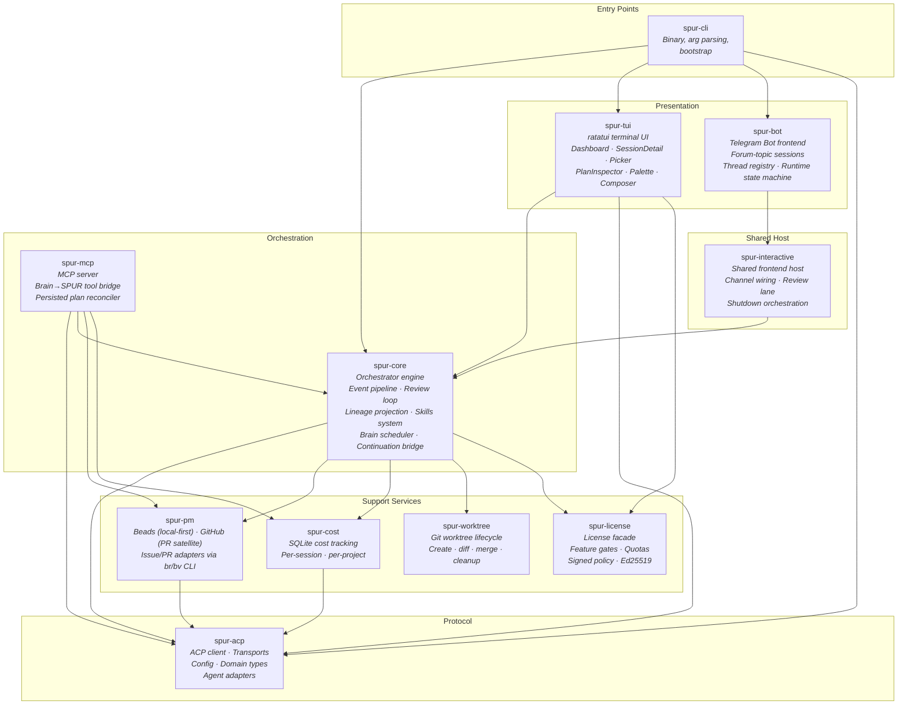
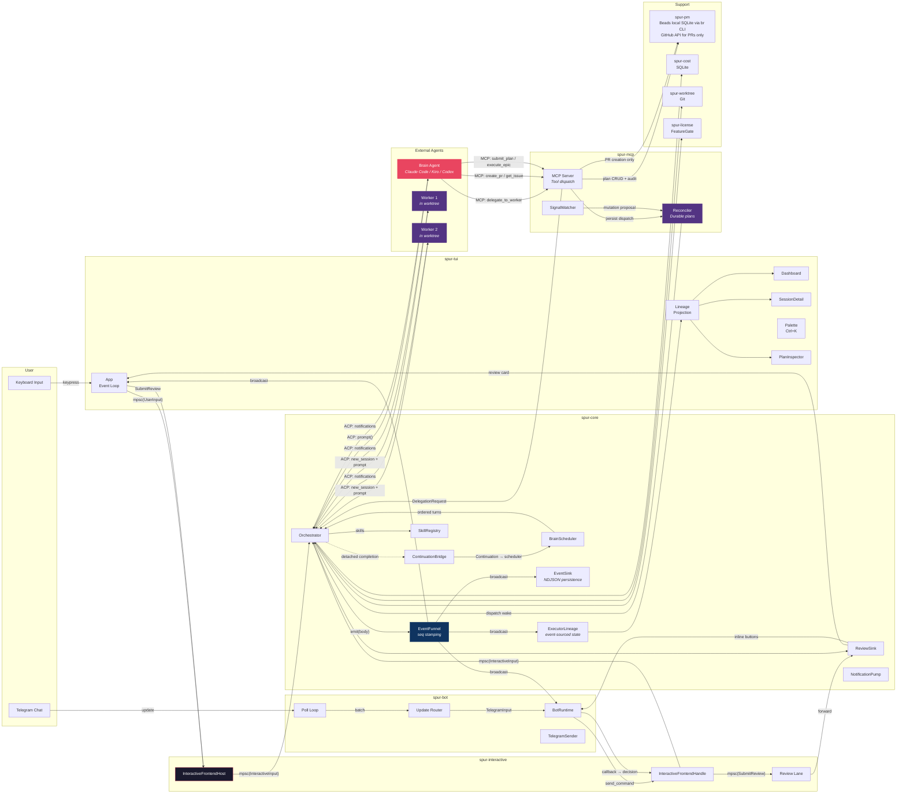
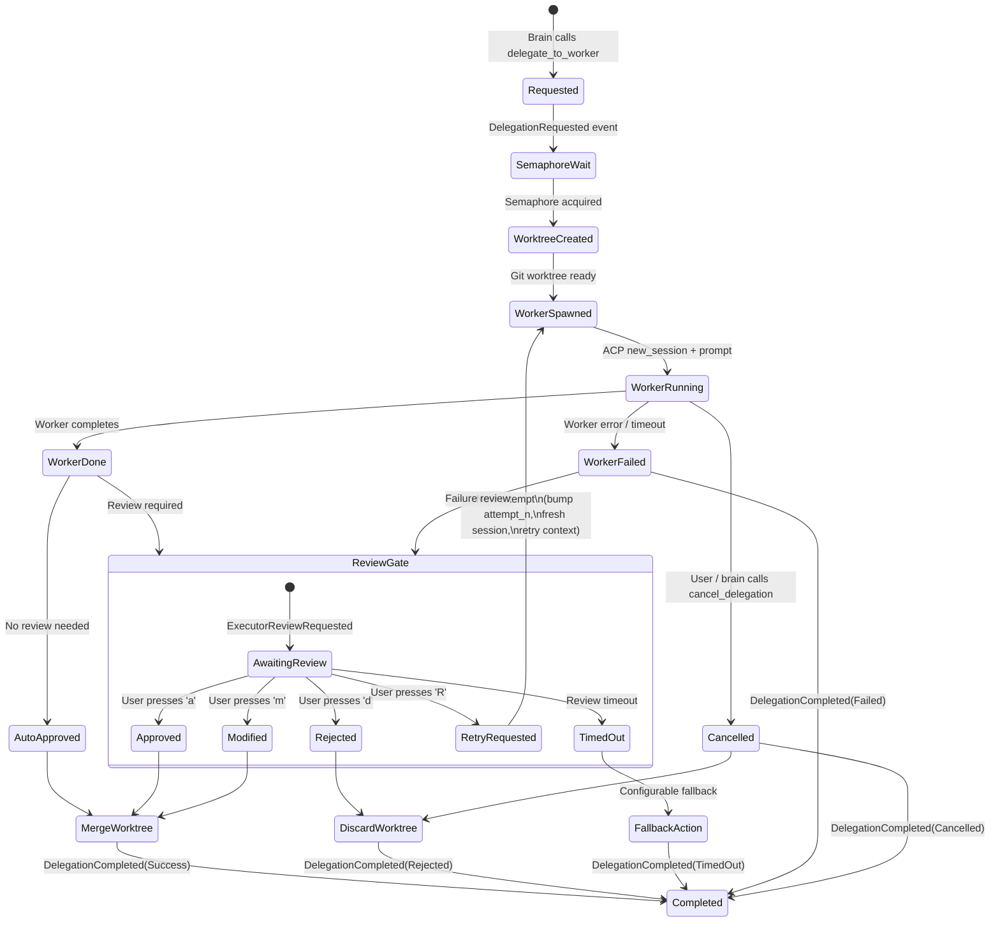
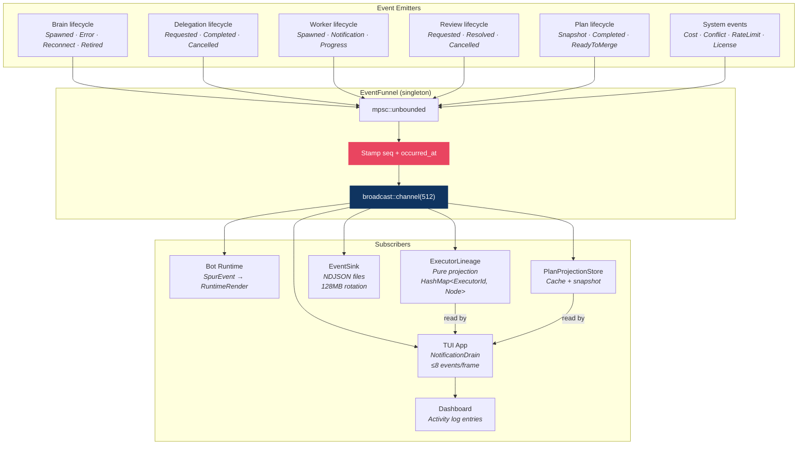

# SPUR Architecture

> Reviewed 2026-04-23. Covers all 11 workspace crates, ~75k lines of Rust.

## 1. Component Architecture

Eleven crates with strict layering. No dependency cycles.



### Crate Responsibilities

| Crate | Lines | Role | Key Types |
|---|---|---|---|
| `spur-acp` | ~7.5k | Protocol foundation | `AgentConnection`, `SpurEvent`, `SpurEventBody`, `DelegationStatus`, `SpurConfig` |
| `spur-core` | ~11k | Orchestration engine | `Orchestrator`, `BrainScheduler`, `ContinuationBridge`, `EventFunnel`, `ReviewSink`, `ExecutorLineage`, `SkillRegistry` |
| `spur-mcp` | ~14.8k | Brain→SPUR bridge + durable plans | MCP `Server`, `Reconciler`, `PlanProjectionStore`, `MutationExecutor` |
| `spur-tui` | ~31k | Terminal interface | `App`, `DashboardView`, `SessionDetailView`, `PlanInspectorView`, `PaletteOverlay` |
| `spur-cli` | ~2k | Binary entry point | CLI args, `tui` command, `bot telegram`, `profile` |
| `spur-pm` | ~2.9k | PM integration — **beads-primary, GitHub-satellite** | `PmService`, `BeadsAdapter` (shells to `br`), `GitHubAdapter` (shells to `gh`), `BeadsAdvanced`, `BvAdapter` |
| `spur-cost` | ~0.5k | Cost tracking | `CostTracker`, SQLite schema |
| `spur-worktree` | ~1k | Git isolation | `WorktreeManager`, `MergeResult`, `ArtifactResolver` |
| `spur-license` | ~2.6k | Licensing & feature gates | `SpurLicense`, `FeatureGate`, `PolicyResolver`, `LicenseProvider` |
| `spur-bot` | ~1.9k | Telegram frontend | `BotRuntime`, `ThreadRegistry`, `TelegramClient`, `RuntimeRender` |
| `spur-interactive` | ~0.1k | Shared host glue | `InteractiveFrontendHost`, `InteractiveFrontendHandle`, `ReviewSubmission` |

---

## 2. Data Flow

The system uses a **dual-channel architecture**: ACP (SPUR→Agent) and MCP (Agent→SPUR). Events flow outward via broadcast; commands flow inward via mpsc. A new **interactive host layer** lets both TUI and Telegram share one correctness path.



### Channel Summary

| Channel | Type | Direction | Purpose |
|---|---|---|---|
| `mpsc(UserInput)` | Tokio mpsc | TUI → Host | User commands, palette dispatch |
| `mpsc(InteractiveInput)` | Tokio mpsc | Host → Orchestrator | Unified command vocabulary (message, resume, cancel) |
| `mpsc(SubmitReview)` | Tokio mpsc | Host → ReviewSink | Dedicated review lane (no head-of-line blocking) |
| `broadcast(SpurEvent)` | Tokio broadcast | Orchestrator → All | Event fan-out (TUI, bot, sink, lineage) |
| `mpsc(PermissionRequest)` | Tokio mpsc | Orchestrator → Frontend | One-shot permission prompts |
| ACP (JSON-RPC/stdio) | Agent Client Protocol | SPUR ↔ Agents | Session management, prompts, notifications |
| MCP (JSON-RPC/stdio) | Model Context Protocol | Brain → SPUR | Delegation, PM ops, plan submission |
| `mpsc(DelegationRequest)` | Tokio mpsc | MCP Server → Orchestrator | Delegation dispatch |
| `oneshot(DelegationResult)` | Tokio oneshot | Orchestrator → MCP Server | Delegation response |
| `broadcast(LicenseEvent)` | Tokio broadcast | License runtime → All | License state changes |

---

## 3. Delegation Lifecycle

A delegation is the core unit of work. It flows through a state machine with review gates, retry loops, and cancellation.



### Key Invariants

- Every delegation emits exactly one `DelegationCompleted` event (via `finalize`)
- Retry loops produce new `Attempt` entries under the same `ExecutorId`
- Stream buffer is cleared on retry start
- Worktree is cleaned up on every terminal path (merge, preserve, or discard)
- Semaphore is released on every exit path (RAII via `SemaphorePermit`)
- Cancellation token is registered before spawn and races with worker execution (`INV-6`)
- ReviewHandle typestate enforces register-before-emit (`INV-4`)

---

## 4. Event Bus Topology

All state changes flow through the EventFunnel — a singleton that guarantees monotonic sequence numbers.



### SpurEventBody Variants (~30+)

| Category | Variants |
|---|---|
| Brain lifecycle | `BrainSpawned`, `BrainError`, `BrainFailover`, `BrainReconnecting`, `BrainReconnected`, `BrainReconnectFailed`, `BrainRetired` |
| Session lifecycle | `SessionCompleted`, `TurnComplete`, `AgentNotification` |
| Delegation | `DelegationRequested`, `DelegationCompleted` |
| Worker | `WorkerSpawned`, `WorkerNotification`, `WorkerProgress`, `WorkerFileTouched`, `WorkerHeartbeat` |
| Executor state | `ExecutorPhaseChanged`, `ExecutorRetryStarted`, `ExecutorArtifact` |
| Review | `ExecutorReviewRequested`, `ExecutorReviewResolved`, `ExecutorReviewCancelled` |
| Plan | `PlanSnapshotUpdated`, `PlanCompleted`, `PlanReadyToMerge` |
| System | `CostUpdate`, `ConflictDetected`, `RateLimitDetected`, `LicenseUpdated` |
| PM | `IssueReceived`, `PrCreated`, `IssueUpdated` |

---

## 5. Architectural Assessment

### Strengths

- **Event sourcing** — lineage projection is a pure function of the event stream; session resume is replay
- **Dual-channel (ACP+MCP)** — brain has autonomy (calls tools) while SPUR controls execution
- **Clean crate layering** — no dependency cycles, spur-acp is the foundation, spur-worktree is a leaf
- **Review gate as first-class state machine** — human-in-the-loop with timeout, retry, fallback, cancellation
- **Worktree isolation** — true filesystem isolation for parallel workers
- **Shared interactive host** — `spur-interactive` eliminates bootstrap duplication between TUI and Telegram bot
- **Skills system** — 17 bundled skills render per-agent (Claude Code, Codex, Gemini, Kiro, Cursor, OpenCode, Kimi) with role gating and atomic SPUR-MANAGED installation
- **Durable plan reconciler** — persisted plans survive process restarts in local beads (SQLite via `br` CLI); beads comments serve as the audit log. GitHub is used only for PR creation.
- **`br` CLI boundary** — `spur-pm` shells to the external `br` binary for all database operations, creating an anti-corruption layer between SPUR's orchestration semantics and the beads schema evolution
- **License feature gates** — wait-free `arc_swap` entitlement checks with signed policy documents and Ed25519 verification

### Known Risks

| Risk | Severity | Status | Location |
|---|---|---|---|
| Stranded executors — early-exit paths bypass `finalize()` | ~~Critical~~ | **Fixed** — `DelegationGuard` RAII emits `DelegationCompleted(Failed)` on Drop | `orchestrator.rs` |
| broadcast::channel drops events when subscribers are slow | ~~High~~ | **Mitigated** — drain cap raised 8→64 (1920 events/sec at 30fps) | `app.rs` |
| Silent `_ => {}` catch-alls on SpurEventBody matches | ~~High~~ | **Fixed** — explicit arms for all variants; reconnect events now update brain status | `app.rs` |
| Worktree orphaning on unclean shutdown | ~~High~~ | **Fixed** — `cleanup_orphans()` discovers and removes stale `spur/` worktrees on startup | `manager.rs` |
| No backoff on delegation retry loops | ~~High~~ | **Fixed** — exponential backoff 1s→30s cap between retries | `orchestrator.rs` |
| Worker JoinHandles not tracked for shutdown abort | ~~Medium~~ | **Fixed** — `TaskTracker` replaces fire-and-forget `tokio::spawn` for collector JoinHandles | `orchestrator.rs` |
| Orchestrator is a 4400-line God Object | **High** | **Partially addressed** — BrainScheduler, ContinuationBridge, EventFunnel, EventSink, ReviewSink, RetryLoop, LicenseRuntime, PlanProjectionStore, and Lineage modules extracted. Remaining: delegation dispatch and review coordination still inline. | `orchestrator.rs` |
| Single-process — no fault isolation between brain and workers | Low (v0.1) | **Open** — worker panic could take down orchestrator | Architecture-level |
| Broadcast Lagged recovery not implemented | Low | **Open** — Lagged events are logged but lineage is not rebuilt from NDJSON. Runtime state (lineage, sessions, pending continuations) is ephemeral; only plan structural state is durable in beads. | `app.rs` event loop |
| `delegate_async` MCP tool drops `delegation_plan` from schema | ~~Low~~ | **Fixed** — schema now matches `delegate_to_worker`; `delegate_async` deprecated and removed | `tools.rs` |
| No MCP tool to cancel a running delegation | ~~Low~~ | **Fixed** — `cancel_delegation` tool sends sentinel; orchestrator handler wired | `server.rs`, `tools.rs`, `orchestrator.rs` |
| Telegram bot callback expiry after rebind | **Medium** | **Fixed** — prompt tokens capture `live_session` at creation; stale callbacks return "expired" | `runtime.rs` |
| Persisted plan halt on startup (orphan recovery gap) | **High** | **Fixed** — `recover_persisted_plans()` compensates dispatch orphans on startup | `plan/reconciler.rs` |
| Reconciler wake path lost on restart | **High** | **Fixed** — journal append monitor + default wake path restore startup dispatch | `plan/reconciler.rs` |
| Lazy history loading causes stale session metadata | **Medium** | **Fixed** — lazy loading gated by exact pending target; superseded resumes evicted | `runtime.rs` |
| Skill installer overwrites user-edited files | **Medium** | **Mitigated** — SPUR-MANAGED marker + SHA-256 hash detect user edits; `Skip(UserEdited)` outcome | `skills/installer.rs` |
| Cost tracking has no budget enforcement | **High** | **Open** — `spur-cost` logs to SQLite but no consumer throttles behavior on budget exceed. Runaway retry loops or autonomous mutations can burn API budget unchecked. | `spur-cost/src/lib.rs` |
| beads-advanced features tied to beads backend | **Medium** | **Open** — Plan projection, mutation execution, signal watching, and auto-merge require `BeadsAdvanced` which returns `None` for GitHub-only backends. Reconciler degrades to basic dispatch without beads. | `spur-pm/src/service.rs` |
| Reconciler journal wake file not yet active | **Low** | **Open** — `monitor_journal_appends()` polls `.beads/journal` every 250ms, but the file is not produced by `br` today. Falls back to base-interval polling (3s→30s). | `plan/reconciler.rs` |

### Remaining Work (prioritized)

1. **Orchestrator decomposition** — Split the remaining inline delegation dispatch and review coordination into actors:
   ```
   Orchestrator (coordinator)
     ├── BrainSessionManager (spawn, reconnect, failover, retire)
     ├── DelegationDispatcher (semaphore, worker spawn, worktree, cancellation)
     ├── ReviewCoordinator (sink, timeout, retry, auto-merge)
     └── EventPipeline (funnel, sink, broadcast)
   ```

2. **Lagged event recovery** — When `broadcast::Receiver` returns `Lagged(n)`, replay from the NDJSON event log to rebuild the lineage projection from scratch.

3. **MCP signal automation** — SignalWatcher currently proposes `ScopeDrift` splits. Next: integrate `MutationScorer` heuristics, add `CostSpike` and `QualityRegression` signal kinds.

4. **Bot multi-chat support** — Current `spur-bot` binds one operator chat. Future: team-wide bot with RBAC and per-topic permission gates.

5. **Trace source in palette** — `TraceSource` placeholder exists; wire `ReactTrace` entries into palette search.

6. **Runtime state durability** — Separate ephemeral runtime state (lineage, sessions, continuations) from durable plan state. Add checkpoint/restore for orchestrator runtime state, or document the explicit ephemeral boundary.

7. **Cost governance** — Convert `spur-cost` from passive logging to an active budget gate: per-session caps, per-plan ceilings, circuit breakers for anomalous spend.

### Decomposition Recommendation (for v1.0+)

The orchestrator should be split into actors:
```
Orchestrator (coordinator)
  ├── BrainSessionManager (spawn, reconnect, failover, retire, scheduler)
  ├── DelegationDispatcher (semaphore, worker spawn, worktree, cancel token registry)
  ├── ReviewCoordinator (sink, timeout, retry, auto-merge gating)
  ├── EventPipeline (funnel, sink, broadcast)
  └── PlanRuntime (projection store, reconciler bridge, mutation executor)
```

Each actor communicates via typed message channels, enabling independent testing and future distribution.
