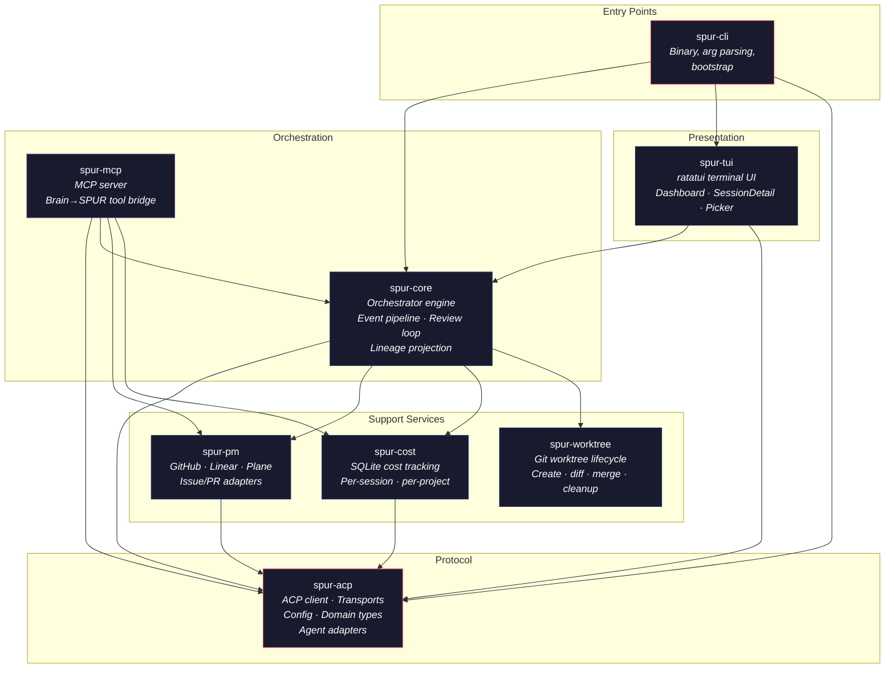
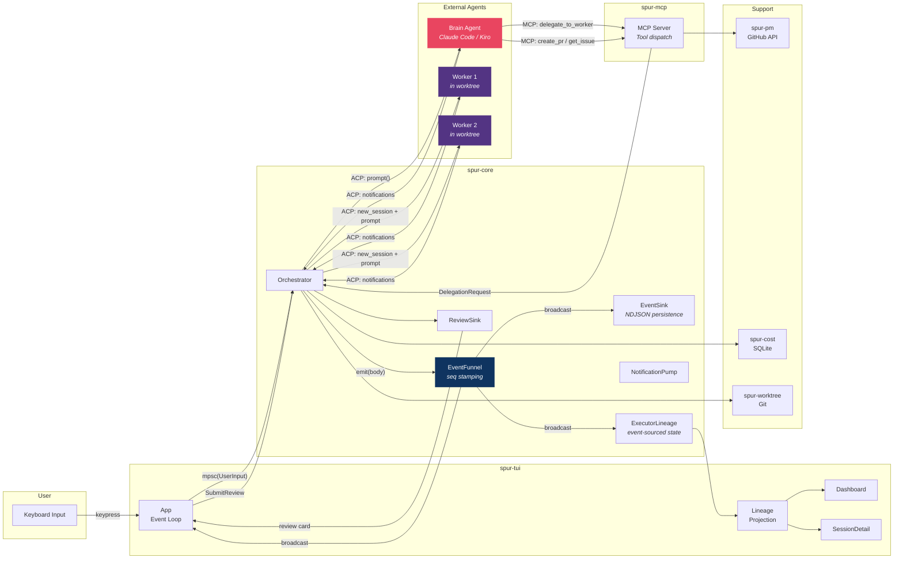
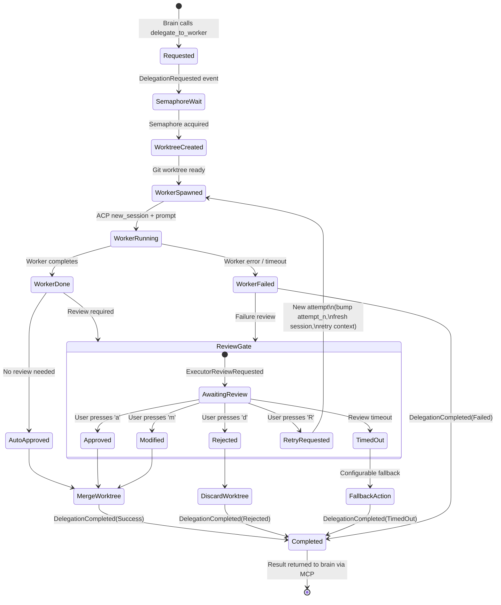
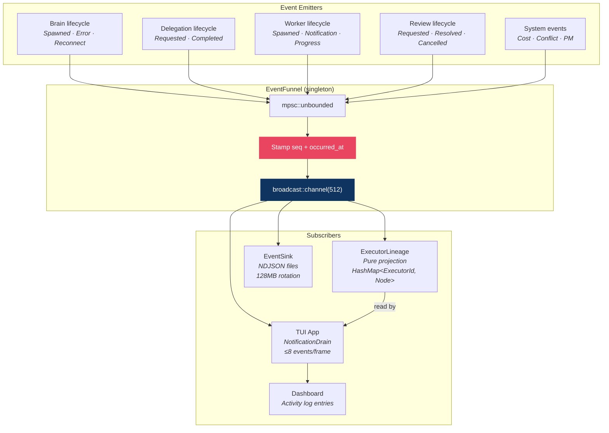

# SPUR Architecture

> Reviewed 2026-04-16. Covers all 8 workspace crates, ~280k lines of Rust.

## 1. Component Architecture

Eight crates with strict layering. No dependency cycles.



### Crate Responsibilities

| Crate | Lines | Role | Key Types |
|---|---|---|---|
| `spur-acp` | ~15k | Protocol foundation | `AgentConnection`, `SpurEvent`, `SpurEventBody`, `DelegationStatus`, `SpurConfig` |
| `spur-core` | ~12k | Orchestration engine | `Orchestrator`, `ExecutorLineage`, `EventFunnel`, `ReviewSink` |
| `spur-mcp` | ~3k | Brain→SPUR bridge | MCP `Server`, tool definitions |
| `spur-tui` | ~18k | Terminal interface | `App`, `DashboardView`, `SessionDetailView` |
| `spur-cli` | ~4k | Binary entry point | CLI args, bootstrap |
| `spur-pm` | ~2k | PM integration | `PmAdapter` trait, `GitHubAdapter` |
| `spur-cost` | ~2k | Cost tracking | `CostTracker`, SQLite schema |
| `spur-worktree` | ~1.5k | Git isolation | `WorktreeManager`, `MergeResult` |

---

## 2. Data Flow

The system uses a **dual-channel architecture**: ACP (SPUR→Agent) and MCP (Agent→SPUR). Events flow outward via broadcast; commands flow inward via mpsc.



### Channel Summary

| Channel | Type | Direction | Purpose |
|---|---|---|---|
| `mpsc(UserInput)` | Tokio mpsc | TUI → Orchestrator | User commands, review decisions |
| `broadcast(SpurEvent)` | Tokio broadcast | Orchestrator → All | Event fan-out (TUI, sink, lineage) |
| ACP (JSON-RPC/stdio) | Agent Client Protocol | SPUR ↔ Agents | Session management, prompts, notifications |
| MCP (JSON-RPC/stdio) | Model Context Protocol | Brain → SPUR | Delegation requests, PM operations |
| `mpsc(DelegationRequest)` | Tokio mpsc | MCP Server → Orchestrator | Delegation dispatch |
| `oneshot(DelegationResult)` | Tokio oneshot | Orchestrator → MCP Server | Delegation response |

---

## 3. Delegation Lifecycle

A delegation is the core unit of work. It flows through a state machine with review gates and retry loops.



### Key Invariants

- Every delegation emits exactly one `DelegationCompleted` event (via `finalize`)
- Retry loops produce new `Attempt` entries under the same `ExecutorId`
- Stream buffer is cleared on retry start
- Worktree is cleaned up on every terminal path (merge, preserve, or discard)
- Semaphore is released on every exit path (RAII via `SemaphorePermit`)

---

## 4. Event Bus Topology

All state changes flow through the EventFunnel — a singleton that guarantees monotonic sequence numbers.



### SpurEventBody Variants (~25)

| Category | Variants |
|---|---|
| Brain lifecycle | `BrainSpawned`, `BrainError`, `BrainFailover`, `BrainReconnecting`, `BrainReconnected`, `BrainReconnectFailed` |
| Session lifecycle | `SessionCompleted`, `TurnComplete`, `AgentNotification` |
| Delegation | `DelegationRequested`, `DelegationCompleted` |
| Worker | `WorkerSpawned`, `WorkerNotification`, `WorkerProgress`, `WorkerFileTouched`, `WorkerHeartbeat` |
| Executor state | `ExecutorPhaseChanged`, `ExecutorRetryStarted`, `ExecutorArtifact` |
| Review | `ExecutorReviewRequested`, `ExecutorReviewResolved`, `ExecutorReviewCancelled` |
| System | `CostUpdate`, `ConflictDetected`, `RateLimitDetected` |
| PM | `IssueReceived`, `PrCreated`, `IssueUpdated` |

---

## 5. Architectural Assessment

### Strengths

- **Event sourcing** — lineage projection is a pure function of the event stream; session resume is replay
- **Dual-channel (ACP+MCP)** — brain has autonomy (calls tools) while SPUR controls execution
- **Clean crate layering** — no dependency cycles, spur-acp is the foundation, spur-worktree is a leaf
- **Review gate as first-class state machine** — human-in-the-loop with timeout, retry, fallback
- **Worktree isolation** — true filesystem isolation for parallel workers

### Known Risks

| Risk | Severity | Status | Location |
|---|---|---|---|
| Stranded executors — early-exit paths bypass `finalize()` | ~~Critical~~ | **Fixed** — `DelegationGuard` RAII emits `DelegationCompleted(Failed)` on Drop | `orchestrator.rs` |
| broadcast::channel drops events when subscribers are slow | ~~High~~ | **Mitigated** — drain cap raised 8→64 (1920 events/sec at 30fps) | `app.rs` |
| Silent `_ => {}` catch-alls on SpurEventBody matches | ~~High~~ | **Fixed** — explicit arms for all variants; reconnect events now update brain status | `app.rs` |
| Worktree orphaning on unclean shutdown | ~~High~~ | **Fixed** — `cleanup_orphans()` discovers and removes stale `spur/` worktrees on startup | `manager.rs` |
| No backoff on delegation retry loops | ~~High~~ | **Fixed** — exponential backoff 1s→30s cap between retries | `orchestrator.rs` |
| Worker JoinHandles not tracked for shutdown abort | **Medium** | **Open** — fire-and-forget `tokio::spawn` for ext-notification pumps; stale events emitted after executor is done | `orchestrator.rs:1300, 3123` |
| Orchestrator is a 4400-line God Object | **High** | **Open** — single struct owns brain lifecycle, delegation dispatch, review coordination, worktree management, cost tracking | `orchestrator.rs` |
| Single-process — no fault isolation between brain and workers | Low (v0.1) | **Open** — worker panic could take down orchestrator | Architecture-level |
| Broadcast Lagged recovery not implemented | Low | **Open** — Lagged events are logged but lineage is not rebuilt from NDJSON | `app.rs` event loop |
| `delegate_async` MCP tool drops `delegation_plan` from schema | Low | **Fixed** — schema now matches `delegate_to_worker` | `tools.rs` |
| No MCP tool to cancel a running delegation | Low | **Fixed** — `cancel_delegation` tool sends sentinel; orchestrator handler pending | `server.rs`, `tools.rs` |

### Remaining Work (prioritized)

1. **TaskTracker for JoinHandle management** — Replace fire-and-forget `tokio::spawn` with `tokio_util::task::TaskTracker`. Requires adding `tokio-util` to `spur-core/Cargo.toml` and refactoring ~7 spawn sites. Provides graceful shutdown with 5s drain window. Also prevents stale ext-notification events after executor completion.

2. **Orchestrator decomposition** — Split the 4400-line God Object into actors:
   ```
   Orchestrator (coordinator)
     ├── BrainSessionManager (spawn, reconnect, failover)
     ├── DelegationDispatcher (semaphore, worker spawn, worktree)
     ├── ReviewCoordinator (sink, timeout, retry)
     └── EventPipeline (funnel, sink, broadcast)
   ```

3. **Lagged event recovery** — When `broadcast::Receiver` returns `Lagged(n)`, replay from the NDJSON event log to rebuild the lineage projection from scratch.

4. **MCP tool gaps** — ~~Add `cancel_delegation` tool; add `delegation_plan` to `delegate_async` schema~~ **Done** — also added TTL eviction for `completed_delegations` and `TaskTracker` for collector JoinHandles. Remaining: orchestrator-side `__cancel_delegation` handler in `spur-core`.

### Decomposition Recommendation (for v1.0+)

The orchestrator should be split into actors:
```
Orchestrator (coordinator)
  ├── BrainSessionManager (spawn, reconnect, failover)
  ├── DelegationDispatcher (semaphore, worker spawn, worktree)
  ├── ReviewCoordinator (sink, timeout, retry)
  └── EventPipeline (funnel, sink, broadcast)
```

Each actor communicates via typed message channels, enabling independent testing and future distribution.
