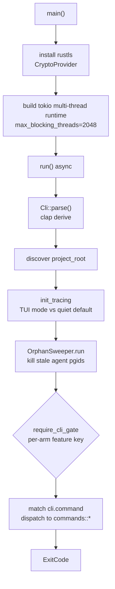

# SPUR CLI Entrypoint Architecture

Status: Current architecture as of `crates/spur-cli/src/main.rs`

`main.rs` is the binary entry point for the `spur` CLI — the user-facing
surface described as "Multi-agent orchestrator — issue in, PR out". It owns
command-line parsing (clap), process lifecycle (tokio runtime, rustls provider,
orphan sweep, tracing), license/feature gating, and the top-level dispatch table
that routes each subcommand to its handler in `commands::*` or `cmd::*`.

It deliberately stays thin: per-command logic lives in
`crates/spur-cli/src/commands/` and `crates/spur-cli/src/cmd/`. `main.rs`
parses, gates, sets up the environment, and delegates.

## High-Level Flow

## Module Layout

`main.rs` declares four local modules and pulls the rest from sibling crates:

| Module / import | Role |
|---|---|
| `cmd` | Low-level command helpers (upgrade, mcp servers) |
| `commands` | Per-subcommand handlers (`init`, `auth`, `config_*`, `analyst`, `graph`, `mcp`, `pm_ingest`, `profile`, `flags`, `telemetry`) |
| `onboarding` | First-run prompt flow |
| `upgrade_check` | Background version-check helper |
| `spur_core::{Orchestrator, RunOpts}` | Ad-hoc run / exec-direct / sessions |
| `spur_acp::{SpurConfig, AgentRegistry, SessionId, BrainSessionId}` | Config load, agent registry, session identity |
| `spur_license::SpurLicense` | Lazy feature-gate construction |
| `spur_pm`, `spur_bot`, `spur_graph` | PM ingest, Telegram frontend, graph worktree root resolution |

## Logging: `init_tracing`

`init_tracing(tui_mode, repo_root)` (main.rs:54) picks one of two regimes:

- **TUI mode** — rotating file appender under `.spur/logs/`, sized-rotated via
  `log_writer::build_rotator`. Level comes from `[log].level` in `SpurConfig`
  unless `RUST_LOG` overrides. Returns a `WorkerGuard` that the caller must hold
  for the process lifetime to flush buffered logs.
- **Subcommand mode** — quiet stderr writer. Default filter silences noisy
  modules (`spur_acp::registry=error`, `spur_acp::agents::defaults=warn`,
  `spur_pm::ingest=info`); `-v`/`--verbose` or `RUST_LOG` raises it. No guard
  returned.

## License Gate: `require_cli_gate`

`require_cli_gate(key)` (main.rs:116) is a lazy construct-on-first-call gate
check. `SpurLicense::from_env_or_disabled()` is cheap on Community tier (no
env vars set ⇒ embedded `CommunityProvider`, zero I/O) and reads a cached
license JWT once on Pro.

Non-gated arms (`Skills`, `Workflow`, `Config`, `Flags`, `Gc`, `Bot`,
`Profile`, `Auth`, `Telemetry`, `Analyst`, `Graph`, `Mcp`) never call it, so
they pay zero gate-construction cost. Gated arms each pass a distinct
`FeatureKey` (e.g. `CLI_CORE_INIT`, `CLI_CORE_RUN`, `CLI_CORE_TUI`,
`CLI_CORE_AGENTS`, `CLI_CORE_EXEC`, `CLI_CORE_SESSIONS`, `CLI_CORE_COST`,
`CLI_CORE_CONNECT`).

## TUI Landing Resolution: `resolve_landing`

`resolve_landing(...)` (main.rs:123) decides where the TUI starts, returning a
`spur_tui::landing::LandingDecision`:

| Input | Decision |
|---|---|
| `--new` | `ShowDashboard` |
| `--session <acp>` | `AttachExplicit` (brain from stored metadata, else `--brain`, else `claude-code`); warns if `--brain` conflicts with stored |
| `--sessions` without `--dashboard` | `ShowPicker` |
| `--dashboard` | `ShowDashboard` |
| Empty registry | `SetupRequired` |
| Fresh last-active session (≤24h) whose brain matches `--brain` | `AutoResume` |
| Any prior session | `ShowPicker` |
| Otherwise | `ShowDashboard` |

## CLI Surface

`Cli` (main.rs:190) is the clap-derived top-level parser. `Commands`
(main.rs:196) is the dispatch enum. Subcommands and their inline options:

| Command | Purpose | Notes |
|---|---|---|
| `init` | Detect agents, write `.spur/config.toml` | `--global`, `--force`, `--with-skills`, `-y/--yes` |
| `skills init` | Render SpurPower skills into adapter dirs | |
| `agents add/remove/check` | Manage registered agents | |
| `run <task>` | Brain-routed ad-hoc task | `--brain`, `--issue`, `--background` |
| `exec --agent <a> <task>` | Direct agent execution (no brain/delegation) | |
| `sessions [show/kill]` | List / inspect / kill sessions | |
| `cost` | Cost summary | `--today/--week/--range`, `--by`, `--export`, `--engine sqlite/duckdb` (+`--experimental`) |
| `connect <service>` | PM auth (currently `github`) | |
| `auth …` | Commercial licensing (delegated to `commands::auth`) | |
| `upgrade [--check] [--force]` | Self-update | |
| `workflow validate/run` | Workflow TOML (Phase 3 stub) | |
| `config show/check/set` | Config shape validation and mutation | |
| `flags …` | Runtime feature flags | |
| `telemetry …` | Telemetry config and lifecycle | |
| `analyst build/mcp` | DuckDB graph index rebuild + MCP server | `--root`, `--artifact-dir`, `--db-path`, `--quiet` |
| `graph build/mcp` | Code-graph extraction + MCP server | `--root/--workspace`, `--output`, `--no-analyst`, `--no-section-embeddings`, `--with-temporal` (+shard caps) |
| `mcp [--root]` | Bundled read-only MCP server over stdio | code-graph + analyst tools |
| `gc outcomes` | Sweep outcome blobs | `--dry-run`, `--older-than`, `--namespace` |
| `bot telegram` *(feature `telegram-bot`)* | Telegram frontend | `--brain` |
| `tui` *(alias `watch`)* | Interactive dashboard | `--brain`, `--sessions`, `--dashboard`, `--new`, `--session`, `--profile`/`--duration`, hidden `--exit-after-sweep` |
| `profile …` | Profiling / flamegraph | |
| `pm init/ingest github` | beads tracker setup + GitHub ingest | `--since`, `--label-namespace`, `--page-size`, `--dry-run`, `--json` |

Helper parsers: `parse_rfc3339` (main.rs:696) for `--since`,
`parse_duration_days` (main.rs:702) for TTLs (`Nd`, `Ndays`, bare `N`; floor 1
day).

## Process Lifecycle: `main`

`main()` (main.rs:732):

1. Installs the rustls 0.23 default CryptoProvider before any TLS handshake
   (required by `octocrab` for `spur pm ingest github`). `.install_default()`
   is idempotent.
2. Builds a multi-thread tokio runtime with `max_blocking_threads(2048)` to
   absorb blocking agent I/O.
3. `block_on(run())`, mapping the result to `ExitCode`:
   - `Ok(())` → `SUCCESS`
   - `Err(RequestedExitCode)` → the embedded code (used by `upgrade`, `config
     check`, `pm ingest`, `cost --engine <bad>`)
   - any other `Err` → `render_top_level_error` + `FAILURE`

## Top-Level Dispatch: `run`

`run()` (main.rs:853):

1. `Cli::parse()` — clap derive.
2. `spur_core::project_root::discover(&cwd)` — locate the repo root.
3. `init_tracing(tui_mode, &repo_root)`.
4. For orchestrator-initializing arms (`Agents`, `Run`, `Exec`, `Sessions`,
   `Bot`), `warn_on_nested_layout(&repo_root)` flags nested SPUR layouts.
5. **Orphan sweep** (main.rs:865) — `OrphanSweeper` over `.spur/pgids/` kills
   stale agent process trees left over from a prior session. Recycled (still
   live) pgids are skipped; killed ones are returned in `reaped_orphans`. Emits
   a single `tracing::warn!` on any kills. The TUI arm exposes a hidden
   `--exit-after-sweep` flag so integration tests can verify reaping without
   entering the full TUI loop.
6. `match cli.command { … }` — the dispatch table. Each gated arm calls
   `require_cli_gate(FeatureKey::…)` first.

## Error Rendering

- `RequestedExitCode` (main.rs:769) — a sentinel `anyhow::Error` carrying an
  embedded `u8` exit code. `requested_exit(code)` constructs one.
- `render_top_level_error` (main.rs:802) — on a TTY (or, in debug builds only,
  when `SPUR_FORCE_TTY` is set), if the error chain contains a
  `spur_license::FeatureGateError`, renders the structured **upgrade CTA**
  instead of a plain message. Non-TTY / scripted output always uses anyhow's
  `{:#}` chain formatter so tooling can parse it.
- `is_tty_or_forced` (main.rs:824) — TTY check with the debug-only
  `SPUR_FORCE_TTY` escape hatch for `assert_cmd`-driven tests.

## Notable Arm: `Tui`

The `Tui` arm (main.rs:1242) holds the most inline logic:

1. Test-only `--exit-after-sweep` returns immediately after the sweep above.
2. `require_cli_gate(CLI_CORE_TUI)` fires **before** the `--profile` re-spawn
   so a gated failure surfaces on the parent invocation rather than producing a
   "profile of an error exit".
3. `--profile` rewrites the invocation as `ProfileCommands::Flamegraph` against
   `spur tui …` and returns.
4. Loads `SpurConfig` (falls back to `Default` with a warning).
5. `onboarding::maybe_prompt_first_run(&license)` — first-run prompt.
6. **Community singleton lock** (main.rs:1314) — on Community tier, acquires a
   `PidFileGuard` at `.spur/.spur-tui.pid`; one TUI orchestrator per repo. Pro /
   Team / Enterprise skip the lock (Phase B will land cross-instance state
   coordination). Failure prints a CTA pointing to `spur auth login --key`.
7. Optional `PmService::try_new` — gated by
   `pm_service_gate_allows_construction`; constructs GitHub + beads adapters or
   logs a tier message and returns `None`.

(The remaining tail — config wiring, TUI launch loop — continues past the
excerpt documented here; see main.rs:1364+.)

## Tests

`cli_parse_tests` (main.rs:413) uses `clap::CommandFactory::try_get_matches_from`
to assert the parser accepts the shape of every non-trivial subcommand:

- `analyst build` with full flag set
- `graph build --workspace --no-analyst` / `--no-section-embeddings`
- `graph mcp --root`, `analyst mcp --root`, top-level `mcp --root`
- `graph build --with-temporal` with shard caps
- `init --global`

These guard against regressions when clap derive shapes change.
