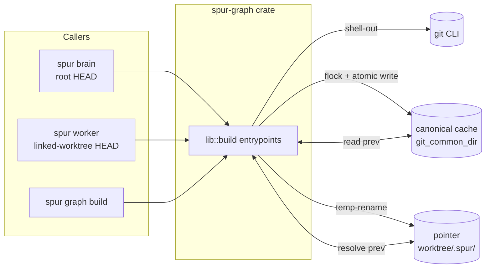
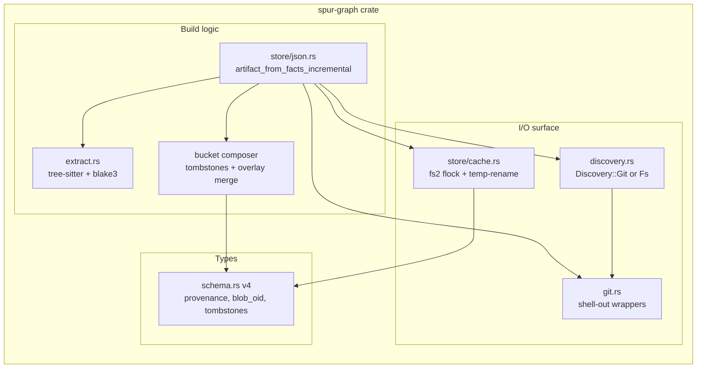
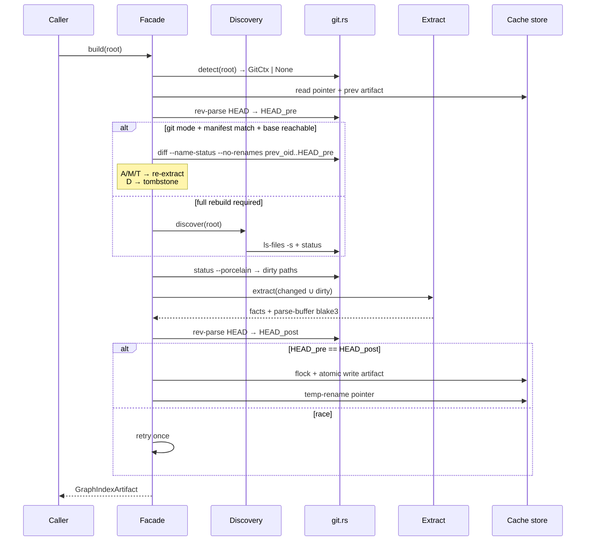
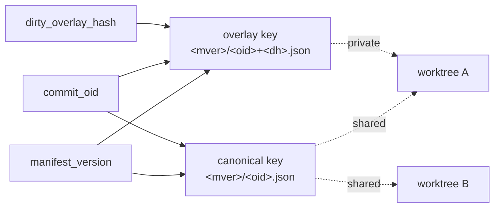
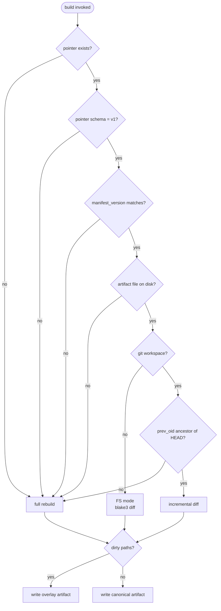
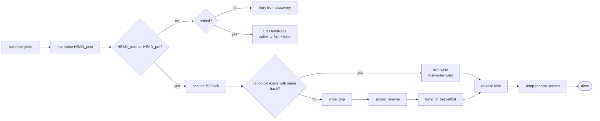
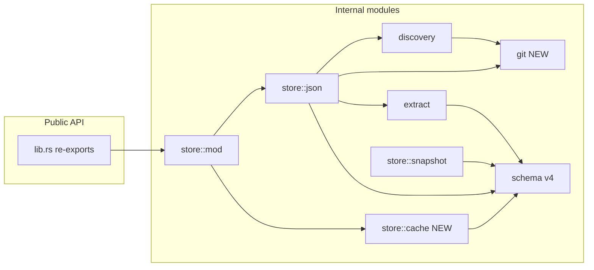

# spur-graph: git-as-invalidation-signal (v1, no renames)

**Issue:** bd-jvers
**Parent:** bd-270mj
**Status:** Proposed
**Owner:** spur-graph
**Scope:** `crates/spur-graph/`, `crates/spur-cli/src/commands/graph.rs`

---

## 1. Summary

Replace the `(mtime_nanos, size_bytes)` per-file invalidation in `spur-graph` with git as the change-detection substrate. Canonical artifact identity becomes `(manifest_version, commit_oid)`; the shared cache lives under `git_common_dir`; each worktree retains a small pointer file. Pure shell-out to `git` — no `git2`/`gix`. Mtime/size fallback is retained for non-git workspaces.

Reviews that grounded this design:
- gemini (design semantics): delegation `4e83b71a-42e9-427c-bf8d-aa0f8312bd5c`
- codex (impl realism + multi-worktree SoT): delegations `b4423f5d-2f9f-4e66-a1d5-f862c87569f2`, `00e7ea6e-c1eb-42ff-97f7-d058318515d9`

---

## 2. Goals & non-goals

### Goals
- Deterministic, mtime-free change detection.
- Cross-worktree artifact reuse (brain + workers share canonical cache).
- HEAD-race safety with single-retry semantics.
- Graceful fallback paths: non-git workspace, unreachable diff base, legacy artifact, dirty overlay.
- Pure-Rust dependency posture preserved (add only `fs2`).

### Non-goals (v1)
- Rename detection (`-M`/`-C` similarity).
- Tree-sitter incremental parse-with-edits.
- `git2`/`gix` library binding.
- Submodule inner-edge tracking (gitlink OID is opaque).
- Per-language manifest sub-versions.
- Shared-cache GC / size cap.

---

## 3. Substrate model

```
canonical artifact key  =  (manifest_version, commit_oid)
overlay artifact key    =  (manifest_version, commit_oid, dirty_overlay_hash)
identity in artifact    =  stable_file_id (path-keyed, unchanged)
                           stable_symbol_id (AST-path-derived, unchanged)
invalidation key        =  blob_oid (from `git ls-files -s`)
                           or "fs:<blake3>" / "dirty:<blake3>" for non-git/overlay
```

**Source of truth.** Brain defaults to the *root repo* HEAD. Workers resolve to *their own worktree* HEAD, which already reflects `BaseSpec::WithOverlay` cherry-picks (`spur-worktree/src/manager.rs:391`). `git_common_dir` is shared across linked worktrees → canonical cache is naturally shared.

---

## 4. On-disk layout

```
<git_common_dir>/spur-graph/
  artifacts/<manifest_version>/
    <commit_oid>.json                              ← canonical, immutable per key
    <commit_oid>+<dirty_overlay_hash>.json         ← overlay, per worker session
    .lock                                          ← fs2 exclusive lock

<worktree>/.spur/
  graph-index.json                                 ← pointer file (small JSON)
```

**Pointer schema** (`spur-graph-pointer-v1`):
```json
{
  "schema": "spur-graph-pointer-v1",
  "manifest_version": "<64 hex>",
  "commit_oid": "<40 hex>",
  "dirty_overlay_hash": "<32 hex or null>",
  "artifact_path": "<absolute>",
  "source_kind": "git" | "fs"
}
```

---

## 5. Component architecture

### 5.1 System context (C1)



### 5.2 Crate internals (C2)



### 5.3 Build sequence (C3)



### 5.4 Cache-key topology (C4)



### 5.5 Decision graph: cache lookup (C5)



### 5.6 Write path (C6)



### 5.7 Module dependency (C7)



---

## 6. Schema v4 (`crates/spur-graph/src/schema.rs`)

```rust
pub struct GraphIndexArtifact {
    pub header: GraphIndexHeader,
    pub manifest_version: String,
    pub provenance: GraphProvenance,                  // NEW
    pub file_manifests: Vec<GraphFileManifestEntry>,
    pub files: Vec<GraphFileArtifact>,
    pub symbols: Vec<GraphSymbolArtifact>,
    pub edges: Vec<GraphEdgeArtifact>,
    pub tombstones: Vec<GraphTombstoneEntry>,         // NEW
    #[serde(default, skip)] pub diagnostics: Vec<String>,
}

#[serde(deny_unknown_fields)]
pub struct GraphProvenance {
    pub source_kind: SourceKind,                      // "git" | "fs"
    pub indexed_commit_oid: Option<String>,
    pub dirty_overlay_hash: Option<String>,
    pub manifest_version: String,
    pub generator_version: String,
}

#[serde(deny_unknown_fields)]
pub struct GraphFileManifestEntry {
    pub stable_file_id: String,
    pub path: String,
    pub blob_oid: String,        // "<40 hex>" | "fs:<32 hex>" | "dirty:<32 hex>"
    pub node_ids: Vec<NodeId>,
    // mtime_nanos and size_bytes REMOVED
}

#[serde(deny_unknown_fields)]
pub struct GraphTombstoneEntry {
    pub path: String,
    pub stable_file_id: String,
    pub deleted_in_commit_oid: String,
}
```

`SCHEMA_VERSION` → `"spur-graph-schema-v4"`. `deny_unknown_fields` enforces hard cutover: old artifacts fail to parse → caller falls back to full rebuild (already wired at `crates/spur-cli/src/commands/graph.rs:50`).

---

## 7. New module: `crates/spur-graph/src/git.rs`

Pure `std::process::Command` shell-outs. All paths use `-z` NUL-termination.

```rust
pub struct GitCtx {
    pub worktree_root: PathBuf,
    pub git_common_dir: PathBuf,
    pub head_oid: String,
    pub is_shallow: bool,
}

pub fn detect(worktree_root: &Path) -> Option<GitCtx>;
pub fn rev_parse_head(root: &Path) -> Result<String>;
pub fn rev_parse_common_dir(root: &Path) -> Result<PathBuf>;
pub fn ls_files_with_oids(root: &Path) -> Result<Vec<TrackedEntry>>;
pub fn diff_name_status_no_renames(root: &Path, from: &str, to: &str)
    -> Result<Vec<ChangeEntry>>;
pub fn status_dirty_paths(root: &Path) -> Result<Vec<DirtyEntry>>;
pub fn is_ancestor(root: &Path, ancestor: &str, descendant: &str) -> Result<bool>;
```

Filters at the discovery boundary:
- `mode == 120000` → skip (symlink).
- `stage != 0` → skip + warn (unmerged).
- sparse-flagged via `ls-files -t` (`S`) → skip.

---

## 8. Algorithm: incremental rebuild

```
1. ctx = git::detect(root); HEAD_pre = ctx?.head_oid
2. prev = load_pointer_then_artifact(root)
3. if !ctx: FS mode (blake3 invalidation, same compose path)
4. if prev.manifest_version != current()
       || prev.provenance.source_kind != "git"
       || !is_ancestor(prev.commit_oid, HEAD_pre):
       changes = synthesize_all_as_added(ls_files)
   else:
       changes = diff_name_status_no_renames(prev.commit_oid, HEAD_pre)
5. clean_buckets = prev.buckets
   for c in changes:
       A | M | T → re-extract from worktree @ HEAD_pre
       D        → drop bucket, emit tombstone(deleted_in = HEAD_pre)
       U        → treat as M, warn
6. dirty = git::status_dirty_paths(root)
   if !dirty.is_empty():
       overlay_buckets = re-extract dirty
       dirty_overlay_hash = blake3(sort(path || blake3(parse_buf)))
       compose: overlay wins per-path
7. HEAD_post = rev_parse_head(root)
   if HEAD_post != HEAD_pre: retry once → else Err(HeadRace)
8. write canonical or overlay artifact + pointer
```

---

## 9. Locking & atomic write

```
lock = fs2::lock_exclusive(<common>/spur-graph/artifacts/<mver>/.lock)
if exists(target) && content_hash(existing) == content_hash(new): skip
else:
    write(tmp = target + ".tmp.<pid>.<rand>")
    rename(tmp, target)              // atomic on same fs
    fsync_dir(parent)                // best-effort
release(lock)
update_pointer_via_temp_rename()     // only after canonical write succeeds
```

Cache is content-immutable per key → first-writer-wins is safe.

---

## 10. Call-site changes (`crates/spur-cli/src/commands/graph.rs`)

- Pointer detection at `<root>/.spur/graph-index.json`.
- `load_artifact(pointer.artifact_path)` replaces direct `load_artifact(output)`.
- `write_artifact` → `store::cache::write_with_pointer(&artifact, &root)`.
- Existing `--output PATH` override bypasses shared cache (used by tests, dumps).
- Existing error-fallback branch at `commands/graph.rs:50` retained as universal safety net.

---

## 11. Acceptance criteria → test mapping

| AC | Test | File |
|----|------|------|
| 1 Discovery | `discovery_uses_git_when_available`, `discovery_falls_back_to_ignore` | `discovery.rs` unit |
| 2 Invalidation | `blob_oid_replaces_mtime_size` | `integration_git_incremental.rs` |
| 3 Change feed | `added_modified_deleted_paths_handled` | integration |
| 4 Provenance | `provenance_populated_for_git_and_fs` | integration |
| 5 Layout | `artifact_under_git_common_dir`, `pointer_at_worktree_root` | integration |
| 6 Overlay | `dirty_overlay_keyed_by_blake3` | integration |
| 7 HEAD race | `head_change_triggers_single_retry` | integration (with injected oid) |
| 8 Tombstones | `delete_emits_tombstone_with_oid` | integration |
| 9 Fallbacks | `non_git_fallback`, `unreachable_base_full_rebuild`, `manifest_version_bump_full_rebuild` | integration |
| 10 Bench | `benches/incremental.rs` — clean 100k, 1k change, dirty 100 | criterion |

---

## 12. Risk register

| Risk | Likelihood | Mitigation |
|------|-----------|-----------|
| Shell-out latency on 100k repos | M | Bench gate; one `ls-files` + one `diff` |
| `git_common_dir` surprises (submodules, linked worktrees) | L | `rev-parse --git-common-dir` once; linked-worktree integration test |
| Concurrent brain+worker writes | M | fs2 exclusive + content-immutable keys |
| Legacy artifact confuses new loader | H | `deny_unknown_fields` → parse fail → full rebuild |
| Unreachable diff base (shallow, GC) | M | `is_ancestor` precheck → full rebuild |
| Rename churn (no `-M`) | accepted | Documented as v1 limitation; tombstone+add |

---

## 13. Out-of-band notes

- `Cargo.toml` gains `fs2 = "0.4"` only. No `git2`/`gix`.
- `SCHEMA_VERSION` and `EXTRACTOR_VERSION` both change → `current_manifest_version()` shifts → all existing artifacts evict on first run. Expected.
- Snapshot tests under `crates/spur-graph/tests/` will need fixture regeneration (mechanical, one commit).
- No change to `stable_file_id` derivation or `stable_symbol_id` derivation — wire-compat for downstream consumers preserved at the identity level.

---

## 14. Execution plan

1. Add `crates/spur-graph/src/git.rs` + unit tests (no callers yet).
2. Add `fs2`; implement `store/cache.rs` (shared cache + pointer helpers).
3. Bump `schema.rs` to v4 (provenance, `blob_oid`, tombstones); update body-hash struct.
4. Rewrite `artifact_from_facts_incremental` to consume `GitCtx` + diff feed.
5. Switch `commands/graph.rs` to pointer/shared-cache layout.
6. Regenerate snapshots; add `tests/integration_git_incremental.rs`.
7. Add `benches/incremental.rs`; record numbers in PR description.

Each step builds green: `cargo check -p spur-graph && cargo test -p spur-graph`. Final step also runs `cargo test -p spur-cli`.

---

**Open decision before kickoff:** legacy artifact at `<worktree>/.spur/graph-index.json` is overwritten by the new pointer (same path, breaking shape). The fallback path absorbs it cleanly (parse error → full rebuild). Confirming the clean cutover (no grace-window double-write) before kickoff.
