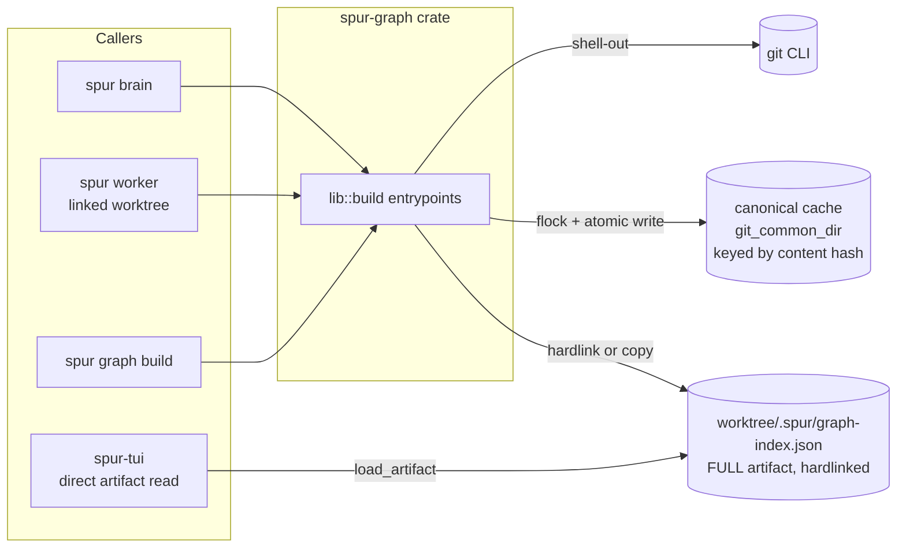
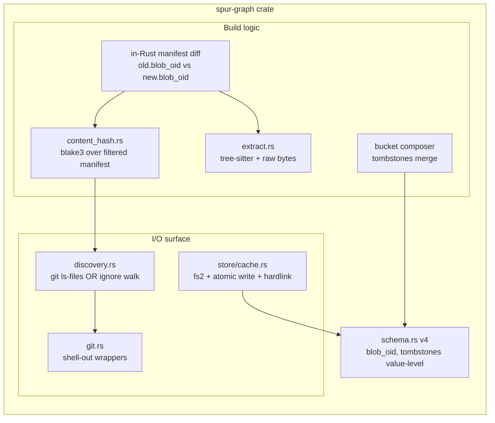
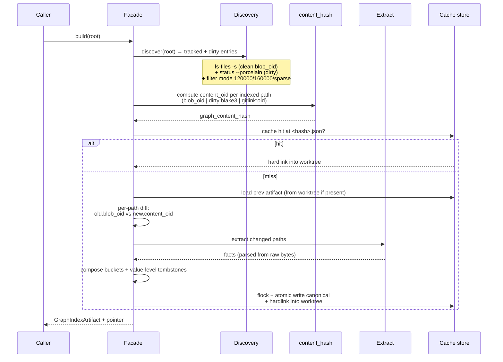
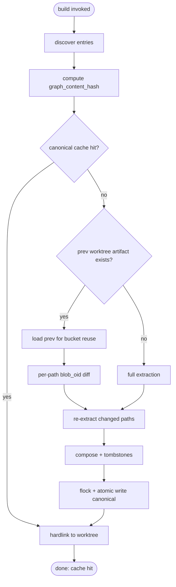
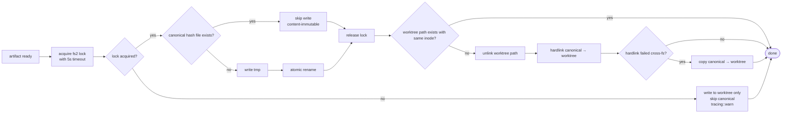
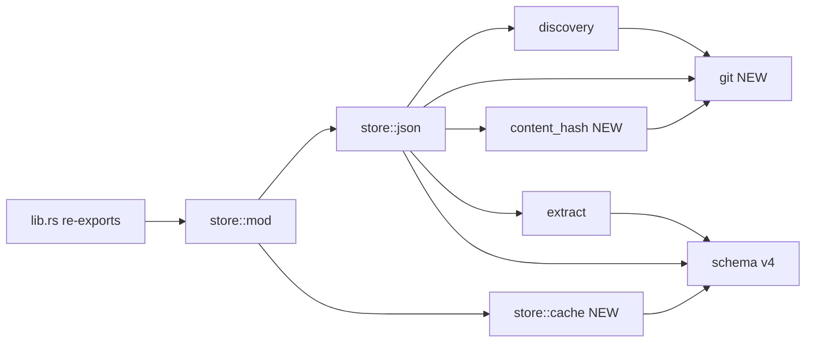

# spur-graph: git-as-invalidation-signal (v2.1 — content-hash substrate, no renames)

**Issue:** bd-jvers
**Parent:** bd-270mj
**Status:** Proposed (v2.1, post-review + dirty-hash correction)
**Owner:** spur-graph
**Scope:** `crates/spur-graph/`, `crates/spur-cli/src/commands/graph.rs`

> **v2.1 changelog vs v2.** Fixed I2: dirty-file `content_oid` now uses git's blob-OID format computed locally (`sha1("blob " || decimal(size) || "\0" || bytes)`) instead of `dirty:blake3(bytes)`. This makes a dirty file's hash byte-identical to the blob OID it would receive on commit, so the cache key before and after committing the same edits is identical. Algorithm parity with `git hash-object --stdin` verified against text, empty, and binary-with-NUL inputs. `sha1` is already vendored in `Cargo.lock` transitively (`0.10.6`) — only a direct-dep declaration in `spur-graph/Cargo.toml` is needed. bd-jvers' "no `git hash-object`" constraint is about shell-out latency — local sha1 is microseconds per file and is permitted.
>
> **v2 changelog vs v1.** Canonical identity moved from `commit_oid` to a filtered-content hash over `(path, blob_oid)` pairs. Provenance (commit_oid, dirty_overlay_hash) moved from the shared artifact body into the per-worktree pointer. Tombstones are value-level (no commit OID). Dirty overlay collapses into the same hash function (no side-cache). HEAD-race retry logic dissolves (cache key is index-snapshot-derived, not HEAD-derived). The per-worktree `.spur/graph-index.json` keeps its current full-artifact shape (so the TUI and other direct consumers see no change). See §15 for the review history that drove these changes.

---

## 1. Summary

Replace the `(mtime_nanos, size_bytes)` per-file invalidation in `spur-graph` with **git blob OIDs as content-stable invalidation keys** and a **filtered-content hash** as the canonical artifact identity. Canonical cache lives under `git_common_dir`; per-worktree `.spur/graph-index.json` stays as the consumer-stable full artifact (dedup'd against the canonical cache via hardlink or copy). Pure shell-out to `git` — no `git2`/`gix`. Blake3-of-bytes fallback retained for non-git workspaces.

---

## 2. Goals & non-goals

### Goals
- Deterministic, mtime-free change detection.
- Cross-worktree artifact reuse, including cherry-pick-equivalent worktrees (the multi-worktree SoT motivation).
- Identity is content-derived; commit metadata is provenance, not identity.
- Graceful fallback paths: non-git workspace, dirty edits, missing prev artifact.
- Pure-Rust dependency posture preserved (add only `fs2`).
- Consumer-stable: `.spur/graph-index.json` remains a full artifact loadable by `spur_graph::load_artifact` (TUI mention path).

### Non-goals (v1)
- Rename detection (`-M`/`-C` similarity).
- Tree-sitter incremental parse-with-edits.
- `git2`/`gix` library binding.
- Submodule inner-edge tracking (gitlink OID is opaque).
- Per-language manifest sub-versions.
- Shared-cache GC / size cap.

---

## 3. Substrate model

```
canonical artifact key  =  graph_content_hash
                        =  blake3(sorted(path "\0" content_oid for each indexed path))
where:
  content_oid  =  blob_oid                                     (clean tracked file; from git ls-files -s)
                  | git_blob_oid(fs::read(file_bytes))         (dirty / untracked; locally computed sha1)
                  | git_blob_oid(fs::read(file_bytes))         (non-git workspace; same algorithm)
                  | "gitlink:" || gitlink_oid                  (submodule pointer)

  git_blob_oid(bytes) = sha1("blob " || decimal(bytes.len()) || "\0" || bytes)
                       // identical to what `git hash-object --stdin` would return;
                       // implemented locally (no shell-out) so dirty == committed.

stable_file_id   = path-keyed (unchanged from v1)
stable_symbol_id = AST-path-derived (unchanged from v1)
```

**Provenance (separate from identity)** lives only in the per-worktree pointer:
```
provenance = {
  indexed_commit_oid:  Option<String>,    // None if dirty-only / non-git
  source_kind:         "git" | "fs",
  manifest_version:    String,
  graph_content_hash:  String,             // == canonical cache key
}
```

**Key invariants** (must be testable):

- **I1** Two worktrees with the same filtered file content map to the same canonical key, regardless of commit history.
- **I2** A worktree with dirty edits and a worktree where those same edits are committed produce **identical** canonical keys for the same byte content. (Holds because dirty `content_oid` uses the git blob-OID algorithm, locally computed.)
- **I3** Dirty edits, clean tracked files, and non-git files go through the same hash function family (`git_blob_oid(bytes)` for dirty/fs/untracked, equal to the blob_oid git would assign on commit).
- **I4** Cache key derivation reads only the git index (`ls-files -s`) and any dirty file bytes. It does NOT depend on `HEAD`.

---

## 4. On-disk layout

```
<git_common_dir>/spur-graph/
  artifacts/<manifest_version>/
    <graph_content_hash>.json              ← canonical, content-immutable per key
    .lock                                  ← fs2 exclusive lock

<worktree>/.spur/
  graph-index.json                         ← FULL artifact (hardlink or copy of canonical)
  graph-index.pointer.json                 ← OPTIONAL provenance pointer (sidecar)
```

**Why `.spur/graph-index.json` stays as a full artifact:**
`crates/spur-tui/src/mentions/code_graph/source.rs:127` calls `load_artifact(&self.artifact_path)` directly on that path at runtime, plus 15+ TUI integration tests in `crates/spur-tui/tests/mention_registry.rs`. Replacing it with a pointer file is a runtime-breaking change with no upside under the content-hash model. Instead, the canonical cache becomes a **dedup layer**: write once to `<canonical>/<hash>.json`, then hardlink (or fall back to copy across filesystems) into `<worktree>/.spur/graph-index.json`. On cache hit, hardlink the existing canonical artifact in.

**Sidecar pointer (`graph-index.pointer.json`)** is optional and carries the provenance fields (commit_oid, source_kind). It's a *hint* — never required for correctness. If absent or stale, the next build recomputes the content hash from scratch.

---

## 5. Component architecture

### 5.1 System context (C1)



### 5.2 Crate internals (C2)



### 5.3 Build sequence (C3)



### 5.4 Cache-key topology (C4)

```mermaid
flowchart LR
    subgraph Inputs
        LS[git ls-files -s<br/>path, blob_oid, mode]
        ST[git status --porcelain<br/>dirty paths]
        FB[fs::read bytes<br/>for dirty paths]
    end

    LS --> FILTER[filter by allowed_extensions<br/>+ filter modes 120000/sparse<br/>+ keep 160000 as gitlink:]
    ST --> SUB[substitute dirty:blake3 for clean blob_oid]
    FB --> SUB
    FILTER --> SUB
    SUB --> SORT[sort by path bytewise]
    SORT --> HASH[blake3 over<br/>path "\0" content_oid pairs]
    HASH --> KEY[graph_content_hash<br/>= canonical cache key]
```

### 5.5 Decision graph: cache lookup (C5)



### 5.6 Write path (C6)



### 5.7 Module dependency (C7)



---

## 6. Schema v4 (`crates/spur-graph/src/schema.rs`)

```rust
#[serde(deny_unknown_fields)]
pub struct GraphIndexArtifact {
    pub header: GraphIndexHeader,
    pub manifest_version: String,
    pub graph_content_hash: String,                   // NEW — the canonical identity
    pub file_manifests: Vec<GraphFileManifestEntry>,
    pub files: Vec<GraphFileArtifact>,
    pub symbols: Vec<GraphSymbolArtifact>,
    pub edges: Vec<GraphEdgeArtifact>,
    pub tombstones: Vec<GraphTombstoneEntry>,         // NEW — value-level
    #[serde(default, skip)] pub diagnostics: Vec<String>,
}

#[serde(deny_unknown_fields)]
pub struct GraphFileManifestEntry {
    pub stable_file_id: String,
    pub path: String,
    pub content_oid: String,    // "<40 hex git blob OID>" | "gitlink:<40 hex>"
    pub node_ids: Vec<NodeId>,
    // mtime_nanos and size_bytes REMOVED
}

#[serde(deny_unknown_fields)]
pub struct GraphTombstoneEntry {
    pub path: String,
    pub stable_file_id: String,
    // deleted_in_commit_oid REMOVED — value-level only
}
```

**Provenance lives in a sidecar**, not the artifact body:
```rust
// Written to <worktree>/.spur/graph-index.pointer.json
#[serde(deny_unknown_fields)]
pub struct GraphIndexPointer {
    pub schema: String,                          // "spur-graph-pointer-v1"
    pub graph_content_hash: String,              // matches artifact body
    pub manifest_version: String,
    pub source_kind: SourceKind,                 // "git" | "fs"
    pub indexed_commit_oid: Option<String>,      // provenance only, NOT identity
    pub canonical_artifact_path: PathBuf,
}
```

`SCHEMA_VERSION` → `"spur-graph-schema-v4"`. `deny_unknown_fields` enforces hard cutover: legacy artifacts fail to parse → `crates/spur-cli/src/commands/graph.rs:50` falls back to full rebuild (already wired).

---

## 7. New module: `crates/spur-graph/src/git.rs`

Pure `std::process::Command` shell-outs. All paths use `-z` NUL-termination.

```rust
pub struct GitCtx {
    pub worktree_root: PathBuf,
    pub git_common_dir: PathBuf,
    pub head_oid: String,           // recorded for provenance only
}

pub fn detect(worktree_root: &Path) -> Option<GitCtx>;
pub fn rev_parse_head(root: &Path) -> Result<String>;
pub fn rev_parse_common_dir(root: &Path) -> Result<PathBuf>;
pub fn ls_files_with_oids(root: &Path) -> Result<Vec<TrackedEntry>>;
pub fn status_dirty_paths(root: &Path) -> Result<Vec<DirtyEntry>>;

// Removed in v2 (no longer needed):
// - diff_name_status_no_renames (in-Rust manifest diff replaces it)
// - is_ancestor (HEAD-race retry logic dissolved)
```

Filters applied at discovery:
- `mode == 120000` → skip (symlink).
- `mode == 160000` (gitlink) → keep, mark as `content_oid = "gitlink:<oid>"`, no extraction.
- `stage != 0` (unmerged) → skip + warn.
- sparse-flagged via `ls-files -t` (`S`) → skip.

---

## 8. Algorithm: build (incremental folded in)

```
1. ctx = git::detect(root) → Some(GitCtx) | None
2. entries = discover(root, allowed_extensions)
     git mode: ls-files -s, filtered; merge with status --porcelain dirty
     fs  mode: ignore-walk; substitute "fs:<blake3>" for content_oid
3. content_oid per path:
     clean tracked (git mode) → blob_oid from `ls-files -s`
     dirty / untracked        → git_blob_oid(fs::read(path))     // local sha1
     gitlink (160000)         → "gitlink:" + oid_from_ls_files
     fs-mode (no git)         → git_blob_oid(fs::read(path))     // same algorithm
4. graph_content_hash = blake3(sorted(path "\0" content_oid for each entry))
5. canonical_path = <common>/spur-graph/artifacts/<mver>/<hash>.json
6. if exists(canonical_path):
     hardlink_or_copy(canonical_path, <worktree>/.spur/graph-index.json)
     update pointer sidecar
     return  // cache hit
7. prev = load_artifact(<worktree>/.spur/graph-index.json) or None
8. for entry in entries:
     prev_oid = prev?.file_manifests.find(entry.path)?.content_oid
     if prev_oid == entry.content_oid: reuse bucket from prev
     else: re-extract from raw bytes
9. tombstones = paths in prev.file_manifests but not in entries
10. compose artifact { graph_content_hash, file_manifests, files, symbols, edges, tombstones }
11. acquire fs2 lock (timeout 5s; on failure → write only to worktree, warn)
12. if exists(canonical_path) && hash matches → skip write (first-writer-wins)
    else → tmp + atomic rename
13. release lock
14. hardlink canonical_path → worktree path; fallback to copy across fs
15. write pointer sidecar with indexed_commit_oid for provenance
```

**No HEAD-race retry needed.** The cache key derives from the index snapshot at one moment. `indexed_commit_oid` is captured as provenance only, and a race there produces a wrong-label outcome, not cache corruption (I4).

---

## 9. Locking, atomic write, hardlink fallback

```
lock = fs2::lock_exclusive_with_timeout(<common>/spur-graph/artifacts/<mver>/.lock, 5s)
if lock_failed:
    write_artifact_to(<worktree>/.spur/graph-index.json)   // best-effort, no canonical
    tracing::warn!("fs2 lock unavailable; skipping canonical cache write")
    return
if exists(canonical_path):
    // content-immutable per key; skip
else:
    write(tmp = canonical_path + ".tmp.<pid>.<rand>")
    rename(tmp, canonical_path)
    fsync_dir(parent)   // best-effort
release(lock)
// hardlink/copy worktree pointer
remove(worktree_path) if exists
match hard_link(canonical_path, worktree_path):
    Ok(()) → done
    Err(CrossDevice | not supported) → fs::copy(canonical_path, worktree_path)
```

**Why hardlink first:** zero-copy, two paths share the same inode and disk content. On the same filesystem (the common case — `git_common_dir` is inside the repo's mountpoint), it's free. On bind mounts / cross-fs setups, fall back to copy.

---

## 10. Call-site changes (`crates/spur-cli/src/commands/graph.rs`)

- Replace `write_artifact(&artifact, &output)` with `store::cache::write_with_dedup(&artifact, &root, &ctx)`.
- `load_artifact` continues to read from the worktree path; no consumer changes elsewhere.
- `--output PATH` override still bypasses canonical cache (test/dump use).
- The existing fallback at `commands/graph.rs:50` (load error → full rebuild) remains as universal safety net for legacy artifacts.

---

## 11. Acceptance criteria → test mapping (updated)

| AC (from bd-jvers) | Test name | Verifies |
|----|------|---|
| 1 Discovery | `discovery_uses_git_when_available`, `discovery_filters_symlink_gitlink_sparse` | mode 120000 dropped, 160000 kept as gitlink, sparse dropped |
| 2 Invalidation | `content_oid_replaces_mtime_size` | blob_oid + dirty + gitlink variants |
| 3 Change feed | `inrust_manifest_diff_handles_add_modify_delete` | per-path diff produces correct rebuild set |
| 4 Provenance | `provenance_lives_in_pointer_not_artifact` | artifact body has no commit_oid |
| 5 Layout | `canonical_under_git_common_dir`, `worktree_artifact_hardlinked` | hardlink inode == canonical inode |
| 6 Dirty → unified hash | `dirty_then_commit_collides_with_clean_key` (I2) | local git_blob_oid(bytes) for dirty equals ls-files blob_oid after commit |
| 6.1 Algorithm parity | `local_git_blob_oid_matches_git_hash_object` | for 50 random byte strings, our sha1 impl matches `git hash-object --stdin` output |
| 7 HEAD race (dissolved) | `head_change_during_build_only_affects_provenance` | cache key unchanged when HEAD moves mid-build |
| 8 Tombstones | `delete_emits_value_level_tombstone`, `tombstone_purges_when_path_returns` | no commit_oid field |
| 9 Fallbacks | `non_git_uses_fs_blake3`, `legacy_artifact_triggers_full_rebuild`, `fs2_lock_timeout_writes_worktree_only` | each fallback exercised |
| 10 Bench gate | `benches/incremental.rs` — cold/warm × {100k clean, 1k delta, 100 dirty, NFS mount} | numbers in PR description |
| **NEW** Cherry-pick equiv (I1) | `two_worktrees_with_same_content_share_cache` | identical canonical_path under `BaseSpec::WithOverlay` |
| **NEW** Hardlink cross-fs | `cross_fs_write_falls_back_to_copy` | worktree on tmpfs, common on disk |
| **NEW** Submodule gitlink | `submodule_pointer_change_invalidates` | bumping gitlink OID changes content hash |
| **NEW** Byte-exact dirty | `crlf_bom_dirty_hash_is_bytewise` | dirty hash = blake3 of fs::read, not String |
| **NEW** Consumer stability | `tui_load_artifact_unchanged_under_v2` | spur-tui mention path still loads worktree artifact |

---

## 12. Risk register (v2)

| Risk | Likelihood | Mitigation |
|------|-----------|-----------|
| Filtered-hash cost on 100k repo | L | Microbenched: 1.5k paths = 30µs blake3; scales linearly |
| Hardlink fails on bind/cross-fs | M | Copy fallback (§9) |
| fs2 advisory lock on APFS/NFS | M | Timeout + worktree-only fallback (§9) |
| Submodule pointer churn invalidates cache | accepted | Documented: gitlink OID is part of content hash |
| Cargo.lock-like noise included | NO | Filtered by `allowed_extensions` — `.lock` files excluded |
| Legacy artifact at `.spur/graph-index.json` | H | `deny_unknown_fields` parse fail → full rebuild (existing branch) |
| TUI mention path breaks | NO | Worktree artifact stays full-shape; v2 explicitly preserves this |
| Cherry-pick-equivalent worktrees miss cache | NO (was a v1 bug, fixed) | Content-hash converges (I1) |

---

## 13. Implementation notes

- `Cargo.toml`: add `fs2 = "0.4"` and `sha1 = "0.10"` as direct deps of `spur-graph`. `sha1` is already in `Cargo.lock` transitively (currently `0.10.6`), so the crate is vendored — only a direct-dep declaration is needed. No `git2`/`gix`.
- `SCHEMA_VERSION` → `"spur-graph-schema-v4"`. `EXTRACTOR_VERSION` change unrelated.
- Existing `tree_sitter.rs:293` reads files as UTF-8 String. v2 must switch to `fs::read` (Vec<u8>) and pass `&[u8]` into the parser (tree-sitter supports this) so dirty-hash bytes match the parsed input. Removes BOM/CRLF/invalid-UTF-8 hazard.
- Snapshot tests under `crates/spur-graph/tests/` need fixture regeneration. Mechanical, one-time noise.
- `stable_file_id` and `stable_symbol_id` derivations are unchanged — downstream wire-compat at the identity level preserved.

---

## 14. Execution plan

1. Add `crates/spur-graph/src/git.rs` (no `diff_name_status`, no `is_ancestor`) + unit tests.
2. Add `crates/spur-graph/src/content_hash.rs` + unit tests covering: clean, dirty, gitlink, fs-mode, sort stability, and parity between local `git_blob_oid(bytes)` and `git hash-object --stdin` for ≥50 random inputs.
3. Switch `extract/tree_sitter.rs:293` from `read_to_string` to `read` (bytes). Re-run snapshot tests.
4. Add `fs2`; implement `store/cache.rs` (canonical write + hardlink/copy + pointer sidecar).
5. Bump `schema.rs` to v4 (graph_content_hash, content_oid, value-level tombstones).
6. Rewrite `artifact_from_facts_incremental` to consume content-hash + per-path manifest diff.
7. Switch `crates/spur-cli/src/commands/graph.rs` to dedup write.
8. Regenerate snapshots; add `tests/integration_git_incremental.rs` covering the table in §11.
9. Add `benches/incremental.rs`; record numbers in PR description.

Each step builds green: `cargo check -p spur-graph && cargo test -p spur-graph`. Final step also runs `cargo test -p spur-cli && cargo test -p spur-tui` (verifies consumer stability).

---

## 15. Review history (drove v1 → v2)

v1 of this spec proposed `(manifest_version, commit_oid)` as canonical identity. Two parallel reviews surfaced convergent objections from independent angles:

- **gemini** (substrate-semantics POV) — delegation `9927a710-bb77-4251-a6db-ec470cc7581b`. Verdict: substrate-leaky. Showed v1 conflated identity with provenance; argued for content-hash keying and value-level tombstones; surfaced the cherry-pick-equivalence cache-miss failure mode (I1).
- **codex** (operational-realism POV) — delegation `c34f56c9-4dff-4880-9182-e1c157e34e7e`. Verdict: ship-with-changes. Caught the consumer-break: `crates/spur-tui/src/mentions/code_graph/source.rs:127` reads `.spur/graph-index.json` as a full artifact, so v1's pointer-replacement plan would break TUI mention completion. Also flagged submodule mode 160000 missing from filters, byte-semantics divergence in dirty-hash, and fs2 lock failure policy on APFS/NFS.

v2 reconciles both: content-hash substrate (gemini) + worktree artifact stays full-shape with canonical cache as a hardlink dedup layer (codex). HEAD-race retry logic dissolved as a side effect (cache key is index-snapshot-derived, not HEAD-derived). Dirty bytes are hashed via `fs::read`, not `read_to_string`.

The prior v1 substrate is preserved in git history at commit `842035b6` for reference. The v1 → v2 deltas are summarized in the changelog at the top of this document.
