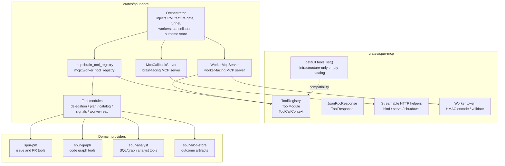
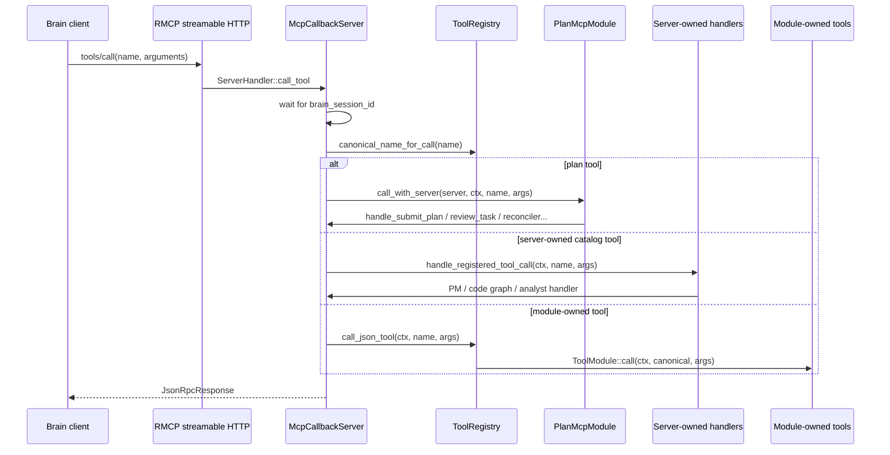
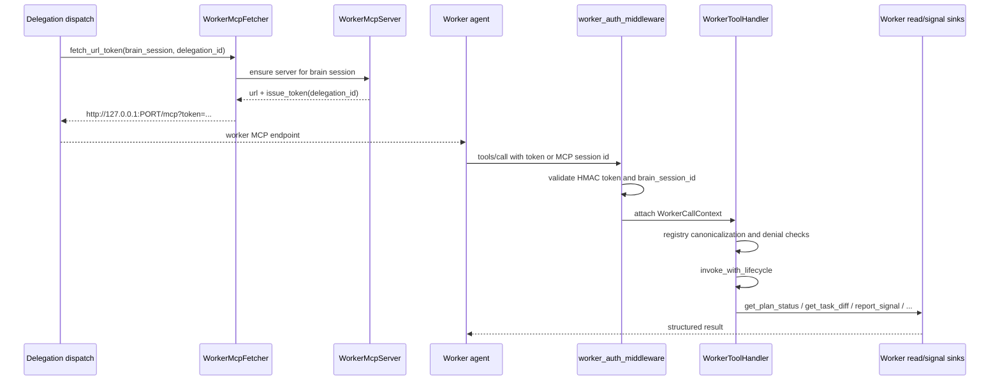
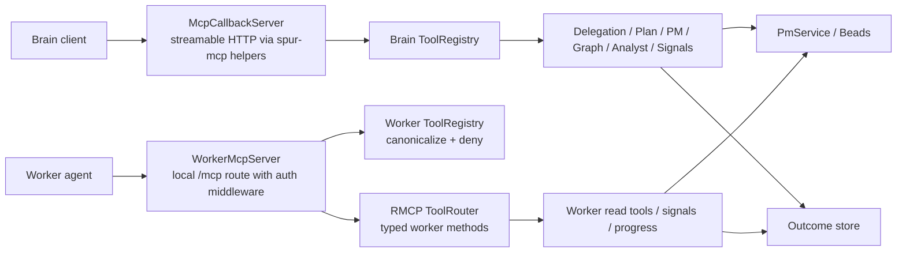

# SPUR MCP Tools Architecture

Status: Current architecture as of merge `293e616d1`

`spur-mcp` is the MCP infrastructure crate. It owns reusable transport,
registry, response, token, schema, and event primitives, but it no longer owns
SPUR domain tools.

`spur-core` owns the SPUR-specific MCP surface: delegation, plan and
reconciler operations, project-management tools, code graph tools, analyst
tools, worker-readable plan/artifact tools, and worker signals.

## Ownership Model

The dependency direction is intentional:

- `spur-core` composes domain tool modules into `spur_mcp::ToolRegistry`.
- `spur-mcp` does not call back into `spur-core`.
- Legacy `spur_mcp::tools_list()` and `worker_tools_list()` are empty
  infrastructure catalogs after the extraction.

## Registry Contract

Every domain-facing module implements `spur_mcp::ToolModule`:

- `tools()` returns `ToolDefinition` values for `tools/list`.
- `call(ctx, name, args)` runs the module-owned handler and returns
  `ToolResponse`.

`ToolRegistry` is a generic dispatcher:

- it rejects duplicate tool names during registration;
- it stores a module index for each tool definition;
- it resolves aliases such as `code_search -> code_symbol_search`;
- it filters or rejects denied worker calls;
- it dispatches by canonical tool name into the owning module.

The registry is deliberately unaware of SPUR semantics. SPUR-specific state
enters through dependency structs such as `DelegationMcpDeps`, `PlanMcpDeps`,
`SignalMcpDeps`, and `WorkerReadMcpDeps`.

## Brain Tool Surface

`spur-core::mcp::brain_tool_registry` composes the brain-facing catalog in this
order:

1. `DelegationMcpModule`
2. `ServerCatalogMcpModule::prelude()`
3. `PlanMcpModule::management(...)`
4. `ServerCatalogMcpModule::remainder()`
5. `PlanMcpModule::remainder(...)`
6. `SignalMcpModule`
7. alias `code_search -> code_symbol_search`

The brain server is `McpCallbackServer`. Its streamable HTTP listener is built
with `spur_mcp::server::bind_streamable_http_server`, but the service instance
is `Arc<McpCallbackServer>`.

Plan tools are special. They are advertised by `PlanMcpModule`, but direct
registry invocation intentionally errors. `McpCallbackServer` rehydrates
`PlanMcpDeps` at call time and invokes `PlanMcpModule::call_with_server` so
plan ownership checks and server state remain live.

Server-owned catalog tools are also advertised through modules but dispatched by
`McpCallbackServer`:

- PM issue and PR tools from `spur-pm`;
- code graph tools from `spur-graph`;
- analyst tools from `spur-analyst`.

Delegation and signal tools are module-owned:

- `delegate_to_worker`, `delegate_parallel`, status, artifact fetch, cancel,
  and worker listing route through `DelegationMcpModule`.
- `report_signal` and `report_progress` route through `SignalMcpModule`.

Construction rule: when the orchestrator mutates server state after
`McpCallbackServer::new` with workers, cancellation control, inline wait, or
feature-backed settings, it rebuilds and installs the brain registry with
`set_tool_registry`. This matters because module dependency structs capture
some values from the server at composition time.

## Worker Tool Surface

Worker MCP is a separate, per-brain-session server. It is not the brain callback
server.

`WorkerMcpFetcher` lazy-starts and caches a `WorkerMcpServer` for each
`BrainSessionId`. For each delegation it mints a one-hour HMAC token containing:

- delegation id;
- brain session id;
- expiry timestamp.

Workers receive the worker MCP URL plus token when `enable_worker_mcp` is
enabled for a delegation.

The worker registry is used for discovery, alias canonicalization, and denied
tool enforcement. Live worker calls are handled by RMCP-generated typed methods
on `WorkerToolHandler`, then wrapped by `invoke_with_lifecycle`, which:

- reconstructs `WorkerCallContext` from authenticated request/session state;
- rejects brain-session mismatches;
- tracks active calls and peak concurrency;
- appends read-audit entries when applicable;
- records per-delegation call latency and error status.

Worker-readable tools include:

- `get_issue` and `list_issues`;
- `get_plan_status` and `get_task_diff`;
- `fetch_outcome_artifact`;
- code graph and analyst read tools;
- `report_signal` and `report_progress`.

Worker-denied tools include brain-only delegation, plan mutation, PM mutation,
and issue-graph mutation tools such as `delegate_to_worker`, `submit_plan`,
`review_task`, `update_issue`, `create_issue`, and `graph_plan`.

## Transport Boundaries

Brain and worker MCP are separate surfaces because they have different trust
models:

- the brain surface exposes orchestration and mutation tools;
- the worker surface exposes scoped read tools and worker reporting tools;
- worker authorization is token-bound to a delegation and brain session;
- worker sessions can reuse `Mcp-Session-Id` only after the middleware has
  associated that session with a token-derived delegation context.

## Practical Extension Points

Add a new brain tool by choosing the right ownership boundary:

- Add it to an existing `ToolModule` when the tool is module-owned.
- Add only its `ToolDefinition` to a catalog module when `McpCallbackServer`
  must dispatch it directly.
- Add worker access separately in `worker_tool_registry` and
  `WorkerToolHandler`; do not assume brain catalog membership grants worker
  access.

When adding worker tools, decide three things explicitly:

- whether the tool is listed in the worker registry;
- whether it is denied by `WORKER_DENIED_TOOL_CALLS`;
- whether the live handler needs authenticated `WorkerCallContext`,
  read-audit recording, or signal/progress plumbing.
