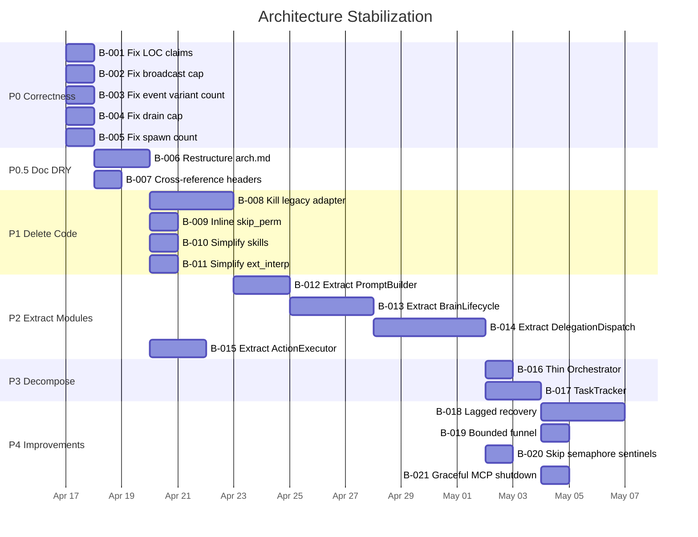

# Architecture Stabilization Backlog

> Generated 2026-04-16. Cross-mapped 4 architecture docs against ground code.
> Guiding principle: **simplicity** — delete before refactor, refactor before add.

## Document Hierarchy (Zoom-Out → Zoom-In)

```
architecture.md              ← Component-level (8 crates, data flow, delegation lifecycle)
├── spur-core-architecture.md    ← Orchestration engine internals
├── architecture-spur-mcp.md     ← MCP server internals
└── tui-architecture.md          ← TUI internals
```

Rule: **no content should appear in more than one document**. The parent doc references child docs; child docs do not duplicate parent content.

---

## 1. Cross-Mapping Audit: Docs vs Ground Code

### 1a. Factual Errors (LOC claims)

| Doc | Claim | Actual | Delta |
|---|---|---|---|
| `architecture.md` | "~280k lines of Rust" | **~32k** | **9x inflated** |
| `architecture.md` | spur-acp "~15k" | 6,380 | 2.4x |
| `architecture.md` | spur-core "~12k" | 6,484 | 1.8x |
| `architecture.md` | spur-mcp "~3k" | 1,514 | 2x |
| `architecture.md` | spur-tui "~18k" | 15,683 | 1.15x |
| `architecture.md` | spur-cli "~4k" | 897 | 4.5x |
| `architecture.md` | spur-pm "~2k" | 511 | 4x |
| `architecture.md` | spur-cost "~2k" | 476 | 4x |
| `architecture.md` | spur-worktree "~1.5k" | 398 | 3.8x |
| `spur-core-architecture.md` | "~12,000 lines" | 6,484 | 1.8x |
| `spur-core-architecture.md` | "~12 tokio::spawn sites" | 7 | 1.7x |
| `architecture-spur-mcp.md` | "~3k lines, 3 files" | 1,514 | 2x |
| `architecture-spur-mcp.md` | server.rs "~700 LOC" | 1,133 | 0.6x (understated) |
| `architecture-spur-mcp.md` | tools.rs "~300 LOC" | 376 | 0.8x |

### 1b. Factual Errors (Technical)

| Doc | Location | Claim | Actual |
|---|---|---|---|
| `architecture.md` | §4 Event Bus diagram | `broadcast::channel(512)` | Code: `broadcast::channel(4096)` |
| `architecture.md` | §4 SpurEventBody | "~25 variants" | Actual: **36 variants** |
| `spur-core-architecture.md` | §4 | "~25 SpurEventBody variants" | 36 |
| `architecture.md` | §4 Subscribers | "≤8 events/frame" | Code: `DRAIN_CAP_PER_FRAME: u32 = 64` |

### 1c. Content Duplication Across Docs

| Content | Appears In | Action |
|---|---|---|
| Delegation lifecycle state machine | `architecture.md` §3, `spur-core-architecture.md` §7 | Keep in parent, remove from child (link instead) |
| Event bus topology + SpurEventBody table | `architecture.md` §4, `spur-core-architecture.md` §4 | Keep detail in child, keep summary in parent |
| Known risks / tech debt tables | `architecture.md` §5, `spur-core-architecture.md` §12, `tui-architecture.md` §9 | Consolidate into `architecture.md` §5 only |
| Channel inventory table | `architecture.md` §2, `spur-core-architecture.md` §10 | Keep in child, reference from parent |

### 1d. Missing Cross-References

| From | Should Link To | Why |
|---|---|---|
| `spur-core-architecture.md` | `architecture.md` | Parent context |
| `tui-architecture.md` | `spur-core-architecture.md` §4 | Event pipeline it depends on |
| `architecture-spur-mcp.md` | `spur-core-architecture.md` §7 | Delegation dispatch it feeds into |
| `architecture.md` §5 Remaining Work | Individual detail docs | Decomposition plans live in detail docs |

---

## 2. Backlog: P0 — Correctness

Items that make docs trustworthy. Do these first.

### B-001: Fix all LOC claims across 4 docs
**Scope**: `architecture.md`, `spur-core-architecture.md`, `architecture-spur-mcp.md`
**Work**: Replace all approximate LOC with actual counts from `wc -l`. Add a `scripts/doc-loc.sh` that regenerates the table so it stays accurate.
**Effort**: S (1h)

### B-002: Fix broadcast capacity in architecture.md §4 diagram
**Scope**: `architecture.md`
**Work**: Change `broadcast::channel(512)` → `broadcast::channel(4096)` in the Event Bus mermaid diagram.
**Effort**: XS (5min)

### B-003: Fix SpurEventBody variant count and table
**Scope**: `architecture.md`, `spur-core-architecture.md`
**Work**: Update "~25" → "36". Reconcile the variant tables with the actual enum. Add the 11 missing variants: `AgentExtNotification`, `AgentSessionReady`, `AuthRequired`, `DelegationDispatched`, `ExecutorSpawned`, `SessionHistory`, `SessionsListed`, `SessionsListError`, `BrainFailover`, `BrainReconnecting`, `BrainReconnected`.
**Effort**: S (30min)

### B-004: Fix drain cap claim in architecture.md §4
**Scope**: `architecture.md`
**Work**: Change "≤8 events/frame" → "≤64 events/frame" in the Subscribers box of the Event Bus diagram.
**Effort**: XS (5min)

### B-005: Fix tokio::spawn count in spur-core-architecture.md
**Scope**: `spur-core-architecture.md`
**Work**: Change "~12" → "7" in §12 Key Metrics.
**Effort**: XS (5min)

---

## 3. Backlog: P0.5 — Doc Structure (DRY)

Eliminate duplication so there's one source of truth per concept.

### B-006: Restructure architecture.md as pure zoom-out
**Scope**: `architecture.md`
**Work**:
- §3 Delegation Lifecycle: keep the state machine diagram, add "See [spur-core-architecture.md §7](spur-core-architecture.md#7-delegation-dispatch) for retry loop invariants and shared-nothing design details."
- §4 Event Bus: keep the topology diagram as summary, move the full SpurEventBody variant table to spur-core-architecture.md §4 only. Add cross-reference.
- §5 Known Risks: consolidate ALL risk items from all 4 docs into this one table. Remove risk tables from child docs; replace with "See [architecture.md §5](architecture.md#5-architectural-assessment)."
**Effort**: M (2h)

### B-007: Add cross-reference headers to child docs
**Scope**: `spur-core-architecture.md`, `architecture-spur-mcp.md`, `tui-architecture.md`
**Work**: Add a "Parent: [architecture.md](architecture.md)" line and relevant sibling links at the top of each child doc.
**Effort**: XS (15min)

---

## 4. Backlog: P1 — Delete Code (Simplicity)

Highest-leverage simplification. Each item removes lines without changing behavior.

### B-008: Emit ExecutorSpawned directly from orchestrator → delete legacy adapter
**Scope**: `spur-core/src/orchestrator.rs`, `spur-core/src/lineage/adapter.rs`
**Work**:
1. In `run_one_worker_attempt`: emit `SpurEventBody::ExecutorSpawned { id, parent_id, session_id, agent, role, task_spec }` alongside existing `WorkerSpawned`.
2. In `create_brain_session` / `load_brain_session`: emit `ExecutorSpawned` for the brain alongside `BrainSpawned`.
3. Verify lineage projection tests pass with both legacy and new events.
4. Remove `adapter.rs` entirely. Remove `apply_legacy` call from `projection.rs::apply()`.
5. Remove `BrainSpawned`/`WorkerSpawned`/`DelegationCompleted` arms from adapter.
**Removes**: ~220 lines of adapter.rs + simplifies projection.rs apply() entry point.
**Risk**: Medium — must verify all lineage tests pass. TDD: add failing test for direct ExecutorSpawned first.
**Effort**: M (4h)

### B-009: Inline skip_perm.rs into a trait extension
**Scope**: `spur-core/src/skip_perm.rs`, `spur-core/src/orchestrator.rs`
**Work**: Replace the two free functions with a 15-line trait extension on `AgentConnection`:
```rust
#[async_trait]
trait AgentConnectionExt {
    async fn new_session_bypassed(&mut self, cfg: &AgentConfig, cwd: PathBuf, mcp: Vec<McpServer>) -> Result<NewSessionResponse>;
}
```
Or simpler: inline the `apply_bypass_session_mode` logic directly at the 3 call sites (it's 10 lines of logic).
**Removes**: ~100 lines → ~15 lines.
**Effort**: S (1h)

### B-010: Replace OnceLock HashMap in skills/mod.rs with match
**Scope**: `spur-core/src/skills/mod.rs`
**Work**: The bundled skills are compile-time `include_str!` constants. Replace the `OnceLock<HashMap>` with a simple `match name { "brain-delegation" => Some(strip_frontmatter(include_str!(...))), ... }`. Eliminates the HashMap allocation and OnceLock synchronization.
**Removes**: ~30 lines of HashMap setup.
**Effort**: XS (30min)

### B-011: Simplify spur_ext_interp.rs — fold into notification_pump or use a dispatch table
**Scope**: `spur-core/src/spur_ext_interp.rs`
**Work**: The `interpret()` function is a 3-arm match on string method names. It's called from exactly one site (the ext_notification consumer task in `run_one_worker_attempt`). Inline it at the call site or convert to a `phf` static dispatch map.
**Removes**: ~50 lines of boilerplate (the file stays but shrinks to ~100 lines with tests).
**Effort**: XS (30min)

---

## 5. Backlog: P2 — Extract Modules (Structural Clarity)

Move code to the right place. Each item makes the orchestrator smaller without changing behavior.

### B-012: Extract PromptBuilder from orchestrator.rs
**Scope**: `spur-core/src/orchestrator.rs` → new `spur-core/src/prompt_builder.rs`
**Work**: Move these methods to a new module:
- `build_brain_prompt`, `build_brain_prompt_v1`, `build_brain_prompt_legacy`
- `render_header`, `render_workers_block`, `append_issue_and_task`
- `log_prompt_once`, `enforce_log_cap`
**Interface**: `pub fn build_prompt(config: &SpurConfig, registry: &AgentRegistry, repo_root: &Path, task: &str, issue: Option<&Issue>, session_id: &SessionId, brain_name: &str) -> String`
**Removes**: ~200 lines from orchestrator.rs.
**Effort**: S (2h)

### B-013: Extract BrainLifecycle from orchestrator.rs
**Scope**: `spur-core/src/orchestrator.rs` → new `spur-core/src/brain_lifecycle.rs`
**Work**: Move these methods:
- `connect_brain`, `create_brain_session`, `spawn_brain_session`
- `load_brain_session`, `try_reconnect_brain`, `reconnect_with_events`
- `retire_active_brain`, `list_sessions_from_disk`, `read_session_history_from_disk`
- `BrainSession` struct, `is_connection_death`, `is_auth_required_error`, `auth_required_banner`
**Interface**: `BrainLifecycle` struct holding `registry`, `config`, `funnel`, `review_sink`, `cost_tracker`, `repo_root`.
**Removes**: ~800 lines from orchestrator.rs.
**Dependency**: B-012 (prompt builder extracted first, since brain session creation calls it).
**Effort**: L (6h)

### B-014: Extract DelegationDispatch from orchestrator.rs
**Scope**: `spur-core/src/orchestrator.rs` → new `spur-core/src/delegation.rs`
**Work**: Move these functions (already mostly free functions):
- `handle_delegations`, `execute_delegation`, `run_one_worker_attempt`
- `finalize`, `DelegationGuard`, `WorkerAttemptCtx`, `WorkerAttemptOutcome`, `AttemptSetupError`
- `apply_worktree_cleanup`, `should_commit_worker_diff`, `should_preserve_worktree`
- `cleanup_cancelled_review`, `build_diff_summary`, `truncate_summary`
- `RetryAttempt`, `render_retry_context`, `apply_bloat_cap`
- `FileTouchDedup`, `FileTouchKey`, `maybe_synthesize_file_touch`
- `build_connection_from_transport`, `cancel_mode_for`, `arm_cancel_deadline`
**Removes**: ~1500 lines from orchestrator.rs.
**Dependency**: B-013 (brain lifecycle extracted first, so delegation doesn't need `&mut self`).
**Effort**: L (8h)

### B-015: Extract ActionExecutor from app.rs (TUI)
**Scope**: `spur-tui/src/app.rs` → new `spur-tui/src/action_executor.rs`
**Work**: The `match action` block in app.rs is ~300 lines of side-effect execution. Extract to a function `execute_action(action: Action, state: &mut AppState, tx: &mpsc::Sender) -> Option<ViewTransition>`.
**Removes**: ~300 lines from app.rs.
**Effort**: S (2h)

---

## 6. Backlog: P3 — Decompose God Objects

After P1 and P2, orchestrator.rs should be ~2000 lines. These items finish the decomposition.

### B-016: Make Orchestrator a thin coordinator
**Scope**: `spur-core/src/orchestrator.rs`
**Depends on**: B-012, B-013, B-014 all complete.
**Work**: After extractions, orchestrator.rs should contain only:
- `Orchestrator::new()` — wiring
- `run_interactive()` — the main select! loop
- `run_adhoc()` — single-shot mode
- `exec_direct()` — direct agent execution
- `emit()` — 1-line helper
- `subscribe()` — 1-line helper
**Target**: ~1500 lines (the interactive loop is inherently complex).
**Effort**: M (included in B-012/B-013/B-014 effort)

### B-017: TaskTracker for JoinHandle management
**Scope**: `spur-core/Cargo.toml`, `spur-core/src/orchestrator.rs` (or `brain_lifecycle.rs` after B-013)
**Work**: Add `tokio-util` dependency. Replace 7 `tokio::spawn` sites with `tracker.spawn()`. Add `tracker.close(); tracker.wait().await` in shutdown path with 5s timeout.
**Removes**: The "fire-and-forget spawn" risk from all architecture docs.
**Effort**: M (3h)

---

## 7. Backlog: P4 — Architectural Improvements

Lower priority. Do after stabilization.

### B-018: Lagged event recovery
**Scope**: `spur-tui/src/app.rs`, `spur-core/src/lineage/`
**Work**: When `broadcast::Receiver` returns `Lagged(n)`, replay from NDJSON event log to rebuild lineage from scratch. Requires: (1) EventSink exposes a `replay(path) -> Vec<SpurEvent>` function, (2) App detects Lagged and calls `lineage = ExecutorLineage::new(); for ev in replay() { lineage.apply(&ev); }`.
**Effort**: L (6h)

### B-019: Bounded funnel mpsc
**Scope**: `spur-core/src/event_funnel.rs`
**Work**: Replace `mpsc::unbounded_channel` with `mpsc::channel(8192)`. Change `FunnelHandle::emit` to use `try_send` with a warn on full. Prevents unbounded memory growth under sustained load.
**Effort**: S (1h)

### B-020: Skip semaphore for __ sentinel agents in handle_delegations
**Scope**: `spur-core/src/orchestrator.rs` (or `delegation.rs` after B-014)
**Work**: In `handle_delegations`, check `agent.starts_with("__")` before `semaphore.acquire()` and bypass. Prevents PM/cancel/cost requests from blocking behind running delegations.
**Effort**: XS (30min)

### B-021: Store Arc<McpCallbackServer> in BrainSession for graceful shutdown
**Scope**: `spur-core/src/orchestrator.rs`, `spur-mcp/src/server.rs`
**Work**: Add `mcp_server: Arc<McpCallbackServer>` to `BrainSession`. On retire, call `mcp_server.shutdown().await` before aborting `mcp_handle`. Enables graceful TaskTracker drain.
**Effort**: S (1h)

---

## 8. Execution Order



---

## 9. Success Metrics

| Metric | Before | After P2 | After P3 |
|---|---|---|---|
| `orchestrator.rs` lines | 4,528 | ~1,500 | ~1,500 |
| `app.rs` lines | 1,702 | ~1,400 | ~1,400 |
| `lineage/adapter.rs` lines | 220 | **0** (deleted) | 0 |
| `skip_perm.rs` lines | 100 | **0** (inlined) | 0 |
| Doc LOC errors | 14 | 0 | 0 |
| Content duplication across docs | 4 instances | 0 | 0 |
| Fire-and-forget spawns | 7 | 7 | **0** (TaskTracker) |
| Source modules in spur-core | 11 | 14 (+prompt_builder, +brain_lifecycle, +delegation) | 14 |
| Max file size in workspace | 4,528 (orchestrator.rs) | ~1,500 | ~1,500 |
