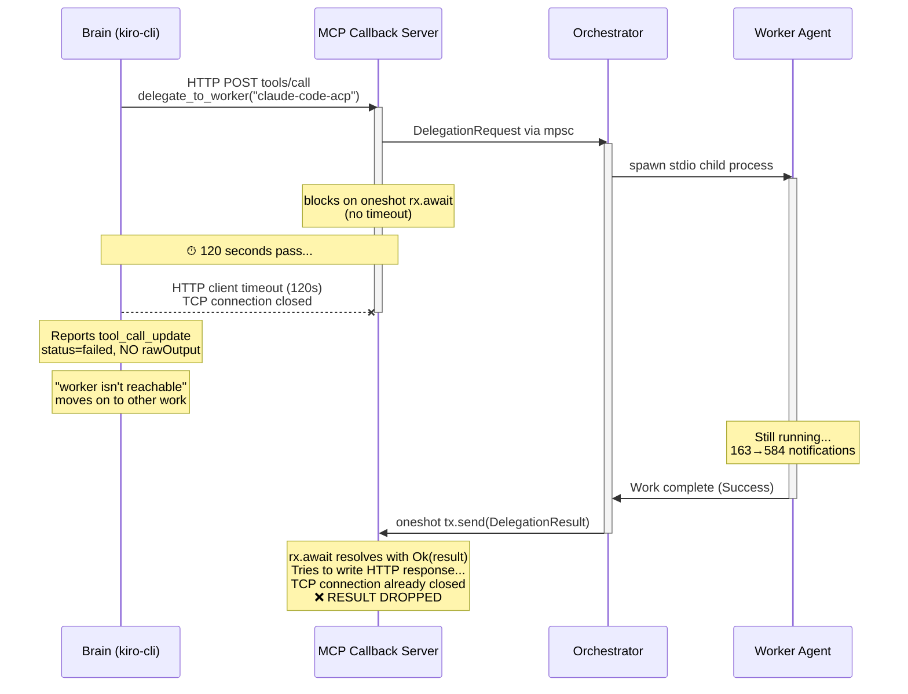
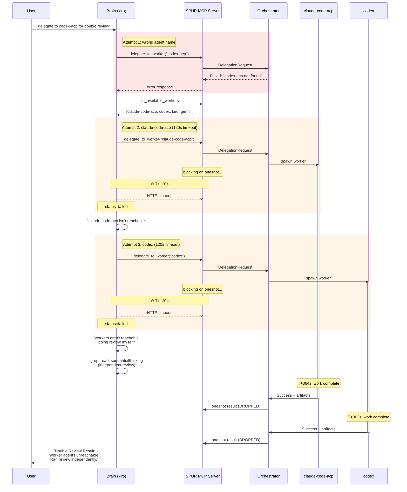
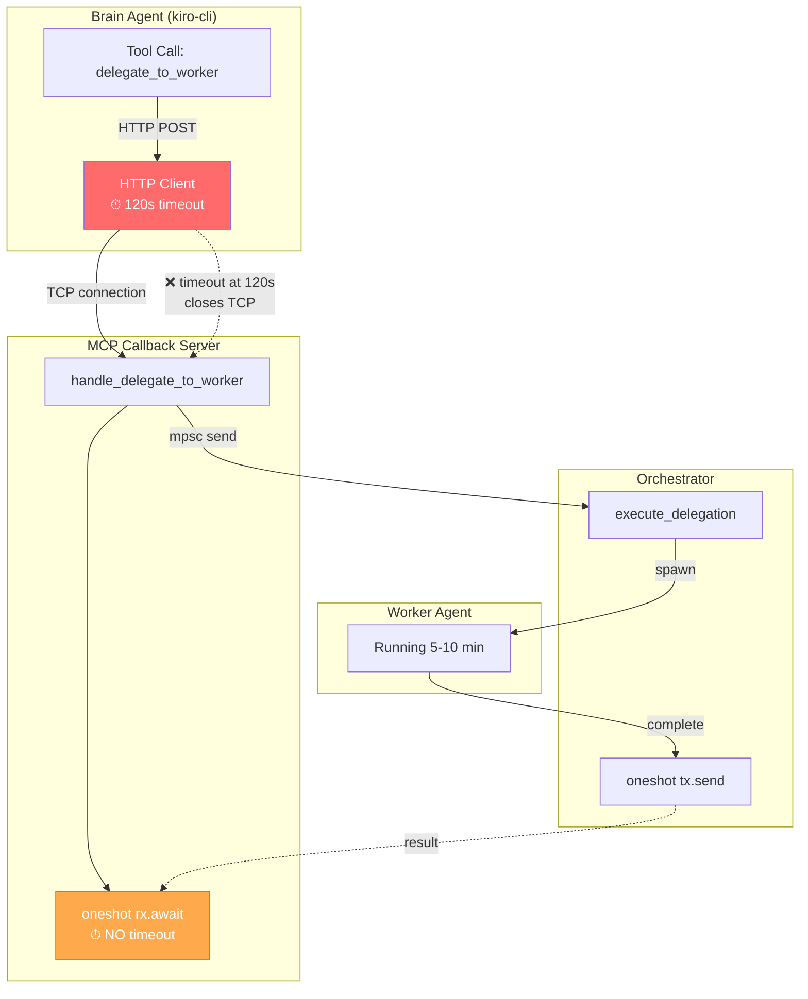
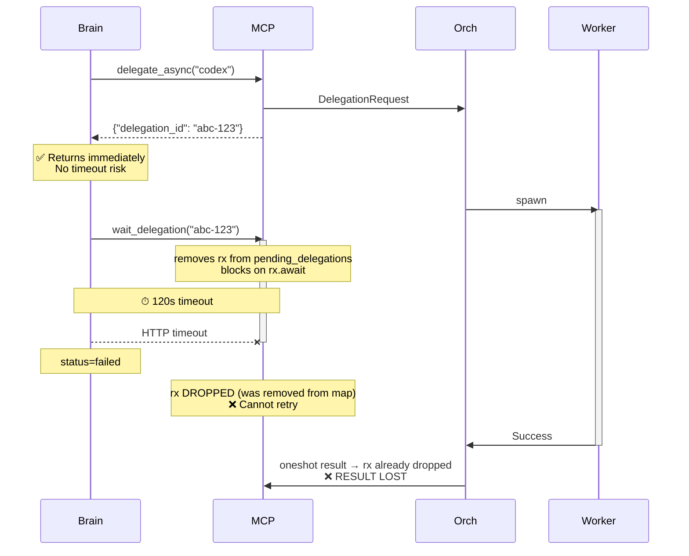
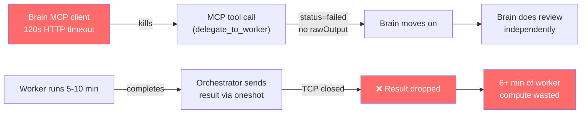
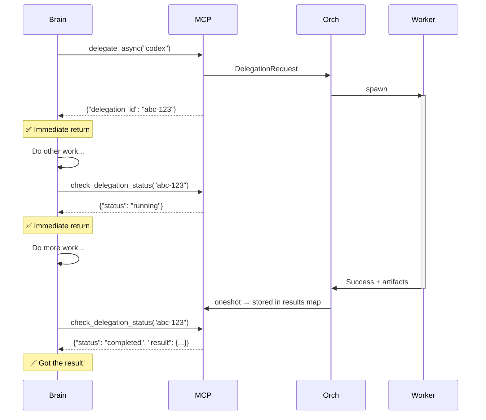
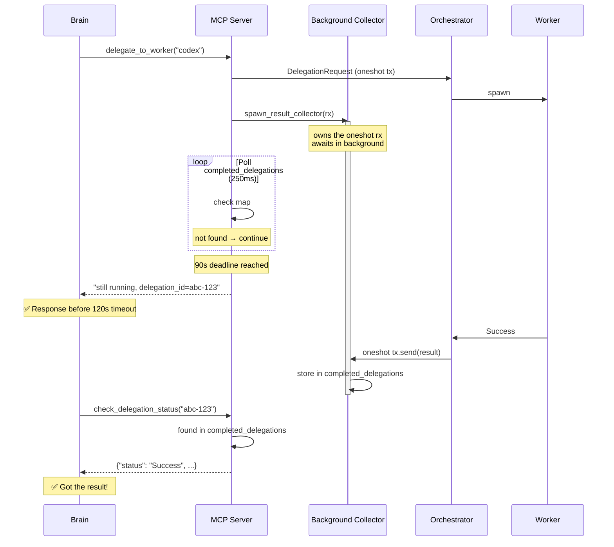

# Root Cause Analysis: Lost Worker Delegation Results (2026-04-16)

## Incident Summary

Brain agent (kiro) delegated review tasks to two workers (claude-code-acp, codex) via SPUR's MCP `delegate_to_worker` tool. Both workers ran successfully and completed with `Success` status. **The brain never received the results.** Both MCP tool calls were killed at exactly 120 seconds by the brain agent's MCP client HTTP timeout, while the workers needed 6+ minutes to complete.

---

## The Smoking Gun: 120-Second Timeout

```
claude-code-acp:
  T+0s     Tool call started (seq=3288)
  T+2s     Worker spawned (seq=3289)
  T+120s   Tool call FAILED — brain MCP client timeout (seq=3454)
  T+364s   Worker completed Success (seq=4276)
           ↑ Result LOST — brain already moved on

codex:
  T+0s     Tool call started (seq=3496)
  T+2s     Worker spawned (seq=3498)
  T+120s   Tool call FAILED — brain MCP client timeout (seq=3945)
  T+302s   Worker completed Success (seq=6412)
           ↑ Result LOST — brain already moved on
```

Both tool calls failed at **exactly 120.0 seconds**. No user messages, no cancellations, no interruptions occurred between start and failure. The brain immediately said: *"The worker agents aren't reachable right now (the ACP transport is down)"* — misinterpreting the timeout as unreachability.

---

## Sequence Diagram: How the Result Gets Lost



---

## Interaction Diagram: Full Incident Timeline



---

## Interaction Diagram: The Blocking Architecture (Current)



---

## Why `wait_delegation` Has the Same Vulnerability



The `wait_delegation` handler removes the oneshot receiver from `pending_delegations` before awaiting it. If the HTTP client times out, the receiver is dropped and the brain cannot retry. **Same result loss as `delegate_to_worker`.**

---

## Evidence from Event Log

Source: `.spur/events/46013-1776320086418-0.ndjson` (6711 events)

### claude-code-acp delegation

| Seq | Time | Event | Detail |
|---|---|---|---|
| 3286 | 13:39:57 | Brain calls `delegate_to_worker` | agent=claude-code-acp |
| 3287 | 13:40:08 | DelegationRequested | orchestrator received |
| 3288 | 13:40:08 | tool_call started | title="@spur-mcp/delegate_to_worker" |
| 3289 | 13:40:10 | WorkerSpawned | claude-code-acp in worktree |
| 3290 | 13:40:10 | DelegationDispatched | executor linked |
| — | — | *163 WorkerNotifications* | worker actively running |
| **3454** | **13:42:08** | **tool_call_update status=failed** | **120.0s — NO rawOutput** |
| 3468 | 13:42:15 | Brain text | *"The claude-code-acp worker isn't reachable"* |
| — | — | *421 more WorkerNotifications* | worker still running |
| 4276 | 13:46:12 | DelegationCompleted | **status=Success** (result lost) |

### codex delegation

| Seq | Time | Event | Detail |
|---|---|---|---|
| 3476 | 13:42:15 | Brain calls `delegate_to_worker` | agent=codex |
| 3495 | 13:42:24 | DelegationRequested | orchestrator received |
| 3496 | 13:42:24 | tool_call started | title="@spur-mcp/delegate_to_worker" |
| 3498 | 13:42:26 | WorkerSpawned | codex in worktree |
| **3945** | **13:44:24** | **tool_call_update status=failed** | **120.0s — NO rawOutput** |
| — | — | *2310 more WorkerNotifications* | worker still running |
| 6412 | 13:47:26 | DelegationCompleted | **status=Success** (result lost) |

---

## Cross-Evaluation: Challenges and Verdicts

| # | Challenge | Verdict |
|---|---|---|
| 1 | Could the MCP server have crashed? | **No.** Brain called other MCP tools (report_progress, grep) successfully after the "failures." Server was alive. |
| 2 | Could a user message have interrupted? | **No.** Zero user messages or cancellation events between tool_call start and failure. |
| 3 | Is 120s a TCP keepalive timeout? | **No.** macOS TCP keepalive is 7200s. The 120.0s precision on both calls points to a hardcoded HTTP client timeout. |
| 4 | Is the timeout in SPUR's code? | **No.** SPUR's MCP server has no timeout on `rx.await`. The timeout is in the brain agent's MCP HTTP client (kiro-cli). |
| 5 | Does `delegate_async` + `wait_delegation` fix it? | **No.** `wait_delegation` also blocks on `rx.await` and is subject to the same 120s timeout. Worse: it removes the rx from the map before awaiting, making retry impossible. |
| 6 | Could the brain have received results later? | **No.** The TCP connection was closed at T+120s. When the oneshot resolves at T+300-364s, the MCP server tries to write to a dead connection. Result is dropped. |

---

## Root Cause



**The MCP `delegate_to_worker` tool is a synchronous blocking call with no timeout awareness.** The brain's MCP client enforces a 120-second HTTP request timeout. Worker execution typically takes 5-10 minutes. The timeout fires before the worker completes, killing the tool call and losing the result.

The `wait_delegation` tool has the same vulnerability, making the `delegate_async` + `wait_delegation` pattern equally broken for long-running workers.

---

## Fix Options (Re-ranked After Cross-Evaluation)

### Fix 1 (Recommended): Non-blocking poll with `check_delegation_status`



New `check_delegation_status` tool returns immediately with current status. No blocking, no timeout risk. Brain stays productive between polls.

**Implementation**: spawn a background task per delegation that awaits the oneshot and stores the result in `Arc<Mutex<HashMap<String, DelegationResult>>>`. The poll tool reads from this map.

| Property | Value |
|---|---|
| Scope | spur-mcp (new tool + background task) |
| Effort | Low-Medium |
| Blast radius | None — additive, no existing API changes |
| Brain prompt change | Use delegate_async → poll loop instead of blocking delegate_to_worker |

### Fix 2: Server-side timeout with graceful fallback

MCP server wraps `rx.await` in `tokio::time::timeout(90s)`. On timeout, returns `{"status": "running", "delegation_id": "..."}` instead of blocking forever. Requires changing oneshot to watch channel so the receiver survives across retries.

| Property | Value |
|---|---|
| Scope | spur-mcp + spur-core (channel type change) |
| Effort | Medium |
| Blast radius | Low — changes internal channel type |

### Fix 3: Upgrade to MCP Streamable HTTP with SSE

MCP server sends SSE progress events during the blocking wait, keeping the brain's HTTP client alive. Best UX but requires rewriting the HTTP handler.

| Property | Value |
|---|---|
| Scope | spur-mcp (major HTTP handler rewrite) |
| Effort | High |
| Blast radius | Medium — changes transport protocol |

### Fix 4: Increase brain's HTTP timeout (Workaround)

Configure the brain agent's MCP client to use a longer timeout (e.g., 30 minutes). Doesn't fix the architectural issue — brain is still blocked and unproductive during the wait.

| Property | Value |
|---|---|
| Scope | Brain agent config (external to SPUR) |
| Effort | Low |
| Blast radius | None |

---

## Corrected Assessment

Previous RCA versions incorrectly attributed failures to:
- ~~Transport mismatch between Kiro CLI and SPUR~~ → The Kiro CLI transport errors were from separate manual attempts, unrelated to the brain's MCP calls
- ~~UX gap (silent blocking)~~ → The brain's tool calls were actively killed by the 120s timeout, not just silent
- ~~`delegate_async` + `wait_delegation` as a fix~~ → `wait_delegation` has the same blocking/timeout vulnerability

The real issue: **a 120-second HTTP client timeout kills 5-minute blocking MCP tool calls, losing completed worker results with no recovery path.**

---

## Implementation: Fix Applied

### Design: Spawn-First-Then-Poll

The core insight: `tokio::time::timeout` and `tokio::select!` both consume the oneshot receiver on timeout, dropping it and losing the result. The fix avoids this by **never holding the oneshot in the HTTP handler** — instead, a background task owns the receiver and writes to a shared results map.



### Changes (2 files, spur-mcp only)

**server.rs:**
- `pending_delegations` → `active_delegations: Arc<Mutex<HashSet<String>>>` + `completed_delegations: Arc<Mutex<HashMap<String, DelegationResult>>>`
- `DELEGATION_BLOCK_TIMEOUT = 90s` constant
- `spawn_result_collector()` — background task that awaits oneshot, stores result
- `handle_delegate_to_worker` — spawns collector, polls completed map with 90s deadline
- `handle_delegate_async` — spawns collector instead of storing raw rx
- `handle_wait_delegation` — polls completed map with 90s deadline (was: blocking rx.await)
- `handle_delegate_parallel` — spawns collectors for all, polls with batch 90s deadline
- `handle_check_delegation_status` — new, instant poll of completed map
- Routing added in `handle_tool_call`

**tools.rs:**
- `check_delegation_status_def()` — new tool definition
- Updated `delegate_to_worker_def` description (mentions 90s fallback)
- Updated `wait_delegation_def` description (mentions 90s fallback)
- Added to `tools_list()`

### Verification
- `cargo build --workspace` — clean
- `cargo clippy -p spur-mcp --no-deps` — zero warnings
- `cargo test -p spur-mcp` — 2/2 pass
- Zero cross-crate changes, zero downstream breakage
