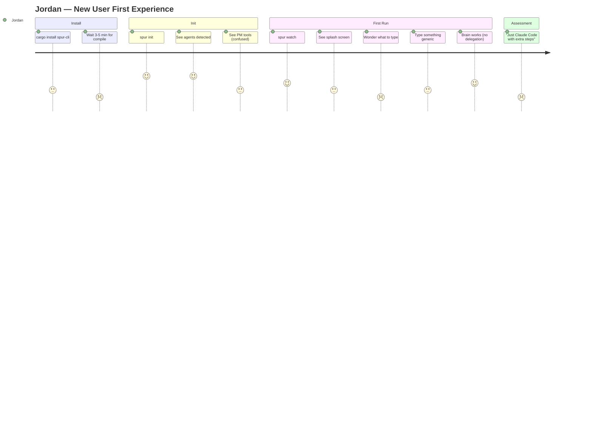
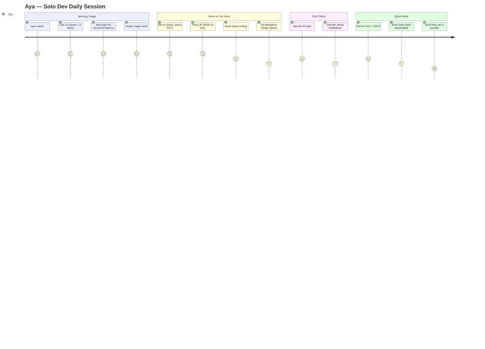
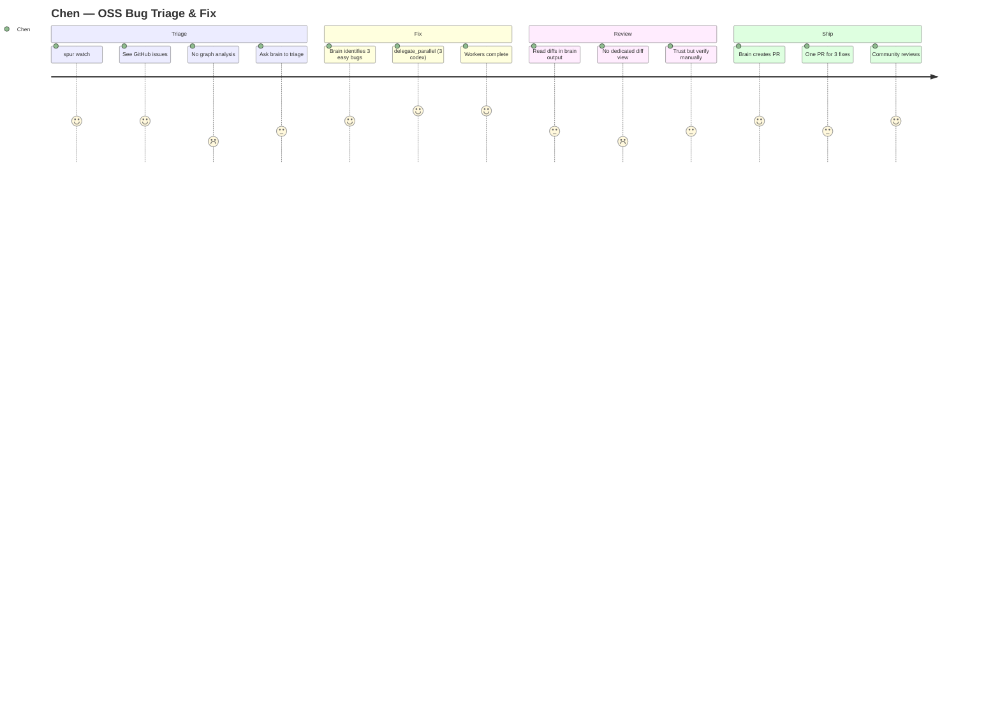
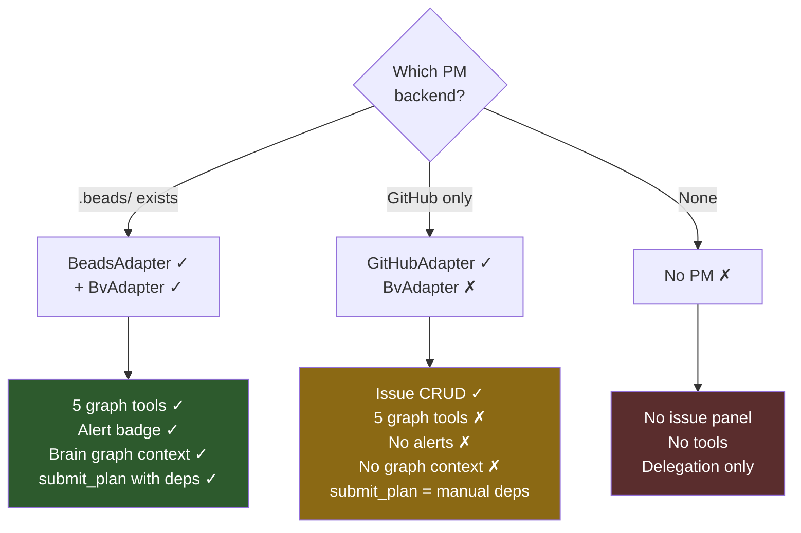

# SPUR Multi-Persona User Journey Review

**Date:** 2026-04-17
**Reviewer:** SPUR Product Owner
**Method:** MCTS + Second-Order Thinking + Sequential Analysis (10 rounds)
**Scope:** End-to-end user journey across 5 customer personas
**Grounded against:** `docs/rca/2026-04-17-tui-beads-collaboration-review.md` (12 findings, all fixed)

---

## Executive Summary

| Persona | Score | Retention Risk | #1 Gap |
|---------|-------|----------------|--------|
| P5: New User (Jordan) | 6.0/10 | First 5 min | No task example, no delegation demo |
| P1: Solo Dev (Aya) | 7.5/10 | Week 2 | Single-agent ceiling, no delegation value |
| P2: Tech Lead (Marcus) | 6.5/10 | First complex task | Zero graph intelligence for GitHub |
| P3: Platform Eng (Priya) | 7.0/10 | First failed campaign | No plan amendment, TUI plan opacity |
| P4: OSS Maintainer (Chen) | 6.5/10 | First bad PR | Zero graph intelligence, review trust |

**19 findings** across 5 tiers:

| Tier | Count | Description |
|------|-------|-------------|
| STRATEGIC | 1 | Architectural gap requiring multi-sprint investment |
| FIX NOW | 4 | High score, low effort — immediate UX wins |
| FIX SOON | 4 | Medium score — next sprint |
| BACKLOG | 8 | Lower priority or higher effort |
| WONTFIX | 2 | Acceptable tradeoffs |

---

## 1. Persona Definitions

### P5: Jordan — New User / Evaluator

```
 Role:     Mid-level developer, first time trying SPUR
 Repo:     Personal project, no issues configured
 Agents:   Just installed claude-code (single)
 PM:       None (no beads, no GitHub issues)
 Budget:   Very high sensitivity (evaluating)
 Goal:     "Does this tool justify learning it?"
 Anxiety:  "I have no idea what I'm doing"
```

### P1: Aya — Solo Indie Developer

```
 Role:     Solo founder, SaaS product
 Repo:     1 repo, ~50 beads issues
 Agents:   claude-code only
 PM:       Beads + bv (full graph analysis)
 Budget:   High sensitivity ($0.50-5/session)
 Goal:     "Multiply myself — delegate the boring work"
 Anxiety:  "Am I burning money on bad delegations?"
```

### P2: Marcus — Tech Lead at Startup

```
 Role:     5-person team, manages via GitHub issues
 Repo:     GitHub, 200+ issues, "spur-managed" labels
 Agents:   claude-code (brain) + codex + gemini (workers)
 PM:       GitHub only (no beads)
 Budget:   Medium ($100-500/mo)
 Goal:     "Triage backlog, assign to AI workers, review output"
 Anxiety:  "Will SPUR mess up our codebase?"
```

### P3: Priya — Platform Engineer

```
 Role:     Infra team, 500+ microservices
 Repo:     Beads for internal tracking, 50+ issues
 Agents:   Full fleet — claude-code, kiro, codex, gemini
 PM:       Beads + bv (graph analysis critical)
 Budget:   Low sensitivity (company pays)
 Goal:     "Automate cross-service refactoring campaigns"
 Anxiety:  "Does the plan respect dependency ordering?"
```

### P4: Chen — Open-Source Maintainer

```
 Role:     Popular OSS library, 500+ GitHub issues
 Repo:     GitHub, community contributors
 Agents:   claude-code + codex
 PM:       GitHub only
 Budget:   High sensitivity (personal budget)
 Goal:     "Triage community issues, auto-fix easy bugs"
 Anxiety:  "Will SPUR produce PRs my contributors accept?"
```

---

## 2. Journey Maps

### P5: Jordan's First 10 Minutes



**Drop-off cliff:** The splash screen → first prompt transition. Jordan has no example and no guidance. The brain likely does everything itself (no delegation) because the task is simple. SPUR's value is invisible.

### P1: Aya's Daily Workflow



**Ceiling hit:** Aya maxes out at single-agent throughput. She wants parallel execution but has no second agent. No nudge to install one.

### P2: Marcus's Issue-Driven Run

```mermaid
journey
    title Marcus — Tech Lead Issue Processing
    section Launch
      spur run --issue #42: 5: Marcus
      Issue fetched from GitHub: 5: Marcus
    section Analysis
      Brain reads issue: 4: Marcus
      Brain tries graph_triage: 1: Marcus
      Error: bv unavailable: 2: Marcus
      Brain falls back to manual: 3: Marcus
    section Delegation
      Brain delegates to codex: 5: Marcus
      Worker runs in worktree: 5: Marcus
      Worker completes: 5: Marcus
    section Result
      Brain reports success: 4: Marcus
      No PR URL in output: 3: Marcus
      Manual git push needed: 2: Marcus
```

**Trust break:** The graph_triage error breaks flow. The brain recovers, but Marcus wonders what he's missing. Without dependency analysis, the brain might delegate tasks that conflict.

### P3: Priya's Refactoring Campaign

```mermaid
journey
    title Priya — 30-Task Refactoring Campaign
    section Plan
      Graph triage (50 issues): 5: Priya
      Graph plan (5 tracks): 5: Priya
      submit_plan (30 tasks): 5: Priya
    section Execute
      Track 1: 3 tasks parallel: 5: Priya
      Track 2: unblocked, running: 5: Priya
      Task #8 fails: 2: Priya
      22 tasks blocked: 1: Priya
    section Recovery
      Brain retries manually: 3: Priya
      Can't amend existing plan: 2: Priya
      Submit new plan for rest: 3: Priya
      Eventually completes: 4: Priya
    section Summary
      No campaign report: 3: Priya
      Count results manually: 2: Priya
```

**Frustration peak:** When task #8 fails and cascades to 22 blocked tasks. Priya has to manually reconstruct the remaining plan. This is the moment she considers writing a bash script instead.

### P4: Chen's Community Triage



**Trust gap:** Chen needs to verify worker output before publishing to the community. The review experience is text-heavy — no structured diff view. One bad PR could damage their reputation.

---

## 3. Cross-Persona Gap Analysis

### The GitHub Intelligence Gap

```
                    Beads Users              GitHub Users
                    (P1, P3)                 (P2, P4, P5)
                    ~20% of market           ~70% of market
                    ──────────────           ──────────────
 Graph Triage       ✓ PageRank recs          ✗ UNAVAILABLE
 Graph Plan         ✓ Dep-aware tracks       ✗ UNAVAILABLE
 Graph Insights     ✓ Bottleneck analysis    ✗ UNAVAILABLE
 Graph Alerts       ✓ Staleness/cascades     ✗ UNAVAILABLE
 submit_plan        ✓ Rich dep graph         ✗ Manual deps only
 Alert Badge        ✓ TUI status bar         ✗ No alerts
 Startup Summary    ✓ Brain gets context     ✗ No context
                    ──────────────           ──────────────
 Net experience     Full product             Delegation-only
```

**Second-order impact:** The features that MOST differentiate SPUR from Claude Code / Cursor are unavailable to the largest user segment. GitHub users get "Claude Code with delegation" — valuable but not differentiated enough to justify the learning curve.

### The Delegation Visibility Matrix

```
                    Who sees delegation?
                    ─────────────────────────────────
 P5 (Jordan)        Unlikely — simple first task
 P1 (Aya)           Never — single agent
 P2 (Marcus)        Yes — multi-agent, ad-hoc
 P3 (Priya)         Yes — multi-agent, plan-based
 P4 (Chen)          Sometimes — depends on task complexity
                    ─────────────────────────────────
 Net:               2 of 5 personas reliably see delegation
```

### The Cost Visibility Gap

```
 What users see:                    What users WANT to see:
 ──────────────                     ─────────────────────────
 Status bar: $0.45                  Per-executor cost breakdown
                                    Brain: $0.12 (thinking)
                                    Worker-1: $0.18 (codex)
                                    Worker-2: $0.15 (codex)
                                    ──────────────────
                                    Total: $0.45
                                    Forecast: ~$0.60 at completion
```

---

## 4. Finding Details

### UX-3: Splash Screen Has No Task Example (HIGH — Score 100)

**Affects:** P5 (all new users)
**Current:**
```
┌──────────────────────────────────────────────────────────────────┐
│                            SPUR                                  │
│                  Multi-agent orchestrator                         │
│                                                                  │
│                 Type a task below to start                        │
│                 Press [s] to browse sessions                     │
├──────────────────────────────────────────────────────────────────┤
│ > _                                                              │
└──────────────────────────────────────────────────────────────────┘
```

**Proposed:**
```
┌──────────────────────────────────────────────────────────────────┐
│                            SPUR                                  │
│             Issue in, pull request out.                           │
│                                                                  │
│            Type a task below to start, e.g.:                     │
│  "add a health check endpoint with tests"                        │
│  "fix the auth bug in issue #42"                                 │
│  "triage open issues and fix the quick wins"                     │
│                                                                  │
│            Press [s] to browse sessions                          │
├──────────────────────────────────────────────────────────────────┤
│ > _                                                              │
└──────────────────────────────────────────────────────────────────┘
```

**Second-order value:** The example tasks are designed to trigger different workflows:
- "add ... with tests" → likely triggers delegation (brain codes, worker tests)
- "fix ... issue #42" → demonstrates issue integration
- "triage and fix quick wins" → demonstrates graph intelligence (if available)

---

### UX-9: No Graph Intelligence for GitHub Users (CRITICAL — Strategic)

**Affects:** P2, P4, P5 (~70% of market)



**Potential solutions (not this PR — strategic roadmap):**

| Approach | Effort | Value | Feasibility |
|----------|--------|-------|-------------|
| GitHub → beads sync | Medium | High | Import GH issues into .beads/, run bv on them |
| Native graph engine in Rust | High | Highest | Build PageRank/betweenness in spur-pm, no bv needed |
| GitHub API dependency parsing | Low | Medium | Parse "blocked by #X" in issue bodies, build lightweight dep graph |
| Label-based pseudo-tracks | Low | Low | Group by label for plan ordering |

---

### UX-1: PM Tools Section Lacks Context (MEDIUM — Score 60)

**Affects:** P5

**Current:** `✗ br                install: cargo install --git ...`
**Proposed:**
> Note (2026-05): SPUR no longer requires the bv binary; graph analysis is now in-process via crates/spur-pm/src/graph_engine.

```
[spur] Checking PM tools (optional — SPUR works without these)...

  ✗ br (beads)         Local issue tracker. Install: cargo install --git ...
  ✗ bv (beads_viewer)  Graph analysis for issues. Install: brew install dicklesworthstone/tap/bv
```

---

### UX-17: Brain Gets Hard Error from Graph Tools (MEDIUM — Score 48)

**Affects:** P2, P4

**Current behavior:** Brain calls `graph_triage()` → gets MCP error: "Graph analysis not available. Install bv."

**Proposed:** Add to brain prompt when bv is unavailable:
```
Note: Graph analysis tools (graph_triage, graph_plan, graph_insights,
graph_alerts, graph_subgraph) are not available in this session. Use
list_issues for issue data. For dependency-aware planning, ask the user
about issue dependencies or infer from issue descriptions.
```

This prevents the brain from calling tools that will fail, saving a round-trip and avoiding confusing error messages in the brain's output.

---

### UX-6: Single-Agent Users Get No Delegation Nudge (MEDIUM — Score 36)

**Affects:** P1, P5

**Proposed TUI behavior:** When only one agent is registered and the brain completes a task that took >2 minutes, show an activity log entry:

```
[spur] Tip: Add a second agent to run tasks in parallel.
       Install codex: npx @zed-industries/codex-acp
       Then re-run: spur init --force
```

This is shown ONCE per session (not spammy).

**Proposed wireframe:**
```
├─ Activity ──────────────────────────────────────────────────────────┤
│  11:05:16 [brain] Task completed in 4m 12s ($0.45)                 │
│  11:05:16 [spur]  Tip: Add a second agent to run tasks in parallel │
│           Install codex: npx @zed-industries/codex-acp             │
│           Then re-run: spur init --force                           │
├──────────────────────────────────────────────────────────────────────┤
```

---

### UX-13: No Plan Progress in TUI (MEDIUM — Score 18)

**Affects:** P3

**Current:** Individual delegation events only. No plan-level indicator.

**Proposed wireframe — status bar with plan progress:**
```
┌──────────────────────────────────────────────────────────────────────┐
│ [i]nput [r]eview [?]help                                             │
│              Plan: 12/30 · 12 issues · 2 alerts · 3 running · $4.50 │
└──────────────────────────────────────────────────────────────────────┘
```

When a plan is active, the status bar shows `Plan: X/Y` before the other metrics. This requires a new `PlanProgress` event from the plan executor.

---

### UX-11: No PR URL in `spur run` Output (MEDIUM — Score 24)

**Affects:** P2

**Current:** `Run complete. Session: abc-123. Duration: 3m20s. Cost: $0.35`
**Proposed:** `Run complete. Session: abc-123. Duration: 3m20s. Cost: $0.35. PR: https://github.com/org/repo/pull/42`

---

### UX-14: No Plan Amendment / Task Retry (MEDIUM — Score 12)

**Affects:** P3

**Current:** When a plan task fails, downstream tasks are permanently blocked. Brain must create a new plan for remaining work.

**Proposed (future sprint):** Add `retry_plan_task(plan_id, task_id)` tool:
- Resets the task status to Pending
- Re-computes the ready set
- Dispatches the retried task
- Unblocks downstream tasks on success

---

## 5. Persona Satisfaction Heatmap

```
                 Install  Init  First   Daily  Graph  Deleg.  Plan  Cost  Review
                                Run     Use    Intel  Value   Exec  Vis   Trust
─────────────────────────────────────────────────────────────────────────────────
P5 Jordan         ██░░░  ███░░  █░░░░   ░░░░░  ░░░░░  ░░░░░  ░░░░░  ░░░░░  ░░░░░
P1 Aya            █████  █████  ████░   ████░  █████  █░░░░  ██░░░  ██░░░  ███░░
P2 Marcus         █████  ████░  ████░   ███░░  ░░░░░  ████░  ███░░  ███░░  ██░░░
P3 Priya          █████  █████  █████   ████░  █████  █████  ███░░  ███░░  ████░
P4 Chen           █████  ████░  ███░░   ███░░  ░░░░░  ████░  ███░░  ███░░  ██░░░

Legend: █ = satisfied  ░ = gap/missing
```

---

## 6. Prioritized Product Roadmap

### Tier 1: FIX NOW (This sprint — low effort, high impact)

| # | Finding | Effort | Persona | Change |
|---|---------|--------|---------|--------|
| UX-3 | Splash screen example tasks | 1h | P5 | `dashboard.rs` splash text |
| UX-1 | PM tools explanation in init | 30m | P5 | `main.rs` println! |
| UX-2 | "Issue in, PR out" tagline | 15m | P5 | `main.rs` println! |
| UX-17 | Graph-unavailable note in brain prompt | 1h | P2,P4 | `orchestrator.rs` build_brain_prompt |

### Tier 2: FIX SOON (Next sprint)

| # | Finding | Effort | Persona | Change |
|---|---------|--------|---------|--------|
| UX-5 | Better first-run task suggestion | 2h | P5 | init next-steps + splash |
| UX-6 | Single-agent delegation nudge | 2h | P1,P5 | orchestrator event |
| UX-11 | PR URL in spur run output | 1h | P2 | RunResult plumbing |
| UX-7 | Per-executor cost in TUI | 4h | P1,P4 | lineage tree render |

### Tier 3: STRATEGIC (Multi-sprint roadmap)

| # | Finding | Effort | Persona | Approach |
|---|---------|--------|---------|----------|
| UX-9 | GitHub graph intelligence | 2-4 sprints | P2,P4,P5 | GitHub→beads sync OR native graph engine |

### Tier 4: BACKLOG

| # | Finding | Persona | Notes |
|---|---------|---------|-------|
| UX-13 | Plan progress in TUI | P3 | Needs PlanProgress event |
| UX-14 | Plan amendment | P3 | retry_plan_task tool |
| UX-12 | Batch get_issue | P3 | Brain can workaround |
| UX-4 | Status bar tooltips | P5 | Cosmetic |
| UX-10 | Review in run mode | P2 | Architectural |
| UX-15 | Campaign summary | P3 | Nice-to-have |
| UX-18 | Diff view in TUI | P4 | Significant UI work |

### WONTFIX

| # | Finding | Rationale |
|---|---------|-----------|
| UX-8 | submit_plan with 1 agent | Works correctly, just sequential — acceptable |
| UX-19 | One-PR default | Brain can be instructed to create multiple PRs |

---

## 7. Key Second-Order Insights

### Insight 1: The "70% Problem"

The most differentiated features (graph intelligence, plan-based delegation with deps) are only available to ~20% of users (beads users). The 70% on GitHub get a meaningfully weaker product. **This is the single most important strategic gap.** Every other finding is tactical; this one is existential for market fit.

### Insight 2: The "Invisible Value" Problem

Delegation — SPUR's core differentiator — is invisible to 3 of 5 personas on their first session. If users don't SEE delegation in action, they evaluate SPUR as "Claude Code with a TUI wrapper" and churn. The first-run experience must be engineered to demonstrate delegation.

### Insight 3: The "Trust Gradient"

Trust requirements vary dramatically by persona:
- P3 (Priya, internal): Low bar — company code, can revert
- P1 (Aya, solo): Medium bar — her own code, she reviews
- P2 (Marcus, team): High bar — team codebase, affects colleagues
- P4 (Chen, OSS): Highest bar — public code, community reputation

The review gate exists but doesn't scale its UX to the trust level needed. High-trust personas need structured diff review, not brain text summaries.

### Insight 4: The "Plan Recovery" Problem

For power users (P3), plan failure recovery is the make-or-break moment. A 30-task plan where task #8 fails and cascades to 22 blocked tasks feels like losing 73% of your work. The emotional response is disproportionate to the actual cost (the completed tasks' work is saved). Plan amendment would transform this from "catastrophic failure" to "minor setback."
