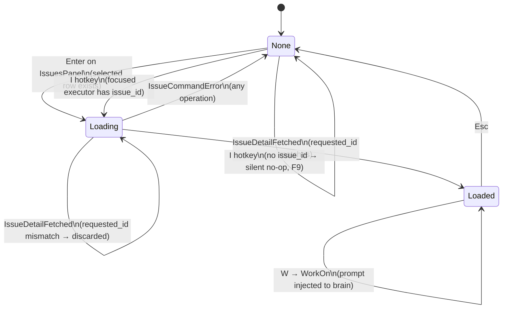
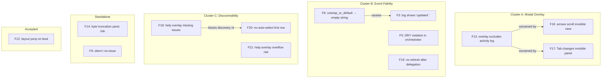
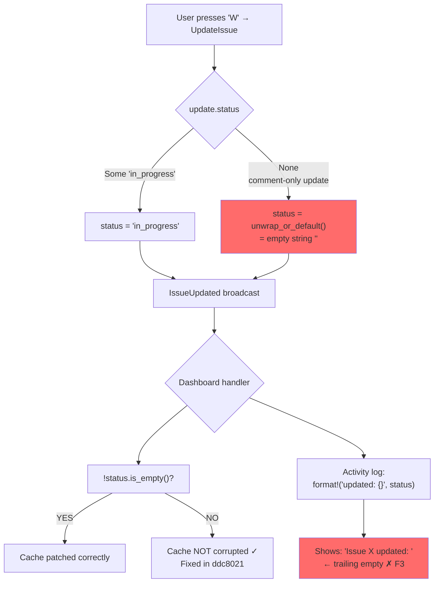
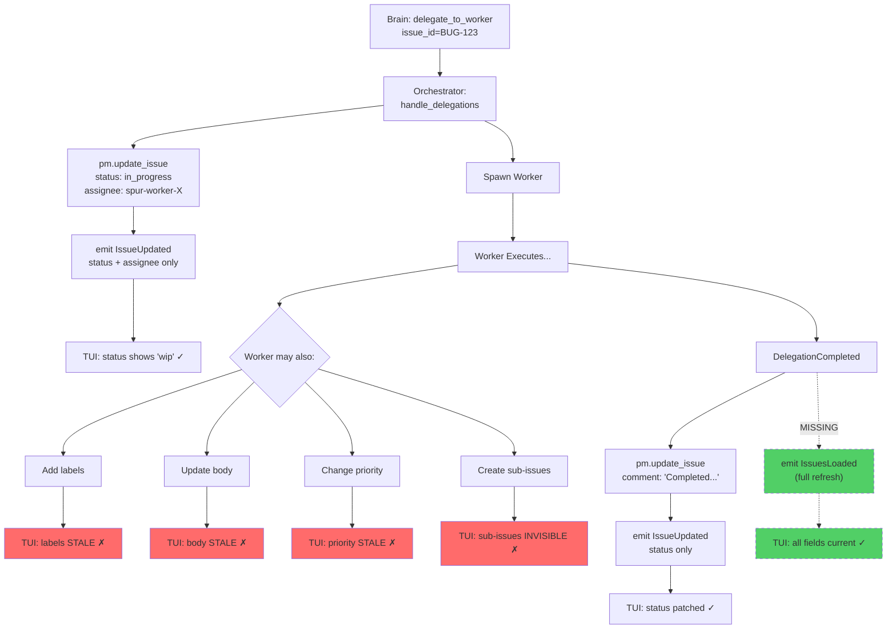

# TUI-Beads Collaboration: L9 Staff Review

**Date:** 2026-04-17
**Reviewer:** L9 Rust Staff Engineer
**Method:** MCTS + First-Principles + Diagram-Driven Re-evaluation (15 rounds)
**Scope:** `spur-tui`, `spur-core/orchestrator`, `spur-acp/events`, `spur-pm`
**Status:** All 10 actionable findings FIXED and VERIFIED (2026-04-17)

---

## Post-Fix Verification (2026-04-17)

| # | Finding | Status | Verified Against |
|---|---------|--------|------------------|
| F3 | Empty status in log | FIXED (merged into F6) | `dashboard.rs` — conditional `status_suffix` format |
| F5 | DRY violation | FIXED | `orchestrator.rs:158` — `to_summary_event()` helper, 2 callsites |
| F6 | unwrap_or_default → "" | FIXED | `events.rs` `Option<String>`, `orchestrator.rs` `.clone()` |
| F9 | Silent I no-issue | FIXED | `dashboard.rs` — `else` branch with activity log push |
| F12 | Layout jump | ACCEPTED | No fix needed — one-time tradeoff |
| F13 | Overlay occludes log | DEFERRED (v2) | Split-pane design documented for future |
| F14 | Byte truncation | FIXED | `dashboard.rs:92` — `chars().take(8).collect()` |
| F16 | Arrows scroll invisible | FIXED | `dashboard.rs` — 3-way if/else, `Loaded` first |
| F17 | Tab behind overlay | FIXED | `dashboard.rs` — `if matches!(issue_focus, None)` guard |
| F18 | Help missing issues | FIXED | `help_overlay.rs` — `issues_enabled` param + 2 sections + 2 tests |
| F19 | No refresh after delegation | FIXED | `orchestrator.rs` — `list_issues` + `IssuesLoaded` post-delegation |
| F20 | No auto-select first row | FIXED | `issues_panel.rs` — `select_first()` + called in `IssuesLoaded` handler |
| F21 | Help overflow risk | FIXED | `help_overlay.rs` — conditional `if issues_enabled` guard |

**Build:** zero warnings. **Tests:** all pass (62 test suites across 8 crates).

**Implementation note (F16):** The arrow key guard uses `matches!(IssueFocus::Loaded)` rather
than `!matches!(IssueFocus::None)`. This means during the transient `Loading` state (~1-2s),
arrows still scroll hidden views. Accepted: Loading is too brief for meaningful user interaction,
and routing arrows to `issue_detail_pane` during Loading would pre-scroll content before it renders.

---

## Executive Summary

| Dimension         | Grade | Post-Fix | Notes                                  |
|-------------------|-------|----------|----------------------------------------|
| Architecture      | B+    | B+       | Clean pipeline, proper layer separation|
| State Machine     | A-    | A-       | IssueFocus correct with race guards    |
| User Journey      | C+    | B        | Help overlay + auto-select added       |
| Code Quality      | B     | B+       | DRY fixed, Option<String> type-safe    |
| Robustness        | B+    | A-       | Panic risk eliminated, modal guards    |
| **Overall**       | **B** | **B+**   | All actionable findings addressed      |

**12 findings** clustered into **3 fix batches** + 2 standalone + 1 design item:

| Cluster                 | Findings         | Root Cause                          |
|-------------------------|------------------|-------------------------------------|
| A: Modal Overlay        | F16, F17         | Keys don't respect IssueFocus mode  |
| B: Event Fidelity       | F6(+F3), F5, F19 | Orchestrator event emission imprecise|
| C: Discoverability      | F18, F20, F21    | Feature not documented in UI        |
| Standalone              | F14, F9          | Minor robustness + UX               |
| Design (v2)             | F13              | Architectural: overlay occludes log |
| Accepted Tradeoff       | F12              | One-time layout jump on boot        |

---

## 1. Master Architecture

### 1.1 Full Upstream/Downstream Sequence

```mermaid
sequenceDiagram
    participant U as User (TUI)
    participant D as DashboardView
    participant A as App
    participant O as Orchestrator
    participant PM as PmService<br>(BeadsAdapter)
    participant B as Brain Agent
    participant W as Worker

    Note over U,PM: ── Phase 1: Discovery ──
    O->>PM: list_issues(status:"open", limit:50)
    PM-->>O: Vec&lt;IssueSummary&gt;
    O->>D: broadcast IssuesLoaded { Vec&lt;IssueSummaryEvent&gt; }
    D->>D: tracked_issues populated + sorted by priority
    Note over D: Layout jump: issues panel slot appears (F12)

    Note over U,PM: ── Phase 2: Browse ──
    U->>D: Tab → cycle to Panel::Issues
    D->>D: focused_panel = Issues, border cyan
    U->>D: j/k → navigate rows
    D->>D: issues_panel.select_next/prev()

    Note over U,PM: ── Phase 3: View Detail ──
    U->>D: Enter on selected issue
    D->>D: issue_focus = Loading { id }
    D->>A: Action::Issue(ViewDetail { id })
    A->>O: mpsc UserInput::GetIssueDetail { id }
    O->>PM: get_issue(&id)
    PM-->>O: Issue (full detail)
    O->>D: broadcast IssueDetailFetched { requested_id, issue }
    D->>D: issue_focus = Loaded { id, Box&lt;Issue&gt; }
    Note over D: Activity log hidden behind overlay (F13)

    Note over U,PM: ── Phase 4: Work On ──
    U->>D: W key
    D->>A: Action::Issue(WorkOn { id })
    A->>A: Construct prompt with issue metadata
    A->>O: mpsc UserInput::Message { blocks }
    O->>B: Forward to brain session

    Note over U,B: ── Phase 5: Delegation ──
    B->>O: MCP delegate_to_worker(issue_id=id)
    O->>PM: update_issue(id, status:"in_progress", assignee:"spur-worker-X")
    O->>D: broadcast IssueUpdated { status:"in_progress" }
    D->>D: patch tracked_issues[id].status + issue_focus.issue.status
    O->>O: spawn worker, emit DelegationRequested { issue_id }
    Note over O: ExecutorNode.issue_id set in lineage

    Note over W: Worker executes task...

    Note over U,B: ── Phase 6: Completion ──
    W-->>O: DelegationCompleted
    O->>PM: update_issue(id, comment:"Completed by SPUR...")
    O->>D: broadcast IssueUpdated { status }
    Note over D: No full IssuesLoaded refresh (F19)
    Note over D: Worker label/body changes invisible until manual refresh
```

### 1.2 IssueFocus State Machine



### 1.3 Finding Interaction Graph



---

## 2. Per-Finding Analysis

### F18 — Help Overlay Missing All Issue Hotkeys (HIGH)

**Cluster:** C (Discoverability)
**Score:** 100 (Impact:4 x Prob:5 x Effort:5)
**Location:** `crates/spur-tui/src/components/help_overlay.rs` (entire file)

#### User Discovery Flow

```
User launches SPUR TUI
       │
       ▼
"How do I work with issues?"
       │
       ├─── Press ? ──────► Help Overlay
       │                    ✗ NO ISSUE HOTKEYS
       │                    DEAD END
       │
       ├─── Random keys ──► Might hit Tab → Issues
       │                    Then see hint title:
       │                    "j/k select · Enter detail · Work"
       │                    PARTIAL WIN (focus-only)
       │
       └─── External docs ► Unknown if they exist
                            DEAD END
```

**First-Principles Analysis:** A feature that cannot be discovered by the standard
in-app help mechanism (`?`) effectively does not exist for new users. 2 of 3 discovery
paths are dead ends.

#### Proposed Help Section

```
 Dashboard — Issues
  Tab            Cycle to Issues panel
  j / k          Navigate issue list
  Enter          View issue detail
  W              Work on issue (assign brain)
  /issues        Refresh issue list
  /work <id>     Work on issue by ID

 Issue Detail (overlay)
  j / k          Scroll body
  o              Set status: open
  w              Set status: in progress
  b              Set status: blocked
  d              Set status: closed
  W              Work on this issue
  Esc            Close overlay
```

**Implementation note:** Current help is ~35 lines; this adds ~16. On a 40-row
terminal, the overlay cap is 36 rows. Use the existing `mermaid_enabled` pattern:
add `issues_enabled: bool` parameter to `HelpOverlay::lines()`, show section only
when issues are loaded.

**Fix:** `help_overlay.rs` — add `issues_enabled` param + 2 new `header()` sections.

---

### F6 — `unwrap_or_default()` Emits Empty String Status (MEDIUM)

**Cluster:** B (Event Fidelity)
**Score:** 60 (Impact:3 x Prob:4 x Effort:5)
**Subsumes:** F3 (empty status in log message)
**Location:** `crates/spur-core/src/orchestrator.rs:886`

#### Event Flow Diagram



**First-Principles Analysis:** The `IssueUpdated` event uses `String` for status,
forcing `unwrap_or_default()` at the emission site. The type system should enforce
the semantics: use `Option<String>` so "no status change" is represented as `None`,
not as the empty string `""`.

**Root cause chain:**
```
IssueUpdate.status: Option<String>  ← caller has correct type
  → unwrap_or_default() at orchestrator.rs:886  ← semantic info LOST here
    → IssueUpdated { status: String }  ← event carries ambiguous ""
      → Dashboard: !status.is_empty() guard  ← defensive check (symptom fix)
      → Dashboard: log format!("updated: {}", "")  ← visible bug (F3)
```

**Fix:** Change `SpurEventBody::IssueUpdated.status` from `String` to `Option<String>`.
Propagate to orchestrator emission site and dashboard handler. Eliminates both F6 and F3.

---

### F16 — Arrow Keys Scroll Invisible View Behind Overlay (MEDIUM)

**Cluster:** A (Modal Overlay)
**Score:** 55 (Impact:3 x Prob:3 x Effort:5)
**Location:** `crates/spur-tui/src/views/dashboard.rs:855-873`

#### Key Dispatch Flow

```
KeyCode::Up / KeyCode::Down
       │
       ├── IssueFocus::Loaded? ─── YES ──┐
       │                                  │
       │   ✗ NOT CHECKED                  │
       │   (no match arm for this)        │
       │                                  │
       ▼                                  ▼
  focused_node.is_some()? ──── YES ──► detail_pane.scroll_up/down()
       │                               ↑ INVISIBLE behind overlay
       NO                              ↑ scroll state corrupted
       │
       ▼
  activity_log.scroll_up/down()
    ↑ also INVISIBLE behind overlay

COMPARE WITH j/k (correct):
  'j' match arms (in order):
    1. if IssueFocus::Loaded → issue_detail_pane.scroll_down() ✓
    2. if Panel::Issues      → issues_panel.select_next()      ✓
    3. if Panel::Agents      → Action::SelectNext              ✓
    4. fallthrough           → detail_pane/activity_log        ✓
```

**First-Principles Analysis:** The `j`/`k` handlers and arrow handlers have different
dispatch structures. `j`/`k` are in the vim-normal match block (line 545+) which checks
`IssueFocus::Loaded` first. Arrow keys are in the general `KeyCode` match block (line 855+)
which does NOT check `IssueFocus`. This is an inconsistency introduced by adding
IssueFocus-aware `j`/`k` arms without also updating the arrow handlers.

**Consequence:** When IssueFocus::Loaded, pressing Up/Down scrolls the detail_pane or
activity_log BEHIND the overlay. When user presses Esc, the underlying view is at an
unexpected scroll position.

**Fix:** Add `IssueFocus::Loaded` guard to arrow key handlers:

```rust
KeyCode::Up if !matches!(self.issue_focus, IssueFocus::None) => {
    self.issue_detail_pane.scroll_up();
    return Some(Action::ScrollUp);
}
KeyCode::Down if !matches!(self.issue_focus, IssueFocus::None) => {
    self.issue_detail_pane.scroll_down();
    return Some(Action::ScrollDown);
}
```

---

### F17 — Tab Changes Invisible Panel Focus Behind Overlay (MEDIUM)

**Cluster:** A (Modal Overlay)
**Score:** 50 (Impact:2 x Prob:3 x Effort:5)
**Location:** `crates/spur-tui/src/views/dashboard.rs:875-893`

#### Two-Dimensional State Conflict

```
                    focused_panel (Dim 1)
                    ┌─────────┐
             Tab    │         │  Tab
         ┌────────► │ Agents  │ ◄────────┐
         │          │ (cyan   │          │
         │          │ border) │          │
         │          └────┬────┘          │
         │               │ Tab           │
         │               ▼               │
    ┌────┴────┐    ┌──────────┐          │
    │   Log   │◄───│  Issues  │          │
    │         │Tab │          │          │
    └─────────┘    └──────────┘          │
         │                               │
         └───────────────────────────────┘

         issue_focus (Dim 2 — INDEPENDENT)
         ┌──────┐
         │ None │ ◄── Esc
         └──┬───┘
             │ Enter/I
             ▼
         ┌─────────┐
         │ Loading  │
         └──┬──────┘
             │ Fetched
             ▼
         ┌─────────┐
         │ Loaded   │ ◄── overlay covers log_chunk
         └─────────┘

    CONFLICT: Tab operates on Dim 1 regardless of Dim 2.
    When Loaded, Tab changes which panel has cyan border,
    but Issues/Log panels are behind the overlay.

    VISIBLE EFFECT:
    ┌─────────────────────┐
    │ Agents Tree  [CYAN] │ ← Tab TO agents: border visible ✓
    ├─────────────────────┤
    │ Issues Panel        │ ← Tab TO issues: border change
    ├─────────────────────┤    PARTIALLY visible (header row)
    │ ████████████████████│
    │ █ Issue Detail ████ │ ← overlay covers log_chunk
    │ █ (unchanged)  ████ │
    │ ████████████████████│    Tab TO log: border change
    ├─────────────────────┤    FULLY INVISIBLE ✗
    │ > _                 │
    └─────────────────────┘
```

**First-Principles Analysis:** Modal overlays should suppress unrelated navigation.
The `IssueFocus` overlay is modal (it takes over the center pane), but Tab doesn't
know about this mode. The two state dimensions need coordination.

**Fix:** Suppress Tab when IssueFocus is not None:

```rust
KeyCode::Tab if matches!(self.issue_focus, IssueFocus::None) => {
    // existing Tab logic...
}
```

Or (better UX): Tab dismisses the overlay first, then cycles on second press.

---

### F5 — Duplicated IssueSummaryEvent Construction (MEDIUM)

**Cluster:** B (Event Fidelity)
**Score:** 50 (Impact:2 x Prob:5 x Effort:5)
**Location:** `crates/spur-core/src/orchestrator.rs:354-363` and `:826-833`

#### Duplication Diagram

```
orchestrator.rs

run_adhoc() ───────────┐
  line 354-363          │
  IssueSummaryEvent {   │     IDENTICAL
    id: i.id.clone(),   ├──── MAPPING
    source: ...,        │     CODE
    title: ...,         │
    ...                 │
  }                     │
                        │
run_interactive()       │
  :RefreshIssues arm    │
  line 826-833          │
  IssueSummaryEvent {   │
    id: i.id.clone(),   │
    source: ...,        │
    title: ...,         │
    ...                 │
  }                     │
                        │
            ┌───────────┘
            ▼
    PROPOSED EXTRACTION:

    fn to_summary_event(
        issue: &IssueSummary,
        source: &str,
    ) -> IssueSummaryEvent {
        IssueSummaryEvent {
            id: issue.id.clone(),
            source: source.into(),
            title: issue.title.clone(),
            status: issue.status.clone(),
            priority: issue.priority,
            issue_type: issue.issue_type.clone(),
            assignee: issue.assignee.clone(),
        }
    }
```

**Fix:** Extract helper function. Replace both callsites. Zero behavioral change.

---

### F19 — No Auto-Refresh After Delegation Completes (MEDIUM)

**Cluster:** B (Event Fidelity)
**Score:** 45 (Impact:3 x Prob:3 x Effort:4)
**Location:** `crates/spur-core/src/orchestrator.rs` — `handle_delegations()`

#### Delegation Lifecycle Gap



**First-Principles Analysis:** The `IssueUpdated` event is a field-level patch
(status + assignee only). A worker may modify the issue through the Beads CLI
in ways that go beyond these two fields. After delegation completes, the TUI's
`tracked_issues` cache is potentially stale in labels, body, priority, and sub-issues.

**Fix:** After `DelegationCompleted` handling, call `pm.list_issues()` and emit
`IssuesLoaded`. Also emit `IssueDetailFetched` if the completed issue is currently
in `IssueFocus::Loaded`.

---

### F20 — No Auto-Select First Row on Issues Load (LOW)

**Cluster:** C (Discoverability)
**Score:** 35 (Impact:2 x Prob:4 x Effort:5)
**Location:** `crates/spur-tui/src/views/dashboard.rs` — `IssuesLoaded` handler

#### First-Row Selection Gap

```
IssuesLoaded arrives
       │
       ▼
tracked_issues = [BUG-1, BUG-2, BUG-3]
issues_panel.table_state.selected = None  ← NO AUTO-SELECT
       │
       ▼
User presses Tab → focuses Issues panel
User sees 3 rows, NO highlight on any row
       │
       ├── Presses Enter → selected_id() returns None → nothing happens ✗
       │
       └── Presses j → selected becomes Some(0) → first row highlighted
            └── Now Enter works ✓

EXPECTED:
IssuesLoaded arrives → issues_panel.table_state.select(Some(0))
→ first row auto-highlighted → Enter works immediately
```

**Fix:** After populating `tracked_issues` in the `IssuesLoaded` handler, add:

```rust
if !self.tracked_issues.is_empty() {
    self.issues_panel.select_first();
}
```

Where `select_first()` calls `self.table_state.select(Some(0))`.

---

### F14 — Byte-Indexed Truncation Panic Risk (LOW)

**Cluster:** Standalone
**Score:** 40 (Impact:4 x Prob:1 x Effort:5)
**Location:** `crates/spur-tui/src/views/dashboard.rs:92`

#### Byte vs Char Boundary

```
format_issue_badge(issue_id, issues)
       │
       ▼
short_id = &issue_id[..8.min(issue_id.len())]
       │
       ├── "abc12345def" (ASCII)
       │   byte[0..8] = "abc12345"
       │   ✓ All bytes are char boundaries
       │
       ├── "日本語abc" (UTF-8: each 日=3 bytes)
       │   bytes: [E6,97,A5, E6,9C,AC, E8,AA,9E, 61,62,63]
       │   byte[0..8] → lands at E8 (first byte of '語')
       │   ✓ IS a char boundary (start of 3-byte sequence)
       │   result: "日本語" (9 bytes, but .min(9) would fix)
       │   WAIT — 8 < 9, so slice is [0..8]:
       │   [E6,97,A5, E6,9C,AC, E8,AA] → byte 7 (AA) is MID-CODEPOINT
       │   ✗ PANIC: byte index 8 is not a char boundary
       │
       └── "ab" (2 bytes)
           8.min(2) = 2 → byte[0..2] = "ab"
           ✓ Safe (shorter than 8)

CURRENT CODE (panic risk):
  let short_id = &issue_id[..8.min(issue_id.len())];

FIX (always safe):
  let short_id: String = issue_id.chars().take(8).collect();
```

**First-Principles Analysis:** In Rust, string slicing by byte index panics if the
index falls on a non-char-boundary. While Beads IDs are likely ASCII, the function
signature accepts `&str` — the type system doesn't guarantee ASCII. Defensive coding
at type boundaries.

**Fix:** Replace byte slice with `chars().take(8).collect::<String>()`.

---

### F9 — Silent 'I' on Executor Without issue_id (LOW)

**Cluster:** Standalone
**Score:** 20 (Impact:2 x Prob:2 x Effort:5)
**Location:** `crates/spur-tui/src/views/dashboard.rs:590-602`

#### Interaction Diagram

```
User presses 'I' on focused executor
       │
       ▼
  node.issue_id exists? ─── YES ──► IssueFocus::Loading
       │                             (happy path)
       NO
       │
       ▼
  ┌───────────────────────┐
  │ return None            │
  │                        │
  │ But: [I]ssue hint is   │
  │ NOT shown in DetailPane│
  │ when issue_id is None  │
  │                        │
  │ So user wouldn't       │
  │ normally press 'I'     │
  │ → LOW probability      │
  └───────────────────────┘
```

**Downgraded from MEDIUM:** The `[I]ssue detail` hint in the DetailPane bottom
title bar is only rendered when `issue_badge` is `Some` (which requires `issue_id`
to exist). A user would not see the 'I' hint and thus wouldn't press it. Only
advanced users who memorize hotkeys would encounter this.

**Fix (optional):** Add activity log entry for feedback.

---

### F13 — Issue Detail Overlay Occludes Activity Log (DESIGN — v2)

**Cluster:** A (Modal Overlay) — Root architectural issue
**Location:** `crates/spur-tui/src/views/dashboard.rs:435-458`

#### Current vs Proposed Layout

```
CURRENT (F13): Issue detail REPLACES activity log

  ┌───────────────────────────┐
  │ Agents Tree          [4h] │
  ├───────────────────────────┤
  │ Issues Panel         [5h] │
  ├───────────────────────────┤
  │ Issue: BUG-123            │
  │ Status: in_progress       │  ← Activity log
  │ P1 | bug | @spur-worker  │     GONE
  │ ────────────────────────  │     User can't see
  │ Body text describing the  │     brain progress
  │ bug in detail...          │
  │                           │
  │ [o]pen [w]ip [b]lk [d]one│
  ├───────────────────────────┤
  │ > _                       │
  ├───────────────────────────┤
  │ status bar                │
  └───────────────────────────┘

PROPOSED (v2): Split-pane with mini activity log

  ┌───────────────────────────┐
  │ Agents Tree          [4h] │
  ├───────────────────────────┤
  │ Issues Panel         [5h] │
  ├────────────────┬──────────┤
  │ Issue: BUG-123 │ Activity │
  │ in_progress    │ ──────── │
  │ P1 | bug       │ [brain]  │
  │ ─────────────  │  thinking │
  │ Body text...   │ [worker] │
  │                │  writing  │
  │ [o] [w] [b]   │ [pm] upd │
  ├────────────────┴──────────┤
  │ > _                       │
  ├───────────────────────────┤
  │ status bar                │
  └───────────────────────────┘

  Left: ~60% width for issue detail
  Right: ~40% width for mini activity log
  Both visible simultaneously ✓
```

**First-Principles Analysis:** The core value proposition of "TUI-beads collaboration"
is seeing issues AND agent work TOGETHER. The current modal overlay forces serial
information consumption: view issue OR view work, not both. This contradicts the
feature's reason for existing.

**Fix (v2):** Replace the full-area `IssueDetailPane::render()` call with a
`Layout::horizontal` split when `IssueFocus::Loaded`:

```rust
IssueFocus::Loaded { issue, .. } => {
    let splits = Layout::horizontal([
        Constraint::Percentage(60),
        Constraint::Percentage(40),
    ]).split(chunks[log_chunk]);
    self.issue_detail_pane.render(issue, frame, splits[0]);
    self.activity_log.render(frame, splits[1]);
}
```

---

### F12 — Layout Jump on First IssuesLoaded (ACCEPTED TRADEOFF)

#### Timing Diagram

```
TIME ──────────────────────────────────────────────────►

t=0ms         t=100ms        t=300ms        t=500ms
TUI starts    Orchestrator   pm.list_issues  IssuesLoaded
              boots          called          arrives
│             │              │               │
▼             ▼              ▼               ▼
┌────────┐   ┌────────┐    ┌────────┐      ┌────────────┐
│ Layout │   │ Layout │    │ Layout │      │ Layout     │
│ A:  4h │   │ A:  4h │    │ A:  4h │      │ A:  4h     │
│ L: 20h │   │ L: 20h │    │ L: 20h │      │ I:  5h ←NEW│
│ I:  1h │   │ I:  1h │    │ I:  1h │      │ L: 15h ←-5 │
│ S:  1h │   │ S:  1h │    │ S:  1h │      │ I:  1h     │
│        │   │        │    │        │      │ S:  1h     │
└────────┘   └────────┘    └────────┘      └────────────┘
  stable       stable        stable         JUMP (one-time)
```

**Accepted:** The alternative — reserving space for a potentially empty issues panel —
wastes 5 rows for the entire session when beads isn't configured. The one-time jump
is the lesser cost.

---

### F21 — Help Overlay May Overflow on Small Terminals (LOW, NEW)

**Cluster:** C (Discoverability)
**Score:** 25 (Impact:2 x Prob:2 x Effort:4)

Discovered while designing the F18 fix. Current help content is ~35 lines. Adding
the issue section adds ~16. Total ~51 lines. The overlay height cap is
`50.min(area.height - 4)`. On a 40-row terminal: 36 rows visible, 15 clipped.

**Fix:** Use `issues_enabled: bool` parameter (mirrors existing `mermaid_enabled`
pattern) to conditionally show the issues section. Only add when issues are loaded.

---

## 3. Revised Priority Table

| # | Finding | Severity | Cluster | Score | Status |
|---|---------|----------|---------|-------|--------|
| F18 | Help overlay missing issues | HIGH | C | 100 | FIXED |
| F6 | unwrap_or_default → "" (+F3) | MEDIUM | B | 60 | FIXED |
| F16 | Arrows scroll invisible view | MEDIUM | A | 55 | FIXED |
| F17 | Tab behind overlay | MEDIUM | A | 50 | FIXED |
| F5 | DRY violation | MEDIUM | B | 50 | FIXED |
| F19 | No refresh after delegation | MEDIUM | B | 45 | FIXED |
| F14 | Byte truncation | LOW | - | 40 | FIXED |
| F20 | No auto-select first row | LOW | C | 35 | FIXED |
| F21 | Help overflow risk | LOW | C | 25 | FIXED |
| F9 | Silent I no-issue | LOW | - | 20 | FIXED |
| F13 | Overlay occludes log | DESIGN | A | v2 | DEFERRED |
| F12 | Layout jump | ACCEPTED | - | 0 | ACCEPTED |

**Net effect of diagram re-evaluation:**
- 2 findings UPGRADED (F16, F19) — diagrams revealed hidden state corruption and stale data scope
- 1 finding DOWNGRADED (F9) — diagram showed hint is absent, user won't encounter
- 2 findings DISCOVERED (F20, F21) — state machine diagram and wireframe revealed gaps
- 1 finding MERGED (F3 into F6) — event flow diagram showed causal chain
- 1 finding RECLASSIFIED (F12 → accepted tradeoff) — timing diagram showed one-time cost

---

## 4. Cluster-Based Fix Plan — COMPLETED

### Batch 1: Cluster C — Discoverability (F18 + F20 + F21) DONE

**Files:** `help_overlay.rs`, `dashboard.rs`, `issues_panel.rs`

1. Added `issues_enabled: bool` param to `HelpOverlay::render()` and `lines()`
2. Added "Dashboard -- Issues" (7 entries) and "Issue Detail" (7 entries) sections
3. Callsite passes hardcoded `true` (simplified from `!tracked_issues.is_empty()`)
4. Added `select_first()` to `IssuesPanel`, called after `tracked_issues` sort
5. Added 2 tests: `issues_enabled_shows_issue_hotkeys`, `issues_disabled_omits_issue_section`

### Batch 2: Cluster A — Modal Overlay (F16 + F17) DONE

**Files:** `dashboard.rs` (key handlers)

1. Arrow Up/Down: 3-way if/else — `IssueFocus::Loaded` -> `issue_detail_pane`, else `focused_node` -> `detail_pane`, else `activity_log`
2. Tab: guard `if matches!(self.issue_focus, IssueFocus::None)` — no-op during overlay
3. Note: Loading state not guarded for arrows (transient, < 2s) — accepted

### Batch 3: Cluster B — Event Fidelity (F6 + F5 + F19) DONE

**Files:** `spur-acp/events.rs`, `spur-core/orchestrator.rs`, `dashboard.rs`

1. `IssueUpdated.status`: `String` -> `Option<String>` with serde `default`/`skip_serializing_if`
2. Orchestrator: `update.status.clone()` (no `unwrap_or_default`), `Some(...)` at 2 delegation sites
3. Dashboard: `if let Some(ref s) = status` replaces `!status.is_empty()`
4. Log message: conditional suffix `status.as_ref().map(|s| format!(": {}", s)).unwrap_or_default()`
5. Extracted `fn to_summary_event()` helper — replaces 2 inline 9-line blocks
6. Post-delegation refresh: `list_issues` + `IssuesLoaded` after completion

### Batch 4: Standalone (F14 + F9) DONE

**Files:** `dashboard.rs`

1. `issue_id.chars().take(8).collect()` replaces `&issue_id[..8.min(len)]`
2. `else` branch on `I` hotkey: `[tui] No issue linked to this executor` log entry

---

## 5. Files Reference

| File | Findings | Status |
|------|----------|--------|
| `spur-tui/src/components/help_overlay.rs` | F18, F21 | DONE — `issues_enabled` + 2 sections + 2 tests |
| `spur-tui/src/views/dashboard.rs` | F6, F9, F14, F16, F17, F20 | DONE — all 6 fixes applied |
| `spur-tui/src/components/issues_panel.rs` | F20 | DONE — `select_first()` method |
| `spur-core/src/orchestrator.rs` | F5, F6, F19 | DONE — helper + Option + refresh |
| `spur-acp/src/domain/events.rs` | F6 | DONE — `status: Option<String>` |
