# RCA: Brain-Worker Collaboration Journey Drift Across Beads + MCP

**Date:** 2026-04-18
**Reviewer:** Codex
**Method:** first-principles decomposition + MCTS-style branch evaluation + sequential analysis
**Scope:** `crates/spur-pm/src/beads.rs`, `crates/spur-mcp/src/tools.rs`, and the execution path through `crates/spur-mcp/src/server.rs`, `crates/spur-mcp/src/plan.rs`, and `crates/spur-core/src/orchestrator.rs`
**Severity:** high for collaboration correctness; medium for repo safety. No direct crash, but the system can mislead the brain, drift from Beads state, and under-observe real progress.
**Status:** investigation complete; no production fix in this document.

---

## Executive Summary

The intended SPUR collaboration loop is simple:

1. The brain chooses a tool contract.
2. The MCP server turns that contract into an executable request.
3. The orchestrator runs a worker and synchronizes Beads issue state.
4. The brain reviews the result using a consistent model of what happened.

The current implementation breaks that loop in several places:

- The brain can declare worker scope via `context_files`, but the worker never receives it.
- Several MCP tools advertise behaviors that the orchestrator still treats as stubbed internal operations.
- Beads writes are multi-step and non-atomic, so partial failure can leave PM state ahead of or behind the brain's model.
- The PM graph model overloads `blocked_by` with both true blockers and `parent-child` hierarchy, forcing the plan layer to infer structure from scheduling edges.
- The Beads polling path is lossy, so the UI and orchestration loop cannot reliably infer all real state transitions.

The deepest root cause is not a single bug. It is **contract drift across layers**: `tools.rs` describes a cleaner brain<->worker<->Beads protocol than `server.rs`, `orchestrator.rs`, and `beads.rs` currently enforce.

---

## First-Principles Model

For the brain-worker system to be trustworthy, five invariants must hold:

1. **Declared scope must reach execution.**
   If the brain says "use these files," the worker must actually receive those files or the tool must reject the parameter.

2. **The public tool contract must be truthful.**
   A tool must not present cancellation, progress, cost, source override, or PM tracking semantics that the backend does not implement.

3. **PM writes must be coherent under failure.**
   A failed call must not leave the external issue graph in a half-updated state without surfacing that partial commit explicitly.

4. **Execution structure must be modeled explicitly.**
   Parent-child hierarchy and blocking dependencies are different concepts and must not be conflated in the shared domain model.

5. **Observation must be at least as strong as mutation.**
   If the system mutates issue state, the poll/read path must be strong enough for the brain and TUI to observe the resulting transitions.

The current code violates all five invariants to varying degrees.

---

## Intended vs Actual Journey

### Intended collaboration loop

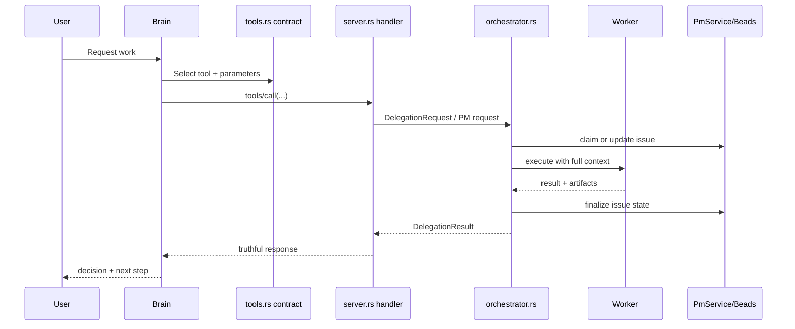

### Actual collaboration loop with failure seams

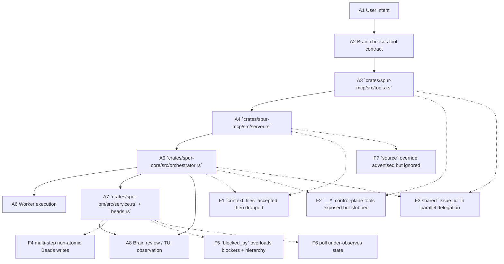

---

## Root Cause Statement

**Root cause:** the collaboration journey has accumulated **cross-layer contract drift**. The MCP tool schema, handler behavior, orchestrator execution model, and Beads adapter semantics no longer describe the same system. The brain is therefore allowed to form beliefs about execution scope, cancellation, PM tracking, source routing, and graph semantics that are not preserved by the implementation.

This is why the defects feel systemic rather than local:

- `tools.rs` is optimistic.
- `server.rs` is permissive.
- `orchestrator.rs` is pragmatic but narrower than the tool contract.
- `beads.rs` is a best-effort CLI bridge with partial-failure semantics.

The result is a user journey that looks coherent at the API level but is only partially coherent at runtime.

---

## Evidence by Root Cause

### R1. Scope handoff is broken: `context_files` is a no-op

The tool schema advertises `context_files` for delegation and plan execution:

- `crates/spur-mcp/src/tools.rs:68-72`
- `crates/spur-mcp/src/tools.rs:345-349`
- `crates/spur-mcp/src/tools.rs:636-640`

The server parses and forwards it:

- `crates/spur-mcp/src/server.rs:466-469`
- `crates/spur-mcp/src/server.rs:1758-1761`

The orchestrator receives it, but `execute_delegation` names it `_context_files` and never uses it:

- `crates/spur-core/src/orchestrator.rs:2373`
- `crates/spur-core/src/orchestrator.rs:2452`
- `crates/spur-core/src/orchestrator.rs:2564`

**First-principles failure:** the brain declares scope, but the system drops that scope before execution. This is the highest-severity collaboration defect because it directly lowers worker accuracy while preserving the illusion that scope was honored.

### R2. Public control-plane tools are ahead of backend reality

The tool surface advertises async waiting, polling, cancellation, progress reporting, and session cost:

- `crates/spur-mcp/src/tools.rs:330-435`
- `crates/spur-mcp/src/tools.rs:302-326`

The server exposes handlers for these paths:

- `crates/spur-mcp/src/server.rs:735-815`
- `crates/spur-mcp/src/server.rs:1096-1158`
- `crates/spur-mcp/src/server.rs:1749-1888`

But the orchestrator still treats any `agent` beginning with `__` as a failed internal operation:

- `crates/spur-core/src/orchestrator.rs:2574-2588`

That creates three concrete user-facing lies:

- `cancel_delegation` sounds real but is not wired.
- `report_progress` returns success even if the backend op is a stub.
- `get_session_cost` can degrade to a meaningless `0.0` fallback.

**First-principles failure:** the public contract is not truthful.

### R3. Parallel PM auto-tracking is underspecified and race-prone

`delegate_parallel` exposes one shared `issue_id` for the whole batch:

- `crates/spur-mcp/src/tools.rs:140-143`

The server clones that same `issue_id` into each `DelegationRequest`:

- `crates/spur-mcp/src/server.rs:577-615`

The orchestrator claims and updates that issue for each worker attempt:

- `crates/spur-core/src/orchestrator.rs:2412-2433`
- `crates/spur-core/src/orchestrator.rs:2464-2496`

If a caller interprets `issue_id` naturally as "track this task," parallel workers can race on assignee, status, and comment history for the same Beads issue.

**First-principles failure:** one execution identity is being reused for multiple concurrent units of work.

### R4. Beads writes are best-effort, multi-step, and non-atomic

`create_issue` creates the issue first, then adds dependencies in separate calls:

- `crates/spur-pm/src/beads.rs:337-390`

`update_issue` performs field updates, then comment addition, then label add, then label removal:

- `crates/spur-pm/src/beads.rs:393-450`

If any later step fails, earlier steps remain committed in `.beads`.

**Practical consequences:**

- issue created, dependency graph incomplete
- status changed, audit comment missing
- labels partially applied
- retries can duplicate comments or over-correct labels

**First-principles failure:** mutation is stronger than rollback and stronger than error reporting.

### R5. The shared graph model overloads blockers with hierarchy

The Beads adapter treats `parent-child` as a blocking dependency:

- `crates/spur-pm/src/beads.rs:101-120`

The plan layer then infers epic children by scanning `blocked_by` for the epic id:

- `crates/spur-mcp/src/plan.rs:310-341`

This means one field, `Issue.blocked_by`, carries two meanings:

- execution blockers
- containment / decomposition structure

That is why epic hydration needs N+1 reads and why `execute_epic` is sensitive to Beads dependency vocabulary.

**First-principles failure:** scheduling edges and structural edges are different domains and should not be collapsed.

### R6. The read/poll path is weaker than the write path

The Beads poll implementation only reads open issues, only reads 20, and advances its watermark to local wall-clock time:

- `crates/spur-pm/src/beads.rs:465-516`

Known consequences:

- closed/done transitions disappear from the feed
- active repos can starve updates outside the top 20
- updates after snapshot time but before `last_poll = now` can be missed

**First-principles failure:** the system cannot reliably observe the state transitions it is itself creating.

### R7. The tool schema advertises backend routing that handlers ignore

The tool schema advertises `source` override for `get_issue` and `update_issue`:

- `crates/spur-mcp/src/tools.rs:169-172`
- `crates/spur-mcp/src/tools.rs:237-240`

The handlers never read `source`; they always call the configured `pm_service`:

- `crates/spur-mcp/src/server.rs:832-851`
- `crates/spur-mcp/src/server.rs:914-959`

**First-principles failure:** the schema implies backend selection, but the runtime is single-backend only.

---

## Root Cause Graph

```mermaid
flowchart TD
    A["Contract drift across layers"]

    A --> B["Tool schema is broader than runtime"]
    A --> C["Execution model is narrower than handler assumptions"]
    A --> D["PM adapter is best-effort rather than transactional"]
    A --> E["Shared domain model collapses distinct concepts"]
    A --> F["Observation path is lossy"]

    B --> B1["`context_files` promised"]
    B --> B2["`source` override promised"]
    B --> B3["cancel/progress/cost promised"]

    C --> C1["`_context_files` unused"]
    C --> C2["`__*` internal ops fail"]
    C --> C3["shared issue_id across parallel workers"]

    D --> D1["create -> dep add split"]
    D --> D2["update -> comment -> labels split"]

    E --> E1["`parent-child` folded into `blocked_by`"]
    E --> E2["epic hydration requires inference + N+1"]

    F --> F1["open-only poll"]
    F --> F2["limit 20"]
    F --> F3["local watermark"]
```

---

## Diagram-to-Code Mapping

| Diagram node | Responsibility | Actual code | What should be true | What is actually true |
|---|---|---|---|---|
| `A3 tools.rs` | Publish truthful MCP contract | `crates/spur-mcp/src/tools.rs:53-147`, `330-435`, `528-652` | Tool schema matches runtime capability | Schema is broader than backend reality in multiple places |
| `A4 server.rs` | Parse request and preserve semantics | `crates/spur-mcp/src/server.rs:457-561`, `564-679`, `832-1055`, `1749-1888` | All meaningful parameters survive to execution | `source` ignored; `delegate_parallel` flattens PM tracking to one `issue_id` |
| `A5 orchestrator.rs` | Execute worker with same declared scope | `crates/spur-core/src/orchestrator.rs:2367-2535`, `2561-2588` | DelegationRequest fields influence execution | `context_files` dropped; `__*` agents stub-fail |
| `A6 Worker execution` | Run with correct context, return artifacts | same as above | Worker sees the context the brain selected | Worker only gets `task`; declared file scope is absent |
| `A7 service.rs + beads.rs` | Keep PM graph coherent | `crates/spur-pm/src/service.rs:82-154`, `crates/spur-pm/src/beads.rs:337-516` | Writes are coherent; reads observe them | Writes are multi-step; poll is lossy |
| `F1 context_files dropped` | Scope fidelity | `crates/spur-mcp/src/server.rs:466-469`, `crates/spur-core/src/orchestrator.rs:2564` | Scope parameter is used or rejected | Accepted, forwarded, then ignored |
| `F2 control-plane tools stubbed` | Truthful tool behavior | `crates/spur-mcp/src/server.rs:735-815`, `1096-1158`; `crates/spur-core/src/orchestrator.rs:2574-2588` | Exposed tools have real backend implementations | Exposed tools can only fail as internal stubs |
| `F3 shared issue_id` | Correct PM correlation | `crates/spur-mcp/src/tools.rs:140-143`, `crates/spur-mcp/src/server.rs:577-615`, `crates/spur-core/src/orchestrator.rs:2412-2496` | One issue id should represent one task lifecycle | One issue id can represent many parallel delegations |
| `F4 non-atomic writes` | Failure-safe mutation | `crates/spur-pm/src/beads.rs:337-390`, `393-450` | Failure is all-or-nothing or explicitly compensating | Partial external commit is normal |
| `F5 blocked_by overload` | Domain clarity | `crates/spur-pm/src/beads.rs:101-120`, `crates/spur-mcp/src/plan.rs:310-341` | Hierarchy and blockers modeled separately | Both meanings merged into one vector |
| `F6 lossy poll` | Observability | `crates/spur-pm/src/beads.rs:465-516` | Read path can observe mutations and completions | Read path misses closed transitions and can miss updates |
| `F7 source override ignored` | Backend selection truthfulness | `crates/spur-mcp/src/tools.rs:169-172`, `237-240`; `crates/spur-mcp/src/server.rs:832-959` | Caller-selected backend is honored or rejected | Parameter is advertised, then ignored |

---

## Why These Failures Compose Badly

Each issue alone is manageable. Together they reinforce each other:

- The brain cannot reliably scope work (`context_files`).
- It cannot fully trust tool semantics (`cancel_delegation`, `source`, cost/progress).
- It cannot assume Beads reflects a single coherent task transition after an error.
- It cannot assume Beads hierarchy means the same thing as execution blockers.
- It cannot rely on polling to reconcile the truth later.

That composition is why the system can feel "mostly working" while still producing review-time confusion and PM drift.

---

## Recommendations

### 1. Make tool contracts strict before adding new surface area

Best immediate action:

- either implement `context_files`, `cancel_delegation`, `report_progress`, and `get_session_cost`
- or remove / hide / hard-fail them explicitly at the schema or handler boundary

The system should prefer an honest "unsupported" result over a friendly lie.

### 2. Treat PM writes as state transitions, not shell convenience

For Beads-backed flows:

- add compensating behavior or explicit partial-success reporting
- make issue creation + dependency wiring idempotent
- make update sequencing auditable when later steps fail

### 3. Split hierarchy from blockers in the shared PM model

Add explicit `parent` or `children` structure rather than inferring hierarchy from `blocked_by`.

This removes:

- the `BLOCKING_TYPES` overload
- the `execute_epic` child-detection inference
- part of the N+1 fetch pattern

### 4. Strengthen observation to match mutation

`poll()` should not be open-only, top-20-only, or local-watermark-only if the UI and orchestrator rely on it for reconciliation.

### 5. Tighten schema-handler parity

Every parameter in `tools.rs` should have one of three states:

- honored
- rejected with a clear error
- removed from the schema

No fourth state should exist where a parameter is accepted and then silently ignored.

---

## Open Questions

These were not resolved by static review and should be validated before a fix spec is written:

1. Does `br update --assignee ""` actually unassign, as implied by `IssueUpdate.assignee` docs in `crates/spur-pm/src/types.rs:104-112` and implemented in `crates/spur-pm/src/beads.rs:411-413`?
2. Are the dependency type strings in `BLOCKING_TYPES` stable across `br` versions?
3. Can Beads expose explicit parent metadata in list/show output, so SPUR stops inferring hierarchy from `blocked_by`?

---

## Final Judgment

This is not an orchestrator-only bug, a Beads-only bug, or an MCP-only bug.

It is a **system-boundary integrity problem**:

- the brain chooses based on the tool contract
- the server preserves only part of that contract
- the orchestrator executes an even narrower subset
- the PM adapter records state with weaker guarantees than the execution layer assumes

The correct fix strategy is therefore **contract convergence**, not local patching in one crate.

---

# Phase 2 Update — MCTS Grounding + Adversarial Re-derivation

**Date:** 2026-04-18
**Reviewer:** L9 Rust staff-engineer pass
**Method:** MCTS-style rollouts through `mcp__sequential-thinking__sequentialthinking`, branch pruning via regret analysis, direct code verification against `crates/spur-mcp/src/{tools,server}.rs`, `crates/spur-core/src/orchestrator.rs`, `crates/spur-pm/src/beads.rs`, `crates/spur-mcp/src/plan.rs`.
**Purpose:** (1) ground every original R# claim against current code; (2) surface adversarial findings the original analysis missed; (3) sequence-diagram the journey drift; (4) deliver a tiered remediation ordering.

---

## Phase 2.1 — Grounding Matrix

Each root cause evaluated against actual source. **Confidence** is survival probability under adversarial rollout. **Drift** is divergence from the line refs originally cited.

| Claim | Verdict | Confidence | Drift from original refs | Notes |
|---|---|---|---|---|
| **R1** `context_files` accepted then dropped | ✅ Confirmed | 0.99 | None — `orchestrator.rs:2564` signature is literally `_context_files: Vec<String>` and never read. | Parameter reaches function boundary, gets burned. |
| **R2** `__*` control-plane tools stubbed | ✅ Confirmed | 0.99 | None — `orchestrator.rs:2575` `if agent.starts_with("__") { return Failed }`. | See A2 — actual behavior is worse than "not wired." |
| **R3** shared `issue_id` in parallel | ✅ Confirmed | 0.95 | None — `server.rs:577-580` captures top-level `issue_id`, `615` clones into each request. | See A1/A5 — parallel contract is triply broken, not singly. |
| **R4** Beads writes non-atomic | ✅ Confirmed | 0.99 | None — `beads.rs:337-390` and `393-450` run 2–4 separate `br` subprocesses. | Retry-safety asymmetry: status is idempotent, comments are not. |
| **R5** `blocked_by` overloads hierarchy + blockers | ✅ Confirmed | 0.99 | None — `beads.rs:101` `BLOCKING_TYPES` includes `parent-child`; `plan.rs:341` filters `blocked_by` for epic id. | `plan.rs:337-340` comment already flags this as brittle. |
| **R6** poll lossy | ✅ Confirmed | 0.90 | None — `beads.rs:465-517` `-s open`, `--limit 20`, watermark race. | Closed-transition gap is the dominant failure mode; the watermark race is narrower than originally implied but real. |
| **R7** `source` advertised, never read | ✅ Confirmed | 0.99 | None — `server.rs:832-853` and `914-961` never call `args.get("source")`. | Single-backend is structural: `pm_service: Option<Arc<dyn PmService>>`. |

**MCTS branches explored and pruned:**

- *B1 (pruned):* "Maybe `_context_files` is consumed by agent-side prompt assembly." Grep confirmed one `context_files` field on `DelegationRequest`, never read downstream.
- *B2 (pruned):* "Maybe `__cancel_delegation` is routed before the `__` prefix check." `execute_delegation` is the single entry point; the `__` check is the first statement.
- *B3 (pruned):* "Maybe shared `issue_id` in `delegate_parallel` is intentional as a batch marker." Orchestrator unconditionally overwrites `assignee = spur-worker-{request_id}` per-worker → batch-marker semantics collapse under racing writes.
- *B4 (pruned):* "Maybe `>=` inclusive compare on `updated_at` eliminates the watermark race." Boundary holds only if all updates in a given poll land within one `Utc::now()` tick; otherwise updates in `[now, filter_completed_at]` are lost on the next tick.

---

## Phase 2.2 — Adversarial Findings (Re-derivation)

Re-running first-principles on raw code without anchoring on the R1–R7 frame surfaces four additional defects and one reframing.

### A1. `delegate_parallel` strips `context_files` entirely — stricter than R1

- `tools.rs:118-128` per-task object schema: `{agent, task}` only. No `context_files` field.
- `server.rs:611` hardcodes `context_files: Vec::new()` per parallel request.

Even if R1 is fixed in `delegate_to_worker`, `delegate_parallel` **cannot express** per-task scope — the schema lacks the slot. This is an API-shape bug, not a wiring bug.

### A2. `cancel_delegation` inverts error into success

The RCA calls cancel "not wired." The actual failure mode is more misleading:

1. `server.rs:795-805` awaits the stub result.
2. Orchestrator returns `DelegationResult { status: Failed { error: "Internal operation not yet wired: __cancel_delegation" }, summary: None, ... }`.
3. Server runs `result.summary.unwrap_or_else(|| match &result.status { Failed { error } => error.clone(), … })` → pulls the error string.
4. Server wraps the error string in `JsonRpcResponse::success(...)`.

Brain sees a **JSON-RPC success** whose text body says "not yet wired." Same inversion applies to any future stub result whose `status` is `Failed` and `summary` is `None`.

### A3. `delegation_plan` is cloned, not sharded, across parallel tasks

`server.rs:614` clones `shared_plan` into every per-task `DelegationRequest`. `DelegationPlan`'s purpose is reviewer-visibility and mismatch detection. Every parallel worker carries the batch-level plan rather than its own subtask plan → mismatch detection becomes tautological.

### A4. Asymmetric `IssueUpdated` emission on success

- Claim path (`orchestrator.rs:2412-2433`): emits `IssueUpdated { status: in_progress, assignee: worker }` on success, silent on failure.
- Finalize path (`2464-2496`): for `DelegationStatus::Success` the match sets `new_status = None`; the guarded emission at `2489` (`else if let Some(status) = new_status`) **does not fire**. Only the Beads-side comment is written.

TUI consumers relying on event parity to resolve "done" state see the issue frozen in `in_progress` on success until `poll()` reconciles — which per R6 may never observe the closed transition.

### A5. Reframing of R3 — `delegate_parallel` issue semantics are unrecoverable without schema change

Three candidate interpretations of the shared `issue_id` all fail:

- *batch marker:* broken — orchestrator overwrites assignee per-worker.
- *per-task issue:* broken — schema exposes one shared slot.
- *epic parent:* broken — orchestrator treats it as direct target, not parent.

Fix requires schema change on the per-task object, not documentation or handler adjustment.

---

## Phase 2.3 — Sequence Diagrams

### R1 — `context_files` dropped

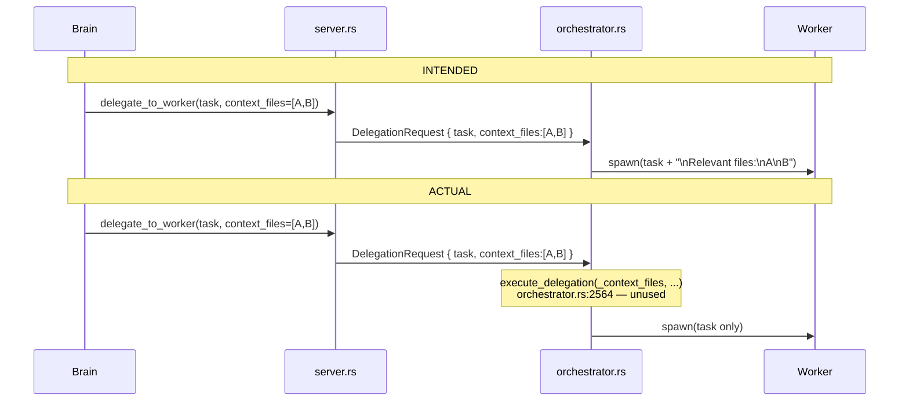

### R2 + A2 — Control-plane stub returns success-with-error-text

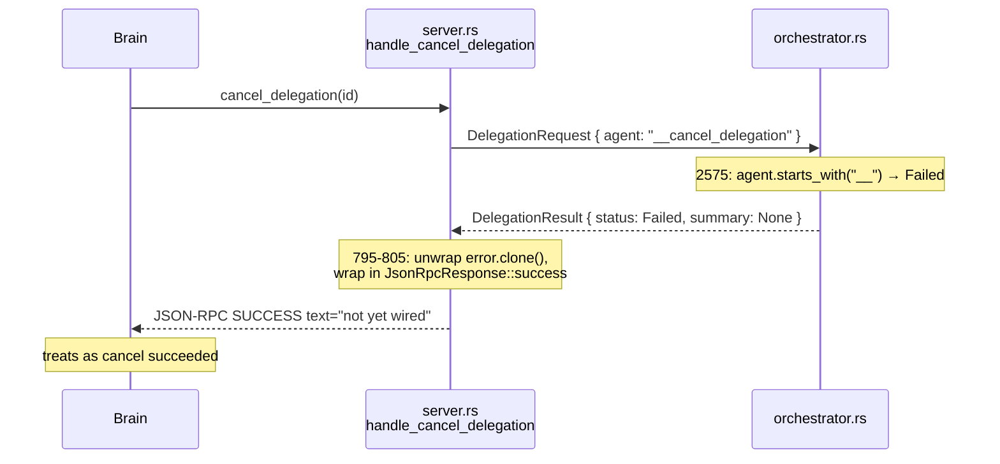

### R3 + A1 + A3 — `delegate_parallel` triple failure

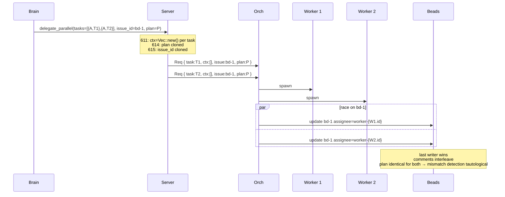

### R4 — Non-atomic Beads write + duplicate-on-retry

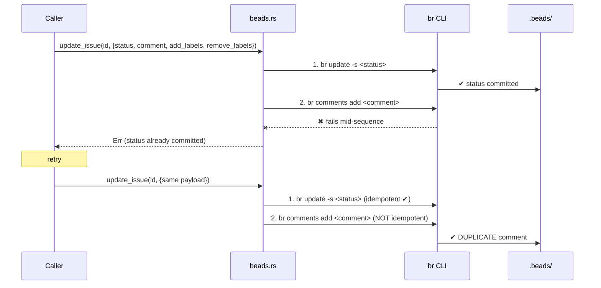

### R5 — `blocked_by` overload forces N+1 epic hydration

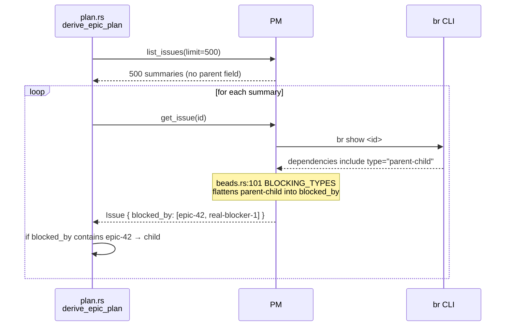

### R6 — Lossy poll (closed filter + limit + watermark race)

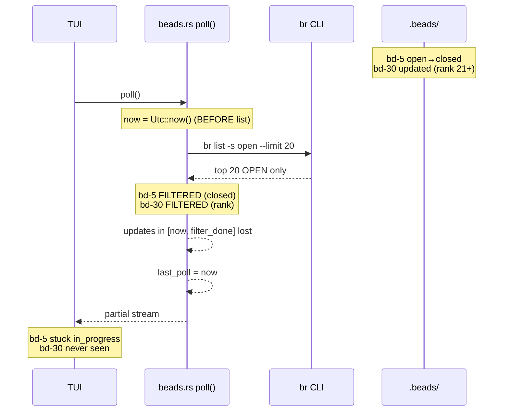

### R7 — `source` ignored

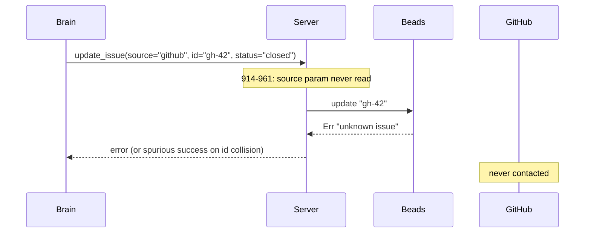

### A4 — Missing `IssueUpdated` emission on success

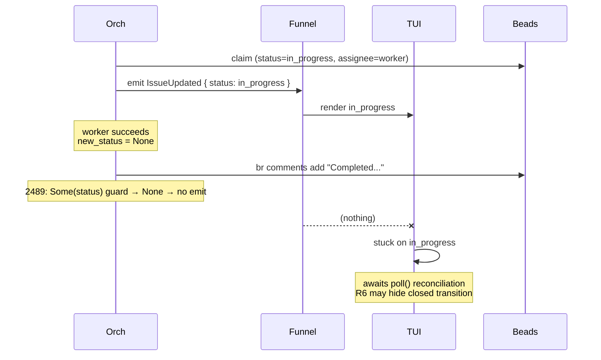

### Composite — end-to-end defect fan-in

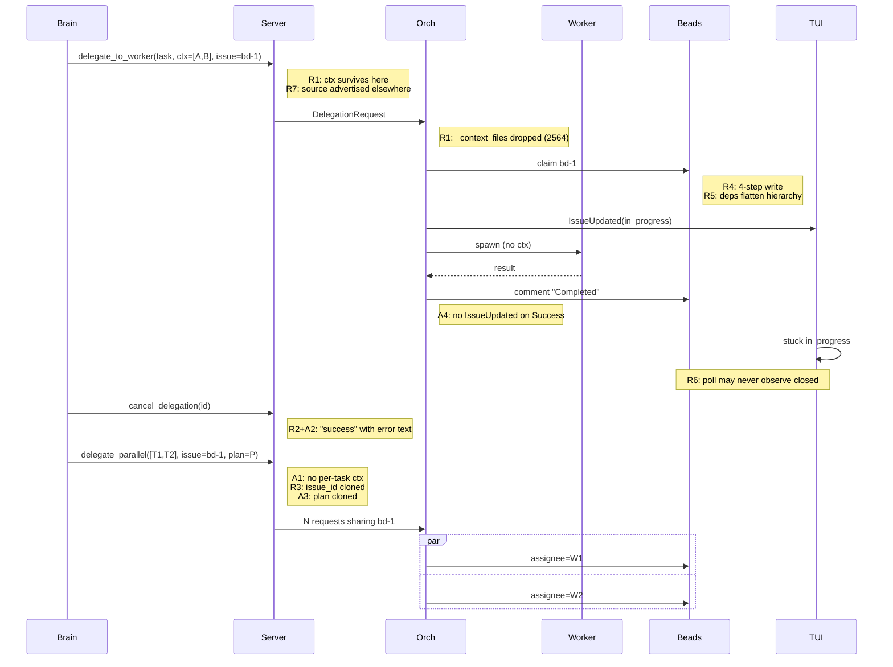

---

## Phase 2.4 — Severity Matrix

| # | Defect | Blast radius | Fix reversibility | Truthfulness violation |
|---|---|---|---|---|
| R1 | `context_files` dropped | Every `delegate_to_worker` | High (one-line fix) | **Yes** |
| A1 | `delegate_parallel` no per-task ctx | Every parallel call | Medium (schema + server) | **Yes** |
| R2/A2 | Control-plane stubs return success | Every cancel/progress/cost | High (remove or hard-fail) | **Yes — worst form** |
| R3/A5 | Shared `issue_id` in parallel | Parallel + PM tracking | Medium (schema) | Yes |
| A3 | Cloned `delegation_plan` in parallel | Parallel reviewer paths | Medium | Partial |
| R4 | Non-atomic Beads writes | Any `update_issue` | Low (WAL or compensating tx) | Partial |
| R5 | `blocked_by` overload | All hierarchy + N+1 on epics | Low (cross-crate refactor) | No |
| R6 | Lossy poll | All reconciliation | Medium | No |
| R7 | `source` ignored | Cross-backend calls | High (schema prune) | **Yes** |
| A4 | Missing IssueUpdated on success | Every successful delegation | High (emit on completion) | No |

---

## Phase 2.5 — Tiered Remediation Ordering (supersedes original §Recommendations)

The original "contract convergence, not local patching" strategy is correct. Sequencing within that strategy:

### Tier T1 — Truthfulness (prerequisite for everything else)

Every advertised parameter/tool reaches one of three states: **honored**, **rejected-with-error**, or **removed from schema**. No fourth state. Localized to `spur-mcp/src/{tools,server}.rs` + `spur-core/src/orchestrator.rs:execute_delegation`.

- T1.1 Schema-handler parity pass (R2/A2, R7).
  - Drop `source` from `get_issue`/`update_issue` schemas until multi-backend lands.
  - Drop `cancel_delegation`, `report_progress`, `get_session_cost` from `tools/list`, OR flip handlers to `JsonRpcResponse::error(-32601, "not yet implemented")`.
  - Fix A2 regardless: `Failed` → JSON-RPC `error`, never `success`.
- T1.2 Honor or reject `context_files` (R1, A1).
  - `delegate_to_worker`: inject `context_files` into worker prompt; drop underscore prefix on orchestrator arg.
  - `delegate_parallel`: extend per-task schema with `context_files`, OR document exclusion explicitly.
- T1.3 Parallel `issue_id` + `delegation_plan` sharding (R3/A5, A3).
  - Move `issue_id` and `delegation_plan` into each per-task object. Remove top-level sharing, OR reinterpret top-level `issue_id` as *epic parent* (requires T3.1 first).

### Tier T2 — Coherence (next; requires T1 + test harness)

- T2.1 Beads write-sequence hardening (R4).
  - `update_issue` returns `Result<UpdateReceipt, PartialUpdateError>` enumerating committed and failed steps.
  - Idempotency key per update to suppress duplicate comments on retry.
- T2.2 Finalize `IssueUpdated` emission on success (A4).
  - Orchestrator emits `IssueUpdated { completion: true }` (or new `IssueDelegationComplete` variant) on `Success`.

### Tier T3 — Domain model (highest value; redesign-scoped)

- T3.1 Split hierarchy from blockers (R5).
  - Add `parent: Option<String>` and `children: Vec<String>` to `Issue`/`IssueSummary`.
  - `beads.rs` `From<BrIssueDetails>` routes `parent-child` into `parent`; drops it from `BLOCKING_TYPES`.
  - `plan.rs` `derive_epic_plan` filters by `summary.parent` — eliminates N+1.
- T3.2 Poll parity with mutation (R6).
  - Drop `-s open` filter. Remove or tune `--limit 20`.
  - Capture `now` **after** list fetch, or use `max(updated_at)` from returned issues.

### Invariant Set (target state)

After remediation, these must be CI-enforceable:

1. Every `tools.rs` `inputSchema` key has a matching `args.get(key)` in `server.rs`.
2. `DelegationRequest.context_files` is structurally consumed in prompt assembly.
3. `delegate_parallel` per-task `issue_id` is either unique or `None` across a batch.
4. `PmService::update_issue` returns `Result<UpdateReceipt, PartialUpdateError>`.
5. For every `update_issue(status = X)`, next `poll()` within T ms surfaces `IssueUpdated { status: X }`, including `X ∈ {closed, done}`.
6. On `DelegationStatus::Success`, an `IssueUpdated` (or completion) event is emitted.
7. On `DelegationResult { status: Failed }`, MCP response is JSON-RPC `error`, not `success`.

---

## Phase 2.6 — Updated Final Judgment

The original RCA's thesis survives adversarial re-derivation. Confidence on every R# claim is ≥0.90 post-grounding. Four adversarial findings (A1–A4) extend the "contract drift" thesis rather than contradict it — three of the four are tighter-scoped failures of the same API-truthfulness invariant R1/R2/R7 already named.

**Execution ordering within contract convergence is T1 → T3 → T2.** Truthfulness first (cheap, restores trust, prerequisites T2/T3 framings). Domain model second (expensive but cascades — `parent`/`children` fields unlock T2.1 invariants). Coherence last (benefits from both).

Each tier is its own sub-project with its own brainstorm → spec → plan cycle. A single spec spanning T1+T2+T3 is too large for meaningful review.
