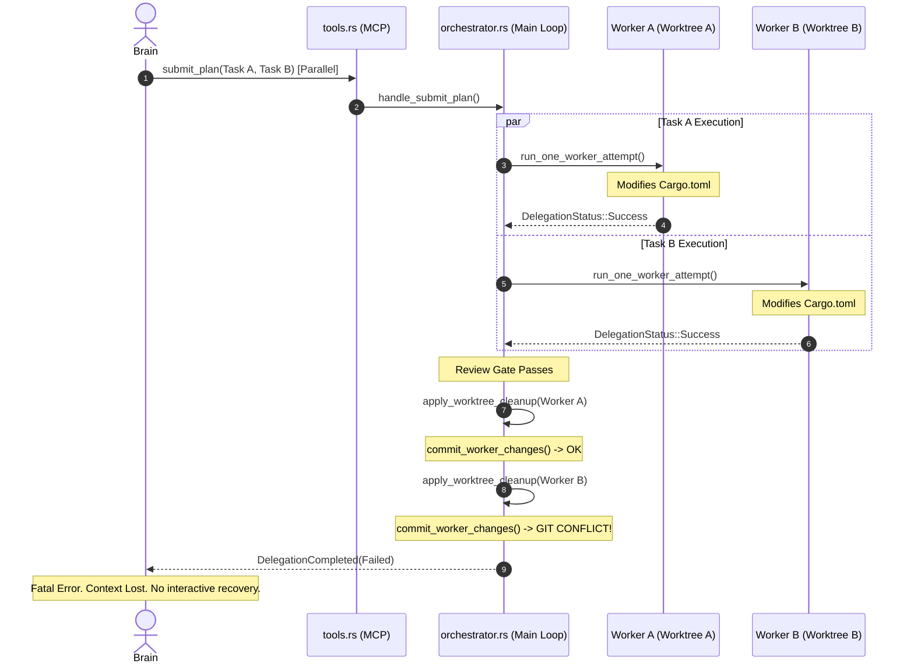
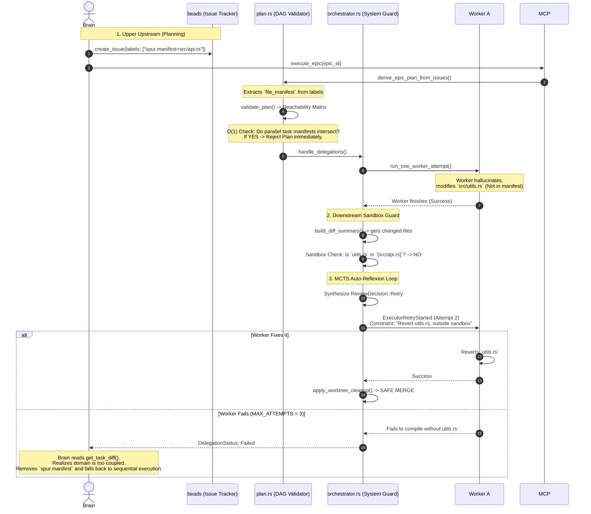

# RCA: Parallel Execution Git Merge Conflicts (The "Trust But Don't Verify" Vulnerability)

**Date:** April 19, 2026
**Author:** L9 Staff Engineer
**Status:** Architectural Proposal & RCA
**Target Components:** `spur-core::orchestrator`, `spur-mcp::plan`

## 1. Problem Statement
When the Brain agent utilizes `submit_plan` or `execute_epic` to dispatch parallel tasks (e.g., Task A and Task B running concurrently), the workers execute in isolated Git worktrees. However, if both workers modify the same file (e.g., `Cargo.toml`), they will both report `DelegationStatus::Success`. 

When the Orchestrator attempts to finalize the delegations, the sequential execution of `apply_worktree_cleanup` triggers `commit_worker_changes`, resulting in a fatal Git merge conflict. The Brain is completely blind to this conflict until the very end of the execution, and lacks an interactive mechanism to recover, resulting in a broken project state.

## 2. Root Cause
The system relies on an **LLM Prompting Constraint rather than a Mathematical System Constraint**. 
In `spur-mcp/src/tools.rs:94` (`delegate_parallel`), the description states: *"MUST demonstrate subtasks are independent — no shared state."* 
However, the Orchestrator never verifies this independence. It trusts the LLM's assessment of isolation, but blindly merges the result.

## 3. Architectural Solution: Two-Tiered File Isolation
To fix this, we introduce a mathematical isolation guarantee across two lifecycle phases:
1. **Predictive Intent (Planning Phase):** Tasks must explicitly declare a `file_manifest` (extracted from PM labels like `spur.manifest=`). The DAG validator rejects the plan instantly if parallel tasks have overlapping manifests.
2. **Runtime Sandbox (Execution Phase):** Post-execution, the Orchestrator validates the worker's `git diff` against its manifest. Violations trigger an automatic MCTS Reflexion loop (`ReviewDecision::Retry`), forcing the worker to revert unapproved files without paging a human.

---

## Diagram 1: Current Flawed State (The Merge Conflict)

This diagram maps the existing flow where parallel workers collide.

### 🔍 Code Grounding & Cross-Check (Diagram 1)
*   **Step 2:** `submit_plan` hits `handle_submit_plan` in `spur-mcp/src/server.rs:1487`.
*   **Step 3 & 5:** Spawns via `tokio::spawn` inside `handle_delegations` (`spur-core/src/orchestrator.rs:2910`). Semaphore allows concurrency.
*   **Step 4 & 6:** `run_one_worker_attempt` completes (`orchestrator.rs:4759`).
*   **Step 8 & 10:** The terminal success arm of `execute_delegation` calls `apply_worktree_cleanup` (`orchestrator.rs:3266`).
*   **Step 11:** `apply_worktree_cleanup` calls `worktrees.commit_worker_changes()` (`orchestrator.rs:3560`). Because Worker A already committed `Cargo.toml` to the base branch, Worker B's commit triggers a Git merge conflict.

---

## Diagram 2: Proposed Two-Tiered Isolation Architecture

This diagram illustrates the new robust MCTS feedback loop, combining upstream PM integration with downstream sandbox validation.

### 🔍 Code Grounding & Cross-Check (Diagram 2)
*   **Step 2:** The Brain sets the intent. Grounded in PM interactions.
*   **Step 4:** Extraction logic goes into `derive_epic_plan_from_issues` (`spur-mcp/src/plan.rs:136`), extracting via `label_value(&child.labels, "spur.manifest=")`. If missing, defaults to `[]` (unconstrained, forcing sequential execution).
*   **Step 5 & 6:** `validate_plan` (`spur-mcp/src/plan.rs:484`). This is where Kahn's topological sort is extended to compute reachability. We check `Manifest_A ∩ Manifest_B`. If overlapping, it returns `Err("File isolation violation")`.
*   **Step 12:** Post-worker diff is gathered via `build_diff_summary` (`spur-core/src/orchestrator.rs:4850`). It returns `DiffSummary { files: Vec<PathBuf>, ... }`.
*   **Step 13:** The new Sandbox Guard logic is injected at the end of `run_one_worker_attempt` (`orchestrator.rs:4759`), directly validating `diff_summary.files` against `task.file_manifest`.
*   **Step 14 & 15:** If violated, the Orchestrator hijacks the existing `ReviewDecision::Retry` loop inside `execute_delegation` (`orchestrator.rs:3013`). The `render_retry_context` (`orchestrator.rs:4023`) automatically appends the System Guard constraint, leveraging the exact same MCTS Reflexion pipeline used for human reviews.
*   **Step 18:** Safe merge is guaranteed because `apply_worktree_cleanup` (`orchestrator.rs:3560`) now operates on mathematically disjoint file sets.
*   **Step 20:** If `attempt_n > max_review_retries` (`orchestrator.rs:3240`), it returns `DelegationStatus::Failed`. The Brain uses `get_task_diff` (`spur-mcp/src/tools.rs:666`) to read the history and gracefully degrade the plan to run sequentially.
