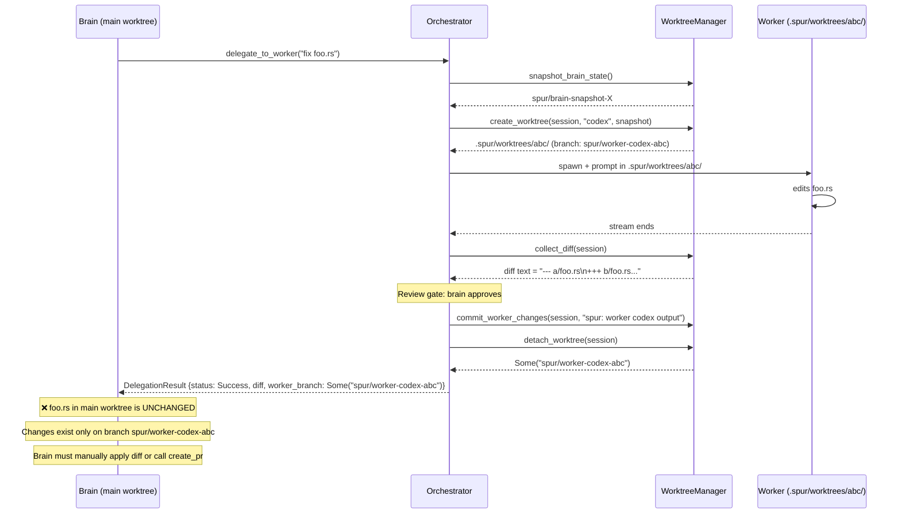
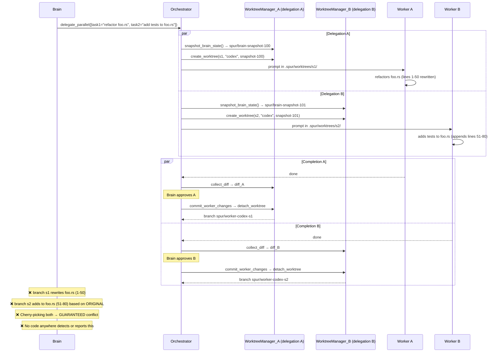
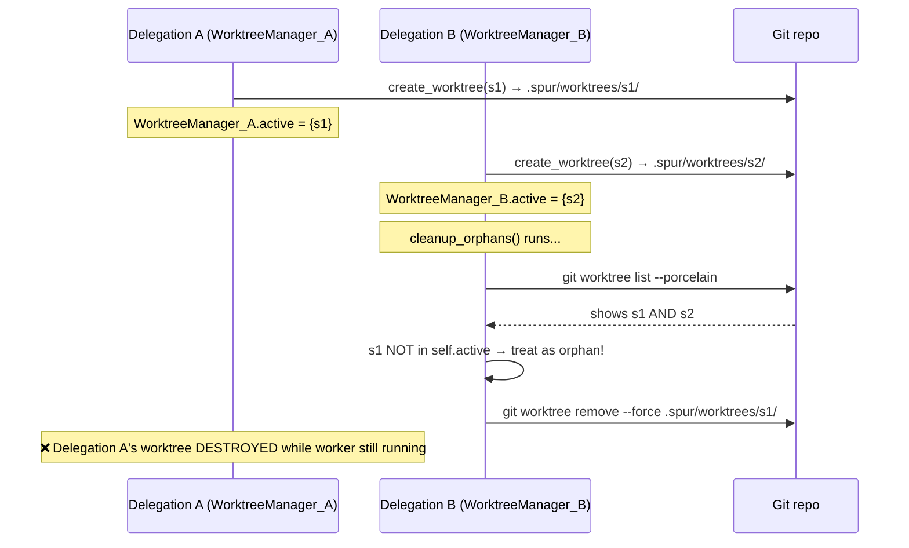
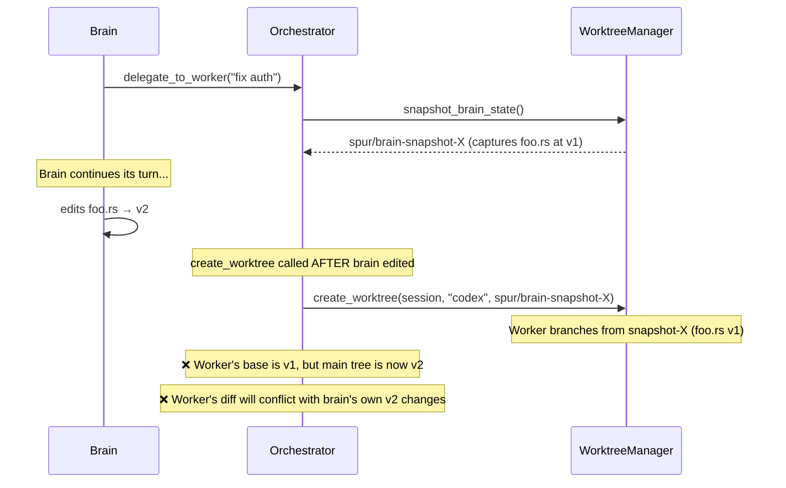
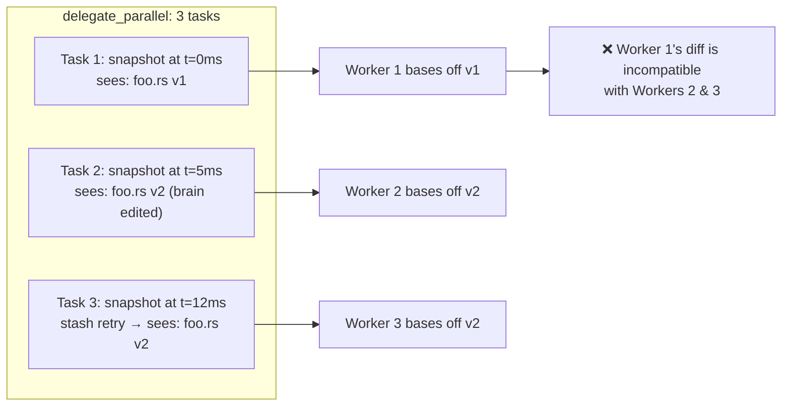
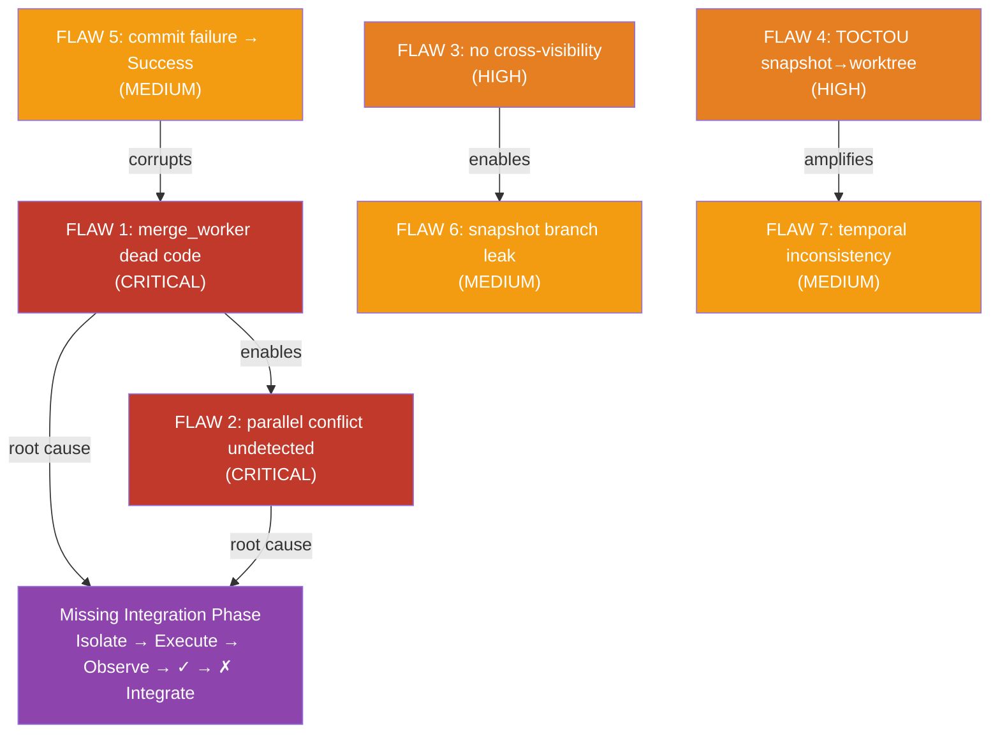

# RCA: Worktree Integration Contract Breakdown — `spur-worktree` Under Real Upstream Load

**Date:** 2026-04-21
**Author:** L9 Staff Engineer
**Status:** RCA + Architectural Finding
**Target Components:** `spur-worktree::manager`, `spur-worktree::artifact`, `spur-core::orchestrator`, `spur-mcp::tools`, `spur-mcp::plan`
**Precedents:** `2026-04-19-parallel-execution-file-isolation.md`, `2026-04-19-phase3a-worker-dispatch-failure-modes.md`

---

## 0. Executive Summary

MCTS first-principles analysis of `spur-worktree` against the real upstream callers (`delegate_to_worker`, `delegate_parallel`, `submit_plan`) reveals **7 flaws**, 2 critical. The architectural root cause is a missing integration phase: the worktree system implements isolation (branch + worktree) and observation (diff collection) correctly, but approved worker changes are never integrated into the main tree. `merge_worker()` exists as dead code. The brain receives diff text as information, not applied state, making `delegate_parallel` with overlapping files a guaranteed source of undetectable conflicts.

---

## 1. Methodology

Each branching decision in the delegation flow was treated as an MCTS node. For each node, the worktree contract was evaluated against the actual code paths triggered by `delegate_to_worker` and `delegate_parallel`. Simulations trace the real function calls, not idealized flows.

Key source files analyzed:
- `crates/spur-worktree/src/manager.rs` (658 lines) — worktree CRUD, snapshot, diff, merge
- `crates/spur-worktree/src/artifact.rs` (276 lines) — side-channel blob persistence
- `crates/spur-core/src/orchestrator.rs` (4857 lines) — delegation lifecycle, review gate, retry loop
- `crates/spur-mcp/src/tools.rs` (673 lines) — MCP tool surface
- `crates/spur-mcp/src/server.rs` (2784 lines) — delegation handler, inline wait, continuation bridge
- `crates/spur-mcp/src/plan/mod.rs` (3673 lines) — DAG plan executor

---

## 2. Flaw Inventory

| # | Flaw | Severity | Trigger | Root Cause |
|---|------|----------|---------|------------|
| 1 | Approved worker changes never integrated into main tree | CRITICAL | Every `delegate_to_worker` approve | `merge_worker` dead code; `detach_worktree` preserves branch but nobody cherry-picks |
| 2 | Parallel delegations create undetected conflicts | CRITICAL | `delegate_parallel` with overlapping files | No merge/conflict check between worker branches |
| 3 | Per-delegation `WorktreeManager` has zero cross-visibility | HIGH | Concurrent delegations + cleanup call | Each `execute_delegation` creates isolated instance |
| 4 | Snapshot-to-worktree TOCTOU gap | HIGH | `inline_wait=0` + brain edits after delegation returns | Two-step non-atomic snapshot → create |
| 5 | `commit_worker_changes` failure → inconsistent `DelegationResult` | MEDIUM | Pre-commit hook, GPG signing, disk full | Error logged but status remains `Success` |
| 6 | Snapshot branch leak, no automatic reclamation | MEDIUM | Every delegation (accumulates over time) | `self.worktrees` on orchestrator unused; per-delegation manager dropped |
| 7 | Parallel snapshots are temporally inconsistent | MEDIUM | `delegate_parallel` during brain edits | Independent `snapshot_brain_state()` calls per task |

---

## 3. Detailed Analysis

### 3.1 CRITICAL: Approved changes never integrated — `merge_worker` is dead code

**First principle:** A worktree system has three phases — isolate, execute, integrate. `spur-worktree` implements isolation and execution but the integration phase is a ghost.

**Evidence:**

- `WorktreeManager::merge_worker()` (`manager.rs:296-331`) cherry-picks a worker branch onto a target branch. Grep across the entire repository: **zero call sites**. Only the definition exists.
- On Approve, `apply_worktree_cleanup` (`orchestrator.rs:3593-3631`) does:
  1. `commit_worker_changes` — commits in the *worker's* worktree
  2. `detach_worktree` — removes the directory, preserves the branch `spur/worker-<agent>-<session>`
  3. Returns `Some(branch_name)` → becomes `DelegationResult.worker_branch`
- The brain receives `worker_branch: Some("spur/worker-codex-abc123")` and `diff: Some("...")` but the changes **do not exist in the main worktree**.
- The plan engine confirms this is by-design — `plan/mod.rs:1236`:
  > `"All tasks approved. Use create_pr with a worker_branch to create a pull request."`
- `create_pr` (`server.rs:1920-1956`) pushes a branch to GitHub and opens a PR. It does NOT merge the branch into the local tree.

**Simulation — `delegate_to_worker`, happy path:**



**Impact:** The brain believes work is "done" (status: Success) but the main tree is unchanged. Worker changes are stranded on an orphaned branch. For `submit_plan` with N approved tasks, N branches exist with no merge strategy.

**Remediation paths:**
- (A) Call `merge_worker` after approve, cherry-picking each worker branch into main — handles single-delegation case but conflicts with parallel (see §3.2).
- (B) Rebase-style: after all plan tasks are approved, replay branches in topological order with conflict detection.
- (C) PR-only: accept that local merge is not supported; require `create_pr` for integration. Document as a constraint.

---

### 3.2 CRITICAL: `delegate_parallel` creates divergent branches with no conflict detection

**First principle:** Parallel workers sharing a common ancestor must have a merge strategy. Without one, conflicts are invisible until attempted merge — and `merge_worker` is dead code.

**Simulation — `delegate_parallel` with overlapping files:**



Both branches share the same ancestor but diverge. `merge_worker` would detect the conflict (it does `cherry-pick` + `--abort` on failure returning `MergeResult::Conflict`), but nobody calls it. The brain gets two diffs that look compatible in text but are git-incompatible.

**Relationship to `2026-04-19-parallel-execution-file-isolation.md`:** That RCA identified the same symptom from the plan-execution angle and proposed a two-tier file isolation solution (predictive manifest + runtime sandbox). This RCA confirms the problem at the worktree layer and identifies the deeper structural cause: `merge_worker` is dead code, so even with manifests, there is no code path to integrate or detect conflicts.

---

### 3.3 HIGH: Per-delegation `WorktreeManager` has zero cross-visibility

**First principle:** A resource manager must have a complete inventory of the resources it manages.

**Evidence:** `orchestrator.rs:3046`:
```rust
let mut worktrees = WorktreeManager::new(repo_root);
```

Each `execute_delegation` call creates a **fresh** `WorktreeManager`. The `active` HashMap starts empty and only tracks THAT delegation's single worktree.

**Consequences:**

| Operation | What happens | Why it's wrong |
|-----------|-------------|----------------|
| `active_count()` | Returns 0 or 1 | Cannot see other delegations' worktrees |
| `cleanup_stale()` | Only checks its own worktree | Orphans from other delegations survive |
| `cleanup_orphans()` | May delete ACTIVE worktrees from other delegations | `self.active` doesn't track them |

**Simulation — `cleanup_orphans` race during concurrent delegations:**



**Current mitigation:** `cleanup_orphans` is never called in the orchestrator. The `self.worktrees` field on the `Orchestrator` struct (line 376) is used only to construct per-delegation managers. This is a loaded gun — any future code that calls `cleanup_orphans` as periodic maintenance will break active delegations.

---

### 3.4 HIGH: Snapshot-to-worktree TOCTOU gap

**First principle:** A snapshot must be atomic with respect to the state it captures.

**Evidence:** `run_one_worker_attempt` (`orchestrator.rs:3999-4007`):
```rust
let snapshot_branch = worktrees.snapshot_brain_state().await...;
let worktree_info = worktrees.create_worktree(&worker_session, ctx.agent, &snapshot_branch).await...;
```

Between these two `await` points, the brain is still active in the main worktree. In the `inline_wait_ms = 0` (default) path, `delegate_to_worker` returns `{status: "pending"}` immediately, and the brain's turn **continues**. The brain can edit files after the snapshot but before the worktree is created.

**Deeper problem:** `snapshot_brain_state` creates a branch ref in the main repo. This branch can be deleted by another concurrent delegation's cleanup (§3.3) or by a brain running `git branch -D`. If the snapshot branch is deleted between the two calls, `create_worktree` fails with a delegation-level `DelegationStatus::Failed`.

**Simulation — brain edits during TOCTOU window:**



---

### 3.5 MEDIUM: `commit_worker_changes` failure → inconsistent `DelegationResult`

**First principle:** If a function claims to commit changes, failure should not produce a result that pretends success.

**Evidence:** `apply_worktree_cleanup` (`orchestrator.rs:3601-3608`):
```rust
if should_commit_worker_diff(final_status) && diff.is_some() {
    if let Err(e) = worktrees.commit_worker_changes(worker_session, ...).await {
        tracing::warn!(error = %e, "failed to commit worker diff");
    }
}
```

On commit failure (pre-commit hook, GPG signing, disk full):
1. The warning is logged but execution continues
2. `detach_worktree` removes the directory but preserves the branch
3. The branch has NO commit with the worker's changes (they remain as uncommitted diffs in a now-deleted worktree directory)
4. `finalize` returns `DelegationResult { status: Success, worker_branch: Some("spur/worker-...") }`

**The brain receives `status: Success` and a `worker_branch` pointing to a branch with no worker commit.** The diff text and the branch state are inconsistent. `git show <worker_branch>` shows the pre-worker snapshot, not the worker's output.

**Correct behavior:** Commit failure on an approved delegation should downgrade to `DelegationStatus::Failed { error: "commit_worker_changes failed: ..." }` rather than returning Success with an invalid branch.

---

### 3.6 MEDIUM: Snapshot branch leak — no automatic reclamation

**First principle:** Every resource allocation must have a corresponding deallocation path.

`snapshot_brain_state` creates branches like `spur/brain-snapshot-20260421120000-0` in the main repo. After `create_worktree` uses the snapshot as a base, the snapshot branch is no longer needed. But:

1. The orchestrator's `self.worktrees` (which has `cleanup_orphans`) is never used for cleanup in the delegation path
2. Each delegation's `WorktreeManager` is dropped after `execute_delegation` returns — nobody calls cleanup on it
3. Snapshot branches accumulate indefinitely

`cleanup_orphans` attempts to handle this (`manager.rs:482-504`) but its guard check is wrong:

```rust
let active_bases: Vec<&str> = self.active.values().map(|info| info.branch.as_str()).collect();
for branch in branches_output.lines().map(|l| l.trim()) {
    if active_bases.iter().any(|b| b.contains(branch)) {
        continue; // don't delete
    }
    // delete the branch
}
```

Worker branch `spur/worker-codex-abc` does NOT contain the string `spur/brain-snapshot-X`, so this check never protects snapshot branches. Snapshots are always eligible for deletion (correct — they're not needed after worktree creation) but the check also never *deliberately* reclaims them. They just accumulate as orphaned refs.

**Measurement:** After 100 delegations, there are ~100 `spur/brain-snapshot-*` branches and ~100 `refs/spur/artifacts/*` refs with no GC path.

---

### 3.7 MEDIUM: Parallel snapshots are temporally inconsistent

**First principle:** Parallel workers operating on the same logical base should start from the same snapshot.

Each of the N tasks in `delegate_parallel` creates its own `WorktreeManager` and calls `snapshot_brain_state()` independently (`orchestrator.rs:3008-3012`). These calls happen at slightly different times due to tokio scheduling. If the brain modifies files between the first and last snapshot, workers get different bases.

The `stash create` retry loop (3 attempts with 50ms/100ms/150ms backoff, `manager.rs:96-111`) makes this worse — a delayed retry captures a different state than the first attempt would have.



**Current mitigation:** The brain's `delegate_parallel` tool description (`tools.rs:67`) says `"MUST demonstrate subtasks are independent — no shared state."` This is an LLM-prompting constraint, not a system invariant. No code enforces it.

---

## 4. The Architectural Root Cause

The system implements two of three phases correctly:

```
Isolate → Execute → Observe → [REVIEW] → Integrate
   ✓          ✓         ✓          ✓         ✗ MISSING
```

The integration contract is broken at two levels:

1. **Single delegation:** `merge_worker()` exists but is dead code. `detach_worktree` preserves the branch but nobody cherry-picks it. The brain receives diff text, not applied state.
2. **Parallel delegations:** N approved workers produce N stranded branches. No code detects or reports conflicts between them. `create_pr` pushes one branch at a time to GitHub — it does not merge locally and has no awareness of multi-branch conflict.

The two dead integration paths:

| Path | Status | What it does | Why it's dead |
|------|--------|-------------|--------------|
| `WorktreeManager::merge_worker()` | Dead code | Cherry-picks worker branch onto target branch | Zero call sites in codebase |
| `MCP create_pr` | Live but insufficient | Pushes one branch to GitHub, opens PR | Doesn't merge locally; no multi-branch awareness |

---

## 5. Recommended Remediation

### Phase 1: Stop the bleeding (no new code, fix semantics)

| Item | Change | Risk |
|------|--------|------|
| 5.1 | On `commit_worker_changes` failure in `apply_worktree_cleanup`, downgrade status to `Failed` instead of returning `Success` with invalid branch | Low — changes error path only |
| 5.2 | Add `#[allow(dead_code)]` + doc comment on `merge_worker` noting it's intentionally unused pending integration design | None — documentation only |
| 5.3 | Document in `delegate_parallel` tool description that approved changes are NOT auto-merged and may conflict | None — prompt-only |

### Phase 2: Single-delegation integration

| Item | Change | Risk |
|------|--------|------|
| 5.4 | After Approve, call `merge_worker` to cherry-pick the worker branch into main (or a designated integration branch) | Medium — cherry-pick conflicts must be handled |
| 5.5 | On `MergeResult::Conflict`, return `DelegationStatus::Conflict { files }` instead of `Success` | Medium — new status variant, downstream consumers must handle it |
| 5.6 | `cleanup_orphans` guard fix: track snapshot branches in `self.active` or use a separate `self.snapshots` set so active snapshots aren't deleted | Low |

### Phase 3: Parallel-delegation conflict detection

| Item | Change | Risk |
|------|--------|------|
| 5.7 | Shared `WorktreeManager` (or `Arc<Mutex<WorktreeManager>>`) across delegations within a brain session, so `active_count()` and `cleanup_orphans()` have full visibility | Medium — requires &mut self → Arc<Mutex<>> refactor |
| 5.8 | After all plan tasks are approved, attempt ordered merge with conflict detection before returning `ready_to_merge: true` | High — changes plan completion semantics |
| 5.9 | Single shared snapshot per `delegate_parallel` call (snapshot once, pass branch name to all N tasks) | Medium — requires refactoring `run_one_worker_attempt` to accept snapshot_branch as arg |

### Phase 4: GC

| Item | Change | Risk |
|------|--------|------|
| 5.10 | Periodic `cleanup_orphans` call from the orchestrator (with proper active-set tracking) | Low — currently never called |
| 5.11 | Delete snapshot branches after worktree creation succeeds (they're only needed as the base ref) | Low — one `git branch -D` after `create_worktree` |

---

## 6. Appendix: Complete Delegation Lifecycle State Machine

```mermaid
stateDiagram-v2
    [*] --> DelegationRequested: brain calls delegate_to_worker / delegate_parallel

    DelegationRequested --> Snapshotting: acquire semaphore permit

    Snapshotting --> WorktreeCreated: snapshot_brain_state → create_worktree
    Snapshotting --> SetupFailed: stash create / branch fails

    WorktreeCreated --> WorkerInitialized: connection.initialize()
    WorkerInitialized --> SessionCreated: new_session_with_bypass()
    SessionCreated --> WorkerStreaming: prompt(task)

    WorkerStreaming --> DiffCollected: stream ends (success or error)
    DiffCollected --> ArtifactPersisted: output > cap → persist_artifact

    ArtifactPersisted --> NoReview: review_required=false
    ArtifactPersisted --> AwaitingReview: review_required=true

    NoReview --> CommitAndDetach: should_commit → commit → detach_worktree
    NoReview --> RemoveOnly: !should_commit → remove_worktree

    AwaitingReview --> Approved: ReviewDecision::Approve
    AwaitingReview --> Rejected: ReviewDecision::Reject
    AwaitingReview --> Modified: ReviewDecision::Modify
    AwaitingReview --> Retry: ReviewDecision::Retry
    AwaitingReview --> TimedOut: review_timeout

    Approved --> CommitAndDetach
    Modified --> CommitAndDetach
    Rejected --> PreserveWorktree: worktree dir kept for inspection
    TimedOut --> PreserveWorktree: fallback=Reject|Abandon
    TimedOut --> CommitAndDetach: fallback=Approve

    Retry --> Snapshotting: bump attempt_n, new session, exponential backoff
    Retry --> RetryExceeded: attempt_n > max_review_retries → Failed

    CommitAndDetach --> DelegationCompleted: finalize(Success, worker_branch=Some)
    RemoveOnly --> DelegationCompleted: finalize(status, worker_branch=None)
    PreserveWorktree --> DelegationCompleted: finalize(status, worker_branch=None)
    SetupFailed --> DelegationCompleted: finalize(Failed, worker_branch=None)
    RetryExceeded --> DelegationCompleted: finalize(Failed, worker_branch=None)

    DelegationCompleted --> StrandedBranch: worker_branch=Some → NO MERGE
    DelegationCompleted --> [*]: respond_to.send(result)

    state StrandedBranch {
        [*] --> NoIntegration: merge_worker never called
        NoIntegration --> BrainManualAction: brain must create_pr or manually apply diff
    }
```

---

## 7. Appendix: Flaw Interaction Map


