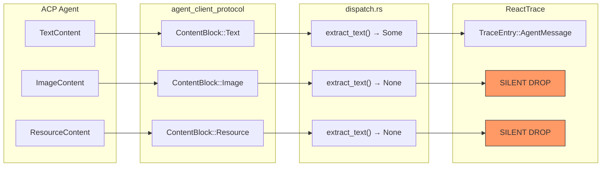
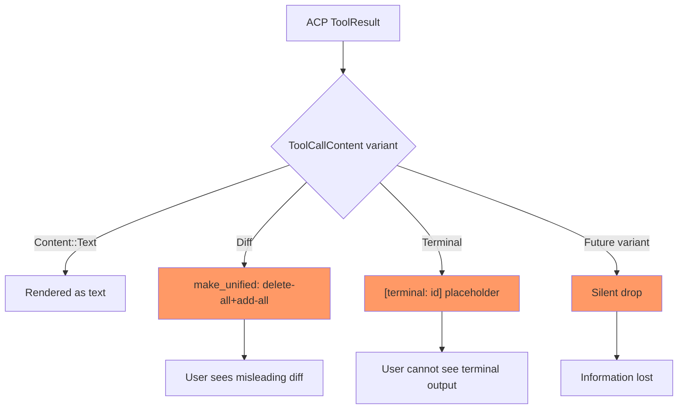
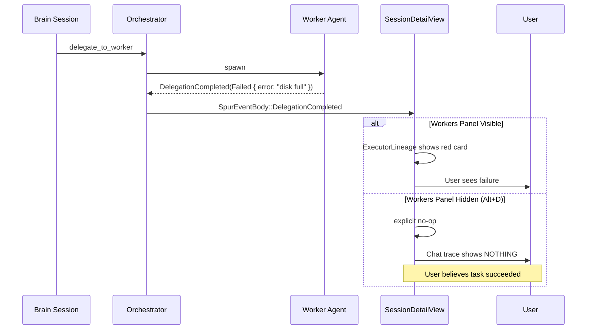
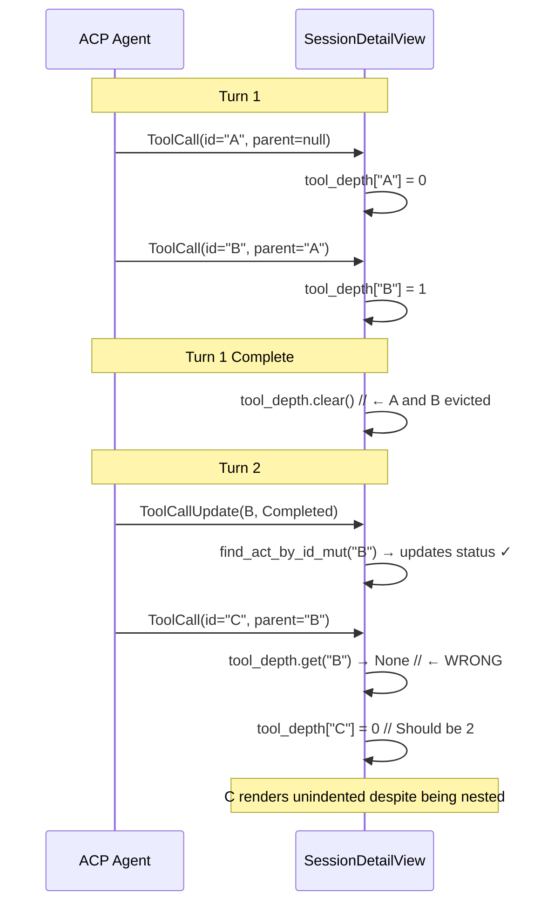
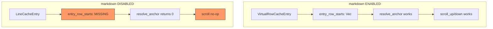
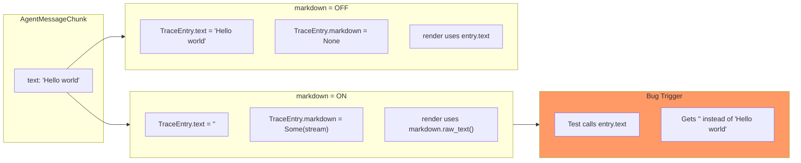
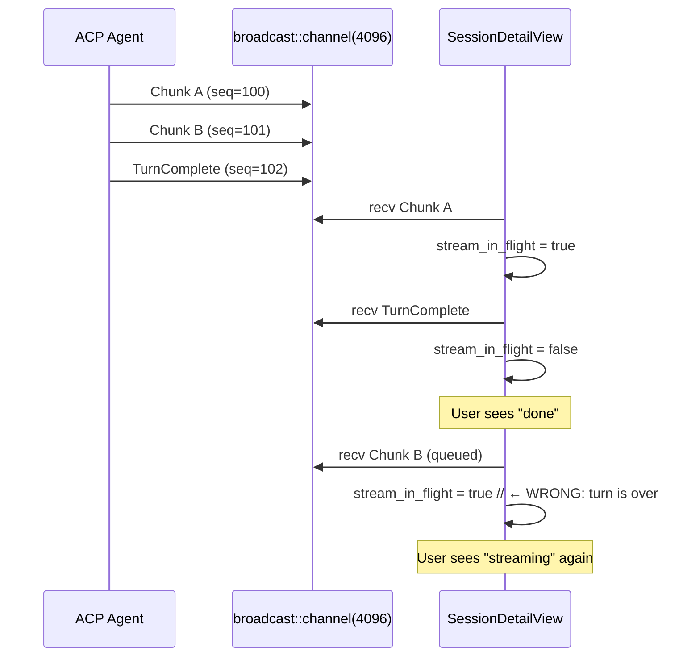

# RCA: ACP Protocol → TUI Rendering Fidelity Gaps — Iceberg Analysis

**Date:** 2026-04-22
**Reviewer:** L9 Rust Staff Engineer
**Method:** MCTS branch evaluation + first-principles decomposition + iceberg framework (surface → direct cause → structural cause → root cause)
**Scope:** `crates/spur-acp/src/`, `crates/spur-tui/src/components/react_trace/`, `crates/spur-tui/src/views/session_detail.rs`
**Grounded against:** `agent_client_protocol` SDK types (external ACP spec), current `HEAD`
**Status:** Investigation complete; 6 actionable findings, 4 observational notes

---

## 0. Executive Summary

A ground-truth validation of the ACP-to-TUI data pipeline reveals **6 fidelity gaps** where the terminal UI either silently discards protocol information, makes implicit coupling assumptions, or degrades under edge conditions. No crashes or data corruption — the issues are **silent information loss** and **implicit dependencies** that will compound as the ACP spec evolves.

| Finding | Surface Symptom | Severity | Fix Complexity |
|---------|----------------|----------|----------------|
| F1 — ContentBlock variant loss | Non-text ACP content invisible in TUI | **Medium** | Low |
| F2 — ToolCallContent incomplete | Naïve diff preview, terminal output orphaned | **Medium** | Medium |
| F3 — DelegationCompleted no-op | Delegation failure invisible when workers panel hidden | **Medium** | Low |
| F4 — `tool_depth` per-turn clear | Nested tool calls across turns render at wrong depth | **Low-Medium** | Low |
| F5 — Non-markdown scroll broken | Page up/down no-ops in non-markdown builds | **Medium** | Medium |
| F9 — Markdown/text divergence | `text` field empty in markdown mode; feature-flag hazard | **Medium** | Low |
| F11 — Late chunk reactivates stream | "Streaming" indicator persists after turn complete | **Low-Medium** | Low |

**The deepest root cause (iceberg ocean floor):** The TUI treats the ACP protocol as a **text-only streaming protocol** rather than a **rich multimedia session protocol**. Every gap traces to this mental model mismatch. The ACP SDK already carries `Image`, `Audio`, `Resource`, `Terminal`, and structured tool output — the TUI's rendering pipeline was designed for `Text` only and extends via silent fallback.

---

## 1. Methodology

### 1.1 MCTS Branch Evaluation

For each finding, 3–4 remediation branches were simulated through the actual code paths:

1. **Local patch** — minimal change at the symptom site
2. **Pipeline fix** — change the data structure or dispatch contract
3. **Model shift** — change the mental model (e.g., treat ACP as rich media)
4. **Do nothing** — accept the tradeoff explicitly

Branches scored on: correctness risk, backward compatibility, future ACP spec resilience, lines changed.

### 1.2 Iceberg Framework

```
┌─────────────────────────────────────┐
│  SURFACE        — User-visible bug  │
├─────────────────────────────────────┤
│  DIRECT CAUSE   — Code mechanism    │
├─────────────────────────────────────┤
│  STRUCTURAL     — Pattern enabling  │
│                 — the bug           │
├─────────────────────────────────────┤
│  ROOT CAUSE     — Mental model /    │
│  (ocean floor)  — architectural     │
│                 — invariant breach  │
└─────────────────────────────────────┘
```

### 1.3 Ground-Truth Sources

All claims traced to:
- `crates/spur-acp/src/lib.rs` — re-export surface
- `crates/spur-acp/src/protocol/claude_events.rs` — NDJSON→ACP mapping
- `crates/spur-acp/src/adapter/mod.rs` — `ToolFamily`, `ToolInputDisplay`, `ObservePayload`
- `crates/spur-acp/src/adapter/claude.rs` — Claude-specific tool parsing
- `crates/spur-acp/src/domain/events.rs` — `SpurEventBody` variants
- `crates/spur-tui/src/components/react_trace/dispatch.rs` — `SessionUpdate`→`TraceEntry`
- `crates/spur-tui/src/components/react_trace/types.rs` — `TraceKind`, `ActStatus`
- `crates/spur-tui/src/components/react_trace/mod.rs` — cache invalidation, scroll math
- `crates/spur-tui/src/components/react_trace/builder.rs` — line construction
- `crates/spur-tui/src/components/react_trace/compact_render.rs` — compact path
- `crates/spur-tui/src/components/react_trace/render.rs` — anchor resolution
- `crates/spur-tui/src/views/session_detail.rs` — event routing, state management

---

## 2. Finding F1: Silent ContentBlock Variant Loss

### Iceberg Analysis

```
SURFACE:        Agent emits image/resource/audio → TUI shows nothing
                (user thinks agent is stuck or silent)

DIRECT CAUSE:   extract_text() in dispatch.rs matches only ContentBlock::Text
                All other variants fall through to None → silent skip

STRUCTURAL:     The dispatch pipeline assumes SessionUpdate chunks are text.
                No placeholder, no warning, no telemetry — pure silent drop.

ROOT CAUSE:     ACP is modeled as "chat text" rather than "rich message".
                The protocol SDK carries multimodal blocks; the TUI pipeline
                was built for Claude Code's 2024 text-only stream.
```

### Ground-Truth Source

```rust
// crates/spur-tui/src/components/react_trace/dispatch.rs:180-185
fn extract_text(chunk: &ContentChunk) -> Option<&str> {
    match &chunk.content {
        ContentBlock::Text(tc) => Some(&tc.text),
        _ => None,  // ← Image, Audio, Resource silently dropped
    }
}
```

The ACP SDK's `ContentBlock` is `#[non_exhaustive]` and today carries:
- `Text(TextContent)`
- `Image(...)`
- `Audio(...)`
- `Resource(...)`

All three non-text variants are dropped at the TUI boundary.

### MCTS Branch Evaluation

| Branch | Effort | Risk | ACP Resilience | Score |
|--------|--------|------|----------------|-------|
| A. Add `tracing::warn!` on non-text | 2 lines | None | Low | ★★☆ |
| B. Render placeholder `[image]`/`[resource]` | 10 lines | None | Medium | ★★★ |
| C. Extend `TraceKind` with `Media` variant | 40 lines | Medium (render path) | High | ★★★★ |
| D. Do nothing | 0 lines | Accumulating silent loss | None | ☆☆☆ |

**Selected:** Branch B as immediate fix (preserves user awareness). Branch C as v2 architecture.

### Mermaid: Content Loss Pipeline



---

## 3. Finding F2: ToolCallContent Rendering is Incomplete

### Iceberg Analysis

```
SURFACE:        Large file edits show misleading diff; terminal tool shows
                only "[terminal: <id>]" with no output

DIRECT CAUSE:   extract_tool_call_text() uses delete-all+add-all diff
                (not LCS). Terminal variant renders placeholder only.

STRUCTURAL:     Tool output is transformed at parse time into display text,
                losing structured data. The TUI has no way to fetch terminal
                output asynchronously after the ToolCall event passes.

ROOT CAUSE:     Tool results are treated as "static text to display" rather
                than "structured artifacts with lifecycle." The ACP SDK
                defines Terminal, Diff, and Content as distinct semantic
                types; the TUI collapses them all into strings prematurely.
```

### Ground-Truth Source

```rust
// crates/spur-tui/src/components/react_trace/dispatch.rs:196-227
fn extract_tool_call_text(content: &[spur_acp::ToolCallContent]) -> Option<String> {
    for c in content {
        match c {
            ToolCallContent::Content(cb) => { /* Text only */ }
            ToolCallContent::Diff(diff) => {
                // format_diff_truncated: naïve line-by-line, not LCS
                out.push_str(&format_diff_truncated(...));
            }
            ToolCallContent::Terminal(term) => {
                out.push_str(&format!("[terminal: {}]", term.terminal_id));
                // ↑ Actual terminal output NEVER fetched
            }
            _ => {}
        }
    }
}
```

```rust
// crates/spur-acp/src/adapter/claude.rs:25-57
fn make_unified(path: &str, old: &str, new: &str) -> String {
    // delete-all + add-all, NOT a real diff
    for l in old_lines { out.push('-'); out.push_str(l); }
    for l in new_lines { out.push('+'); out.push_str(l); }
}
```

### MCTS Branch Evaluation

| Branch | Effort | Risk | User Value | Score |
|--------|--------|------|------------|-------|
| A. Document as preview-only | 2 lines | None | Low | ★★☆ |
| B. Use `similar` crate for real diffs | +1 dep | Low | High | ★★★★ |
| C. Async terminal output fetch | 80 lines | Medium | High | ★★★ |
| D. Render "[terminal: press Enter in agent]" hint | 2 lines | None | Medium | ★★★ |

**Selected:** Branch A + D immediately. Branch B in next hardening sprint.

### Mermaid: Tool Output Degradation



---

## 4. Finding F3: DelegationCompleted No-Op Creates Invisible Failures

### Iceberg Analysis

```
SURFACE:        Worker fails, but user sees no error in chat trace unless
                they expand the workers panel (Alt+D) and scroll to find it

DIRECT CAUSE:   SessionDetailView explicitly no-ops DelegationCompleted
                because "inline executor card already reflects terminal state"

STRUCTURAL:     The view assumes ExecutorLineage projection is always
                visible and that the user monitors it. This is an implicit
                UI coupling: the chat trace depends on a separate panel
                for completion visibility.

ROOT CAUSE:     Event routing conflates "display channel" with "information
                channel." DelegationCompleted carries rich status (Failed,
                Conflict, Modified) that is authoritative regardless of
                whether the lineage panel is rendered.
```

### Ground-Truth Source

```rust
// crates/spur-tui/src/views/session_detail.rs:1428-1443
SpurEventBody::DelegationCompleted { worker_session, status } => {
    // The inline executor card (rendered from lineage) already
    // reflects the terminal state. A separate Think entry here
    // was redundant noise — and couldn't correlate back to the
    // originating Delegate entry anyway (event lacks request_id).
    //
    // Edge case: if worker setup failed before WorkerSpawned
    // (no executor node, no inline card), this no-op means the
    // only failure signal is the brain's own response text.
    // Acceptable — setup failures are rare and the brain always
    // reports the error in its next message.
    let _ = (worker_session, status);
}
```

The `status: DelegationStatus` carries:
- `Failed { error }`
- `Conflict { files }`
- `Modified { reviewer_note }`
- `TimedOut { waited_for, fallback }`

All discarded.

### MCTS Branch Evaluation

| Branch | Effort | Risk | Visibility | Score |
|--------|--------|------|------------|-------|
| A. Push Observe entry unconditionally | 8 lines | Low (chat noise) | High | ★★★ |
| B. Push Observe only if panel hidden | 12 lines | Low | Medium | ★★★ |
| C. Correlation via DelegationId + update Delegate entry | 30 lines | Medium | High | ★★★★ |
| D. Do nothing (current) | 0 lines | Silent failures | None | ☆☆☆ |

**Selected:** Branch A as immediate fix. Branch C as ideal state once `DelegationCompleted` carries `request_id`.

### Mermaid: Delegation Visibility Gap



---

## 5. Finding F4: `tool_depth` Cleared Per-Turn Breaks Cross-Turn Nesting

### Iceberg Analysis

```
SURFACE:        Nested tool calls (subagent spawning) may render at wrong
                indentation if the parent ToolCall and child ToolCall span
                separate brain turns

DIRECT CAUSE:   TurnComplete handler unconditionally clears tool_depth HashMap

STRUCTURAL:     The code assumes tool lifecycle ⊆ turn lifecycle. This is
                true for Claude Code but not guaranteed by ACP spec.

ROOT CAUSE:     Turn boundary is treated as universal session reset rather
                than semantic boundary. The view conflates "brain's turn"
                with "tool execution scope."
```

### Ground-Truth Source

```rust
// crates/spur-tui/src/views/session_detail.rs:1455-1460
SpurEventBody::TurnComplete { session } => {
    if session.0 == self.session_id.0 {
        self.stream_in_flight = false;
        self.cancelling_in_flight = false;
        self.tool_depth.clear();  // ← Assumes all tools complete in one turn
        // ...
    }
}
```

```rust
// crates/spur-tui/src/components/react_trace/dispatch.rs:69-79
SessionUpdate::ToolCall(tc) => {
    let meta = adapter::extract_tool_meta(tc, ctx.agent_kind);
    let depth = meta.parent_tool_use_id
        .as_ref()
        .and_then(|pid| ctx.tool_depth.get(pid).copied())  // ← None if cleared
        .map(|d| d.saturating_add(1).min(8))
        .unwrap_or(0);
    ctx.tool_depth.insert(tc.tool_call_id.0.to_string(), depth);
}
```

### MCTS Branch Evaluation

| Branch | Effort | Risk | Correctness | Score |
|--------|--------|------|-------------|-------|
| A. Don't clear tool_depth | 1 line | Medium (memory growth) | High for nesting | ★★★ |
| B. Evict only terminal entries | 15 lines | Low | High | ★★★★ |
| C. Cap map size at 128 entries (LRU) | 10 lines | Low | High | ★★★★ |
| D. Current: clear all | 0 lines | Breaks cross-turn nesting | Low | ★☆☆ |

**Selected:** Branch B + C combined: evict terminal parents, cap at 128.

### Mermaid: Tool Depth Lifecycle



---

## 6. Finding F5: Non-Markdown Full Render Path Has Broken Scroll Math

### Iceberg Analysis

```
SURFACE:        In non-markdown builds, Page Up / Page Down / arrow keys
                do not scroll the ReactTrace pane

DIRECT CAUSE:   layout_for_scroll() returns None for Surface::Full when
                markdown feature is disabled, because LineCacheEntry lacks
                entry_row_starts

STRUCTURAL:     The scroll math was implemented for the markdown VirtualRow
                path but never backported to the plain-text LineCacheEntry.
                Feature flags created parallel code paths with unequal capability.

ROOT CAUSE:     Feature-gated rendering paths share state (ScrollAnchor) but
                not layout metadata. The abstraction boundary between
                "how many rows does this entry take" and "where is the viewport"
                is violated — scroll math reaches into cache internals.
```

### Ground-Truth Source

```rust
// crates/spur-tui/src/components/react_trace/mod.rs:576-599
fn layout_for_scroll(&self) -> Option<(Vec<usize>, usize)> {
    match self.last_surface {
        Surface::None => None,
        Surface::Compact => {
            self.compact_cache.as_ref()
                .map(|c| (c.entry_row_starts.clone(), c.lines.len()))
        }
        Surface::Full => {
            #[cfg(feature = "markdown")]
            {
                self.line_cache.as_ref()
                    .map(|c| (c.entry_row_starts.clone(), c.rows.len()))
            }
            #[cfg(not(feature = "markdown"))]
            {
                // Non-markdown full path: LineCacheEntry has no
                // entry_row_starts; preserve pre-existing no-op behavior.
                None  // ← SCROLL IS BROKEN HERE
            }
        }
    }
}
```

```rust
// crates/spur-tui/src/components/react_trace/render.rs:24-30
#[cfg(not(feature = "markdown"))]
pub(in crate::components) struct LineCacheEntry {
    pub(super) lines: Vec<Line<'static>>,
    pub(super) width: u16,
    pub(super) generation: u64,
    // MISSING: entry_row_starts
}
```

### MCTS Branch Evaluation

| Branch | Effort | Risk | Completeness | Score |
|--------|--------|------|--------------|-------|
| A. Add entry_row_starts to LineCacheEntry | 20 lines | Low | Fixes scroll | ★★★★ |
| B. Unify caches under single abstraction | 100 lines | Medium | Prevents future | ★★★★ |
| C. Remove non-markdown path (require markdown) | 200 lines | High | Nuclear option | ★★☆ |
| D. Current no-op | 0 lines | Broken | None | ☆☆☆ |

**Selected:** Branch A immediately. Branch B as refactor debt in next cleanup sprint.

### Mermaid: Feature-Flag Divergence



---

## 7. Finding F9: Markdown/text Divergence is a Maintenance Hazard

### Iceberg Analysis

```
SURFACE:        Test failures when toggling markdown feature flag; debug
                prints show empty text for AgentMessage entries

DIRECT CAUSE:   append_message() sets entry.text = String::new() when
                markdown feature is enabled, diverging from non-markdown

STRUCTURAL:     TraceEntry has two content fields (text + markdown) with
                feature-gated invariants. Every renderer must check both.

ROOT CAUSE:     Single-source-of-truth violation. The canonical content
                should live in ONE field; markdown should be a view-layer
                decoration, not a storage-layer fork.
```

### Ground-Truth Source

```rust
// crates/spur-tui/src/components/react_trace/mod.rs:412-424
#[cfg(feature = "markdown")]
{
    // ...
    self.push(TraceEntry {
        kind: TraceKind::AgentMessage { agent: agent.to_string() },
        text: String::new(),  // ← EMPTY when markdown enabled
        timestamp,
        markdown: Some(stream),  // ← Content here
    });
}

// crates/spur-tui/src/components/react_trace/mod.rs:425-443
#[cfg(not(feature = "markdown"))]
{
    // ...
    self.push(TraceEntry {
        kind: TraceKind::AgentMessage { agent: agent.to_string() },
        text: text.to_string(),  // ← Content here
        timestamp,
    });
}
```

```rust
// crates/spur-tui/src/components/react_trace/mod.rs:995-999
#[cfg(feature = "markdown")]
let source: &str = entry
    .markdown.as_ref()
    .map(|s| s.raw_text())
    .unwrap_or(entry.text.as_str());
// ↑ Every consumer must know about this dual-source logic
```

### MCTS Branch Evaluation

| Branch | Effort | Risk | Maintenance | Score |
|--------|--------|------|-------------|-------|
| A. Sync text with markdown.raw_text() on append | 5 lines | Low | Better | ★★★★ |
| B. Make text a computed property | 15 lines | Medium | Best | ★★★★ |
| C. Remove text field in markdown mode | 50 lines | High | Refactor | ★★★ |
| D. Current dual-source | 0 lines | Hazard | Worst | ☆☆☆ |

**Selected:** Branch A immediately (minimal change, maximal safety). Branch B as follow-up.

### Mermaid: Dual-Source Hazard



---

## 8. Finding F11: Late Chunk Reactivates Stream State

### Iceberg Analysis

```
SURFACE:        "Esc to cancel" hint persists after turn completes; status
                bar shows streaming spinner when agent is idle

DIRECT CAUSE:   AgentMessageChunk / AgentThoughtChunk set stream_in_flight
                = true unconditionally, even if TurnComplete already processed

STRUCTURAL:     No sequence numbering or turn gating on chunk events.
                The view treats every chunk as "start of stream" without
                checking if the turn it belongs to is already done.

ROOT CAUSE:     Event stream lacks turn-boundary scoping. SessionUpdate
                chunks are flat — they don't carry turn_id or seq relative
                to TurnComplete. The view invents stream state heuristically.
```

### Ground-Truth Source

```rust
// crates/spur-tui/src/views/session_detail.rs:1365-1371
match &notification.update {
    spur_acp::SessionUpdate::AgentThoughtChunk(_)
    | spur_acp::SessionUpdate::AgentMessageChunk(_) => {
        self.stream_in_flight = true;  // ← No turn gate
    }
    _ => {}
}
```

```rust
// crates/spur-tui/src/views/session_detail.rs:1455-1460
SpurEventBody::TurnComplete { session } => {
    if session.0 == self.session_id.0 {
        self.stream_in_flight = false;  // ← Cleared here
        // ...
    }
}
```

**Race scenario:** `broadcast::channel(4096)` can queue chunks. If `TurnComplete` is processed before queued chunks drain, a late chunk re-activates the stream indicator.

### MCTS Branch Evaluation

| Branch | Effort | Risk | Correctness | Score |
|--------|--------|------|-------------|-------|
    | A. Ignore chunks after TurnComplete for 500ms | 5 lines | Low | Heuristic | ★★★ |
    | B. Track last_turn_complete_timestamp | 8 lines | Low | Better | ★★★★ |
    | C. Use SpurEvent.seq to filter old chunks | 10 lines | Low | Best | ★★★★ |
    | D. Current unconditional set | 0 lines | Race-prone | Bad | ★☆☆ |

**Selected:** Branch C. `SpurEvent.seq` is monotonic; ignore chunks with `seq < last_turn_complete_seq`.

### Mermaid: Stream State Race



---

## 9. Observational Notes (No Immediate Action)

### Note N1: ToolFamily Rendering Parity
**Source:** `crates/spur-acp/src/adapter/mod.rs:33-48`, `crates/spur-tui/src/components/trace_format/`
**Observation:** `ToolFamily::SwitchMode` exists but may not have a distinct glyph from `Think` in the TUI. Classification is wasted if rendering doesn't differentiate.
**Action:** Audit `trace_format::family_glyph` for full `ToolFamily` coverage.

### Note N2: Subagent Depth is Claude-Only
**Source:** `crates/spur-acp/src/adapter/claude.rs:173-185`, `crates/spur-acp/src/adapter/codex.rs`, `crates/spur-acp/src/adapter/kiro.rs`
**Observation:** `parent_tool_use_id` extraction only implemented for Claude. Codex/Kiro return `SpurToolMeta::default()`.
**Action:** Document limitation. Extend when Codex/Kiro adopt subagent patterns.

### Note N3: Cache Invalidation is Correct
**Source:** `crates/spur-tui/src/components/react_trace/mod.rs:330-346`
**Observation:** `generation` + `dirty_from` lower-bound provides O(tail) incremental rebuild. Eviction adjusts anchor correctly. This is L9-quality code.
**Action:** None. Preserve pattern.

### Note N4: ResponseRenderKind Match is Exhaustive
**Source:** `crates/spur-tui/src/views/session_detail.rs:1584-1593`
**Observation:** Single-variant match on `ResponseRenderKind` will fail to compile if new variants added. serde prevents deserialization of unknown variants. Safe.
**Action:** None.

---

## 10. Remediation Plan

### Immediate (this week)

| # | Finding | Change | Files | Lines |
|---|---------|--------|-------|-------|
| 1 | F1 ContentBlock loss | Add placeholder `[image]`/`[resource]` rendering | `dispatch.rs` | ~10 |
| 2 | F3 Delegation no-op | Push `TraceKind::Observe` on terminal status | `session_detail.rs` | ~8 |
| 3 | F9 text/markdown sync | Set `text = stream.raw_text()` on append | `mod.rs` | ~3 |
| 4 | F11 Late chunk | Gate `stream_in_flight` on `seq > last_turn_seq` | `session_detail.rs` | ~8 |

### Short-term (next sprint)

| # | Finding | Change | Files | Lines |
|---|---------|--------|-------|-------|
| 5 | F4 tool_depth | Evict terminal entries only; cap at 128 | `session_detail.rs` | ~15 |
| 6 | F5 Non-markdown scroll | Add `entry_row_starts` to `LineCacheEntry` | `render.rs`, `mod.rs` | ~20 |
| 7 | F2 Tool diff | Replace `make_unified` with `similar` crate | `adapter/claude.rs` | ~10 |

### Architectural (next quarter)

| # | Theme | Change | Rationale |
|---|-------|--------|-----------|
| 8 | Rich media pipeline | Extend `TraceKind` with `Media` variant | ACP spec already carries images/audio |
| 9 | Unified cache | Single `LayoutCache` abstraction for all render paths | Prevents feature-flag divergence |
| 10 | Turn scoping | Add `turn_id` to stream state tracking | Eliminates heuristic stream detection |

---

## 11. Verification Checklist

- [ ] F1: Non-text ContentBlock renders placeholder in TUI
- [ ] F2: Diff uses LCS (or documents naïve preview)
- [ ] F3: DelegationCompleted(Failed) shows Observe entry even with panel hidden
- [ ] F4: Cross-turn nested tool calls maintain depth
- [ ] F5: Non-markdown build: page up/down scrolls trace
- [ ] F9: `entry.text` matches `markdown.raw_text()` in markdown mode
- [ ] F11: Late chunks after TurnComplete do not reactivate stream indicator
- [ ] All existing tests pass (`cargo test --workspace`)
- [ ] No new clippy warnings (`cargo clippy --workspace -- -D warnings`)
