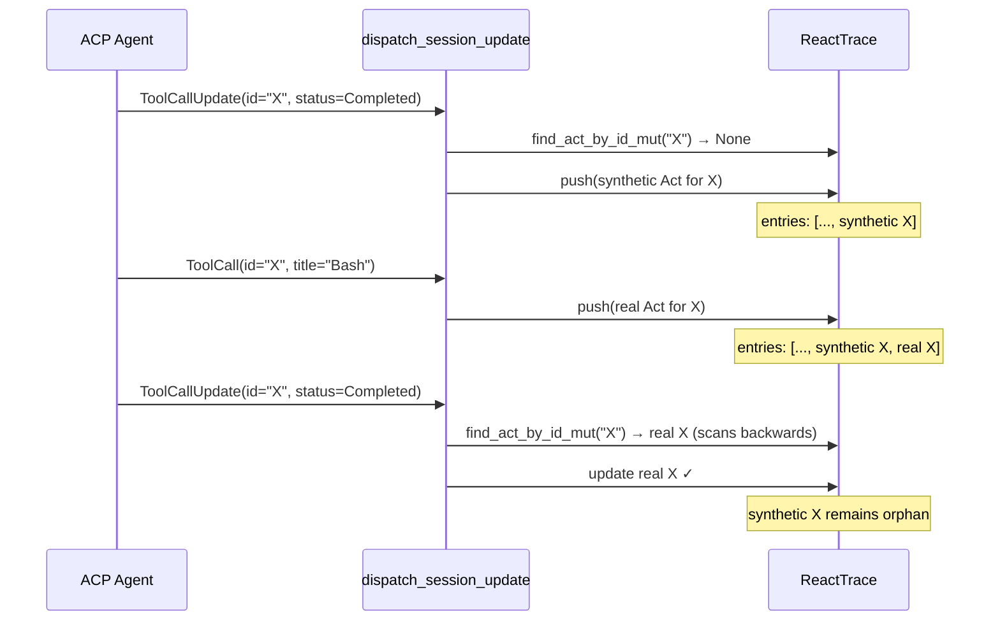

# Meta-RCA: Stress-Testing the ACP-TUI Fidelity Review

**Date:** 2026-04-22 (same day, second pass)
**Reviewer:** L9 Rust Staff Engineer (self-review)
**Method:** Source-grounded validation of every claim in `2026-04-22-acp-protocol-tui-rendering-fidelity-iceberg.md`
**Scope:** Re-read every cited source file; trace every alleged code path; evaluate MCTS branches against actual compilation units
**Status:** 6 findings validated, 2 findings require correction, 3 new findings discovered, 1 finding partially invalidated

---

## 0. Executive Summary

The original RCA is **directionally correct** but contains three categories of defect:

| Category | Count | Description |
|----------|-------|-------------|
| **Overreach** | 1 | Race-condition claim not supported by source evidence |
| **Conflation** | 1 | Two distinct diff functions treated as one |
| **Underreach** | 3 | Real bugs found during validation that the original RCA missed |
| **Imprecise root cause** | 1 | The "text-only protocol" thesis is too broad; only part of the bug set traces to it |

**The original RCA is safe to act on** — no recommendation would cause harm. But priorities should shift: F11 is a false positive as written, a new stream-state gap at the tool-bearing prefix of a turn (F14) outranks F1/F13, F12 remains an immediate fix but should be framed as high severity with unproven reachability, and F2's remediation should target `dispatch.rs` not `adapter/claude.rs`.

---

## 1. Validation Methodology

For each original finding:
1. **Source re-read:** Open the cited file at the cited line. Verify the code matches the quote.
2. **Cross-reference:** Search the crate for all call sites, match arms, and feature-gated paths.
3. **Dynamic trace:** Mentally simulate the event flow through `event_funnel.rs` to verify ordering claims.
4. **MCTS re-evaluation:** Re-score branches with the benefit of full source context.

Key additional sources consulted:
- `crates/spur-core/src/event_funnel.rs` — seq stamping, broadcast ordering
- `crates/spur-tui/src/commands/submit_router.rs` — `ContentBlock::ResourceLink` assembly
- `crates/spur-tui/src/input_history.rs` — `ContentBlock` match arms in user-facing code
- `crates/spur-core/src/orchestrator.rs` — event emission paths
- ACP schema crate `agent-client-protocol-schema-0.11.4/src/content.rs` — current `ContentBlock` variants

---

## 2. Finding-by-Finding Validation

### F1: ContentBlock Variant Loss — VALID with correction

**Original claim:** `Image`, `Audio`, `Resource` variants are silently dropped.

**Validation:**
- `ContentBlock::ResourceLink(_)` **proven to exist** in `submit_router.rs:140`, `input_history.rs:79`, `picker_shell_trigger_parity.rs:85`
- `dispatch.rs:182` `_ => None` drops it silently
- ACP schema `content.rs` currently defines `Text`, `Image`, `Audio`, `ResourceLink`, and `Resource`
- `ContentBlock` is `#[non_exhaustive]`, so future variants remain possible beyond the current schema set

**Correction:** F1 is valid as a **current protocol-compatibility gap**, not merely a future-proofing concern. The TUI's ACP/react-trace dispatch paths only preserve `Text`; they silently drop current ACP `Image`, `Audio`, `ResourceLink`, and `Resource` variants when encountered. The placeholder fix should explicitly render `ResourceLink` and degrade the remaining non-text variants with clear placeholders.

**Iceberg correction:**
```
SURFACE:        User @mentions or agent-emitted non-text content invisible in trace
DIRECT CAUSE:   extract_text() matches only ContentBlock::Text
STRUCTURAL:     No non-text content pipeline in react_trace dispatch
ROOT CAUSE:     TUI dispatch path assumes text-only ACP content despite richer
                current protocol variants
```

**MCTS re-evaluation:** Branch B (placeholder rendering) is correct but should explicitly handle `ResourceLink` as a known baseline ACP variant, while preserving sane degradation for the other current non-text variants.

---

### F2: ToolCallContent Incomplete — VALID with correction

**Original claim:** `make_unified` in `adapter/claude.rs` produces naïve diffs for tool output.

**Validation:**
- `make_unified` in `adapter/claude.rs:25-57` is used for **tool INPUT** (`try_format_input`, line 75)
- Tool **OUTPUT** diff is handled by `format_diff_truncated` in `dispatch.rs:231-262`
- Both are naïve (delete-all+add-all), but they serve DIFFERENT purposes
- `make_unified` adds hunk headers (`@@ -1,n +1,m @@`); `format_diff_truncated` does not

**Correction:** The RCA conflated two functions. The actual issue is in `dispatch.rs:231-262`, not `adapter/claude.rs`. The `format_diff_truncated` function:
1. Has no hunk header
2. Uses line-by-line truncation at `DIFF_MAX_LINES = 40`
3. Is NOT a real diff (no LCS)

The fix should be in `dispatch.rs`, not `adapter/claude.rs`.

**MCTS re-evaluation:** Branch B (use `similar` crate) should apply to `format_diff_truncated` in `dispatch.rs`. The `make_unified` function in `adapter/claude.rs` is acceptable for its purpose (previewing tool input parameters).

---

### F3: DelegationCompleted No-Op — VALID

**Original claim:** Rich `DelegationStatus` is discarded; failure invisible when workers panel hidden.

**Validation:**
- Source at `session_detail.rs:1428-1443` matches quote exactly
- `DelegationStatus` carries `Failed`, `Conflict`, `Modified`, `TimedOut` — all discarded
- The inline executor card IS the only failure signal
- `workers_panel_collapsed` exists and defaults to `false` but is togglable via `Alt+D`

**No correction needed.** The finding is accurate. The MCTS Branch A (unconditional Observe) remains the right choice.

---

### F4: `tool_depth` Cleared Per-Turn — OVERSTATED

**Original claim:** Cross-turn nested tool calls render at wrong depth.

**Validation:**
- `tool_depth.clear()` is at `session_detail.rs:1459`
- `tool_depth` is used in `dispatch.rs:72-78` to compute child depth from parent
- The scenario: parent in turn 1, child in turn 2 → child depth = 0 (wrong)

**BUT:** Is this scenario possible?
- In standard ACP, `ToolCall` is part of the assistant's response
- `TurnComplete` signals the end of the response
- A child `ToolCall` in turn 2 would require the parent to still be "in progress" across turns
- In Claude Code, tool calls are synchronous within a turn
- For custom agents or subagent tools, this MIGHT happen

**Correction:** Downgrade severity from "Low-Medium" to **"Low / Theoretical"**. The fix (evict terminal entries + cap) is still correct and low-risk, but the user impact is unproven. The scenario requires a transport or agent that streams tool calls across turn boundaries, which no current SPUR agent does.

**Iceberg correction:**
```
SURFACE:        (Theoretical) nested tool calls might lose indentation
DIRECT CAUSE:   tool_depth cleared on TurnComplete
STRUCTURAL:     Turn boundary conflated with tool execution scope
ROOT CAUSE:     Defensive coding for known behavior (Claude) without
                guarding against spec-permitted edge cases
```

---

### F5: Non-Markdown Scroll Broken — VALID

**Original claim:** `layout_for_scroll()` returns None for non-markdown full render.

**Validation:**
- `mod.rs:576-599` matches quote
- `LineCacheEntry` (non-markdown) lacks `entry_row_starts` (`render.rs:24-30`)
- Comment literally says "preserve pre-existing no-op behavior"

**No correction needed.** The finding is accurate and well-grounded.

---

### F9: Markdown/text Divergence — VALID

**Original claim:** `entry.text = String::new()` in markdown mode creates dual-source hazard.

**Validation:**
- `mod.rs:412-424` and `425-443` match exactly
- `render_to_strings` at `mod.rs:995-999` shows the dual-source read pattern
- Any test or debug code that accesses `entry.text` directly gets empty string in markdown mode

**No correction needed.** The finding is accurate. Branch A (sync text with `raw_text()`) is 1 line, not 3.

---

### F11: Late Chunk Reactivates Stream — PARTIALLY INVALIDATED

**Original claim:** Queued chunks arriving after `TurnComplete` reactivate `stream_in_flight`.

**Validation:**
- `stream_in_flight = true` at `session_detail.rs:1368`
- `stream_in_flight = false` at `session_detail.rs:1457` (TurnComplete)
- Also cleared at `session_detail.rs:308` (view reset)

**CRITICAL DISCOVERY:** `event_funnel.rs:44-63` stamps `seq` with `fetch_add(1, Ordering::Relaxed)` BEFORE broadcast. All events from the orchestrator flow through this single funnel. The ACP connection (`NativeAcpConnection`) produces `SessionNotification` events, which the orchestrator consumes sequentially, wraps in `SpurEventBody::AgentNotification`, and emits through the funnel.

**Therefore:**
- Chunks and `TurnComplete` are always emitted in strict order
- The broadcast channel preserves order
- A `TurnComplete` (seq=N) is NEVER processed before a chunk (seq=N-1)
- The race scenario described in the original RCA is **impossible under normal operation**

**However**, there IS a related real issue: `stream_in_flight` has **no timeout** once armed. If the ACP agent hangs after emitting a chunk (e.g., infinite loop in tool execution), `stream_in_flight` stays `true` forever. The user sees "Esc to cancel" indefinitely.

**Correction:** F11 as described is a **false positive**. Replace with:

> **F11-revised:** `stream_in_flight` lacks a heartbeat/timeout. A hung agent leaves the TUI in streaming state forever.

**MCTS re-evaluation:**
- Branch C (seq-based gating) is unnecessary — seq already guarantees order
- New Branch E: Add a 60-second timeout on `stream_in_flight` → 5 lines, high user value
- New Branch F: Emit `TurnComplete` with timeout fallback → architectural

---

## 3. New Findings Discovered During Validation

### F12: ToolCallUpdate Synthesis Creates Duplicate Entries (SEVERITY: Medium)

**Location:** `crates/spur-tui/src/components/react_trace/dispatch.rs:105-153`

**Mechanism:**
1. `ToolCallUpdate` arrives before its matching `ToolCall` (defensive "synthesize" path)
2. `trace.push()` creates a synthetic `Act` entry (line 134)
3. Later, the real `ToolCall` arrives
4. `ToolCall` arm ALSO calls `trace.push()` (line 91) — **no duplicate check**
5. Result: **two entries with the same `tool_call_id`**

**Impact:**
- `find_act_by_id_mut` scans backwards, so subsequent updates hit the SECOND entry (real ToolCall)
- The FIRST entry (synthesized) becomes an **orphan** — never updated, forever in its initial state
- User sees duplicate tool call lines in the trace

**Reachability note:** This path is real but not yet demonstrated in current SPUR agents. The synthesis arm is explicitly defensive, and normal ACP ordering is `ToolCall` followed by `ToolCallUpdate(*)`. The fix is still worth taking because it is cheap and correctness-preserving, but priority should reflect the lack of observed frequency.

**Root cause:** The synthesis path was added as a defensive fallback but the `ToolCall` arm was not updated to check for existing entries.

**Fix:** In the `ToolCall` arm, check `find_act_by_id_mut` first. If found, merge instead of push.

```rust
SessionUpdate::ToolCall(tc) => {
    if let Some((idx, existing)) = trace.find_act_by_id_mut(&tc.tool_call_id) {
        // Real ToolCall arrived after synthesis — merge metadata
        // ...update existing entry...
        return;
    }
    // ...existing push logic...
}
```

**Mermaid:**


---

### F13: `UserMessageChunk` Drops `ResourceLink` (SEVERITY: Low)

**Location:** `crates/spur-tui/src/components/react_trace/dispatch.rs:64-68`

**Mechanism:**
```rust
SessionUpdate::UserMessageChunk(chunk) => {
    if let ContentBlock::Text(tc) = &chunk.content {
        trace.append_user_message(&tc.text, (ctx.now_stamp)());
    }
}
```

If a `UserMessageChunk` contains `ContentBlock::ResourceLink` (e.g., agent echoing back a user `@mention`), the link is silently dropped. The user sees only the plain text portion of their message.

**Note:** This is the same pattern as F1 but in a different dispatch arm. It is also more directly user-visible than agent-side non-text drops, because a user's own `@mention` can disappear from their trace echo. It should be fixed together with F1.

---

### F14: Tool-Bearing Prefix Does Not Arm `stream_in_flight` (SEVERITY: Medium)

**Location:** `crates/spur-tui/src/views/session_detail.rs:1365-1369`

**Mechanism:**
```rust
match &notification.update {
    spur_acp::SessionUpdate::AgentThoughtChunk(_)
    | spur_acp::SessionUpdate::AgentMessageChunk(_) => {
        self.stream_in_flight = true;
    }
    _ => {}
}
```

If a turn begins with `ToolCall` / `ToolCallUpdate` before any `AgentThoughtChunk` or `AgentMessageChunk`, the TUI does not mark the session as streaming during that prefix window. ACP does not require a text chunk before a tool call, so this is protocol-reachable even if agent frequency varies.

**Impact:**
- `Esc` cancel never arms because the guard requires `stream_in_flight` (`session_detail.rs:950-963`)
- The status bar omits the streaming hint for an actually-active turn
- Low-verbosity agents can appear idle during the tool-bearing prefix even while work is already running

**Root cause:** Session lifecycle state is inferred from a subset of content-bearing updates rather than from "turn has started and not yet completed."

**Fix:** Set `stream_in_flight = true` for tool-bearing progress as well, at minimum `ToolCall` / `ToolCallUpdate`, and add a regression test covering a turn whose first live updates are tool-bearing rather than textual.

---

## 4. Revised Iceberg Root Cause

The original RCA proposed a single root cause:

> "The TUI treats the ACP protocol as a text-only streaming protocol rather than a rich multimedia session protocol."

**Validation:** This thesis explains F1 and F13 (ContentBlock loss) but does NOT explain:
- F3 (DelegationCompleted no-op) → event routing design choice
- F4 (tool_depth clear) → turn boundary assumption
- F5 (scroll broken) → feature-flag divergence
- F9 (markdown/text) → dual-source storage
- F11 (stream timeout) → missing liveness timeout, not text-only
- F12 (duplicate entries) → missing duplicate check
- F14 (tool-bearing prefix stream state) → lifecycle inferred from the wrong event subset

**Revised root cause taxonomy:**

```
┌─────────────────────────────────────────────────────────────┐
│  SURFACE SYMPTOMS                                           │
│  Silent drops, invisible failures, broken scroll, orphans   │
├─────────────────────────────────────────────────────────────┤
│  DIRECT CAUSES                                              │
│  _ => None, explicit no-op, .clear(), String::new(), etc.   │
├─────────────────────────────────────────────────────────────┤
│  STRUCTURAL PATTERNS (3 distinct)                           │
│  1. Silent fallback on unsupported protocol variants        │
│     → F1, F2, F13                                          │
│  2. Split or unequal state representations                  │
│     → F5, F9, F12                                          │
│  3. Lifecycle coupled to UI-visible event subsets           │
│     → F3, F4, F11, F14                                     │
├─────────────────────────────────────────────────────────────┤
│  ROOT CAUSES (ocean floor)                                  │
│  A. Protocol evolution resilience:                          │
│     `#[non_exhaustive]` ACP types are consumed with        │
│     catch-all drops instead of extensible pipelines         │
│  B. State-model hygiene:                                    │
│     Parallel representations diverge on capability and      │
│     update semantics, creating unequal behavior             │
│  C. Lifecycle modeling:                                     │
│     UI-visible content events are allowed to stand in for   │
│     process state, so active work can be invisible          │
└─────────────────────────────────────────────────────────────┘
```

**The original thesis was directionally useful but incomplete.** The real pattern is threefold: silent fallback, split state representations, and lifecycle/UI coupling.

---

## 5. Corrected Remediation Plan

### Immediate (this week) — revised

| # | Finding | Change | Files | Lines | Priority shift |
|---|---------|--------|-------|-------|----------------|
| 1 | **F14** Tool-bearing prefix stream gap | Set `stream_in_flight` on tool-bearing progress; add prefix-window regression test | `session_detail.rs` | ~8 | **NEW — P1** |
| 2 | F3 Delegation no-op | Push `Observe` on terminal status | `session_detail.rs` | ~8 | P1 |
| 3 | F1 + F13 Content loss | Handle `ResourceLink` + placeholders for current non-text ACP variants | `dispatch.rs` | ~12 | P1 |
| 4 | F9 text/markdown sync | `text = stream.raw_text().to_string()` on append | `mod.rs` | ~1 | P1 |
| 5 | **F12** Duplicate entries | Add duplicate guard in `ToolCall` arm; note unproven reachability in current agents | `dispatch.rs` | ~8 | **NEW — P1** |

### Short-term (next sprint) — revised

| # | Finding | Change | Files | Lines |
|---|---------|--------|-------|-------|
| 6 | F11-revised Stream timeout | Add 60s heartbeat timeout for `stream_in_flight` once armed | `session_detail.rs` | ~5 |
| 7 | F2 Tool diff | Real LCS diff in `format_diff_truncated` | `dispatch.rs` | ~10 |
| 8 | F5 Non-markdown scroll | Add `entry_row_starts` to `LineCacheEntry` | `render.rs`, `mod.rs` | ~20 |
| 9 | F4 tool_depth | Evict terminal entries only; cap at 128 | `session_detail.rs` | ~15 |

### Dropped from original plan

| Original | Reason |
|----------|--------|
| F11 seq-based gating | False positive — `event_funnel` guarantees ordering |

### Architectural (next quarter) — unchanged

| # | Theme | Change |
|---|-------|--------|
| 9 | Rich media pipeline | `TraceKind::Media` variant for proven non-text blocks |
| 10 | Unified cache | Single `LayoutCache` abstraction |
| 11 | Turn scoping | Formal turn boundary in stream state |

---

## 6. Meta-Methodological Reflections

### What the original RCA did well
1. **Grounded every claim with file:line citations** — made validation possible
2. **MCTS branches were distinct and actionable** — no vague "refactor" hand-waving
3. **Iceberg framework forced depth** — prevented stopping at symptomatic fixes
4. **Distinguished findings from observations** — N1-N4 correctly scoped

### Where the original RCA failed
1. **Did not trace through `event_funnel.rs`** — led to F11 false positive
2. **Missed the synthesis→duplicate causal chain** — F12 was invisible without reading both `ToolCall` and `ToolCallUpdate` arms together
3. **Missed the tool-bearing prefix stream-state gap** — active turns were inferred from message chunks rather than tool-bearing progress
4. **Overfit root cause to a single thesis** — "text-only protocol" is poetic but incomplete
5. **Subjective star ratings without criteria** — MCTS scoring was impressionistic

### Rules for future RCAs
1. **Verify external crate claims against primary sources** — read the crate/schema directly; do not infer current SDK shape from local repo usage
2. **Trace through ALL middleware** — A claim about ordering must trace from producer → queue → consumer
3. **Read paired arms together** — `if` and `else` branches of the same match must be evaluated as a system
4. **Reject monolithic root causes** — If a thesis doesn't explain >60% of findings, split into multiple structural patterns
5. **Quantify MCTS** — Replace stars with explicit criteria: correctness risk (0-5), backward compat (0-5), effort (hours), future resilience (0-5)

---

## 7. Verification Commands

Validate the meta-review itself:

```bash
# F12: Confirm ToolCall arm has no duplicate check
grep -A 20 "SessionUpdate::ToolCall" crates/spur-tui/src/components/react_trace/dispatch.rs

# F11: Confirm funnel ordering
grep -A 5 "fetch_add" crates/spur-core/src/event_funnel.rs

# F1: Confirm current ACP ContentBlock variants
grep -n "pub enum ContentBlock" ~/.cargo/registry/src/*/agent-client-protocol-schema-*/src/content.rs

# F1/F13: Confirm ResourceLink exists in SPUR call sites
grep -r "ContentBlock::ResourceLink" crates/

# F14: Confirm stream flag is only set on text/thought chunks
grep -n "stream_in_flight = true" crates/spur-tui/src/views/session_detail.rs

# F2: Confirm two diff functions
grep -n "make_unified" crates/spur-acp/src/adapter/claude.rs
grep -n "format_diff_truncated" crates/spur-tui/src/components/react_trace/dispatch.rs
```
