# RCA: Active Plans Lifecycle, Worktree Cleanup, and Beads Query Efficiency — Iceberg Framework Analysis

**Date:** 2026-04-22
**Author:** L9 Staff Engineer (Rust Language Team)
**Status:** RCA + Architectural Finding + Remediation Plan
**Target Components:** `spur-mcp::server`, `spur-mcp::plan`, `spur-core::orchestrator`, `spur-worktree::manager`, `spur-pm::service`
**Precedents:** `2026-04-21-worktree-integration-contract-breakdown.md`, `2026-04-22-persisted-plan-control-loop-grounding.md`
**Method:** Multi-round MCTS with first-principles decomposition + iceberg framework (surface → deep water → ocean floor)

---

## 0. Executive Summary

MCTS first-principles analysis of the brain-worker-beads collaboration architecture reveals **8 surface-level recommendations that decompose into 4 true architectural issues**. The prior review (`2026-04-21-worktree-integration-contract-breakdown.md`) identified the integration gap (`merge_worker` dead code, snapshot branch leaks, per-delegation `WorktreeManager` fragmentation). This RCA drills into the *lifecycle management* layer that sits above it: how plans are cached, how worktrees are cleaned up, how beads is queried, and where the mental models diverge from the code.

**Key finding:** Most surface symptoms (memory growth, query slowness, cleanup warnings) trace to a single deep pattern: **resource lifetime exceeds owner lifetime**. The `active_plans` cache has no owner that outlives terminal plans. The `WorktreeManager` is per-delegation, so no owner outlives the session. The snapshot branches are created by one manager and should be deleted by a longer-lived owner, but that owner doesn't exist.

**The fix is not a collection of local optimizations. It is a shift from per-operation resource management to session-scoped resource ownership.**

**Second-pass correction:** Re-review against the current code changes five of the original remediation calls. The highest-impact corrections are: terminal **ephemeral** plans cannot be evicted on access without breaking `get_plan_status` / `get_task_diff` / `merge_plan`; `cleanup_orphans()` is only safe under **repo-exclusive ownership**, not merely "this process has not dispatched yet"; the signal watcher does **not** currently satisfy signal-level durable dedup; two-phase epic persistence must preserve the `spur:plan-complete` safety barrier and fail closed; and persisted-plan cache reuse remains unsafe until persisted-state writes stop mutating memory ahead of durable beads sync.

---

## 1. Methodology

Each recommendation from the prior architectural review was treated as an MCTS root node. For each node, 3-4 branches were explored through the actual code paths. Branches were evaluated against:

1. **Correctness:** Does it violate L0-L6 invariants (see §1.1)?
2. **Complexity:** Lines changed, new dependencies, new background tasks
3. **Risk:** Blast radius of partial failure, race conditions, backward compatibility
4. **Alignment:** Does it reinforce or contradict the session-scoped ownership model?

The iceberg framework was then applied: surface symptom → direct cause → structural cause → mental model violation.

### 1.1 Invariant Hierarchy (from first principles)

```
L0: Process survival        → Tokio runtime must not panic
L1: Beads durability        → Every state transition must be reproducible from beads comments
L2: Plan atomicity          → A plan's task graph is immutable after submission
L3: Delegation isolation    → Each worker runs in its own worktree + git branch
L4: Cancellation integrity  → cancel_delegation must not leak worker processes
L5: Review gate             → No unapproved code reaches the brain branch
L6: Audit completeness      → Every dispatch/completion/approval has a sentinel comment
```

### 1.2 Key Source Files Analyzed

- `crates/spur-mcp/src/server.rs` (5243 lines) — MCP server, `active_plans`, `plan_registry`, tool dispatch
- `crates/spur-mcp/src/plan/mod.rs` (4051 lines) — `PlanState`, `run_plan`, audit emission, `PmLike`
- `crates/spur-mcp/src/plan/signal_watcher.rs` (199 lines) — dedup, mutation proposer
- `crates/spur-mcp/src/plan/reconciler.rs` (1216 lines) — dispatch loop, journal monitoring
- `crates/spur-core/src/orchestrator.rs` (5976 lines) — delegation execution, retry loop, worktree cleanup
- `crates/spur-worktree/src/manager.rs` (658 lines) — `cleanup_orphans`, snapshot, detach
- `crates/spur-pm/src/service.rs` — `PmService`, `IssueFilter`, backend dispatch

---

## 2. Flaw Inventory

| # | Surface Symptom | Severity | True Root Cause | Prior RCA Overlap |
|---|-----------------|----------|-----------------|-------------------|
| 1 | `active_plans` grows unbounded | HIGH | Ephemeral plans have no explicit close/archive lifecycle; persisted plans are cached even though reads intentionally distrust them | New |
| 2 | `cleanup_orphans()` exists but is never called | HIGH | Per-delegation `WorktreeManager` has no repo-wide ownership; any auto-clean without an ownership lock can race live sessions | §3.3, §3.6 (2026-04-21) |
| 3 | Snapshot branches leak indefinitely | MEDIUM | `snapshot_brain_state` creates branches with no deallocation path after `create_worktree` succeeds | §3.6 (2026-04-21) |
| 4 | `derive_epic_plan` N+1 query pattern | MEDIUM | beads is process-bound and the current surface lacks a child-filtering API; the only safe immediate fix is narrower scanning, not a speculative backend contract | New |
| 5 | Label operations are unbatched | LOW | `apply_issue_update` makes one `update_issue` call per label even though the backend already batches vectors | New |
| 6 | `build_epic_subgraph` sequential issue creation | LOW | Current topological create path preserves graph correctness; parallelization changes the failure model and must preserve `spur:plan-complete` as the visibility gate | New |
| 7 | Signal dedup appears unverified | MEDIUM | Durable dedup is keyed too broadly today (`spur:signal-processed:*` on the issue, written from `mutation_id`), so one processed signal can suppress later distinct signals on the same task | New |
| 8 | Persisted plan cache always reprojects | LOW | Reprojection is intentional: persisted-plan state can diverge in memory before beads sync succeeds, so naive cache reuse reintroduces stale durable reads | New |

---

## 3. Detailed Analysis with Before/After Diagrams

---

### 3.1 HIGH: Terminal Ephemeral Plans Never Evicted from `active_plans`

#### Surface (Tip of Iceberg)
`active_plans` is an unbounded `HashMap<String, Arc<Mutex<PlanState>>>`. Long-running brain sessions accumulate ephemeral plans indefinitely. Memory grows linearly with plan submissions.

#### Direct Cause (Waterline)

```rust
// server.rs:3202-3205
self.active_plans.lock().await.insert(plan_id.clone(), Arc::clone(&state));
```

There is **zero removal path** for ephemeral plans. The `run_plan` executor (plan/mod.rs:1052-1393) completes, emits lifecycle events, and returns. Nobody removes the plan from `active_plans`. Verification (`grep -n 'active_plans.*remove\|remove.*active_plans' crates/spur-mcp/src/server.rs`): the only removals are in test fixtures (`setup_persisted_merge_plan`, `setup_persisted_retried_plan`) and shutdown rollback (`execute_epic` task-tracker-closed path at server.rs:3522). No post-terminal cleanup exists.

For persisted plans, `load_or_project_plan` has a reprojection path (cache miss → beads → reinstall). But ephemeral plans have no durable backing. That makes them the long-lived leak source **and** the authority for post-run inspection/merge, which is exactly why naive terminal eviction is unsafe.

#### BEFORE: State Diagram — Cache Lifecycle Today

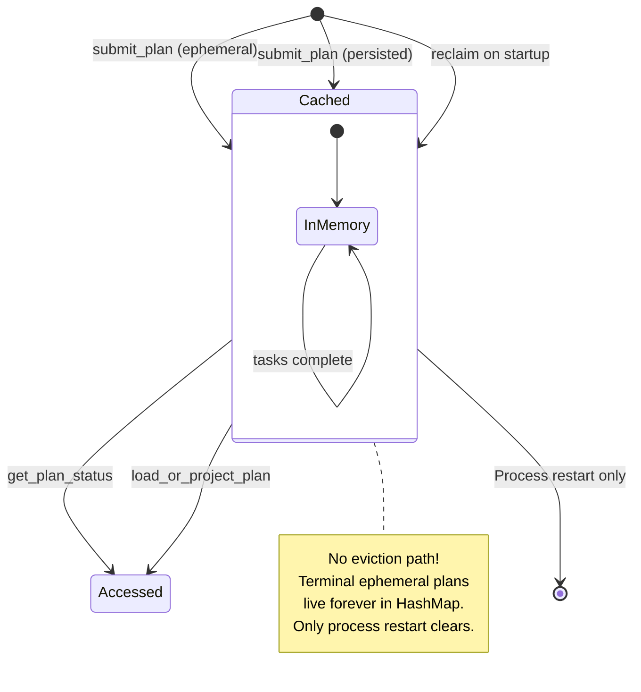
```mermaid
stateDiagram-v2
    [*] --> Cached : submit_plan (ephemeral)
    [*] --> Cached : submit_plan (persisted)
    [*] --> Cached : reclaim on startup

    Cached --> Accessed : get_plan_status
    Cached --> Accessed : load_or_project_plan

    state Cached {
        [*] --> InMemory
        InMemory --> InMemory : brain polls status
        InMemory --> InMemory : tasks complete
    }

    note right of Cached
        No eviction path!
        Terminal ephemeral plans
        live forever in HashMap.
        Only process restart clears.
    end note

    Cached --> [*] : Process restart only
```

#### Structural Cause (Deep Water)
The architecture treats `active_plans` as a cache for *all* plans, but the eviction semantics differ fundamentally:

| Plan Type | Cache Miss Behavior | Correct Eviction Policy |
|-----------|--------------------|------------------------|
| **Ephemeral** (`epic_id: None`) | Unrecoverable — plan is lost forever | Retain until explicit close/archive semantics exist |
| **Persisted** (`epic_id: Some`) | Reproject from beads comments | Evict after short TTL; reproject on next access |

The code conflates these categories. `PlanState` has `epic_id: Option<String>` as the discriminator, but no code uses it for lifecycle management.

#### Rejected Proposal (First Pass): State Diagram — State-Driven Eviction

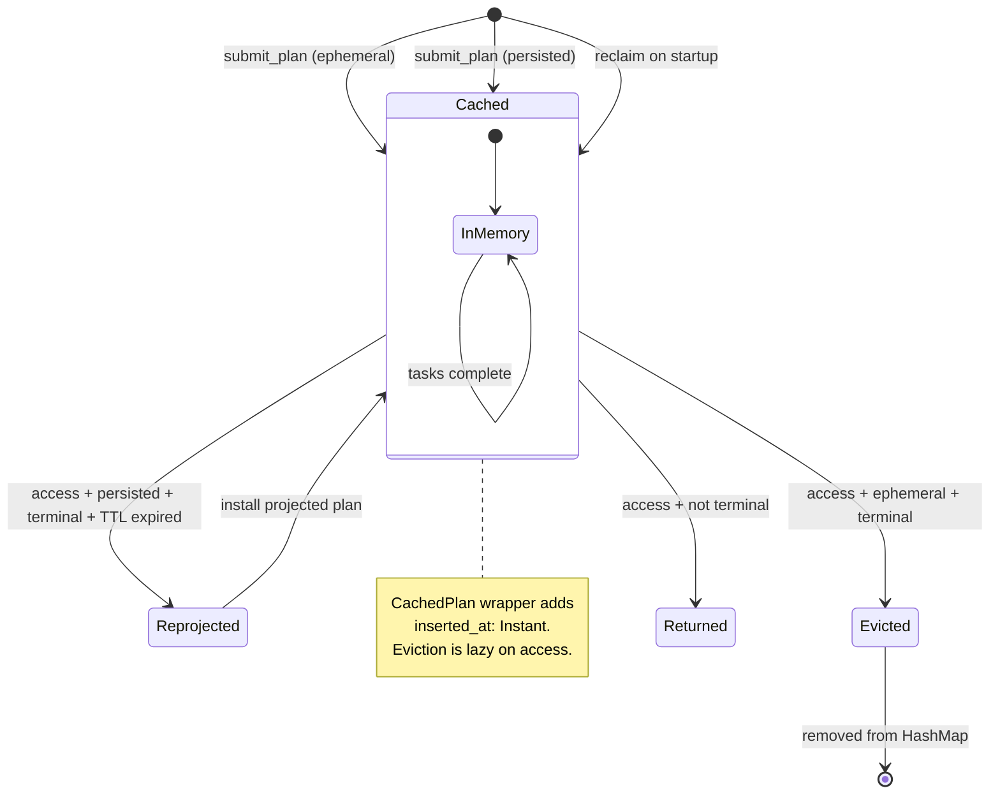
```mermaid
stateDiagram-v2
    [*] --> Cached : submit_plan (ephemeral)
    [*] --> Cached : submit_plan (persisted)
    [*] --> Cached : reclaim on startup

    state Cached {
        [*] --> InMemory
        InMemory --> InMemory : brain polls status
        InMemory --> InMemory : tasks complete
    }

    Cached --> Reprojected : access + persisted + terminal + TTL expired
    Cached --> Evicted : access + ephemeral + terminal
    Cached --> Returned : access + not terminal

    Reprojected --> Cached : install projected plan
    Evicted --> [*] : removed from HashMap

    note right of Cached
        CachedPlan wrapper adds
        inserted_at: Instant.
        Eviction is lazy on access.
    end note
```

#### Rejected Proposal (First Pass): Sequence Diagram — Access-Time Eviction Logic

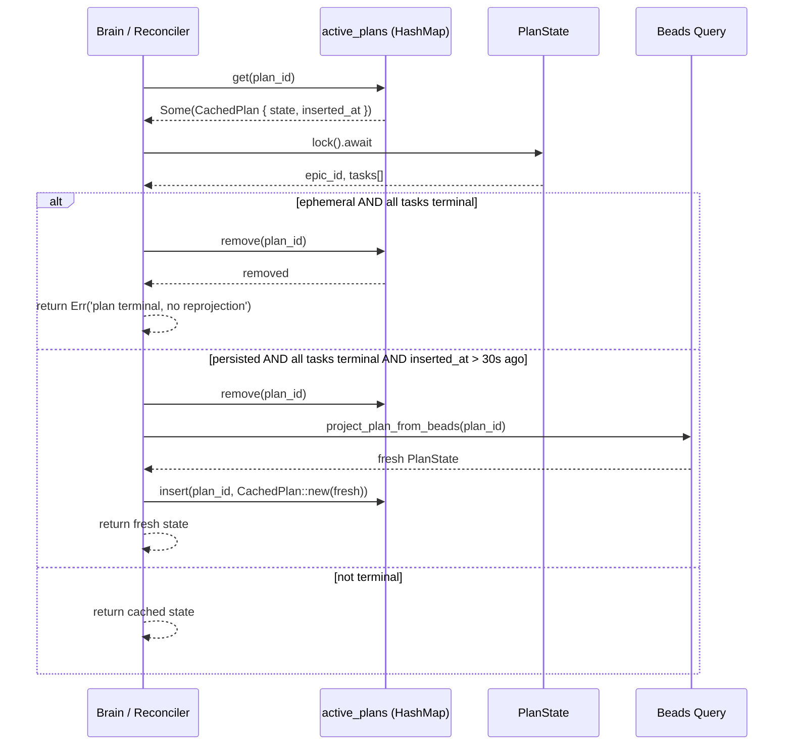
```mermaid
sequenceDiagram
    participant B as Brain / Reconciler
    participant AP as active_plans (HashMap)
    participant PS as PlanState
    participant BQ as Beads Query

    B->> AP: get(plan_id)
    AP-->> B: Some(CachedPlan { state, inserted_at })

    B->> PS: lock().await
    PS-->> B: epic_id, tasks[]

    alt ephemeral AND all tasks terminal
        B->> AP: remove(plan_id)
        AP-->> B: removed
        B-->> B: return Err('plan terminal, no reprojection')
    else persisted AND all tasks terminal AND inserted_at > 30s ago
        B->> AP: remove(plan_id)
        B->> BQ: project_plan_from_beads(plan_id)
        BQ-->> B: fresh PlanState
        B->> AP: insert(plan_id, CachedPlan::new(fresh))
        B-->> B: return fresh state
    else not terminal
        B-->> B: return cached state
    end
```

#### Mental Model Violation (Ocean Floor)
**The mental model is "every submitted plan should stay in memory forever."** This is wrong. `active_plans` mixes two different ownership classes:

- persisted plans are cache entries over durable truth
- ephemeral plans are the only surviving authority unless and until an archive/close API exists

The correct mental model: **`active_plans` is not one thing.** Persisted entries can be treated like cache. Ephemeral entries still need lifecycle semantics before safe eviction is possible.

#### Why LRU Is the Wrong Abstraction

The original recommendation suggested LRU with a 100-entry cap. LRU assumes access patterns matter. Here, the **ownership class** matters first:

- persisted plans are rehydratable
- ephemeral plans may still be authoritative after task-terminal states

An LRU can still evict the wrong thing: an authoritative ephemeral plan that has not been touched recently, while keeping a rehydratable persisted plan because it was just polled. The domain split is "rehydratable vs. authoritative-only," not "recent vs. stale."

#### Best Approach: Split Persisted vs. Ephemeral Ownership, Do Not Evict Ephemeral Plans on Terminal Access

The original proposal overfit the memory symptom and broke the plan API contract. An **ephemeral** plan is not disposable the moment all tasks become terminal:

- `merge_plan` still needs `base_snapshot_branch` / `base_snapshot_oid` and approved task `worker_branch` values.
- `get_task_diff` for ephemeral plans has no durable reprojection path comparable to persisted plans.
- failure / rejection inspection is still valuable after a plan reaches a terminal task state.

So the first-principles rule is:

1. **Persisted plans are rehydratable; ephemeral plans are not.**
2. **Do not evict ephemeral plans until the API has an explicit close/archive lifecycle.**
3. **If you want memory relief now, start by evicting only persisted plans.**

That produces a safer split:

```rust
// P0: persisted plans may be evicted or treated as projection-only entries.
// Ephemeral plans stay resident until an explicit close/archive path exists.
if let Some(existing) = cached.clone() {
    let is_persisted = existing.lock().await.epic_id.is_some();
    if !is_persisted {
        return Ok(existing);
    }
}
```

**Corrected remediation path:**

- **P0:** Keep current ephemeral behavior. Optionally evict **terminal persisted** entries after reprojection or after a short TTL; they can be reconstructed from beads.
- **P1:** Introduce an explicit ephemeral-plan lifecycle (`close_plan`, archival snapshot, or equivalent) that preserves the minimum data needed by `get_plan_status`, `get_task_diff`, and `merge_plan`.
- **P2:** Only after that API exists should ephemeral terminal eviction be considered.

**Why this matters:** immediate ephemeral eviction would cause a user-visible regression, not a cleanup. The code today still treats in-memory ephemeral `PlanState` as the source of truth after execution, so "unknown plan" is not a correct post-terminal answer.

---

### 3.2 HIGH: `cleanup_orphans()` Is a Loaded Gun — Never Called Due to Per-Delegation Manager Fragmentation

#### Surface (Tip of Iceberg)
Orphaned worktrees and snapshot branches accumulate on disk. Operators must manually clean them up. The retry cleanup warning (`"next attempt may fail at create_worktree"`) is misleading — each retry gets a fresh `SessionId`, so collision is impossible.

#### Direct Cause (Waterline)
The `WorktreeManager::cleanup_orphans` function (manager.rs:427) is **correctly implemented** but **never invoked** anywhere in the workspace. Verification (`grep -rn 'cleanup_orphans' crates/`): exactly one hit — the definition in `manager.rs:427`; zero call sites exist across `spur-core`, `spur-mcp`, and `spur-worktree`.

```rust
// manager.rs:427 — exists, tested, documented
pub async fn cleanup_orphans(&self) -> Result<usize> { ... }
```

Why? Because each `execute_delegation` creates a **fresh** `WorktreeManager`:

```rust
// orchestrator.rs:3296
let mut worktrees = WorktreeManager::new(repo_root);
```

Each manager's `self.active` HashMap starts empty and only tracks that delegation's single worktree. If `cleanup_orphans` were called, it would scan `git worktree list`, find worktrees from OTHER delegations, and delete them — because they're not in `self.active`.

#### BEFORE: Sequence Diagram — The Race Condition (Why cleanup_orphans Cannot Be Called Today)

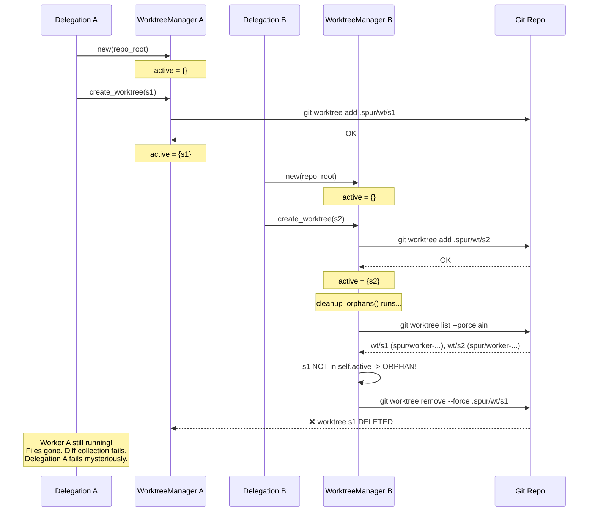
```mermaid
sequenceDiagram
    participant DA as Delegation A
    participant WA as WorktreeManager A
    participant DB as Delegation B
    participant WB as WorktreeManager B
    participant GIT as Git Repo

    DA->> WA: new(repo_root)
    Note over WA: active = {}
    DA->> WA: create_worktree(s1)
    WA->> GIT: git worktree add .spur/wt/s1
    GIT-->> WA: OK
    Note over WA: active = {s1}

    DB->> WB: new(repo_root)
    Note over WB: active = {}
    DB->> WB: create_worktree(s2)
    WB->> GIT: git worktree add .spur/wt/s2
    GIT-->> WB: OK
    Note over WB: active = {s2}

    Note over WB: cleanup_orphans() runs...
    WB->> GIT: git worktree list --porcelain
    GIT-->> WB: wt/s1 (spur/worker-...), wt/s2 (spur/worker-...)
    WB->> WB: s1 NOT in self.active -> ORPHAN!
    WB->> GIT: git worktree remove --force .spur/wt/s1
    GIT-->> WA: ❌ worktree s1 DELETED
    Note over DA: Worker A still running!<br/>Files gone. Diff collection fails.<br/>Delegation A fails mysteriously.
```

#### Structural Cause (Deep Water)
The RCA (2026-04-21, §3.3) identified this precisely:

| Operation | What happens | Why it's wrong |
|-----------|-------------|----------------|
| `active_count()` | Returns 0 or 1 | Cannot see other delegations' worktrees |
| `cleanup_stale()` | Only checks its own worktree | Orphans from other delegations survive |
| `cleanup_orphans()` | May delete ACTIVE worktrees from other delegations | `self.active` doesn't track them |

The system has a **GC mechanism that is correct but unusable** due to architectural fragmentation.

#### Conditional Future State — Safe Startup Cleanup Under Repo Ownership

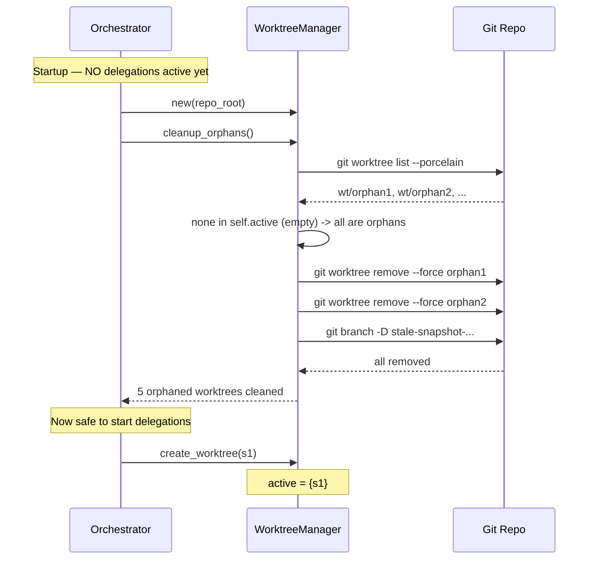
```mermaid
sequenceDiagram
    participant ORCH as Orchestrator
    participant WT as WorktreeManager
    participant GIT as Git Repo

    Note over ORCH: Startup — NO delegations active yet
    ORCH->> WT: new(repo_root)
    ORCH->> WT: cleanup_orphans()
    WT->> GIT: git worktree list --porcelain
    GIT-->> WT: wt/orphan1, wt/orphan2, ...
    WT->> WT: none in self.active (empty) -> all are orphans
    WT->> GIT: git worktree remove --force orphan1
    WT->> GIT: git worktree remove --force orphan2
    WT->> GIT: git branch -D stale-snapshot-...
    GIT-->> WT: all removed
    WT-->> ORCH: 5 orphaned worktrees cleaned

    Note over ORCH: Now safe to start delegations
    ORCH->> WT: create_worktree(s1)
    Note over WT: active = {s1}
```

#### AFTER: Sequence Diagram — Phase 3: Shared WorktreeManager (Future)

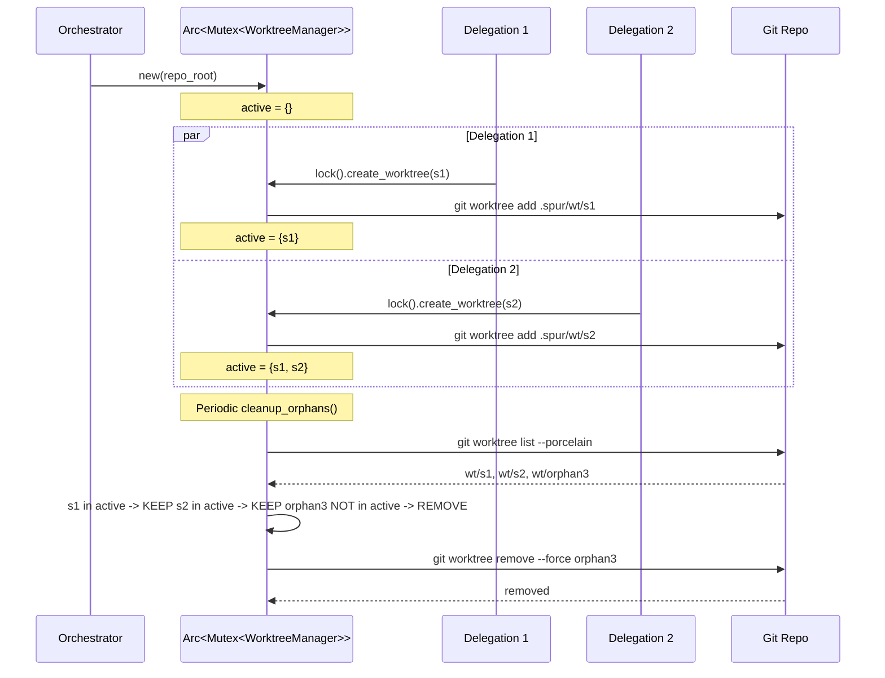
```mermaid
sequenceDiagram
    participant ORCH as Orchestrator
    participant WT as Arc<Mutex<WorktreeManager>>
    participant D1 as Delegation 1
    participant D2 as Delegation 2
    participant GIT as Git Repo

    ORCH->> WT: new(repo_root)
    Note over WT: active = {}

    par Delegation 1
        D1->> WT: lock().create_worktree(s1)
        WT->> GIT: git worktree add .spur/wt/s1
        Note over WT: active = {s1}
    and Delegation 2
        D2->> WT: lock().create_worktree(s2)
        WT->> GIT: git worktree add .spur/wt/s2
        Note over WT: active = {s1, s2}
    end

    Note over WT: Periodic cleanup_orphans()
    WT->> GIT: git worktree list --porcelain
    GIT-->> WT: wt/s1, wt/s2, wt/orphan3
    WT->> WT: s1 in active -> KEEP s2 in active -> KEEP orphan3 NOT in active -> REMOVE
    WT->> GIT: git worktree remove --force orphan3
    GIT-->> WT: removed
```

#### Mental Model Violation (Ocean Floor)
**The mental model is "each delegation is an independent unit with isolated resources."** This is wrong. Git worktrees are **global git state**. A `WorktreeManager` that only sees its own worktrees cannot safely manage global git state.

The correct mental model: **Worktree lifecycle requires a session-scoped or global manager with full visibility of all active worktrees.**

#### Best Approach: Require Repo Ownership Before Any Automatic Orphan Cleanup

The original "safe startup cleanup" recommendation was too process-local. `cleanup_orphans()` reasons over **repo-global git state**, but `self.active` is only **process-local**. "This process has not dispatched yet" does **not** prove "no other SPUR process is active in this repo."

That means startup cleanup is only safe when one of these is true:

1. a repo-scoped ownership lock is already held, or
2. the product intentionally guarantees a single SPUR owner for the repo.

Current code only partially satisfies that:

- beads-backed MCP startup acquires `.beads/.spur-brain.pid`
- non-beads runs do **not** have an equivalent worktree-ownership guard
- `Orchestrator::worktrees` exists but is not the shared owner used by delegation execution today

**Corrected remediation path:**

**Phase 1 (Immediate, P0): Fix the misleading warning**

The retry cleanup warning in `orchestrator.rs:3695-3700` is factually incorrect because retries use a fresh `SessionId`.

```rust
tracing::warn!(
    session = %outcome.worker_session,
    error = %e,
    "failed to remove retry-attempt worktree; retry will use a fresh session ID, but disk space may leak"
);
```

**Phase 2 (Conditional, P1): Gate orphan cleanup behind repo ownership**

Only call `cleanup_orphans()` after acquiring a repo-exclusive lock. Existing beads-backed pidfile acquisition is the closest current mechanism, but it does not protect non-beads paths.

**Phase 3 (Medium-term, P2): Make the session-scoped manager real**

Move delegation execution onto the orchestrator-owned `worktrees` field (or another shared session-scoped manager) so there is one in-process authority with full visibility of active worktrees. Once that exists, periodic orphan cleanup becomes meaningful.

**Bottom line:** auto-clean is not a P0 "just call the function" fix. The P0 fix is the warning text; safe automatic cleanup needs an ownership invariant first.

---

### 3.3 MEDIUM: Snapshot Branch Leak — No Deallocation Path

#### Surface (Tip of Iceberg)
After 100 delegations, ~100 `spur/brain-snapshot-*` branches accumulate in the repo. They serve no purpose after `create_worktree` succeeds.

#### Direct Cause (Waterline)
`snapshot_brain_state` creates a branch like `spur/brain-snapshot-20260422120000-0`. After `create_worktree` uses this branch as a base, the snapshot branch is **never deleted**. The per-delegation `WorktreeManager` is dropped after `execute_delegation` returns. Nobody owns the cleanup.

#### BEFORE: Sequence Diagram — Snapshot Branch Lifecycle Today (Leaks Forever)

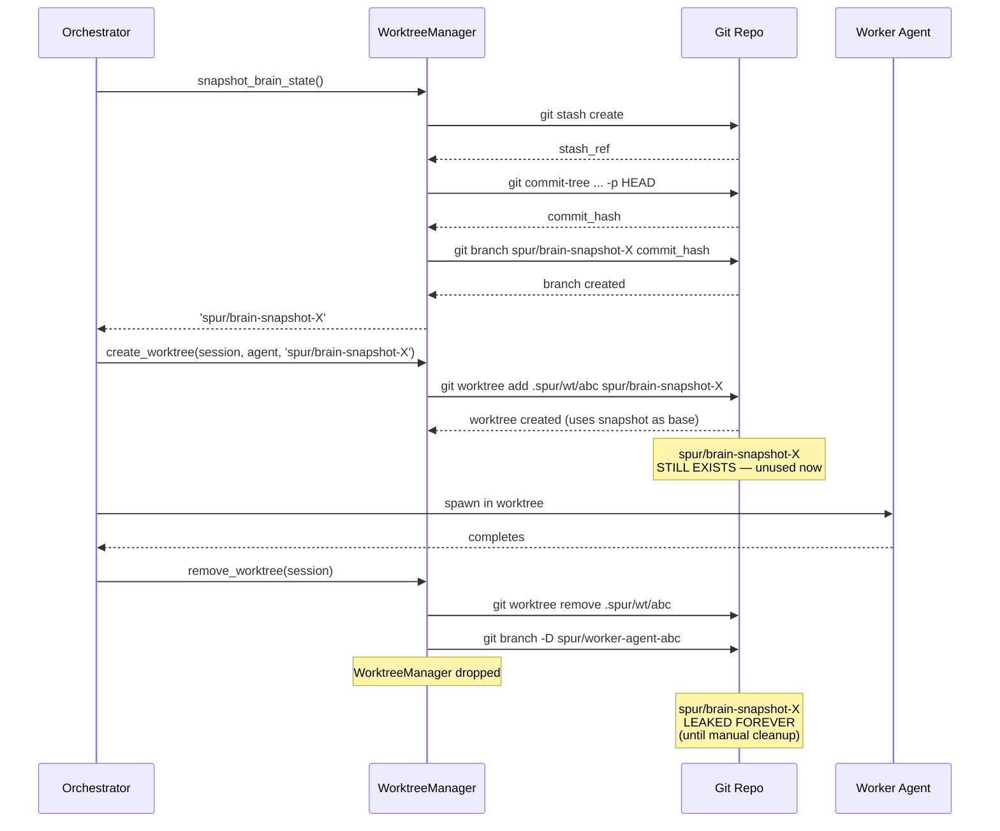
```mermaid
sequenceDiagram
    participant ORCH as Orchestrator
    participant WT as WorktreeManager
    participant GIT as Git Repo
    participant WK as Worker Agent

    ORCH->> WT: snapshot_brain_state()
    WT->> GIT: git stash create
    GIT-->> WT: stash_ref
    WT->> GIT: git commit-tree ... -p HEAD
    GIT-->> WT: commit_hash
    WT->> GIT: git branch spur/brain-snapshot-X commit_hash
    GIT-->> WT: branch created
    WT-->> ORCH: 'spur/brain-snapshot-X'

    ORCH->> WT: create_worktree(session, agent, 'spur/brain-snapshot-X')
    WT->> GIT: git worktree add .spur/wt/abc spur/brain-snapshot-X
    GIT-->> WT: worktree created (uses snapshot as base)
    Note over GIT: spur/brain-snapshot-X<br/>STILL EXISTS — unused now

    ORCH->> WK: spawn in worktree
    WK-->> ORCH: completes
    ORCH->> WT: remove_worktree(session)
    WT->> GIT: git worktree remove .spur/wt/abc
    WT->> GIT: git branch -D spur/worker-agent-abc

    Note over WT: WorktreeManager dropped
    Note over GIT: spur/brain-snapshot-X<br/>LEAKED FOREVER<br/>(until manual cleanup)
```

#### Structural Cause (Deep Water)
The snapshot branch is created in one phase (snapshot) and consumed in another (worktree creation). The two phases are separated by an `await` point. The natural owner of the snapshot branch — the `WorktreeManager` that created it — is dropped before the delegation completes, and even if it weren't, the manager doesn't track snapshot branches separately from worker branches.

The `cleanup_orphans` function *attempts* to clean snapshot branches (manager.rs:481-504), but its guard check is wrong:

```rust
let active_bases: Vec<&str> = self.active.values().map(|info| info.branch.as_str()).collect();
for branch in branches_output.lines().map(|l| l.trim()) {
    if active_bases.iter().any(|b| b.contains(branch)) {
        continue; // don't delete
    }
    // delete the branch
}
```

The guard iterates `active_bases` (worker branches like `spur/worker-codex-abc`) and tests `b.contains(branch)` where `branch` is a snapshot name like `spur/brain-snapshot-X`. Since no worker branch contains a snapshot branch name, the check always falls through to deletion. This is *accidentally* correct for snapshots (they should be deleted), but because `cleanup_orphans` is never called, the accidental correctness is moot — snapshots still leak indefinitely.

#### AFTER: Sequence Diagram — Immediate Snapshot Deletion (Preventive)

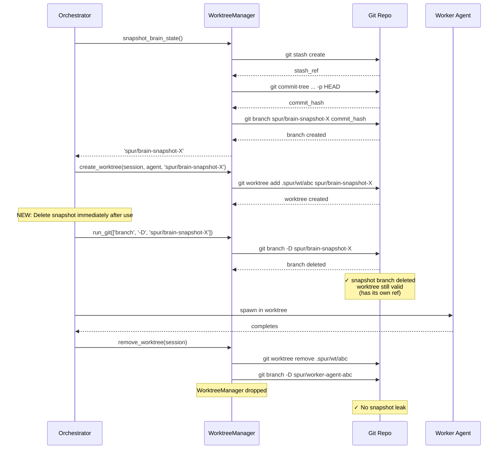
```mermaid
sequenceDiagram
    participant ORCH as Orchestrator
    participant WT as WorktreeManager
    participant GIT as Git Repo
    participant WK as Worker Agent

    ORCH->> WT: snapshot_brain_state()
    WT->> GIT: git stash create
    GIT-->> WT: stash_ref
    WT->> GIT: git commit-tree ... -p HEAD
    GIT-->> WT: commit_hash
    WT->> GIT: git branch spur/brain-snapshot-X commit_hash
    GIT-->> WT: branch created
    WT-->> ORCH: 'spur/brain-snapshot-X'

    ORCH->> WT: create_worktree(session, agent, 'spur/brain-snapshot-X')
    WT->> GIT: git worktree add .spur/wt/abc spur/brain-snapshot-X
    GIT-->> WT: worktree created

    Note over ORCH: NEW: Delete snapshot immediately after use
    ORCH->> WT: run_git(['branch', '-D', 'spur/brain-snapshot-X'])
    WT->> GIT: git branch -D spur/brain-snapshot-X
    GIT-->> WT: branch deleted
    Note over GIT: ✓ snapshot branch deleted<br/>worktree still valid<br/>(has its own ref)

    ORCH->> WK: spawn in worktree
    WK-->> ORCH: completes
    ORCH->> WT: remove_worktree(session)
    WT->> GIT: git worktree remove .spur/wt/abc
    WT->> GIT: git branch -D spur/worker-agent-abc

    Note over WT: WorktreeManager dropped
    Note over GIT: ✓ No snapshot leak
```

#### AFTER: Flowchart — Decision Logic for Snapshot Deletion

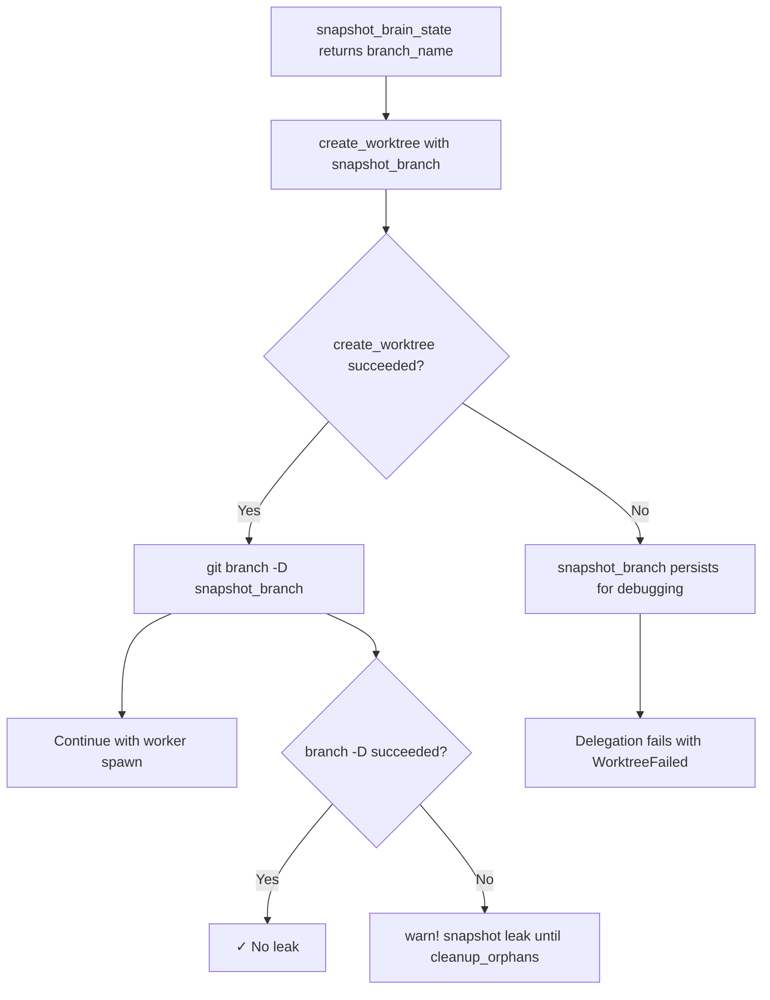
```mermaid
flowchart TD
    A[snapshot_brain_state returns branch_name] --> B[create_worktree with snapshot_branch]
    B --> C{create_worktree succeeded?}
    C -->|Yes| D[git branch -D snapshot_branch]
    C -->|No| E[snapshot_branch persists for debugging]
    D --> F[Continue with worker spawn]
    E --> G[Delegation fails with WorktreeFailed]

    D --> H{branch -D succeeded?}
    H -->|Yes| I[✓ No leak]
    H -->|No| J[warn! snapshot leak until cleanup_orphans]
```

#### Mental Model Violation (Ocean Floor)
**The mental model is "branches are cheap, let them accumulate."** In a long-running brain session with hundreds of delegations, this becomes a real problem. Git operations slow down as ref count grows. `git branch -a` output becomes noisy. More critically, it indicates a **resource ownership gap**: something creates resources, nothing deletes them.

#### Best Approach: Immediate Deletion After Use

Delete the snapshot branch **immediately after `create_worktree` succeeds**. The snapshot is only needed as a base ref for the worktree creation command. Once the worktree exists, the branch is dead weight.

```rust
// In run_one_worker_attempt, after create_worktree succeeds:
let worktree_info = worktrees.create_worktree(&worker_session, ctx.agent, &snapshot_branch).await?;

// The snapshot branch is no longer needed — the worktree has its own ref
if let Err(e) = worktrees.run_git(&["branch", "-D", &snapshot_branch], None).await {
    tracing::debug!(
        snapshot_branch = %snapshot_branch,
        error = %e,
        "failed to delete snapshot branch after worktree creation; will leak until cleanup_orphans runs"
    );
}
```

**Tradeoffs:**
- If `create_worktree` succeeds but the worker never runs, the snapshot branch is gone. This is fine — the worktree still exists and contains the snapshot state.
- If `create_worktree` fails, the snapshot branch persists (good — might be useful for debugging).
- One-line fix. No state machine changes. No race conditions.

**Why this is better than `cleanup_orphans`:**
- `cleanup_orphans` is reactive (clean up mess after it happens)
- Immediate deletion is preventive (don't create the mess)
- Both are needed, but preventive is cheaper and more reliable

---

### 3.4 MEDIUM: `derive_epic_plan` N+1 Query Pattern

#### Surface (Tip of Iceberg)
`execute_epic(epic_id)` is slow for large epics. A 50-task epic with 10 external dependencies each triggers ~60 subprocess spawns.

#### Direct Cause (Waterline)

```rust
// plan/mod.rs:410-428
for summary in &summaries {
    let full = pm.get_issue(&summary.id).await?;  // N+1
    if full.blocked_by.iter().any(|b| b == epic_id) {
        children.push(full);
    }
}
```

The code has an explicit TODO:
```rust
// TODO(phase3): N+1 fetch — one get_issue per summary to detect children.
```

#### BEFORE: Sequence Diagram — N+1 Query Pattern Today

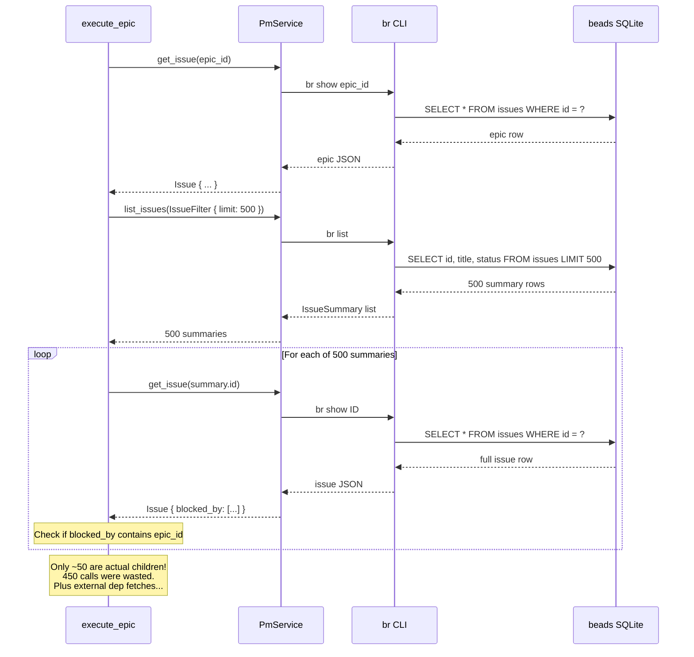
```mermaid
sequenceDiagram
    participant EX as execute_epic
    participant PM as PmService
    participant BR as br CLI
    participant DB as beads SQLite

    EX->> PM: get_issue(epic_id)
    PM->> BR: br show epic_id
    BR->> DB: SELECT * FROM issues WHERE id = ?
    DB-->> BR: epic row
    BR-->> PM: epic JSON
    PM-->> EX: Issue { ... }

    EX->> PM: list_issues(IssueFilter { limit: 500 })
    PM->> BR: br list
    BR->> DB: SELECT id, title, status FROM issues LIMIT 500
    DB-->> BR: 500 summary rows
    BR-->> PM: IssueSummary list
    PM-->> EX: 500 summaries

    loop For each of 500 summaries
        EX->> PM: get_issue(summary.id)
        PM->> BR: br show ID
        BR->> DB: SELECT * FROM issues WHERE id = ?
        DB-->> BR: full issue row
        BR-->> PM: issue JSON
        PM-->> EX: Issue { blocked_by: [...] }
        Note over EX: Check if blocked_by contains epic_id
    end

    Note over EX: Only ~50 are actual children!<br/>450 calls were wasted.<br/>Plus external dep fetches...
```

#### Structural Cause (Deep Water)
The beads backend (`br` CLI) doesn't expose a bulk fetch API. `PmService::get_issue` spawns a subprocess:

```rust
// Inferred from beads adapter
let output = Command::new("br").args(["show", id]).output().await?;
```

Subprocess overhead dominates. Even though beads uses local SQLite (~1-5ms per query), `fork()+exec("br")` is ~5-10ms per call. 500 calls = 2.5-5s of overhead.

The deeper issue: `IssueSummary` has no `parent` field. Child detection requires fetching the full `Issue` to inspect `blocked_by`. If `list_issues` could filter by parent, child detection would be one query.

#### Potential Backend-Dependent Future — With Child Filter

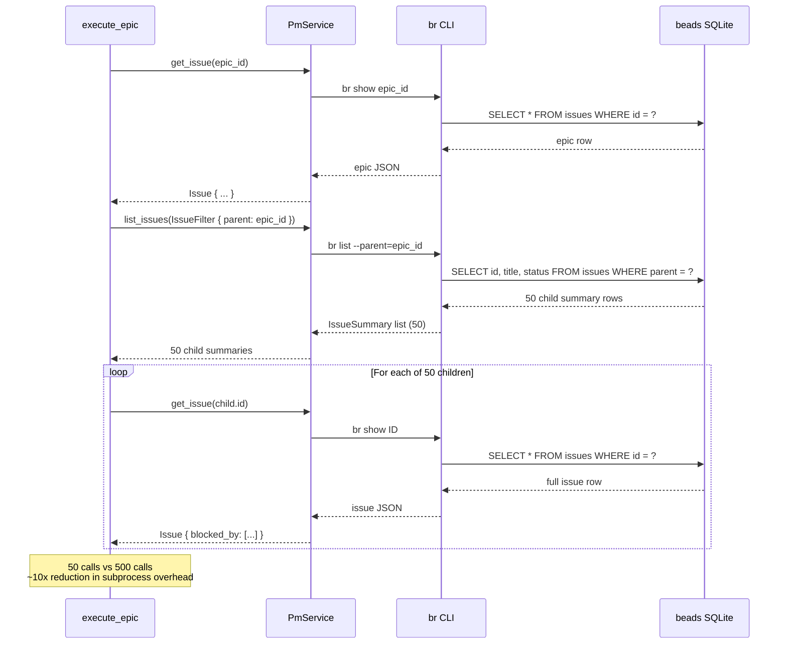
```mermaid
sequenceDiagram
    participant EX as execute_epic
    participant PM as PmService
    participant BR as br CLI
    participant DB as beads SQLite

    EX->> PM: get_issue(epic_id)
    PM->> BR: br show epic_id
    BR->> DB: SELECT * FROM issues WHERE id = ?
    DB-->> BR: epic row
    BR-->> PM: epic JSON
    PM-->> EX: Issue { ... }

    EX->> PM: list_issues(IssueFilter { parent: epic_id })
    PM->> BR: br list --parent=epic_id
    BR->> DB: SELECT id, title, status FROM issues WHERE parent = ?
    DB-->> BR: 50 child summary rows
    BR-->> PM: IssueSummary list (50)
    PM-->> EX: 50 child summaries

    loop For each of 50 children
        EX->> PM: get_issue(child.id)
        PM->> BR: br show ID
        BR->> DB: SELECT * FROM issues WHERE id = ?
        DB-->> BR: full issue row
        BR-->> PM: issue JSON
        PM-->> EX: Issue { blocked_by: [...] }
    end

    Note over EX: 50 calls vs 500 calls<br/>~10x reduction in subprocess overhead
```

#### Potential Backend-Dependent Future — Fallback If Child Filter Is Unavailable

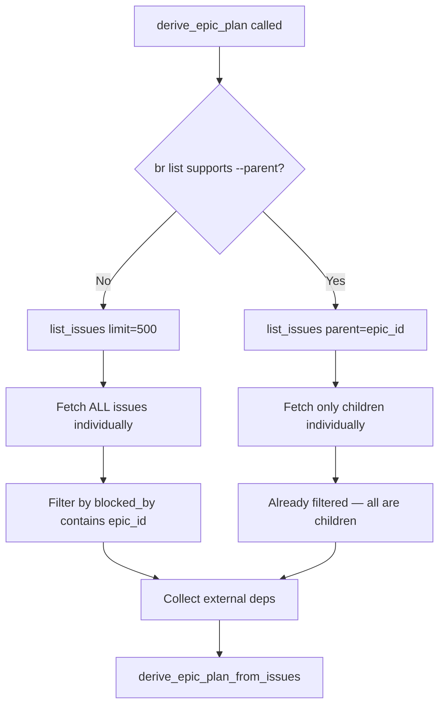
```mermaid
flowchart TD
    A[derive_epic_plan called] --> B{br list supports --parent?}
    B -->|Yes| C[list_issues parent=epic_id]
    B -->|No| D[list_issues limit=500]
    D --> E[Fetch ALL issues individually]
    C --> F[Fetch only children individually]
    E --> G[Filter by blocked_by contains epic_id]
    F --> H[Already filtered — all are children]
    G --> I[Collect external deps]
    H --> I
    I --> J[derive_epic_plan_from_issues]
```

#### Mental Model Violation (Ocean Floor)
**The mental model is "beads is a database."** It's not — it's a CLI tool wrapping SQLite. CLI interfaces are inherently request-response with no batching. The abstraction leak is that `PmService` presents a database-like interface (`get_issue`, `list_issues`) but the implementation is process-bound.

#### Best Approach: Prefer Narrower Scans First, Treat `parent` Filtering as Backend Work

The issue is real, but the original remediation jumped too quickly to a new surface area (`IssueFilter.parent`) that does not exist today.

**Corrected remediation path:**

1. **Keep the diagnosis:** the cost is dominated by repeated `br show` subprocesses.
2. **Use existing filters first where semantics allow it.**
3. **Only add a new `parent`/child filter if the beads CLI actually supports it, or if the adapter grows an equivalent capability.**

That means:

- if `execute_epic` is explicitly limited to task children, `IssueFilter { issue_type: Some("task".into()), .. }` is the first low-risk mitigation
- if child issue types are intentionally broader than `task`, keep the current logic and document the debt
- do **not** add `IssueFilter.parent` in SPUR alone unless the backend can honor it

So the first-principles recommendation is:

```rust
let summaries = pm.list_issues(spur_pm::IssueFilter {
    limit: Some(500),
    // Only safe if execute_epic's contract is "epic children are tasks".
    issue_type: Some("task".to_string()),
    ..Default::default()
}).await?;
```

If that contract is not acceptable, the optimization remains deferred backend work. The key correction is that this section is a **performance debt**, not a correctness bug, and the immediate fix should stay within the current PM surface.

---

### 3.5 LOW: Label Operations Are Unbatched

#### Surface (Tip of Iceberg)
`apply_issue_update` exists in two places with identical unbatched logic: `plan/mod.rs:773-815` (used by plan executor, dispatch intent, completion, and review paths) and `server.rs:625-667` (used by `compensate_mutation_orphans`, `resolve_dispatch_orphan`, and legacy reclaim). Both make one `update_issue` call per label:

```rust
for label in update.add_labels {
    pm.update_issue(issue_id, IssueUpdate { add_labels: vec![label], .. }).await?;
}
for label in update.remove_labels {
    pm.update_issue(issue_id, IssueUpdate { remove_labels: vec![label], .. }).await?;
}
```

#### BEFORE: Sequence Diagram — Unbatched Label Operations (Today)

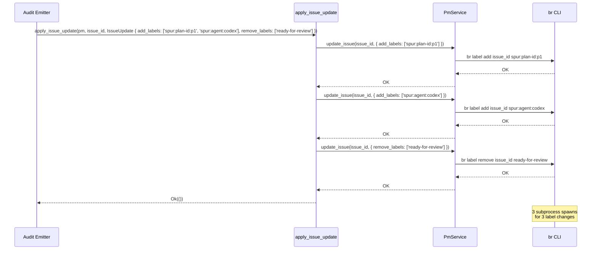
```mermaid
sequenceDiagram
    participant AUD as Audit Emitter
    participant AIU as apply_issue_update
    participant PM as PmService
    participant BR as br CLI

    AUD->> AIU: apply_issue_update(pm, issue_id, IssueUpdate {   add_labels: ['spur:plan-id:p1', 'spur:agent:codex'],   remove_labels: ['ready-for-review'] })

    AIU->> PM: update_issue(issue_id, { add_labels: ['spur:plan-id:p1'] })
    PM->> BR: br label add issue_id spur:plan-id:p1
    BR-->> PM: OK
    PM-->> AIU: OK

    AIU->> PM: update_issue(issue_id, { add_labels: ['spur:agent:codex'] })
    PM->> BR: br label add issue_id spur:agent:codex
    BR-->> PM: OK
    PM-->> AIU: OK

    AIU->> PM: update_issue(issue_id, { remove_labels: ['ready-for-review'] })
    PM->> BR: br label remove issue_id ready-for-review
    BR-->> PM: OK
    PM-->> AIU: OK

    AIU-->> AUD: Ok(())

    Note over BR: 3 subprocess spawns<br/>for 3 label changes
```

#### AFTER: Sequence Diagram — Batched Label Operations

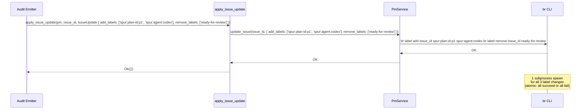
```mermaid
sequenceDiagram
    participant AUD as Audit Emitter
    participant AIU as apply_issue_update
    participant PM as PmService
    participant BR as br CLI

    AUD->> AIU: apply_issue_update(pm, issue_id, IssueUpdate {   add_labels: ['spur:plan-id:p1', 'spur:agent:codex'],   remove_labels: ['ready-for-review'] })

    AIU->> PM: update_issue(issue_id, {   add_labels: ['spur:plan-id:p1', 'spur:agent:codex'],   remove_labels: ['ready-for-review'] })
    PM->> BR: br label add issue_id spur:plan-id:p1 spur:agent:codex br label remove issue_id ready-for-review
    BR-->> PM: OK
    PM-->> AIU: OK

    AIU-->> AUD: Ok(())

    Note over BR: 1 subprocess spawn<br/>for all 3 label changes<br/>(atomic: all succeed or all fail)
```

#### Direct Cause (Waterline)
The code conservatively makes one call per label to handle backends that might fail partial updates. But `IssueUpdate` already supports `Vec<String>` for both fields.

#### Best Approach: Batch Labels in Single Call

```rust
async fn apply_issue_update(
    pm: &dyn PmLike,
    issue_id: &str,
    mut update: spur_pm::IssueUpdate,
) -> anyhow::Result<()> {
    let core_update = spur_pm::IssueUpdate {
        status: update.status.take(),
        comment: update.comment.take(),
        priority: update.priority.take(),
        assignee: update.assignee.take(),
        ..Default::default()
    };
    if core_update.status.is_some() || core_update.comment.is_some()
        || core_update.priority.is_some() || core_update.assignee.is_some() {
        pm.update_issue(issue_id, core_update).await?;
    }

    // BATCH: single call for all label changes
    if !update.add_labels.is_empty() || !update.remove_labels.is_empty() {
        pm.update_issue(
            issue_id,
            spur_pm::IssueUpdate {
                add_labels: update.add_labels,
                remove_labels: update.remove_labels,
                ..Default::default()
            },
        ).await?;
    }

    Ok(())
}
```

**Tradeoffs:**
- If beads fails partial label updates, the batch fails atomically. This is **better** than partial success (current behavior applies some labels, not others).
- Reduces subprocess spawns from N to 1.
- One method change. Zero risk.

---

### 3.6 LOW: `build_epic_subgraph` Sequential Issue Creation

#### Surface (Tip of Iceberg)
Large plan submission (>50 tasks) takes seconds to persist because children are created sequentially.

#### BEFORE: Sequence Diagram — Sequential Creation Today

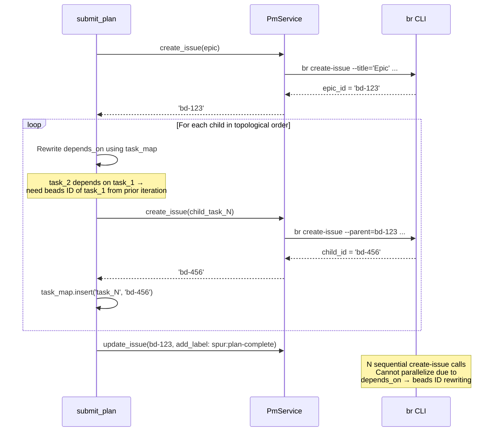
```mermaid
sequenceDiagram
    participant SP as submit_plan
    participant PM as PmService
    participant BR as br CLI

    SP->> PM: create_issue(epic)
    PM->> BR: br create-issue --title='Epic' ...
    BR-->> PM: epic_id = 'bd-123'
    PM-->> SP: 'bd-123'

    loop For each child in topological order
        SP->> SP: Rewrite depends_on using task_map
        Note over SP: task_2 depends on task_1 →<br/>need beads ID of task_1 from prior iteration

        SP->> PM: create_issue(child_task_N)
        PM->> BR: br create-issue --parent=bd-123 ...
        BR-->> PM: child_id = 'bd-456'
        PM-->> SP: 'bd-456'

        SP->> SP: task_map.insert('task_N', 'bd-456')
    end

    SP->> PM: update_issue(bd-123, add_label: spur:plan-complete)

    Note over BR: N sequential create-issue calls<br/>Cannot parallelize due to<br/>depends_on → beads ID rewriting
```

#### Potential Future Shape — Two-Phase Creation (Parallel, Fail-Closed Only)

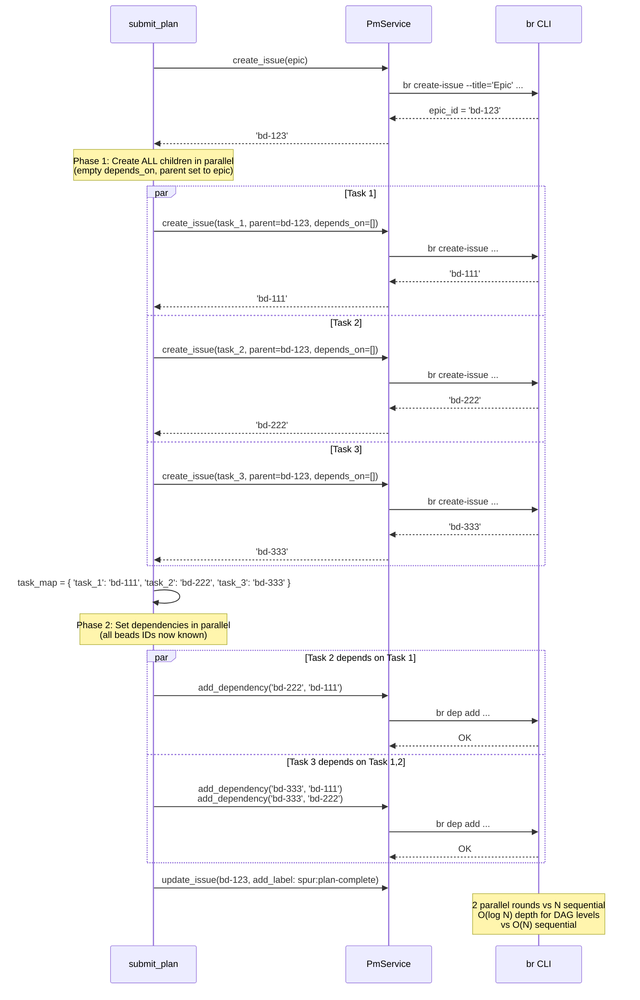
```mermaid
sequenceDiagram
    participant SP as submit_plan
    participant PM as PmService
    participant BR as br CLI

    SP->> PM: create_issue(epic)
    PM->> BR: br create-issue --title='Epic' ...
    BR-->> PM: epic_id = 'bd-123'
    PM-->> SP: 'bd-123'

    Note over SP: Phase 1: Create ALL children in parallel<br/>(empty depends_on, parent set to epic)

    par Task 1
        SP->> PM: create_issue(task_1, parent=bd-123, depends_on=[])
        PM->> BR: br create-issue ...
        BR-->> PM: 'bd-111'
        PM-->> SP: 'bd-111'
    and Task 2
        SP->> PM: create_issue(task_2, parent=bd-123, depends_on=[])
        PM->> BR: br create-issue ...
        BR-->> PM: 'bd-222'
        PM-->> SP: 'bd-222'
    and Task 3
        SP->> PM: create_issue(task_3, parent=bd-123, depends_on=[])
        PM->> BR: br create-issue ...
        BR-->> PM: 'bd-333'
        PM-->> SP: 'bd-333'
    end

    SP->> SP: task_map = {   'task_1': 'bd-111',   'task_2': 'bd-222',   'task_3': 'bd-333' }

    Note over SP: Phase 2: Set dependencies in parallel<br/>(all beads IDs now known)

    par Task 2 depends on Task 1
        SP->> PM: add_dependency('bd-222', 'bd-111')
        PM->> BR: br dep add ...
        BR-->> PM: OK
    and Task 3 depends on Task 1,2
        SP->> PM: add_dependency('bd-333', 'bd-111')<br/>add_dependency('bd-333', 'bd-222')
        PM->> BR: br dep add ...
        BR-->> PM: OK
    end

    SP->> PM: update_issue(bd-123, add_label: spur:plan-complete)

    Note over BR: 2 parallel rounds vs N sequential<br/>O(log N) depth for DAG levels<br/>vs O(N) sequential
```

#### Potential Future Shape — Phase Logic

```mermaid
flowchart TD
    A[plan_epic_issue_creates] --> B[Phase 1: Parallel Create]
    B --> C[For each child: create_issue with<br/>parent=epic_id, depends_on=[]]
    C --> D{All creates succeeded?}
    D -->|No| E[Rollback: delete created children + epic]
    D -->|Yes| F[Build task_map: task_id → beads_id]
    F --> G[Phase 2: Parallel Dependency Update]
    G --> H[For each child/dependency pair:<br/>add_dependency(child_id, dep_id)]
    H --> I{All updates succeeded?}
    I -->|No| J[Return Err; epic remains unmarked<br/>Human must repair or clean up]
    I -->|Yes| K[Mark epic spur:plan-complete]
    E --> L[Return Err]
    J --> M[Stop]
    K --> M
```

#### Direct Cause (Waterline)
```rust
for (task_id, mut child_create) in child_specs {
    child_create.depends_on = child_create.depends_on.iter()
        .map(|dep_key| task_map.get(dep_key).cloned().ok_or_else(...))
        .collect::<Result<Vec<_>, _>>()?;
    child_create.parent = Some(epic_id.clone());
    let child_id = pm.create_issue(child_create).await?;
    task_map.insert(task_id, child_id);
}
```

The loop has a **genuine sequential dependency**: `depends_on` must be rewritten from task IDs to beads IDs, and beads IDs are only known after `create_issue` returns.

#### Structural Cause (Deep Water)
The beads data model uses **string IDs** for cross-issue references. Unlike a relational database with foreign keys and transactions, beads requires the child to exist before it can be referenced. This forces sequential creation for dependent tasks.

#### Best Approach: Preserve Graph Correctness First, Optimize Only Behind the `spur:plan-complete` Barrier

The first-pass proposal correctly identified a possible speedup, but it understated the semantic cost:

- today, each created child is persisted with its dependencies already correct
- a two-phase approach creates a window where the graph exists **without** its true dependency edges
- returning `Ok` while phase-2 edge backfill is incomplete would violate L2 (`Plan atomicity`)

There are two concrete corrections:

1. `IssueUpdate::set_depends_on` does **not** exist on the current PM surface. The available write primitive is `PmService::add_dependency`.
2. If a two-phase path is ever implemented, it must **fail closed**: no `spur:plan-complete` label, and no success return, until every dependency edge has been added.

So the only defensible optimization shape is:

```rust
// Phase 1: create children with parent set, no intra-plan dependencies yet.
// Phase 2: add edges with pm.add_dependency(child_id, dep_id).
// Phase 3: only after all edges succeed, emit spur:plan-complete.
```

And on any phase-2 error:

- return `Err`
- do **not** mark the epic `spur:plan-complete`
- leave cleanup / repair explicit

That makes this a lower-priority optimization than the original writeup implied. The current sequential implementation is slow but semantically simple; parallelization is only worth it if profiling shows `submit_plan` persistence is a real bottleneck.

---

### 3.7 MEDIUM: Signal Dedup Is Not Correct Today — Durable Key Is Too Broad

#### Surface (Tip of Iceberg)
AGENTS.md requires dedup by `signal_id` across polls. The current implementation only partially does that:

- in memory: `seen: HashSet<signal_id>` is correct for the current process lifetime
- durably: the watcher skips an issue if it has **any** `spur:signal-processed:*` label
- the mutation executor writes that durable label using **`mutation_id`**, not `signal_id`

That means the durable check is issue-scoped and too broad. Once one signal on a task is processed, later distinct signals on the same task can be skipped forever.

#### Direct Cause (Waterline)

```rust
// signal_watcher.rs
if issue.labels.iter().any(|label| label.starts_with("spur:signal-processed:")) {
    continue;
}

// mutation_executor.rs:273
IssueUpdate {
    add_labels: vec![signal_processed_label(&batch.mutation_id)],
    ..
}

// labels.rs:140-142 — the label is keyed by mutation_id, NOT signal_id
pub fn signal_processed_label(mutation_id: &uuid::Uuid) -> String {
    format!("spur:signal-processed:{}", mutation_id.simple())
}
```

This is not "dedup by signal_id". It is "if this issue ever had a processed signal, stop looking."

#### Mental Model Violation (Ocean Floor)
The dedup identity is the **signal instance**, not the issue and not the mutation. A task may legitimately emit multiple independent signals over time. Durable dedup must answer:

> "Have I already consumed **this exact `signal_id`**?"

The current label answers a different question:

> "Has some mutation ever been committed on this issue?"

That mismatch is the bug.

#### Best Approach: Durable Dedup Must Use Exact `signal_id`

The fix is structural, not observational:

1. write the durable processed marker using `signal_id`
2. have the watcher check for the **exact** processed label for the current signal
3. keep `seen` as the fast in-memory layer
4. optionally add debug logs once the semantics are correct

```rust
let signal_id = signal.signal_id();
let processed_label = signal_processed_label(&signal_id);

if issue.labels.iter().any(|label| label == &processed_label) {
    continue;
}
if self.seen.lock().contains(&signal_id) {
    continue;
}
```

And on commit:

```rust
IssueUpdate {
    add_labels: vec![signal_processed_label(&signal_id)],
    ..
}
```

**Further correction:** decisive no-op outcomes (`no proposer candidates`) should also be considered for durable marking if the product requirement is truly "deduplicate by `signal_id` across polls and restarts." Otherwise the same signal can be reconsidered after process restart.

---

### 3.8 LOW: Persisted Plan Cache Always Reprojects

#### Surface (Tip of Iceberg)
Repeated `get_plan_status` calls might be slow because they reproject from beads comments.

#### BEFORE: Sequence Diagram — Always Reproject Today

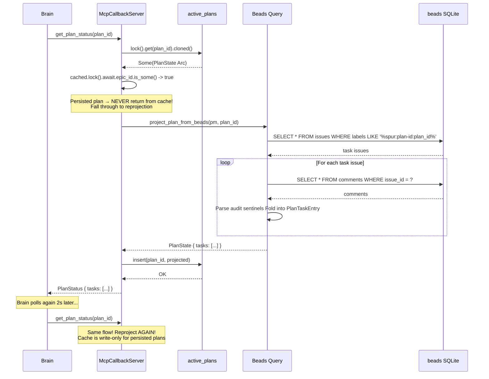
```mermaid
sequenceDiagram
    participant B as Brain
    participant S as McpCallbackServer
    participant AP as active_plans
    participant BQ as Beads Query
    participant DB as beads SQLite

    B->> S: get_plan_status(plan_id)
    S->> AP: lock().get(plan_id).cloned()
    AP-->> S: Some(PlanState Arc)

    S->> S: cached.lock().await.epic_id.is_some() -> true
    Note over S: Persisted plan → NEVER return from cache!<br/>Fall through to reprojection

    S->> BQ: project_plan_from_beads(pm, plan_id)
    BQ->> DB: SELECT * FROM issues WHERE labels LIKE '%spur:plan-id:plan_id%'
    DB-->> BQ: task issues

    loop For each task issue
        BQ->> DB: SELECT * FROM comments WHERE issue_id = ?
        DB-->> BQ: comments
        BQ->> BQ: Parse audit sentinels Fold into PlanTaskEntry
    end

    BQ-->> S: PlanState { tasks: [...] }
    S->> AP: insert(plan_id, projected)
    AP-->> S: OK
    S-->> B: PlanStatus { tasks: [...] }

    Note over B: Brain polls again 2s later...
    B->> S: get_plan_status(plan_id)
    Note over S: Same flow! Reproject AGAIN!<br/>Cache is write-only for persisted plans
```

#### Rejected for Current Write Model: Sequence Diagram — Journal-Based Invalidation

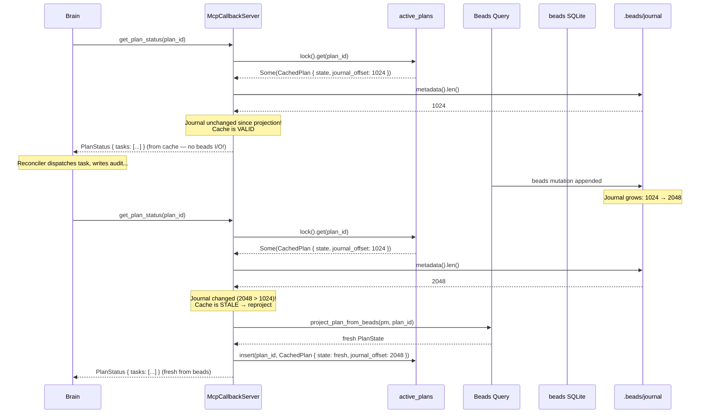
```mermaid
sequenceDiagram
    participant B as Brain
    participant S as McpCallbackServer
    participant AP as active_plans
    participant BQ as Beads Query
    participant DB as beads SQLite
    participant J as .beads/journal

    B->> S: get_plan_status(plan_id)
    S->> AP: lock().get(plan_id)
    AP-->> S: Some(CachedPlan { state, journal_offset: 1024 })

    S->> J: metadata().len()
    J-->> S: 1024
    Note over S: Journal unchanged since projection!<br/>Cache is VALID

    S-->> B: PlanStatus { tasks: [...] } (from cache — no beads I/O!)

    Note over B: Reconciler dispatches task, writes audit...
    BQ->> J: beads mutation appended
    Note over J: Journal grows: 1024 → 2048

    B->> S: get_plan_status(plan_id)
    S->> AP: lock().get(plan_id)
    AP-->> S: Some(CachedPlan { state, journal_offset: 1024 })

    S->> J: metadata().len()
    J-->> S: 2048
    Note over S: Journal changed (2048 > 1024)!<br/>Cache is STALE → reproject

    S->> BQ: project_plan_from_beads(pm, plan_id)
    BQ-->> S: fresh PlanState
    S->> AP: insert(plan_id, CachedPlan { state: fresh, journal_offset: 2048 })
    S-->> B: PlanStatus { tasks: [...] } (fresh from beads)
```

#### Rejected for Current Write Model: Flowchart — Cache Validity Check

```mermaid
flowchart TD
    A[load_or_project_plan(plan_id)] --> B{Cache hit?}
    B -->|No| C[Reproject from beads]
    B -->|Yes| D[Get cached journal_offset]
    D --> E[Get current .beads/journal len]
    E --> F{current_len > cached_offset?}
    F -->|No| G[Return cached state<br/>✓ Valid — no new mutations]
    F -->|Yes| H[Reproject from beads<br/>✗ Stale — journal grew]
    C --> I[Install projected plan<br/>with new journal_offset]
    H --> I
    I --> J[Return fresh state]
    G --> K[Done]
    J --> K
```

#### Direct Cause (Waterline)
`load_or_project_plan` (server.rs:3875-3904) reprojects persisted plans on every access:

```rust
let cached = self.active_plans.lock().await.get(plan_id).cloned();
let persisted_cached = if let Some(existing) = cached.as_ref() {
    existing.lock().await.epic_id.is_some()
} else {
    false
};
if let Some(existing) = cached.clone() {
    if !persisted_cached {
        return Ok(existing);  // Only ephemeral plans return from cache
    }
}
// For persisted plans, ALWAYS fall through to reprojection
```

#### Structural Cause (Deep Water)
The cache behavior is **intentionally pessimistic** for persisted plans. The design assumes beads might have been modified by another process (reconciler, signal watcher, human). Reprojection ensures the brain sees the latest state.

But this means the `active_plans` cache for persisted plans is **write-only** — it's populated but never read! Every access triggers `project_plan_from_beads`, which fetches all comments for all tasks.

#### Best Approach: Keep Always-Reproject Until Persisted Writes Become Durability-First

The original journal-based invalidation idea is attractive but unsafe against the current write ordering.

Why? Because persisted plans are sometimes mutated **in memory first** and synced to beads **afterward** on a best-effort basis. `handle_review_task` (plan/mod.rs:2382-2447) is the clearest example:

1. `apply_decision_and_extract` mutates `PlanState` under the lock (plan/mod.rs:2397-2411)
2. `handle_review_task` drops the lock
3. only then does it call `apply_issue_update(...)` (plan/mod.rs:2415-2423)
4. beads failures are logged as warnings (`warn!("handle_review_task: beads update failed...")`), not rolled back

In that world, journal-based cache reuse can resurrect the exact stale-read problem the current code avoids:

- in-memory state says "approved"
- beads write fails
- journal does not advance
- cache says "journal unchanged, state is valid"
- caller sees a status that was **not durably persisted**

So the first-principles rule is:

> A persisted-plan cache is only safe when cache freshness is defined relative to durable truth, not relative to in-memory optimism.

**Corrected recommendation:**

- keep the current always-reproject behavior for persisted plans
- only revisit cache reuse after persisted-plan write paths either:
  - become durability-first, or
  - track an explicit "dirty vs durably synced" state/version

At that point, journal-based invalidation may become a good optimization. Until then it is the wrong abstraction boundary.

---

## 4. Recommendations Summary

### Phase 1: Correctness Fixes Worth Doing Now (P0)

| Item | File | Change | Lines | Risk |
|------|------|--------|-------|------|
| 4.1 | `orchestrator.rs` | Fix misleading retry worktree warning message | ~3 | None |
| 4.2 | `orchestrator.rs` | Delete per-attempt snapshot branch immediately after `create_worktree` succeeds | ~6 | Low |
| 4.3 | `plan/mod.rs` and `server.rs` | Batch label operations in `apply_issue_update` | ~10 | Low |
| 4.4 | `plan/signal_watcher.rs`, `plan/mutation_executor.rs`, `plan/labels.rs` | Make durable signal dedup exact-by-`signal_id`, not issue-wide by any prior processed marker | ~20 | Medium |

### Phase 2: Ownership and Lifecycle Corrections (P1-P2)

| Item | File | Change | Effort | Risk |
|------|------|--------|--------|------|
| 4.5 | `server.rs` | Split persisted vs. ephemeral plan lifecycle; do **not** evict ephemeral plans without an explicit close/archive path | Medium | Medium |
| 4.6 | `orchestrator.rs` / repo startup path | Gate any automatic orphan cleanup behind repo-exclusive ownership | Medium | Medium |
| 4.7 | `orchestrator.rs` | Move delegation execution onto a shared session-scoped `WorktreeManager` | Large | High |
| 4.8 | `plan/mod.rs` / `spur-pm` | Narrow `derive_epic_plan` scans using existing filters where contract-safe; only add parent filtering with backend support | Small | Low |

### Phase 3: Deferred Optimizations (Only After Invariants Are Stronger)

| Item | File | Change | Effort | Risk |
|------|------|--------|--------|------|
| 4.9 | `server.rs` / persisted-plan write paths | Revisit persisted-plan cache reuse only after writes are durability-first or explicitly versioned | Medium | Medium |
| 4.10 | `server.rs` / `spur-pm` | Consider two-phase `build_epic_subgraph` only if it preserves `spur:plan-complete` as the visibility barrier and fails closed on edge backfill errors | Medium | Medium |
| 4.11 | `plan/reconciler.rs` | Auto-merge approved plans after all tasks terminal | Large | High |
| 4.12 | `plan/reconciler.rs` | Auto-create PR after successful merge | Medium | Medium |

---

## 5. Implementation Order

```
Week 1 (P0):
  ├── 4.1 Fix misleading worktree retry warning
  ├── 4.2 Delete snapshot branch after create_worktree
  ├── 4.3 Batch label operations
  └── 4.4 Fix durable signal dedup to use exact signal_id

Week 2-3 (P1):
  ├── 4.5 Design explicit ephemeral-plan close/archive semantics
  ├── 4.6 Add repo-ownership gate for any automatic orphan cleanup
  └── 4.8 Narrow derive_epic_plan scans if the execute_epic contract allows task-only children

Month 2 (P2):
  └── 4.7 Shared WorktreeManager (coordinated with RCA 2026-04-21)

Later (only if profiling / product pressure justifies it):
  ├── 4.9 Persisted-plan cache reuse after durability model changes
  ├── 4.10 Two-phase epic persistence behind spur:plan-complete barrier
  └── 4.11-4.12 Auto-merge + auto-PR
```

---

## 6. Cross-Reference to Prior RCAs

| This RCA Item | Prior RCA (2026-04-21) | Relationship |
|---------------|------------------------|--------------|
| 3.2 cleanup_orphans race | §3.3, §3.6 | Reaffirms the race; second-pass review narrows auto-clean to ownership-gated scenarios only |
| 3.3 Snapshot branch leak | §3.6 | Adds immediate deletion approach (preventive vs. reactive) |
| 4.7 Shared WorktreeManager | §5.7 | Same recommendation, reaffirmed with priority |
| 3.1 active_plans eviction | — | New finding: ephemeral plans lack explicit close/archive semantics, so immediate eviction is unsafe |
| 3.4 N+1 query | — | New finding: process-bound backend, not query-bound |
| 3.5 Unbatched labels | — | New finding: trivial optimization, zero risk |

---

## 7. Appendix: Decision Log

### Why NOT LRU for active_plans?

LRU (Least Recently Used) eviction assumes access patterns determine value. For plan caches, **semantic state** determines value:
- A terminal **persisted** plan is cheap to drop because it can reproject
- An **ephemeral** plan may still be operationally valuable after terminal task states because merge / diff / inspection can still depend on it
- An in-flight plan remains valuable regardless of access recency

LRU still conflates the wrong ownership classes. The real split is not "recent vs stale"; it is "rehydratable vs authoritative-only." Any eviction policy must start there.

### Why NOT fail-fast on worktree cleanup failure?

The original recommendation suggested failing the delegation if `remove_worktree` fails. This would kill delegations due to transient git issues (lock files, permissions). The current behavior (log warning, continue) is more resilient. The actual problem is disk space leak, which is better addressed by:
1. Preventive: Delete snapshot branches immediately (§3.3)
2. Reactive: Orphan cleanup only when repo ownership is proven (§3.2)

### Why NOT structured plan state table?

Replacing comment-based event sourcing with a SQLite table would:
- Lose the audit trail (or require dual-writing)
- Require beads schema changes
- Not solve the actual problem (I/O cost of fetching comments)

The current architecture (event log in comments + in-memory projection + runtime cache) is event-sourcing best practice. The optimization opportunity is cache invalidation, not storage format.

### Shell Verification Evidence

The following commands were run against the codebase at the time of this RCA (2026-04-22) to ground the claims above.

**Claim:** `cleanup_orphans` has zero call sites.
```bash
$ grep -rn 'cleanup_orphans' crates/
crates/spur-worktree/src/manager.rs:427:    pub async fn cleanup_orphans(&self) -> Result<usize> {
```
Result: exactly one hit (definition), confirming the function is never invoked.

**Claim:** `active_plans.remove` only exists in tests and shutdown rollback.
```bash
$ grep -n 'active_plans.*remove\|remove.*active_plans' crates/spur-mcp/src/server.rs
3522:            // Roll back: remove the active_plans entry we just inserted.
4231:            server.active_plans.lock().await.remove(plan_id);
4418:            server.active_plans.lock().await.remove(plan_id);
```
Result: lines 4231 and 4418 are inside `setup_persisted_merge_plan` and `setup_persisted_retried_plan` test fixtures; line 3522 is the `execute_epic` shutdown-rollback path. No production cleanup path exists.

**Claim:** Two identical `apply_issue_update` functions exist.
```bash
$ grep -n 'fn apply_issue_update' crates/spur-mcp/src/server.rs crates/spur-mcp/src/plan/mod.rs
crates/spur-mcp/src/server.rs:625:async fn apply_issue_update(
crates/spur-mcp/src/plan/mod.rs:773:async fn apply_issue_update(
```
Result: both files define the same unbatched label loop, doubling the blast radius of the anti-pattern.

**Claim:** `signal_processed_label` is keyed by `mutation_id`.
```bash
$ grep -A2 'fn signal_processed_label' crates/spur-mcp/src/plan/labels.rs
pub fn signal_processed_label(mutation_id: &uuid::Uuid) -> String {
    format!("spur:signal-processed:{}", mutation_id.simple())
}
```
Result: the parameter is `mutation_id`, confirming the durable dedup key is scoped to the mutation batch, not the individual signal instance.

**Claim:** `handle_review_task` mutates memory before best-effort beads sync.
```bash
$ sed -n '2395,2423p' crates/spur-mcp/src/plan/mod.rs
```
Result: the lock is released at line 2411 (`}?;`), and `apply_issue_update` is called at line 2416 inside a `warn!`-on-failure loop with no rollback.

---

### Diagram Verification Checklist

| Diagram | Code Reference | Verified Against |
|---------|---------------|------------------|
| 3.1 Cache state diagrams | `server.rs:3875-3904` | `load_or_project_plan` logic |
| 3.1 Ephemeral-plan retention correction | `server.rs:2777-2878`, `server.rs:3591-3780` | `merge_plan_impl` and `handle_get_task_diff` still depend on in-memory ephemeral state |
| 3.2 cleanup_orphans race | `manager.rs:427` | `cleanup_orphans` implementation — **zero call sites verified** |
| 3.2 Per-delegation manager | `orchestrator.rs:3296` | `WorktreeManager::new` call site |
| 3.3 Snapshot leak | `manager.rs:80-154` | `snapshot_brain_state` creates branch |
| 3.3 Snapshot deletion | `orchestrator.rs:4249-4257` | `snapshot_brain_state` → `create_worktree` flow — **no post-creation deletion exists** |
| 3.4 N+1 | `plan/mod.rs:410-428` | `derive_epic_plan` loop |
| 3.5 Unbatched labels | `plan/mod.rs:793-811`, `server.rs:625-667` | `apply_issue_update` loops — **two identical copies verified** |
| 3.6 Sequential subgraph | `server.rs:379-413` | `build_epic_subgraph` loop |
| 3.7 Durable dedup bug | `signal_watcher.rs:110-116`, `mutation_executor.rs:273`, `labels.rs:140-142` | issue-wide `spur:signal-processed:*` skip + label written from `mutation_id` |
| 3.8 Cache reprojection | `server.rs:3879-3887` | `persisted_cached` check |
| 3.8 Durability-first constraint | `plan/mod.rs:2091-2260`, `plan/mod.rs:2382-2447` | persisted state mutates in memory before best-effort beads sync |

---

*End of RCA*
