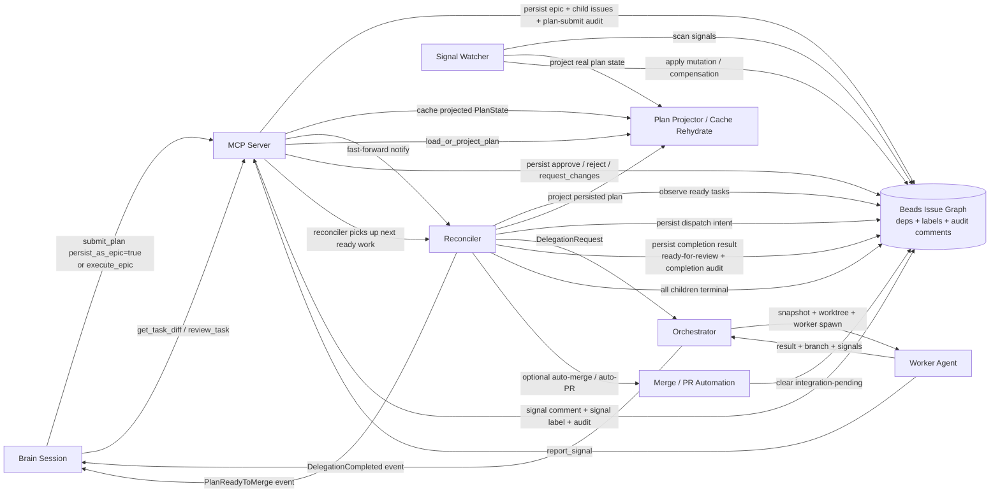
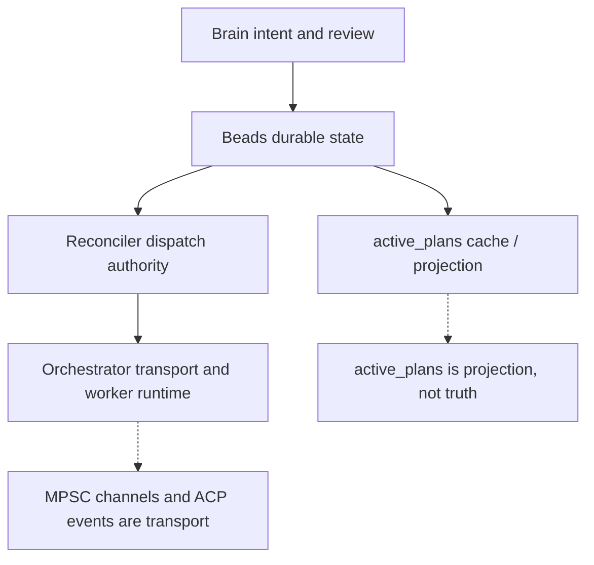
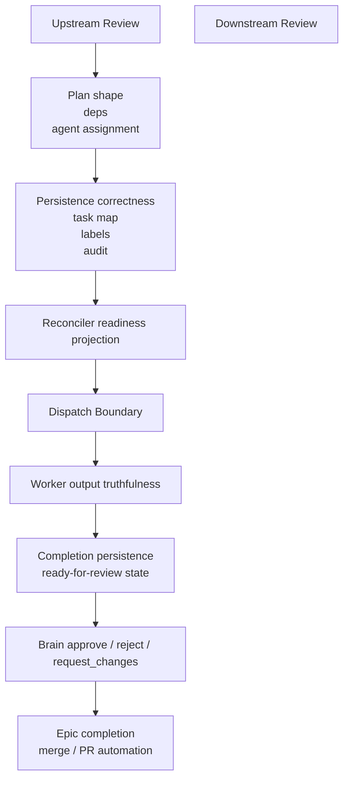

# RCA: Persisted Plan Control Loop Grounding — Brain -> MCP -> Beads -> Reconciler -> Worker

**Date:** 2026-04-22
**Reviewer:** Codex
**Method:** source-grounded architecture review + end-to-end acceptance verification
**Grounded against:** `docs/superpowers/plans/2026-04-21-e2e-closure-v0e.md`, current `HEAD` `353cf2a`
**Scope:** `crates/spur-core/src/orchestrator.rs`, `crates/spur-mcp/src/server.rs`, `crates/spur-mcp/src/plan/{mod.rs,reconciler.rs,projector.rs,signal_watcher.rs}`, `crates/spur-acp/src/domain/{events.rs,continuation.rs}`
**Status:** investigation complete; no production fix in this document

---

## Executive Summary

The persisted-plan architecture has already crossed the authority boundary that the older `v0e` design docs were still trying to reach.

For persisted plans, the real mental model at current `HEAD` is:

1. The brain chooses structure and review decisions.
2. The MCP server persists that structure into Beads.
3. Beads is the durable operational truth.
4. The reconciler is the only persisted dispatcher.
5. The orchestrator is execution transport, not authority.
6. Workers write durable completion and signal breadcrumbs back into Beads.
7. The brain reviews projected persisted state, not a RAM-only plan.

That is the correct control-loop model now.

The remaining risks are not "persisted plans still dispatch from RAM." That problem is largely closed. The remaining risks are narrower:

- lifecycle signaling is asymmetric between ephemeral and persisted plans
- projection still carries legacy-label compatibility and therefore some ambiguity
- dispatch/completion orphan handling still depends on compensation and replay
- future code can still accidentally treat `active_plans` as authority instead of cache

---

## What Changed Relative To Older Mental Models

Older docs in this area describe a split-brain topology:

- persisted `submit_plan` / `execute_epic` write to Beads
- `run_plan` still dispatches persisted work from RAM
- the reconciler only observes
- the signal watcher uses a stub plan

That is no longer the architecture at `HEAD`.

The grounded current state is:

- persisted `submit_plan` persists the epic graph, caches a `PlanState`, and only fast-forwards the reconciler
- `execute_epic` derives from an existing epic, persists execution labels, caches a `PlanState`, and only fast-forwards the reconciler
- `run_plan` is explicitly ephemeral-only and exits immediately when `epic_id` is present
- `review_task` persists decisions but leaves follow-on dispatch to the reconciler
- the signal watcher projects real persisted plan state from Beads before scoring or applying mutations
- cache misses rehydrate from `project_plan_from_beads`

---

## Current Control Loop

### Main persisted path

### Authority boundary

---

## Cross-Review Model

The architecture has two review seams:

- **upstream review**: before work is dispatched
- **downstream review**: after worker completion is persisted

Those seams are where the brain's mental model can still diverge from the durable system model.

### Upstream review questions

- Did the brain create the right dependency graph, or only a valid one?
- Did MCP persist every task with enough structure for later projection?
- Does the reconciler see the same readiness state the brain expects?

### Downstream review questions

- Did the worker result become durable Beads state before the brain reviewed it?
- Is the brain reviewing projected durable state, or stale cache?
- Does approval of a task necessarily lead to the correct downstream next-ready dispatch?
- Does "all terminal" mean the same thing for event emission, epic closure, and integration?

---

## Flaw Inventory

| ID | Possible flaw | Severity | Why it is still plausible |
|---|---|---:|---|
| F1 | Persisted lifecycle asymmetry: `PlanReadyToMerge` is durable-path emitted, `PlanCompleted` still appears ephemeral-only | High | Brain re-entry semantics are stronger for detached worker completions than for persisted plan terminal states |
| F2 | Future code treats `active_plans` as authority instead of cache | High | The map still exists and is still populated on ingress, even though persisted truth now lives in Beads |
| F3 | Projection ambiguity from legacy + namespaced label compatibility | Medium | Projector accepts both legacy and namespaced dispatch/review labels |
| F4 | Dispatch/completion orphan windows require replay and compensation | Medium | Dispatch intent is written before send; completion clear/writeback is multi-step; recovery relies on later reconciliation |
| F5 | Auto-merge / auto-PR path depends on durable bootstrap completeness | Medium | Merge requires persisted base snapshot and per-task `worker_branch` correctness |

---

## Evidence By Flaw

### F1. Persisted lifecycle signaling is asymmetric

`run_plan` emits `PlanCompleted`, but only for ephemeral plans. It explicitly returns early when `epic_id` is present.

- `crates/spur-mcp/src/plan/mod.rs:1049-1059`
- `crates/spur-mcp/src/plan/mod.rs:1379-1387`

The durable persisted path emits `PlanReadyToMerge` from the reconciler when all children are approved and the epic closes with `spur:integration-pending`.

- `crates/spur-mcp/src/plan/reconciler.rs:548-599`

Inference: the architecture now has a stronger persisted "all-approved" signal than "all-terminal" signal. That is a narrower problem than the old RCA's split-brain claim, but it is still a mental-model gap.

### F2. `active_plans` is projection, but the codebase still makes it easy to misuse

Persisted submit and execute both still insert into `active_plans`.

- `crates/spur-mcp/src/server.rs:3197-3205`
- `crates/spur-mcp/src/server.rs:3505-3518`

But persisted reads now explicitly reload from Beads on cache miss or on persisted entries.

- `crates/spur-mcp/src/server.rs:3873-3903`
- `crates/spur-mcp/src/plan/projector.rs:327-453`

This is the right architecture. The risk is future code drifting back toward "cached state is real state" because the map is still the most convenient local object.

### F3. Projection still carries compatibility ambiguity

The projector accepts both namespaced and legacy labels for dispatch and review-ready state.

- `crates/spur-mcp/src/plan/projector.rs:8-10`
- `crates/spur-mcp/src/plan/projector.rs:121-136`
- `crates/spur-mcp/src/plan/projector.rs:179-268`

This is deliberate and probably necessary during migration, but it means projection is still an inference layer, not just a direct readout of one canonical vocabulary.

### F4. Dispatch/completion orphan handling is correct by compensation, not by atomicity

The reconciler persists dispatch intent before sending the worker request.

- `crates/spur-mcp/src/plan/reconciler.rs:278-313`
- `crates/spur-mcp/src/plan/mod.rs:843-905`

Completion persistence is also multi-step: update terminal or review-ready state, clear dispatch intent, emit completion audit, then notify fast-forward.

- `crates/spur-mcp/src/plan/mod.rs:966-1024`

Recovery exists:

- startup reclaim projects persisted plans and resolves dispatch orphans
- explicit `DispatchOrphanCleared` audit breadcrumbs are written when cleanup occurs

- `crates/spur-mcp/src/server.rs:876-920`
- `crates/spur-mcp/src/server.rs:3839-3870`

This is a reasonable design, but it means correctness still depends on replay/reconciliation after unlucky crash timing.

### F5. Auto-merge depends on durable bootstrap and per-task branch facts staying complete

The reconciler's auto-merge / auto-PR hook runs only on the durable all-approved path and only when the gate is enabled.

- `crates/spur-mcp/src/plan/reconciler.rs:480-541`

`merge_plan` itself requires:

- fully approved projected tasks
- a persisted base snapshot ref or oid
- a `worker_branch` for every approved task

- `crates/spur-mcp/src/server.rs:2783-2903`

This is much safer than the older RAM-only merge path, but it remains sensitive to any missing durable bootstrap metadata or missing worker-branch recovery.

---

## Why The Architecture Is Fundamentally Better Now

The critical authority questions are now answered cleanly:

1. **Where is persisted operational truth?**  
   In Beads issue state plus audit comments.

2. **Who dispatches persisted work?**  
   The reconciler.

3. **What is the orchestrator?**  
   Transport and execution runtime.

4. **What is `active_plans`?**  
   A projection cache and convenience object, not the source of truth.

5. **What does the brain review?**  
   Projected persisted plan state, not a stub plan.

That closes the old split-brain defect. The remaining defects are seam defects, not architecture-ownership defects.

---

## Grounding Checks

Verified against current code and the following tests:

- `cargo test -p spur-mcp --test e2e_closure_v0e -- --nocapture`
- `cargo test -p spur-mcp --test persisted_authority_flip -- --nocapture`

Observed result during grounding:

- `e2e_closure_v0e`: 3 passed
- `persisted_authority_flip`: 10 passed

These tests materially support the current mental model:

- no persisted direct dispatch from `submit_plan`
- no persisted direct dispatch from `execute_epic`
- reconciler dispatch owns persisted follow-on work
- signal watcher projects real persisted state
- cache-miss rehydration from Beads works
- hybrid fast-forward wakeups match polling semantics

---

## Final Root Cause Statement

The old root cause was "persisted-plan authority is split between RAM and Beads."

That is no longer the grounded root cause at current `HEAD`.

The current root cause class is narrower:

**persisted-plan authority is now mostly correct, but lifecycle signaling, projection compatibility, and compensation-based recovery still leave enough seam ambiguity for the brain's mental model to drift from the durable system model.**

That is the architecture to review going forward.
