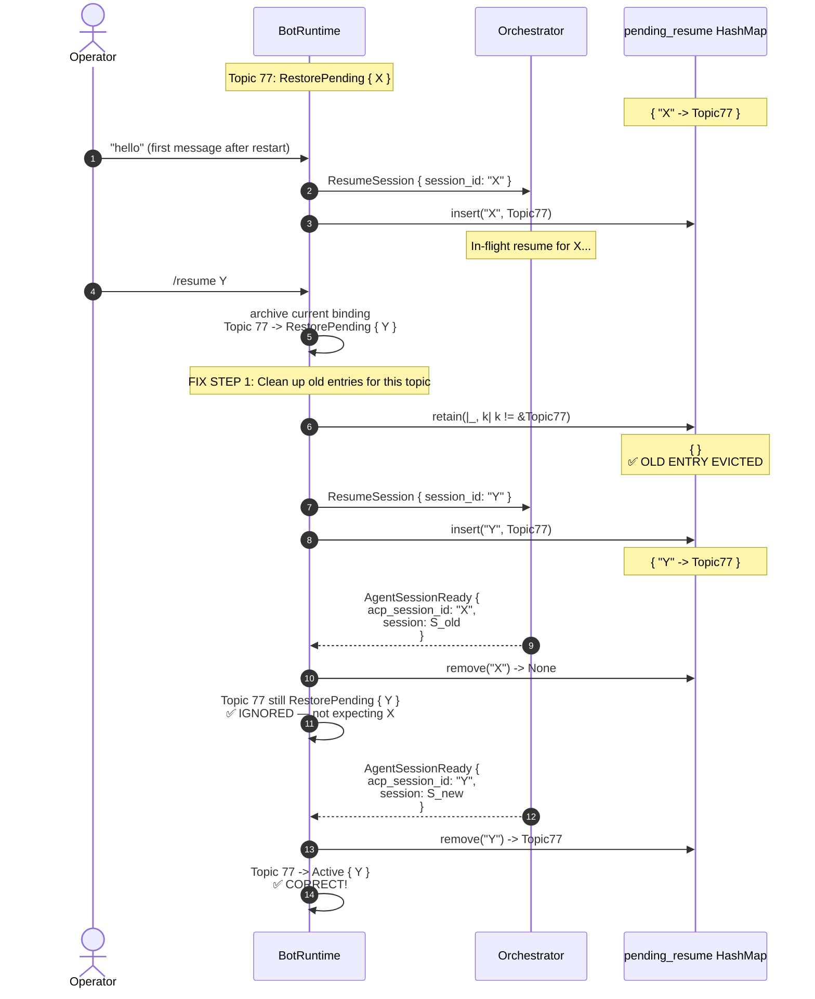
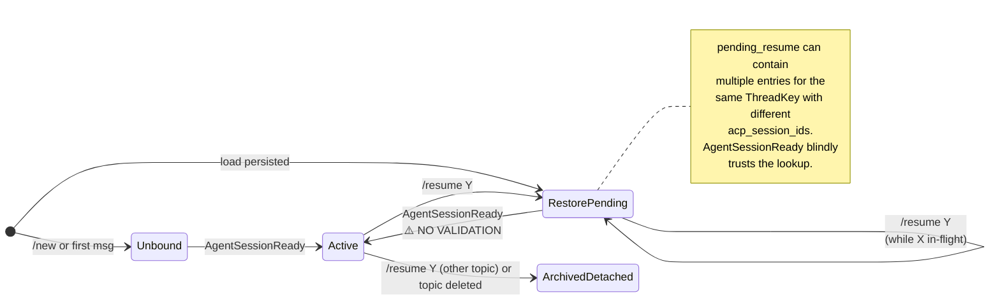
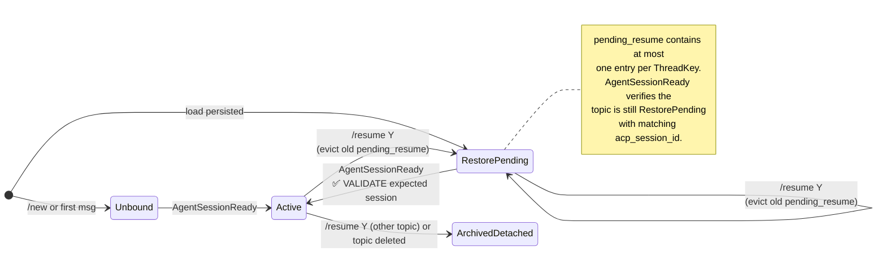

# RCA: Telegram Thread Sessions — `pending_resume` Leak on Same-Topic Rebind

**Date:** 2026-04-22
**Author:** L9 Rust Staff Engineer (MCTS + First-Principles Review)
**Status:** Critical Bug — Pending Fix
**Target Component:** `crates/spur-bot/src/runtime.rs`
**Spec Reference:** `docs/superpowers/specs/2026-04-22-spur-bot-telegram-thread-sessions-design.md`

---

## 1. Problem Statement

When a Telegram topic is in `RestorePending` state (waiting for `AgentSessionReady` after a `ResumeSession` command), and the user issues `/resume <different_session_id>` in the **same topic**, the old `acp_session_id`'s entry in `pending_resume` is **not removed**. A late `AgentSessionReady` for the old session can then hijack the topic, overwriting its `RestorePending { new_session }` binding with `Active { old_session }` — violating the operator's explicit intent.

This is a correctness failure with only a weak detection channel: the user asked
to resume session Y, but a stale ready event can still bind the topic to session
X instead. The bot may emit `Restored session X`, but that only helps if the
operator notices the mismatch immediately.

---

## 2. Root Cause (First Principles)

The `pending_resume` HashMap is keyed **only by `acp_session_id`**:

```rust
pending_resume: HashMap<String, ThreadKey>
```

This design assumes a **1:1 mapping** between `acp_session_id` and `ThreadKey` during the restore window. But the spec allows **1:N** mapping from `ThreadKey` to `acp_session_id` over time (a topic can be rebound multiple times). When the same topic changes its target session **before** the previous `AgentSessionReady` arrives, the old key-value pair becomes an **orphan** in the map.

The runtime does not validate, on `AgentSessionReady`, that the target topic is *still expecting that session*. It blindly trusts the `pending_resume` lookup.

**Invariants violated:**
- "`AgentSessionReady` remains the only commit point for activating a binding" — true, but the commit point is **unguarded**.
- "no ACP session may be live-bound to multiple topics simultaneously" — true at steady state, but during the rebind window, two `ResumeSession` commands for different sessions can both target the same topic via orphaned map entries.

---

## 3. MCTS Decision-Tree Walk

### Branch B1: Happy Path (Cross-Topic `/resume`)

**State:** Topic A is `Active { X }`. Topic B is `Unbound`. User sends `/resume X` in Topic B.

**Trace:**
1. Conflict resolution finds Topic A owning `X`.
2. Topic A is archived. `live_session` removed. `session_threads` cleaned.
3. Topic B becomes `RestorePending { X }`.
4. `pending_resume.insert("X", TopicB)` **overwrites** the old `"X" -> TopicA` mapping.
5. `AgentSessionReady { acp_session_id: "X" }` arrives → binds to Topic B.

**Verdict:** ✅ Correct. HashMap overwrite saves us.

---

### Branch B2: Bug Path (Same-Topic Rebind During RestorePending, X Ready First)

**State:** Topic 77 is `RestorePending { acp_session_id: "X", brain: "kimi" }`. `pending_resume` contains `"X" -> Topic77`. The `ResumeSession { "X" }` command is in flight to the orchestrator.

**User action:** Sends `/resume Y` in Topic 77.

**Trace (BUGGY):**

1. Topic 77 starts in `RestorePending { X }` with `pending_resume = { "X" -> Topic77 }`.
2. Operator issues `/resume Y` in the same topic.
3. Runtime updates Topic 77 to `RestorePending { Y }` and inserts
   `pending_resume = { "X" -> Topic77, "Y" -> Topic77 }`.
4. `AgentSessionReady(X)` arrives first. The runtime removes `"X"` from
   `pending_resume` and commits `Active { X }` without checking that the topic
   now expects Y.
5. `AgentSessionReady(Y)` arrives later. The runtime removes `"Y"` and commits
   `Active { Y }`.

**Verdict:** 🚨 **P1 Bug**. This ordering does **not** produce a permanent
hijack, but it still violates operator intent: the topic is briefly rebound to X
and the bot emits a misleading `Restored session X` message. It also risks stale
route state because `session_threads` now contains both the old and new live
session ids pointing at the same topic.

---

### Branch B3: Bug Path (Same-Topic Rebind During RestorePending, Y Ready First)

**State:** Same as B2.

**Trace (BUGGY):**

1. Topic 77 starts in `RestorePending { X }` with `pending_resume = { "X" -> Topic77 }`.
2. Operator issues `/resume Y` in the same topic.
3. Runtime updates Topic 77 to `RestorePending { Y }` and inserts
   `pending_resume = { "X" -> Topic77, "Y" -> Topic77 }`.
4. `AgentSessionReady(Y)` arrives first and correctly commits `Active { Y }`.
5. A later stale `AgentSessionReady(X)` still finds `"X" -> Topic77` and
   overwrites the topic back to `Active { X }`.

**Verdict:** 🚨 **P1 Bug**. This is the permanent hijack ordering. The final
binding disagrees with the operator's latest explicit `/resume Y`.

---

### Branch B4: Expected Correct Path (After Fix)

**State:** Same as B2.

**Trace (FIXED):**



**Verdict:** ✅ Correct. Both cleanup and commit-time validation are required.

---

## 4. Before / After State Diagrams

### Before (Bug): State Machine Leak



### After (Fix): Guarded State Machine



---

## 5. Code Grounding

### 5.1 The Leak Site (`/resume` handler)

`crates/spur-bot/src/runtime.rs:439-509`

```rust
BotCommand::Resume { session_id } => {
    // ... archive conflicts on OTHER topics ...

    // Archive any current live binding for THIS topic.
    if let Some(old_session) = record.live_session.take() {
        // ...
        self.session_threads.remove(&old_session);
    }

    let brain = record.brain.clone().unwrap_or_else(|| "kimi".into());
    record.binding = BindingState::RestorePending {
        acp_session_id: session_id.clone(),
        brain: brain.clone(),
    };
    // ...

    handle
        .send_command(spur_core::InteractiveInput::ResumeSession {
            session_id: session_id.clone(),
        })
        .await?;
    self.pending_resume.insert(session_id.clone(), key.clone());
    // ❌ OLD pending_resume ENTRY FOR THIS TOPIC IS NOT REMOVED
    self.state_store.save(&self.persistable_state())?;
    // ...
}
```

**Missing:** `self.pending_resume.retain(|_, k| k != &key);`

---

### 5.2 The Unvalidated Commit Site (`AgentSessionReady` handler)

`crates/spur-bot/src/runtime.rs:564-621`

```rust
spur_acp::SpurEventBody::AgentSessionReady {
    session,
    acp_session_id,
    brain,
    resumed,
    ..
} => {
    let key = if resumed {
        self.pending_resume
            .remove(&acp_session_id)
            .or_else(|| self.session_threads.get(&session).cloned())
    } else {
        // FIFO fresh session logic...
    };

    let key = key.unwrap_or_else(|| {
        ThreadKey::lobby(self.persisted.operator_chat_id.unwrap_or(0))
    });

    if let Some(record) = self.threads.get_mut(&key) {
        record.binding = BindingState::Active {
            session: session.clone(),
            acp_session_id: acp_session_id.clone(),
            brain: brain.clone(),
        };
        // ...
    }
    // ❌ NO VALIDATION THAT THE TOPIC EXPECTS THIS SESSION
}
```

**Missing:** A guard that checks `record.binding` is still
`RestorePending { acp_session_id: expected }` matching the event, plus a stale
resumed-event drop path instead of falling through to the lobby/default route.

---

## 6. Impact Assessment

| Dimension | Assessment |
|-----------|------------|
| **Frequency** | Low in normal use (users rarely `/resume` twice in quick succession), but **protocol-reachable** on every restore |
| **Severity** | High — the topic can bind to the wrong ACP session and route subsequent messages incorrectly |
| **Detectability** | Partial — the UI may show `Restored session X`, which is evidence of the bug, but only if the operator notices the mismatch against the requested Y |
| **Recovery** | Manual — operator must `/resume Y` again, but may not realize the mismatch happened |
| **Blast radius** | Single topic, but if the wrong session is active, all subsequent messages in that topic are misrouted |

---

## 7. Fix (Two-Part Defense in Depth)

### Part 1: Cleanup on `/resume` (Prevention)

In `runtime.rs`, `/resume` handler, before the `pending_resume.insert`:

```rust
// Evict any pending_resume entry for this topic. A topic can only
// have one in-flight resume at a time; keeping old entries creates
// orphaned bindings that a late AgentSessionReady can hijack.
self.pending_resume.retain(|_, k| k != &key);
```

### Part 2: Validation on `AgentSessionReady` (Fail-Safe)

In `runtime.rs`, resumed ready events should not fall through to the current
`lobby`/`session_threads` fallback path. A stale resumed event with no pending
target is not routable work; it is superseded state and should be dropped.

Restructure the resumed branch so that it only commits when:

- `pending_resume.remove(&acp_session_id)` returns a topic, and
- that topic still has `BindingState::RestorePending { acp_session_id: expected }`
  where `expected == event.acp_session_id`.

For example:

```rust
let key = if resumed {
    let Some(key) = self.pending_resume.remove(&acp_session_id) else {
        // Late or duplicate resumed event with no pending target.
        return Ok((None, vec![]));
    };

    let still_expects = self.threads.get(&key).is_some_and(|record| {
        matches!(
            &record.binding,
            BindingState::RestorePending {
                acp_session_id: expected,
                ..
            } if expected == &acp_session_id
        )
    });

    if !still_expects {
        // The topic was rebound or otherwise stopped waiting for this ACP id.
        return Ok((None, vec![]));
    }

    key
} else {
    // existing fresh-session FIFO logic
}
```

**Why both?** Part 1 prevents orphaned same-topic resume entries. Part 2 is the
fail-safe that stops any stale resumed event from mutating runtime state or
falling back to the lobby. Defense in depth.

---

## 8. Regression Tests

Add coverage to `crates/spur-bot/tests/runtime_flow.rs`. The current suite
already guards the analogous stale-event case for fresh sessions
(`stale_fresh_ready_does_not_reactivate_rebound_topic`), but it does not cover
same-topic resumed rebinding.

Minimum matrix:

1. `same_topic_rebind_during_restore_old_ready_then_new_ready`
   - Start in `RestorePending { X }`
   - Trigger `/resume Y`
   - Deliver `AgentSessionReady(X)` first, then `AgentSessionReady(Y)`
   - Assert the topic stays `RestorePending { Y }` after the stale X event
   - Assert final binding is `Active { Y }`
   - Assert no stale live route for X remains after Y binds

2. `same_topic_rebind_during_restore_new_ready_then_old_ready`
   - Start in `RestorePending { X }`
   - Trigger `/resume Y`
   - Deliver `AgentSessionReady(Y)` first, then stale `AgentSessionReady(X)`
   - Assert final binding remains `Active { Y }`
   - Assert the stale X event does not overwrite the topic or emit a misleading
     restore render

3. `stale_resumed_ready_with_no_pending_target_is_dropped`
   - Deliver `AgentSessionReady { resumed: true }` after the pending target has
     been cleared
   - Assert it does not bind the lobby
   - Assert it does not create `session_threads` routing for the stale session

One concrete test can look like:

```rust
#[tokio::test]
async fn same_topic_rebind_during_restore_ignores_stale_ready_for_old_session() {
    let (mut runtime, handle, mut user_rx) = test_runtime();
    runtime.restore_topic_binding(42, 77, "Session 1".into(), "acp-X".into(), "kimi".into());

    // First message triggers ResumeSession for X
    runtime
        .handle_chat_text(&handle, 42, Some(77), "hello")
        .await
        .unwrap();
    assert!(matches!(
        user_rx.recv().await.unwrap(),
        spur_core::InteractiveInput::ResumeSession { session_id } if session_id == "acp-X"
    ));

    // Before X's AgentSessionReady arrives, rebind to Y
    runtime
        .handle_chat_text(&handle, 42, Some(77), "/resume acp-Y")
        .await
        .unwrap();
    assert!(matches!(
        user_rx.recv().await.unwrap(),
        spur_core::InteractiveInput::ResumeSession { session_id } if session_id == "acp-Y"
    ));

    // Late AgentSessionReady for X must be ignored
    runtime
        .handle_spur_event(spur_acp::SpurEvent::now(
            spur_acp::SpurEventBody::AgentSessionReady {
                session: spur_acp::SessionId("spur_X".into()),
                acp_session_id: "acp-X".into(),
                brain: "kimi".into(),
                resumed: true,
                cancel_mode: spur_acp::CancelMode::AcpSoft,
            },
        ))
        .unwrap();

    let record = runtime.thread_record(77).expect("topic 77 present");
    assert!(
        matches!(
            &record.binding,
            BindingState::RestorePending { acp_session_id, .. } if acp_session_id == "acp-Y"
        ),
        "stale ready for X must not overwrite the /resume Y target; binding was {:?}",
        record.binding
    );
    assert!(
        record.live_session.is_none(),
        "topic 77 must not gain a live session from the stale ready"
    );

    // Now the real ready for Y arrives
    runtime
        .handle_spur_event(spur_acp::SpurEvent::now(
            spur_acp::SpurEventBody::AgentSessionReady {
                session: spur_acp::SessionId("spur_Y".into()),
                acp_session_id: "acp-Y".into(),
                brain: "kimi".into(),
                resumed: true,
                cancel_mode: spur_acp::CancelMode::AcpSoft,
            },
        ))
        .unwrap();

    let record = runtime.thread_record(77).expect("topic 77 present");
    assert!(
        matches!(
            &record.binding,
            BindingState::Active { acp_session_id, .. } if acp_session_id == "acp-Y"
        ),
        "topic 77 must finally bind to Y; binding was {:?}",
        record.binding
    );
}
```

---

The key requirement is not one specific test shape; it is that both event
orders and the routing side effects are asserted.

---

## 9. Related Findings (Same Review, Lower Severity / Separate Verification)

| # | Finding | File | Severity |
|---|---------|------|----------|
| 2 | `pending_inputs` is a single-slot overwrite buffer during `RestorePending` — second message loses first | `runtime.rs` | P2 |
| 3 | Deleted-topic send failures crash the bot (spec requires archive + lobby notification) | `telegram/mod.rs` | P2 |
| 4 | `BindingState::Active` with `#[serde(skip)] session` needs separate verification; current `persistable_state()` rewrites `Active -> RestorePending` before save, so this risk is not established by this RCA | `state.rs` | Research |
| 5 | `/sessions` and `/help` accepted in topics (spec implies lobby-only) | `runtime.rs` | P3 |
| 6 | `is_topic_message` defensive check missing in router | `router.rs` | P3 |

---

## 10. Verification Commands

```bash
# Confirm the leak path exists
grep -n "pending_resume.insert" crates/spur-bot/src/runtime.rs

# Confirm no cleanup of pending_resume on /resume
grep -B5 -A5 "pending_resume.insert" crates/spur-bot/src/runtime.rs

# Confirm AgentSessionReady has no validation of expected session
grep -A30 "AgentSessionReady {" crates/spur-bot/src/runtime.rs | head -40

# Run existing tests (all pass — the bug is not yet covered)
cargo test -p spur-bot --test runtime_flow -- --test-threads=4
```
