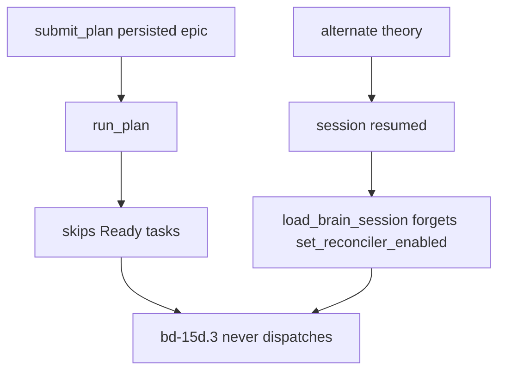
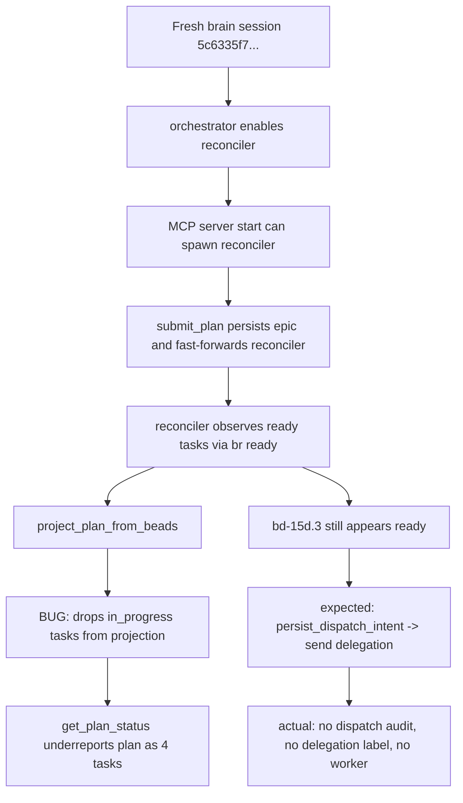
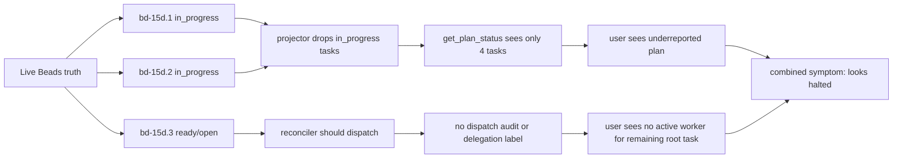

# RCA: `bd-15d` Persisted Plan Halt — Confirmed Read-Model Bug, Remaining Dispatch Gap

**Date:** 2026-04-23
**Reviewer:** Codex
**Method:** source-grounded control-flow review + live Beads state check + targeted session-id log lookup
**Grounded against:** current `HEAD`, epic `bd-15d`, plan `aeeb992d-8e56-46a1-8bc4-e878ad93a3b8`
**Scope:** `crates/spur-core/src/orchestrator.rs`, `crates/spur-mcp/src/server.rs`, `crates/spur-mcp/src/plan/{reconciler.rs,projector.rs,mod.rs}`, `crates/spur-pm/src/beads.rs`
**Status:** investigation complete for the current evidence; no code fix in this document

---

## Executive Summary

The stalled plan `aeeb992d-8e56-46a1-8bc4-e878ad93a3b8` is not explained by the original `run_plan()` theory, and it is not explained by the resumed-session reconciler omission either.

What is proven:

1. `get_plan_status()` and any persisted read-model projection for this plan are wrong by construction because `project_plan_from_beads()` drops `in_progress` tasks. That bug is real and explains why the projected plan showed only 4 tasks when Beads had 6 children.
2. `run_plan()` is irrelevant for this incident because `bd-15d` is a persisted epic-backed plan, and persisted plans do not dispatch through `run_plan()`.
3. The plan was submitted from a fresh `Creating brain session` path, not a resumed `Loading brain session` path, so the resume-specific omission of `set_reconciler_enabled(...)` is not the root cause for `bd-15d`.
4. `bd-15d.3` remained genuinely ready in Beads and had no dispatch audit, no `delegation-id:*` label, and no rollback evidence. That means the remaining failure boundary is in the persisted reconciler path before or at dispatch intent persistence, not in worker execution.

What is not proven:

- Why the live reconciler did not dispatch `bd-15d.3` despite the task being ready-observable.

So the final grounded conclusion is:

> This incident decomposes into one confirmed product bug and one still-unproven runtime dispatch gap.

The confirmed bug corrupted the plan read model. The actual halt of `bd-15d.3` is narrower: a persisted-reconciler nondispatch somewhere between ready observation and `persist_dispatch_intent(...)` / delegation send.

---

## Incident Snapshot

Observed live state on 2026-04-23:

- `bd-15d.1` and `bd-15d.2` were `in_progress`.
- `bd-15d.3` remained `open`.
- `br ready -l spur:plan-id:aeeb992d-8e56-46a1-8bc4-e878ad93a3b8 --limit 20 --json` still returned `bd-15d.3`.
- `br show bd-15d.3` showed no `delegation-id:*` label and only the initial `task-spec` audit comment.
- The epic's `plan-submit` audit recorded brain session `5c6335f7-6ccf-4970-8f0c-865ffc10503e`.

Symptom cluster:

- persisted plan projection underreported the plan as 4 tasks
- root task `bd-15d.3` stayed runnable but undispatched
- no worker was active for the remaining root task

---

## Before vs After

### Before: incorrect incident model



This model was attractive, but wrong for this incident:

- `run_plan()` is ephemeral-only for persisted plans.
- the session that submitted `bd-15d` was created fresh, not resumed.

### After: grounded incident model



The projector bug is confirmed. The nondispatch of `bd-15d.3` remains localized to the persisted reconciler dispatch boundary.

---

## Grounded Control Flow

### 1. Fresh-session startup does enable the reconciler

Two fresh-session startup paths both call `set_reconciler_enabled(...)` before server start:

- `crates/spur-core/src/orchestrator.rs:821-833`
- `crates/spur-core/src/orchestrator.rs:2064-2076`

The MCP server only spawns a dispatch-capable reconciler when `reconciler_enabled` is set and the PM backend exposes `advanced()`:

- `crates/spur-mcp/src/server.rs:1422-1445`
- `crates/spur-mcp/src/server.rs:1834-1888`

### 2. The resume-path omission is real, but not this incident

`load_brain_session()` creates the callback server and starts it without calling `set_reconciler_enabled(...)`:

- `crates/spur-core/src/orchestrator.rs:2235-2260`

That is a real code defect. But it is not the root cause here because the `plan-submit` audit recorded brain session `5c6335f7-6ccf-4970-8f0c-865ffc10503e`, and the targeted session-id lookup in `.spur/logs/spur.log.2026-04-23` found:

- `Creating brain session brain=codex session=5c6335f7-6ccf-4970-8f0c-865ffc10503e`

So `bd-15d` came from a fresh session, not a resumed one.

### 3. Persisted plans do not dispatch through `run_plan()`

`run_plan()` exits immediately when `epic_id.is_some()`:

- `crates/spur-mcp/src/plan/mod.rs:1044-1055`

And persisted projection recreates plans with `epic_id: Some(epic.id)`:

- `crates/spur-mcp/src/plan/projector.rs:461-469`

So the earlier "run_plan skips Ready tasks" explanation does not apply to `bd-15d`.

### 4. Persisted dispatch goes through the reconciler

Persisted `submit_plan` does not execute tasks inline. It persists the plan, emits the plan-submit audit with `brain_session_id`, inserts the cached state, and only fast-forwards the reconciler:

- `crates/spur-mcp/src/server.rs:3208-3233`

The reconciler then:

1. observes ready summaries
2. projects the full plan from Beads
3. checks the projected task status is `Ready`
4. persists dispatch intent
5. sends the worker request

See:

- `crates/spur-mcp/src/plan/reconciler.rs:297-340`

Ready observation is currently backed directly by `br ready`:

- `crates/spur-mcp/src/plan/reconciler.rs:743-760`
- `crates/spur-pm/src/beads.rs:772-803`

### 5. The read-model bug is confirmed

`project_plan_from_beads()` only queries `open` and `closed` issues:

- `crates/spur-mcp/src/plan/projector.rs:341-360`

That necessarily drops any child task in `in_progress`, which exactly matched live Beads state for `bd-15d.1` and `bd-15d.2`.

This is sufficient to explain:

- why projected plan state showed 4 tasks instead of 6
- why `get_plan_status()` underreported the plan

### 6. `bd-15d.3` still should have projected `Ready`

The projector strips the epic parent-child edge from execution dependencies:

- `crates/spur-mcp/src/plan/projector.rs:425-436`

Then `recompute_open_statuses(...)` promotes `Pending` or `Ready` tasks to `Ready` when all dependencies are approved or cancelled:

- `crates/spur-mcp/src/plan/projector.rs:284-297`

For `bd-15d.3`, the only dependency shown in Beads was the epic parent-child edge. After that edge is stripped, it has no execution dependencies and should remain `Ready`.

That matches the live Beads result from `br ready ...`, which still surfaced `bd-15d.3`.

---

## Findings

### F1. Confirmed: persisted read-model corruption

**Severity:** High

The persisted projector omits `in_progress` tasks, so projected state is wrong whenever any active worker exists in the plan.

Impact on this incident:

- `bd-15d.1` and `bd-15d.2` vanished from projected state
- the plan looked smaller and less active than reality
- debugging based on `get_plan_status()` was misleading

### F2. Confirmed: original `run_plan()` halt theory was a false attribution

**Severity:** Medium

`run_plan()` is not the durable executor for epic-backed plans. The earlier diagnosis mixed ephemeral and persisted execution models.

Impact on this incident:

- it sent debugging toward the wrong runtime
- it delayed inspection of the reconciler path

### F3. Confirmed: resume-path reconciler omission exists, but is ruled out here

**Severity:** Medium

`load_brain_session()` does omit `set_reconciler_enabled(...)`. That bug should be fixed separately.

But the `bd-15d` submission session was fresh, so it is not this incident's root cause.

### F4. Remaining root-cause boundary: persisted reconciler nondispatch before worker handoff

**Severity:** High

`bd-15d.3` was:

- ready in Beads
- still open
- not carrying a dispatch label
- not carrying a dispatch rollback trail

Given the reconciler flow, that localizes the remaining failure boundary to one of these points:

1. the reconciler never ran for this server instance despite fresh-session startup
2. the reconciler ran but never reached the `bd-15d.3` summary
3. it reached the summary but did not survive projection/status checks
4. it stopped before `persist_dispatch_intent(...)`

What is ruled out on current evidence:

- worker runtime failure as the primary cause for `bd-15d.3`
- `run_plan()` as the dispatcher
- resumed-session reconciler omission for this plan

---

## Root Cause Statement

The root cause for the **incorrect persisted plan state** is confirmed:

> `project_plan_from_beads()` excludes `in_progress` tasks, corrupting persisted plan projection and making `get_plan_status()` untrustworthy during active execution.

The root cause for the **actual nondispatch of `bd-15d.3`** is not fully proven, but the boundary is now narrow:

> a persisted-reconciler failure between ready observation and dispatch intent persistence for a fresh-session server instance.

That is the honest final RCA on current evidence. Anything stronger would overclaim.

---

## Why The Plan Looked "Halted"



The user-visible halt was a composition of:

- a confirmed status-projection bug
- a narrower unresolved nondispatch bug

---

## Corrective Actions

### Immediate fixes

1. Fix `project_plan_from_beads()` to include `in_progress` tasks in persisted projection.
2. Add a focused regression test proving active persisted plans do not disappear from `get_plan_status()`.

### Follow-up debugging

1. Instrument the reconciler branches around:
   - `observe_ready_summaries()`
   - post-projection task lookup
   - `PlanTaskStatus::Ready` guard
   - `persist_dispatch_intent(...)`
2. Add a persisted-plan integration test where three root tasks exist, two move to `in_progress`, and the third still dispatches.
3. Fix the separate resume-path omission in `load_brain_session()` so resumed sessions cannot silently lose reconciler dispatch capability.

---

## Grounding Commands

The following evidence was used directly for this RCA:

```bash
br ready -l spur:plan-id:aeeb992d-8e56-46a1-8bc4-e878ad93a3b8 --limit 20 --json
br show bd-15d
br show bd-15d.3
rg -n "McpCallbackServer::new\\(" crates/spur-core/src/orchestrator.rs
```

Log grounding was intentionally limited to the targeted session-id lookup for `5c6335f7-6ccf-4970-8f0c-865ffc10503e` because broad scans of `.spur/logs/spur.log.2026-04-23` are operationally expensive in this environment.

---

## Bottom Line

The investigation corrected two tempting but wrong explanations.

- `run_plan()` is not the dispatcher for `bd-15d`.
- resumed-session startup is not the cause of this specific halt.

The incident is now reduced to two concrete truths:

- one confirmed bug: persisted projection drops `in_progress` tasks
- one narrowed runtime gap: reconciler did not dispatch a ready root task even though Beads still surfaced it as ready

That is the map-territory-correct state of the problem.

---

Fixed in: bd-3rvt

