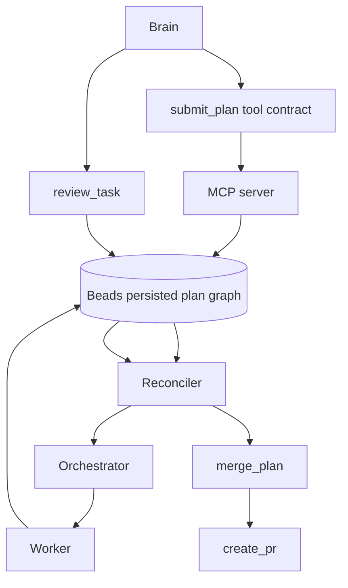
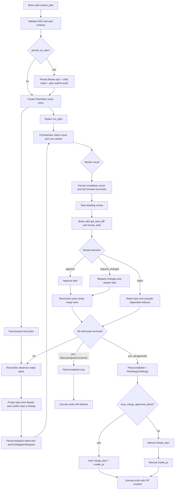

# RCA: `submit_plan` End-to-End Journey Re-Evaluation

**Date:** 2026-04-23
**Reviewer:** Codex
**Method:** source-grounded architecture review + map-territory framing + MCTS-style branch re-evaluation
**Grounded against:** current `HEAD` plus the public tool contract in `crates/spur-mcp/src/tools.rs`
**Scope:** `crates/spur-mcp/src/server.rs`, `crates/spur-mcp/src/plan/{mod.rs,reconciler.rs,projector.rs}`, `crates/spur-core/src/orchestrator.rs`, `crates/spur-mcp/src/tools.rs`, `docs/superpowers/plans/2026-04-21-e2e-closure-v0e.md`
**Status:** investigation complete; no production fix in this document

---

## Executive Summary

The current persisted-plan journey is best understood with a strict map-territory split.

- The **map** says `submit_plan` creates a dependency-ordered execution plan, persisted plans mirror into Beads, the reconciler redispatches post-review work, and fully approved plans can be merged and turned into PRs.
- The **territory** is narrower and more precise: persisted `submit_plan` does **not** dispatch inline. It persists the epic graph, caches a `PlanState`, and only fast-forwards the reconciler. The reconciler is the durable dispatcher. The orchestrator is transport and worker runtime. Beads is the durable state authority. `active_plans` is a cache/projection layer for persisted plans, not the source of truth.
- The **highest-value correction** from this second pass is that the durable flow is mostly coherent now, but one major map-territory gap remains: the reconciler documentation still claims a `bv`-guarded ready path, while the implementation currently uses `br ready`/`list_ready(...)` directly.

If you need one sentence that survives the full review:

> Persisted `submit_plan` is a durable control-loop kickoff, not a direct executor.

---

## Review Lens

This pass uses two complementary frames.

### 1. Map vs territory

- **Map:** what the public tool contract, code comments, and normalized `v0e` plan say should happen
- **Territory:** what the runtime code actually does after `submit_plan`

### 2. MCTS-style branch re-evaluation

Instead of assuming one mental model, we evaluate competing branches:

1. What actually dispatches work after persisted `submit_plan`?
2. What actually backs `get_plan_status` and `review_task`?
3. What actually counts as "the end of the journey"?

The winning branch at each node becomes the corrected operational model.

---

## The Map

The public and design-level map is coherent in intent.

### Public tool contract

The `submit_plan` tool advertises a DAG executor where tasks without dependencies are "dispatched immediately," while `persist_as_epic=true` mirrors the plan into Beads as an epic with child tasks. See `crates/spur-mcp/src/tools.rs:470-491`.

The `review_task` tool contract says:

- `approve` closes the task
- `reject` closes the task and cascades dependent failures
- `request_changes` reopens the task and lets the reconciler redispatch it later

See `crates/spur-mcp/src/tools.rs:537-570`.

The `execute_epic` tool contract describes a durable path: hydrate a plan from an epic's children, dispatch in dependency order, and continue through `get_plan_status`, `get_task_diff`, and `review_task`. See `crates/spur-mcp/src/tools.rs:601-628`.

### Normalized `v0e` architecture map

The normalized `v0e` plan explicitly says the old direct-execution path for persisted `submit_plan` should be retired, `run_plan` should be ephemeral-only, and persisted dispatch should belong to the reconciler. See `docs/superpowers/plans/2026-04-21-e2e-closure-v0e.md:1-53`.

### Intended flow, as the map suggests

That map is directionally correct, but it compresses several important runtime distinctions.

---

## The Territory

This is the actual as-built flow at current `HEAD`.

### 0. Reconciler wiring exists before the plan is submitted

When the PM backend is Beads, the orchestrator enables reconciler support on the MCP callback server. See `crates/spur-core/src/orchestrator.rs:821-833`.

When the server starts with a Beads backend, it spawns a live reconciler with:

- delegation channel access
- task tracker
- brain session id
- event sink

See `crates/spur-mcp/src/server.rs:1808-1862`.

### 1. `submit_plan` persists first, then forks by durability mode

`handle_submit_plan(...)`:

1. parses and validates tasks
2. checks `persist_as_epic`
3. builds the Beads epic subgraph when persistence is requested
4. snapshots the base branch / oid
5. creates a `PlanState`
6. emits a `plan-submit` audit
7. inserts the plan into `active_plans`

See `crates/spur-mcp/src/server.rs:3061-3196`.

Then the fork happens:

- **persisted plan:** `fast_forward_reconciler()`
- **ephemeral plan:** `spawn_ephemeral_plan_runner(state)`

See `crates/spur-mcp/src/server.rs:3198-3201`.

This is the first decisive territory correction: persisted `submit_plan` does not execute work inline.

### 2. `run_plan` is explicitly not the persisted executor

`run_plan(...)` immediately returns if `epic_id.is_some()`, with a warning that persisted plans must use the reconciler. See `crates/spur-mcp/src/plan/mod.rs:1049-1055`.

So the durable path is not:

- `submit_plan` -> `run_plan` -> worker

It is:

- `submit_plan` -> Beads persistence -> reconciler -> worker

### 3. The reconciler is the durable dispatcher

On each tick, `tick_once()`:

1. reconciles terminal epics
2. observes ready task summaries
3. reprojects the full plan from Beads
4. confirms the task is actually `Ready`
5. persists dispatch intent
6. sends a `DelegationRequest`
7. persists completion when the worker finishes

See `crates/spur-mcp/src/plan/reconciler.rs:273-389`.

That makes the reconciler the durable dispatch authority.

### 4. The ready-task selection path is simpler than the map claims

This is the biggest map-territory mismatch in the current code.

The reconciler header still claims:

- primary engine = `bv --robot-triage`
- fallback = `br ready`
- `bv` is what enforces the `spur:plan-complete` guard

See `crates/spur-mcp/src/plan/reconciler.rs:1-20`.

But the implementation of `observe_ready_summaries()` currently calls `advanced.list_ready(...)` directly through the Beads advanced interface. See `crates/spur-mcp/src/plan/reconciler.rs:689-724`.

`observe_ready_via_br()` is not a separate fallback implementation; it currently does the same thing again. See `crates/spur-mcp/src/plan/reconciler.rs:738-762`.

This matters because the Beads epic receives the `spur:plan-complete` marker only after `build_epic_subgraph(...)` has finished creating the children. See `crates/spur-mcp/src/server.rs:415-423`.

So the current territory is:

- the runtime still works as a durable reconciler loop
- but its ready observation path no longer matches the documented guard model

### 5. The orchestrator is transport, worker runtime, and PM issue claimer

Once the reconciler sends a `DelegationRequest`, the orchestrator's `handle_delegations(...)` loop:

1. receives the request
2. registers cancellation
3. claims the backing issue as `in_progress`
4. runs the worker flow
5. emits `DelegationCompleted`

See `crates/spur-core/src/orchestrator.rs:2959-3075`.

That is transport/runtime behavior, not durable scheduling authority.

### 6. Completion durability is written before review

For plan execution, successful or modified worker results become `AwaitingReview`, while failed/cancelled results become terminal. For ephemeral flow this is done inside `run_plan(...)`; for durable flow the reconciler persists the completion result and nudges itself again. See:

- `crates/spur-mcp/src/plan/mod.rs:1095-1208`
- `crates/spur-mcp/src/plan/mod.rs:997-1017`
- `crates/spur-mcp/src/plan/reconciler.rs:351-384`

The durable writeback rule is:

- success/modification -> add review-ready state
- failure/cancel -> terminal close
- then clear dispatch intent
- then emit completion audit
- then fast-forward the reconciler

### 7. Persisted reads use Beads projection, not cached RAM authority

This is the second major territory correction.

For persisted plans, `load_or_project_plan(...)` does **not** trust the cached `active_plans` entry as authority. If the cached plan has an `epic_id`, it projects from Beads and reinstalls the projected state. See `crates/spur-mcp/src/server.rs:3865-3895`.

That means:

- `active_plans` is a cache
- Beads is the durable truth
- `get_plan_status` and `review_task` for persisted plans are grounded against projection, not RAM-only state

### 8. Review decisions mutate plan state, then persist Beads side effects

`handle_review_task(...)`:

1. mutates plan state under lock
2. performs Beads writes outside the lock
3. emits review events

See `crates/spur-mcp/src/plan/mod.rs:2373-2466`.

The key path semantics are:

- `approve`: task becomes approved; downstream newly-ready work is left for the reconciler
- `reject`: task becomes rejected and descendants are failed
- `request_changes`: task returns to open/pending and the reconciler redispatches it later

These semantics match the public map more closely than the submission path does.

### 9. Terminal epic closure is also owned by the reconciler

`reconcile_terminal_epics()` scans plan-complete epics and their children. When all children are terminal:

- it closes the epic if needed
- emits `EpicCompletion` audit if missing
- emits `PlanCompleted`
- adds/removes `spur:integration-pending`
- emits `PlanReadyToMerge` when the outcome is all-approved
- optionally auto-merges and creates a PR if the gate is enabled

See `crates/spur-mcp/src/plan/reconciler.rs:392-684`.

So the end of the journey is bifurcated:

- **terminal-with-failures path:** epic closes, `PlanCompleted`, no merge path
- **all-approved path:** epic closes, `PlanCompleted`, `PlanReadyToMerge`, then either manual or auto integration

### 10. Manual integration is still explicit unless auto-merge is enabled

`build_plan_status(...)` makes the success path explicit:

- `approved` + `merge_state=NotStarted` -> "Use merge_plan"
- `merge_state=Succeeded` -> "Use create_pr"

See `crates/spur-mcp/src/plan/mod.rs:1388-1652`.

`merge_plan_impl(...)` enforces:

- projected plan must be `ready_to_merge`
- a base snapshot must exist
- every approved task must have a `worker_branch`

Then it integrates branches in topological order and clears `integration-pending` on successful merge. See `crates/spur-mcp/src/server.rs:2768-2897`.

---

## End-to-End Flow From `submit_plan` To The End Of Journey

### Operational interpretation of the diagram

- The left fork is the durability boundary.
- The reconciler is only on the persisted branch.
- Review is not the end; it is another control-loop input.
- "End of journey" is not one event:
  - failure path ends at `PlanCompleted`
  - success path ends at `PlanReadyToMerge`, then `merge_plan`, then `create_pr`
  - auto-merge compresses the last two steps but only when gated on

---

## MCTS Re-Evaluation

### Node 1: What really dispatches work after persisted `submit_plan`?

| Branch | Hypothesis | Supporting evidence | Contradicting evidence | Result |
|---|---|---|---|---|
| A | Persisted `submit_plan` spawns `run_plan` directly | Older mental model; generic tool wording | `handle_submit_plan(...)` only fast-forwards reconciler for persisted plans; `run_plan(...)` exits when `epic_id` is present | Rejected |
| B | Persisted `submit_plan` persists state, then the reconciler dispatches | `server.rs:3198-3201`, `plan/reconciler.rs:273-389` | None strong enough to invalidate | Winner |
| C | Persisted `submit_plan` persists state but stays dormant until `execute_epic` | `execute_epic` is durable and idempotent | `submit_plan` itself wakes the reconciler, so it is not dormant | Rejected |

**Winner:** Branch B.

### Node 2: What is the source of truth for status and review?

| Branch | Hypothesis | Supporting evidence | Contradicting evidence | Result |
|---|---|---|---|---|
| A | `active_plans` cache is authoritative | `submit_plan` inserts into `active_plans` | `load_or_project_plan(...)` reprojects persisted plans from Beads | Rejected |
| B | Persisted plans use Beads projection as truth; cache is secondary | `server.rs:3865-3895`, `projector.rs:327+` | None strong enough to invalidate | Winner |
| C | Authority is mixed and unstable per call site | Superficially plausible because both cache and projector exist | Persisted reads are intentionally forced back through projection | Rejected |

**Winner:** Branch B.

### Node 3: What is the real terminal journey?

| Branch | Hypothesis | Supporting evidence | Contradicting evidence | Result |
|---|---|---|---|---|
| A | Every plan ends with `PlanCompleted` and stops there | `PlanCompleted` emission exists on terminal epic closure | Success path additionally emits `PlanReadyToMerge` and can continue into merge/PR | Rejected |
| B | Every successful plan auto-merges and creates a PR | Auto-merge hook exists | It is behind `auto_merge_approved_plans`; manual merge path remains first-class | Rejected |
| C | Terminal closure is bifurcated: all-terminal closes the plan; all-approved additionally opens integration/PR flow | `reconciler.rs:392-684`, `plan/mod.rs:1600-1624`, `server.rs:2768-2897` | None strong enough to invalidate | Winner |

**Winner:** Branch C.

### MCTS conclusion

The highest-probability operational model is:

1. persisted `submit_plan` kicks off a durable reconciler loop
2. Beads projection backs status and review
3. the terminal journey splits into failure closure or success integration

That model fits the territory better than any direct-execution interpretation.

---

## Map-Territory Gap Inventory

### G1. Ready observation drift

**Map:** reconciler comments say `bv` primary with `plan-complete` guard, `br ready` fallback.

**Territory:** `observe_ready_summaries()` calls `list_ready(...)` directly, and `observe_ready_via_br()` is not materially different.

**Why it matters:** the runtime no longer enforces exactly the guard model its own comments describe.

**Evidence:** `crates/spur-mcp/src/plan/reconciler.rs:1-20`, `689-762`.

### G2. "`dispatched immediately`" overstates persisted `submit_plan`

**Map:** `submit_plan` tool description suggests immediate DAG dispatch semantics.

**Territory:** persisted mode only persists, caches, and fast-forwards the reconciler. Dispatch is deferred until the reconciler tick / wakeup.

**Why it matters:** the public description collapses ephemeral and durable semantics into one sentence.

**Evidence:** `crates/spur-mcp/src/tools.rs:470-480`, `crates/spur-mcp/src/server.rs:3198-3201`.

### G3. `get_plan_status` docs under-describe the real state machine

**Map:** tool description says statuses are pending, ready, dispatched, completed, failed.

**Territory:** the actual state model includes `awaiting_review`, `approved`, `rejected`, `cancelled`, `superseded`, `merge`, and `ready_to_merge`.

**Why it matters:** the brain's monitoring vocabulary is richer than the tool description implies.

**Evidence:** `crates/spur-mcp/src/tools.rs:496-510`, `crates/spur-mcp/src/plan/mod.rs:1388-1652`.

### G4. The success ending is not "`submit_plan` to done"; it is "`submit_plan` to integration"

**Map:** public text can be read as though plan completion is the whole journey.

**Territory:** successful plans end in `PlanReadyToMerge`, then `merge_plan`, then `create_pr`, unless auto-merge is enabled.

**Why it matters:** "plan approved" is not yet "journey complete."

**Evidence:** `crates/spur-mcp/src/plan/reconciler.rs:672-680`, `crates/spur-mcp/src/plan/mod.rs:1606-1624`, `crates/spur-mcp/src/server.rs:2768-2897`.

---

## Corrected Mental Model

If the team wants one map that actually matches the territory, it should be this:

1. `submit_plan(persist_as_epic=true)` persists a Beads-backed plan graph and wakes the reconciler.
2. The reconciler is the only durable dispatcher.
3. The orchestrator runs workers and reflects issue ownership/runtime state.
4. Worker completion is persisted before review.
5. Persisted `get_plan_status` and `review_task` are grounded against Beads projection.
6. Terminal closure is owned by the reconciler.
7. Success does not end at approval; it ends at integration and PR creation.

That is the map that matches the territory today.

---

## Recommended Documentation Corrections

1. Update `crates/spur-mcp/src/plan/reconciler.rs` header comments so they describe the actual ready-selection path, or restore the promised `bv`-guarded implementation.
2. Tighten `submit_plan` tool docs to say that persisted plans are dispatched by the reconciler after persistence, not inline in the handler.
3. Expand `get_plan_status` tool docs to include `awaiting_review`, `approved`, `rejected`, and `ready_to_merge`.
4. Clarify in user-facing docs that the success journey is:
   - `submit_plan`
   - review approvals
   - `ready_to_merge`
   - `merge_plan`
   - `create_pr`
   unless the auto-merge gate is enabled.

---

## Final Judgment

The implementation is materially better grounded than the older split-brain mental model suggested.

The durable persisted path is coherent:

- Beads is truth
- reconciler is dispatch authority
- orchestrator is execution transport
- review is projection-backed
- merge/PR is the real success tail

But the public map still compresses or misstates several of those facts, and the reconciler's ready-observation comments have drifted far enough from the code that they are now part of the problem, not part of the solution.
