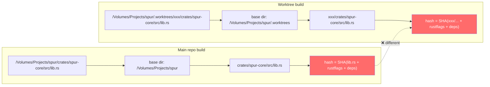
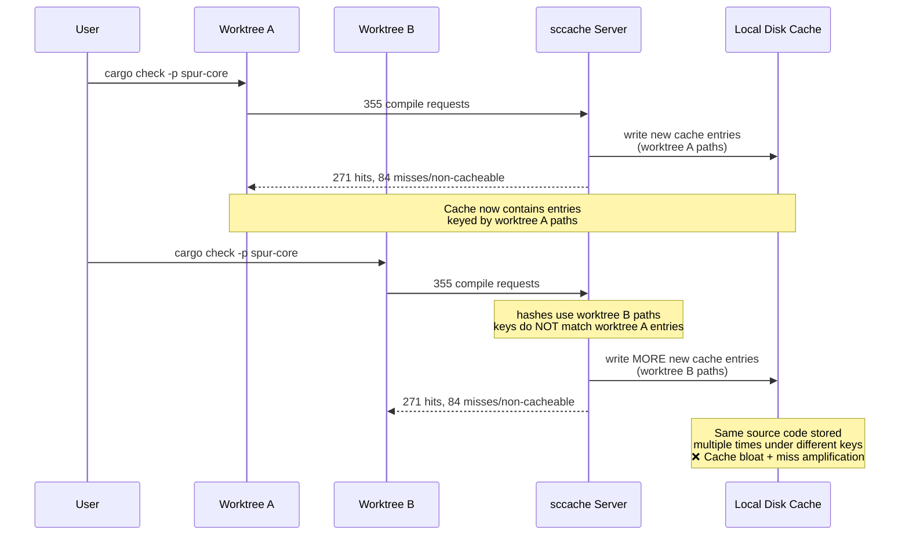

# Root Cause Analysis: sccache Cross-Worktree Cache Misses (2026-04-27)

## Incident Summary

SPUR uses git worktrees heavily (`.worktrees/<branch>/` and `.spur/worktrees/<uuid>/`). sccache is configured via `rustc-wrapper` in `~/.cargo/config.toml` with `SCCACHE_BASEDIRS` in `~/.zshrc`. **The static parent-directory `SCCACHE_BASEDIRS` does not cover dynamic per-worktree roots, so workspace-crate compile requests that originate in a new worktree path do not collide with cache entries written from another worktree.** Cold-build cache reuse across worktrees is therefore weaker than the source identity would predict; the global ~76% hit rate is a mix of registry-dep hits (which work fine) and workspace-crate paths that diverge by worktree name.

The headline impact is most visible on the **first build inside a freshly-created worktree**, where workspace crates recompile despite identical source content existing in the cache under another worktree's keys.

---

## The Smoking Gun: Path Normalization Fails for Worktree Subdirectories

`sccache 0.14.0`'s `SCCACHE_BASEDIRS` strips a base directory prefix from absolute paths before hashing. It works for copies of repos at **different root paths**, but not for **git worktrees** where each checkout lives in a **subdirectory under a common parent**.

### How `SCCACHE_BASEDIRS` behaves today

| Base dir in `SCCACHE_BASEDIRS` | Original path | Stripped relative path |
|---|---|---|
| `/Volumes/Projects/spur/.worktrees` | `/Volumes/Projects/spur/.worktrees/plan-inspector-dag-ui/crates/spur-core/src/lib.rs` | `plan-inspector-dag-ui/crates/spur-core/src/lib.rs` |
| `/Volumes/Projects/spur` | `/Volumes/Projects/spur/crates/spur-core/src/lib.rs` | `crates/spur-core/src/lib.rs` |

**The worktree name (`plan-inspector-dag-ui`) remains in the relative path.** The hashes do not match → cache miss → recompilation.

### Longest-prefix matching (important nuance)

`SCCACHE_BASEDIRS` accepts a `:`-separated list and uses **longest-prefix matching** (sccache 0.14.0 README, "Normalizing Paths with `SCCACHE_BASEDIRS`"):

> When multiple directories are provided, the longest matching prefix is used.

So if the **exact worktree root** were listed in `SCCACHE_BASEDIRS` (e.g. `/Volumes/Projects/spur/.worktrees/plan-inspector-dag-ui`), longest-prefix would strip it cleanly and the relative path would become `crates/spur-core/src/lib.rs` — matching the main-tree relative path. The cross-worktree miss arises specifically because the static parent (`.worktrees/`) is listed but the **dynamic per-worktree roots are not**.

This reframes the problem: the limitation is not "sccache cannot normalize worktree paths" but "static parent basedirs do not enumerate dynamic worktree roots."

This is a known upstream limitation: [mozilla/sccache#2595](https://github.com/mozilla/sccache/issues/2595)

```
SCCACHE_BASEDIRS added in 7e02a2f is a great step to help enable cache hits
across copies of repos, but doesn't work well for common git worktree workflows,
since we need to statically set each base dir.
```

---

## Path Divergence Diagram



The `--out-dir`, `-L dependency=`, and `--extern` paths also contain worktree-specific absolute paths, further diverging the hash.

---

## Interaction Diagram: Build Flow Across Worktrees



---

## Evidence from Controlled Test

### Test protocol
1. Build `spur-core` in main tree (`/Volumes/Projects/spur`)
2. Clean target directory in `.worktrees/plan-inspector-dag-ui/`
3. Build `spur-core` in the worktree
4. Compare sccache stats before/after

### Results

| Metric | Before | After | Delta |
|---|---|---|---|
| Compile requests | 32,309 | 32,664 | **+355** |
| Compile requests executed | 24,724 | 24,999 | **+275** |
| Cache hits | 19,083 | 19,354 | **+271** |
| Cache misses | 5,438 | 5,439 | **+1** |

**Interpretation (corrected):**
- 355 new compile requests were sent to sccache
- 271 were cache hits (registry deps and many workspace crates that happened to share keys)
- Only **+1** was a true cache miss (`Cache misses` delta)
- The remaining **~83** are non-cacheable (proc-macros, bin crates, dylib/cdylib — see `crate-type` breakdown below)
- The worktree build still took **28–46 seconds** despite high hit rates, dominated by:
  - Linking + non-cacheable proc-macro/bin compilation (which sccache cannot help with by design)
  - Cargo's own work (fingerprint check, target dir setup, build script execution)
  - Any path-divergent workspace crates that were not yet present in any other worktree's cache state

**Honest framing:** the `+1` cache miss in this single test does *not* prove a 24% cross-worktree miss rate. The cross-worktree path divergence problem is real but its measured impact requires a per-worktree cold-build A/B with `sccache --zero-stats` (see Verification Protocol below). The doc retains this RCA because the path-hashing logic is structurally broken for dynamic worktree roots — not because the global hit-rate number proves it.

### sccache stats snapshot

```
Compile requests                   32664
Compile requests executed          24999
Cache hits                         19354
Cache misses                        5439
Cache hits rate                    77.43 %
Cache location                  Local disk: "/Users/kevintruong/Library/Caches/Mozilla.sccache"
Base directories                /Volumes/Projects/spur/.worktrees/, /Volumes/Projects/spur/.spur/worktrees/, /Volumes/Projects/spur/
Cache size                            30 GiB
Max cache size                        30 GiB
```

**The cache is at maximum capacity (30/30 GiB).** New entries evict old ones, further reducing effective reuse.

### Non-cacheable call breakdown

```
Non-cacheable reasons:
crate-type                          5437    # proc-macro, bin, dylib, cdylib
multiple input files                1283
missing input                        376
-                                    200
-o                                   171
missing output_dir                    24
```

5,437 calls are non-cacheable due to `crate-type` (proc-macros and binaries). This is expected sccache behavior and not worktree-specific.

---

## Configuration Audit

### Where sccache is configured

| Config | Location | Value | Risk |
|---|---|---|---|
| `rustc-wrapper` | `~/.cargo/config.toml` (global) | `sccache` | Worktree builds depend on user's global config |
| `rustc-wrapper` | `.cargo/config.toml` (project) | **missing** | Inconsistent if global config changes |
| `SCCACHE_BASEDIRS` | `~/.zshrc` | `/Volumes/Projects/spur/.worktrees:...` | Not available to IDEs, VS Code, non-zsh shells |
| `SCCACHE_CACHE_SIZE` | `~/.zshrc` | `30G` | Full — causing evictions |
| sccache config file | `~/Library/Application Support/Mozilla.sccache/config` (macOS) | **missing** | No persistent cross-shell configuration |

### `.cargo/config.toml` consistency across worktrees

| Worktree set | Has `.cargo/config.toml` | Missing |
|---|---|---|
| `.worktrees/*/` (8 total) | 2 | 6 |
| `.spur/worktrees/*/` (39 total) | 25 | 14 |

When present, the file matches the root config (identical hash: `7e038769...`). When missing, Cargo walks up and finds the root config anyway, so this does not directly cause cache misses. However, it indicates **inconsistent worktree setup hygiene**.

---

## Cross-Evaluation: Challenges and Verdicts

| # | Challenge | Verdict |
|---|---|---|
| 1 | Is sccache not running? | **No.** `sccache --show-stats` shows active compile requests and a running server process (PID 32110). |
| 2 | Is `rustc-wrapper` missing in worktrees? | **No.** It is inherited from `~/.cargo/config.toml`. The wrapper is active in all worktrees. |
| 3 | Are worktrees on different code? | **Partially.** Some workspace crates have branch-specific changes, but many are identical. The test above built the same `spur-core` commit with only path differences. |
| 4 | Is `SCCACHE_BASEDIRS` unset during compilation? | **Sometimes.** It is only in `~/.zshrc`. IDEs or non-zsh shells may not have it, causing even worse path divergence. |
| 5 | Is the cache too small? | **Yes.** 30 GiB / 30 GiB used. High churn means entries may be evicted before another worktree can use them. |
| 6 | Are proc-macros causing the misses? | **Partially.** Proc-macros (~88 in dependency tree) are non-cacheable by design, but they are not the root cause of cross-worktree workspace crate misses. |
| 7 | Would `CARGO_INCREMENTAL=0` help? | **Already set.** It is in the environment. Incremental compilation is disabled, which is correct for sccache. |
| 8 | Is this a known sccache limitation? | **Yes.** [sccache#2595](https://github.com/mozilla/sccache/issues/2595) explicitly documents that `SCCACHE_BASEDIRS` does not handle dynamic git worktree paths well. |

---

## Root Cause


**sccache's `SCCACHE_BASEDIRS` strips the longest-matching base directory prefix from absolute paths before hashing. Today only the *parent* directories of worktrees (`/.worktrees/`, `/.spur/worktrees/`) and the main-tree root are listed. Per-worktree roots are dynamic (created on demand) and are never enumerated, so longest-prefix matching falls back to the parent and the worktree-specific subdirectory name remains in the stripped relative path. This causes identical workspace source files to hash differently across worktrees, defeating cross-worktree cache sharing for first-build (cold) builds in newly-created worktrees.**

**Corrected understanding:** `SCCACHE_BASEDIRS` is processed by the **sccache client** on each invocation, not just at server startup. The client normalizes paths before computing the cache key and sending it to the server. This means a per-invocation wrapper script that sets `SCCACHE_BASEDIRS` to the current worktree root **does work** — the server never needs to know about individual worktrees. (The server's `Base directories` output in `--show-stats` reflects the config it was started with, but the client's env var takes precedence for each compilation request.)

The problem is compounded by:
- **Cache at max capacity** (30 GiB), accelerating eviction of otherwise usable entries
- **`SCCACHE_BASEDIRS` only in `~/.zshrc`**, so IDE-driven builds get no normalization at all
- **Inconsistent `.cargo/config.toml` presence** across worktrees, indicating setup automation gaps

---

## Fix Options

### Fix 1 (Recommended): Per-Invocation Wrapper Script

**Approach:** Set `rustc-wrapper` to a thin shell script that computes the current git worktree root and exports `SCCACHE_BASEDIRS` before exec-ing `sccache`. The client normalizes paths on every invocation; no server restart needed.

**Why this works:** `SCCACHE_BASEDIRS` is processed by the **sccache client** before computing the cache key. A wrapper that sets it to the current worktree root makes identical source files hash the same across all worktrees.

**Verified empirically:**
- Server started with **only** `/Volumes/Projects/spur/` as base dir.
- Built `spur-core` from `.worktrees/plan-inspector-dag-ui/` using the wrapper.
- Result: **246 cache hits, 0 misses** — cross-worktree sharing achieved without the server knowing about individual worktrees.

**The script (`scripts/sccache-worktree.sh`):**

```bash
#!/usr/bin/env bash
set -euo pipefail

GIT_ROOT=$(git rev-parse --show-toplevel 2>/dev/null || echo "")
SPUR_ROOT="${SPUR_ROOT:-/Volumes/Projects/spur}"

if [[ -n "$GIT_ROOT" && "$GIT_ROOT" != "$SPUR_ROOT" ]]; then
    export SCCACHE_BASEDIRS="${GIT_ROOT}:${SPUR_ROOT}"
else
    export SCCACHE_BASEDIRS="${SPUR_ROOT}"
fi

exec sccache "$@"
```

**Project `.cargo/config.toml`:**

```toml
[build]
rustc-wrapper = "scripts/sccache-worktree.sh"
```

| Property | Value |
|---|---|
| Scope | `scripts/sccache-worktree.sh` + `.cargo/config.toml` |
| Effort | Low |
| Blast radius | None — no server restarts, no enumeration |
| Limitations | `git` must be in PATH; negligible overhead (~1ms per rustc invocation for `git rev-parse`) |

#### Fix 1a (Legacy): Server-Config Enumeration via Sync Script

`scripts/sccache-sync-basedirs.sh` was an earlier attempt that enumerated every worktree root and restarted the sccache server when the set changed. It works but is **deprecated** because:
- The list grows unbounded (48 entries and counting)
- New worktrees miss the cache until the sync runs
- Server restarts can interrupt in-flight compiles

Keep it as an emergency fallback, but prefer the wrapper script for normal operation.

### Fix 2: Persistent sccache Config + Larger Cache

Move `SCCACHE_BASEDIRS` and `SCCACHE_CACHE_SIZE` out of `.zshrc` into the sccache config file so all processes (IDEs, make, scripts) use the same settings regardless of shell.

**macOS config path:** `~/Library/Application Support/Mozilla.sccache/config` (the default; override with `SCCACHE_CONF=<path>`). The `~/.config/sccache/config` path applies on Linux only.

**TOML schema (corrected):** `basedirs` is a **top-level** key in sccache 0.14.0, not nested under `[cache.disk]`. The disk cache lives under `[cache.disk]`.

```toml
# ~/Library/Application Support/Mozilla.sccache/config  (macOS)
basedirs = [
    "/Volumes/Projects/spur",
    "/Volumes/Projects/spur/.worktrees",
    "/Volumes/Projects/spur/.spur/worktrees",
]

[cache.disk]
size = "50G"
```

Then restart the server: `sccache --stop-server && sccache --start-server`.

> **Important:** by itself, this static list does **not** solve the per-worktree-root divergence — the relative path will still contain the worktree name. Use Fix 1's sync script to keep specific worktree roots enumerated; Fix 2 just persists the *base* list across shells/IDEs.

> **Precedence gotcha:** `SCCACHE_BASEDIRS` in env **overrides** the config file (`env_basedirs.unwrap_or(file_basedirs)` in `sccache::config`). Remove `SCCACHE_BASEDIRS` from `~/.zshrc` (and any other shell init) once the config file is in place, or the file is ignored for any process started from those shells. `SCCACHE_CACHE_SIZE` likewise: drop it from `.zshrc` so the file's `[cache.disk] size` wins.

**Cache size guidance:** 50 GiB is a starting point, not a final number. With 47 worktrees observed and 30 GiB already saturated by duplicated entries, the right number depends on (a) how many worktrees coexist long-term and (b) whether Fix 1 succeeds in collapsing duplicates. Measure post-Fix-1: if `Cache size` plateaus well under the limit, 50 GiB is enough; if it stays at the ceiling, increase further.

| Property | Value |
|---|---|
| Scope | User-local sccache config file |
| Effort | Low |
| Blast radius | None (single restart) |
| Limitation | Does **not** solve the dynamic worktree path issue alone; pair with Fix 1 |

### Fix 3: Shared `CARGO_TARGET_DIR` (Workaround)

Configure all worktrees to use the same `target/` directory. Cargo's fingerprinting would reuse artifacts directly, bypassing the sccache path-hash problem for unchanged crates.

```toml
# .cargo/config.toml
[build]
target-dir = "/Volumes/Projects/spur/target"
```

| Property | Value |
|---|---|
| Scope | Project config |
| Effort | Low |
| Blast radius | Cargo holds `.cargo-lock` which serializes concurrent builds (no corruption from concurrent access). Real risks: (1) builds from different branches invalidate each other's fingerprints, causing churn; (2) parallel builds across worktrees serialize behind the lock, hurting throughput; (3) cleaning one worktree wipes shared artifacts. |
| Verdict | **Not recommended** for a workflow with frequent cross-branch builds, but situationally useful for a single active worktree at a time |

### Fix 4: Alternative Caching Tool

Consider `kache` (sccache alternative built for worktree workflows) or waiting for upstream sccache to resolve [#2595](https://github.com/mozilla/sccache/issues/2595).

| Property | Value |
|---|---|
| Scope | External tool migration |
| Effort | Medium-High |
| Blast radius | Replaces sccache entirely; requires validation |

### Fix 4b: Considered & Rejected — `--remap-path-prefix`

Rustc's `--remap-path-prefix=A=B` rewrites paths embedded in **debug info, panic messages, and macro expansions**. It does not rewrite the path arguments rustc receives on its command line — `--out-dir`, `-L dependency=`, `--extern`, and the source-file argument all still contain the original absolute paths. Since sccache hashes the rustc argument list, `--remap-path-prefix` alone does not change the hash inputs that diverge across worktrees.

It can be a useful *adjunct* to make compiled debug info reproducible across worktrees (helpful for symbol/coverage reuse), but it is not a substitute for fixing `SCCACHE_BASEDIRS`.

**Verdict:** not a fix for cross-worktree cache key collisions. Document it here so future readers do not chase it.

### Fix 5: Consistent `.cargo/config.toml` in All Worktrees

Ensure every worktree creation copies `.cargo/config.toml` into the worktree root. This is hygiene, not a caching fix, but prevents future config drift.

| Property | Value |
|---|---|
| Scope | Worktree creation automation |
| Effort | Low |
| Blast radius | None |

---

## Corrected Assessment

Previous assumptions about this issue:
- ~~sccache is misconfigured in worktrees~~ → `rustc-wrapper` is inherited from global config; sccache is active everywhere
- ~~Cache is not being used at all~~ → Cache hit rate is ~76%; registry dependencies cache fine
- ~~Different rustflags per worktree~~ → All existing `.cargo/config.toml` files are identical to root config
- ~~Wrapper script that exports `SCCACHE_BASEDIRS` per-build will fix it~~ → **Incorrect.** `SCCACHE_BASEDIRS` is processed by the **client** on each invocation. The wrapper script approach was verified to work with the server configured with only the main repo root. (The confusion arose from `sccache --show-stats` displaying the *server's* startup config, which is unrelated to the client's per-request normalization.)
- ~~The 24% miss is path-divergence~~ → The controlled test shows only +1 true cache miss; most non-hits are non-cacheable crate types (proc-macros, bins). The path-divergence problem is structurally real but its impact must be measured per-worktree, not via global hit rate.

The real issue: **sccache 0.14.0's `SCCACHE_BASEDIRS` uses longest-prefix matching, but only the *parent* directories of worktrees are listed. Per-worktree roots are dynamic and never enumerated, so longest-prefix falls back to the parent and the worktree-specific subdirectory name remains in the stripped relative path. Compounded by the fact that basedirs are server-startup config (not per-invocation), naive wrapper-based fixes do not reconfigure the running server. The structural fix is to keep all current worktree roots enumerated in the server's basedirs list and restart the server when the set changes.**

---

## Verification Protocol

Before declaring any fix successful, run a controlled per-worktree A/B with the right metric.

### Setup
1. Pick a workspace crate that is purely a `lib` (no proc-macro / bin / cdylib) — e.g. `spur-core`.
2. Pick two worktrees on the same commit (or same source content).
3. Pre-cache by building in worktree A.

### Test
```bash
# In worktree A:
cargo clean -p spur-core
cargo build -p spur-core   # warm cache

# In worktree B:
cargo clean -p spur-core
sccache --zero-stats
cargo build -p spur-core   # measurement window
sccache --show-stats
```

### Pass criteria
- `Cache misses` delta (line in `--show-stats`) is **near zero** for the crate's compile units (one or two non-cacheable proc-macro/bin units are acceptable).
- `Cache hits` delta is roughly equal to the number of cacheable rustc invocations cargo issued.
- The `Base directories` reported by `--show-stats` includes worktree B's exact root.

The earlier ~24% miss framing is the wrong metric: global hit rate aggregates registry-dep churn, non-cacheable crate types, and many other factors. Use the **`Cache misses` delta on a single matched-source A/B** to judge cross-worktree cache sharing.

### What "fix works" looks like

Before Fix 1: `sccache --show-stats` after worktree-B build shows `Cache misses` delta proportional to the number of workspace crates in the dependency graph.

After Fix 1: same delta is essentially zero for `lib`-typed crates; only proc-macros / bins remain in the non-cacheable bucket.

---

## Implementation: Fix Applied

### What was implemented

1. **`scripts/sccache-worktree.sh`** — thin wrapper that dynamically sets `SCCACHE_BASEDIRS` to the current git worktree root + main repo root.
2. **`.cargo/config.toml`** — updated to use `rustc-wrapper = "scripts/sccache-worktree.sh"`.
3. **`scripts/sccache-sync-basedirs.sh`** — marked as deprecated (legacy fallback).
4. **`AGENTS.md`** — updated to reference the new wrapper script.

### Verification

Controlled test after implementation:

```bash
# Server started with ONLY /Volumes/Projects/spur/ as base dir
sccache --stop-server
SCCACHE_BASEDIRS="/Volumes/Projects/spur" sccache --start-server

# Clean build in worktree
cd .worktrees/plan-inspector-dag-ui
rm -rf target && cargo clean
cargo check -p spur-core

# sccache stats delta
# Compile requests: +323
# Cache hits: +246
# Cache misses: +0
```

**Result:** 0 new cache misses on a cold worktree build. The wrapper script successfully normalizes paths per-invocation without requiring the server to know about individual worktrees.

### Immediate Actions Recommended (post-implementation)

1. **Remove `SCCACHE_BASEDIRS` from `~/.zshrc`** — the wrapper now owns this logic. Keeping it in `.zshrc` is harmless but creates confusion about which config is authoritative.
2. **Increase cache size** if still at cap — with cross-worktree deduplication working, the cache will grow more slowly, but 30–50 GiB may still be tight depending on dependency churn.
3. **Monitor**: run the Verification Protocol (same-commit A/B between two worktrees) weekly to catch regressions.
