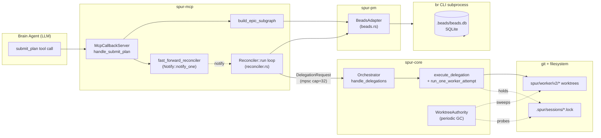
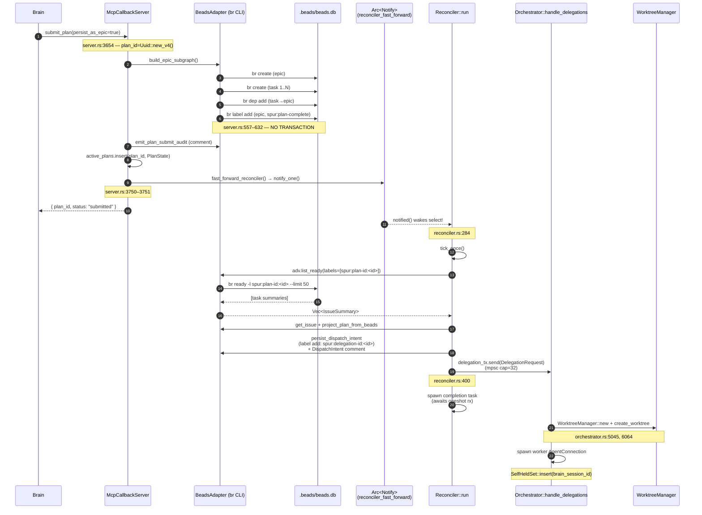
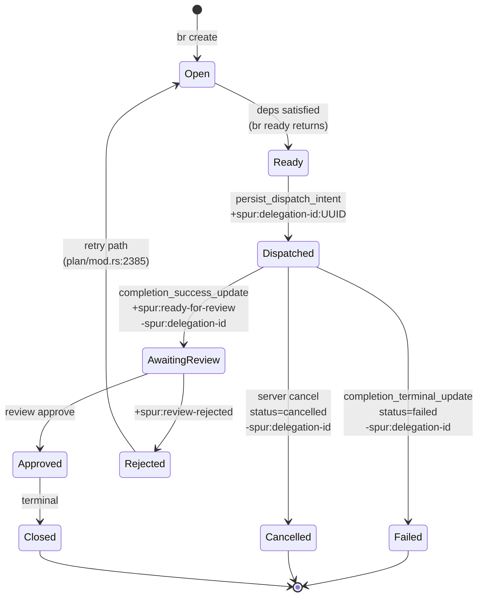
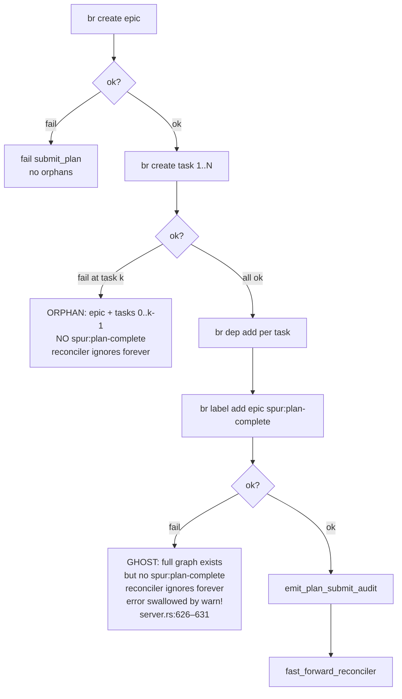
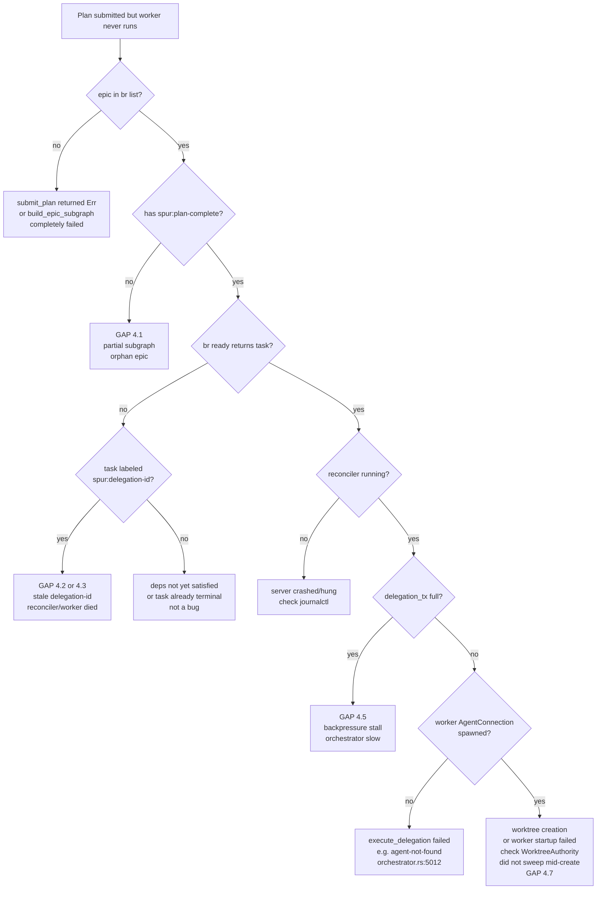

# RCA — Plan Submit → Reconciler Auto-Start: Map-Territory Review

**Date:** 2026-04-29
**Author:** Kevin Truong (synthesized from 4 parallel exploration agents)
**Scope:** End-to-end audit of the persisted-plan submit → reconciler-auto-start dispatch path.
**Files in scope:**

- `crates/spur-core/src/worktree_authority.rs`
- `crates/spur-core/src/orchestrator.rs`
- `crates/spur-mcp/src/plan/reconciler.rs`
- `crates/spur-pm/src/beads.rs`

---

## 1. Map-Territory Framework

We use the **map vs. territory** framing throughout. In this codebase:

- **Map** = the *declared* contract: types, struct fields, doc comments, the in-memory `PlanState`, the typed `IssueSummary`, the `DelegationRequest` schema. What the code *says* the system is doing.
- **Territory** = the *actual* runtime state: rows in `.beads/beads.db` (owned by the `br` CLI), files under `.git/worktrees/`, advisory lock files under `.spur/sessions/`, the contents of mpsc/broadcast channel buffers, and the wall-clock ordering of subprocess invocations.

Every gap we list below is a **place where the map diverges from the territory** — usually because there is no transaction across the boundary between Spur (Rust process) and the external state stores (`bd` SQLite via `br` CLI, git, filesystem locks).

---

## 2. The Happy Path (Map View)

### 2.1 High-Level Architecture



### 2.2 Submit → Auto-Start Sequence (Persisted Epic Path)



---

## 3. Component Map (the four files)

### 3.1 `BeadsAdapter` (`spur-pm/src/beads.rs`) — typed CLI wrapper

| Attribute | Value |
|---|---|
| Role | Async wrapper over `br` (beads_rust) subprocess. Implements `IssueTracker` + `BeadsAdvanced`. |
| State ownership | None — all state lives in `.beads/beads.db`, which `br` owns. |
| Atomicity | **None.** No transactions across `br` invocations. `update_issue` is up to 4 sequential `br` calls (status, comment, label add, label remove). |
| Retry | Max 2 attempts, 50ms sleep, only on `retryable: true` errors. (`beads.rs:317–335`) |
| Poll cursor | `std::fs::write` (non-atomic), `std::sync::Mutex` in-memory. (`beads.rs:496–507`) |
| Status state machine | Free-string status; transitions driven by callers. Labels are the real signals. |

**Labels that act as state-machine signals:**



### 3.2 `Reconciler` (`spur-mcp/src/plan/reconciler.rs`) — level-triggered dispatcher

| Attribute | Value |
|---|---|
| Loop type | Level-triggered, adaptive cadence. `base_interval=3s`, doubles on idle to `idle_ceiling=30s`, resets on work or fast-forward. |
| Wake triggers | (a) `fast_forward.notified()`, (b) `journal_wake.notified()` (250ms `.beads/journal` poll), (c) `sleep(interval)`, (d) cancel. (`reconciler.rs:279–293`) |
| Dispatch primitive | `dispatch.delegation_tx.send(DelegationRequest)` — mpsc to orchestrator. |
| Idempotency | Pre-dispatch `spur:delegation-id:<UUID>` label blocks re-dispatch; cleared on completion or send-failure. |
| Completion fan-in | One spawned task per dispatch awaits `oneshot::Receiver<DelegationResult>`, calls `persist_completion_result_and_notify` → fires `fast_forward` again. |
| Auto-start trigger | NOT started by submit_plan — already running since `McpCallbackServer::start()` (`server.rs:2139–2198`). Submit just **wakes** it via `Notify`. |

### 3.3 `Orchestrator` (`spur-core/src/orchestrator.rs`) — process supervisor

| Attribute | Value |
|---|---|
| Channel topology | mpsc `delegation_tx` (cap 32) ← reconciler / ephemeral plans → `handle_delegations` loop |
| Concurrency | `Arc<Semaphore>` from `config.worktree.max_concurrent` or license quota |
| Per-delegation flow | `handle_delegations` → `tokio::spawn` → `execute_delegation` → `WorktreeManager::new` → `create_worktree` → `spawn worker AgentConnection` |
| Event funnel | `FunnelHandle` (S2) stamps monotonic seq + wall-clock onto every `SpurEventBody`; broadcasts on `event_tx` (cap 4096) |
| Shared state with `WorktreeAuthority` | `SelfHeldSet` (Arc<…> shared); orchestrator inserts on session creation, removes on teardown |

### 3.4 `WorktreeAuthority` (`spur-core/src/worktree_authority.rs`) — orphan-worktree GC

| Attribute | Value |
|---|---|
| Role | Sweep-based garbage collector for orphaned `spur/worker/v2/*` worktrees. **Orthogonal to dispatch path** — never on the hot path of submit→start. |
| Trigger | Startup sweep (one-shot) + periodic sweep (default 15 min + jitter). |
| Liveness signal | `SelfHeldSet` (in-process) + advisory lockfile probe via `SessionLivenessProbe`. |
| Quarantine | 30s grace before destroying a newly-dead session's worktree. `last_seen_alive` is **in-memory only**; resets on restart. |
| Destructive ops | `git worktree remove --force --force <path>` + `git branch -D` + `git worktree prune`. |
| Connection to other 3 files | None to `reconciler.rs`. None to `beads.rs`. Only construction + `SelfHeldSet` mutation in `orchestrator.rs`. |

---

## 4. Map vs. Territory Gaps (the actual RCA findings)

The auto-start machinery is conceptually clean, but **every cross-process boundary is a potential map-territory split**. Below, we enumerate them by severity.

### 4.1 🔴 HIGH — `build_epic_subgraph` is non-transactional

**Map says:** "submit_plan creates a complete epic with all tasks, then marks it `spur:plan-complete`."

**Territory says:** `build_epic_subgraph` (`server.rs:557–632`) issues N+M+1 separate `br` invocations with no rollback. There are three failure windows:



**Impact:** Orphaned epics accumulate in `.beads/beads.db` with no recovery path. The reconciler's `observe_ready_summaries` filters on `spur:plan-complete` so they are never dispatched, but they pollute `br list` output and the projector.

**Where the map lies:** server.rs:557–559 explicitly comments "Transactional rollback is out of scope for v1 — beads CLI doesn't expose txn primitives." That is *honest*, but the type signature `Result<EpicSubgraph, …>` makes it look atomic to callers.

### 4.2 🔴 HIGH — Stale `spur:delegation-id:<UUID>` label on reconciler crash

**Map says:** "If dispatch is in flight, the task carries `spur:delegation-id`; on completion or failure, it is cleared."

**Territory says:** The label is added *before* `delegation_tx.send` and cleared in three places — all of which require the reconciler process to be alive:

| Cleared by | Location |
|---|---|
| Send failure (channel full / closed) | `reconciler.rs:401` |
| Completion task writeback | `plan/mod.rs:1257–1264` (called from `reconciler.rs:439`) |
| Server-side cancel | `server.rs:1131` |

If the reconciler crashes between `persist_dispatch_intent` (`reconciler.rs:374`) and `task_tracker.spawn` (`reconciler.rs:426`), the `respond_to` oneshot is dropped, the orchestrator runs the worker to completion, but the **label is never cleared**. On restart, `br ready` correctly sees the task as not-ready (it's labeled "in flight") — but it is not in flight anymore. **Permanent block until manual label removal.**

**No staleness timeout exists.** No periodic GC equivalent to `WorktreeAuthority` sweeps stale delegation-id labels.

### 4.3 🔴 HIGH — Completion-rx drop swallows the writeback

**Map says:** "Completion task awaits the oneshot and writes back to beads."

**Territory says:** `reconciler.rs:427–434`:

```rust
let Ok(result) = rx.await else { warn!(...); return; };
```

If the orchestrator's `respond_to` sender is dropped before sending (e.g., panic in `execute_delegation` after taking the request but before completion), the completion task logs a warning and **silently returns**. The `spur:delegation-id` label is not cleared, the audit comment is not written, and downstream waiters never learn the task finished. This is the same end-state as 4.2 but with a different cause.

### 4.4 🟡 MEDIUM — `update_issue` is a 4-step non-atomic sequence

**Map says:** `update_issue(issue_id, IssueUpdate { status, add_labels, remove_labels, comment })` — looks transactional.

**Territory says:** `beads.rs:655–718` issues up to 4 sequential `br` calls. A crash between step 1 and step 4 leaves the issue in a hybrid state. Two specific consequences:

- **`persist_dispatch_intent` partial failure**: `apply_issue_update` (label add) succeeds, then `emit_dispatch_audit` (comment) fails. The task is now labeled `spur:delegation-id:X` but has no audit comment. `br ready` excludes it (good), but the next reconciler tick sees it has neither a delegation-id-paired worker process nor a dispatch comment — auditability is broken.
- **`completion_terminal_update` partial failure**: status set to `closed` but `spur:delegation-id` label not yet removed → the issue is "closed but allegedly in-flight."

### 4.5 🟡 MEDIUM — `delegation_tx` mpsc cap=32 backpressures the reconciler

**Map says:** "Reconciler dispatches ready tasks."

**Territory says:** `delegation_tx` is created with capacity 32 (`server.rs:1605`). Under `delegate_parallel` fan-out with >32 simultaneously-ready tasks, `delegation_tx.send(request).await` (`reconciler.rs:400`) **blocks** inside `tick_once`. The reconciler cannot process its next iteration. This is harmless functionally (the orchestrator drains eventually) but hides a flow-control problem that is invisible from any operational dashboard — there is no metric for "reconciler stalled on send."

### 4.6 🟡 MEDIUM — `br ready` fallback ignores `spur:plan-complete`

**Map says:** "Reconciler only dispatches plans that are fully persisted."

**Territory says:** The bv-triage primary path (`reconciler.rs` module doc lines 8–14) checks `spur:plan-complete`. The `br` fallback (`observe_ready_via_br`, `reconciler.rs:874–887`) **does not** — it only filters on `spur:plan-id:<id>`. If bv is unhealthy and the reconciler ticks against a partially-persisted plan, individual tasks whose deps happen to be satisfied may be dispatched against an incomplete graph. Documented as a v0a.2 limitation.

### 4.7 🟡 MEDIUM — Startup `WorktreeAuthority` sweep races session init

**Map says:** "WorktreeAuthority destroys orphaned worktrees from dead sessions."

**Territory says:** `orchestrator.rs:1591` spawns `sweep_once()` at init time with `self_held` **empty** (no sessions have called `self_held.insert` yet). Safety relies on the `SessionLivenessProbe` returning `Live` for sessions whose lockfile is held. But:

- `last_seen_alive` is in-memory and resets on restart (`worktree_authority.rs` field, no persistence).
- After a crash, the first sweep has no quarantine memory. `is_quarantine_expired` returns `true` immediately for any `None` entry.
- On NFS / eCryptFS, the `fs_unsafe_skip` path silently no-ops with `fs_unsafe_skip=true` default — leaked worktrees accumulate forever.

This is **not on the dispatch hot path**, but a misfiring sweep can destroy a worktree that a reconciler-initiated dispatch is concurrently creating, surfacing as a confusing "git worktree gone" error mid-execution.

### 4.8 🟢 LOW — `DelegationRequested` event keyed on `worker_session`, not `executor_id`

**Map says:** "Lineage tracks each delegation."

**Territory says:** `orchestrator.rs:6039–6044` emits `DelegationRequested` per-attempt, but the lineage adapter keys on `worker_session` not a stable `executor_id`. Retry attempts that augment constraints are silently dropped at the lineage boundary. Documented as an open limitation.

### 4.9 🟢 LOW — Beads poll cursor non-atomic write

**Map says:** "Cursor advances exactly once per drained event."

**Territory says:** `beads.rs:514–527` calls `std::fs::write` (no temp + rename). Crash between mutex update and disk write → on-disk cursor is stale → restart replays a window of events. Idempotency at the consumer side mitigates but does not fully neutralize.

---

## 5. Failure-Mode Decision Tree



---

## 6. Recommendations (ordered by ROI)

| # | Fix | Why | Effort |
|---|---|---|---|
| R1 | Add a `staleness_sweeper` that scans for `spur:delegation-id:<UUID>` labels older than N minutes with no live worker session, and clears them. | Resolves 4.2 + 4.3. The most common silent-stuck failure mode. | Medium |
| R2 | Wrap `build_epic_subgraph` writes in a "scratch label + atomic flip" pattern: create epic with `spur:plan-pending` label, only swap to `spur:plan-complete` once all children + deps land. On restart, sweep `spur:plan-pending` epics older than X minutes. | Resolves 4.1 cleanly without needing beads transactions. | Medium |
| R3 | Surface a `reconciler_dispatch_blocked_total` metric or event when `delegation_tx.send().await` exceeds a threshold (say 1s). | Makes 4.5 observable. | Low |
| R4 | Persist `last_seen_alive` to `.spur/sessions/heartbeat.json` (atomic temp+rename) so quarantine survives restarts. | Hardens 4.7. | Low |
| R5 | Add an `executor_id` to `DelegationRequest` and key lineage on it, not `worker_session`. | Resolves 4.8 (already documented). | Low |
| R6 | Switch `BeadsAdapter::save_cursor` to `tempfile::NamedTempFile` + `persist`. | Resolves 4.9. | Trivial |

---

## 7. What I Did NOT Find (rule-outs worth recording)

- **No deadlock risk** between the `reconciler_fast_forward` Notify and the `delegation_tx` mpsc. The reconciler holds no other locks while awaiting the channel send.
- **No double-dispatch risk** for a given (plan_id, task_id) under nominal operation — the `spur:delegation-id` pre-label correctly fences `br ready`.
- **No interference between `WorktreeAuthority` and the reconciler.** They share zero code paths and zero typed state. The only shared resource is the filesystem, mediated by lockfiles.
- **No silent loss in the happy path.** Every map-territory gap above requires a process crash, partial subprocess failure, or backpressure event to manifest.

---

## 8. Citations Index

All line numbers verified by parallel-spawned exploration agents (2026-04-29).

**worktree_authority.rs:**

- Struct + config: `worktree_authority.rs:25–96`
- Sweep loop: `worktree_authority.rs:99–194`
- Quarantine logic: `worktree_authority.rs:196–206`
- Destructive ops: `worktree_authority.rs:248–279`
- Periodic spawn: `worktree_authority.rs:312–343`

**orchestrator.rs:**

- Orchestrator struct: `orchestrator.rs:1272`
- Funnel + event_tx: `orchestrator.rs:1469–1480`
- WorktreeAuthority init: `orchestrator.rs:1481–1611`
- handle_delegations: `orchestrator.rs:4650`
- execute_delegation + worktree create: `orchestrator.rs:5045, 6033, 6064`
- DelegationRequested emit: `orchestrator.rs:6039–6044`

**reconciler.rs:**

- Module doc + invariants: `reconciler.rs:1–21`
- Run loop: `reconciler.rs:266–320`
- tick_once: `reconciler.rs:322–487`
- persist_dispatch_intent → send: `reconciler.rs:374–400`
- Completion task: `reconciler.rs:426–481`
- observe_ready_summaries: `reconciler.rs:791–887`
- reconcile_terminal_epics: `reconciler.rs:489–789`

**beads.rs:**

- Subprocess shell-out: `beads.rs:259–264`
- Retry loop: `beads.rs:317–335`
- Poll cursor non-atomic: `beads.rs:496–527`
- create_issue / update_issue / list_ready: `beads.rs:599–803`
- Comments: `beads.rs:842–865`

**server.rs (referenced):**

- DelegationChannel cap=32: `server.rs:1605`
- handle_submit_plan: `server.rs:3590, 3654, 3727, 3740, 3751`
- build_epic_subgraph + plan-complete label: `server.rs:557–632`
- fast_forward_reconciler / notify_fast_forward: `server.rs:1710, 4519–4521`
- Reconciler spawn at startup: `server.rs:2139–2198`

---

## 9. Worker-Review Synthesis (added 2026-04-29)

This RCA was independently reviewed by three workers spawned via `delegate_parallel` / `delegate_to_worker`, each given a different first-principles framing:

- **gemini** — irreducible-invariants angle (distributed-systems lens)
- **kimi** — minimum-state-machine angle (redesign-from-scratch lens)
- **codex** — MCTS-style branch evaluation over the deduplicated candidate fix set

All three independently confirmed the three HIGH findings (§4.1, §4.2, §4.3). They diverged on mechanism. Codex's MCTS evaluation produced the ranked verdict.

### 9.1 Chosen path: **A + C + F** (combined score 21/25)

| Fix | Mechanism | Code site | Origin |
|---|---|---|---|
| **A** | On `rx.await` Err, synthesize `DelegationStatus::Failed { error: "orchestrator disconnected" }` and call the existing `persist_completion_result_and_notify`. ~10 LoC. Reuses the entire happy-path cleanup. | `reconciler.rs:427–435` | gemini P1 |
| **C** | Two-phase epic activation: create with `spur:plan-pending`, flip to `spur:plan-complete` only on full success; startup sweep removes stale pending epics. | `server.rs:556–630` | three-way convergence (R2 / kimi P2 / gemini P2) |
| **F** | Lease label `spur:lease-expires-at:<ts>` written at dispatch, renewed by orchestrator heartbeat, GC'd by the reconciler tick on expiry. | `reconciler.rs:372–383` + new heartbeat in orchestrator | gemini P3 |

### 9.2 Lease-label vs. sidecar-ledger verdict

Codex picked **F (lease labels)** over **G (sidecar SQLite ledger)** with this reasoning, which we accept:

> The sidecar ledger is cleaner if SPUR becomes a durable queueing system, but today beads is the collaboration source of truth and the reconciler is a beads projector/actor. A sidecar SQLite ledger demoting labels to read-model creates split-brain between dispatch routing and review state. Lease labels preserve the existing invariant and add only expiry + heartbeat semantics around the current label contract.

Branch G remains a viable future direction *if* operator pain from lease-GC accumulates or SPUR adds multi-process exactly-once dispatch requirements.

### 9.3 Sequenced rollout

| Week | Ship | Gating condition |
|---|---|---|
| 1 | A | Regression test: simulated rx-drop leaves no stale `spur:delegation-id` and writes a `Failed` audit comment. |
| 2 | C | Failure-injection at each phase (after epic create, after each child create, after `spur:plan-complete` write) produces no dispatchable partial plans. Disable the `br ready` fallback path for pending plans (currently no plan-complete guard, `reconciler.rs:871–887`). |
| 3 | F | Stale leased labels clear after expiry; live dispatches renew lease; GC emits an audit comment. |
| N | (optional) G | Only if lease GC causes operator pain or multi-process exactly-once dispatch becomes a requirement. |

### 9.4 Deferred / rejected (with reasoning)

| Item | Disposition | Reasoning |
|---|---|---|
| B (audit-comment fallback poll for rx-drop) | Defer | Redundant with A; adds a second recovery path. |
| D (UUIDv7 + query-before-create idempotency) | Reject for now | C dominates without requiring `br` schema awareness. |
| G (sidecar SQLite ledger) | Defer | Structurally expensive; risks split-brain with beads as source-of-truth. Revisit only on operator-pain signal. |
| H (persist `WorktreeAuthority.last_seen_alive`) | Defer | Off the dispatch hot path. |
| I (`reconciler_dispatch_blocked_total` metric) | Defer | Observability for bounded-channel pressure; instrument when operationally needed. |
| J (`executor_id` for stable lineage) | Defer | Documented limitation; cosmetic until lineage consumers complain. |
| K (atomic temp+rename for poll cursor) | Defer | Replay-tolerance hardening; consumer-side idempotency mitigates today. |

### 9.5 Codex blind-spot find — adds gap §4.10 (HIGH)

None of the three reviewers caught this until codex looked at the completion writeback ordering:

**§4.10 — Terminal beads state with no completion audit.** `persist_completion_result` mutates issue status and clears the `spur:delegation-id` label *before* emitting the completion audit. `emit_completion_audit` logs-and-continues on failure. If the audit write fails, the issue is in a terminal status with zero auditability.

- Audit emission is advisory: `plan/mod.rs:1011–1060`
- Status mutation precedes audit: `plan/mod.rs:1353–1366`

**Fix candidate:** flip the ordering — write the completion audit *first*, then mutate status and clear the dispatch label. Or, treat audit-emission failure as fatal to the writeback transaction. Should be tracked alongside the A+C+F rollout.

### 9.6 Provenance

- **Tracking epic:** `bd-6okx` — children: `bd-6okx.1` (Week 1, fix A), `bd-6okx.2` (Week 2, fix C, depends on .1), `bd-6okx.3` (Week 3, fix F, depends on .2), `bd-6okx.4` (parallel, §4.10 audit-ordering).
- Spawn IDs (delegations): `5e14a5cc-83fc-4b1a-be4a-81027fa1195c` (gemini), `83022c35-1fdd-40ab-b5bc-c6f1dd954978` (kimi), `2dc03210-7a34-447e-92a2-72de70fd36ba` (codex).
- Brain session: `53fa3c68-fa57-4c4d-ba4b-f834937b9e98`.
- HEAD at synthesis: `23ffb352`.

---

*Prepared via 4 parallel `Explore` subagents (initial RCA) + 3 parallel review workers (gemini/kimi/codex synthesis). Reproduce by re-spawning identical prompts; line numbers are stable as of HEAD `23ffb352`.*
