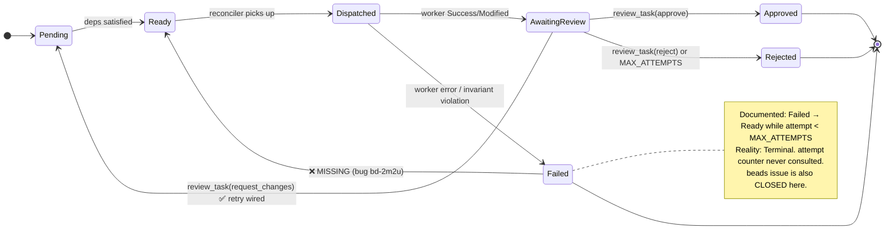
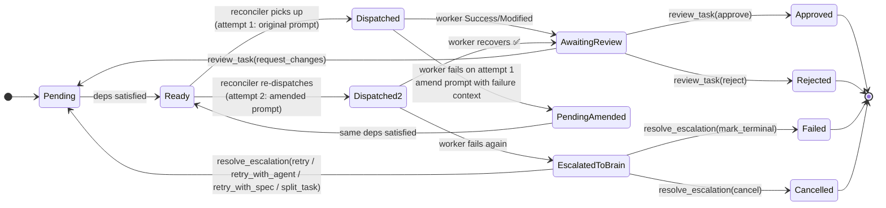
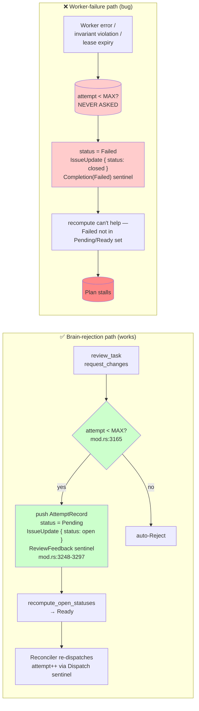
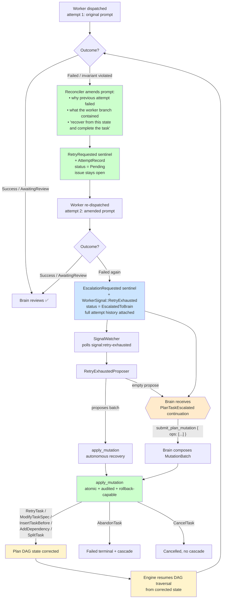

# RCA: `bd-2m2u` — No Auto-Retry for Worker-Output Failures (Failed → Ready Transition Missing)

**Date:** 2026-05-07
**Reviewer:** Claude (Opus 4.7), revised after dual-review by `worker://kimi` + `worker://codex`
**Method:** source-grounded control-flow walkthrough + cross-reference of cited file:line in `bd-2m2u`, then independent code-grounded critique by two parallel reviewers
**Grounded against:** current `HEAD` (commit `d0cae9f5`), `crates/spur-mcp/src/plan/{mod.rs,reconciler.rs,projector.rs,snapshot.rs,signal_watcher.rs,mutation.rs,mutation_executor.rs,proposers.rs}`
**Status:** investigation complete; design proposal revised after dual-review (see Revision History below) — no code fix in this document
**Related:**
- `bd-2m2u` (this issue)
- `bd-14cq` (parent — curated worker MCP brainstorm)
- `bd-1428` (Phase 1 epic where this fired)
- Plan `86721b92` (the broken plan)
- `docs/architecture-spur-mcp.md`

---

## Revision History

**v1 (initial draft):** proposed two-phase fix — Phase 1 auto-retry-with-amended-prompt, Phase 2 extend `PlanMutationOp` + `submit_plan_mutation` MCP.

**v2 (post dual-review, this version):** revised after `worker://kimi` + `worker://codex` independent critique uncovered three convergent critical findings, all verified against HEAD:

| # | Finding | Verified at | Resolution |
|---|---|---|---|
| **C1** | **Attempt counter never increments in production.** `entry.attempt` is read everywhere, written nowhere outside test fixtures. `project_attempt_facts` reads `dispatch_attempt` from each Dispatch sentinel; reconciler emits Dispatch sentinels with unchanged `task.attempt`. All sentinels carry `attempt:1` forever. `MAX_ATTEMPTS=3` gate at `mod.rs:3680` is dead code in production. | grep `\.attempt =` ⇒ no production matches; `projector.rs:54-71`; `reconciler.rs:819` | New **Phase 0** added — fix attempt counter (option B: count Dispatches) before any retry-budget logic ships |
| **C2** | **Cited reference path is `#[cfg(test)]`.** v1 cited `mod.rs:3151-3300` as the production `request_changes` retry pattern. That range is test-only (`#[cfg(test)]` at line 3050; doc comment at 3044-3046 explicitly says "Test-only"). Production path is `handle_review_task` at `mod.rs:3556-3702`. | `mod.rs:3041-3050` | Citations updated throughout; reference pattern refactored to point at production `handle_review_task` |
| **C3** | **`SignalWatcher` requires `READY_FOR_REVIEW` label.** v1's `completion_escalation_update` *removes* that label. Escalated tasks would be invisible to the existing watcher pipeline. | `signal_watcher.rs:105-110` | Phase 2 escalation route changed: deliver via `ContinuationSource::PlanTaskEscalated` directly (skip watcher), or extend watcher's filter |

Additional revisions from review feedback:
- **Cascade claim corrected.** `mark_descendants_failed` only fires on reject paths (`mod.rs:3148-3149`, `mod.rs:3589-3590`), not on worker failures. Removed false claim.
- **`MutationCommit` schema gap acknowledged.** Currently stores only `mutation_id` + `children_created`. Phase 2 adds explicit schema-extension prerequisite.
- **Rollback is split-specific.** `rollback_mutation` (`mutation_executor.rs:365-530`) is hard-coded to `SplitExecution`. New ops require op-generic `ExecutedOp` refactor first.
- **`build_enriched_task` template wrong frame.** Current template prefixes "Brain feedback:" — wrong for worker failures. Phase 1 introduces `build_failure_recovery_task` instead.
- **Issue-id vs task-id inconsistency.** Existing `SplitTask.parent` uses beads issue id. New ops standardized on beads issue id.
- **Phase 2 op set narrowed.** Initial v1 proposed 6 ops; revised to 3 (RetryTask, ModifyTaskSpec, AbandonTask). InsertTaskBefore / AddDependency / CancelTask deferred until generic rollback proven.
- **Phase ordering refined** into Phase 0 → 1 → 2a-2e (see Order of Operations below).

---

## Executive Summary

The plan task lifecycle documents a `Failed → Ready` retry transition while `attempt < max_attempts`. **That transition does not exist in code.** The `attempt` / `MAX_ATTEMPTS` retry budget is consulted in exactly one place — the brain-decision `request_changes` review path — and is bypassed by every worker-side failure path.

**Recommended fix shape (detailed below; revised after dual-review):**
- **Phase 0 (new prerequisite, blocks all retry budget logic):** Fix the latent bug that `entry.attempt` is never incremented in production. Lean toward changing `project_attempt_facts` from "read latest field" to "count Dispatch occurrences" — robust to legacy data, no schema change. Until this lands, `MAX_ATTEMPTS` and any new `AUTO_RETRY_BUDGET` are meaningless.
- **Phase 1 (depends on Phase 0):** on **any** worker failure, auto-retry **exactly once** with an **amended prompt** that tells the worker *why* the previous attempt failed. Introduces `build_failure_recovery_task` (worker-frame template, distinct from `build_enriched_task`'s "Brain feedback" frame). No failure classifier.
- **Phase 2 (multi-stage):** if the 2nd attempt also fails, the task transitions to `EscalatedToBrain` and brain receives a `ContinuationSource::PlanTaskEscalated` continuation. Recovery happens via the **existing** `PlanMutationOp` infrastructure, extended in stages: 2a refactors `mutation_executor` for op-generic rollback; 2b extends `MutationCommit` audit schema; 2c adds the initial three new ops (`RetryTask`, `ModifyTaskSpec`, `AbandonTask`) and the `submit_plan_mutation` MCP tool; 2d wires the `EscalatedToBrain` status; 2e (gated, optional) adds the riskier ops (`InsertTaskBefore`, `AddDependency`, `CancelTask`). The brain operates on **plan-stage state** (the DAG that drives engine traversal), not just on the failed task in isolation.

What is proven:

1. Five distinct sites stamp `PlanTaskStatus::Failed` (or persist `CompletionState::Failed`) without consulting `attempt` / `MAX_ATTEMPTS`.
2. `completion_terminal_update` closes the underlying beads issue on `Failed`, so even if `PlanTaskStatus` were reset, the reconciler's `observe_ready` would not see the closed issue.
3. The `request_changes` retry path at `mod.rs:3556-3702` (production `handle_review_task`) is structurally wired — it resets task to `Pending`, keeps the issue `open`, and emits a `ReviewFeedback` audit sentinel that makes the projector return `Pending` on the next read. The `attempt >= MAX_ATTEMPTS` gate at line 3680 is **not functional in production** because `entry.attempt` is never incremented (see Revision History C1). v1 of this RCA cited `mod.rs:3151-3300` as the reference; that range is `#[cfg(test)]` and was retained only to avoid divergence in test fixtures.
4. The `attempt` counter is **broken in production** (per Phase 0 / Revision History C1): `project_attempt_facts` reads the latest `Dispatch.attempt` field; the reconciler emits Dispatch sentinels with `task.attempt` unchanged; nothing in the pipeline ever increments it. The fix is to count Dispatch occurrences instead of reading the field. After Phase 0, each new dispatch will naturally count toward the attempt total.

What is not proven:

- Whether retrying worker-output **invariant violations** (0/N commit count) would ever succeed. Empirical hypothesis: deterministic, retry-resistant. Suggests classification, not blanket retry.

So the final grounded conclusion is:

> The retry machinery is built and works for one path (`request_changes`). Wiring the worker-failure paths into the same machinery — with a small classifier separating retryable transients from terminal protocol violations — closes the gap.

---

## Incident Snapshot

Observed during plan `86721b92` (epic `bd-1428`):

- 5 parallel tasks dispatched. One (`bd-1428.1`, claude-code agent) failed the G-Strict single-commit invariant (0 commits on its worker branch).
- Audit recorded `attempt: 1, max_attempts: 3` — 2 retries available per documented policy.
- Plan stalled. Brain attempted recovery via `review_task(request_changes)` and got: `task is not awaiting review (current status: failed)`.
- No code path exists to transition `Failed → Ready` outside the brain-review path.

---

## Documented vs Actual Task Lifecycle

### Today (broken)



### Proposed — retry-once-with-amended-prompt → escalate



---

## Where `Failed` Gets Stamped (5 paths, all bypass the budget)

```mermaid
flowchart TD
    W[Worker completes] --> R{DelegationResult.status?}
    R -->|Success / Modified| AR[CompletionState::AwaitingReview]
    R -->|Failed { error }| F1["mod.rs:2405-2412<br/>entry.status = Failed<br/>❌ no attempt check"]
    R -->|SetupFailed / other| F2["mod.rs:2434-2446<br/>entry.status = Failed<br/>❌ no attempt check"]

    AR --> INV{"apply_worker_output_invariant<br/>mod.rs:1668-1703<br/>commits == 1?"}
    INV -->|yes| KEEP[Stay AwaitingReview ✅]
    INV -->|no| F3["Rewrite → CompletionState::Failed<br/>❌ no attempt check"]

    LEASE[Reconciler: dispatch lease expired<br/>reconciler.rs:1244-1270] --> SYN[Synthesize Failed result]
    SYN --> F4["persist_system_completion_and_notify<br/>CompletionState::Failed<br/>❌ no attempt check"]

    CHAN["Channel send error<br/>mod.rs:2308 / 2511<br/>'Delegation channel closed' /<br/>'Orchestrator channel dropped'"] --> F5["entry.status = Failed<br/>❌ no attempt check"]

    F1 --> PERSIST
    F2 --> PERSIST
    F3 --> PERSIST
    F4 --> PERSIST
    F5 --> PERSIST

    PERSIST["persist_completion_result<br/>mod.rs:1731-1779"] --> CLOSE["completion_terminal_update<br/>mod.rs:1599-1608<br/>🔒 status = closed_status<br/>beads issue CLOSED"]
    CLOSE --> STUCK["Reconciler observe_ready<br/>reconciler.rs:807<br/>🚫 closed issue invisible"]
    STUCK --> END(["Plan stalls 💀"])

    style F1 fill:#ffcccc
    style F2 fill:#ffcccc
    style F3 fill:#ffcccc
    style F4 fill:#ffcccc
    style F5 fill:#ffcccc
    style CLOSE fill:#ffaaaa
    style END fill:#ff8888
```

### Stamping sites — citations

| # | File:Line | Trigger | Notes |
|---|---|---|---|
| F1 | `crates/spur-mcp/src/plan/mod.rs:2405-2412` | `DelegationStatus::Failed { error }` | Most common path; covers SDK errors, network blips, worker crashes |
| F2 | `crates/spur-mcp/src/plan/mod.rs:2434-2446` | `DelegationStatus::SetupFailed { .. }` (non-overlay), `other` | Includes worker exited early, malformed stdio |
| F3 | `crates/spur-mcp/src/plan/mod.rs:1668-1703` (`apply_worker_output_invariant`) | Worker said `Success` but commit count ≠ 1 | Likely deterministic — agent didn't follow protocol |
| F4 | `crates/spur-mcp/src/plan/reconciler.rs:1244-1270` | Dispatch lease expired | Synthesizes `DelegationStatus::Failed` then persists `CompletionState::Failed` |
| F5 | `crates/spur-mcp/src/plan/mod.rs:2308`, `2511` | `delegation_tx.send` errored or rx awaited a dropped tx | Truly transient — orchestrator restart, channel teardown race |

### Compounding factor — beads issue is closed

`completion_terminal_update` (`mod.rs:1599-1608`):

```rust
pub fn completion_terminal_update(closed_status: &str) -> spur_pm::IssueUpdate {
    spur_pm::IssueUpdate {
        status: Some(closed_status.to_string()),
        remove_labels: vec![
            crate::plan::labels::READY_FOR_REVIEW.to_string(),
            "ready-for-review".to_string(),
        ],
        ..Default::default()
    }
}
```

Called from `persist_completion_result` (`mod.rs:1772-1774`) for both `Failed` and `Cancelled`. Once the beads issue is closed, the reconciler's `observe_ready` (`reconciler.rs:807`) — which only re-dispatches `PlanTaskStatus::Ready` and projects from beads — has no observable input to act on.

**Any fix must keep the issue `open` on retryable failures.**

---

## The Two Retry Paths — One Wired, One Missing



### Reference: how `request_changes` retries (production: `handle_review_task` at `mod.rs:3556-3702`)

1. **Budget gate** (`mod.rs:3680`): `if entry.attempt >= MAX_ATTEMPTS { auto-reject }`. **Note: not functional in production today** — see Phase 0 for the prerequisite fix.
2. **History append**: pushes prior attempt's branch / summary / feedback into `entry.history`.
3. **State reset**: `entry.result = None; entry.worker_branch = None; entry.status = PlanTaskStatus::Pending`.
4. **beads keep-open**: `IssueUpdate { status: Some("open"), remove_labels: review_ready_label_removals(), comment: feedback_comment, .. }`.
5. **ReviewFeedback sentinel**: emitted so the projector can reconstruct the retry on next read.
6. **`recompute_open_statuses`** (`projector.rs:360-388`): promotes Pending → Ready when deps are satisfied.
7. **Reconciler picks up Ready** (`reconciler.rs:807`): re-dispatches; new Dispatch sentinel emitted at `mod.rs:1499` with `attempt = task.attempt`. After Phase 0, this `attempt` will actually advance per dispatch.

Steps 2–6 are what the worker-failure paths need to mirror. Step 1 needs Phase 0 to actually function.

(v1 of this RCA cited `mod.rs:3151-3300`; that's `#[cfg(test)]` test-only code per the doc comment at 3044-3046.)

---

## Impact

Any non-deterministic worker failure becomes terminal:

- Transient SDK error / 5xx from upstream LLM provider → plan stalls
- Network blip during stream → plan stalls
- Worker process crashed before commit → plan stalls
- Orchestrator restart while a delegation is in flight → plan stalls
- Dispatch lease expiry due to clock skew or transient overload → plan stalls

Brain cannot recover via `review_task(request_changes)` because that decision rejects any task whose status isn't `awaiting_review`. A user-facing `retry_plan_task` MCP was proposed in `docs/rca/2026-04-17-persona-journey-review.md` but never built.

For epics with parallel branches, one transient blip on any leaf becomes terminal-Failed and blocks every dependent task via the `Pending` "Blocked by failed dependency" path (`mod.rs:2587-2593`). The G-Strict invariant — designed to enforce squashed worker output — currently functions as a **plan kill switch** any time the agent miscounts commits.

(v1 of this RCA claimed cascade fired through `mark_descendants_failed` — that's wrong; that helper only fires on brain reject paths. Worker-failure tasks become terminal directly, and the dependency-blocking effect on descendants comes from the DN-6 cleanup in `run_plan` and the reconciler's ready-set computation, not from explicit cascade marking.)

---

## The Plan-as-Evidence Insight

The plan is a DAG where each task's status **is** the evidence the engine consumes for traversal:

| Status | Engine reads it as |
|---|---|
| `Pending` | "wait for deps to finish" |
| `Ready` | "eligible for dispatch" |
| `Dispatched` | "in flight; don't re-dispatch" |
| `AwaitingReview` | "brain decides next" |
| `Approved` | "unlocks dependent tasks" |
| `Failed` (terminal) | "cascade to descendants" |

**There is no such thing as "just dispatch this task again."** A re-dispatch only happens because the engine, traversing the DAG, sees a task in `Pending` / `Ready` with satisfied deps. To make a failed task run again, you must *change the DAG state* such that the engine's natural traversal picks it up. To make recovery adaptive, you must give the brain enough mutation vocabulary to **reshape the DAG** — not just the task spec.

### What already exists

The codebase **already has** the infrastructure for plan-stage mutations, originally built for `ScopeDrift` signals (`crates/spur-mcp/src/plan/`):

```mermaid
flowchart LR
    W[Worker] -->|emits<br/>WorkerSignal| L["spur-pm comment + label<br/>signal:*"]
    L -->|polled by| SW[SignalWatcher<br/>signal_watcher.rs]
    SW -->|invokes| MP[MutationProposer<br/>proposers.rs]
    MP -->|returns| MB["MutationBatch { ops: Vec&lt;PlanMutationOp&gt; }"]
    MB -->|scored by| MS[MutationScorer]
    MS -->|highest-scored| AM[apply_mutation<br/>mutation_executor.rs<br/>atomic + rollback]
    AM --> P[(beads + plan state<br/>updated)]

    style MB fill:#cce5ff
    style AM fill:#ccffcc
```



**Today's vocabulary** (`mutation.rs:42-49`):
```rust
#[non_exhaustive]
pub enum PlanMutationOp {
    SplitTask { parent, children, dep_rewire },   // only variant
}
```

The `#[non_exhaustive]` was a deliberate forward-compat hook. The trait seam (`v0 ships deterministic impls; v1 MCTS replanner substitutes at callsite`) was designed exactly for cases like failure recovery.

### The gap for failure recovery

| Need | Status |
|---|---|
| Worker emits a "this failed and retry didn't help" signal | ❌ no `WorkerSignal::RetryExhausted` variant |
| Mutation ops to modify task spec / insert tasks / retry / abandon | ❌ only `SplitTask` exists |
| Brain (not just autonomous proposer) can submit mutation batches | ❌ `MutationProposer` is the only producer; no MCP tool exposes mutation submission |
| `EscalatedToBrain` task status to pause until brain acts | ❌ doesn't exist |

So the work is **extending** the existing surface, not building a parallel one.

---

## The Recovery Loop



**Why this shape works:**

1. **The retry is meaningful, not blind.** The amended prompt tells the worker *what went wrong* on attempt 1 and asks it to recover. Most worker failures (especially deterministic ones like "0 commits on branch") fail a 2nd time only if the agent genuinely can't self-correct.
2. **No failure classifier needed.** Whether the failure was transient or deterministic, attempt 2 with context is strictly more informed than attempt 1 — so retrying once is always worth it.
3. **Reuses existing machinery.** `request_changes` already builds enriched prompts via `build_enriched_task` (`mod.rs:1018-1052`) using `AttemptRecord` history. We literally extend that pattern to worker-side failures.
4. **Brain only sees genuinely hard cases.** Two failures in a row with full self-recovery context = the worker can't fix this on its own. That's the right signal for brain to swap agent / modify spec / split / give up.
5. **No new task-status surface area in v1.** First ship: just retry. Escalation = `EscalatedToBrain` reuses the same continuation pattern as `AwaitingReview`.

---

## Proposal

**Phase 0 fixes the latent attempt-counter bug. Phase 1 adds one auto-retry with amended prompt. On 2nd failure, Phase 2 escalates to brain. No failure classification.**

### Phase 0 — Fix attempt counter (prerequisite, blocks everything else)

#### Problem

`entry.attempt` is **read** in production (e.g., `mod.rs:3680` budget gate, `reconciler.rs:819` dispatch, `mod.rs:1018-1052` `build_enriched_task`) but is **never written** outside test fixtures and the projector. The projection pipeline:

1. `project_attempt_facts` (`projector.rs:54-71`) iterates Dispatch sentinels and sets `attempt = dispatch_attempt`.
2. Reconciler reads `task.attempt` from projection and emits the *next* Dispatch sentinel with `attempt = task_attempt` unchanged (`reconciler.rs:819`, `mod.rs:1499-1508`, `mod.rs:2323-2332`).
3. Result: every Dispatch sentinel for a retried task carries `attempt: 1`. `project_attempt_facts` reads the latest one and returns 1. Forever.

So `MAX_ATTEMPTS=3` is dead code in production. `request_changes` retries are bounded by nothing.

#### Fix (option B — chosen)

Change `project_attempt_facts` to **count Dispatch occurrences** instead of reading the latest field:

```rust
// projector.rs
pub fn project_attempt_facts(audits: &[AuditSentinelKind]) -> (u32, Option<String>) {
    let mut count = 0u32;
    let mut last_delegation_id = None;
    for audit in audits {
        if let AuditSentinelKind::Dispatch { delegation_id, .. } = audit {
            count += 1;
            last_delegation_id = Some(delegation_id.clone());
        }
    }
    // attempt 1 == 1st dispatch ever; saturating start ensures pre-dispatch tasks see 1.
    (count.max(1), last_delegation_id)
}
```

The `Dispatch.attempt` field is now informational (still emitted for observability / audit replay) but no longer authoritative for projection. This is robust to legacy data — every existing plan's audit log already has the right number of Dispatch sentinels for its true attempt count, regardless of what the field claims.

#### Why option B over option A (increment in code)

| Aspect | Option A: increment in reconciler | Option B: count Dispatches in projection (chosen) |
|---|---|---|
| Code touches | Reconciler dispatch path + ephemeral `run_plan` + every `entry.attempt` write site | Single function in projector |
| Replay correctness | Depends on never missing an increment | Naturally correct — Dispatch sentinels are the durable record |
| Crash recovery | Increment must persist before dispatch (else under-count after restart) | No new persistence ordering; counts what already persisted |
| Backwards compat | Need migration of existing audit data, or accept undercounted attempts | No migration; old audits project correctly |

#### Tests (TDD-first)

- `project_attempt_facts_returns_one_for_no_dispatch`
- `project_attempt_facts_returns_count_not_field` — three Dispatch sentinels all with `attempt: 1` should project as `attempt = 3`
- `project_attempt_facts_legacy_correct_field_still_works` — three Dispatch sentinels with `attempt: 1, 2, 3` should also project as `3` (count-based)
- `request_changes_at_3_dispatches_auto_rejects` — integration test: dispatch + fail + request_changes 3 times triggers `MAX_ATTEMPTS` gate
- `attempt_visible_in_build_enriched_task_increments_per_dispatch`

#### Files touched (Phase 0)

| File | Change |
|---|---|
| `crates/spur-mcp/src/plan/projector.rs` | Replace field-read with count-based projection in `project_attempt_facts` |
| `crates/spur-mcp/src/plan/projector.rs` (tests) | Add 3+ count-correctness tests |
| `crates/spur-mcp/src/plan/mod.rs` (tests) | Add integration test exercising `request_changes` budget gate end-to-end |

#### Phase 0 ships independently

This is a standalone bug fix that's mergeable on its own merit. After Phase 0 lands, verify in production that `request_changes` actually caps at `MAX_ATTEMPTS` before adding more retry paths on top. **Do not start Phase 1 until Phase 0 is verified.**

---

### Phase 1 — Auto-retry-with-amended-prompt (depends on Phase 0)

#### 1. New constants

```rust
// plan/mod.rs
pub const MAX_ATTEMPTS: u32 = 3;           // existing — global hard ceiling
pub const AUTO_RETRY_BUDGET: u32 = 1;      // NEW — exactly one auto-retry-with-amended-prompt
```

`AUTO_RETRY_BUDGET = 1` means: the worker gets attempt 1 (original prompt) and attempt 2 (amended prompt). If attempt 2 also fails → escalate (Phase 2). After Phase 0, `attempt` actually increments per dispatch, so `should_auto_retry(attempt) = attempt <= AUTO_RETRY_BUDGET` is meaningful.

#### 2. New audit sentinels

```rust
// plan/audit_sentinel.rs
pub enum AuditSentinelKind {
    // existing variants...
    RetryRequested {
        delegation_id: String,
        attempt: u32,
        error: String,
        worker_branch: Option<String>,
        amended_prompt_summary: Option<String>,  // for observability
    },
    EscalationRequested {
        delegation_id: String,
        attempt: u32,
        last_error: String,
    },
    EscalationResolved {
        delegation_id: String,
        decision: EscalationDecision,
    },
}
```

`RetryRequested` overrides projected status to `Pending` (so reconciler re-dispatches with amended prompt). `EscalationRequested` overrides to `EscalatedToBrain`. `EscalationResolved` overrides back to `Pending` with optional spec modifications.

#### 3. New task status

```rust
// plan/mod.rs
pub enum PlanTaskStatus {
    // existing variants...
    EscalatedToBrain {
        last_error: String,
        // attempt_history is already on PlanTaskEntry.history; no need to duplicate
    },
}
```

Mirrors `AwaitingReview` semantically. Issue stays `open`. Plan does not stall.

#### 4. The amended prompt — new `build_failure_recovery_task`

**Do NOT reuse `build_enriched_task` directly.** Its current template (`mod.rs:1018-1052`) prefixes each history entry with "Brain feedback:" — a misleading frame for worker-failure context (no brain reviewed; the worker just crashed or violated an invariant). Reusing it would confuse agents reading the prompt.

Introduce a sibling function `build_failure_recovery_task` with a worker-frame template:

```rust
pub fn build_failure_recovery_task(
    original_task: &str,
    history: &[AttemptRecord],
    failure_reason: &str,
    worker_branch: Option<&str>,
    new_attempt: u32,
    max_attempts: u32,
) -> String {
    // Worker-frame, not brain-frame.
    // Template:
    //   <original task>
    //
    //   ## Recovery context (Attempt {new_attempt} of {max_attempts})
    //
    //   The previous attempt(s) failed:
    //   - Attempt {n}: {failure_reason} (branch: {branch})
    //   ...
    //
    //   Inspect the worker branch state with `git log <base>..<branch>`,
    //   identify what went wrong, and recover from there to complete the
    //   original task.
    ...
}
```

The reconciler dispatch path (`reconciler.rs:882-897`) currently picks `build_enriched_task` when `task.history` is non-empty. Phase 1 makes this path-aware: if the latest `history.last().feedback` came from a worker-failure recovery (vs. brain `request_changes`), use `build_failure_recovery_task`; otherwise the existing `build_enriched_task`. Distinguish via an `AttemptRecord` source flag or by parsing the audit sentinel that produced the record.

The amended prompt content includes:
- Original task text.
- Failure reason: the `error` string from `DelegationStatus::Failed`, or the diagnostic from `apply_worker_output_invariant`.
- Worker branch state: name of the branch the previous attempt produced (if any).
- Worker-frame recovery instruction (template above).

#### 5. Helper `should_auto_retry`

```rust
fn should_auto_retry(attempt: u32) -> bool {
    attempt <= AUTO_RETRY_BUDGET   // attempt 1 → retry; attempt 2 → escalate
}
```

That's the entire policy. No classifier. No `retryable: bool` on `DelegationStatus`.

#### 6. Wiring at the five stamping sites (F1–F5)

Replace each direct `entry.status = PlanTaskStatus::Failed { error }` with:

```rust
if should_auto_retry(entry.attempt) {
    // Auto-retry path — mirrors request_changes reset logic
    let record = AttemptRecord {
        attempt: entry.attempt,
        worker_branch: entry.worker_branch.clone(),
        diff_summary: entry.result.as_ref().and_then(|r| r.diff_summary.clone()),
        summary: entry.result.as_ref().and_then(|r| r.summary.clone()),
        feedback: format_failure_recovery_feedback(&error, entry.worker_branch.as_deref()),
        dispatched_base_oid: entry.dispatched_base_oid.take(),
    };
    entry.history.push(record);
    entry.result = None;
    entry.worker_branch = None;
    entry.status = PlanTaskStatus::Pending;
    emit_retry_requested_sentinel(...);
    apply_issue_update(pm, issue_id, completion_retry_update()).await?;
} else {
    // Escalation path
    entry.status = PlanTaskStatus::EscalatedToBrain { last_error: error.clone() };
    emit_escalation_requested_sentinel(...);
    apply_issue_update(pm, issue_id, completion_escalation_update()).await?;
    push_brain_continuation(ContinuationSource::PlanTaskEscalated, ...);
}
```

#### 7. New beads issue updates

```rust
fn completion_retry_update() -> spur_pm::IssueUpdate {
    spur_pm::IssueUpdate {
        status: Some("open".to_string()),
        remove_labels: review_ready_label_removals(),
        ..Default::default()
    }
}

fn completion_escalation_update() -> spur_pm::IssueUpdate {
    spur_pm::IssueUpdate {
        status: Some("open".to_string()),
        add_labels: vec!["signal:escalated".to_string()],
        remove_labels: review_ready_label_removals(),
        ..Default::default()
    }
}
```

Critically, **neither closes the issue** — the reconciler can re-observe it as ready (retry) or the brain can resolve via MCP (escalation).

---

### Phase 2 — Plan-mutation recovery surface (multi-stage)

Phase 2 ships in five sub-stages. Each stage is independently mergeable; later stages depend on earlier ones. **No stage proceeds until the previous one is verified in production.**

#### Phase 2a — Generalize `mutation_executor` rollback (foundation)

**Why first:** `rollback_mutation` (`mutation_executor.rs:365-530`) is hard-coded to undo `SplitTask` via `&[SplitExecution]`. It restores parent issue status, deletes child issues, rewires dependencies. Adding new ops on top of this without generalizing rollback first means each new op duplicates the entire executor scaffolding, or worse, ships without working rollback.

```rust
// mutation_executor.rs — refactored
pub enum ExecutedOp {
    SplitTask(SplitExecution),                    // existing, preserved
    // NEW per Phase 2c:
    RetryTask(RetryExecution),
    ModifyTaskSpec(ModifyTaskSpecExecution),
    AbandonTask(AbandonTaskExecution),
}

trait ReversibleOp {
    async fn rollback(&self, ctx: &mut RollbackCtx) -> Result<()>;
}
```

`apply_mutation` accumulates `Vec<ExecutedOp>`; `rollback_mutation` iterates in reverse and calls each op's `rollback`. Each new op variant in Phase 2c provides its own apply + rollback implementation as a unit.

**Tests:** existing `SplitTask` tests must continue to pass. Add a synthetic `NoOp` variant in tests to verify the trait dispatch.

#### Phase 2b — Extend `MutationCommit` audit schema (foundation)

**Why before adding ops:** today `MutationCommit` stores only `mutation_id` + `children_created` (`audit_sentinel.rs:157-160`). The projector cannot distinguish mutation types from this. v1 of this RCA claimed the projector could read "ops contains AbandonTask" — that was wrong; the schema doesn't carry op summaries.

```rust
// audit_sentinel.rs — extend
pub enum AuditSentinelKind {
    // ...existing variants...
    MutationCommit {
        mutation_id: Uuid,
        op_tags: Vec<String>,                    // NEW — short tags per op (e.g., "retry_task", "abandon_task")
        affected_task_ids: Vec<String>,          // NEW — tasks the batch touched
        children_created: Vec<String>,           // existing — kept for SplitTask compatibility
    },
}
```

`MutationBatch::op_tag` (`mutation.rs:62-67`) extends to one tag per op. The projector can now read `op_tags` and override prior status accordingly.

**Tests:** round-trip serde for the new fields; projector reads `op_tags` correctly; legacy data (no `op_tags`) projects as if the only op was a split (preserves backwards compat).

#### Phase 2c — Add `RetryTask`, `ModifyTaskSpec`, `AbandonTask` ops + `submit_plan_mutation` MCP

The minimal viable extension of `PlanMutationOp`. v1 proposed six ops; the riskier three (`InsertTaskBefore`, `AddDependency`, `CancelTask`) defer to Phase 2e until the first three are proven.

```rust
// crates/spur-mcp/src/plan/mutation.rs — extended (additive; #[non_exhaustive])
pub enum PlanMutationOp {
    SplitTask {                                  // existing
        parent: String,                          // beads issue id
        children: Vec<TaskDraft>,
        dep_rewire: DepRewirePolicy,
    },
    // NEW (Phase 2c):
    RetryTask {                                  // re-dispatch as-is, fresh attempt
        issue_id: String,                        // beads issue id (matches SplitTask convention)
    },
    ModifyTaskSpec {                             // brain rewrites task / agent / context
        issue_id: String,
        new_task: Option<String>,
        new_agent: Option<String>,
        new_context_files: Option<Vec<String>>,
        new_depends_on: Option<Vec<String>>,
    },
    AbandonTask {                                // mark terminal Failed
        issue_id: String,
        reason: String,
        // Note: cascade behavior is explicit, not inherited from mark_descendants_failed
        // (which only fires on reject paths today — see Revision History).
        cascade_descendants: bool,
    },
}
```

**ID convention:** all new variants use `issue_id` (beads issue id) to match existing `SplitTask.parent`. v1 mixed `task_id` and beads ids — corrected.

**Note on `ModifyTaskSpec`:** the projector reads task text from issue body, agent from labels, and deps from `blocked_by` (`projector.rs:531-550`). `ModifyTaskSpec.apply()` must:
1. Update the beads issue body (new_task), labels (new_agent), and `blocked_by` (new_depends_on) directly.
2. Add a `TaskSpec` audit sentinel **with extended fields** (today's `TaskSpec` audit only stores `task_id` and `context_files` per `audit_sentinel.rs:85-89`; this needs schema extension as part of Phase 2c).
3. Reset the task to Pending.

**`submit_plan_mutation` MCP tool:**

```rust
async fn submit_plan_mutation(
    plan_id: &str,
    ops: Vec<PlanMutationOp>,
    rationale: String,                           // for audit trail
) -> Result<MutationResult>;
```

Wraps `apply_mutation` end-to-end: builds `MutationBatch`, runs cycle detection (existing post-hoc scan), applies via the now-generic executor, on cycle/conflict triggers rollback, clears `signal:escalated` labels on success.

**Brain's recovery toolbox** (the "tools/toys"):

| Tool | Purpose | Status |
|---|---|---|
| `get_plan_status` | Read full DAG state + attempt history | exists |
| `get_task_diff` | Inspect what the failed worker produced | exists |
| `mcp__spur-mcp__graph_*` | Visualize DAG dependencies | exists |
| Worker branch + `git log` | Inspect failed attempt's evidence | exists |
| **`submit_plan_mutation`** | **Apply recovery `MutationBatch`** | **NEW** |

#### Phase 2d — `EscalatedToBrain` task status + escalation routing

```rust
pub enum PlanTaskStatus {
    // ...existing variants...
    EscalatedToBrain {
        last_error: String,
    },
}
```

**Routing decision (corrected from v1):** v1 routed `RetryExhausted` signals through the existing `SignalWatcher`. That doesn't work — the watcher requires `READY_FOR_REVIEW` label (`signal_watcher.rs:105-110`), which `completion_escalation_update` removes. Two options:

| Option | Mechanism | Trade-off |
|---|---|---|
| **A (chosen)** | Push `BrainContinuation { source: ContinuationSource::PlanTaskEscalated }` directly when escalating. Brain handles via the same continuation channel as `AwaitingReview`. Skip the watcher entirely for retry-exhausted. | Cleaner mental model; brain involvement is explicit. No autonomous-proposer path in Phase 2d (deferred to Phase 2e). |
| B | Extend `SignalWatcher` to accept `signal:escalated` (or any `signal:*`) on issues that don't have `READY_FOR_REVIEW` if they have a specific status label. | Reuses watcher pipeline; preserves autonomous-proposer path. More complex filter logic. |

**Choosing A.** Phase 2d wires:
1. On 2nd-failure escalation: `entry.status = EscalatedToBrain { last_error }`, emit `EscalationRequested` audit sentinel, push continuation with `ContinuationSource::PlanTaskEscalated`.
2. Brain receives the continuation, calls `get_plan_status` + `get_task_diff` for context, composes a `MutationBatch`, calls `submit_plan_mutation`.
3. Mutation applies → `signal:escalated` cleared → engine resumes DAG traversal.

`EscalatedToBrain` blast radius: `recompute_open_statuses` (no-op — escalated isn't promotable), `is_terminal_plan_status` (return false), all match sites in `mod.rs` / `snapshot.rs` / projector. Audit before merging.

#### Phase 2e — (gated, optional) `InsertTaskBefore`, `AddDependency`, `CancelTask` + `RetryExhaustedProposer`

These add cycle-detection risk (`InsertTaskBefore`, `AddDependency`) or are non-essential (`CancelTask` overlaps with brain abandonment). Defer until Phase 2c is proven in production. When unblocked:

- `RetryExhaustedProposer` (autonomous): listens for `WorkerSignal::RetryExhausted` (via routing option B from Phase 2d, or a new poller). v0 deterministic: propose `RetryTask` if attempts < `MAX_ATTEMPTS`; else empty. v1 LLM-based: read attempt history, propose `ModifyTaskSpec` / `InsertTaskBefore`.
- Cycle detection: `apply_mutation` already runs `dep_cycles_with_fallback` post-hoc. If a brain-submitted `AddDependency` creates a cycle, rollback fires (now generic per Phase 2a).
- `CancelTask` only ships if a clear use case emerges that `AbandonTask { cascade: false }` doesn't cover.

Brain-directed retries count toward `MAX_ATTEMPTS = 3` (now functional after Phase 0) so the recovery loop cannot run indefinitely.

#### 10. Projector update

`project_closed_status` (`projector.rs:302-358`) currently returns early on `Completion(Failed)`. Update to scan for later sentinels:

| Latest relevant sentinel | Projected status |
|---|---|
| `MutationCommit { ops contains AbandonTask }` | `Failed` |
| `MutationCommit { ops contains CancelTask }` | `Cancelled` |
| `MutationCommit { ops contains RetryTask / ModifyTaskSpec / InsertTaskBefore / AddDependency }` | `Pending` (with mutation applied) |
| `EscalationRequested` (no later mutation) | `EscalatedToBrain` |
| `RetryRequested` (no later sentinel) | `Pending` (Phase 1 auto-retry) |
| `Completion(Failed)` (no later sentinel) | `Failed` (legacy / pre-fix data) |

`MutationCommit` is the **existing** audit sentinel emitted by `apply_mutation` (`audit_sentinel.rs:902` references the round-trip test). We just need the projector to recognize the new mutation ops.

#### 11. Documentation

- Add `## Task Lifecycle and Recovery` section to `docs/architecture-spur-mcp.md` documenting the state diagram, `AUTO_RETRY_BUDGET`, amended-prompt content, plan-mutation recovery surface, and `submit_plan_mutation` semantics.
- Reference this RCA from the architecture doc.
- Update `AGENTS.md` with `signal:escalated` and `signal:retry-exhausted` label semantics.

### Files touched

| File | Change |
|---|---|
| **Phase 0 (attempt counter fix):** | |
| `crates/spur-mcp/src/plan/projector.rs` | Replace field-read with count-based projection in `project_attempt_facts` |
| Tests in `projector.rs` + `mod.rs` | Verify count-based correctness; integration test for `MAX_ATTEMPTS` gate |
| **Phase 1 (auto-retry, depends on Phase 0):** | |
| `crates/spur-mcp/src/plan/audit_sentinel.rs` | Add `RetryRequested` variant |
| `crates/spur-mcp/src/plan/mod.rs` | Add `AUTO_RETRY_BUDGET`, `should_auto_retry`, `build_failure_recovery_task` (NEW — distinct from `build_enriched_task`), `completion_retry_update`; wire F1, F2, F3, F5 |
| `crates/spur-mcp/src/plan/reconciler.rs` | Wire F4 (dispatch lease expiry); make dispatch path-aware (use `build_failure_recovery_task` for worker-failure history, `build_enriched_task` for review-feedback history) |
| `crates/spur-mcp/src/plan/projector.rs` | Handle `RetryRequested` in `project_closed_status` |
| `crates/spur-mcp/src/events.rs` | `PlanTaskAutoRetried` event |
| **Phase 2a (executor refactor — foundation):** | |
| `crates/spur-mcp/src/plan/mutation_executor.rs` | Refactor: `ExecutedOp` enum + `ReversibleOp` trait; iterate-in-reverse rollback. Existing `SplitTask` tests must continue to pass. |
| **Phase 2b (audit schema extension — foundation):** | |
| `crates/spur-mcp/src/plan/audit_sentinel.rs` | Extend `MutationCommit` with `op_tags: Vec<String>` and `affected_task_ids: Vec<String>` (backwards compat: missing fields project as legacy SplitTask) |
| `crates/spur-mcp/src/plan/mutation.rs` | Extend `MutationBatch::op_tag` to one tag per op |
| **Phase 2c (initial 3 new ops + MCP tool):** | |
| `crates/spur-mcp/src/plan/mutation.rs` | Extend `PlanMutationOp` with `RetryTask`, `ModifyTaskSpec`, `AbandonTask` (using `issue_id` to match existing `SplitTask.parent` convention) |
| `crates/spur-mcp/src/plan/mutation_executor.rs` | Implement `ReversibleOp` for each new op (apply + rollback) |
| `crates/spur-mcp/src/plan/audit_sentinel.rs` | Extend `TaskSpec` audit sentinel with `task_text`, `agent`, `depends_on` (today only stores `task_id` + `context_files`) — required by `ModifyTaskSpec.apply` |
| `crates/spur-mcp/src/plan/projector.rs` | Recognize extended `TaskSpec` audit; recognize `op_tags` in `MutationCommit` to override prior status |
| `crates/spur-mcp/src/server.rs` (+ tools) | **`submit_plan_mutation`** MCP tool wrapping `apply_mutation` |
| **Phase 2d (escalation routing):** | |
| `crates/spur-mcp/src/plan/mod.rs` | Add `EscalatedToBrain` status (audit blast radius: `recompute_open_statuses`, `is_terminal_plan_status`, all match sites in `mod.rs`/`snapshot.rs`); `completion_escalation_update`; escalation push at retry exhaustion |
| `crates/spur-mcp/src/plan/audit_sentinel.rs` | Add `EscalationRequested` variant |
| `crates/spur-acp/src/lib.rs` | Add `ContinuationSource::PlanTaskEscalated` |
| `crates/spur-mcp/src/plan/snapshot.rs` | Counters: `escalated`, `auto_retried` |
| `crates/spur-mcp/src/events.rs` (+ TUI consumers) | `PlanTaskEscalated`, `PlanMutationApplied` events |
| `docs/architecture-spur-mcp.md` | Lifecycle + recovery section |
| `AGENTS.md` | `signal:escalated` semantics |
| **Phase 2e (gated, optional):** | |
| `crates/spur-mcp/src/plan/mutation.rs` | Add `InsertTaskBefore`, `AddDependency`, `CancelTask` ops |
| `crates/spur-mcp/src/plan/signals.rs` | Add `WorkerSignal::RetryExhausted` |
| `crates/spur-mcp/src/plan/proposers.rs` | Add `RetryExhaustedProposer` (v0 deterministic; v1 LLM-driven) |
| `crates/spur-mcp/src/plan/signal_watcher.rs` | Extend filter to accept `signal:escalated` if Phase 2d chose option B (otherwise no change) |

**No change to `DelegationStatus`** — we don't need a `retryable: bool` flag because the policy is "always retry once with context, regardless of failure type."

**Reuses existing infrastructure:** `apply_mutation` (atomic + rollback), `SignalWatcher` (polling), `MutationProposer` trait (extensible), audit sentinels (durable evidence). No parallel system.

### Order of operations (TDD; phases ship sequentially, each independently mergeable)

#### Phase 0 — Fix attempt counter (prerequisite, blocks all retry-budget logic)

Failing tests first:
- `project_attempt_facts_returns_one_for_no_dispatch`
- `project_attempt_facts_returns_count_not_field` — three Dispatches all carrying `attempt: 1` should project `attempt = 3`
- `project_attempt_facts_legacy_correct_field_still_works` — three Dispatches with `attempt: 1, 2, 3` also project as `3`
- `request_changes_at_3_dispatches_auto_rejects` — full integration: dispatch + fail + `request_changes` 3 times triggers `MAX_ATTEMPTS` gate end-to-end

Then implement: replace field-read with count-based logic in `project_attempt_facts`. Verify in production before unblocking Phase 1.

#### Phase 1 — Auto-retry-with-amended-prompt (closes bd-2m2u immediate stall)

Failing tests first:
- `worker_failure_at_attempt_1_resets_to_pending_with_amended_prompt`
- `worker_failure_at_attempt_2_terminates_failed` (Phase 1 baseline; Phase 2d promotes this to escalation)
- `build_failure_recovery_task_uses_worker_frame_not_brain_feedback`
- `auto_retry_amended_prompt_includes_failure_reason_and_branch_state`
- `invariant_violation_at_attempt_1_retries_with_recovery_prompt`
- `reconciler_dispatch_picks_failure_recovery_template_for_worker_failure_history`
- `reconciler_dispatch_picks_enriched_template_for_review_feedback_history`
- `projector_recovers_pending_after_retry_requested_sentinel`
- `auto_retry_concurrent_with_request_changes_first_writer_wins` (race coverage)

Then implement:
1. `RetryRequested` sentinel + `should_auto_retry` + `completion_retry_update`.
2. New `build_failure_recovery_task` (worker-frame template).
3. `AttemptRecord` source flag (or audit-sentinel-derived discriminator) so reconciler can pick the right template.
4. Wire F1–F5 to auto-retry path on 1st failure, terminal-Failed (legacy behavior) on 2nd failure.
5. Projector reads `RetryRequested`.
6. Ship.

#### Phase 2a — Generalize `mutation_executor` rollback (foundation)

Failing tests first:
- `executor_iterates_executed_ops_in_reverse_for_rollback`
- `existing_split_task_apply_rollback_unchanged`
- `synthetic_noop_in_test_only_completes_via_reversible_trait`

Then implement: introduce `ExecutedOp` enum + `ReversibleOp` trait; refactor `apply_mutation` and `rollback_mutation` to dispatch through the trait. No behavior change; pure refactor.

#### Phase 2b — Extend `MutationCommit` audit schema (foundation)

Failing tests first:
- `mutation_commit_round_trips_op_tags_and_affected_task_ids`
- `legacy_mutation_commit_without_op_tags_projects_as_split_task`
- `projector_reads_op_tags_from_mutation_commit`

Then implement: extend `MutationCommit` sentinel; update `MutationBatch::op_tag` to per-op tags; teach projector to read `op_tags`.

#### Phase 2c — Initial 3 ops + `submit_plan_mutation` MCP

Failing tests first:
- `mutation_op_retry_task_resets_to_pending_preserves_history`
- `mutation_op_retry_task_rolls_back_on_executor_failure`
- `mutation_op_modify_task_spec_updates_issue_body_labels_and_blocked_by`
- `mutation_op_modify_task_spec_emits_extended_taskspec_audit`
- `mutation_op_modify_task_spec_rolls_back_to_prior_spec`
- `mutation_op_abandon_task_with_cascade_marks_descendants_failed`
- `mutation_op_abandon_task_without_cascade_does_not_touch_descendants`
- `submit_plan_mutation_applies_batch_atomically`
- `submit_plan_mutation_validates_no_cycles_post_hoc`
- `submit_plan_mutation_rolls_back_on_cycle_detection`
- `submit_plan_mutation_clears_signal_escalated_label_on_success`

Then implement: extend `PlanMutationOp` (3 ops); extend `TaskSpec` audit; implement `ReversibleOp` for each op; ship `submit_plan_mutation` MCP.

#### Phase 2d — Escalation routing (`EscalatedToBrain` + `ContinuationSource::PlanTaskEscalated`)

Failing tests first:
- `phase1_terminal_failure_promoted_to_escalated_to_brain_when_phase2d_enabled`
- `escalation_pushes_brain_continuation_with_planTaskEscalated_source`
- `escalated_task_keeps_beads_issue_open_and_signal_escalated_label`
- `submit_plan_mutation_after_escalation_clears_signal_and_resumes_engine`
- `escalated_to_brain_blocks_recompute_open_statuses_promotion`
- `brain_directed_retries_capped_by_max_attempts` (relies on Phase 0)

Then implement: `EscalatedToBrain` status (audit all match sites); promote Phase 1's terminal-Failed-on-2nd-failure to `EscalatedToBrain` push; `EscalationRequested` sentinel; continuation routing via `ContinuationSource::PlanTaskEscalated` (option A).

#### Phase 2e — (gated, optional) Extra ops + autonomous proposer

Failing tests first:
- `mutation_op_insert_task_before_creates_dep_edge_and_resets_target`
- `mutation_op_add_dependency_post_hoc_cycle_triggers_rollback`
- `mutation_op_cancel_task_does_not_cascade_and_does_not_close_descendants`
- `retry_exhausted_proposer_v0_proposes_retry_task_under_cap`
- `retry_exhausted_proposer_v0_returns_empty_at_max_attempts`

Ships only after Phase 2c is verified in production. Includes optional `WorkerSignal::RetryExhausted` + `RetryExhaustedProposer` if the autonomous-recovery path is desired.

### Out of scope

- A user-facing `retry_plan_task` MCP tool. Phase 1 covers automatic retry; Phase 2c covers brain-driven retry via `submit_plan_mutation { ops: [RetryTask] }`.
- Failure classification beyond the universal "always retry once with context" rule. YAGNI.
- v1 LLM-driven `RetryExhaustedProposer`. Ship v0 deterministic first if Phase 2e is taken; LLM substitution is a swap-in via the existing trait seam.
- Cross-plan mutation patterns (one plan's recovery affecting another). Out of scope.

---

## Acceptance Criteria — Mapping to bd-2m2u

| AC from bd-2m2u | Addressed by |
|---|---|
| Worker-output failures increment `attempt` counter | **Phase 0** — `project_attempt_facts` counts Dispatch occurrences (currently broken; this fix is now the prerequisite for everything else) |
| Failed → Ready transition while `attempt < max_attempts` | **Phase 1** — `should_auto_retry(attempt)` → `RetryRequested` sentinel → reconciler picks up Ready, dispatches with `build_failure_recovery_task` template |
| Failed → terminal at `attempt >= max_attempts` | After `AUTO_RETRY_BUDGET` (Phase 1) → terminal-Failed (Phase 1 baseline) or **Phase 2d** escalates to brain; brain submits `PlanMutationOp::AbandonTask` for terminal |
| Classify retryable vs terminal | **Replaced with**: always retry once with amended prompt; failure type determines what the prompt says, not whether retry happens |
| Document policy explicitly | `docs/architecture-spur-mcp.md` lifecycle + recovery section + this RCA (v2) |

**Bonus** (unlocked by Phase 2c+): brain operates on plan-stage state via the existing `PlanMutationOp` surface. Closes the broader resilience gap motivating `bd-14cq` and (if Phase 2e ships) gives `MutationProposer`/`SignalWatcher` a second concrete signal type beyond `ScopeDrift`.

---

## Why This Architecture Is Right

1. **The plan IS the evidence.** Task statuses + audit sentinels + dependency edges are what the engine reads to decide what to dispatch. To recover, you fix the evidence (the DAG state) — you don't bypass it with imperative re-dispatch calls.
2. **`PlanMutationOp` is the right vocabulary.** It was designed for exactly this — `#[non_exhaustive]`, atomic apply, audit-trailed, rollback-capable. Failure recovery is a natural extension, not a parallel system.
3. **`MutationProposer` already exists for autonomous recovery.** Today only `ScopeDriftSplitProposer`. Adding `RetryExhaustedProposer` follows the established trait pattern.
4. **`submit_plan_mutation` parallels `review_task`.** Both are brain-decision tools that operate on plan state. Both go through audited mutation paths. Symmetric mental model.
5. **Phase 1 ships independently.** Auto-retry-with-amended-prompt closes bd-2m2u acceptance criteria without needing Phase 2. The amended prompt is what makes retry meaningful; the `PlanMutationOp` extension is what makes brain recovery powerful.

---

## Open Questions for Reviewer

1. **Phase 0 implementation choice.** Option B (count-based projection) recommended over option A (in-code increment) for replay correctness and zero migration. Confirm before starting work, since it changes the contract for `Dispatch.attempt`'s meaning (informational, not authoritative).
2. **`AUTO_RETRY_BUDGET` value.** Proposed: `1` (one amended-prompt retry). Alternative: `2` (two recovery shots before escalating). Lean toward `1`.
3. **Amended prompt template.** Worker-frame, not brain-frame. Suggest:
   *"## Recovery context (Attempt {n} of {max}). The previous attempt(s) failed: ... Inspect the worker branch state with `git log <base>..<branch>`, identify what went wrong, and recover from there to complete the original task."*
   Confirm this works for non-git agents (or fork the template per agent class).
4. **Worker-output invariant retry.** Confirm: 0-commit invariant violation triggers retry with explicit "you produced 0 commits; please make exactly 1 squashed commit." Most likely to succeed.
5. **Phase 2c initial op set.** Three ops chosen (`RetryTask`, `ModifyTaskSpec`, `AbandonTask`). Confirm. `InsertTaskBefore` + `AddDependency` deferred to 2e for DAG-validity risk; `CancelTask` deferred as overlap with `AbandonTask { cascade: false }`.
6. **Phase 2d routing.** Option A (direct `ContinuationSource::PlanTaskEscalated`) chosen over B (extend `SignalWatcher` filter). Confirm; option A defers autonomous recovery to Phase 2e.
7. **Brain UX for escalation.** When brain receives `PlanTaskEscalated`, does it auto-decide via skill or always prompt human? Suggest: brain decides autonomously; human sees via TUI surfaces only.
8. **Phase split.** Confirm sequential phase ordering: 0 → 1 → 2a → 2b → 2c → 2d → (optional) 2e. Each independently mergeable; each verified in production before next. No mega-PRs.
