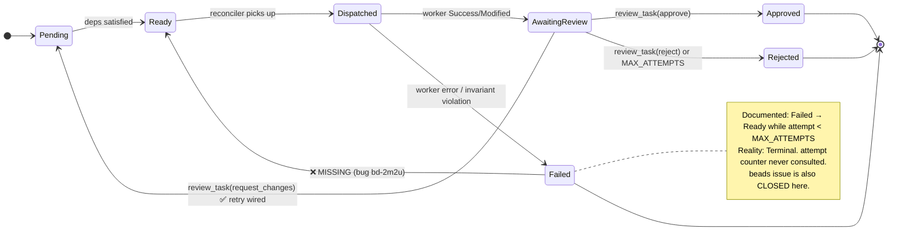
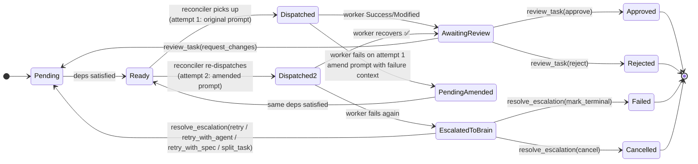
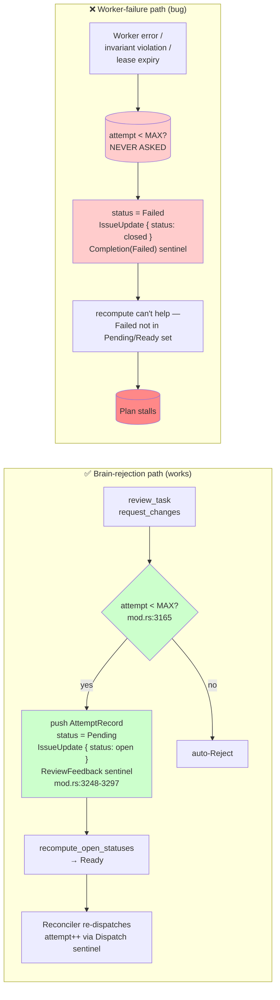
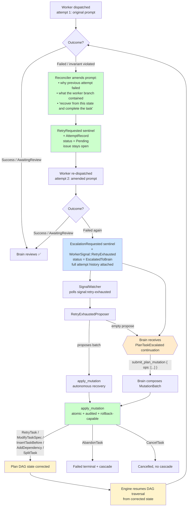

# RCA: `bd-2m2u` — No Auto-Retry for Worker-Output Failures (Failed → Ready Transition Missing)

**Date:** 2026-05-07
**Reviewer:** Claude (Opus 4.7)
**Method:** source-grounded control-flow walkthrough + cross-reference of cited file:line in `bd-2m2u`
**Grounded against:** current `HEAD` (commit `ce312c2a`), `crates/spur-mcp/src/plan/{mod.rs,reconciler.rs,projector.rs,snapshot.rs}`
**Status:** investigation complete; design proposal pending review — no code fix in this document
**Related:**
- `bd-2m2u` (this issue)
- `bd-14cq` (parent — curated worker MCP brainstorm)
- `bd-1428` (Phase 1 epic where this fired)
- Plan `86721b92` (the broken plan)
- `docs/architecture-spur-mcp.md`

---

## Executive Summary

The plan task lifecycle documents a `Failed → Ready` retry transition while `attempt < max_attempts`. **That transition does not exist in code.** The `attempt` / `MAX_ATTEMPTS` retry budget is consulted in exactly one place — the brain-decision `request_changes` review path — and is bypassed by every worker-side failure path.

**Recommended fix shape (detailed below):**
- **Phase 1:** on **any** worker failure, auto-retry **exactly once** with an **amended prompt** that tells the worker *why* the previous attempt failed. Reuses existing `request_changes` + `build_enriched_task` machinery; no failure classifier.
- **Phase 2:** if the 2nd attempt also fails, the task transitions to `EscalatedToBrain`. Recovery happens via the **existing** `PlanMutationOp` infrastructure — extended with `ModifyTaskSpec` / `InsertTaskBefore` / `RetryTask` / `AbandonTask` / `CancelTask` / `AddDependency` ops — exposed to the brain as a new `submit_plan_mutation` MCP tool. The brain operates on **plan-stage state** (the DAG that drives engine traversal), not just on the failed task in isolation. This reuses the same `apply_mutation` executor (atomic, audited, rollback-capable) and `MutationProposer` / `SignalWatcher` machinery that already powers `ScopeDrift`-driven auto-split.

What is proven:

1. Five distinct sites stamp `PlanTaskStatus::Failed` (or persist `CompletionState::Failed`) without consulting `attempt` / `MAX_ATTEMPTS`.
2. `completion_terminal_update` closes the underlying beads issue on `Failed`, so even if `PlanTaskStatus` were reset, the reconciler's `observe_ready` would not see the closed issue.
3. The `request_changes` retry path at `mod.rs:3151-3251` is fully wired and could be the reference pattern: it gates on `attempt >= MAX_ATTEMPTS`, resets task to `Pending`, keeps the issue `open`, and emits a `ReviewFeedback` audit sentinel that makes the projector return `Pending` on the next read.
4. The `attempt` counter itself is reconstructed from `Dispatch` audit sentinels in `project_attempt_facts` (`projector.rs:54-70`) — so each new dispatch increments it naturally; the missing piece is the transition that triggers a new dispatch.

What is not proven:

- Whether retrying worker-output **invariant violations** (0/N commit count) would ever succeed. Empirical hypothesis: deterministic, retry-resistant. Suggests classification, not blanket retry.

So the final grounded conclusion is:

> The retry machinery is built and works for one path (`request_changes`). Wiring the worker-failure paths into the same machinery — with a small classifier separating retryable transients from terminal protocol violations — closes the gap.

---

## Incident Snapshot

Observed during plan `86721b92` (epic `bd-1428`):

- 5 parallel tasks dispatched. One (`bd-1428.1`, claude-code agent) failed the G-Strict single-commit invariant (0 commits on its worker branch).
- Audit recorded `attempt: 1, max_attempts: 3` — 2 retries available per documented policy.
- Plan stalled. Brain attempted recovery via `review_task(request_changes)` and got: `task is not awaiting review (current status: failed)`.
- No code path exists to transition `Failed → Ready` outside the brain-review path.

---

## Documented vs Actual Task Lifecycle

### Today (broken)



### Proposed — retry-once-with-amended-prompt → escalate



---

## Where `Failed` Gets Stamped (5 paths, all bypass the budget)

```mermaid
flowchart TD
    W[Worker completes] --> R{DelegationResult.status?}
    R -->|Success / Modified| AR[CompletionState::AwaitingReview]
    R -->|Failed { error }| F1["mod.rs:2405-2412<br/>entry.status = Failed<br/>❌ no attempt check"]
    R -->|SetupFailed / other| F2["mod.rs:2434-2446<br/>entry.status = Failed<br/>❌ no attempt check"]

    AR --> INV{"apply_worker_output_invariant<br/>mod.rs:1668-1703<br/>commits == 1?"}
    INV -->|yes| KEEP[Stay AwaitingReview ✅]
    INV -->|no| F3["Rewrite → CompletionState::Failed<br/>❌ no attempt check"]

    LEASE[Reconciler: dispatch lease expired<br/>reconciler.rs:1244-1270] --> SYN[Synthesize Failed result]
    SYN --> F4["persist_system_completion_and_notify<br/>CompletionState::Failed<br/>❌ no attempt check"]

    CHAN["Channel send error<br/>mod.rs:2308 / 2511<br/>'Delegation channel closed' /<br/>'Orchestrator channel dropped'"] --> F5["entry.status = Failed<br/>❌ no attempt check"]

    F1 --> PERSIST
    F2 --> PERSIST
    F3 --> PERSIST
    F4 --> PERSIST
    F5 --> PERSIST

    PERSIST["persist_completion_result<br/>mod.rs:1731-1779"] --> CLOSE["completion_terminal_update<br/>mod.rs:1599-1608<br/>🔒 status = closed_status<br/>beads issue CLOSED"]
    CLOSE --> STUCK["Reconciler observe_ready<br/>reconciler.rs:807<br/>🚫 closed issue invisible"]
    STUCK --> END(["Plan stalls 💀"])

    style F1 fill:#ffcccc
    style F2 fill:#ffcccc
    style F3 fill:#ffcccc
    style F4 fill:#ffcccc
    style F5 fill:#ffcccc
    style CLOSE fill:#ffaaaa
    style END fill:#ff8888
```

### Stamping sites — citations

| # | File:Line | Trigger | Notes |
|---|---|---|---|
| F1 | `crates/spur-mcp/src/plan/mod.rs:2405-2412` | `DelegationStatus::Failed { error }` | Most common path; covers SDK errors, network blips, worker crashes |
| F2 | `crates/spur-mcp/src/plan/mod.rs:2434-2446` | `DelegationStatus::SetupFailed { .. }` (non-overlay), `other` | Includes worker exited early, malformed stdio |
| F3 | `crates/spur-mcp/src/plan/mod.rs:1668-1703` (`apply_worker_output_invariant`) | Worker said `Success` but commit count ≠ 1 | Likely deterministic — agent didn't follow protocol |
| F4 | `crates/spur-mcp/src/plan/reconciler.rs:1244-1270` | Dispatch lease expired | Synthesizes `DelegationStatus::Failed` then persists `CompletionState::Failed` |
| F5 | `crates/spur-mcp/src/plan/mod.rs:2308`, `2511` | `delegation_tx.send` errored or rx awaited a dropped tx | Truly transient — orchestrator restart, channel teardown race |

### Compounding factor — beads issue is closed

`completion_terminal_update` (`mod.rs:1599-1608`):

```rust
pub fn completion_terminal_update(closed_status: &str) -> spur_pm::IssueUpdate {
    spur_pm::IssueUpdate {
        status: Some(closed_status.to_string()),
        remove_labels: vec![
            crate::plan::labels::READY_FOR_REVIEW.to_string(),
            "ready-for-review".to_string(),
        ],
        ..Default::default()
    }
}
```

Called from `persist_completion_result` (`mod.rs:1772-1774`) for both `Failed` and `Cancelled`. Once the beads issue is closed, the reconciler's `observe_ready` (`reconciler.rs:807`) — which only re-dispatches `PlanTaskStatus::Ready` and projects from beads — has no observable input to act on.

**Any fix must keep the issue `open` on retryable failures.**

---

## The Two Retry Paths — One Wired, One Missing



### Reference: how `request_changes` retries (`mod.rs:3151-3300`)

1. **Budget gate** (`mod.rs:3165`): `if entry.attempt >= MAX_ATTEMPTS { auto-reject }`.
2. **History append** (`mod.rs:3233-3248`): pushes prior attempt's branch / summary / feedback into `entry.history`.
3. **State reset** (`mod.rs:3249-3251`): `entry.result = None; entry.worker_branch = None; entry.status = PlanTaskStatus::Pending`.
4. **beads keep-open** (`mod.rs:3281-3286`): `IssueUpdate { status: Some("open"), remove_labels: review_ready_label_removals(), comment: feedback_comment, .. }`.
5. **ReviewFeedback sentinel** (`mod.rs:3290-3296`): emitted so the projector can reconstruct the retry on next read.
6. **`recompute_open_statuses`** (`projector.rs:360-388`): promotes Pending → Ready when deps are satisfied.
7. **Reconciler picks up Ready** (`reconciler.rs:807`): re-dispatches with `attempt + 1` (counter reconstructed from latest `Dispatch` sentinel).

Steps 1–6 are exactly what the worker-failure paths need to mirror.

---

## Impact

Any non-deterministic worker failure becomes terminal:

- Transient SDK error / 5xx from upstream LLM provider → plan stalls
- Network blip during stream → plan stalls
- Worker process crashed before commit → plan stalls
- Orchestrator restart while a delegation is in flight → plan stalls
- Dispatch lease expiry due to clock skew or transient overload → plan stalls

Brain cannot recover via `review_task(request_changes)` because that decision rejects any task whose status isn't `awaiting_review`. A user-facing `retry_plan_task` MCP was proposed in `docs/rca/2026-04-17-persona-journey-review.md` but never built.

For epics with parallel branches, one transient blip on any leaf cascades through `mark_descendants_failed` and kills the whole subtree. The G-Strict invariant — designed to enforce squashed worker output — currently functions as a **plan kill switch** any time the agent miscounts commits.

---

## The Plan-as-Evidence Insight

The plan is a DAG where each task's status **is** the evidence the engine consumes for traversal:

| Status | Engine reads it as |
|---|---|
| `Pending` | "wait for deps to finish" |
| `Ready` | "eligible for dispatch" |
| `Dispatched` | "in flight; don't re-dispatch" |
| `AwaitingReview` | "brain decides next" |
| `Approved` | "unlocks dependent tasks" |
| `Failed` (terminal) | "cascade to descendants" |

**There is no such thing as "just dispatch this task again."** A re-dispatch only happens because the engine, traversing the DAG, sees a task in `Pending` / `Ready` with satisfied deps. To make a failed task run again, you must *change the DAG state* such that the engine's natural traversal picks it up. To make recovery adaptive, you must give the brain enough mutation vocabulary to **reshape the DAG** — not just the task spec.

### What already exists

The codebase **already has** the infrastructure for plan-stage mutations, originally built for `ScopeDrift` signals (`crates/spur-mcp/src/plan/`):

```mermaid
flowchart LR
    W[Worker] -->|emits<br/>WorkerSignal| L["spur-pm comment + label<br/>signal:*"]
    L -->|polled by| SW[SignalWatcher<br/>signal_watcher.rs]
    SW -->|invokes| MP[MutationProposer<br/>proposers.rs]
    MP -->|returns| MB["MutationBatch { ops: Vec&lt;PlanMutationOp&gt; }"]
    MB -->|scored by| MS[MutationScorer]
    MS -->|highest-scored| AM[apply_mutation<br/>mutation_executor.rs<br/>atomic + rollback]
    AM --> P[(beads + plan state<br/>updated)]

    style MB fill:#cce5ff
    style AM fill:#ccffcc
```



**Today's vocabulary** (`mutation.rs:42-49`):
```rust
#[non_exhaustive]
pub enum PlanMutationOp {
    SplitTask { parent, children, dep_rewire },   // only variant
}
```

The `#[non_exhaustive]` was a deliberate forward-compat hook. The trait seam (`v0 ships deterministic impls; v1 MCTS replanner substitutes at callsite`) was designed exactly for cases like failure recovery.

### The gap for failure recovery

| Need | Status |
|---|---|
| Worker emits a "this failed and retry didn't help" signal | ❌ no `WorkerSignal::RetryExhausted` variant |
| Mutation ops to modify task spec / insert tasks / retry / abandon | ❌ only `SplitTask` exists |
| Brain (not just autonomous proposer) can submit mutation batches | ❌ `MutationProposer` is the only producer; no MCP tool exposes mutation submission |
| `EscalatedToBrain` task status to pause until brain acts | ❌ doesn't exist |

So the work is **extending** the existing surface, not building a parallel one.

---

## The Recovery Loop



**Why this shape works:**

1. **The retry is meaningful, not blind.** The amended prompt tells the worker *what went wrong* on attempt 1 and asks it to recover. Most worker failures (especially deterministic ones like "0 commits on branch") fail a 2nd time only if the agent genuinely can't self-correct.
2. **No failure classifier needed.** Whether the failure was transient or deterministic, attempt 2 with context is strictly more informed than attempt 1 — so retrying once is always worth it.
3. **Reuses existing machinery.** `request_changes` already builds enriched prompts via `build_enriched_task` (`mod.rs:1018-1052`) using `AttemptRecord` history. We literally extend that pattern to worker-side failures.
4. **Brain only sees genuinely hard cases.** Two failures in a row with full self-recovery context = the worker can't fix this on its own. That's the right signal for brain to swap agent / modify spec / split / give up.
5. **No new task-status surface area in v1.** First ship: just retry. Escalation = `EscalatedToBrain` reuses the same continuation pattern as `AwaitingReview`.

---

## Proposal

**One auto-retry with amended prompt. On 2nd failure, escalate to brain. No failure classification.**

### Shape

#### 1. New constants

```rust
// plan/mod.rs
pub const MAX_ATTEMPTS: u32 = 3;           // existing — global hard ceiling
pub const AUTO_RETRY_BUDGET: u32 = 1;      // NEW — exactly one auto-retry-with-amended-prompt
```

`AUTO_RETRY_BUDGET = 1` means: the worker gets attempt 1 (original prompt) and attempt 2 (amended prompt). If attempt 2 also fails → escalate.

#### 2. New audit sentinels

```rust
// plan/audit_sentinel.rs
pub enum AuditSentinelKind {
    // existing variants...
    RetryRequested {
        delegation_id: String,
        attempt: u32,
        error: String,
        worker_branch: Option<String>,
        amended_prompt_summary: Option<String>,  // for observability
    },
    EscalationRequested {
        delegation_id: String,
        attempt: u32,
        last_error: String,
    },
    EscalationResolved {
        delegation_id: String,
        decision: EscalationDecision,
    },
}
```

`RetryRequested` overrides projected status to `Pending` (so reconciler re-dispatches with amended prompt). `EscalationRequested` overrides to `EscalatedToBrain`. `EscalationResolved` overrides back to `Pending` with optional spec modifications.

#### 3. New task status

```rust
// plan/mod.rs
pub enum PlanTaskStatus {
    // existing variants...
    EscalatedToBrain {
        last_error: String,
        // attempt_history is already on PlanTaskEntry.history; no need to duplicate
    },
}
```

Mirrors `AwaitingReview` semantically. Issue stays `open`. Plan does not stall.

#### 4. The amended prompt

Reuse the existing `build_enriched_task` machinery (`mod.rs:1018-1052`). Today it's only called from the request_changes retry path (`reconciler.rs:890-897`). The amended prompt for a worker-failure retry should include:

- Original task text.
- Failure reason: the `error` string from `DelegationStatus::Failed`, or the diagnostic from `apply_worker_output_invariant`.
- Worker branch state: name of the branch the previous attempt produced (if any), so the worker can `git log` / inspect.
- Recovery instruction: *"The previous attempt failed for the reason above. Inspect the worker branch state, identify what went wrong, and recover from there to complete the task."*

The `AttemptRecord` already carries `feedback`, `worker_branch`, and `summary` — we just populate `feedback` with the failure-reason string and let `build_enriched_task` do the rest.

#### 5. Helper `should_auto_retry`

```rust
fn should_auto_retry(attempt: u32) -> bool {
    attempt <= AUTO_RETRY_BUDGET   // attempt 1 → retry; attempt 2 → escalate
}
```

That's the entire policy. No classifier. No `retryable: bool` on `DelegationStatus`.

#### 6. Wiring at the five stamping sites (F1–F5)

Replace each direct `entry.status = PlanTaskStatus::Failed { error }` with:

```rust
if should_auto_retry(entry.attempt) {
    // Auto-retry path — mirrors request_changes reset logic
    let record = AttemptRecord {
        attempt: entry.attempt,
        worker_branch: entry.worker_branch.clone(),
        diff_summary: entry.result.as_ref().and_then(|r| r.diff_summary.clone()),
        summary: entry.result.as_ref().and_then(|r| r.summary.clone()),
        feedback: format_failure_recovery_feedback(&error, entry.worker_branch.as_deref()),
        dispatched_base_oid: entry.dispatched_base_oid.take(),
    };
    entry.history.push(record);
    entry.result = None;
    entry.worker_branch = None;
    entry.status = PlanTaskStatus::Pending;
    emit_retry_requested_sentinel(...);
    apply_issue_update(pm, issue_id, completion_retry_update()).await?;
} else {
    // Escalation path
    entry.status = PlanTaskStatus::EscalatedToBrain { last_error: error.clone() };
    emit_escalation_requested_sentinel(...);
    apply_issue_update(pm, issue_id, completion_escalation_update()).await?;
    push_brain_continuation(ContinuationSource::PlanTaskEscalated, ...);
}
```

#### 7. New beads issue updates

```rust
fn completion_retry_update() -> spur_pm::IssueUpdate {
    spur_pm::IssueUpdate {
        status: Some("open".to_string()),
        remove_labels: review_ready_label_removals(),
        ..Default::default()
    }
}

fn completion_escalation_update() -> spur_pm::IssueUpdate {
    spur_pm::IssueUpdate {
        status: Some("open".to_string()),
        add_labels: vec!["signal:escalated".to_string()],
        remove_labels: review_ready_label_removals(),
        ..Default::default()
    }
}
```

Critically, **neither closes the issue** — the reconciler can re-observe it as ready (retry) or the brain can resolve via MCP (escalation).

#### 8. Phase 2: extend `PlanMutationOp` + new `submit_plan_mutation` MCP

Instead of a parallel `EscalationDecision` enum, **extend the existing `PlanMutationOp` vocabulary** (`mutation.rs:42-49`) with recovery ops. The brain composes a `MutationBatch` and submits it via a new MCP tool that wraps `apply_mutation` (which already handles atomicity, write-ahead audit, and rollback).

```rust
// crates/spur-mcp/src/plan/mutation.rs — extended (additive; #[non_exhaustive])
pub enum PlanMutationOp {
    SplitTask {                                  // existing
        parent: String,
        children: Vec<TaskDraft>,
        dep_rewire: DepRewirePolicy,
    },
    // NEW for failure recovery:
    ModifyTaskSpec {                             // brain rewrites task / agent / context
        task_id: String,
        new_task: Option<String>,
        new_agent: Option<String>,
        new_context_files: Option<Vec<String>>,
        new_depends_on: Option<Vec<String>>,
        // Resets task to Pending; engine re-dispatches with modified spec.
    },
    InsertTaskBefore {                           // add a fix-up task that must run first
        target: String,
        new_task: TaskDraft,
        // new_task becomes a dep of `target`; `target` resets to Pending.
    },
    RetryTask {                                  // re-dispatch as-is, fresh attempt
        task_id: String,
        // Resets to Pending; preserves history; engine re-dispatches.
    },
    AbandonTask {                                // mark terminal, cascade descendants
        task_id: String,
        reason: String,
    },
    CancelTask {                                 // soft-stop, no cascade
        task_id: String,
        reason: String,
    },
    AddDependency {                              // brain adds an edge brain discovered missing
        task_id: String,
        depends_on: String,
    },
}
```

```rust
// New brain-facing MCP tool — thin wrapper around apply_mutation
async fn submit_plan_mutation(
    plan_id: &str,
    ops: Vec<PlanMutationOp>,
    rationale: String,                           // for audit trail
) -> Result<MutationResult>;
```

This tool:
1. Builds a `MutationBatch { mutation_id, ops, trigger_signal_id, trigger_task_id }`.
2. Calls existing `apply_mutation(...)` — atomic, audited, rollback-capable.
3. Clears `signal:retry-exhausted` / `signal:escalated` labels on touched tasks.
4. Engine resumes DAG traversal from the corrected state on next reconciler tick.

**Brain's recovery toolbox** (the "tools/toys"):

| Tool | Purpose | Status |
|---|---|---|
| `get_plan_status` | Read full DAG state + attempt history | exists |
| `get_task_diff` | Inspect what the failed worker produced | exists |
| `mcp__spur-mcp__graph_*` | Visualize DAG dependencies | exists |
| Worker branch + `git log` | Inspect failed attempt's evidence | exists |
| **`submit_plan_mutation`** | **Apply recovery `MutationBatch`** | **NEW** |

#### 9. Phase 2: emit `WorkerSignal::RetryExhausted` to drive autonomous proposers

When auto-retry is exhausted (Phase 1 fires twice), in addition to setting `EscalatedToBrain`, also emit a worker signal:

```rust
// crates/spur-mcp/src/plan/signals.rs — extended
pub enum WorkerSignal {
    // existing variants: ScopeDrift, Blocked, Risk, ...
    RetryExhausted {
        signal_id: Uuid,
        attempts: Vec<AttemptRecord>,
        last_error: String,
    },
}
```

The existing `SignalWatcher` polls `signal:*`-labeled tasks, dedupes by `signal_id`, invokes a `MutationProposer`. We add a new proposer for `RetryExhausted`:

```rust
pub struct RetryExhaustedProposer { /* ... */ }

impl MutationProposer for RetryExhaustedProposer {
    async fn propose(&self, state: &PlanState, signal: &WorkerSignal, triggering_task: &str) -> Vec<MutationBatch> {
        // v0: deterministic — propose RetryTask (one shot at a different agent or as-is)
        // v1: LLM-based — propose ModifyTaskSpec / InsertTaskBefore based on attempt history
        ...
    }
}
```

This gives **two parallel paths** for plan-stage recovery:
- **Autonomous** (`SignalWatcher` + `MutationProposer`): proposer sees the signal, generates a batch, applies. Brain not involved unless proposer returns empty.
- **Brain-driven** (`submit_plan_mutation`): brain reads `EscalatedToBrain` continuation, composes its own batch via `submit_plan_mutation`. Used when proposer can't (or chooses not to) auto-recover.

Brain receives the escalation via `ContinuationSource::PlanTaskEscalated` carrying the full attempt history. Brain-directed retries count toward `MAX_ATTEMPTS = 3` so the loop cannot run indefinitely.

#### 10. Projector update

`project_closed_status` (`projector.rs:302-358`) currently returns early on `Completion(Failed)`. Update to scan for later sentinels:

| Latest relevant sentinel | Projected status |
|---|---|
| `MutationCommit { ops contains AbandonTask }` | `Failed` |
| `MutationCommit { ops contains CancelTask }` | `Cancelled` |
| `MutationCommit { ops contains RetryTask / ModifyTaskSpec / InsertTaskBefore / AddDependency }` | `Pending` (with mutation applied) |
| `EscalationRequested` (no later mutation) | `EscalatedToBrain` |
| `RetryRequested` (no later sentinel) | `Pending` (Phase 1 auto-retry) |
| `Completion(Failed)` (no later sentinel) | `Failed` (legacy / pre-fix data) |

`MutationCommit` is the **existing** audit sentinel emitted by `apply_mutation` (`audit_sentinel.rs:902` references the round-trip test). We just need the projector to recognize the new mutation ops.

#### 11. Documentation

- Add `## Task Lifecycle and Recovery` section to `docs/architecture-spur-mcp.md` documenting the state diagram, `AUTO_RETRY_BUDGET`, amended-prompt content, plan-mutation recovery surface, and `submit_plan_mutation` semantics.
- Reference this RCA from the architecture doc.
- Update `AGENTS.md` with `signal:escalated` and `signal:retry-exhausted` label semantics.

### Files touched

| File | Change |
|---|---|
| **Phase 1 (auto-retry):** | |
| `crates/spur-mcp/src/plan/audit_sentinel.rs` | Add `RetryRequested` variant |
| `crates/spur-mcp/src/plan/mod.rs` | Add `AUTO_RETRY_BUDGET`, `should_auto_retry`, `format_failure_recovery_feedback`, `completion_retry_update`; wire F1, F2, F3, F5 |
| `crates/spur-mcp/src/plan/reconciler.rs` | Wire F4 (dispatch lease expiry) |
| `crates/spur-mcp/src/plan/projector.rs` | Handle `RetryRequested` in `project_closed_status` |
| `crates/spur-mcp/src/events.rs` | `PlanTaskAutoRetried` event |
| **Phase 2 (escalation + plan-mutation recovery):** | |
| `crates/spur-mcp/src/plan/audit_sentinel.rs` | Add `EscalationRequested` variant; ensure `MutationCommit` sentinel encodes new ops |
| `crates/spur-mcp/src/plan/mod.rs` | Add `EscalatedToBrain` status, `completion_escalation_update`, escalation push at retry exhaustion |
| `crates/spur-mcp/src/plan/mutation.rs` | **Extend `PlanMutationOp`** with `ModifyTaskSpec`, `InsertTaskBefore`, `RetryTask`, `AbandonTask`, `CancelTask`, `AddDependency` |
| `crates/spur-mcp/src/plan/mutation_executor.rs` | Implement apply + rollback for each new op |
| `crates/spur-mcp/src/plan/signals.rs` | Add `WorkerSignal::RetryExhausted` |
| `crates/spur-mcp/src/plan/proposers.rs` | Add `RetryExhaustedProposer` (v0 deterministic; v1 LLM-driven) |
| `crates/spur-mcp/src/plan/projector.rs` | Recognize new mutation ops in projection |
| `crates/spur-mcp/src/plan/snapshot.rs` | Counters: `escalated`, `auto_retried` |
| `crates/spur-mcp/src/server.rs` (+ tools) | **`submit_plan_mutation`** MCP tool wrapping `apply_mutation` |
| `crates/spur-acp/src/lib.rs` | Add `ContinuationSource::PlanTaskEscalated` |
| `crates/spur-mcp/src/events.rs` (+ TUI consumers) | `PlanTaskEscalated`, `PlanMutationApplied` events |
| Tests | TDD coverage (see below) |
| `docs/architecture-spur-mcp.md` | Lifecycle + recovery section |
| `AGENTS.md` | `signal:escalated`, `signal:retry-exhausted` semantics |

**No change to `DelegationStatus`** — we don't need a `retryable: bool` flag because the policy is "always retry once with context, regardless of failure type."

**Reuses existing infrastructure:** `apply_mutation` (atomic + rollback), `SignalWatcher` (polling), `MutationProposer` trait (extensible), audit sentinels (durable evidence). No parallel system.

### Order of operations (TDD)

#### Phase 1 — auto-retry-with-amended-prompt (closes bd-2m2u immediate stall)

Failing tests first:
- `worker_failure_at_attempt_1_resets_to_pending_with_amended_prompt`
- `worker_failure_at_attempt_2_escalates_to_brain`
- `auto_retry_amended_prompt_includes_failure_reason_and_branch_state`
- `invariant_violation_at_attempt_1_retries_with_recovery_prompt`
- `escalated_task_keeps_beads_issue_open`
- `projector_recovers_pending_after_retry_requested_sentinel`

Then implement:
1. `RetryRequested` sentinel + `format_failure_recovery_feedback` + `should_auto_retry` + `completion_retry_update`.
2. Wire F1–F5 to auto-retry path on 1st failure, terminal-Failed (legacy behavior) on 2nd failure.
3. Projector reads `RetryRequested`.
4. Ship.

#### Phase 2 — escalation + extended `PlanMutationOp` recovery surface

Failing tests first:
- `phase1_terminal_failure_promoted_to_escalated_to_brain_when_phase2_enabled`
- `escalation_emits_retry_exhausted_signal`
- `signal_watcher_routes_retry_exhausted_to_proposer`
- `mutation_op_modify_task_spec_resets_to_pending_with_new_spec`
- `mutation_op_insert_task_before_creates_dep_edge`
- `mutation_op_retry_task_resets_to_pending_preserves_history`
- `mutation_op_abandon_task_cascades_descendants`
- `mutation_op_cancel_task_does_not_cascade`
- `mutation_op_add_dependency_blocks_until_new_dep_complete`
- `submit_plan_mutation_applies_batch_atomically`
- `submit_plan_mutation_validates_no_cycles`
- `submit_plan_mutation_rolls_back_on_failure`
- `brain_directed_retries_capped_by_max_attempts`

Then implement:
1. `EscalatedToBrain` status + `EscalationRequested` sentinel + `WorkerSignal::RetryExhausted`.
2. **Extend `PlanMutationOp`** with `ModifyTaskSpec`, `InsertTaskBefore`, `RetryTask`, `AbandonTask`, `CancelTask`, `AddDependency`. Each gets apply + rollback in `mutation_executor.rs`.
3. `RetryExhaustedProposer` (v0: deterministic — propose `RetryTask` if attempts < cap; v1: LLM-driven mutation composition).
4. `submit_plan_mutation` MCP tool. Promote Phase 1's terminal-Failed-on-2nd-failure to `EscalatedToBrain` instead.
5. Projector handles new mutation ops.
6. `PlanTaskEscalated` continuation, TUI events, docs.
7. Ship.

### Out of scope

- A user-facing `retry_plan_task` MCP tool. Phase 1 covers automatic retry; Phase 2 covers brain-driven retry via `submit_plan_mutation { ops: [RetryTask] }`.
- Failure classification beyond the universal "always retry once with context" rule. YAGNI.
- v1 LLM-driven `RetryExhaustedProposer`. Ship v0 deterministic first; LLM substitution is a swap-in via the existing trait seam.
- Cross-plan mutation patterns (one plan's recovery affecting another). Out of scope.

---

## Acceptance Criteria — Mapping to bd-2m2u

| AC from bd-2m2u | Addressed by |
|---|---|
| Worker-output failures increment `attempt` counter | `AttemptRecord` pushed on retry; reconciler emits new `Dispatch` sentinel; `project_attempt_facts` reads it |
| Failed → Ready transition while `attempt < max_attempts` | `should_auto_retry(attempt)` → `RetryRequested` sentinel → reconciler picks up Ready (Phase 1) |
| Failed → terminal at `attempt >= max_attempts` | After `AUTO_RETRY_BUDGET`, escalate to brain; brain submits `PlanMutationOp::AbandonTask` for terminal (Phase 2) |
| Classify retryable vs terminal | **Replaced with**: always retry once with amended prompt; failure type determines what the prompt says, not whether retry happens |
| Document policy explicitly | `docs/architecture-spur-mcp.md` lifecycle section + this RCA |

**Bonus** (unlocked by Phase 2): brain operates on plan-stage state via the existing `PlanMutationOp` surface. Closes the broader resilience gap motivating `bd-14cq` and gives `MutationProposer`/`SignalWatcher` a second concrete signal type beyond `ScopeDrift`.

---

## Why This Architecture Is Right

1. **The plan IS the evidence.** Task statuses + audit sentinels + dependency edges are what the engine reads to decide what to dispatch. To recover, you fix the evidence (the DAG state) — you don't bypass it with imperative re-dispatch calls.
2. **`PlanMutationOp` is the right vocabulary.** It was designed for exactly this — `#[non_exhaustive]`, atomic apply, audit-trailed, rollback-capable. Failure recovery is a natural extension, not a parallel system.
3. **`MutationProposer` already exists for autonomous recovery.** Today only `ScopeDriftSplitProposer`. Adding `RetryExhaustedProposer` follows the established trait pattern.
4. **`submit_plan_mutation` parallels `review_task`.** Both are brain-decision tools that operate on plan state. Both go through audited mutation paths. Symmetric mental model.
5. **Phase 1 ships independently.** Auto-retry-with-amended-prompt closes bd-2m2u acceptance criteria without needing Phase 2. The amended prompt is what makes retry meaningful; the `PlanMutationOp` extension is what makes brain recovery powerful.

---

## Open Questions for Reviewer

1. **`AUTO_RETRY_BUDGET` value.** Proposed: `1` (one amended-prompt retry). Alternative: `2` (give the worker two recovery shots before escalating). Lean toward `1`.
2. **Amended prompt template.** Suggest:
   *"The previous attempt failed: `<error>`. Worker branch produced: `<branch>` (inspect with `git log <base>..<branch>`). Identify what went wrong and recover from there to complete the original task."*
   Confirm this works for non-git agents.
3. **Worker-output invariant retry.** Confirm: 0-commit invariant violation triggers retry-with-amended-prompt that explicitly says "you produced 0 commits; please make exactly 1 squashed commit." Most likely to succeed.
4. **`PlanMutationOp` extension scope.** Six new ops proposed. Are all needed, or start with subset (e.g., just `ModifyTaskSpec`, `RetryTask`, `AbandonTask`)? `InsertTaskBefore` + `AddDependency` are the riskier ones (DAG validity).
5. **`RetryExhaustedProposer` policy.** v0 deterministic: what should it propose? Lean toward `RetryTask` (re-dispatch as-is, fresh attempt counter) — gives brain time to override before next exhaustion. Alternative: empty propose (always wait for brain).
6. **Brain UX for escalation.** When brain receives `PlanTaskEscalated`, does it auto-decide via skill or always prompt human? Suggest: brain decides autonomously; human sees via TUI surfaces only.
7. **Phase split.** Confirm: ship Phase 1 (auto-retry) first to close the immediate stall, then ship Phase 2 (extended `PlanMutationOp` + `submit_plan_mutation`) as a follow-up epic. Avoids single mega-PR.
