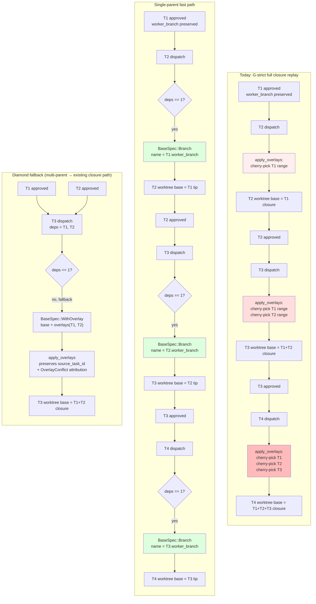
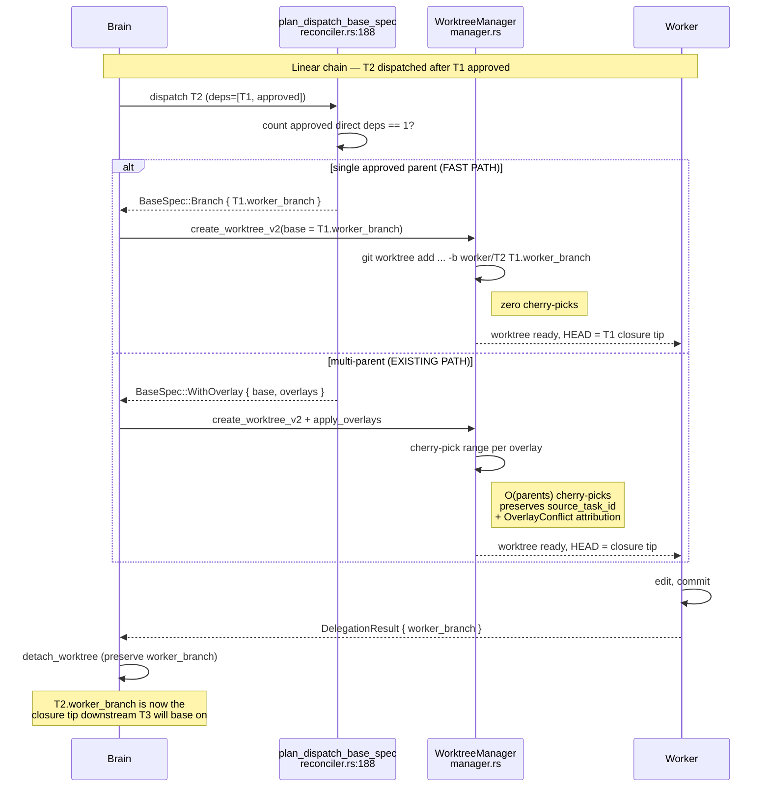

# RCA: G-strict + Worktree Resource Efficiency — Closure Replay vs. Single-Parent Fast Path

**Date:** 2026-05-07
**Author:** Brain (Opus 4.7) + Codex worker review
**Status:** Design Review / Pre-implementation
**Target Components:** `spur-worktree::manager`, `spur-mcp::plan::reconciler`, `spur-mcp::plan::mod` (audit), `spur-mcp::tools` (`BaseSpec`)
**Precedents:**
- `2026-04-19-parallel-execution-file-isolation.md`
- `2026-04-21-worktree-integration-contract-breakdown.md`
- `2026-04-29-plan-submit-reconciler-autostart-map-territory.md`

---

## 0. Executive Summary

The current G-strict closure dispatch is **correct but quadratic**. For a depth-N linear plan, task `T_k` re-cherry-picks `T_1..T_{k-1}`'s overlays even though `T_{k-1}`'s worker already produced a branch tip with that exact closure applied. Total cherry-pick work across the plan is `O(N²/2)`. Plus N full working-tree checkouts (heavy on monorepos).

Three optimizations were proposed by the brain. After codex review:

| Lever | Verdict | Reason |
|---|---|---|
| 1. Precomputed closure refs at approval time | **DROP as proposed** | Bypasses `BaseSpec::WithOverlay` audit contract; introduces unowned ref namespace outside `cleanup_orphans` invariant I-7; `merge-tree` for diamonds is not equivalent to ordered cherry-pick. |
| 2. Worktree pooling for linear lanes | **DEFER** | Breaks "one worker session = one v2 branch/path" invariant; needs new lane ownership, cancellation isolation, switch-and-preserve semantics. |
| 3. No-worktree for non-diff tasks | **TIGHTEN SCOPE** | No `BaseSpec` mode for it today; reconciler currently blocks downstream dispatch on missing `dispatched_base_oid`/`worker_branch`. Restrict to terminal planning/review tasks. |

**Recommended first increment:** a **single-parent fast path** in `plan_dispatch_base_spec` (`reconciler.rs:188`). When a task has exactly one approved direct dependency, base the worker on that dependency's preserved `worker_branch` with **zero overlays**. Multi-parent tasks fall through to today's full-closure path. Captures most of the linear-chain win with no new refs, cleanup, or audit schema.

---

## 1. The Cost We're Paying

### 1.1 Cherry-pick redundancy (CPU + wall time)

The dispatch path applies overlays per task in `apply_overlays` (`crates/spur-worktree/src/manager.rs:297`). Each overlay is:

```
git rev-list --count base_oid..tip_oid   # empty-range guard
git cherry-pick base_oid..tip_oid        # the actual work
```

For a linear chain `T_1 → T_2 → … → T_N`:
- T_2's worker re-applies T_1's overlay (1 range)
- T_3's worker re-applies T_1, T_2 (2 ranges)
- T_N's worker re-applies T_1..T_{N-1} (N-1 ranges)
- Total: `N(N-1)/2` cherry-picks across the plan

This is provable in `g_strict_grandparent_depth_chain_walks_full_closure` (`crates/spur-mcp/tests/g_strict_e2e.rs:172`): T_4's `dispatched_base_oid != T_3's dispatched_base_oid`, meaning T_4's base was rebuilt from scratch even though T_3's worker branch already encodes T_1+T_2+T_3.

### 1.2 Working-tree checkouts (disk + I/O)

Each `create_worktree_v2` (`manager.rs:504`) materializes a full working tree under `.spur/worktrees/<worker_session_id>`. `git worktree` shares `.git/objects`, but every file in the tree is checked out per-worker. On a monorepo with `node_modules` / build artifacts, that is gigabytes per parallel worker.

### 1.3 No reuse on sequential tasks

After approval, `detach_worktree` (`manager.rs:728`) removes the worktree directory but **preserves the branch** for review/merge. The next task in the chain starts from scratch with a fresh worktree, even though the just-detached branch already encodes the closure tip we want.

This is the central waste: **the branch tip we need for T_{k+1}'s base already exists** as `worker_branch` for T_k. We are re-deriving it via cherry-pick instead of ref-pointing at it.

---

## 2. The Three Levers — Independent Review

### Lever 1: Precomputed closure refs at approval time

**Idea:** When `T_k` is approved, build `refs/spur/closure/<plan>/<T_k>` once = closure(parents) + T_k overlay. Worker dispatch then becomes `git worktree add <path> -b worker/<id> refs/spur/closure/<plan>/<parent>` — zero overlay cherry-picks at dispatch.

**Codex's objections (all correct):**

1. **Audit contract loss.** `BaseSpec::WithOverlay` carries `OverlayCommit { source_task_id, base_oid, tip_oid }` per overlay (`crates/spur-mcp/src/tools.rs`). Conflict attribution flows through `apply_overlays` → `OverlayConflict { source_task_id, files }` (`manager.rs:380`). A plain closure branch erases this — when a downstream task hits a conflict, we can't say "T_3's overlay introduced it" anymore.

2. **Audit schema gap.** `Completion` audit sentinels store only `dispatched_base_oid`, not the closure recipe (`crates/spur-mcp/src/plan/mod.rs:1340`). Replaying a closure ref forensically requires either persisting the recipe or accepting we can't reconstruct it. Both options expand audit scope.

3. **Cleanup invariant violation.** `cleanup_orphans` is deliberately scoped to `refs/heads/spur/worker/v2/...` (manager.rs:799 — invariant I-7). A new `refs/spur/closure/...` namespace has no owner. Plan merge, plan cancel, task supersede, brain crash mid-build — none of these have a closure-ref deletion path. Refs pin objects; leaks are silent and unbounded.

4. **`merge-tree` is not equivalent to ordered cherry-pick.** For diamond DAGs (T_3 ← T_1, T_2), the brain's proposal was to use `git merge-tree` to combine the two parent closures. But ordered cherry-pick produces a deterministic conflict ordering; `merge-tree` produces a synthetic merge with different conflict semantics. The current G-strict tests assume the cherry-pick ordering — the diamond test (`g_strict_e2e.rs:131`) verifies the resulting diff excludes inherited overlays cleanly, which depends on `dispatched_base_oid` being walked, not synthetic-merged.

5. **Race against `submit_plan`'s explicit base.** Recent br-osl work (commits `5029deb2`, `23151acb`, `9da830a0`) added explicit `base: BaseTarget` to `submit_plan` and pins it into a snapshot ref/OID at submit time (`server.rs:1698`, `server.rs:5074`). Closure builds **must** root at that pinned base; if they ever resolve from a moving source branch, the closure drifts.

**Verdict: drop as proposed.**

### Lever 2: Worktree pooling for linear lanes

**Idea:** At `submit_plan`, identify linear lanes (each node has ≤1 child). Allocate one worktree per lane and `git reset` between sequential tasks instead of detach + recreate.

**Codex's objections:**

1. **One-worker-one-branch invariant.** `WorktreeInfo` (manager.rs:41) and `create_worktree_v2` (manager.rs:504) bake "one worker session owns one v2 branch and one path" into the `active` HashMap and the cleanup contract. Pooling means N tasks share a path; the cleanup loop in `cleanup_stale` (manager.rs:760) and `cleanup_orphans` would need lane-aware logic.

2. **Approval lifecycle assumes detach-and-preserve.** On approval, `orchestrator.rs:7412` commits the worker's changes, then `detach_worktree` (manager.rs:728) tears down the worktree directory while preserving the branch. Pooling needs a "switch-away-but-preserve-branch" operation that doesn't exist today.

3. **Cancellation isolation.** If T_2 fails or is cancelled, T_1's branch tip and reproducibility are gone — the lane's working tree has been mutated. Currently a failed/cancelled worker has no impact on its predecessors.

**Verdict: defer.** The invariant rewrites are larger than the resource win, and lever 4 below captures most of the same savings without breaking them.

### Lever 3: Skip worktree for non-diff tasks

**Idea:** Review/planning/doc-only tasks produce artifacts not code; they don't need a worktree.

**Codex's objections:**

1. **No `BaseSpec` mode for "no worktree."** The MCP `BaseSpec` enum (`tools.rs:67`) is `RepoMain | Branch | Commit | WithOverlay` — every variant assumes a worktree gets materialized. Adding a "read-only" mode is a public schema change.

2. **Downstream dispatch blocks on missing `dispatched_base_oid` / `worker_branch`.** `reconciler.rs:197` requires approved deps to expose these fields so children can compute their closure. An overlayless approved task would currently halt the plan.

**Verdict: tighten scope.** Safe only for **terminal** tasks (no downstream diff dependency). Needs an explicit "overlayless approved task" marker or filter in `plan_dispatch_base_spec`. Worth doing eventually; not the first move.

---

## 3. Recommended First Increment — Single-Parent Fast Path

### 3.1 The change

In `plan_dispatch_base_spec` (`crates/spur-mcp/src/plan/reconciler.rs:188`), add a fast path:

```text
if approved_deps.len() == 1 && that_dep.worker_branch.is_some() {
    return BaseSpec::Branch { name: that_dep.worker_branch.clone() };
}
// else: existing WithOverlay closure path
```

The preserved `worker_branch` from `detach_worktree` is **exactly** the closure tip. The downstream worker uses it as base directly — no overlays, no cherry-picks, no rev-list guards.

### 3.2 Effect

| DAG shape | Cherry-picks today | Cherry-picks after |
|---|---|---|
| Linear depth-N chain | `N(N-1)/2` | **0 after T_1** |
| Diamond (2 parents → 1 child) | unchanged | unchanged (multi-parent path) |
| Mixed | per-task linear segments collapse to 0 | only multi-parent join nodes pay |

For the grandparent test (4-task linear chain), this is `6 → 0` cherry-picks plus 3 fewer `rev-list --count` invocations.

### 3.3 What it doesn't break

- **Audit continuity.** `dispatched_base_oid` is still captured post-checkout (rev-parse HEAD is now just the parent's `worker_branch` tip). Existing sentinel checks unchanged.
- **`cleanup_orphans` invariant I-7.** No new ref namespace; we're consuming the existing v2 worker branch.
- **Closure correctness.** The preserved `worker_branch` already encodes the full transitive closure at the moment of approval. There's no replay drift because there's no replay.
- **Diamonds and forks.** Multi-parent tasks fall through to the existing `WithOverlay` path, which is where the audit/conflict-attribution machinery actually earns its keep.
- **Submit-plan's pinned base.** Independent — the pinned base is the root of the chain (T_1's base); downstream fast-path consumes preserved branches that already root in it.

### 3.4 Required regression test

Add to `g_strict_e2e.rs` (or a sibling file):

```rust
#[tokio::test(flavor = "multi_thread", worker_threads = 4)]
async fn single_parent_fast_path_skips_overlay_replay() {
    // Submit linear T1 → T2 plan.
    // Approve T1.
    // Inspect T2's DelegationRequest.base:
    //   - assert it's BaseSpec::Branch (not WithOverlay)
    //   - assert the branch name is T1's preserved worker_branch
    // Dispatch T2; assert dispatched_base_oid == T1.worker_branch tip.
}
```

This pins the optimization and prevents regression to the closure path on single-parent dispatch.

### 3.5 What to verify before merging

1. `worker_branch` is genuinely preserved on approval — not just on `detach_worktree` but for the lifetime needed by all downstream dispatches. Currently it's preserved indefinitely (only `cleanup_orphans` removes v2 branches, and only when no active worktree references them). Plan-merge should prune via the existing branch-cleanup path, not introduce new logic.
2. `worker_branch` exists for every approved task. Audit `Completion` to confirm — fault paths that approve without producing a branch (would there be any?) need either to set a sentinel or fall through to the closure path.
3. Cancellation/supersede semantics: if T_1 is later rejected after T_2 has been dispatched against its branch, what happens? Today the closure path would also be wrong here; fast path is no worse, but worth documenting.

---

## 4. Diagram





---

## 5. Open Questions

1. **What happens if T_1 is rejected after T_2 has been dispatched against its branch?** Today's closure path would also be wrong here (T_2's overlay was built against T_1's tip). Fast path is no worse, but rejection-of-already-consumed-parent is an open hole worth a separate RCA.

2. **`worker_branch` lifetime guarantee.** Need to confirm it lives until the plan terminates, not just until the worktree detaches. `cleanup_orphans` skips branches with active worktrees but is silent on detached-but-still-needed branches mid-plan.

3. **Should we still emit the `dispatched_base_oid` audit on the fast path?** Yes — `rev-parse HEAD` after `worktree add` returns the same tip as `T_{k-1}.worker_branch`, which is what audit needs.

4. **Diamond optimization opportunity later.** Even on the multi-parent path, we re-cherry-pick per dispatch. A second-pass optimization could memoize per-(parent-set) closure tips inside the reconciler's in-memory state (no new refs). But that's a follow-up after the fast path lands.

---

## 6. Action Items

| # | Action | Owner | Priority |
|---|---|---|---|
| 1 | Implement single-parent fast path in `plan_dispatch_base_spec` (reconciler.rs:188) | TBD | P1 |
| 2 | Add regression test pinning `BaseSpec::Branch` for single-parent dispatch | TBD | P1 |
| 3 | Audit `worker_branch` lifetime across plan execution + cleanup paths | TBD | P2 |
| 4 | Document rejection-of-consumed-parent semantics (separate RCA) | TBD | P2 |
| 5 | Revisit lever 3 (no-worktree terminal tasks) once `BaseSpec` extension is scoped | TBD | P3 |
| 6 | Reject lever 1 (closure refs) and lever 2 (lane pooling) for now | — | done |
