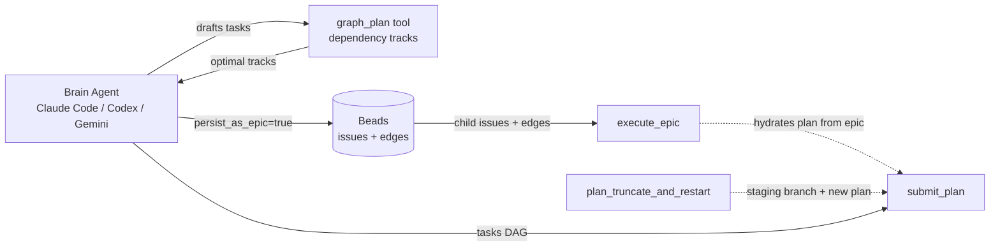
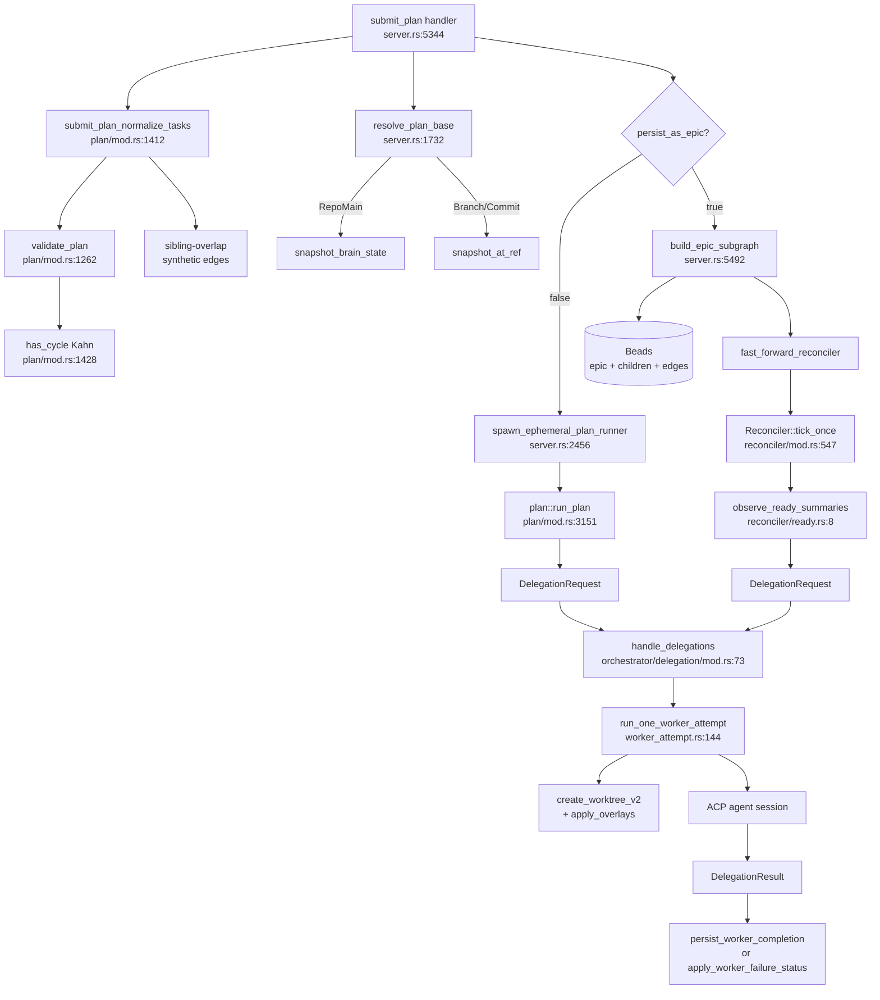
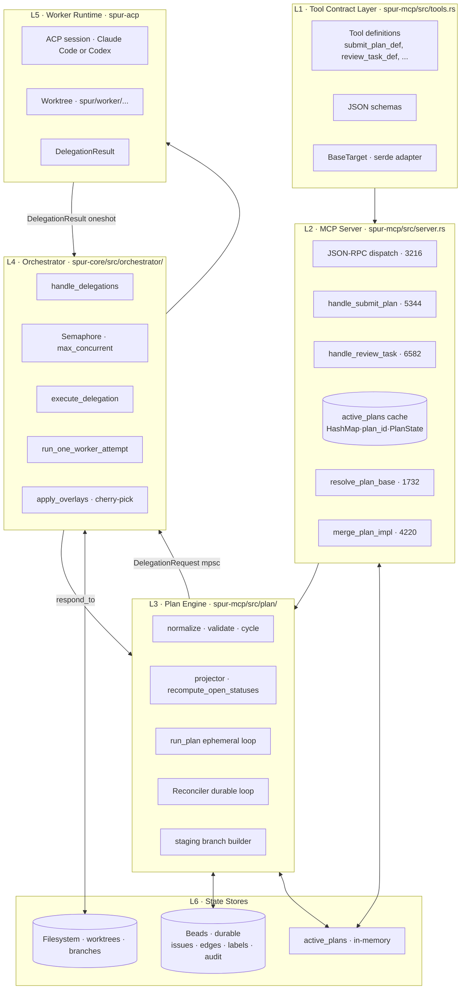
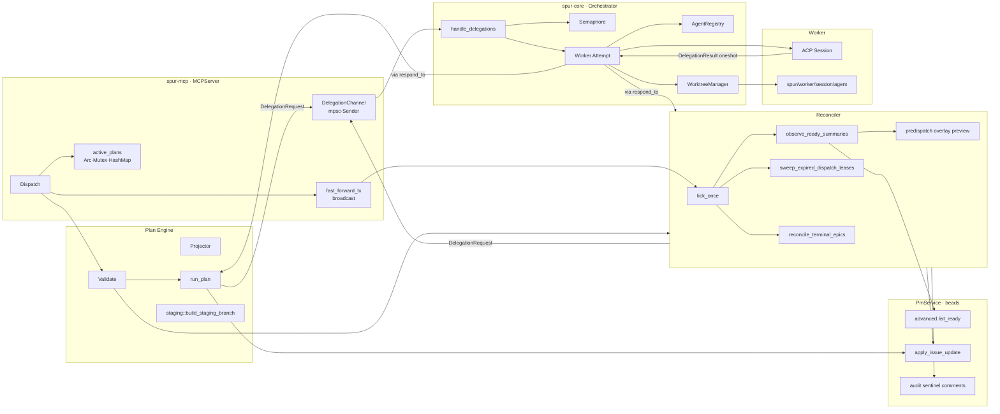
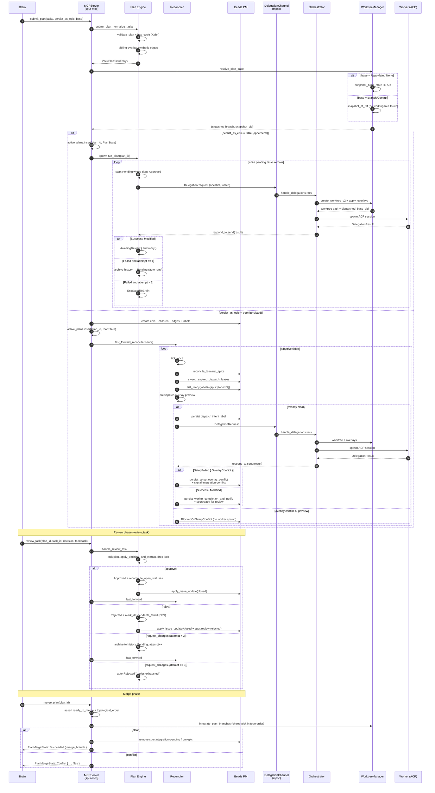

# RCA: `submit_plan` End-to-End Flow

**Date:** 2026-05-10
**Author:** Claude (Opus 4.7, 1M ctx)
**Method:** source-grounded code walk
**Grounded against:** `HEAD` (commit `e59cf14f`)
**Scope:**
- `crates/spur-mcp/src/tools.rs`
- `crates/spur-mcp/src/server.rs`
- `crates/spur-mcp/src/plan/{mod.rs, reconciler/, projector.rs, staging.rs}`
- `crates/spur-core/src/orchestrator/delegation/{mod.rs, execute.rs, worker_attempt.rs}`
- `crates/spur-acp/src/domain/delegation.rs`

**Status:** investigation only; no fix in this document.

---

## Executive Summary

`submit_plan` is **not a dispatcher**. It is a *graph-shaping + persistence + control-loop kickoff* primitive. The actual dispatcher is one of two loops chosen by the `persist_as_epic` flag:

1. **Ephemeral path** — `plan::run_plan` tokio task, lives in process memory, dies with the brain.
2. **Persisted path** — the `Reconciler` background loop, durable in beads, survives brain restarts.

The two loops have **divergent retry semantics, divergent failure handling, and divergent ownership models**. They share the same `DelegationRequest` wire type and the same orchestrator transport, but the projection of a failed worker back into task state is implemented twice.

> One-sentence model: **`submit_plan` shapes a DAG, pins a base, and either spawns a tokio loop or notifies a reconciler — it never directly dispatches a task.**

---

## 1. Upstream — Who Calls `submit_plan`?

**Three legitimate callers:**

| Caller | Path | Notes |
|---|---|---|
| Brain (direct) | `submit_plan(tasks, persist_as_epic?, base?)` | Most common. `tasks` may be a hand-written DAG or the output of `graph_plan`. |
| `execute_epic` | hydrates a beads epic into `Vec<PlanTask>`, then calls the same internal handler | The brain treats this as "resume a plan whose epic already exists." |
| `plan_truncate_and_restart` | builds a `spur/plan-staging/<plan_id>` branch, supersedes blocked tasks, then re-submits | Used to recover from cross-sibling overlay conflicts (`BlockedOnSetupConflict`). |

**Tolerant input contract.** `BaseTarget` (`tools.rs:18`) has a custom `Deserialize` (`tools.rs:32`) that accepts both the canonical object form and a JSON-stringified form because the Claude Code MCP harness double-encodes nested object arguments. This is a protocol-level workaround, not a design choice — flagged in §Flaws.

---

## 2. Downstream — What `submit_plan` Triggers

**The fork at `persist_as_epic` is the single most important branch in the system.** Everything below the fork has divergent semantics — see §6.

---

## 3. Layering Architecture

**Layering invariants:**
- **L1 is contract-only**: no logic, just schemas + the `BaseTarget` deserialize adapter.
- **L2 owns transport**: parses args, looks up `active_plans`, fan-out to L3.
- **L3 owns the DAG state machine**: status transitions are *only* legal when produced by `plan/mod.rs` or `projector.rs`.
- **L4 is stateless transport**: receives `DelegationRequest`, runs a worker, returns `DelegationResult` over the oneshot. It does not know about plans.
- **L5 is hermetic**: a worker sees only its worktree and the prompt. No access to `active_plans` or beads.
- **L6 split-brain risk**: `active_plans` (memory) and beads (durable) can diverge — see §Flaws.

---

## 4. Component Architecture

**Concurrency primitives:**
- `Arc<Mutex<HashMap<PlanId, Arc<Mutex<PlanState>>>>>` — two-level lock; outer for membership, inner for state mutation.
- `mpsc::Sender<DelegationRequest>` — single-producer-multi-consumer is *not* enforced; multiple callers (run_plan, reconciler, recovery tools) all clone the sender.
- `oneshot::Sender<DelegationResult>` — per-task; consumed exactly once.
- `watch::Sender<Option<String>>` for `dispatched_base_oid_tx` — published once by worker_attempt, observed by the result handler after the oneshot fires.
- `broadcast` channel for `fast_forward_reconciler` — used by `submit_plan` and `review_task` to wake the reconciler from idle backoff.
- `Semaphore(max_concurrent)` — global concurrency cap across all plans; not per-plan.

---

## 5. Sequential Logic Flow

---

## 6. Divergence Map: Ephemeral vs Persisted

| Concern | Ephemeral (`run_plan`) | Persisted (Reconciler) |
|---|---|---|
| Survives brain restart | ❌ | ✅ |
| Auto-retry budget | `AUTO_RETRY_BUDGET = 1` (`plan/mod.rs:2260`) | `MAX_ATTEMPTS = 3` only via `request_changes` review |
| Failure terminal state | `EscalatedToBrain` | `BlockedOnSetupConflict` / `Failed` audit sentinel |
| Ready detection | in-memory scan of `PlanState.tasks` | `pm.advanced().list_ready(labels_all=...)` |
| Dispatch intent | none — direct send | label-based lease (`spur:lease-expires-at:<ts>`) |
| Predispatch overlay preview | ❌ | ✅ (`reconciler/mod.rs:662`) |
| Lease/heartbeat | ❌ | ✅ (`leases.rs:10` + `delegation/mod.rs:23`) |
| Source of truth | `active_plans` HashMap | beads issues + labels |
| Recovery tools | none — process death = data loss | `force_reclaim_plan`, `recover_orphaned_dispatch`, `plan_truncate_and_restart` |

**Implication:** the same `submit_plan` call produces operationally distinct systems depending on a single boolean. Documentation, error messages, and retry semantics must be qualified by which mode the caller chose.

---

## 7. Flaws & Risks

This section calls out concrete weaknesses surfaced during the walk. Severity is engineering judgment, not customer impact.

### 7.1 [HIGH] Retry-budget asymmetry between ephemeral and persisted

- Ephemeral: `AUTO_RETRY_BUDGET = 1` at `plan/mod.rs:2260`. Exactly one auto-retry on worker failure, then `EscalatedToBrain`.
- Persisted: no auto-retry on worker failure; the task lands in `AwaitingReview` and the brain must call `review_task(request_changes)` to retry. `MAX_ATTEMPTS = 3` is enforced only at the review-decision boundary.

**Why it matters:** the brain cannot reason about "how many attempts can a flaky test cost me?" without first knowing which mode the plan is in. Worse, the ephemeral auto-retry has *no audit trail in beads* (there are no beads issues), so a flake-then-pass appears as a clean success, while the same flake in persisted mode requires explicit human intervention.

**Fix sketch:** unify retry to a single policy — auto-retry budget configurable per plan, applied uniformly, audit-logged in both modes.

### 7.2 [HIGH] Split-brain between `active_plans` cache and beads

`active_plans` (`server.rs:540`) is the warm cache; beads is the durable source. The two are kept in sync by `apply_issue_update`, whose failures are **advisory** — logged at `WARN` and swallowed (see §7 of the walk: "Beads sync is advisory").

**Failure mode:** if `apply_issue_update` fails after a local `PlanState` mutation, the in-memory cache says `Approved`, beads says `InProgress`, and the next reconciler tick will redispatch a task the brain considers done.

**Detection gap:** there is no periodic reconciliation that compares `active_plans` to beads. `force_reclaim_plan` only handles ownership, not state divergence.

**Fix sketch:** make state-transition writes transactional or at least retry-with-backoff with a hard failure that demotes the plan to "needs reconciliation" and refuses further mutations until reconciled.

### 7.3 [MEDIUM] Sibling-overlap detection is `context_files`-shaped, not edit-shaped

`submit_plan_normalize_tasks` (`plan/mod.rs:1296`) injects synthetic dependency edges between tasks that share a `context_files` entry. But:

- A worker can edit any file in the worktree, regardless of whether it was declared in `context_files`.
- `context_files` is brain-supplied prompt context, not a write manifest.
- A task that declares `context_files: ["A.rs"]` but actually edits `A.rs` and `B.rs` will silently collide with a sibling editing `B.rs`.

**Why it matters:** the architecture's only at-submit collision detection is based on a field the brain populates with no enforcement. The post-approve "clobber detector" (`server.rs:6648`) is the safety net, but it runs *after* approval and only on the approved branch.

**Fix sketch:** complement `context_files` overlap with a post-dispatch diff-touched-files check at completion time, before `AwaitingReview` is set.

### 7.4 [MEDIUM] `BaseTarget` tolerant deserializer is a protocol patch

The custom `Deserialize` at `tools.rs:32` accepts both object and JSON-string forms because the Claude Code MCP harness double-encodes. This is a one-way ratchet:

- Every nested-object field across all tools needs the same workaround if the harness regresses.
- The serializer side (Codex/Gemini brains) has no test coverage that the canonical form is preferred.

**Why it matters:** silent acceptance of malformed input hides client bugs. A future brain that accidentally double-encodes `tasks[].depends_on` will pass type-checking but produce wrong DAG semantics.

**Fix sketch:** log a `WARN` whenever the string-form path is taken; surface a `protocol_drift` counter; track upstream harness fix.

### 7.5 [MEDIUM] `dispatched_base_oid` is a watch channel observed *after* completion

`worker_attempt.rs` publishes `dispatched_base_oid` via `watch::Sender::send` once the worktree is built. The result handler reads it via `watch::Receiver::borrow()` *after* `respond_to.send(DelegationResult)` fires (`reconciler/mod.rs:935`).

**Race window:** if the worker process dies between worktree creation and oneshot send (e.g. SIGKILL, OOM), the watch may be set but the oneshot is never sent. The result handler never runs, so the OID is unreadable.

**Manifestation:** the lease eventually expires, the task is reclaimed, but the audit sentinel for the dispatch loses the precise base OID, complicating `recover_orphaned_dispatch` validation (which requires a known dispatched_base_oid).

**Fix sketch:** persist `dispatched_base_oid` to beads as a label or audit comment *at the moment* it is computed in `worker_attempt.rs`, before the worker session starts. Treat the watch as a fast-path; treat beads as the durable source.

### 7.6 [MEDIUM] Single global semaphore, no per-plan fairness

`Semaphore(max_concurrent)` in `handle_delegations` (`orchestrator/delegation/mod.rs:73`) is a process-wide cap. A single fat plan with 50 ready tasks starves a smaller, latency-sensitive plan submitted concurrently.

**Why it matters:** `submit_plan` advertises "independent tasks run in parallel" but parallelism is silently capped by the global semaphore. There is no priority, no per-plan quota, no QoS class.

**Fix sketch:** weighted-fair-queueing across plans, or per-plan semaphore with a global ceiling.

### 7.7 [LOW] `force_reclaim_plan` cannot stop the prior brain

The recovery tool strips `spur:owner:*` labels and writes a new ownership audit (`server.rs:5009`). It does **not**:

- Send a stop signal to the prior brain's session.
- Cancel any in-flight `DelegationRequest`s the prior brain emitted.
- Drain the prior brain's `active_plans` cache.

If the prior brain is still alive (network partition, slow heartbeat), both brains can dispatch into the same plan. The reconciler's lease mechanism partially mitigates this, but `run_plan` (ephemeral) has no lease.

**Fix sketch:** require the reclaim caller to provide a "fence token" written into beads; the orchestrator refuses `DelegationRequest`s whose plan_id is fenced under a newer token.

### 7.8 [LOW] Predispatch overlay preview duplicates work

`reconciler/mod.rs:662` runs `preview::preview_overlay` before sending the `DelegationRequest`. `worker_attempt.rs:215` then runs `apply_overlays` for real. Both perform the same cherry-pick simulation against the same base.

**Why it matters:** preview cost is paid on every tick that produces a ready task; with `idle_ceiling=30s` and `base_interval=3s`, this is mostly fine, but for plans with many ready tasks the preview latency dominates tick wall-time.

**Fix sketch:** cache preview results keyed by `(base_oid, overlays_set_hash)` with a short TTL; invalidate on approve.

### 7.9 [LOW] `request_changes` history bound is implicit

`MAX_ATTEMPTS=3` is enforced by checking `entry.attempt < 3` (`plan/mod.rs:4196`). The history vector grows without an explicit cap. For ephemeral plans the `attempt` counter is reset on auto-retry but the history is appended (`apply_worker_failure_status` at `plan/mod.rs:2260`), so a worker failing repeatedly with intermittent successes can accumulate unbounded history entries within the lifetime of the process.

**Why it matters:** `get_task_diff(attempt=N)` enumerates history; large history defeats brain context budgets.

**Fix sketch:** cap history length and surface "older attempts elided" in `get_task_diff`.

### 7.10 [LOW] No idempotency on `submit_plan`

The handler generates a fresh UUIDv4 plan_id every call (`server.rs:5330`). A retried call from a flaky harness creates a duplicate plan, duplicate epic in beads, duplicate worker dispatches.

**Why it matters:** MCP transport is not exactly-once; brains can and do retry on perceived timeout. Without an idempotency key, a slow `submit_plan` plus a brain retry produces two parallel epics.

**Fix sketch:** accept an optional `client_idempotency_key`; persist `client_key → plan_id` map; return the existing plan_id on collision.

---

## 8. Summary Table — Where to Look

| Concern | Primary file:line |
|---|---|
| Tool definition | `crates/spur-mcp/src/tools.rs:818` |
| Argument parsing | `crates/spur-mcp/src/server.rs:5344` |
| Validation | `crates/spur-mcp/src/plan/mod.rs:1262` |
| Cycle detection | `crates/spur-mcp/src/plan/mod.rs:1428` |
| Base resolution | `crates/spur-mcp/src/server.rs:1732` |
| Active plans cache | `crates/spur-mcp/src/server.rs:540` |
| Ephemeral loop | `crates/spur-mcp/src/plan/mod.rs:3151` |
| Reconciler tick | `crates/spur-mcp/src/plan/reconciler/mod.rs:547` |
| Ready scan | `crates/spur-mcp/src/plan/reconciler/ready.rs:8` |
| Lease sweep | `crates/spur-mcp/src/plan/reconciler/leases.rs:10` |
| Orchestrator dispatch | `crates/spur-core/src/orchestrator/delegation/mod.rs:73` |
| Worker attempt | `crates/spur-core/src/orchestrator/delegation/worker_attempt.rs:144` |
| Result type | `crates/spur-acp/src/domain/delegation.rs:216` |
| Review handler | `crates/spur-mcp/src/plan/mod.rs:4797` |
| Merge | `crates/spur-mcp/src/server.rs:4220` |
| Staging recovery | `crates/spur-mcp/src/plan/staging.rs:27` |

---

## 9. Open Questions

1. Is the retry-budget asymmetry (§7.1) intentional? If yes, document it as a public contract; if no, unify.
2. Should `active_plans` be eliminated in favor of beads-as-truth + a thin LRU? (eliminates §7.2 entirely)
3. Should `submit_plan` be split into `submit_plan_ephemeral` and `submit_plan_persisted` to make the §6 divergence visible at the contract layer?
4. What is the migration path for `BaseTarget` tolerant deserializer — fix the harness, or formalize the dual-form contract?

---

*End of RCA.*
