# Plan-State Synchrony — Target Architecture & Strangler-Fig Migration

**Date:** 2026-05-14
**Author:** brain (audit synthesis from codex / gemini / kimi)
**Related:** bd-334 (worker_branch dropped after request_changes + reuse_prior_worktree), bd-d1r (orchestrator simulator)
**Status:** Design — pending authorization to execute Tier 0

---

## 1. Why this document exists

bd-334 surfaced a class of state-synchrony bugs that unit tests don't catch and that a downstream simulator would only paper over. Three independent audits (codex evidence-first, gemini pattern analysis, kimi first-principles) converged on the same diagnosis: the recent fix patched a symptom, the structural cause is intact, and the same failure mode will recur in other shapes until the architecture is consolidated.

This document captures the target architecture at four zoom levels and the lower-risk strangler-fig path from today's working system to that target. No code changes are proposed inline; this is the design that gates the implementation plan.

---

## 2. The three-layer failure (what bd-334 actually is)

Each auditor located the root cause at a different layer. They are not competing — they are three facets of the same layered failure that *all aligned* for bd-334 to manifest:

| Layer | Auditor | Mechanism |
|---|---|---|
| **L1 — Cache invalidation** | kimi | `derive_beads_version` counts only epic-level audits, not task-level Completion events. The `active_plans` cache diverges from the durable audit log; nobody triggers a re-fold even when one is needed. |
| **L2 — Destructive projection** | gemini | `latest_completion_facts` does `latest = Some(...)` per Completion event instead of a per-field state-machine fold. A sparse-payload Completion silently overwrites historical fields with `None`. |
| **L3 — Dual-write in command handlers** | codex / gemini | `review_task` "approve" branch emits both `PendingAuditEmit::Approval` *and* `PendingBeadsOp` imperative state mutation. Non-atomic. The cache and the log can diverge by design. |

The bd-334 fix at commit `33f5f479` forced one specific field (`worker_branch`) to always be present in attempt-2 completions. That closed *one* path through *one* layer. The other layers and the other fields are unchanged. Any new sparse audit type, any new approval-path mutation, any new task-level audit that the cache doesn't see — same bug, different shape.

---

## 3. Target architecture — four zoom levels

### L0 — System view (where the orchestrator sits)

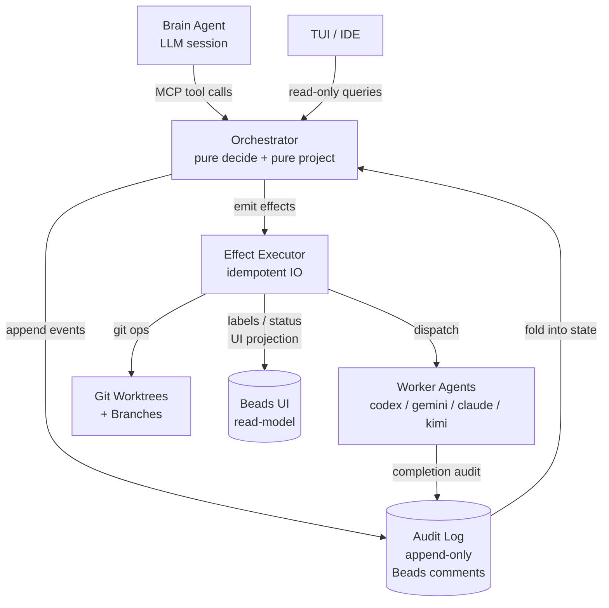

**Key shifts from today:** the audit log is the *only* source of truth for plan state. Beads issues/labels become a *derived UI read-model*, not an input to projection. The Effect Executor is the *only* layer that performs imperative side-effects, always *after* a durable event append.

### L1 — State-machine boundary (the pure core)

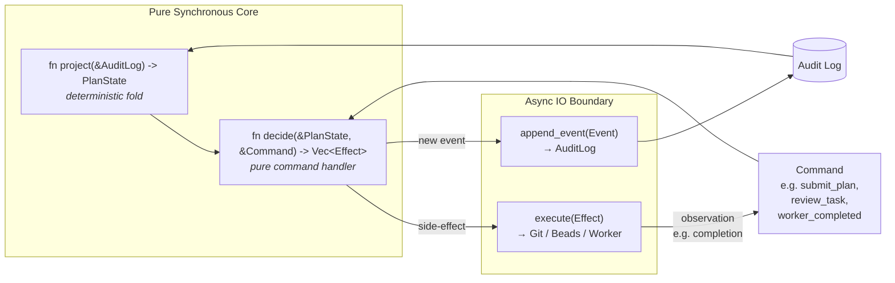

**The invariant this enforces:** state changes happen *only* through events. Effects happen *only* after events are durable. Replay is trivial because the fold is pure.

### L2 — Pure-fold internals (how a single task's state is computed)

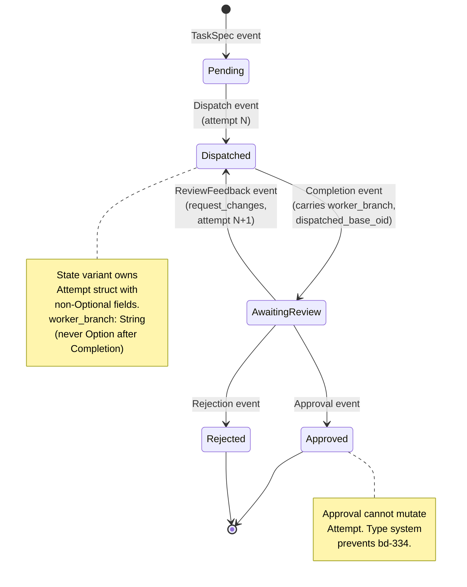

**The key type-system trick** (from kimi's first-principles derivation): once `Completion` populates an `Attempt` struct, the `Attempt` is owned by the state variant. `Approval` changes only the outer variant tag — it cannot drop or alter the `Attempt`. There is no code path through which `worker_branch` can become `None` after Approval, because there is no field to set to None and no logic that touches the Attempt. **bd-334 becomes impossible by construction, not impossible by convention.**

### L3 — Event taxonomy (the irreducible vocabulary)

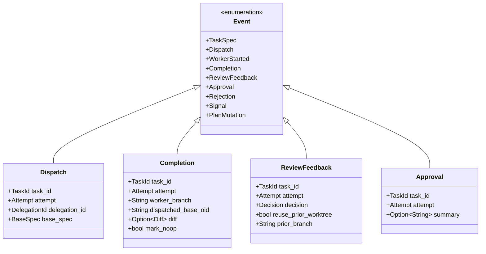

**Schema discipline:** every event carries enough information to be folded without consulting external state. `Completion` carries `worker_branch` non-optionally (a Completion *without* a worker_branch is a different event, e.g. `CompletionFailed`). `Approval` carries only the *attempt index it approves*, not the branch — the branch is already in the state machine. **No event has a field that can be silently dropped, because nullable fields go in separate event variants.**

---

## 4. Today vs. target — concrete deltas

```mermaid
flowchart TB
    subgraph Today
        direction TB
        T_Cache[active_plans cache<br/>mutable<br/>weak invalidation]
        T_Proj[projector.rs<br/>reads audit log AND labels<br/>destructive overwrite fold]
        T_Cmd[command handlers<br/>emit event AND<br/>imperative beads op<br/>non-atomic dual-write]
        T_Beads[(Beads<br/>both event store<br/>and mutable state)]

        T_Cmd -.->|event| T_Beads
        T_Cmd -.->|imperative| T_Beads
        T_Beads --> T_Proj
        T_Proj --> T_Cache
    end

    subgraph Target
        direction TB
        X_Proj[pure project()<br/>audit log only<br/>per-field fold]
        X_Decide[pure decide()<br/>event-only output]
        X_Exec[Effect Executor<br/>idempotent IO<br/>after append]
        X_Log[(Audit Log<br/>sole truth)]
        X_Beads[(Beads UI<br/>derived read-model)]

        X_Decide -->|events only| X_Log
        X_Log --> X_Proj
        X_Proj --> X_Decide
        X_Decide -->|effects| X_Exec
        X_Exec --> X_Beads
        X_Exec --> X_Log
    end
```

**The four concrete deltas:**

1. **Severing.** `projector.rs` stops reading `issue.labels` and `issue.status`. Status derives from the audit fold alone.
2. **Folding correctly.** `latest_completion_facts` becomes a per-field state-machine fold. A property established at attempt N propagates unless explicitly nullified by a later event.
3. **Purifying handlers.** Command handlers (`review_task`, `request_changes`, dispatch, escalation) drop `PendingBeadsOp` imperative state mutations. They emit events only. The Effect Executor handles imperative UI updates *after* the event is durable.
4. **Cache as read-model.** `active_plans` becomes a maintained read-model that is *updated by event appends*, not by direct mutation. Invalidation token covers all task-level audit writes.

---

## 5. The honest costs of the target architecture

Naming these explicitly because gemini and kimi both flagged them:

| Cost | Why it's real | Mitigation |
|---|---|---|
| **Replay performance** | 50+ JSON comments per task to determine readiness on cold start. | Maintained read-model + per-plan version token covers warm path. Cold replay is acceptable. |
| **Schema evolution friction** | `AuditSentinelKind` JSON variants live forever in old audit logs. Adding a field requires backwards-compat or an explicit upcaster. | Establish schema versioning discipline up front; upcaster pattern is well-understood. |
| **Debugging changes shape** | "Read one DB row" becomes "fold the event stream." | Mermaid sequence-diagram dump on assertion failure (already in simulator design). Event log is genuinely *more* debuggable for state-synchrony bugs. |
| **Effect-after-append discipline** | Every IO operation must be idempotent and replayable. | Already partially true (audit emission is idempotent). Discipline applied per Effect type. |

---

## 6. Strangler-fig migration — four tiers

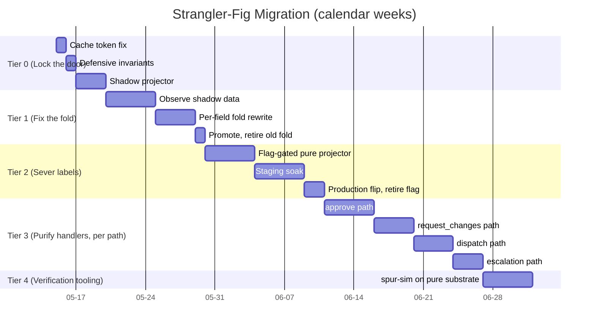

### Tier 0 — Lock the door (3–5 days, zero behavior change)

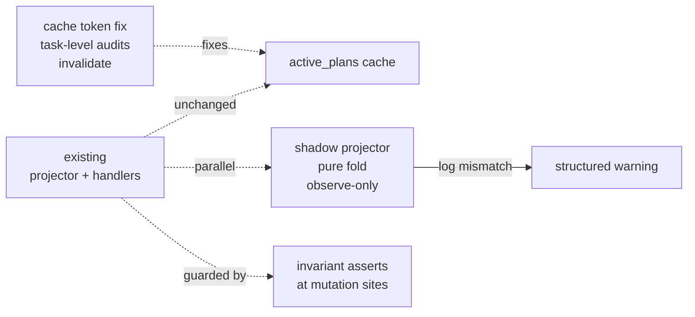

- **Cache invalidation token** advances on task-level audits (kimi's quick win).
- **Defensive invariants** at every state-mutation site for `worker_branch`, `dispatched_base_oid`, attempt info. Silent drop → loud panic with context.
- **Shadow projector** runs alongside the existing one. Pure-fold-only. Mismatches log warnings, production uses the existing projector's result. Buys empirical data about how broken the existing projector actually is.

**Risk: near-zero.** Asserts reversible. Shadow observe-only. Token fix is a 1-line change.

### Tier 1 — Fix the fold (3–7 days, isolated to one function)

Rewrite `latest_completion_facts` from `latest = Some(...)` overwrite to a per-field state-machine fold. Surgical change, one function, one file. Continuously validated against shadow projector from Tier 0.

**Risk: low.** Bounded surface. Reversible.

### Tier 2 — Sever label reads from projector (1–2 weeks, feature-flagged)

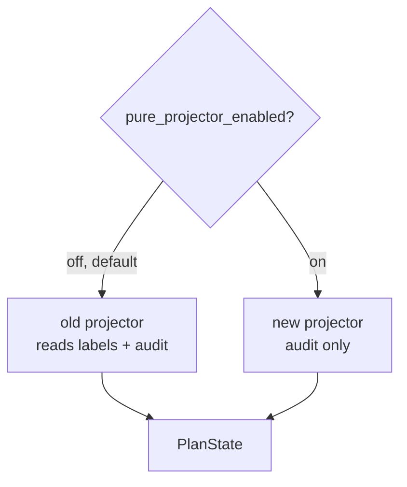

Runtime flag, default off. CI enables for parity tests. Staging soak. Production flip. Delete flag + old code path.

**Risk: medium, bounded.** Flag-reversible. No data loss possible (audit log was always canonical).

### Tier 3 — Purify command handlers, one path at a time

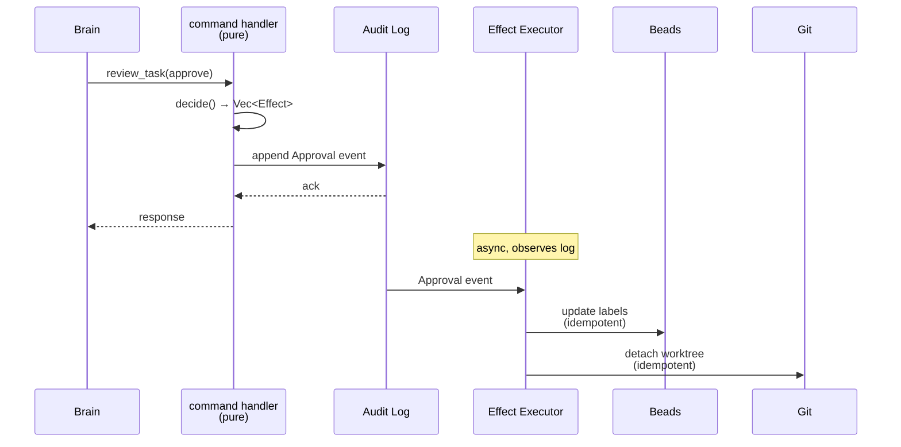

`approve` path first (bd-334 epicenter). Then `request_changes`. Then dispatch. Then escalation. Each is its own PR with its own e2e test.

**Risk: low per path.** No big-bang. Reviewable in normal cadence.

### Tier 4 — Verification tooling on the pure substrate

Now `fn project(&[Event]) -> State` is trivially testable. proptest over event sequences. The original bead-d1r 30-scenario list is *mostly subsumed* by property invariants; a small integration suite covers real-IO edges (worktree errors, real branch collisions).

---

## 7. Decision matrix

| Path | Calendar | Risk concentration | Mid-flight reversible? | Half-state ever exists? | Best fit if… |
|---|---|---|---|---|---|
| **Tier 0 only** | ~1 week | Near-zero | Trivially | No | Goal is purely bd-334-class regression protection. |
| **Tier 0 → 1** | ~2 weeks | Low | Yes | No | Goal includes hardening the projector against the broader anti-pattern. |
| **Tier 0 → 3** | ~6–8 weeks distributed | Low per step | Yes per tier | No | Goal is full architectural consolidation, paced over normal sprints. |
| **Tier 0 → 4** | ~10 weeks distributed | Low per step | Yes per tier | No | Includes building the simulator on the cleaned-up substrate. Full bead-d1r scope. |
| **(Rejected) Big-bang 5-week sprint** | 5 weeks concentrated | Medium-high concentrated | No | Yes, for weeks | Deadline pressure forcing concentration. Not recommended. |

---

## 8. What this means for bd-d1r

The original bead-d1r framed a 30-scenario simulator as the primary deliverable. After the audit:

- The simulator is demoted to **Tier 4 verification tooling**.
- Most of the 30 scenarios are subsumed by property tests over the pure `step()` function.
- A small integration suite remains for genuine I/O edges.
- The simulator's value depends on Tiers 1–3 happening first; otherwise it's testing a fragile substrate.

Recommended re-scoping: keep bd-d1r as the umbrella, open child beads per tier (`bd-d1r-t0`, `bd-d1r-t1`, `bd-d1r-t2`, `bd-d1r-t3`, `bd-d1r-t4`). Each tier independently dispatchable.

---

## 9. Open questions for the next decision cycle

1. **Tier 0 authorization** — ship this week, low risk, high protection?
2. **Tier-by-tier authorization** vs. blanket Tier 0–3 authorization?
3. **Shadow-projector mismatch threshold** — what observed mismatch rate during Tier 0 triggers aggressive Tier 1/2 vs. relaxed cleanup?
4. **Schema evolution policy** — when Tier 3 lands, do we version `AuditSentinelKind` JSON explicitly, or rely on additive-only evolution?
5. **Effect Executor placement** — new module in `spur-mcp` or new crate `spur-effects`?

---

## 10. Tier-1 update (2026-05-15) — scope refinement post-Tier-0 landing

**Status:** Tier-0 delivered. This section refines Tier-1 in light of what Tier-0 surfaced and ties the original `Sever labels` (then "Tier 2") into a unified work-stream coordinated with the **bd-1va dual-write** fix.

### 10.1 What Tier-0 delivered

Three commits merged to local main on 2026-05-15:

| Commit | Bead | What it did | Substrate impact |
|---|---|---|---|
| `6172b027` | bd-d1r-t0c-fu1 (bd-3lo) | Surgical field-skip in `emit_shadow_projector_mismatch_warnings` so legacy `Superseded { mutation_id, by }` no longer triggers shadow-vs-legacy mismatch noise on the one field shadow *cannot* reconstruct from audits alone (the label-only `mutation_id`/`by` metadata). All other field comparisons preserved. | Restores shadow projector's signal quality. Validates that the architectural axiom "labels carry data audits cannot" is real and must be respected, not hand-waved. |
| `cef0fd47` | bd-d1r-fu-stale-delegation-cleanup (bd-1xt) | Scrubs every existing `spur:delegation-id:*` and legacy `delegation-id:*` label on both `dispatch_intent_update` and `clear_dispatch_intent_update` paths. Closes the "stale label survives across attempts → projector picks stale ID via first-label-wins `.find_map(...)` → invariant panic on closure" hazard class. | First substantive step toward severing labels from authority: the *label state* now has a strict-uniqueness invariant maintained at every write boundary. Audit-sentinel JSON remains the durable lineage record. |
| `82aa852b` | bd-d1r fixture cluster | Brings test harness to fidelity with the T0 invariant `assert_dispatched_base_oid_for_active_status` (projector.rs:885): adds `mock_worker_completion` helper, unignores 4 tests that bypassed worker completion via label-poking, deletes one test that verified state structurally unreachable under T0. | Locks in the projector load-time invariant by ensuring no test harness can construct an invariant-violating state. |

### 10.2 The architectural axiom Tier-0 surfaced — and its bifurcation

A first draft of this section claimed "audits are the source of truth, labels are projections." A subsequent first-principles audit (gemini delegation `d1a6aa6e-670c-49c1-be0a-4381e385429b`) refuted that framing as too clean: it ignores two substrate constraints that force part of the system to keep labels *authoritatively*. The honest axiom is bifurcated:

> **For state-determining concerns, the audit-sentinel comment stream is the source of truth. Labels representing this state are indexed read-models, maintained as caches so the Beads backend can answer `list_issues({labels: [...]})` queries (it cannot server-side filter on comment-body JSON). For high-frequency ephemera (lease heartbeats) and out-of-band triggers (signals), the audit stream is intentionally bypassed — labels are the authoritative storage primitive with no audit counterpart by design.**

This bifurcation is not a wart; it is a deliberate response to two real constraints:

1. **Query indexability**: `crates/spur-mcp/src/plan/reconciler/guards.rs:22,136`, `terminal.rs:127,181`, `server/recovery.rs:121`, `server/handlers/plan.rs:499` all call `pm.list_issues(IssueFilter { labels: [...] })` to find work. If the index label is missing, the issue is invisible — no reconciler tick will discover it. Labels are how the backend index works.
2. **Heartbeat economics**: `crates/spur-mcp/src/plan/mod.rs:2143-2167` (`update_dispatch_lease`) refreshes `spur:lease-expires-at:*` every few minutes with a label-only write. An audit-comment per heartbeat would saturate the timeline within hours. Likewise `crates/spur-mcp/src/plan/signal_watcher.rs:98-118` and `crates/spur-mcp/src/server/handlers.rs:789` treat `signal:*` as authoritative — there is no `AuditSentinelKind::Signal` variant.

### 10.2.1 Label bifurcation — Type A (Indexed Read-Model) vs. Type B (Authoritative Ephemera)

| Type | Examples | Source of truth | Maintenance | Reconciler responsibility |
|---|---|---|---|---|
| **A — Indexed Read-Model** | `spur:plan-id:*`, `spur:plan-task-id:*`, `spur:agent:*`, `spur:plan-pending`, `ready-for-review`, `spur:delegation-id:*` (current attempt only), `spur:superseded-by:*`, `spur:mutation-id:*` | The **audit stream**. Each label is a denormalized projection of state derivable by folding `AuditSentinelKind::{TaskSpec, Dispatch, Completion, Approval, Rejection, …}`. | **Eager write-through** inline with the audit append (write-ahead log). Idempotent. | **Index hygiene sweeper**: detect drift between label state and audit-derived state; refresh idempotently. This is §10.3.1's actual role. |
| **B — Authoritative Ephemera** | `spur:lease-expires-at:<ts>`, `signal:scope-drift`, `signal:escalated`, `signal:blocked`, `signal:risk` | The **label itself**. No audit-stream copy exists by design (would be timeline spam, or the data is out-of-band-injected by external tooling). | Direct label writes via `update_issue`. No write-ahead log; nothing to reconcile against. | Lease expiry sweep (existing). Signal label handling stays as-is. **No change under Tier-1.** |

Cited reads outside the projector:
- Type A index readers: `reconciler/guards.rs:22,136`, `reconciler/terminal.rs:127,181`, `server/handlers/plan.rs:499`, `server/recovery.rs:121`, `mutation_executor.rs:1516-1534`.
- Type A status readers (today, target Tier-1 §10.3.2): `projector.rs:362-468`, `signal_watcher.rs:98-118` (for `ready-for-review` filter), `server/handlers/delegation.rs:217,236` (`recover_orphaned_dispatch`), `plan_builder.rs:230`, `reconciler/leases.rs:49`, `server/sync.rs:520`.
- Type B authoritative readers: `reconciler/leases.rs:60` (parses `spur:lease-expires-at:*`), `signal_watcher.rs:98-118` (filters by `signal:*`).
- Type B writers: `mod.rs:2143-2167` (`update_dispatch_lease`), `server/handlers.rs:789` (signal attach).

This bifurcation directly governs the three Tier-1 components: §10.3.1 maintains Type A index integrity; §10.3.2 demotes Type A *status* labels from projection-authoritative to index-only; §10.3.3 handles a Type A label-only metadata field (`Superseded.{mutation_id, by}`) in the shadow comparator. **Type B labels are untouched.**

### 10.3 Tier-1 scope — three components

#### 10.3.1 bd-1va — index-maintenance reconciler (Type A label cache hygiene)

**Reframing note.** An earlier draft of this subsection called this work "self-healing reconciler / audit-WAL" and described its job as *race repair*: detect a torn dual-write state and finish the second write. That framing was wrong under the bifurcation in §10.2.1. Once §10.3.2 demotes Type A status labels from projection-authoritative to index-only, **no consumer derives state from labels anymore**, so there is no race window between "label says X, audit says Y" — the projector always reads Y. The reconciler's job is not race repair; it is **index integrity maintenance** for the read-model. This subsection's verbs and invariants are reframed accordingly.

**Plain English (before, today's regime).** Today, when a worker completes a task, `persist_completion_result_with_retry_for_task` (`crates/spur-mcp/src/plan/mod.rs:~2451`) writes the Completion audit comment, then the Type A label update — two separate I/O calls. A crash between them leaves *two* things visibly inconsistent: (a) the projector reads `Dispatched` from the stale label even though the audit says `AwaitingReview` (today's projector is label-first); (b) `list_issues({labels: [ready-for-review]})` does not return the issue, so reviewers can't find it. Today, (a) is the visible-race symptom that bd-334 / bd-1va surfaced.

```mermaid
sequenceDiagram
    participant W as Worker
    participant Compl as persist_completion_result
    participant PM as Beads PM
    participant Proj as Projector (label-first)
    participant Q as list_issues consumers

    W->>Compl: completion outcome
    Compl->>PM: add_comment(Completion sentinel)
    Note over PM: comment durable<br/>worker_branch + summary persisted
    Note right of Proj: ⚠ projector reads labels first<br/>(today's regime)
    Proj->>PM: read labels
    PM-->>Proj: spur:delegation-id:foo still present
    Proj->>Proj: project_status_for_issue → Dispatched (wrong)
    Q->>PM: list_issues({labels:[ready-for-review]})
    PM-->>Q: ∅ (issue invisible to query)
    Compl->>PM: apply_issue_update(labels) [eventually]
    Note over PM: labels consistent;<br/>projection only correct now
```

**Plain English (after, under §10.3.2 + this section).** Under the bifurcation:
- §10.3.2 makes the projector audit-first → state is correctly `AwaitingReview` the instant the Completion comment lands, regardless of label state. No race in projection.
- The label-update is now *pure cache maintenance*. A failed/delayed label write does not corrupt state; it only delays *queryability*. The issue is correctly `AwaitingReview`, but `list_issues({labels:[ready-for-review]})` won't find it until the label catches up.
- **This subsection's job**: ensure the catch-up happens reliably and idempotently. The reconciler periodically reads each open issue, derives the expected Type A label set from `(issue.audits)` via audit-derivation helpers, and patches any drift via an idempotent `update_issue` call. Drift is structured-logged as a `label_index_drift` counter (telemetry, not panic).

```mermaid
sequenceDiagram
    participant W as Worker
    participant Compl as persist_completion_result
    participant PM as Beads PM
    participant Proj as Projector (audit-first §10.3.2)
    participant Recon as Index-Maintenance Reconciler
    participant Q as list_issues consumers

    W->>Compl: completion outcome
    Compl->>PM: add_comment(Completion sentinel)
    Note over PM: WAL: audit durable<br/>STATE IS NOW CORRECT
    Proj->>PM: read audits
    PM-->>Proj: Completion sentinel present
    Proj->>Proj: project → AwaitingReview ✓<br/>(audit-derived; labels irrelevant)
    Compl->>PM: apply_issue_update(labels) [eager refresh]
    alt happy path
        Note over PM: index consistent immediately
    else crash or partition
        Note over PM: index temporarily stale<br/>(state still correct via projector)
        Q->>PM: list_issues({labels:[ready-for-review]})
        PM-->>Q: ∅ (issue not yet findable)
        Note over Recon: next tick
        Recon->>PM: read (issue, audits)
        Recon->>Recon: expected_labels = derive_from_audits(audits)<br/>diff vs current → emit label_index_drift counter
        Recon->>PM: update_issue(remove_stale, add_missing) [idempotent]
        Note over PM: index converged;<br/>issue now findable via labels
    end
```

**Delta from today.**
- The two-step write is *not eliminated* — Beads provides no multi-statement transaction across comments and labels (per §10.3 of bd-1va analysis). It's *demoted*: the label write is no longer a state-correctness operation, just an index-cache refresh.
- The reconciler's verb changes from "complete the missing commit" to "reconcile the index against the audit-derived projection." Same mechanism (idempotent `update_issue`), different invariants in tests.
- Telemetry: `label_index_drift{type=label-name, direction=missing|stale|mismatched}` counter replaces the panic. Operators can alert on sustained nonzero drift (real bug) vs. transient nonzero drift (expected during writes).
- The Tier-0 relaxed invariants at `projector.rs:443-466` can be tightened back **only after §10.3.2 lands** (when state stops being derived from labels). This subsection on its own does *not* enable the tighten; §10.3.2 does.

**Out of scope.** Type B labels (`spur:lease-expires-at:*`, `signal:*`) are not maintained by this reconciler. Their authority remains label-direct; their write paths (`update_dispatch_lease`, signal-attach handlers) are unchanged.

**Production-code surface.** `persist_completion_result_with_retry_for_task` (`mod.rs:~2451-2540`) keeps comment-first ordering. The reconciler gains an `index_hygiene_sweep(&issue, &audits)` step per tick (new helper in `reconciler/mod.rs` or a new module `reconciler/index_hygiene.rs`). Audit-derivation helpers shared with §10.3.2 (`current_delegation_from_audits`, `awaiting_review_from_audits`, `terminal_status_from_audits`) produce the expected Type A label set; the diff against current labels is the patch. Test surface: property tests for "crash anywhere between audit-write and label-write → next tick converges the label index to match the audit-derived projection; intermediate state is queryably-stale but not incorrect." Estimated ~200-400 LoC production + ~150-250 LoC tests — smaller than the original "race repair" framing because it reuses §10.3.2's helpers and has weaker invariants (cache, not commit).

#### 10.3.2 projector-prefers-audits

**Plain English (before).** Today `project_status_for_issue` (`projector.rs:362-467`) uses a *label-first cascade*: it asks "is there a `spur:delegation-id:*` label?" *before* it consults the audit stream. Labels are the truth; audits are decoration. This is why every label-drift bug we've seen (bd-334, the dual-label race, bd-1xt's stale-label hazard, bd-1va's torn-state) manifests as a projector panic or a misclassification: when labels are wrong, projection is wrong.

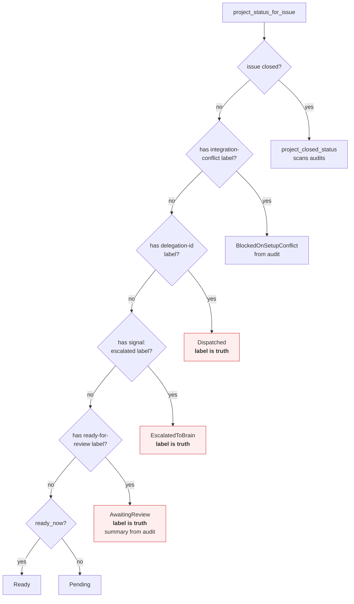

**Plain English (after).** The cascade is inverted. Audit-derivation helpers (`current_delegation_from_audits`, `awaiting_review_from_audits`, `escalated_from_audits`) become the *primary* input. Labels are consulted only when audits are silent or to retrieve metadata the audit stream genuinely cannot carry (e.g. `Superseded.mutation_id`/`by`). A label that disagrees with audits emits a structured `label_audit_drift` diagnostic counter — *not* a panic — and the audit-derived state wins.

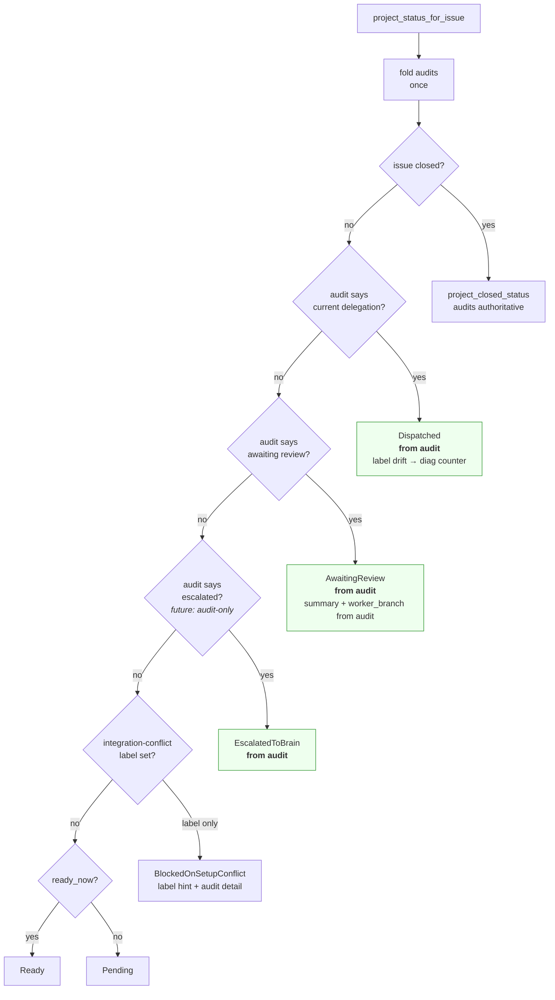

**Delta.** Three concrete shifts: (1) the strict mutual-exclusivity invariants at `projector.rs:443-466` can be *tightened back* (the relaxation was a band-aid for label-drift; once label-drift no longer determines state, there's no race to tolerate). (2) Every downstream consumer that reads labels today — `recover_orphaned_dispatch` (`server/handlers/delegation.rs:217,236`), `signal_watcher` (`plan/signal_watcher.rs:98,119`), `plan_builder` recovery (`server/plan_builder.rs:230`), reconciler `leases.rs:49`, `sync.rs:520` — gets the same inversion: audit-first, label-as-hint. (3) `label_audit_drift` becomes the canonical observability signal for hygiene issues; the panics retire.

Estimated ~500-800 LoC across 5 call sites; best landed as 3-4 sequential sub-PRs (projector core first, then each consumer).

#### 10.3.3 Partial-order `PlanTaskStatus` comparator

**Plain English (before).** Today `emit_shadow_projector_mismatch_warnings` (`projector.rs:~610-668`) compares legacy vs. shadow projections field-by-field via `format!("{:?}", ...)` string equality. Tier-0 added a surgical skip: when legacy is `Superseded`, skip the `status` field check (because shadow can't reconstruct `mutation_id`/`by`). This is correct as far as it goes, but it discards a real signal — the shadow *does* know the fact of supersession from `CompletionState::Superseded` in the audit stream; it just can't reconstruct the label-only metadata.

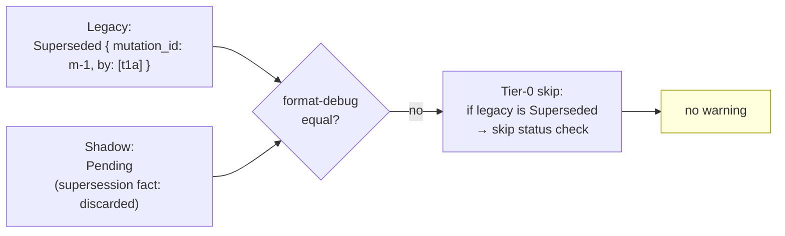

**Plain English (after).** Replace the format-debug equality with a *partial-order comparator*. The shadow projector emits `Superseded { mutation_id: None, by: vec![] }` when it sees `CompletionState::Superseded` in the audit stream (preserving the *fact*). The comparator treats legacy's `Some("m-1")` / `vec!["t1a"]` as *matching* shadow's `None` / `vec![]` under the partial-order rule "shadow ≤ legacy on this field is OK." The Tier-0 status-field skip becomes redundant and is removed. The fact-of-supersession round-trips through the audit-only fold; only the label-only metadata is acknowledged as irreducibly out-of-reach for the shadow.

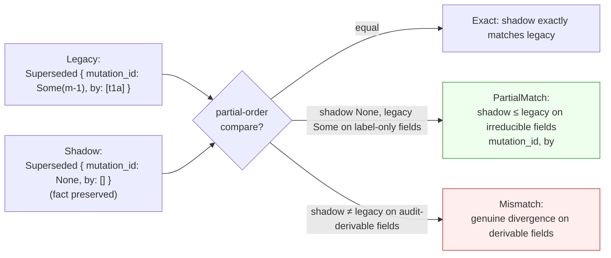

**Delta.** The comparator becomes future-proof: any future status variant that gains label-only metadata declares it in one place (the partial-order rule for that variant), instead of accumulating ad-hoc `if field == "..." && matches!(status, ...)` skips in the comparator loop. The supersession-fact signal — discarded today — re-enters the integrity-proof surface. Property tests over generated audit streams guarantee: every legacy/shadow pair derived from the same audits returns `Exact` or `PartialMatch`, never `Mismatch`.

Estimated ~150-250 LoC + property tests. Lowest-risk component; can land last.

### 10.4 Sequencing and dependencies

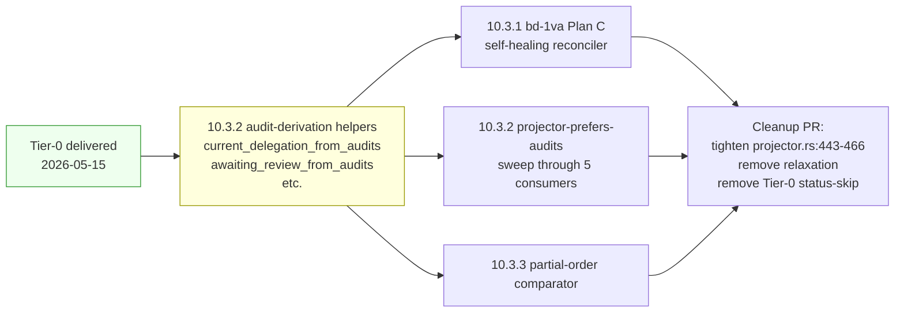

The audit-derivation helpers (built as part of §10.3.2's first sub-PR) are the foundation for all three components. §10.3.1 and §10.3.3 are independent of each other once helpers exist and can be parallelized.

### 10.5 What lands in the cleanup PR

## Status: shipped 2026-05-15

The cleanup PR is the proof the bug class is retired *for Type A status labels*. **Type B authoritative-ephemera labels are out of scope** — their authority is by-design and the cleanup PR makes no changes to lease or signal paths.

Scope of the cleanup:

- Tighten `projector.rs:443-466` back to strict mutual exclusivity. The relaxed `|| matches!(status, Dispatched)` and `|| matches!(status, ... AwaitingReview ...)` escape hatches are removed *because state is no longer derived from labels* (§10.3.2). A residual Type A label drift now manifests as a `label_index_drift` counter increment via the §10.3.1 sweeper, not a projector panic.
- Delete the bd-3lo Tier-0 status-field skip in `emit_shadow_projector_mismatch_warnings` — the partial-order comparator from §10.3.3 subsumes it.
- The shadow projector becomes the *correctness oracle* for the legacy projector. Any mismatch is now genuine (since Type A label drift no longer affects projection; only audit-fold logic does).
- A subsequent step can then *delete the legacy projector entirely* and promote the shadow path, completing the original Tier-2 goal at §6.

Explicitly **not** in cleanup scope:
- `spur:lease-expires-at:*` writes by `update_dispatch_lease` (`mod.rs:2143-2167`) — Type B, label-authoritative by design.
- `signal:*` writes and reads (`signal_watcher.rs:98-118`, `server/handlers.rs:789`) — Type B, no audit copy by design.
- Label-based query indexes used by `IssueFilter` in `reconciler/guards.rs`, `reconciler/terminal.rs`, `server/handlers/plan.rs`, `server/recovery.rs` — these remain Type A read-models; §10.3.1's sweeper keeps them honest.

### 10.6 Calendar estimate

Single-worker serial execution: **2-3 weeks** for Tier-1 components (~5 child tasks under one epic via `submit_plan`). Parallelized after helpers land: **1-1.5 weeks**. Cleanup PR: ~1-2 days post-soak.

### 10.7 Pre-flight validations

Two cheap reads to do before filing the epic:

1. Re-read this document end-to-end against the proposed §10 plan to confirm consistency with §3-§7's architectural commitments.
2. Spike the §10.3.2 audit-derivation helper API in a throwaway branch against 2-3 of the 5 call sites; confirm the abstraction holds without leaking. If it doesn't, the shape becomes an `IssueProjection` struct wrapping `(Issue, audits)` as canonical input everywhere — bigger refactor, different scope, file a separate decision.

---

## Appendix A — Audit references

- **codex audit** (delegation `a0c4f127`): evidence-first code review, identified `worker_branch` in 4 stores, found bd-334 fix commit `33f5f479`, predicted 3 latent bugs.
- **gemini audit** (delegation `8a0259ff`): pattern analysis, named "Dual-Write" and "Destructive Projection" anti-patterns, 80%-event-sourcing diagnosis, three minimum-invasive structural changes.
- **kimi audit** (delegation `5c0eabc7`): first-principles derivation, type-system invariant proof, 2-day quick-win identified, 4–6 week full-pivot estimate, intermediate-alternatives ranking.

## Appendix B — Cited code locations

- `crates/spur-mcp/src/plan/projector.rs:43` — informational parse drop
- `crates/spur-mcp/src/plan/projector.rs:98` — `latest_completion_facts`
- `crates/spur-mcp/src/plan/projector.rs:337` — `project_status_for_issue` reads labels
- `crates/spur-mcp/src/plan/audit_sentinel.rs:71, 119, 125, 152, 169` — sentinel taxonomy
- `crates/spur-mcp/src/plan/mod.rs:167, 173, 222` — `PlanState` / `PlanTaskEntry`
- `crates/spur-mcp/src/plan/mod.rs:4314` — `reuse_prior_worktree` runtime check
- `crates/spur-mcp/src/plan/reconciler/mod.rs:670, 1083, 295` — reconciler impurities
- `crates/spur-mcp/src/plan/snapshot.rs:29` — owner-state seam (always None)
- `crates/spur-core/src/plan_projection/mod.rs:1` — ACP snapshot cache
- Commit `33f5f479` — bd-334 fix
