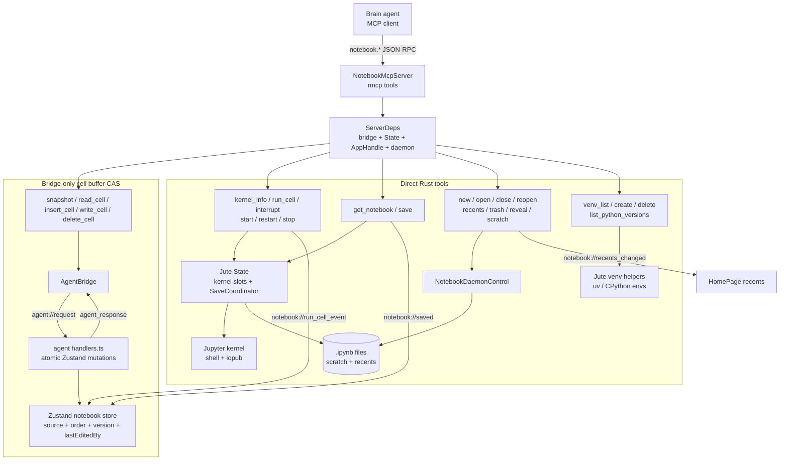

# SPUR Notebook MCP Direct Rust RCA

**Date:** 2026-05-25
**Plan:** `81e18df7-1f06-4a34-bfaf-c66038f75c14`
**Related:** [SPUR Notebook v0.4 build plan](../superpowers/plans/spur-notebook-v0.4-build-plan.md), [bd-froxj](beads://bd-froxj)

---

## 1. Principle

The refactor narrows the bridge to the one job JavaScript must own:
cell-buffer compare-and-swap.

Everything else moves to Rust:

- **Rust owns kernel state.** Kernel slots, generation, start/restart/stop, interrupt, and execution all live against `jute::state::State` and Jupyter wire-protocol helpers.
- **Rust owns filesystem writes and reads.** `notebook.save` writes through `SaveCoordinator`; `notebook.get_notebook` reads and parses `NotebookRoot` directly.
- **Rust owns daemon and environment operations.** Notebook open/new/close/reopen, recents, trash/reveal/scratch cleanup, and venv management route through Rust control/helpers.
- **The bridge owns only live cell-buffer CAS.** `snapshot`, `read_cell`, `insert_cell`, `write_cell`, and `delete_cell` still cross `AgentBridge` because Zustand is the live source for unsaved `source`, order/type, `version`, and `last_edited_by`.

The resulting rule is simple: if a tool needs the current unsaved cell buffer, it uses the bridge; if it needs kernel/fs/daemon/environment state, it calls Rust.

### Lifecycle Save Contract

H1 audit found that the Tauri frontend schedules debounced autosave from the
Zustand notebook store (`store.subscribe(() => scheduleAutosave())`), but it
does not synchronously flush on notebook page unmount, window close, window blur,
or before opening another notebook. A daemon lifecycle transition can therefore
hide or replace the webview before the debounce fires.

Resolution: daemon lifecycle branches that leave the current document
(`notebook.open`, `notebook.new`, `notebook.close`, and daemon `shutdown`) now
flush the active in-memory document before continuing. The flush asks the
frontend bridge for `notebook.export` so JavaScript remains the live cell-buffer
source of truth, then Rust writes the returned `NotebookRoot` through
`SaveCoordinator` for the currently loaded path. Public MCP save remains
explicit as `notebook.save { path, contents }`; the lifecycle flush is a daemon
data-loss guard, not a replacement for caller-directed saves to arbitrary paths.

---

## 2. Tool Surface by Category

Public surface expands from the v0.4 plan's 8 notebook tools to 27 notebook tools, plus `notebook.ping` as a socket diagnostic.

| Category | Tools | Owner | Routing |
|---|---|---|---|
| Cell-buffer CAS | `notebook.snapshot`, `notebook.read_cell`, `notebook.insert_cell`, `notebook.write_cell`, `notebook.delete_cell` | JS/Zustand | `AgentBridge` -> `agent://request` -> atomic handlers -> `agent_response` |
| Kernel execution/lifecycle | `notebook.kernel_info`, `notebook.run_cell`, `notebook.interrupt`, `notebook.start_kernel`, `notebook.restart_kernel`, `notebook.stop_kernel` | Rust/Jute state | Direct `ServerDeps.state` + Jute command helpers |
| Notebook file I/O | `notebook.get_notebook`, `notebook.save` | Rust filesystem | `tokio::fs` / `SaveCoordinator` |
| Daemon lifecycle | `notebook.new`, `notebook.open`, `notebook.close`, `notebook.reopen` | Rust daemon control | `NotebookDaemonControl` |
| Recents and file actions | `notebook.list_recents`, `notebook.set_pinned`, `notebook.remove_from_recents`, `notebook.move_to_trash`, `notebook.reveal_in_finder`, `notebook.discard_scratch` | Rust recents/fs helpers | Recents store + Jute file helpers |
| Environment | `notebook.venv_list`, `notebook.venv_create`, `notebook.venv_delete`, `notebook.venv_list_python_versions` | Rust/Tauri app | Jute venv impl fns via `ServerDeps.app` |

All tools keep synchronous MCP semantics: one `CallToolResult::structured(...)` after awaiting the operation. `run_cell` no longer streams MCP progress; it drains kernel events server-side and fans those events to the webview separately.

---

## 3. Architecture

The important inversion is that Rust no longer asks JS to do kernel, save, daemon, or environment work. JS remains authoritative only for the mutable notebook cell buffer visible in the editor.

---

## 4. What Collapsed

| Old apparatus | Why it existed | Why it collapsed |
|---|---|---|
| `request_no_timeout` | `run_cell` previously crossed the bridge and needed to wait on JS execution without a normal bridge timeout. | `run_cell` now drains `run_cell_events(...)` directly in Rust. Remaining bridge calls all use the normal bounded timeout, so the no-timeout branch was dead. |
| Dead frontend `notebook.save` handler | JS had a save handler even though no MCP tool exposed `notebook.save`. | `notebook.save` is now an explicit Rust MCP tool with `{ path, contents }`, writing through `SaveCoordinator` and emitting `notebook://saved`. |
| `events: []` hardcode | The JS bridge `runCell` response had an `events` field but returned no real stream. | Direct Rust execution receives real `RunCellEvent` values and fans them to the webview; MCP returns final `{ id, status, exec_count, outputs }`. |
| `RecordingProgress` | A placeholder for MCP progress capture in `run_cell`. | The refactor chose sync MCP: no `ProgressNotification`; UI mirroring happens through Tauri events, not MCP progress. |
| Frontend kernel handlers | `kernel_info`, `interrupt`, and `run_cell` lived in `agent/handlers.ts` because every MCP operation used the bridge. | Kernel operations now call Rust state directly. Frontend handlers retain only cell-buffer CAS methods. |

---

## 5. Fan-out Events

These events are Tauri/webview synchronization events, not MCP responses. The MCP result stays synchronous.

| Event | Payload | Producers | Consumers |
|---|---|---|---|
| `notebook://run_cell_event` | `{ cell_id: string, kernel_id: string, event: RunCellEvent }` | `notebook.run_cell` direct Rust handler | Notebook page listener -> `Notebook.handleRunCellEvent(...)` |
| `notebook://kernel_changed` | `{}` / no payload | Kernel lifecycle paths as designed | Notebook page listener -> `refreshKernelSlotInfo()` |
| `notebook://saved` | `{ path?: string }` | `notebook.save` | Notebook page listener; currently TODO for dirty-state clearing |
| `notebook://recents_changed` | `{}` | `new`, `open`, `close`, `reopen`, `set_pinned`, `remove_from_recents`, `move_to_trash`, `discard_scratch` | Home page listener -> `refreshRecents()` |

`RunCellEvent` is the Jute-generated execution event enum:

| Variant | Payload |
|---|---|
| `started` | none |
| `stdout` | `string` |
| `stderr` | `string` |
| `execute_result` | `ExecuteResult` |
| `display_data` | `DisplayData` |
| `update_display_data` | `DisplayData` |
| `clear_output` | `ClearOutput` |
| `error` | `ErrorReply` |
| `disconnect` | `string` |
| `finished` | `{ exec_count: number | null, status: string }` |

The bridge round-trip remains separate: `agent://request` carries `{ requestId, method, params }`, and JS answers through the `agent_response` Tauri command.

---

## 6. Blast Radius

| Area | Symbols / files | Blast-radius bound | Residual risk |
|---|---|---|---|
| MCP dependency injection | `ServerDeps`, `NotebookMcpServer::call_tool`, `start_daemon_server` | Central registration change, but scoped to `crates/spur-notebook`. Enables all direct categories. | Tool registration drift if a tool is added to `tools()` but not `call_tool`. |
| Cell-buffer bridge | `mcp/bridge.rs`, `agent/handlers.ts` | Remaining bridge consumers are the five CAS tools only. `request_no_timeout` had one planned caller before `run_cell` migrated and zero after t7. | Window scoping/lifecycle remains a separate audit concern; the direct-Rust refactor does not solve it. |
| Kernel direct calls | `kernel_info.rs`, `run_cell.rs`, `interrupt.rs`, `start_kernel.rs`, `restart_kernel.rs`, `stop_kernel.rs` | Plan audit: caller counts <= 2, hot caller counts <= 1, no popular sinks. | Host kernel provisioning remains environment-sensitive. |
| File I/O | `get_notebook.rs`, `save.rs`, `SaveCoordinator` | Two MCP tools plus existing Tauri save path share the same coordinator. | Data-safety depends on callers providing full `NotebookRoot` contents. |
| Daemon/recents/files | `daemon_lifecycle.rs`, `daemon_recents.rs`, `daemon_files.rs`, `NotebookDaemonControl` | Adds tools around existing daemon/control helpers; no broad cross-crate refactor. | Daemon socket ownership and graceful shutdown are separate lifecycle issues. |
| Venv management | `venv_*.rs`, `commands/venv.rs` impl fns | Thin MCP wrappers around existing Tauri command bodies. | `uv`/Python availability and long-running provisioning are operational risks. |
| Frontend subscribers | `agent/events.ts`, `Notebook.handleRunCellEvent`, `HomePage` | New listeners mirror existing human-run output handling. | Event producer/consumer contract must stay in sync with generated `RunCellEvent` bindings. |
| Snapshot result shape | `snapshot.rs`, `notebook_read_tools.rs` | Single structured-content shape fix: array wrapped as `{ cells }`. | MCP clients depending on the old array shape need to update. |

The design does not create a new shared substrate outside `spur-notebook`; the blast radius is wide inside the notebook crate but intentionally shallow across the rest of SPUR.

---

## 7. Task Links

| Task | Bead | Purpose |
|---|---|---|
| `t1-server-deps` | [bd-p72ql](beads://bd-p72ql) | Thread `ServerDeps` through MCP server and daemon startup. |
| `t2-kernel-direct` | [bd-3fy7c](beads://bd-3fy7c) | Move kernel tools direct to Rust; add start/restart/stop; delete `RecordingProgress`. |
| `t3-fs-direct` | [bd-1ukht](beads://bd-1ukht) | Add direct `save` and `get_notebook`; remove dead frontend save handler. |
| `t4-daemon-tools` | [bd-36p05](beads://bd-36p05) | Add daemon lifecycle, recents, and file-action MCP tools. |
| `t5-venv-tools` | [bd-3ck6o](beads://bd-3ck6o) | Add venv/environment MCP tools around Jute venv impl fns. |
| `t6-fe-subscribers` | [bd-3i9ds](beads://bd-3i9ds) | Replace frontend kernel handlers with Tauri event subscribers. |
| `t7-bridge-cleanup` | [bd-nkxrq](beads://bd-nkxrq) | Remove `request_no_timeout`; keep bounded bridge only for CAS tools. |
| `t8-snapshot-fix` | [bd-1dj37](beads://bd-1dj37) | Wrap `snapshot` structured content under `{ cells }`. |
| `t9-integration-tests` | [bd-3je7b](beads://bd-3je7b) | Update integration coverage for direct Rust categories and retained bridge CAS tests. |
