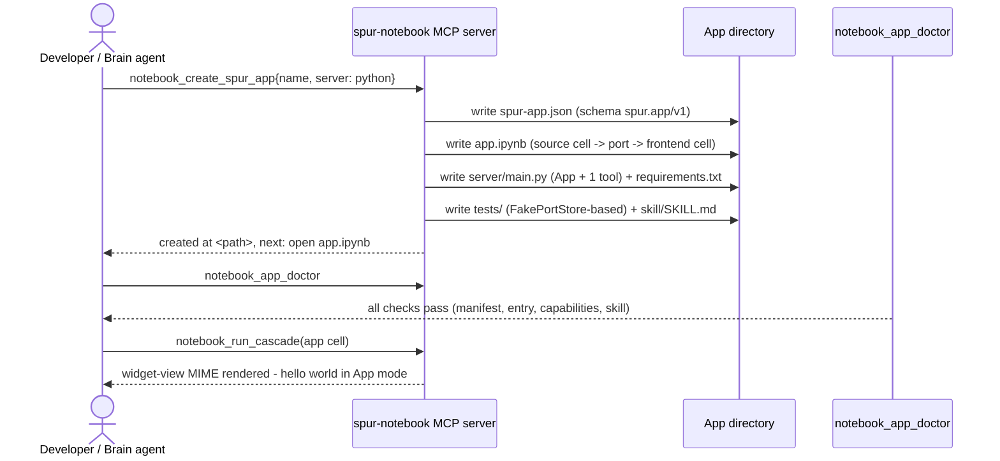
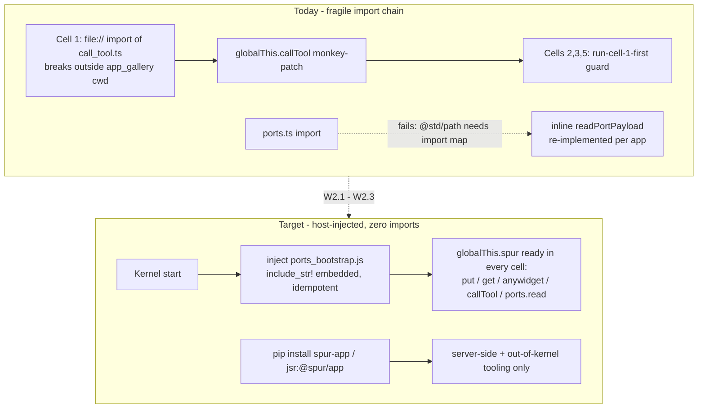
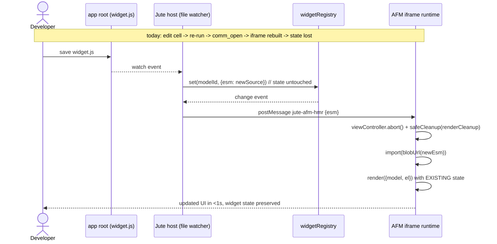
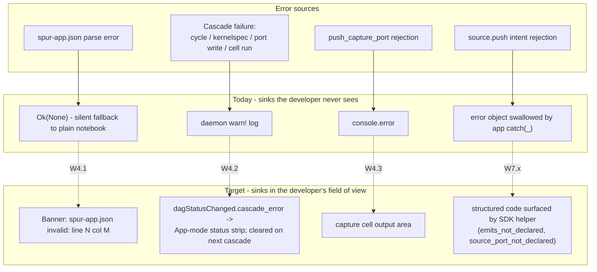
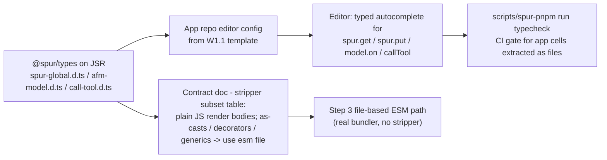
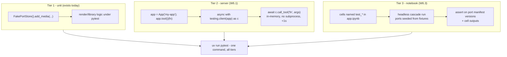
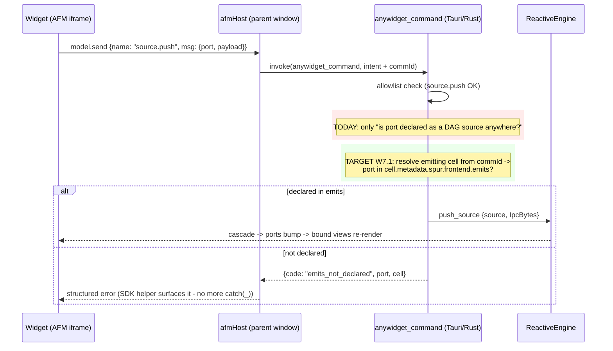
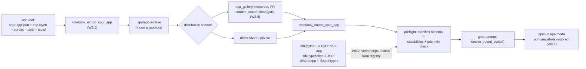

# Spur App SDK — DX Benchmark & Journey Curation

**Date:** 2026-06-11
**Status:** Approved working document (drives SDK open-sourcing + host DX work items)
**Provenance:** Synthesized from (a) a full audit of `app_gallery/html_video` (the pilot app), the
core app-container integration in `crates/spur-notebook`, and the four kernel bootstraps; and
(b) primary-source research (June 2026) on anywidget, marimo, Streamlit components v2, Raycast
extensions, VS Code extensions, Figma plugins, and the MCP SDK/Inspector/registry ecosystem.
Source links in the appendix.

---

## 1. Headline findings

1. **Every layer of the Spur App architecture has a named, validated open-source analog.**
   Figma's sandbox+iframe+postMessage is our AFM widget model. marimo's reactive DAG is our
   ports/cascade model. FastMCP is our app-server model. Nothing in the design is exotic —
   the gap is journey tooling, not architecture.
2. **Spur is already top-tier on two dimensions the field neglects:** first-party test fakes
   (`spur_app.testing.FakePortStore`) and a manifest capability block with strict validation
   (`deny_unknown_fields`). anywidget, Figma, Raycast, and Streamlit ship *no* first-party test
   harness; Raycast and VS Code have *no* runtime permission model at all.
3. **Spur is bottom-of-field on the three dimensions that dominate perceived DX:**
   time-to-hello-world (no scaffold; monorepo-relative `file://` imports), iteration loop
   (no HMR — anywidget does HMR over the same kind of comm channel we already own), and error
   surfacing (silent daemon `warn!` vs Raycast's streamed dev logs + production error dashboard).
4. **Positioning, not apology:** one-way widget state + ports-as-state is the same model marimo
   ships proudly ("the notebook is the app; reactivity is the event loop"). The public contract
   doc should open with that claim, then state the constraints.

## 2. Benchmark matrix

◎ best-in-class ○ adequate △ friction ✗ absent/painful

| Dimension | anywidget | marimo | Streamlit v2 | Raycast | VS Code | Figma | FastMCP | **Spur today** |
|---|---|---|---|---|---|---|---|---|
| Hello-world | ◎ 15 lines, no build | ◎ 2 steps | ○ 5–7 steps, 2 terminals | ◎ in-app scaffold | ○ `yo code` + F5 | ○ 7 GUI steps | ◎ 8 lines | ✗ no scaffold, relative paths |
| Iteration loop | ◎ HMR via kernel comm | ◎ reactive always-on | △ Vite + manual refresh | ◎ hot-deploy | ✗ manual reload | ○ opt-in hot reload | △ rebuild + reconnect | ✗ re-run cells, no HMR |
| Typed API | ○ | ○ | ○ | ◎ bundled types | ◎ `vscode.d.ts` | ◎ `plugin-typings` | ◎ types→schema | ✗ `spur` untyped, `as any` |
| Manifest/permissions | n/a | n/a | n/a | ✗ policy gate only | △ negative-only | ◎ `networkAccess`+`reasoning` | n/a | ○ capabilities, `emits` unenforced |
| Debugging | △ browser console | ○ inline errors | △ DevTools | ◎ logs + dashboard | ◎ F5 debugger | ○ console + Dev VM | ○ Inspector | ✗ daemon `warn!` only |
| Testing | ✗ | ◎ pytest-on-cells | ✗ Python-only | ✗ | ◎ `@vscode/test-cli` | ✗ | ◎ in-memory `Client(server)` | ○ `FakePortStore`, no widget harness |
| Distribution | ◎ plain wheel | ◎ WASM export | ○ wheel | ○ curated monorepo PR | ◎ `vsce publish` | △ opaque review | ◎ registry + `server.json` | ✗ packer unfinished, SDK unpublished |
| Version handshake | ✗ implicit | n/a | ✗ v1→v2 rewrite | ○ min-version | ○ `engines.vscode` | ○ `api` field | ◎ date-based negotiation | ✗ none |

---

## 3. The nine journey steps

Each step: today's friction (with evidence) → target DX → donor evidence → work items → flow diagram.

### Step 1 — Scaffold

**Today.** There is no scaffolder. `app_gallery/html_video` was assembled by hand: a hand-written
`spur-app.json`, a `conftest.py` whose only job is a `sys.path` hack so `import server.render`
resolves, and a skill file that once referenced a phantom MCP tool (`notebook_get_cell_capture`,
fixed in `42745e455`). A second app starts by copying the first and hunting down everything that
is html_video-specific.

**Target.** One in-host action produces a runnable, doctor-clean app skeleton: manifest, entry
notebook with one source cell + one frontend cell wired through a port, `server/main.py` with one
registered tool, test scaffolding using `FakePortStore`, and the app-local skill stub.

**Donor evidence.** Raycast's scaffolder lives *inside the host* ("Create Extension" command →
project on disk → `npm run dev`); Figma's "New plugin" flow is the same shape. For Spur the host
is agent-driven, so the scaffolder is an MCP tool — which means the brain agent can scaffold apps
conversationally, a strictly better version of the donor pattern.

**Work items.**
- W1.1 `notebook_create_spur_app` MCP tool (template embedded in the host, parameterized by
  app name / server language).
- W1.2 Template passes `notebook_app_doctor` checks 1–7 out of the box.



### Step 2 — First run (kill the import boilerplate)

**Today.** Cell 1 of html_video reads:
`const { callTool } = await import("file://${Deno.cwd()}/../../sdk/typescript/src/call_tool.ts")`
with `// TODO(U7)` and then `(globalThis as any).callTool = callTool` — and every later cell
guards with *"Run the SDK-client cell (cell 1) before this cell."* `sdk/typescript/src/ports.ts`
**cannot** be imported in the kernel at all (`@std/path` needs an import map the Deno Jupyter
kernel doesn't provide — confirmed by deno eval probe, per the notebook's own comment), so the
app re-implements port reading inline. `server/requirements.txt` depends on `../../sdk/python`.

**Target.** The host injects the cell-side SDK exactly like it already injects `spur`
(`ports_bootstrap.*` is `include_str!`-embedded and injected at kernel start — the pattern is
proven, idempotent, in four languages). `spur.callTool(...)` and `spur.ports.read(...)` exist in
every app cell with zero imports. The installable SDK remains for the *server* side
(`pip install spur-app`) and for out-of-kernel tooling.

**Donor evidence.** anywidget's most-loved property: hello-world has *no build step and no dev
server* because the host (kernel) already provides the channel. Injection also dissolves the
`@std/path` import-map problem structurally — injected code needs no imports.

**Work items.**
- W2.1 Extend the JS bootstrap with `spur.callTool` (wraps the `anywidget_command` /
  MCP plugin path) and `spur.ports.read`.
- W2.2 Publish `spur-app` to PyPI and `@spur/app` to JSR from CI (closes `TODO(U7)`s).
- W2.3 Delete the `globalThis` pattern from the template + html_video.



### Step 3 — Iterate (widget HMR)

**Today.** Editing a widget means: edit cell source → re-run cell → `comm_open` → new model →
iframe `srcDoc` rebuilt → all browser-side state lost. There is no watch mode. (The #185
investigation this week mapped this plumbing precisely: `widgetRegistry.set` → `change` →
revision++ → `postModelUpdate` → iframe `updateState`.)

**Target.** An HMR path over the channel we already own: the host watches the widget's ESM
source; on change it posts a `jute-afm-hmr` message through the existing
`postModelUpdate`-style bridge; the iframe re-imports the module and re-invokes `render` with
the **existing model state**. No kernel re-run, no iframe reload, sub-second loop.

**Donor evidence.** anywidget: `ANYWIDGET_HMR=1` + `_esm = pathlib.Path("index.js")` +
`watchfiles`, pushed over the IPython comm channel — *"no separate dev server"*, model state
preserved, auto-disabled for production installs (files under `site-packages/`). The analog
gate for us: HMR only for apps opened from a writable app root, never for imported archives.

**Work items.**
- W3.1 `esm`-file support in the widget contract (state key or cell metadata pointing at a file
  in the app root) + host file watcher.
- W3.2 `jute-afm-hmr` message in `JuteAppOutput.tsx`'s srcDoc runtime: abort old view
  (`viewController`), re-import blob module, re-run `render` with current state.



### Step 4 — Debug (error surfacing) — *approved, in flight*

**Today.** Four silent failure modes:
- Malformed `spur-app.json` → `notebook_open_mode` returns `Ok(None)`
  (`jute-notebook/src-tauri/src/commands.rs:1767-1769`) — the notebook silently opens as a
  plain notebook.
- Cascade failure → `warn!(%error, "reactive source cascade failed")`
  (`crates/spur-notebook/src/dag/engine.rs:922-924`) — daemon log only; cycle /
  unsupported-kernelspec root causes never reach the UI.
- `push_capture_port` failure → `console.error` only (`OutputView.tsx:311`).
- The pilot app wraps `experimental.invoke("source.push", ...)` in `catch (_) {}` — the app
  author visibly didn't trust the channel.

**Target.** Manifest parse errors → dismissible banner ("spur-app.json is invalid: \<serde
message with line/col\>"). Cascade failures → `cascade_error` carried on the existing
`dagStatusChanged` snapshot (additive field — the snapshot is untyped JSON on the Rust side and
permissively parsed on the TS side), rendered in the App-mode status strip; cleared by the next
cascade's leading empty-status emit. The MCP Inspector documented as the supported dev loop for
app servers (`npx @modelcontextprotocol/inspector python server/main.py` works today).

**Donor evidence.** Raycast: dev logs stream to the terminal, `Raycast: Attach Debugger`,
and a *production* error dashboard (raycast.com/extension-issues) with stack traces and affected
user counts — observability is part of the SDK promise, with a ladder from dev to prod.
MCP Inspector: standalone UI to poke at tools without a host.

**Work items.**
- W4.1 `notebook_open_mode` returns `{open_info, manifest_error}`; frontend banner. *(approved)*
- W4.2 Engine publishes `cascade_error` in the dag-status snapshot; status-strip rendering.
  *(approved)*
- W4.3 Surface `push_capture_port` failures in the capture cell's output area.
- W4.4 Document the Inspector loop in `sdk/docs/dev-loop.md`.



### Step 5 — Typecheck (publish the types)

**Today.** App cells are written against `any`: `(globalThis as any).callTool`,
`render({ model, el, experimental }: any)`. The hand-rolled TypeScript stripper
(`_spurAnywidgetStripTypeScript`) silently produces broken JavaScript for `as` casts, postfix
`!`, decorators, and multiline generics — and the failure surfaces as red text inside the widget
iframe, not a kernel traceback. Untyped + fragile stripping is the worst combination: developers
write TS because nothing tells them not to, and the stripper eats it.

**Target.** A published `@spur/types` (or types bundled in `@spur/app`) covering: the injected
`spur` global (per-language surface), the AFM `model` (get/set/save_changes/on/off, the
documented one-way semantics), `callTool`, and the port-binding snapshot shape. The contract doc
states plainly: render bodies are **plain JS** (or pre-bundled ESM via the Step-3 file path) —
the stripper's supported subset is documented, not discovered.

**Donor evidence.** Figma ships `@figma/plugin-typings` as a dev-dependency + `typeRoots`
config — the global `figma` object becomes fully typed in any editor. Raycast bundles types in
`@raycast/api`. VS Code's single `vscode.d.ts` is the discoverability gold standard.

**Work items.**
- W5.1 Author `.d.ts` for `spur` global + AFM model + `callTool`; publish with the JSR package.
- W5.2 Template (`W1.1`) wires the types into the app's editor config.
- W5.3 Contract doc: stripper-supported syntax table; recommend file-based ESM for anything
  non-trivial.



### Step 6 — Test

**Today.** `FakePortStore` (293 lines: builder, context manager, pytest fixture, env patching)
is genuinely competitive — better than anywidget/Figma/Raycast/Streamlit, which ship nothing.
Gaps: no in-memory harness for the app's MCP server (html_video shells out with
`subprocess.run([sys.executable, "-c", "import main"])` as its "smoke test"), no widget/JS-side
harness, no notebook-cell test story, and the packaging test rolls its own zip packer
(`test_packaging.py:20-33`, `TODO(U4/U7)`).

**Target.** Three tiers, all first-party: (1) unit — `FakePortStore`, as today; (2) server —
in-memory client against the app's `spur_app.App` without spawning a process; (3) notebook —
pytest-style discovery of test cells in the app notebook, runnable headlessly against a cascade.

**Donor evidence.** FastMCP: `async with Client(server)` in-memory transport — the documented
pattern, with the documented caveat (open the client inside the test, not a fixture — event-loop
complications). marimo: cells named `test_*` are collected by pytest via static collection;
fixtures must live in the setup cell or `conftest.py`. VS Code's `@vscode/test-cli` shows the
value of scaffolding the harness into the template.

**Work items.**
- W6.1 `spur_app.testing.client(app)` — in-memory MCP client (mirror FastMCP's API + caveats).
- W6.2 Template ships a passing 3-tier test layout.
- W6.3 (later) test-cell discovery for app notebooks on the DAG runner.



### Step 7 — Declare (enforce the manifest)

**Today.** The intent allowlist is sound (`source.push` / `model-state.update` /
`model-state.custom`; everything else → `intent_not_allowlisted`,
`crates/spur-notebook/src/commands.rs:329-349`), and capabilities parse with
`deny_unknown_fields`. But `emits` is **advisory**: `handle_source_push_intent`
(`commands.rs:358`) only checks the port is declared as a DAG source *somewhere* in the
notebook — any widget can push to any declared port. Fine for first-party apps; untenable the
moment a third-party archive runs with `active_output_scripts`.

**Target.** `source.push` from a widget is checked against the *emitting cell's*
`spur.frontend.emits` list; violations return a structured `emits_not_declared` error that the
SDK surfaces (Step 4's W4.4 sink). Later: Figma-style `networkAccess`-shaped declarations for
app-server egress.

**Donor evidence.** Figma's manifest is the field's best capability model:
`networkAccess: { allowedDomains, reasoning, devAllowedDomains }`, `permissions[]`,
`capabilities[]` — and developers accept the gating because errors are explicit. Raycast and
VS Code demonstrate the alternative (no runtime permissions, pure policy/scan gates) — viable
only with mandatory review, which doesn't fit a local-first app platform running active scripts.

**Work items.**
- W7.1 Thread the emitting cell/model identity through the `source.push` intent; enforce
  against that cell's `emits`; new error code `emits_not_declared`.
- W7.2 `notebook_app_doctor` check: every `emits` entry has a matching DAG source declaration
  (catches the inverse mistake at build time).
- W7.3 (later, pre-third-party) `network` capability block in `spur-app.json` for the app
  server, Figma-shaped.



### Step 8 — Ship

**Today.** `notebook_export_spur_app` is absent from the test-accessible surface — the packaging
test hand-rolls a zip (`test_packaging.py:20-33`). Port snapshots are bundled on export but
restoration is explicitly unimplemented (`src/spur_app.rs:415`: *"port snapshots are bundled but
automatic restoration is not supported yet"*). The SDK itself is unpublished (Step 2). There is
no install/discovery story beyond "open the directory."

**Target.** `notebook_export_spur_app` produces a `.spurapp` archive; the import path runs
preflight (manifest validation — already structured in the MCP import path — plus grants);
the SDK packages live on PyPI/JSR; `app_gallery/` formalizes as the curated, Raycast-style
distribution channel for now; `spur-app.json` remains our `server.json` analog when a registry
becomes worth it.

**Donor evidence.** anywidget: distribution is *just a wheel* — no second registry. MCP
registry: `server.json` (metadata-only registry; packages stay on PyPI/npm; reverse-DNS
namespace verification; `runtimeHint: uvx/npx`) — adopt the shape before adopting the
infrastructure. Raycast: a curated open-source monorepo with PR review *is* a viable store at
small scale — that is exactly what `app_gallery/` already is. Figma's 20-day opaque review is
the anti-pattern: whatever the gate, make status visible.

**Work items.**
- W8.1 Finish `notebook_export_spur_app`; replace the hand-rolled packer in tests.
- W8.2 CI publish: `spur-app` → PyPI, `@spur/app` + `@spur/types` → JSR (with W2.2).
- W8.3 Port-snapshot restore on import (or remove bundling until it restores — don't ship a
  field that silently does nothing).
- W8.4 `app_gallery/` CONTRIBUTING: the curated-PR distribution channel, doctor-clean required.



### Step 9 — Evolve (version handshake)

**Today.** No handshake anywhere. The bootstrap has no self-version (the
`_SPUR_ANYWIDGET_SEMVER_VERSION = "~0.9.*"` constant is the anywidget *protocol* declaration,
not a bootstrap version). `runtime.jute_min` exists in the manifest but is not read on the
Tauri open path (`AppModeManifest` parses only `open_mode`/`entry_notebook`/`name`/
`capabilities`/`skill`). App↔host drift fails behaviorally, not loudly. This is anywidget's
documented weakness ("hosts can silently drift") reproduced exactly.

**Target.** Three cheap checks: (1) the injected bootstrap carries `spur.__bootstrap_version__`;
(2) app open enforces `runtime.jute_min` against the host version with an actionable banner;
(3) the SDK spec (`spur.app/v1`) gets a public changelog, and additive changes never break old
manifests (the permissive-parse discipline already practiced in `PortEntry`).

**Donor evidence.** MCP is the field's reference: date-based protocol versions, explicit
`initialize` negotiation (client proposes, server counters, disconnect on mismatch),
`MCP-Protocol-Version` header thereafter, documented backwards-compat default. Streamlit's
v1→v2 (a full rewrite, plus an unannounced `BidiComponentResult`→`ComponentResult` rename) is
the cautionary tale for casual breaking changes.

**Work items.**
- W9.1 Bootstrap self-version + host log line on inject; exposed to cells for diagnostics.
- W9.2 Enforce `runtime.jute_min` at open with a banner (reuses W4.1's surfacing).
- W9.3 `sdk/docs/versioning.md`: spec changelog + compatibility policy (additive within v1;
  breaking → `spur.app/v2` side-by-side, never in-place).

```mermaid
sequenceDiagram
    participant K as Kernel (any of 4 languages)
    participant H as Host (jute)
    participant M as spur-app.json
    participant UI as Frontend

    Note over H,K: kernel session start
    H->>K: inject ports_bootstrap (include_str!, idempotent)
    K-->>H: spur ready, __bootstrap_version__ = X.Y.Z
    H->>H: log + record per-slot bootstrap version (W9.1)

    Note over H,UI: app open
    H->>M: read manifest (schema spur.app/v1)
    alt jute_min <= host version
        H-->>UI: open_info {app, capabilities, skill}
    else host too old (W9.2)
        H-->>UI: banner: "HTML Video needs Jute >= 0.2; you have 0.1 - update to open in App mode"
        H-->>UI: fall back to plain notebook view
    end
    Note over M: spec evolution (W9.3): additive within v1;<br/>breaking change -> "spur.app/v2" accepted side-by-side
```

---

## 4. Sequencing

| Phase | Items | Rationale |
|---|---|---|
| **P0 — before app #2 starts** | W4.1, W4.2 *(approved, in flight)*; W2.1–W2.3; W4.4 | Kills the silent-failure debugging loop and all four classes of import boilerplate — the two worst benchmark scores. |
| **P1 — during app #2** | W1.1–W1.2; W5.1–W5.3; W6.1–W6.2; W7.1–W7.2; W4.3 | Scaffold + types + server test harness + emits enforcement: app #2 exercises each the week it lands. |
| **P2 — before third-party developers** | W8.1–W8.4; W9.1–W9.3; W3.1–W3.2; W7.3; W6.3 | Distribution, versioning discipline, and HMR: required for an ecosystem, not for the second first-party app. |

The contract document (`sdk/docs/`, approved separately) opens with the marimo-style positioning
("the notebook is the app; ports are the state; the cascade is the event loop") and absorbs the
constraint tables from Steps 5 and 7.

## Appendix — donor sources

- anywidget: anywidget.dev (getting-started, AFM spec, blog/anywidget-02), github.com/manzt/anywidget
- marimo: docs.marimo.io (api/inputs/anywidget, guides/testing/pytest, guides/exporting/webassembly_html), marimo.io/blog/anywidget
- Streamlit components v2: docs.streamlit.io (custom-components/components-v2, limitations), github.com/streamlit/component-template
- Raycast: developers.raycast.com (getting-started, manifest, debug-an-extension, publish-an-extension), raycast.com/blog/how-raycast-api-extensions-work, raycast.com/extension-issues
- VS Code: code.visualstudio.com/api (your-first-extension, extension-manifest, contribution-points, testing-extension, publishing-extension), issue microsoft/vscode#190917 (no hot reload)
- Figma: developers.figma.com/docs/plugins (how-plugins-run, manifest, creating-ui, debugging, api/typings), figma.com/blog/how-we-built-the-figma-plugin-system
- MCP: modelcontextprotocol.io (docs/tools/inspector, docs/tools/debugging, specification changelog, registry/about), gofastmcp.com (servers/tools, development/tests), jlowin.dev/blog/fastmcp-3-launch
