# SPUR Brain-Worker Collaboration: End-to-End User Journey

## Table of Contents

1. [Architecture Overview](#architecture-overview)
2. [Journey 1: Ad-Hoc Task (spur run)](#journey-1-ad-hoc-task)
3. [Journey 2: Interactive Session (spur watch)](#journey-2-interactive-session)
4. [Journey 3: Plan-Based Delegation (submit_plan)](#journey-3-plan-based-delegation)
5. [Journey 4: Failure Recovery](#journey-4-failure-recovery)
6. [TUI Wireframes](#tui-wireframes)
7. [Tool Surface Map](#tool-surface-map)

---

## Architecture Overview

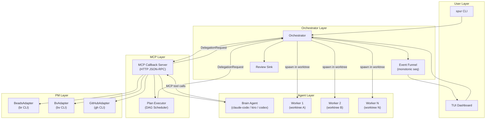

### Separation of Concerns

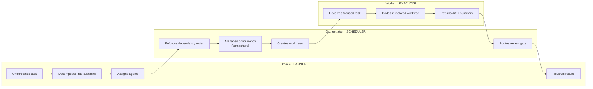

---

## Journey 1: Ad-Hoc Task

**Command:** `spur run "implement JWT auth"`

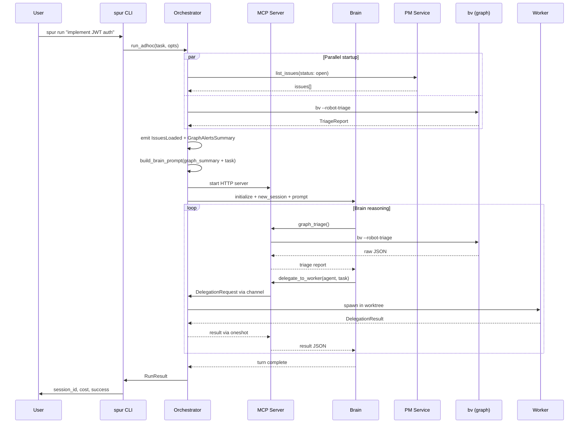

---

## Journey 2: Interactive Session

**Command:** `spur watch`

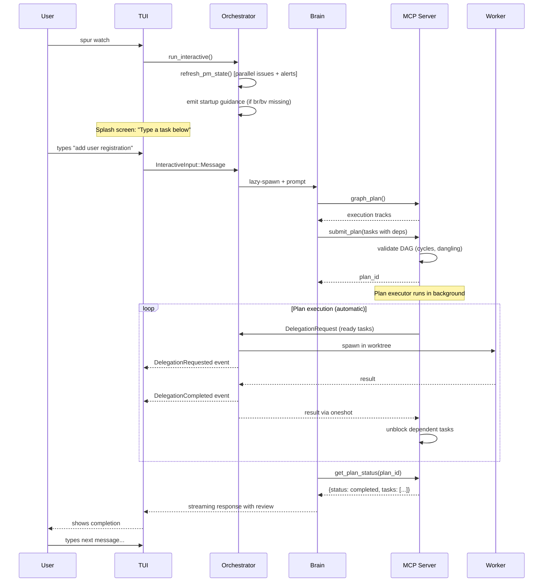

---

## Journey 3: Plan-Based Delegation

**The deterministic workflow: brain plans, orchestrator schedules, workers execute.**

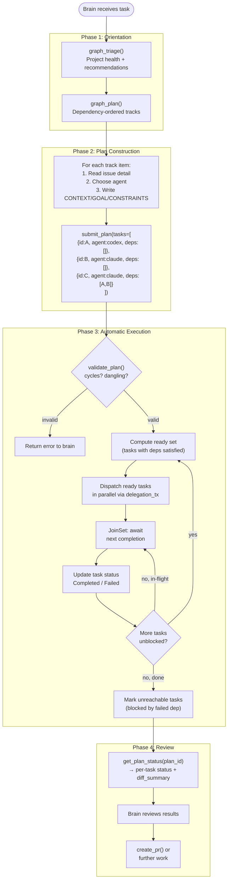

### Plan Execution Timeline (Diamond Dependency)

```mermaid
gantt
    title Plan: A,B independent → C depends on A+B → D depends on C
    dateFormat X
    axisFormat %s

    section Track 1 (parallel)
    Task A (codex)      :a, 0, 5
    Task B (claude)     :b, 0, 8

    section Track 2 (after A+B)
    Task C (claude)     :c, after b, 6

    section Track 3 (after C)
    Task D (claude)     :d, after c, 4

    section Milestones
    A completes         :milestone, 5, 0
    B completes         :milestone, 8, 0
    C ready (unblocked) :milestone, 8, 0
    Plan complete       :milestone, 18, 0
```

---

## Journey 4: Failure Recovery

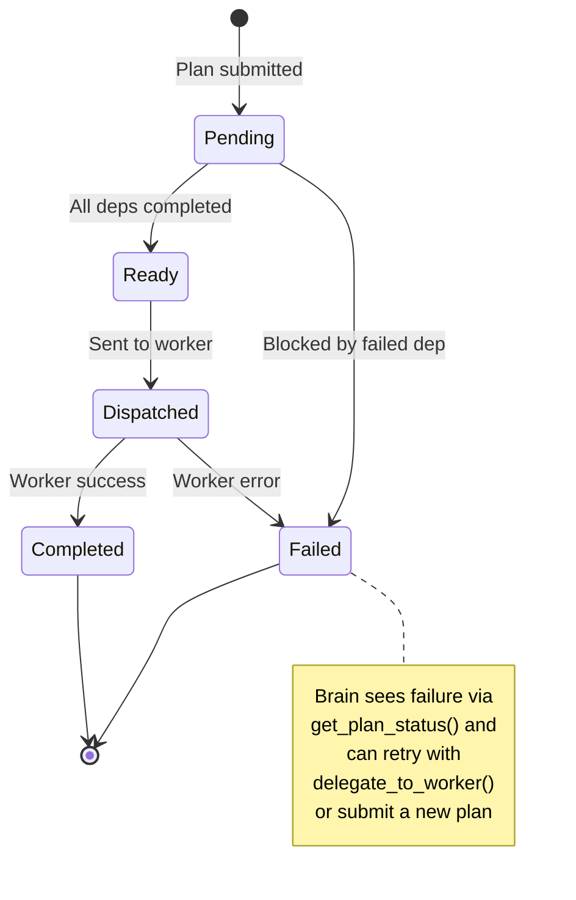

### Failure Propagation Example

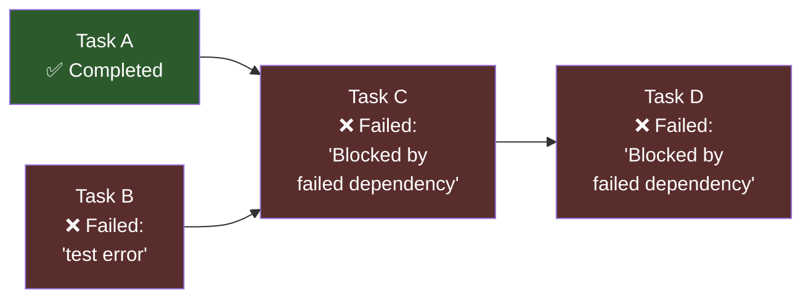

**get_plan_status response:**
```json
{
  "plan_id": "abc-123",
  "status": "partial",
  "progress": "1/4 completed, 0 running, 0 pending, 3 failed",
  "tasks": [
    {"task_id": "A", "agent": "codex",  "status": "completed", "summary": "JWT module done"},
    {"task_id": "B", "agent": "claude", "status": "failed",    "error": "test compilation error"},
    {"task_id": "C", "agent": "claude", "status": "failed",    "error": "Blocked by failed dependency"},
    {"task_id": "D", "agent": "claude", "status": "failed",    "error": "Blocked by failed dependency"}
  ]
}
```

---

## TUI Wireframes

### State 1: Startup — Splash Screen

```
┌──────────────────────────────────────────────────────────────────────┐
│                                                                      │
│                                                                      │
│                              SPUR                                    │
│                                                                      │
│                    Multi-agent orchestrator                           │
│                                                                      │
│                   Type a task below to start                         │
│                                                                      │
│                   Press [s] to browse sessions                       │
│                                                                      │
│                                                                      │
├──────────────────────────────────────────────────────────────────────┤
│ > _                                                                  │
├──────────────────────────────────────────────────────────────────────┤
│ [i]nput [Enter]focus [s]essions [?]help [q]uit                       │
│                          12 issues · 2 alerts · 0 running · $0.00   │
└──────────────────────────────────────────────────────────────────────┘
```

### State 2: Brain Thinking — Tool Calls Visible

```
┌─ Lineage ───────────────────────────────────────────────────────────┐
│  ▼ brain:claude-code [sess-a1b2]                                    │
│    ├─ ⟳ Running (12s)                                               │
│    │   ├─ graph_triage ✓                                            │
│    │   ├─ graph_plan ✓                                              │
│    │   └─ submit_plan → plan-xyz (4 tasks)                          │
├─ Issues (12 open) ──────────────────────────────────────────────────┤
│  ◆ ISS-1  P0  Implement JWT auth module                            │
│  ◆ ISS-2  P1  Add users table migration                            │
│  ◆ ISS-3  P1  Wire up login endpoint                    blocked    │
│  ◆ ISS-4  P2  Add e2e auth tests                        blocked    │
├─ Activity ──────────────────────────────────────────────────────────┤
│  11:02:31 [brain] Analyzing project graph...                        │
│  11:02:32 [brain] Graph triage: 12 open, 8 actionable, 2 blocked   │
│  11:02:33 [brain] Execution plan: 3 tracks, 4 tasks                │
│  11:02:34 [brain] Submitting plan with dependency ordering...       │
│  11:02:34 [spur]  Plan submitted: 4 tasks (plan-xyz)               │
├──────────────────────────────────────────────────────────────────────┤
│ > _                                                                  │
├──────────────────────────────────────────────────────────────────────┤
│ [i]nput [r]eview [?]help    12 issues · 2 alerts · 1 running · $0.12│
└──────────────────────────────────────────────────────────────────────┘
```

### State 3: Plan Executing — Workers in Parallel

```
┌─ Lineage ───────────────────────────────────────────────────────────┐
│  ▼ brain:claude-code [sess-a1b2]                                    │
│    ├─ ✓ Completed turn (submitted plan)                             │
│    ├─ ▶ worker:codex [ISS-1] ⟳ Running (45s)                       │
│    │   └─ worktree: .worktrees/deleg-001                            │
│    ├─ ▶ worker:claude-code [ISS-2] ⟳ Running (42s)                 │
│    │   └─ worktree: .worktrees/deleg-002                            │
│    ├─ ◻ worker:claude-code [ISS-3] ⏳ Pending (blocked by 1,2)     │
│    └─ ◻ worker:claude-code [ISS-4] ⏳ Pending (blocked by 3)       │
├─ Issues (12 open) ──────────────────────────────────────────────────┤
│  ◆ ISS-1  P0  Implement JWT auth module              in_progress   │
│  ◆ ISS-2  P1  Add users table migration              in_progress   │
│  ◆ ISS-3  P1  Wire up login endpoint                    blocked    │
│  ◆ ISS-4  P2  Add e2e auth tests                        blocked    │
├─ Activity ──────────────────────────────────────────────────────────┤
│  11:02:35 [deleg] Dispatched ISS-1 → codex (worktree deleg-001)    │
│  11:02:35 [deleg] Dispatched ISS-2 → claude-code (deleg-002)       │
│  11:02:36 [deleg] Claimed ISS-1 → status: in_progress              │
│  11:02:36 [deleg] Claimed ISS-2 → status: in_progress              │
│  11:03:15 [codex] ISS-1: Implementing JWT signing and verification │
│  11:03:18 [claude] ISS-2: Creating users migration with bcrypt...  │
├──────────────────────────────────────────────────────────────────────┤
│ > _                                                                  │
├──────────────────────────────────────────────────────────────────────┤
│ [i]nput [r]eview [?]help    12 issues · 2 alerts · 2 running · $0.45│
└──────────────────────────────────────────────────────────────────────┘
```

### State 4: Dependency Unblocking — ISS-3 Starts After ISS-1+2

```
┌─ Lineage ───────────────────────────────────────────────────────────┐
│  ▼ brain:claude-code [sess-a1b2]                                    │
│    ├─ ✓ Completed turn                                              │
│    ├─ ✓ worker:codex [ISS-1] ✓ Completed (2m 10s) +3/-0 1 file    │
│    ├─ ✓ worker:claude-code [ISS-2] ✓ Completed (2m 30s) +42/-0    │
│    ├─ ▶ worker:claude-code [ISS-3] ⟳ Running (15s)                 │
│    │   └─ worktree: .worktrees/deleg-003                            │
│    └─ ◻ worker:claude-code [ISS-4] ⏳ Pending (blocked by 3)       │
├─ Issues (12 open) ──────────────────────────────────────────────────┤
│  ◆ ISS-1  P0  Implement JWT auth module                  open      │
│  ◆ ISS-2  P1  Add users table migration                  open      │
│  ◆ ISS-3  P1  Wire up login endpoint                 in_progress   │
│  ◆ ISS-4  P2  Add e2e auth tests                        blocked    │
├─ Activity ──────────────────────────────────────────────────────────┤
│  11:04:45 [deleg] ISS-1 completed: JWT implementation done         │
│  11:05:05 [deleg] ISS-2 completed: Users table + bcrypt migration  │
│  11:05:06 [spur]  ISS-3 unblocked (deps ISS-1, ISS-2 satisfied)   │
│  11:05:06 [deleg] Dispatched ISS-3 → claude-code (deleg-003)       │
│  11:05:07 [deleg] Claimed ISS-3 → status: in_progress              │
│  11:05:20 [claude] ISS-3: Wiring JWT middleware into login route...│
├──────────────────────────────────────────────────────────────────────┤
│ > _                                                                  │
├──────────────────────────────────────────────────────────────────────┤
│ [i]nput [r]eview [?]help    12 issues · 0 alerts · 1 running · $1.23│
└──────────────────────────────────────────────────────────────────────┘
```

### State 5: Plan Complete — Brain Reviews

```
┌─ Lineage ───────────────────────────────────────────────────────────┐
│  ▼ brain:claude-code [sess-a1b2]                                    │
│    ├─ ⟳ Running (reviewing plan results...)                         │
│    ├─ ✓ worker:codex [ISS-1] ✓ Completed +3/-0 1 file             │
│    ├─ ✓ worker:claude-code [ISS-2] ✓ Completed +42/-0 3 files     │
│    ├─ ✓ worker:claude-code [ISS-3] ✓ Completed +28/-2 2 files     │
│    └─ ✓ worker:claude-code [ISS-4] ✓ Completed +65/-0 4 files     │
├─ Issues (12 open) ──────────────────────────────────────────────────┤
│  ◆ ISS-1  P0  Implement JWT auth module                  open      │
│  ◆ ISS-2  P1  Add users table migration                  open      │
│  ◆ ISS-3  P1  Wire up login endpoint                     open      │
│  ◆ ISS-4  P2  Add e2e auth tests                         open      │
├─ Activity ──────────────────────────────────────────────────────────┤
│  11:08:12 [deleg] ISS-4 completed: 65 lines of e2e tests added    │
│  11:08:12 [spur]  Plan plan-xyz complete: 4/4 tasks succeeded      │
│  11:08:13 [brain] Reviewing all worker results...                  │
│  11:08:15 [brain] All 4 tasks completed successfully.              │
│  11:08:16 [brain] Creating pull request...                         │
│  11:08:18 [brain] PR created: github.com/org/repo/pull/42          │
├──────────────────────────────────────────────────────────────────────┤
│ > _                                                                  │
├──────────────────────────────────────────────────────────────────────┤
│ [i]nput [r]eview [?]help    12 issues · 0 alerts · 0 running · $2.15│
└──────────────────────────────────────────────────────────────────────┘
```

### State 6: Partial Failure — Brain Sees Failed Tasks

```
┌─ Lineage ───────────────────────────────────────────────────────────┐
│  ▼ brain:claude-code [sess-a1b2]                                    │
│    ├─ ⟳ Running (handling failure...)                               │
│    ├─ ✓ worker:codex [ISS-1] ✓ Completed +3/-0 1 file             │
│    ├─ ✗ worker:claude-code [ISS-2] ✗ Failed: "test compile error" │
│    ├─ ✗ [ISS-3] Blocked by failed dependency (ISS-2)               │
│    └─ ✗ [ISS-4] Blocked by failed dependency (ISS-3)               │
├─ Issues (12 open) ──────────────────────────────────────────────────┤
│  ◆ ISS-1  P0  Implement JWT auth module                  open      │
│  ◆ ISS-2  P1  Add users table migration                  open      │
│  ◆ ISS-3  P1  Wire up login endpoint                    blocked    │
│  ◆ ISS-4  P2  Add e2e auth tests                        blocked    │
├─ Activity ──────────────────────────────────────────────────────────┤
│  11:06:30 [deleg] ISS-2 FAILED: test compile error                 │
│  11:06:30 [spur]  Plan plan-xyz: ISS-3 blocked by failed dep      │
│  11:06:30 [spur]  Plan plan-xyz: ISS-4 blocked by failed dep      │
│  11:06:31 [brain] ISS-2 failed. Retrying with constraints...      │
│  11:06:32 [brain] delegate_to_worker(claude-code, "Fix ISS-2...")  │
│  11:06:33 [deleg] Dispatched ISS-2-retry → claude-code (deleg-005)│
├──────────────────────────────────────────────────────────────────────┤
│ > _                                                                  │
├──────────────────────────────────────────────────────────────────────┤
│ [i]nput [r]eview [?]help    12 issues · 1 alerts · 1 running · $1.80│
└──────────────────────────────────────────────────────────────────────┘
```

### State 7: Missing Dependencies — Startup Guidance

```
┌──────────────────────────────────────────────────────────────────────┐
│                                                                      │
│                              SPUR                                    │
│                                                                      │
│                    Multi-agent orchestrator                           │
│                                                                      │
│                   Type a task below to start                         │
│                                                                      │
│                   Press [s] to browse sessions                       │
│                                                                      │
├─ Issues ────────────────────────────────────────────────────────────┤
├──────────────────────────────────────────────────────────────────────┤
│ > _                                                                  │
├──────────────────────────────────────────────────────────────────────┤
│ [i]nput [Enter]focus [s]essions [?]help    8 issues · 0 running     │
└──────────────────────────────────────────────────────────────────────┘
```

---

## Tool Surface Map

### By Category

```
┌─────────────────────────────────────────────────────────────────────┐
│                        MCP Tool Surface (20 tools)                  │
├─────────────────────────────────────────────────────────────────────┤
│                                                                     │
│  PLAN-BASED DELEGATION (deterministic)                              │
│  ┌─────────────────┐    ┌──────────────────┐                       │
│  │  submit_plan    │───▶│ get_plan_status   │                       │
│  │  DAG of tasks   │    │ poll progress     │                       │
│  └─────────────────┘    └──────────────────┘                       │
│                                                                     │
│  AD-HOC DELEGATION (brain-driven)                                   │
│  ┌──────────────────┐  ┌──────────────────┐  ┌──────────────────┐  │
│  │delegate_to_worker│  │delegate_parallel │  │ delegate_async   │  │
│  │ blocking, single │  │ blocking, batch  │  │ non-blocking     │  │
│  └──────────────────┘  └──────────────────┘  └────────┬─────────┘  │
│                                                        │            │
│  ┌──────────────────┐  ┌──────────────────┐  ┌────────▼─────────┐  │
│  │cancel_delegation │  │check_deleg_status│  │ wait_delegation  │  │
│  └──────────────────┘  └──────────────────┘  └──────────────────┘  │
│                                                                     │
│  GRAPH ANALYSIS (bv)              PROJECT MANAGEMENT (br/gh)        │
│  ┌───────────────┐               ┌──────────────┐                  │
│  │ graph_triage  │──orientation  │ list_issues   │──CRUD           │
│  │ graph_plan    │──tracks       │ get_issue     │                  │
│  │ graph_insights│──deep metrics │ update_issue  │                  │
│  │ graph_alerts  │──monitoring   │ create_pr     │                  │
│  │ graph_subgraph│──deps for ID  └──────────────┘                  │
│  └───────────────┘                                                  │
│                                                                     │
│  UTILITY                                                            │
│  ┌────────────────────┐  ┌────────────────┐  ┌─────────────────┐   │
│  │list_available_     │  │report_progress │  │get_session_cost │   │
│  │       workers      │  │ fire-and-forget│  │                 │   │
│  └────────────────────┘  └────────────────┘  └─────────────────┘   │
│                                                                     │
└─────────────────────────────────────────────────────────────────────┘
```

### Decision Flow: Which Delegation Tool?

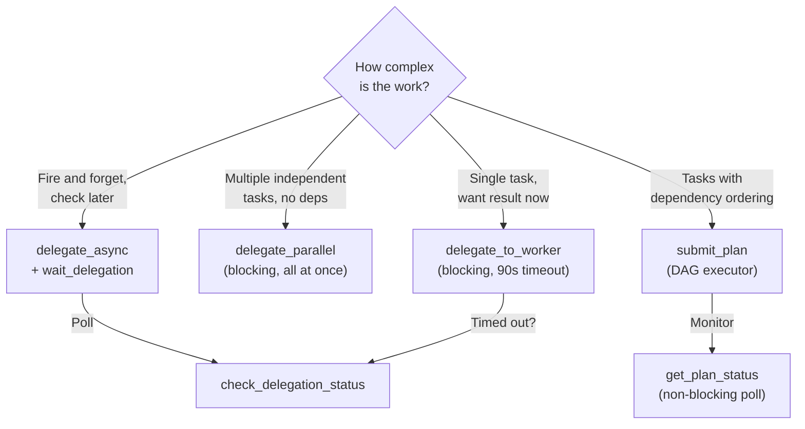

### Optimal Brain Workflow

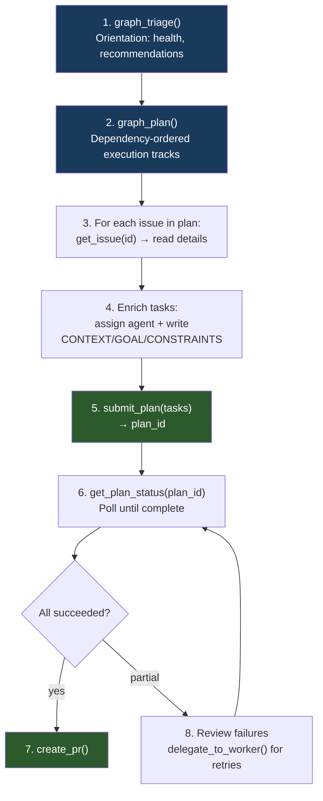

---

## Data Flow: Event Bus

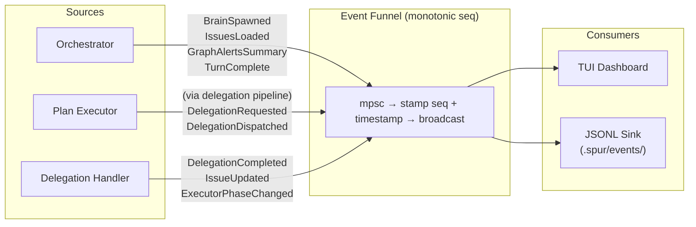
