# spur-core Deep Architecture

> Reviewed 2026-04-16. Covers `crates/spur-core/src/` — ~12,000 lines of Rust.

## Table of Contents

1. [Architectural Identity](#1-architectural-identity)
2. [Module Map](#2-module-map)
3. [Subsystem Decomposition](#3-subsystem-decomposition)
4. [Event Pipeline](#4-event-pipeline)
5. [Lineage Projection](#5-lineage-projection)
6. [Brain Lifecycle](#6-brain-lifecycle)
7. [Delegation Dispatch](#7-delegation-dispatch)
8. [Review Coordination](#8-review-coordination)
9. [Notification Flow](#9-notification-flow)
10. [Concurrency Model](#10-concurrency-model)
11. [Orchestrator God Object Analysis](#11-orchestrator-god-object-analysis)
12. [Architectural Assessment](#12-architectural-assessment)

---

## 1. Architectural Identity

spur-core implements a **Supervisor + Event Sourcing + Actor-lite** pattern:

| Pattern | Manifestation |
|---|---|
| **Supervisor** | Orchestrator manages brain/worker lifecycles with restart policies and circuit breakers |
| **Event Sourcing** | All state changes are events; ExecutorLineage is a pure projection of the event stream |
| **Actor-lite** | Delegation tasks are independent actors communicating via channels (no mailbox, no supervision tree) |
| **CQRS** | Commands flow inward (mpsc); queries are projections of the broadcast event stream |

The fundamental abstraction is:

```
Task → Brain → [Worker₁..Workerₙ] → Review Gate → Merge/Reject
```

Three axioms govern the design:

1. **Single serialization point** — ALL events flow through the EventFunnel (one mpsc → one stamper → one broadcast). This guarantees total ordering.
2. **Dual-channel protocol** — ACP (outbound: SPUR→Agent) for execution control; MCP (inbound: Agent→SPUR) for brain autonomy. The brain decides WHAT; SPUR decides HOW.
3. **Replay-purity** — The system's state at seq N is a pure function of events [0..N]. No `SystemTime::now()` in projections. No HashMap iteration order dependency.

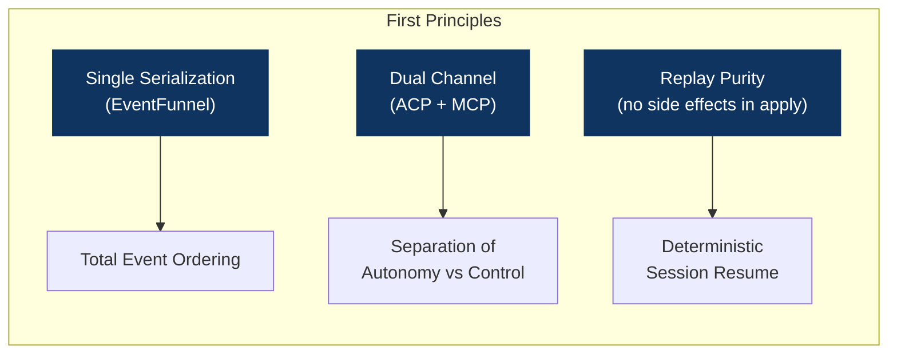

---

## 2. Module Map

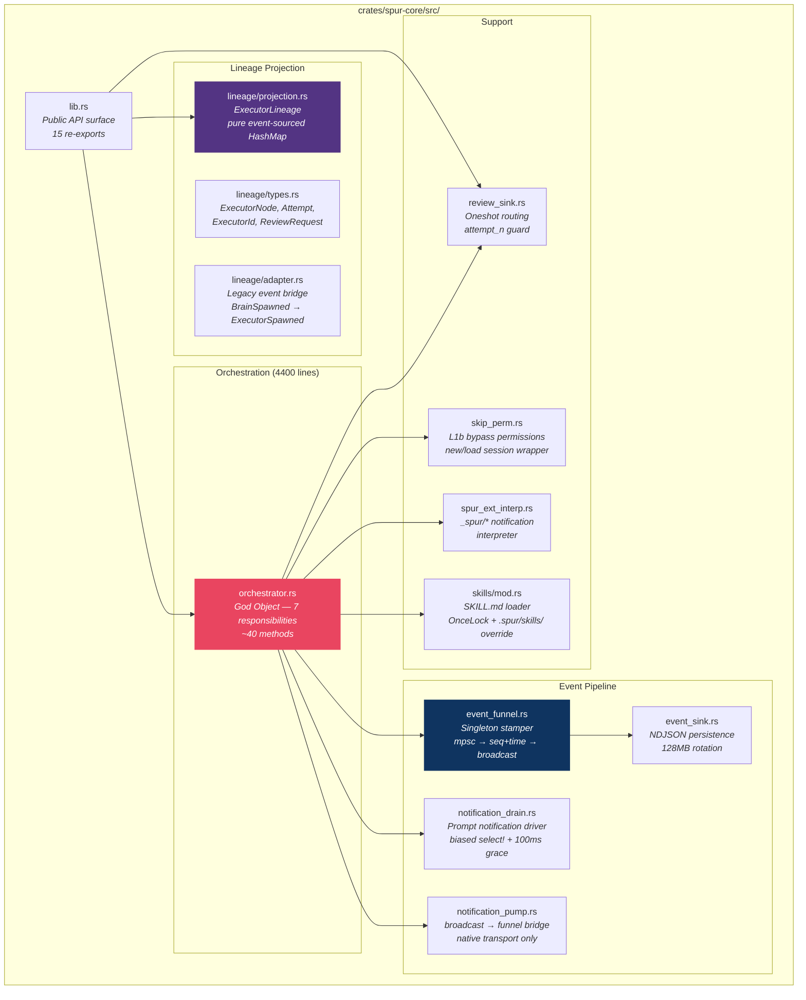

| Module | Lines | Responsibility |
|---|---|---|
| `orchestrator.rs` | ~4,400 | Brain lifecycle, delegation dispatch, review coordination, prompt construction, PM ops, interactive loop |
| `lineage/projection.rs` | ~420 | Pure event-sourced executor state projection |
| `lineage/adapter.rs` | ~220 | Legacy event → executor event bridge |
| `lineage/types.rs` | ~140 | ExecutorNode, Attempt, ExecutorId, ReviewRequest |
| `event_sink.rs` | ~190 | NDJSON durable event persistence with rotation |
| `notification_drain.rs` | ~150 | Prompt-scoped notification driver (stream + broadcast) |
| `event_funnel.rs` | ~100 | Singleton event stamper (seq + occurred_at) |
| `spur_ext_interp.rs` | ~150 | `_spur/*` ExtNotification → SpurEventBody translator |
| `skills/mod.rs` | ~130 | Bundled SKILL.md loader with per-project override |
| `review_sink.rs` | ~100 | Oneshot review decision routing |
| `skip_perm.rs` | ~100 | Permission bypass wrapper for session creation |
| `notification_pump.rs` | ~50 | Session broadcast → funnel bridge |
| `lib.rs` | ~20 | Public API re-exports |

---

## 3. Subsystem Decomposition

Seven natural subsystems exist within spur-core. Five are currently entangled inside the Orchestrator god object.

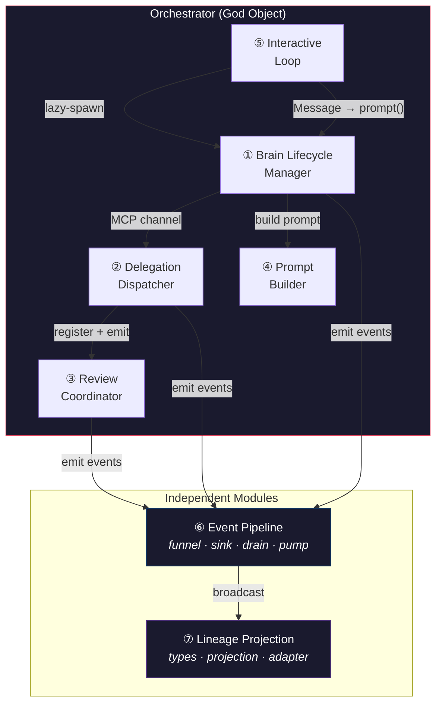

### Subsystem Details

| # | Subsystem | Location | Key Methods / Types | Shared State |
|---|---|---|---|---|
| ① | Brain Lifecycle | `orchestrator.rs` | `connect_brain`, `create_brain_session`, `load_brain_session`, `try_reconnect_brain`, `reconnect_with_events`, `retire_active_brain` | `BrainSession`, `AgentConnection` |
| ② | Delegation Dispatch | `orchestrator.rs` | `handle_delegations`, `execute_delegation`, `run_one_worker_attempt` | `Semaphore`, `DelegationGuard` |
| ③ | Review Coordination | `review_sink.rs` + inline in `execute_delegation` | `ReviewSink::register`, `ReviewSink::submit`, review `select!` loop | `Arc<Mutex<HashMap>>` |
| ④ | Prompt Builder | `orchestrator.rs` + `skills/` | `build_brain_prompt_v1`, `render_header`, `render_workers_block`, `load_skill` | `OnceLock` (skills cache) |
| ⑤ | Interactive Loop | `orchestrator.rs` | `run_interactive` — multi-turn `select!` over 8 `InteractiveInput` variants | `Option<BrainSession>`, `VecDeque<InteractiveInput>` |
| ⑥ | Event Pipeline | `event_funnel.rs`, `event_sink.rs`, `notification_drain.rs`, `notification_pump.rs` | `FunnelHandle`, `spawn_funnel`, `spawn_sink`, `drive_prompt_notifications`, `spawn_session_notification_pump` | `broadcast::Sender`, `AtomicU64` |
| ⑦ | Lineage Projection | `lineage/` | `ExecutorLineage::apply`, `apply_legacy`, `ExecutorNode`, `ExecutorId` | `HashMap<ExecutorId, ExecutorNode>` |

---

## 4. Event Pipeline

The event pipeline is the load-bearing infrastructure of spur-core. Every state change flows through it.

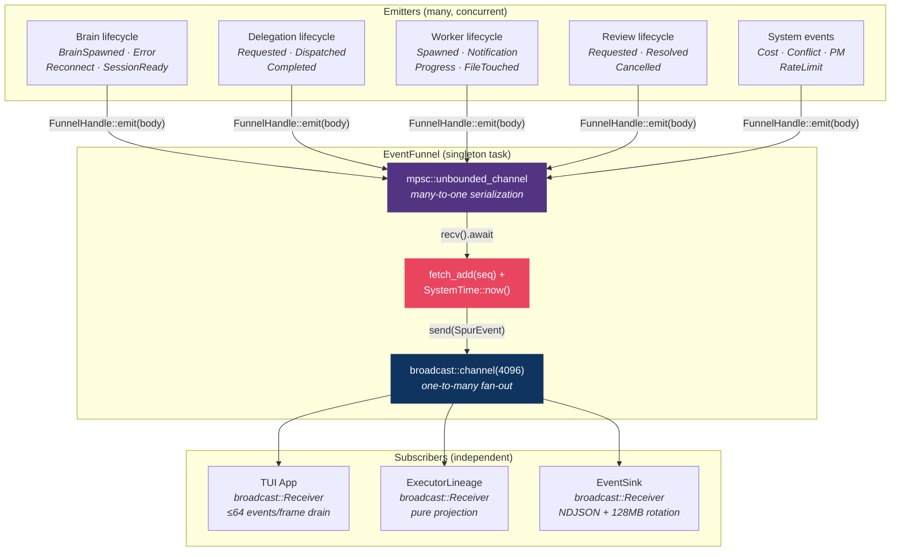

### Pipeline Stages

| Stage | Component | Mechanism | Invariant |
|---|---|---|---|
| **Emit** | `FunnelHandle::emit(body)` | `mpsc::UnboundedSender::send` | Non-blocking. Silently drops if funnel task terminated (shutdown). |
| **Serialize** | Funnel task | Single `tokio::spawn` reads mpsc | All events pass through one task — total ordering guaranteed. |
| **Stamp** | `AtomicU64::fetch_add` + `SystemTime::now()` | Monotonic seq. Wall-clock at serialization point. | Callers' `occurred_at` is discarded — funnel's timestamp is authoritative. |
| **Broadcast** | `broadcast::channel(4096)` | One-to-many fan-out | Slow subscribers get `RecvError::Lagged(n)` — logged, not fatal. |
| **Persist** | `EventSink` | `BufWriter<File>` + NDJSON | 64KB buffer, 100ms flush interval, 128MB rotation. Log-and-drop on write error. |

### SpurEventBody Variants (~25)

| Category | Variants |
|---|---|
| Brain | `BrainSpawned`, `BrainError`, `BrainFailover`, `BrainReconnecting`, `BrainReconnected`, `BrainReconnectFailed` |
| Session | `AgentSessionReady`, `SessionCompleted`, `TurnComplete`, `AgentNotification`, `AgentExtNotification`, `SessionsListed`, `SessionsListError`, `SessionHistory`, `AuthRequired` |
| Delegation | `DelegationRequested`, `DelegationDispatched`, `DelegationCompleted` |
| Executor | `ExecutorSpawned`, `ExecutorPhaseChanged`, `ExecutorRetryStarted`, `ExecutorArtifact` |
| Worker | `WorkerSpawned`, `WorkerNotification`, `WorkerProgress`, `WorkerFileTouched`, `WorkerHeartbeat` |
| Review | `ExecutorReviewRequested`, `ExecutorReviewResolved`, `ExecutorReviewCancelled` |
| System | `CostUpdate`, `ConflictDetected`, `RateLimitDetected`, `IssueReceived`, `PrCreated`, `IssueUpdated` |

---

## 5. Lineage Projection

ExecutorLineage is a pure event-sourced projection — the read model in CQRS terms.

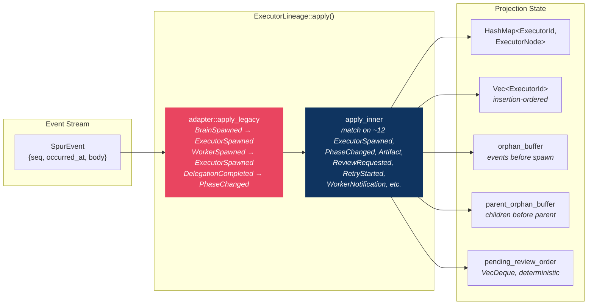

### ExecutorNode State Model

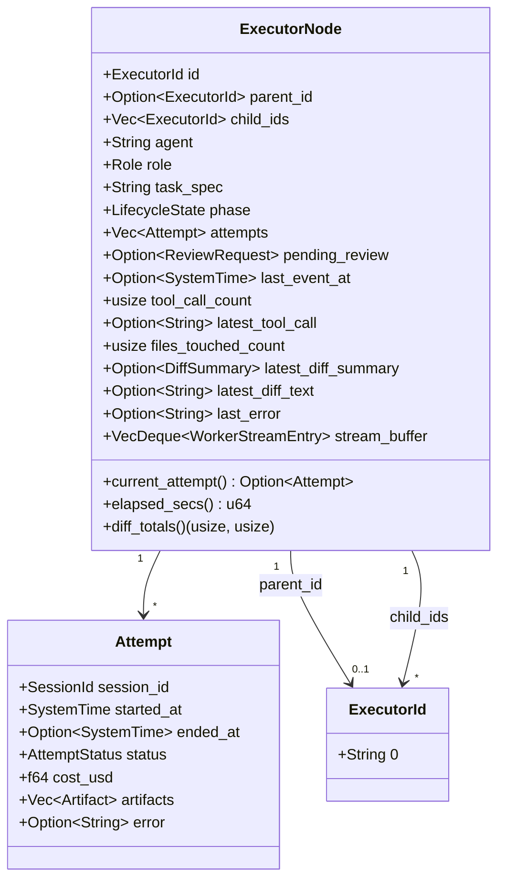

### Replay-Purity Invariant

Two rules enforce deterministic replay:

1. **No `SystemTime::now()` in `apply` or `apply_inner`** — all timestamps come from `event.occurred_at`.
2. **No HashMap iteration order dependency** — `pending_review_order` uses `VecDeque` for deterministic ordering; `roots` uses `Vec`.

### Orphan Buffering (Two-Level)

| Buffer | Key | Purpose | Cap |
|---|---|---|---|
| `orphan_buffer` | `ExecutorId` | Events arriving before `ExecutorSpawned` for that executor | 128 per executor |
| `parent_orphan_buffer` | parent `ExecutorId` | `ExecutorSpawned` events whose parent doesn't exist yet | 128 per parent |

Both buffers are drained (replayed via `apply_inner`) when the missing node arrives.

### Legacy Adapter Bridge

The adapter (`lineage/adapter.rs`) synthesizes executor-model events from legacy events:

| Legacy Event | Synthesized Behavior |
|---|---|
| `BrainSpawned` | Insert root `ExecutorNode` with `Role::Brain` |
| `WorkerSpawned` | Insert child `ExecutorNode` under most recent brain root |
| `DelegationRequested` | Populate `task_spec` on most recent empty-task executor matching agent |
| `DelegationCompleted` | Set terminal `phase` + `AttemptStatus` based on `DelegationStatus` variant |
| `SessionCompleted` | Set terminal phase (Succeeded/Failed) |
| `CostUpdate` | Accumulate `cost_usd` on current attempt |

---

## 6. Brain Lifecycle

The brain session has a complex lifecycle with lazy-spawn, reconnection, and circuit-breaker escalation.

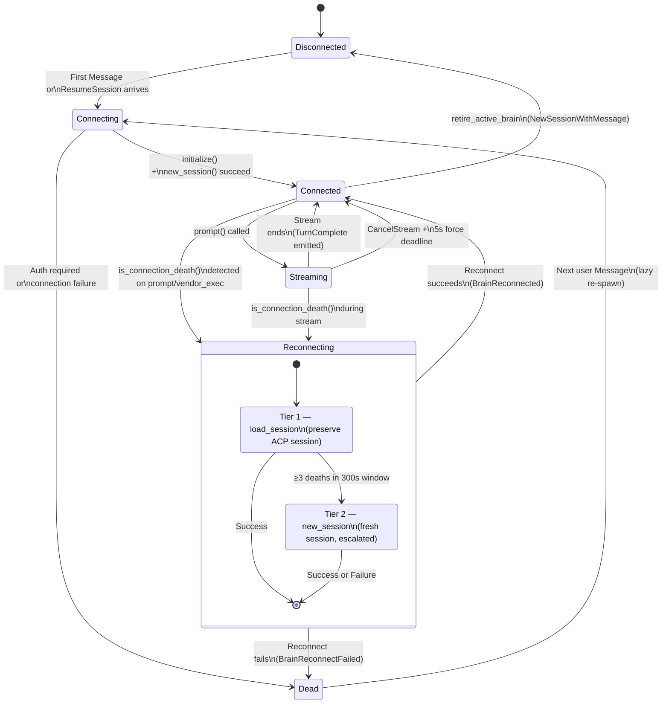

### Circuit Breaker

| Parameter | Value | Purpose |
|---|---|---|
| `RECONNECT_CIRCUIT_LIMIT` | 3 | Max deaths before escalation |
| `RECONNECT_CIRCUIT_WINDOW` | 300s | Sliding window for death counting |
| Tier 1 | `load_session` | Preserve ACP session state |
| Tier 2 | `new_session` | Fresh session (escalated after repeated failures) |
| Success (Tier 1) | Clears failure window | Reset circuit breaker |
| Success (Tier 2) | Keeps failure record | Quick re-death still trips |

### BrainSession Struct

```rust
pub struct BrainSession {
    pub connection: Box<dyn AgentConnection>,  // ACP transport
    pub acp_session_id: String,                // Agent-side session
    pub spur_session_id: SessionId,            // SPUR-side session (stable across reconnects)
    pub brain_name: String,
    pub delegation_handle: JoinHandle<()>,     // handle_delegations task
    pub mcp_handle: JoinHandle<()>,            // MCP callback HTTP server
    pub notification_pump_handle: Option<JoinHandle<()>>,  // Native transport only
}
```

On retire: all handles are `.abort()`ed, connection is `.shutdown().await`ed, and the initialized connection is optionally preserved in `agent_connection` for reuse.

---

## 7. Delegation Dispatch

Delegation is the core unit of work. Each delegation is a fully independent task with shared-nothing state.

```mermaid
stateDiagram-v2
    [*] --> Requested: Brain calls\ndelegate_to_worker (MCP)

    Requested --> SemaphoreWait: tokio::spawn +\nDelegationGuard armed

    SemaphoreWait --> WorktreeCreated: Semaphore permit acquired\n(max_concurrent gate)

    WorktreeCreated --> AgentInit: snapshot_brain_state +\ncreate_worktree

    AgentInit --> WorkerRunning: initialize() +\nnew_session_with_bypass()

    WorkerRunning --> WorkerDone: prompt completes\n(drive_prompt_notifications)
    WorkerRunning --> WorkerFailed: prompt error / timeout

    WorkerDone --> DiffCollect: collect_diff +\nbuild_diff_summary
    WorkerFailed --> DiffCollect

    DiffCollect --> AutoApproved: review_required = false
    DiffCollect --> ReviewGate: review_required = true

    state ReviewGate {
        [*] --> RegisterSink: register(eid, attempt_n)
        RegisterSink --> EmitRequested: emit ExecutorReviewRequested
        EmitRequested --> AwaitDecision: select! { rx, timeout }

        AwaitDecision --> Approved: User 'a'
        AwaitDecision --> Rejected: User 'd'
        AwaitDecision --> Modified: User 'm'
        AwaitDecision --> RetryDecision: User 'R'
        AwaitDecision --> TimedOut: review_timeout expires
    }

    AutoApproved --> CommitMerge
    Approved --> CommitMerge
    Modified --> CommitMerge

    Rejected --> PreserveWorktree
    TimedOut --> FallbackAction

    RetryDecision --> RetryCheck
    RetryCheck --> WorktreeCreated: attempt_n ≤ max_retries\n(backoff: 1s→2s→4s…30s cap)
    RetryCheck --> Failed: attempt_n > max_retries

    CommitMerge --> Completed: finalize → DelegationCompleted
    PreserveWorktree --> Completed
    FallbackAction --> Completed
    Failed --> Completed

    Completed --> [*]: Result → oneshot → MCP → Brain
```

### Shared-Nothing Design

Each `execute_delegation` task creates its own:
- `WorktreeManager` — no shared mutable worktree state
- `AgentRegistry` — loaded from cloned config
- `AgentConnection` — fresh subprocess per worker

The only shared state is:
- `FunnelHandle` (Clone, append-only)
- `ReviewSink` (Clone, Arc<Mutex<HashMap>>)

### DelegationGuard (RAII Safety Net)

```rust
struct DelegationGuard {
    funnel: FunnelHandle,
    respond_to: Option<oneshot::Sender<DelegationResult>>,
    request_id: String,
    disarmed: bool,
}
```

On `Drop` (if not disarmed): emits `DelegationCompleted(Failed)` and sends the result on the oneshot. This prevents stranded executors on panic, cancellation, or early return.

### Retry Loop Invariants

| Invariant | Rule |
|---|---|
| Bound | `attempt_n > max_review_retries` → Failed |
| Backoff | Exponential: `min(1 << (attempt_n - 1), 30)` seconds |
| Session ID | Generated BEFORE `ExecutorRetryStarted` emission (matches next attempt's actual session) |
| Stream buffer | Cleared on retry start |
| Worktree | Previous attempt's worktree removed before next attempt |
| Retry history | Accumulated with 2KB bloat cap (oldest entries dropped first) |

---

## 8. Review Coordination

The review system bridges the async delegation task with the synchronous TUI user interaction.

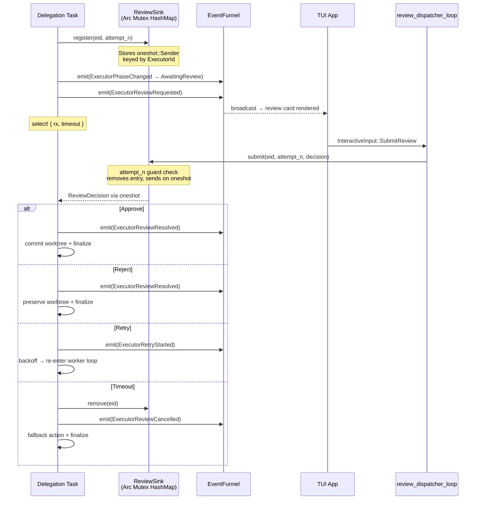

### Ordering Invariant

**Register-before-emit**: `ReviewSink::register()` MUST complete before `ExecutorReviewRequested` is emitted. This guarantees a fast TUI `SubmitReview` always finds a registered oneshot sender.

### attempt_n Guard

The `ReviewSink` stores `(attempt_n, oneshot::Sender)` per `ExecutorId`. A `submit()` call with a mismatched `attempt_n` is dropped with a `warn!` log — this catches stale decisions from superseded review cards.

### Cancellation Paths

| Trigger | Action |
|---|---|
| Review timeout | `review_sink.remove()` + emit `ExecutorReviewCancelled` |
| Brain call cancelled (oneshot receiver dropped) | `cleanup_cancelled_review()` — emit cancel + remove |
| Sender dropped (race) | Treated as timeout |

---

## 9. Notification Flow

Two distinct notification paths exist, determined by transport type. This is the most subtle part of the architecture.

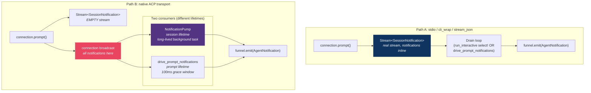

### Which Path Is Used Where?

| Context | Brain (interactive) | Brain (adhoc) | Worker |
|---|---|---|---|
| **stdio/cli_wrap** | Path A: inline `select!` in `run_interactive` | Path A: `drive_prompt_notifications` | Path A: `drive_prompt_notifications` |
| **native ACP** | Path B: pump (session-lifetime) | Path B: `drive_prompt_notifications` | Path B: `drive_prompt_notifications` |

### Coupled Invariant

> Any transport whose `subscribe_session_notifications()` returns `Some(...)` MUST return an empty `Stream` from `prompt()`.

This prevents double-emission. Only `NativeAcpConnection` participates in the pump path.

### drive_prompt_notifications Detail

A `biased select!` loop with 4 arms:

1. **Resolve prompt future** → produces the compat stream
2. **Drain compat stream** → real for stdio, empty for native
3. **Drain broadcast** → real for native, `None` for stdio
4. **Grace window** → 100ms after stream closes, flush stragglers

### ExtNotification Path (Separate)

`_spur/*` vendor-extension notifications flow through a separate channel:

```
connection.take_ext_notification_rx() → mpsc::Receiver<ExtNotificationPayload>
  → tokio::spawn consumer task
    → spur_ext_interp::interpret(payload, brain_session_id, executor_id, &funnel)
      → funnel.emit(WorkerHeartbeat | WorkerProgress | WorkerFileTouched)
```

---

## 10. Concurrency Model

### Task Spawn Tree

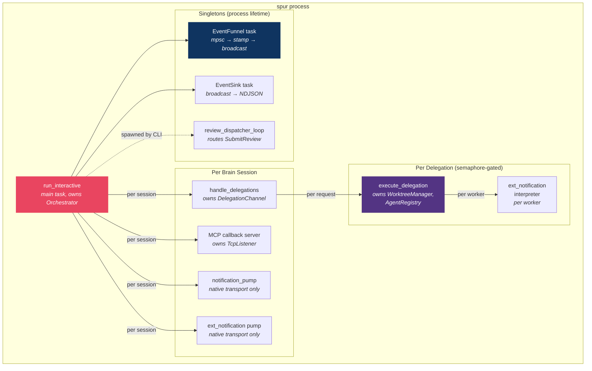

### Channel Inventory

| Channel | Type | Capacity | Direction | Lifetime |
|---|---|---|---|---|
| `user_input_rx` | `mpsc` | bounded | TUI → Orchestrator | process |
| funnel mpsc | `mpsc::unbounded` | ∞ | emitters → funnel task | process |
| `event_tx` | `broadcast` | 4096 | funnel → subscribers | process |
| `delegation_channel` | `mpsc` | bounded | MCP server → `handle_delegations` | per brain session |
| `respond_to` | `oneshot` | 1 | delegation task → MCP server | per delegation |
| review oneshot | `oneshot` | 1 | `ReviewSink` → delegation task | per review gate |
| `notif_rx` | `broadcast` | varies | connection → pump | per brain session |
| `ext_rx` | `mpsc::unbounded` | ∞ | connection → ext pump | per connection |

### Concurrency Primitives

| Primitive | Location | Purpose |
|---|---|---|
| `Semaphore(max_concurrent)` | `handle_delegations` | Gate concurrent worker count |
| `Arc<Mutex<HashMap>>` | `ReviewSink` | Route review decisions to waiting delegation tasks |
| `AtomicU64` | `EventFunnel` | Monotonic sequence counter |
| `OnceLock<HashMap>` | `skills/mod.rs` | Lazy-init bundled SKILL.md cache |
| `broadcast::channel(4096)` | `Orchestrator::new` | Event fan-out |

### Critical Concurrency Invariants

1. **Funnel serialization** — All events pass through one mpsc → one task → one broadcast. This is the linearization point.
2. **Semaphore-gated delegation** — `max_concurrent` workers. Permit acquired before worktree creation, released on task exit (RAII).
3. **DelegationGuard RAII** — Drop impl emits `DelegationCompleted(Failed)` on panic/cancellation.
4. **Register-before-emit** — `ReviewSink.register()` completes before `ExecutorReviewRequested` is emitted.
5. **Pre-subscribe-before-session** — Broadcast receiver subscribed BEFORE `new_session`/`load_session` to avoid missing notifications during async setup.

---

## 11. Orchestrator God Object Analysis

The `Orchestrator` struct is a 4,400-line god object containing 7 distinct responsibilities. This section maps every method to its subsystem.

### Method Inventory (~40 methods)

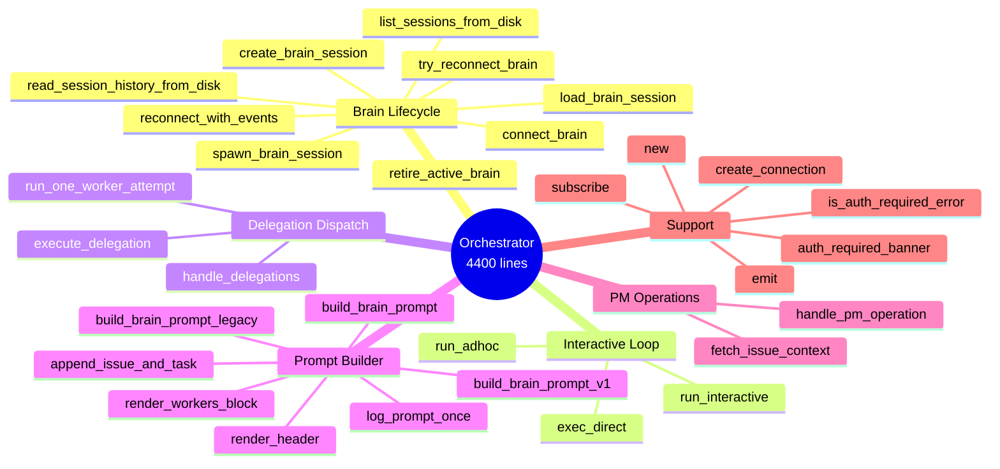

### Struct Fields

```rust
pub struct Orchestrator {
    pub registry: AgentRegistry,           // Agent config lookup
    pub config: SpurConfig,                // Full TOML config
    pub worktrees: WorktreeManager,        // Git worktree lifecycle
    pub cost_tracker: Option<CostTracker>, // SQLite cost DB
    pub event_tx: broadcast::Sender<SpurEvent>,  // Broadcast sender
    event_seq: Arc<AtomicU64>,             // Seq counter (funnel owns write end)
    funnel: FunnelHandle,                  // S2 funnel handle (Clone)
    pub review_sink: ReviewSink,           // Review routing (Clone)
    repo_root: PathBuf,                    // Project root
}
```

### Why It's a God Object

| Indicator | Evidence |
|---|---|
| Multiple responsibilities | 7 distinct subsystems in one struct |
| High method count | ~40 methods |
| Mixed abstraction levels | `emit()` (1 line) alongside `execute_delegation()` (~400 lines) |
| Difficult to test | `run_interactive` requires full TUI channel setup |
| Change amplification | Modifying review logic requires understanding delegation dispatch |

### Recommended Decomposition

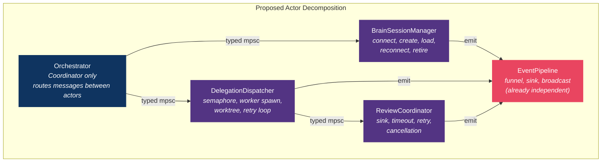

---

## 12. Architectural Assessment

### Strengths

| Strength | Evidence |
|---|---|
| **Event sourcing done right** | Funnel→broadcast→projection pipeline is textbook CQRS/ES. Replay-purity invariant enforced by code and tests. Session resume is just event replay. |
| **Shared-nothing delegation** | Each delegation task creates own `WorktreeManager` + `AgentRegistry`. Only shared state: funnel (append-only) + review_sink (register/submit). Embarrassingly parallel. |
| **RAII safety net** | `DelegationGuard` ensures every delegation emits exactly one `DelegationCompleted` — even on panic, cancellation, or early return. |
| **Dual-channel separation** | ACP (SPUR controls execution) + MCP (brain has autonomy). Brain can't directly spawn workers — must go through MCP tools. |
| **Graceful degradation** | Circuit breaker on brain reconnect. Non-fatal cost tracker. Non-fatal event sink (log-and-drop on disk-full). Non-fatal `set_session_mode` (L2 auto-approve fallback). |
| **Transport abstraction** | Dual notification path (stream vs broadcast) cleanly abstracts stdio vs native ACP without leaking transport details to the orchestrator. |

### Risks & Technical Debt

| Risk | Severity | Status | Detail |
|---|---|---|---|
| God Object (4400 lines, 7 responsibilities) | **High** | Open | Single struct owns brain lifecycle, delegation dispatch, review coordination, prompt construction, PM ops, interactive loop |
| Fire-and-forget `tokio::spawn` for ext-notification pumps | **Medium** | Open | Stale events emitted after executor completion. No JoinHandle tracking. |
| Unbounded funnel mpsc | **Low** | Open | Under sustained load (1600 evt/s), memory grows without bound. Broadcast provides subscriber backpressure but not emitter backpressure. |
| Legacy adapter technical debt | **Low** | Open | Keys off `worker_session` not stable `executor_id`. `DelegationRequested` task_spec population is best-effort. Marked for removal when orchestrator emits `ExecutorSpawned` directly. |
| Broadcast `Lagged` recovery not implemented | **Low** | Open | Lagged events are logged but lineage is not rebuilt from NDJSON. |

### Key Metrics

| Metric | Value |
|---|---|
| Total source lines | ~12,000 |
| Orchestrator lines | ~4,400 (37% of crate) |
| Source modules | 11 files + 6 SKILL.md |
| Public re-exports (lib.rs) | 15 types |
| `tokio::spawn` sites | ~12 |
| Channel types used | 6 (mpsc, unbounded mpsc, broadcast, oneshot × 2 contexts) |
| `SpurEventBody` variants | ~25 |
| Concurrency primitives | Semaphore, Mutex, AtomicU64, OnceLock |
| Orphan buffer cap | 128 events per executor |
| Stream buffer cap | 200 entries per executor |
| Event sink rotation | 128 MB |
| Broadcast capacity | 4096 events |

### End-to-End Data Flow Summary

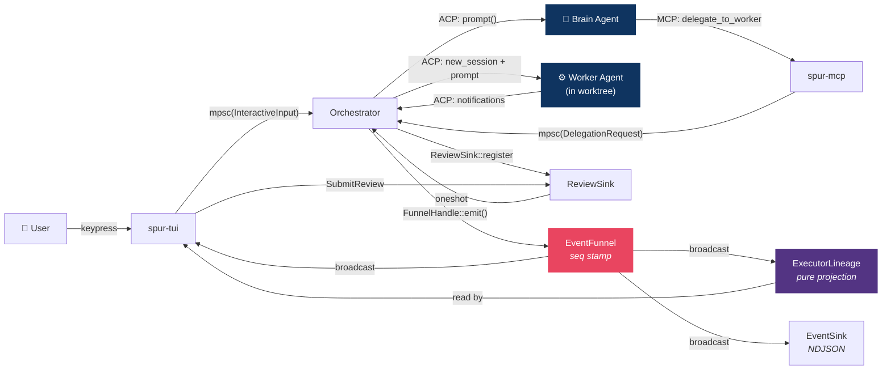
