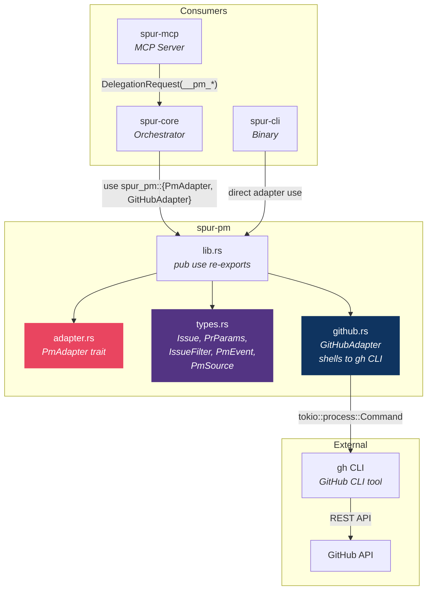
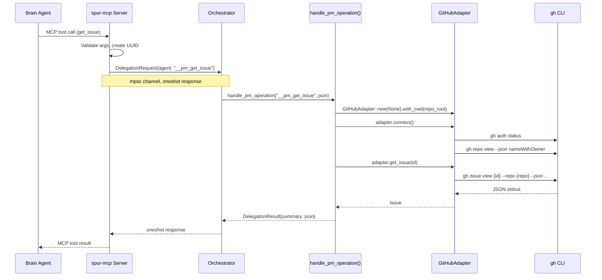
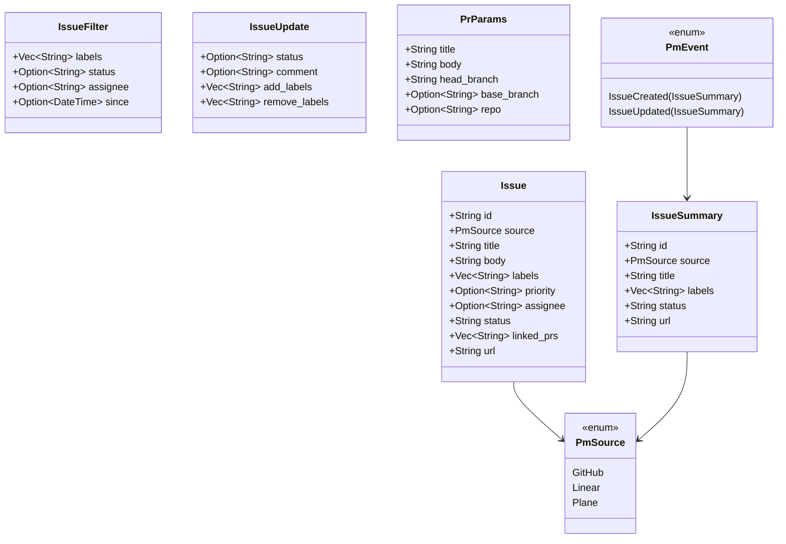
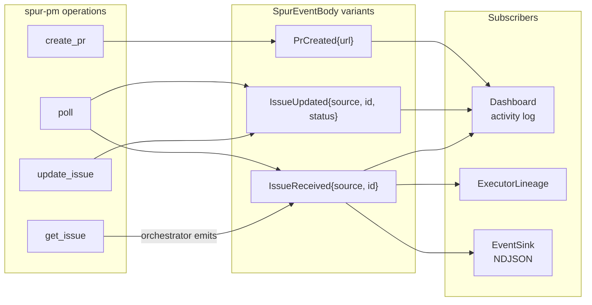
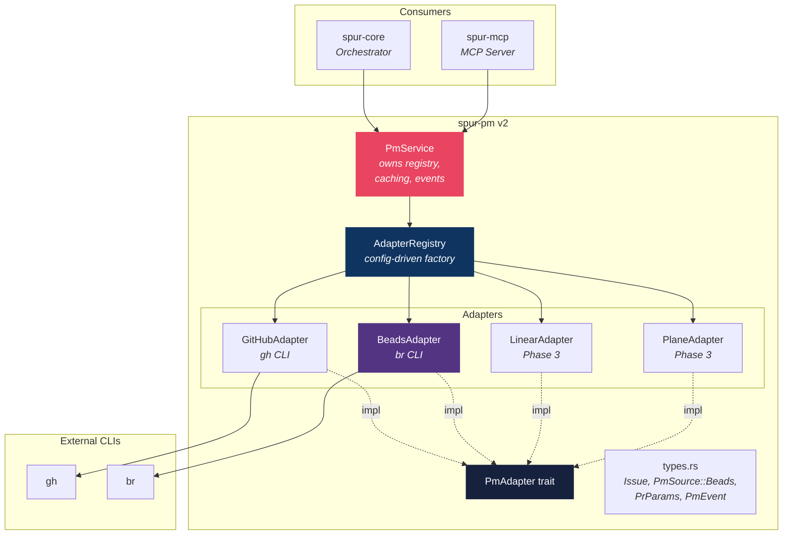
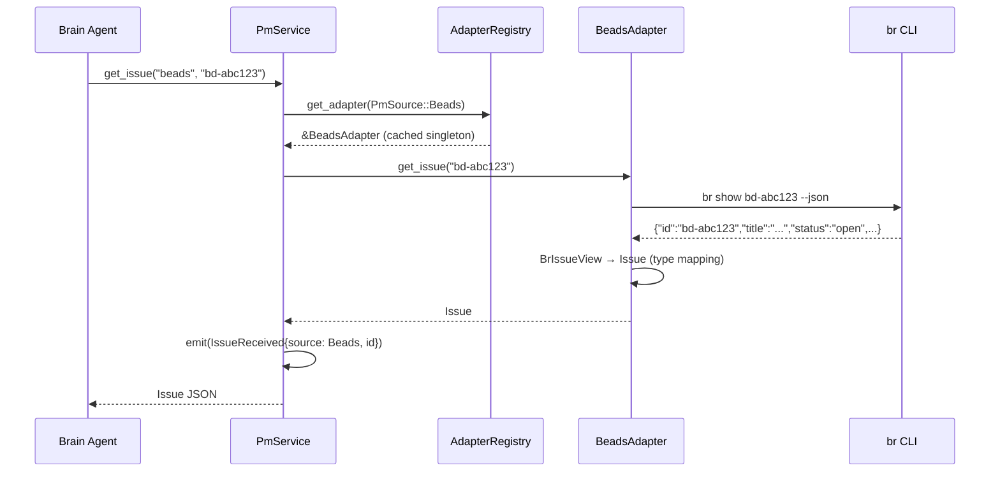
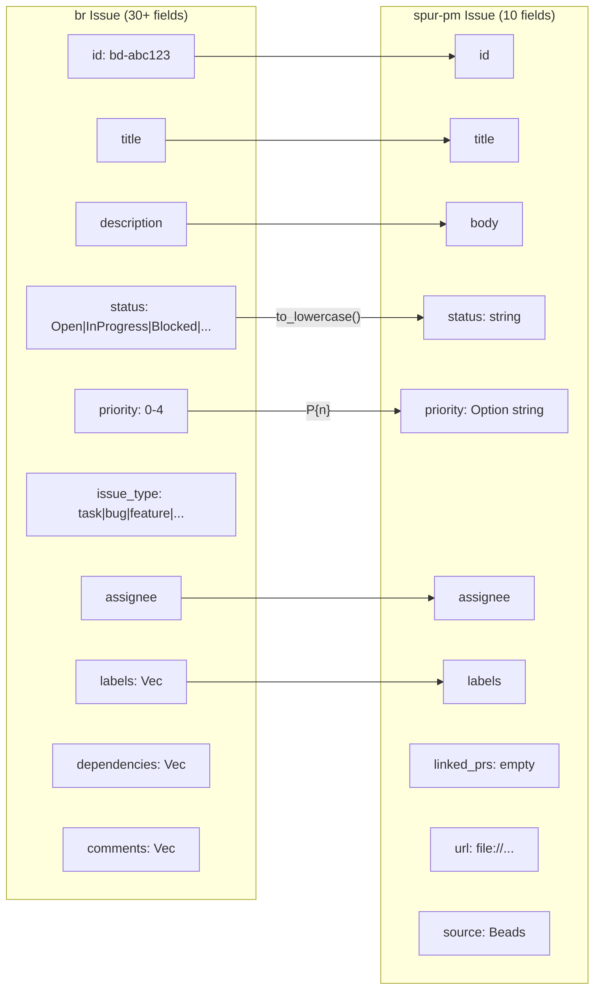
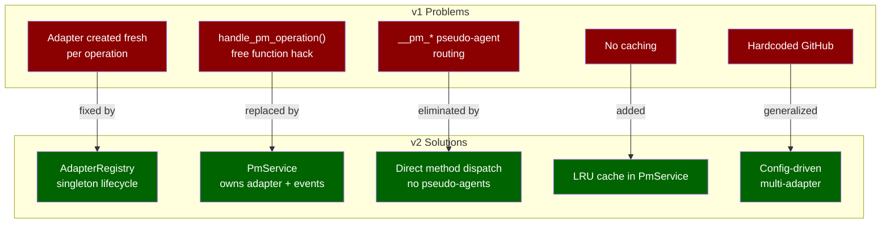

# spur-pm Detailed Architecture

> Produced 2026-04-16. Covers current state, beads_rust integration evaluation, and recommended v2 architecture.

## 1. Current Architecture (v1)

### 1.1 Crate Overview

`spur-pm` is a ~2k-line support service crate providing project management adapters. It sits at the leaf of the dependency graph — consumed by `spur-core` (Orchestrator) and `spur-mcp` (MCP Server), with no reverse dependencies.



### 1.2 File Map

| File | Lines | Responsibility |
|---|---|---|
| `lib.rs` | 7 | Re-exports: `PmAdapter`, `GitHubAdapter`, `types::*` |
| `adapter.rs` | 25 | `PmAdapter` trait — 6 async methods |
| `types.rs` | 72 | `Issue`, `IssueSummary`, `IssueFilter`, `IssueUpdate`, `PrParams`, `PmEvent`, `PmSource` |
| `github.rs` | 400 | `GitHubAdapter` — shells to `gh` CLI, JSON deser, `From` impls |

### 1.3 PmAdapter Trait

```rust
#[async_trait]
pub trait PmAdapter: Send + Sync {
    async fn connect(&mut self) -> Result<()>;
    async fn get_issue(&self, id: &str) -> Result<Issue>;
    async fn list_issues(&self, filter: IssueFilter) -> Result<Vec<IssueSummary>>;
    async fn update_issue(&self, id: &str, update: IssueUpdate) -> Result<()>;
    async fn create_pr(&self, params: PrParams) -> Result<String>;
    async fn poll(&self) -> Result<Vec<PmEvent>>;
}
```

### 1.4 Data Flow — MCP → PM Operation



### 1.5 Type Model



### 1.6 Event Bus Integration

PM operations emit events through `SpurEventBody` variants:



---

## 2. beads_rust Integration Evaluation

### 2.1 What is beads_rust?

A local-first, non-invasive issue tracker storing tasks in SQLite with JSONL export for git collaboration. ~20k lines of Rust, CLI binary `br`.

| Aspect | Detail |
|---|---|
| Crate type | Binary only (`[[bin]] name = "br"`) |
| Edition | 2024 (requires Rust nightly 1.88+) |
| Storage | SQLite (via `fsqlite` pure-Rust fork) + JSONL |
| Build dep | Requires sibling `frankensqlite` checkout |
| License | MIT with OpenAI/Anthropic rider |
| Contributions | Not accepted |
| JSON API | `--json` flag on all commands |
| PR support | None (local issue tracker only) |

### 2.2 MCTS Strategy Evaluation

Five integration strategies evaluated with weighted scoring (Feasibility ×3, Pattern alignment ×2, Maintenance ×2, Performance ×1, Type safety ×1):

```mermaid
bar
    title Integration Strategy Scores (max 90)
    "A: Direct lib dep" : 30
    "B: CLI shelling" : 74
    "C: MCP bridge" : 42
    "D: JSONL file" : 49
    "E: Hybrid" : 46
```

| Strategy | Feasibility | Pattern | Maintenance | Perf | Safety | Total |
|---|---|---|---|---|---|---|
| A: Direct lib dep | 2 | 3 | 1 | 9 | 7 | **30** |
| B: CLI shelling | 9 | 10 | 8 | 5 | 6 | **74** ✅ |
| C: MCP bridge | 5 | 4 | 4 | 6 | 5 | **42** |
| D: JSONL file | 7 | 2 | 6 | 8 | 4 | **49** |
| E: Hybrid | 6 | 3 | 5 | 7 | 5 | **46** |

**Winner: CLI shelling** — identical pattern to GitHubAdapter→`gh`, zero build coupling, `br --json` is the stable public API.

### 2.3 PmAdapter Method Mapping

| PmAdapter method | br command | Notes |
|---|---|---|
| `connect()` | `br version` | Verify binary exists, `.beads/` initialized |
| `get_issue(id)` | `br show {id} --json` | Full issue with 30+ fields |
| `list_issues(filter)` | `br list --json --status {s} --label {l}` | Supports priority range filters |
| `update_issue(id, update)` | `br update` + `br comments add` + `br label add/remove` | Multiple commands for compound updates |
| `create_pr(params)` | ❌ Not supported | Returns `Err("beads_rust does not support PR creation")` |
| `poll()` | `br list --json --status open` | Client-side `since` filtering |

### 2.4 Integration Verdict

```
✅ RECOMMENDED — CLI shelling strategy
⚠️  PARTIAL — no PR support (fundamental, acceptable)
⚠️  REQUIRES — br binary installed on host
✅ ZERO build coupling (no nightly, no frankensqlite)
✅ IDENTICAL pattern to existing GitHubAdapter
```

---

## 3. Recommended Architecture (v2)

### 3.1 Component Diagram



### 3.2 New File Layout

```
crates/spur-pm/src/
├── lib.rs              # Re-exports
├── adapter.rs          # PmAdapter trait (unchanged)
├── types.rs            # +PmSource::Beads
├── registry.rs         # NEW: AdapterRegistry (config → adapter factory)
├── service.rs          # NEW: PmService (caching, event emission)
├── github.rs           # GitHubAdapter (existing)
└── beads.rs            # NEW: BeadsAdapter (shells to br CLI)
```

### 3.3 BeadsAdapter Data Flow



### 3.4 Type Mapping: br → spur-pm



### 3.5 Architectural Deficiencies Addressed



### 3.6 Config Integration

```toml
# .spur/config.toml

[pm.github]
repo = "owner/repo"

[pm.beads]
workspace = "."          # path to .beads/ directory
auto_sync = false        # run `br sync --flush-only` after mutations
```

### 3.7 PmSource Enum Extension

```rust
#[derive(Debug, Clone, PartialEq, Eq, Serialize, Deserialize)]
#[serde(rename_all = "lowercase")]
pub enum PmSource {
    GitHub,
    Linear,
    Plane,
    Beads,  // NEW
}
```

---

## 4. Risk Matrix

| Risk | Severity | Mitigation |
|---|---|---|
| `br` binary not installed | Medium | `connect()` returns clear error with install URL |
| `br --json` schema changes | Medium | Pin to known version, integration tests |
| No PR support in beads | Low | Brain agent handles error, uses GitHub for PRs |
| `br` process spawn latency | Low | Local SQLite, ~5ms per invocation |
| `.beads/` not initialized | Low | `connect()` checks, returns actionable error |
| Poll floods on first call | Medium | Same as GitHubAdapter — return all as IssueCreated |
| Nightly toolchain infection | N/A | CLI shelling avoids entirely |

---

## 5. Implementation Priority

1. **BeadsAdapter** — `beads.rs` implementing PmAdapter via `br` CLI shelling (~200 lines)
2. **PmSource::Beads** — Add variant to enum, update serde (~5 lines)
3. **AdapterRegistry** — Config-driven factory replacing hardcoded GitHubAdapter (~100 lines)
4. **PmService** — Replace `handle_pm_operation()` free function (~150 lines)
5. **MCP routing cleanup** — Remove `__pm_*` pseudo-agent hack, route through PmService directly
