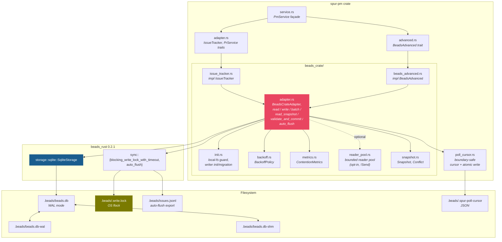
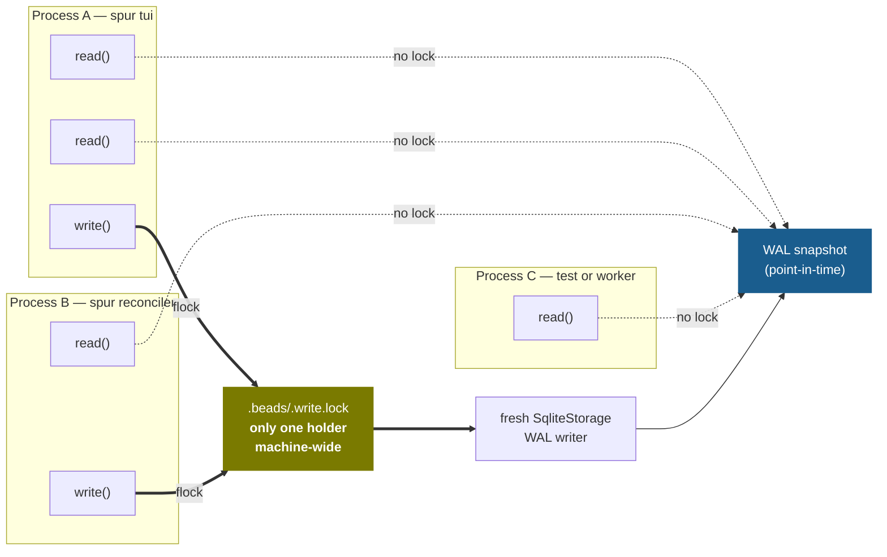
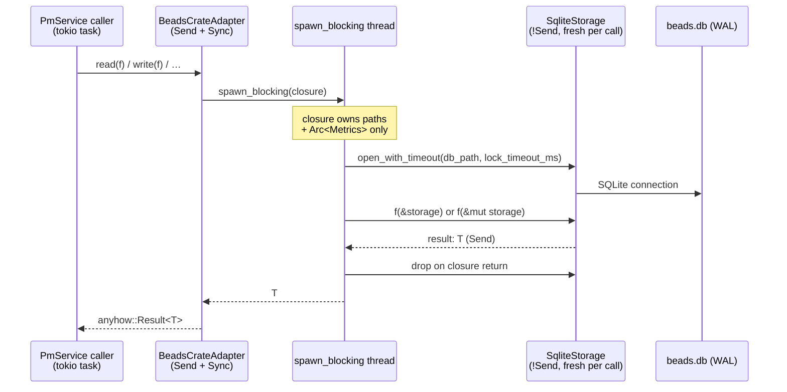
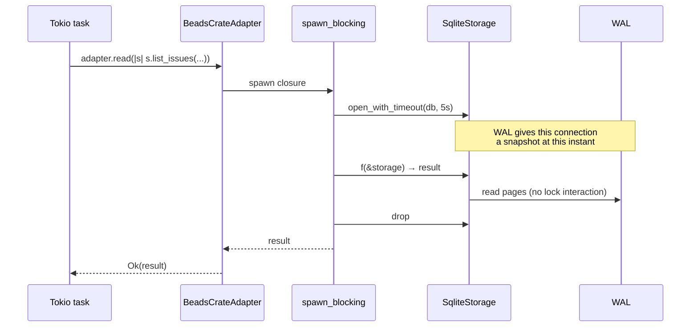
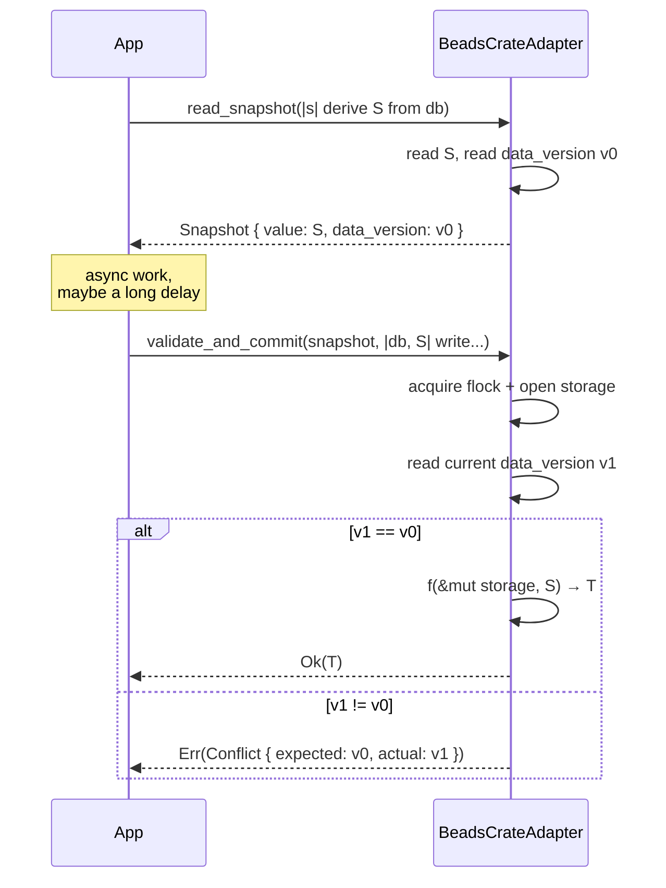
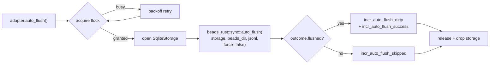
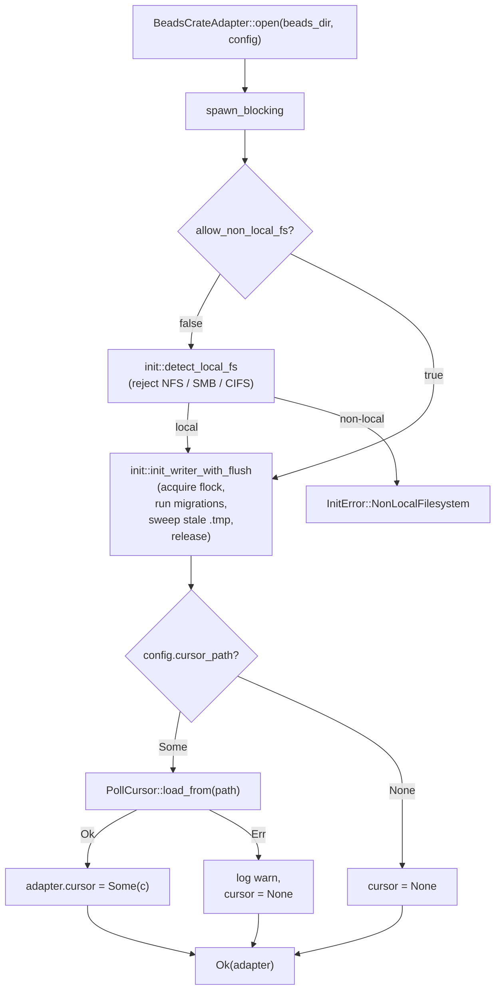
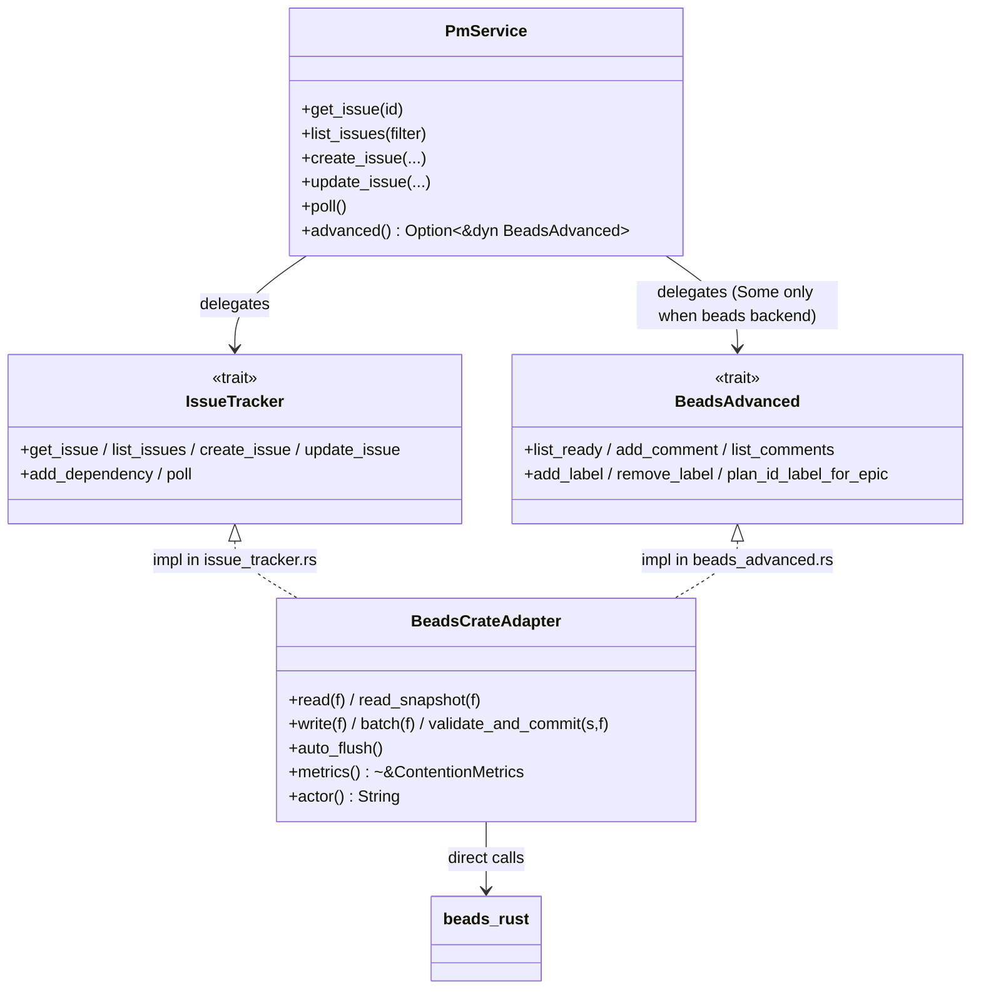
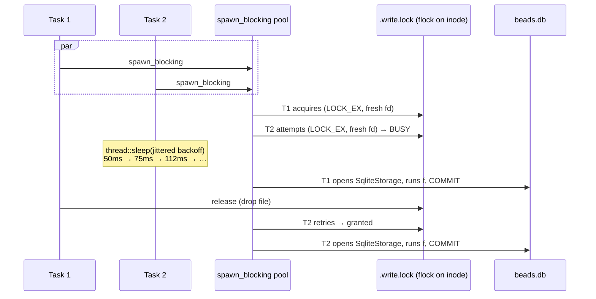
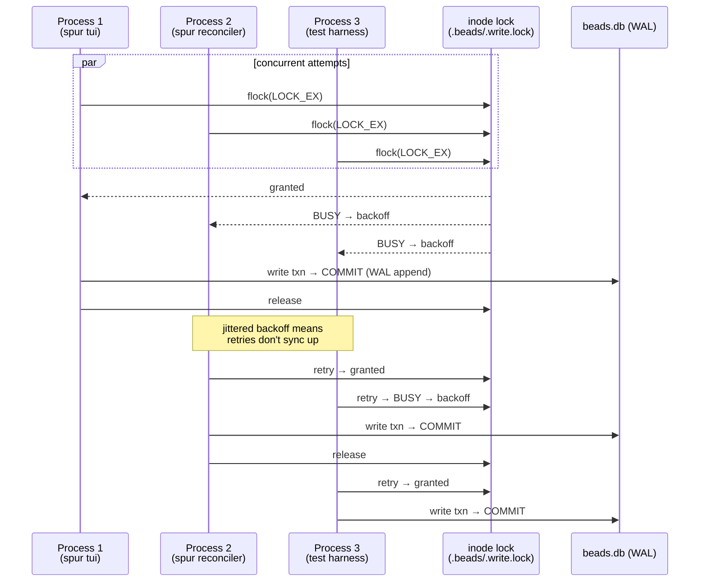

# BeadsCrateAdapter Architecture

> Produced 2026-05-06. Documents the direct-linkage `beads_rust` integration introduced in Section F (`docs/superpowers/plans/2026-05-05-beads_rust-direct-crate-adapter.md`). Supersedes the legacy CLI-shellout `BeadsAdapter` documented in `spur-pm-architecture.md` §1.

## 1. Why

The legacy `BeadsAdapter` shelled out to the `br` CLI for every PmService call (`Command::new("br")` → spawn → JSON parse → exit). Per-call cost was ~50 ms and the CLI took its own SQLite write lock for the duration of the invocation, so a busy reconciler produced a steady stream of brief writer-lock holds. Concurrent spur instances racing on `recover_persisted_plans` would intermittently lose the race and surface as `SQLITE_BUSY → "Failed to start MCP callback server"`.

`BeadsCrateAdapter` links `beads_rust` 0.2.1 directly, eliminates the subprocess hop, and replaces ad-hoc CLI locking with a documented WAL + flock concurrency contract.

## 2. Module Layout



`BeadsCrateAdapter` is the only thing that touches `beads_rust` directly. Trait implementations (`IssueTracker`, `BeadsAdvanced`) sit on top and translate between spur PM types and beads_rust's storage API.

## 3. Concurrency Model

The contract: **N concurrent readers across any processes, plus at most one concurrent writer machine-wide**, with snapshot isolation between them. This is the canonical SQLite-WAL guarantee, made cross-process by the `.write.lock` flock.



Readers never acquire the flock. They open a fresh `SqliteStorage`, take a WAL snapshot, run their query, drop the connection. Multiple readers + the active writer all see consistent point-in-time views without mutual blocking. Writers serialize on the flock; the second writer blocks (with backoff retry) until the first releases.

### 3.1 Why "open-fresh-per-call"

`beads_rust` 0.2.1's `SqliteStorage` wraps `fsqlite`, which uses `Rc<RefCell<…>>` internally and is therefore `!Send`. The storage handle cannot cross thread boundaries, which rules out caching it in the adapter struct (the adapter is `Send + Sync` because it has to live inside `Arc<PmService>` shared across the tokio multi-thread runtime).

The chosen shape — store paths/config in the adapter, open a connection inside each `spawn_blocking` closure, drop it on return — is identical to `beads_rust`'s own MCP module. The closure result must be `Send`, but the storage itself never crosses threads.



The trade-off is per-call connection setup cost (~hundreds of microseconds), accepted because it removes the `!Send` constraint from every consumer of the adapter.

## 4. The Five Core Methods

```
┌─────────────────────────┬──────────┬────────────────────────────────────────┐
│ Method                  │ Flock    │ Purpose                                │
├─────────────────────────┼──────────┼────────────────────────────────────────┤
│ read(f)                 │ —        │ Lock-free single-shot read.            │
│ read_snapshot(f)        │ —        │ Read + capture data_version for CAS.   │
│ write(f)                │ acquire  │ Single mutation under flock.           │
│ batch(f)                │ acquire  │ Multiple mutations under one flock.    │
│                         │          │ Each call inside f is atomic; the      │
│                         │          │ batch as a whole is not a transaction. │
│ validate_and_commit(s,f)│ acquire  │ CAS write — fails with Conflict if     │
│                         │          │ data_version moved since snapshot s.   │
│ auto_flush()            │ acquire  │ Idempotent JSONL re-export. No-op if   │
│                         │          │ nothing dirty. NOT re-entrant.         │
└─────────────────────────┴──────────┴────────────────────────────────────────┘
```

### 4.1 Read sequence



### 4.2 Write sequence (with cross-process contention)

```mermaid
sequenceDiagram
    participant TA as Task A (process P1)
    participant TB as Task B (process P2)
    participant FL as .beads/.write.lock<br/>(OS flock)
    participant SA as SqliteStorage A
    participant DB as beads.db

    par Both attempt to write
        TA->>FL: blocking_write_lock_with_timeout(5s)
        TB->>FL: blocking_write_lock_with_timeout(5s)
    end
    FL-->>TA: granted
    FL-->>TB: BUSY → backoff (jittered exp, 50ms…2s, ceiling 10s)
    TA->>SA: open_with_timeout(db, 5s)
    TA->>SA: f(&mut storage)
    SA->>DB: BEGIN; UPDATE…; COMMIT (WAL append)
    TA->>SA: drop
    TA->>FL: release
    Note over TB: backoff completes,<br/>retry acquire
    TB->>FL: granted
    TB->>SA: open + f + drop
    TB->>FL: release
```

Backoff parameters (defaults in `backoff.rs`):
- initial 50 ms, factor 1.5, jitter ±25 %, max step 2 s, ceiling 10 s
- ceiling exceeded ⇒ `incr_ceiling()` and `bail!("write lock acquisition exceeded ceiling")` — surface upstream rather than block forever.

### 4.3 Snapshot CAS sequence

`read_snapshot` + `validate_and_commit` implement optimistic concurrency for "read, decide, then commit if state hasn't moved" patterns.



**Caveat — `data_version` is currently a count proxy.** `beads_rust` 0.2.1 does not expose `PRAGMA data_version`. `read_data_version` in `adapter.rs` calls `count_issues()` instead. This catches net add/delete between snapshot and commit (covering "delete iff still present"-style invariants used by `IssueTracker` mutations) but **misses pure field updates that don't change row count**. Callers requiring strict equality must layer their own version field for now. **Tracked: `bd-nhkt` — "Expose PRAGMA data_version to complete BeadsCrateAdapter CAS contract"** (see issue body for the full proxy-vs-real comparison and remediation plan).

### 4.4 auto_flush



`auto_flush` exports the latest mutations to `issues.jsonl` for git-friendly diffs. It is **idempotent** (no-op if nothing is dirty) and **not re-entrant** — calling it from inside a `write()` or `batch()` closure deadlocks on the same flock, because the flock is not re-entrant within a single process.

## 5. Open-Time Initialization



Migrations are run under the same `.write.lock` flock used by writes, so concurrent first-opens from two processes serialize through the migration step — covered by the multi-process test `concurrent_first_open_serializes_via_migration_lock`.

The local-fs check rejects known network mounts because `flock(2)` semantics are unreliable on NFS/SMB/CIFS — without it, two processes on different machines could simultaneously believe they hold the lock. Set `allow_non_local_fs = true` to override.

## 6. Cursor Persistence

`PollCursor` (in `poll_cursor.rs`, separate from the `beads_crate/` module) tracks the per-poll boundary as `(ts, ids_at_boundary)` — see the comment block in that file for the boundary-replay rationale. Persistence is **atomic via tmp + rename**:

```mermaid
sequenceDiagram
    participant Adapter
    participant FS as Filesystem

    Adapter->>FS: write {cursor.json}.tmp
    FS-->>Adapter: ok
    Adapter->>FS: rename tmp → cursor.json
    Note over FS: POSIX rename is atomic;<br/>concurrent reader sees<br/>old file or new file,<br/>never half-written
    FS-->>Adapter: ok
    alt rename fails
        Adapter->>FS: remove tmp
    end
```

Loaded once at `open()` if `config.cursor_path` is set; rewritten after every successful `poll()` (in `issue_tracker.rs`). Backwards-compatible with bare RFC3339 timestamps from the legacy adapter.

## 7. Reader Pool (Optional, !Send)

`reader_pool.rs` provides bounded reader-connection reuse for callers that can stay on a single thread (current-thread runtime, `LocalSet`, or a dedicated worker thread). It exists because per-call open is cheap but not free, and high-throughput read paths can amortize the cost. **Not used by the default `read()` path** — the default path takes the `spawn_blocking` cost in exchange for `Send` guarantees. Adopt the pool only after profiling demonstrates the open-cost matters.

## 8. Metrics

`ContentionMetrics` (atomic counters, `metrics.rs`) is incremented inline by every method:

| Counter                       | Bumped when                                                |
|-------------------------------|------------------------------------------------------------|
| `read_total`                  | every `read` / `read_snapshot`                             |
| `write_total`                 | every successful `write` / `validate_and_commit` / `batch` |
| `write_error_total`           | write closure returned `Err`                               |
| `lock_busy_total`             | flock acquisition retried                                  |
| `lock_ceiling_total`          | flock acquisition gave up after ceiling                    |
| `lock_wait_total_us`          | cumulative time spent waiting for flock                    |
| `conflict_total`              | `validate_and_commit` saw moved data_version               |
| `conflict_exhausted_total`    | CAS retry loop gave up                                     |
| `auto_flush_skipped_total`    | `auto_flush` saw nothing dirty                             |
| `auto_flush_dirty_total`      | `auto_flush` had work to do                                |
| `auto_flush_success_total`    | `auto_flush` completed                                     |
| `tmp_sweep_removed_total`     | init removed N stale `.tmp` files                          |

Surface these via the existing PmService metrics endpoint to monitor cross-process contention in production.

## 9. Trait Layering



`PmService::advanced()` returns `Some(&dyn BeadsAdvanced)` only for the beads-backed variant. The GitHub backend returns `None` — adaptive-plan-repair features that depend on `BeadsAdvanced` are gated on this.

## 10. v1 → v2 Comparison

|                          | v1 — `BeadsAdapter` (CLI shellout)         | v2 — `BeadsCrateAdapter` (direct linkage) |
|--------------------------|---------------------------------------------|--------------------------------------------|
| Source                   | `crates/spur-pm/src/beads.rs` (deleted T27c)| `crates/spur-pm/src/beads_crate/`          |
| Per-call cost            | ~50 ms (spawn + JSON parse + exit)          | <1 ms (in-process function call)           |
| Concurrency primitive    | Implicit via CLI's own SQLite locking       | Explicit `.write.lock` flock + WAL         |
| Reader/writer isolation  | Cooperative; CLI holds writer lock per call | WAL snapshot isolation, lock-free reads    |
| Cross-process safety     | Best-effort (CLI per-call retries)          | Documented contract, multi-process tested  |
| Backoff on contention    | None                                        | Jittered exponential, configurable ceiling |
| Snapshot CAS             | Not available                               | `read_snapshot` + `validate_and_commit`    |
| Idempotent JSONL flush   | Manual via CLI                              | `auto_flush()` with `outcome.flushed` gate |
| Cursor persistence       | RFC3339 timestamp only                      | Boundary-safe `(ts, ids)` + atomic rename  |
| Failure mode under load  | Intermittent `SQLITE_BUSY` from CLI         | Bounded backoff with ceiling + metrics     |

## 11. Test Coverage Anchor

End-to-end behavioral guarantees live in:

- `crates/spur-pm/src/beads_crate/{adapter,issue_tracker,beads_advanced,backoff,snapshot,init}.rs` — unit tests
- `crates/spur-pm/tests/beads_crate_multiprocess.rs` — three multi-process scenarios:
  - `concurrent_writes_no_corruption` — N writer processes contending on the same `.beads/`
  - `concurrent_first_open_serializes_via_migration_lock` — racing first-opens through migrations
  - `snapshot_conflict_detected` — `read_snapshot` followed by an external write surfaces `Conflict` from `validate_and_commit`

These are the load-bearing checks that Section F's concurrency contract holds; treat any breakage as a regression of this document's claims.

## 12. Operational Notes

- A stale spur binary that still calls `br` (e.g., installed before Section F landed) will fight a v2 spur process for the writer lock and lose to it via `SQLITE_BUSY`. Rebuild + reinstall after pulling main.
- `auto_flush()` is idempotent and cheap; call it on quiesce points (before reading by another tool, after a logical batch) rather than on every mutation.
- Do not call `auto_flush()` from inside a `write()` / `batch()` closure — same-process flock is not re-entrant and will deadlock until the timeout fires.
- Monitor `lock_ceiling_total` and `conflict_exhausted_total` in production. Non-zero values mean either pathological contention or a stuck holder; check `lsof .beads/beads.db` for the culprit.

## 13. FAQ — Common Concurrency Scenarios

### 13.1 Concurrent reads from multiple spur instances

**Correctness: no issues.** Every `read()` / `read_snapshot()` opens a fresh `SqliteStorage`, captures a WAL snapshot at open time, runs the closure, drops the connection. No flock, no shared adapter state. WAL guarantees snapshot isolation across any number of readers plus the active writer.

Operational caveats worth knowing:

- **fd budget per process** — each in-flight read consumes one fd on `beads.db` + one on `-wal` + one on `-shm`. macOS soft limit is 256 by default; bounded in practice by tokio's `spawn_blocking` pool concurrency. Pathological burst-read load is the only failure mode.
- **WAL checkpoint backpressure** — SQLite cannot checkpoint while any connection holds a read transaction. Our open-fresh-per-call shape closes the connection immediately, so checkpointing keeps up. Long-running snapshots (which we don't have) would let `-wal` grow unboundedly.
- **NFS/SMB/CIFS** — rejected by `init::detect_local_fs`. WAL relies on mmap+shared memory, which corrupts silently on non-local filesystems. Override with `allow_non_local_fs = true` only if you know the deployment is safe.

**Net: multi-instance read = free, parallel, snapshot-isolated.**

### 13.2 Multiple writes within a single spur process

Two tokio tasks both call `adapter.write(f)`:



Key facts:

- `flock(2)` on macOS and Linux locks the **inode**, not the fd. Two fds in the same process opened against the same file still exclude each other.
- The flock is **not re-entrant within the same process** (see the docstring on `auto_flush` in `adapter.rs`). Calling `auto_flush()` from inside `write()` self-deadlocks until the timeout fires.
- Two in-process tasks contending serialize correctly. The waiter sleeps on a `spawn_blocking` thread — that pool is dedicated to blocking work, not a tokio runtime worker, so the sleep does not stall async tasks.
- Backoff ceiling is 10 s. If you have so many in-process writers that one exceeds 10 s of waiting, you have a design problem; `lock_ceiling_total` surfaces it.

**Net: in-process multi-write = serialized, with bounded jittered-backoff queue.**

### 13.3 Multiple writes across multiple spur instances

Same primitive, same answer. `flock(2)` is OS-level — works identically across processes because the lock is on the inode, not on any per-process state.



Multi-instance-specific caveats:

- **`data_version` is currently `count_issues()` proxy, not `PRAGMA data_version`.** Two instances both doing read+CAS on the same field with no row-count change won't conflict-detect — both succeed, last-write-wins. Doesn't corrupt the DB; does mean optimistic-CAS on pure field updates is best-effort. Most plan-engine mutations are structural (add task / set status / close), so this is acceptable in practice but worth knowing when designing new CAS flows. **Tracked: `bd-nhkt`.**
- **Backoff ceiling = 10 s default.** Under heavy contention (e.g., three reconcilers polling every 100 ms on the same `.beads/`), tail latency climbs and a few attempts may exceed ceiling. Watch `lock_ceiling_total` + `lock_wait_total_us`.
- **Stale-binary contention.** A spur build that predates Section F shells out to `br` for every reconciler tick. Each shellout opens its own writer connection and competes for the same flock; v2 instances will see periodic `SQLITE_BUSY` until the legacy process exits. Mitigation: rebuild + reinstall.

**Net: multi-instance multi-write = serialized correctly via the same flock primitive; field-level CAS is best-effort due to the count proxy.**

## 14. Known Gaps & Follow-ups

| Gap | Impact | Tracked |
|-----|--------|---------|
| `data_version` is a `count_issues()` proxy — pure field updates and same-count mutations don't conflict-detect in `validate_and_commit`. | Field-level optimistic CAS is best-effort; last-write-wins on same-count races. Structural mutations (add/delete/close) are unaffected. | **`bd-nhkt`** — Expose `PRAGMA data_version` upstream in `beads_rust` (preferred) or vendor a parallel-connection helper as a bridge. Closes the last open gap in the v2 CAS contract. |
